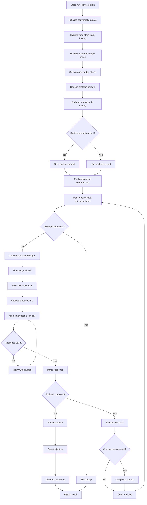
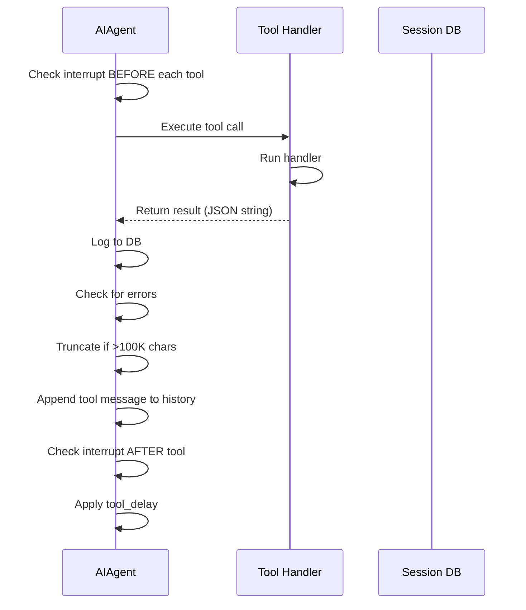
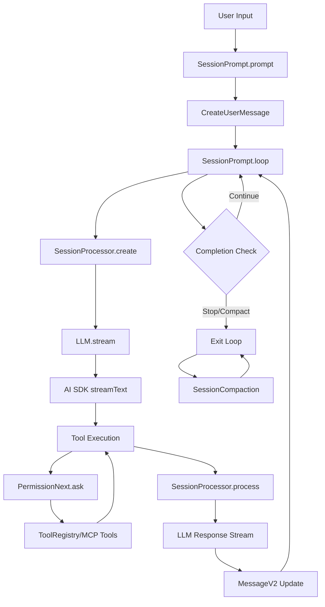
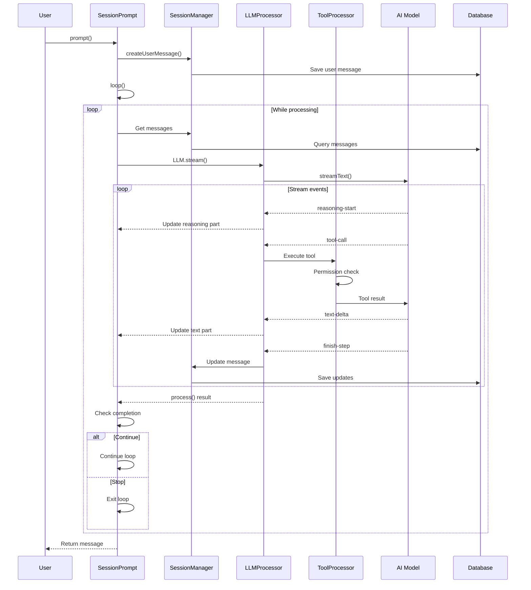
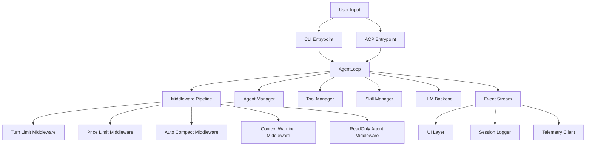
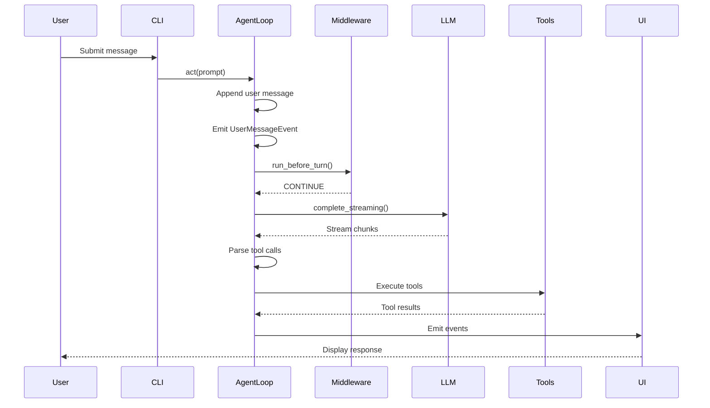
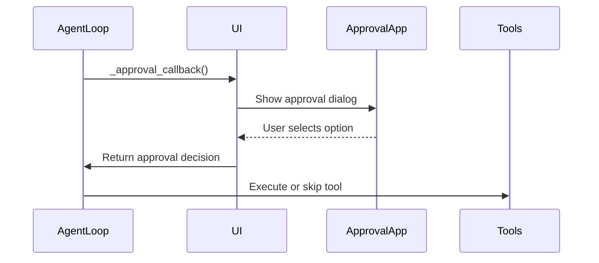
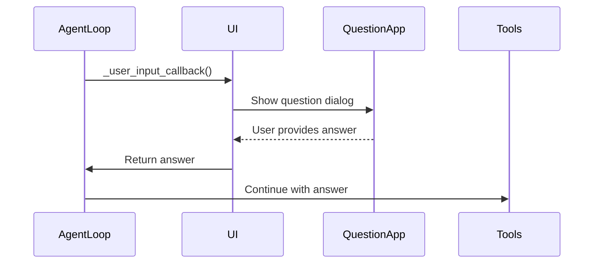

# Codex Agentic Loop Documentation

## Overview

This document provides a comprehensive analysis of the Codex agentic loop implementation, including all components, events, and UI layer interactions.

## Architecture Overview

The Codex system is built around a core agentic loop that processes user submissions and generates agent responses through a model-in-the-loop approach. The architecture follows a queue-based pattern with two main channels:

- **Submission Channel** (`tx_sub` / `rx_sub`): Receives operations from clients
- **Event Channel** (`tx_event` / `rx_event`): Emits events to clients

### Core Components

```
┌─────────────────────────────────────────────────────────────────────────────┐
│                              Codex System                                    │
├─────────────────────────────────────────────────────────────────────────────┤
│                                                                             │
│  ┌──────────────┐     ┌──────────────┐     ┌──────────────┐                │
│  │   Client     │────▶│   Codex      │────▶│   Model      │                │
│  │              │◀────│   Core       │◀────│   Client     │                │
│  └──────────────┘     └──────────────┘     └──────────────┘                │
│                         │         │                                         │
│                         │         ▼                                         │
│                         │    ┌──────────────┐                              │
│                         │    │   Tools      │                              │
│                         │    │   (MCP, etc) │                              │
│                         │    └──────────────┘                              │
│                         │         │                                         │
│                         │         ▼                                         │
│                         │    ┌──────────────┐                              │
│                         │    │   Rollout    │                              │
│                         │    │   Recorder   │                              │
│                         │    └──────────────┘                              │
│                         │         │                                         │
│                         │         ▼                                         │
│                         │    ┌──────────────┐                              │
│                         │    │   Sandbox    │                              │
│                         │    │   (Seatbelt) │                              │
│                         │    └──────────────┘                              │
│                         │                                                   │
│                         ▼                                                   │
│                  ┌──────────────┐                                          │
│                  │   Session    │                                          │
│                  │   State      │                                          │
│                  └──────────────┘                                          │
│                                                                             │
└─────────────────────────────────────────────────────────────────────────────┘
```

## Main Entry Points

### 1. [`codex-rs/core/src/codex.rs`](codex-rs/core/src/codex.rs)

The [`Codex`](codex-rs/core/src/codex.rs:323) struct is the high-level interface to the Codex system:

```rust
pub struct Codex {
    pub(crate) tx_sub: Sender<Submission>,
    pub(crate) rx_event: Receiver<Event>,
    pub(crate) agent_status: watch::Receiver<AgentStatus>,
    pub(crate) session: Arc<Session>,
}
```

### 2. [`codex-rs/core/src/codex.rs`](codex-rs/core/src/codex.rs:3822)

The [`submission_loop`](codex-rs/core/src/codex.rs:3822) is the main dispatcher that processes incoming operations:

```rust
async fn submission_loop(sess: Arc<Session>, config: Arc<Config>, rx_sub: Receiver<Submission>)
```

### 3. [`codex-rs/core/src/codex.rs`](codex-rs/core/src/codex.rs:5121)

The [`run_turn`](codex-rs/core/src/codex.rs:5121) function is the core agentic loop that handles model interaction:

```rust
pub(crate) async fn run_turn(
    sess: Arc<Session>,
    turn_context: Arc<TurnContext>,
    input: Vec<UserInput>,
    prewarmed_client_session: Option<ModelClientSession>,
    cancellation_token: CancellationToken,
) -> Option<String>
```

## The Agentic Loop Flow

### Phase 1: Turn Initialization

1. **Turn Started Event**: Emits [`EventMsg::TurnStarted`](codex-rs/protocol/src/protocol.rs:1072)
2. **Pre-sampling Compaction**: Runs auto-compaction if context is too large
3. **Context Building**: Collects MCP tools, skills, plugins, and connectors
4. **Skill/Plugin Injections**: Builds skill and plugin items for the prompt
5. **User Prompt Recording**: Records the user input and emits [`ItemStarted`](codex-rs/protocol/src/protocol.rs:1215) / [`ItemCompleted`](codex-rs/protocol/src/protocol.rs:1216) events

### Phase 2: Model Sampling Loop

The main loop repeatedly:

1. **Builds Sampling Request**: Constructs the input from conversation history
2. **Runs Sampling Request**: Calls the model via [`ModelClient`](codex-rs/core/src/client.rs)
3. **Processes Response**: Handles the model's response (tool calls or assistant message)
4. **Compaction Check**: If token limit reached and model needs follow-up, runs compaction and continues
5. **Completion Check**: If model indicates no follow-up needed, exits loop

### Phase 3: Turn Completion

1. **Hook Execution**: Dispatches [`HookEvent::AfterAgent`](codex-rs/hooks/src/lib.rs) hooks
2. **Final Agent Message**: Returns the last agent message
3. **Turn Complete Event**: Emits [`EventMsg::TurnComplete`](codex-rs/protocol/src/protocol.rs:1077)

## Event System

### Event Types

The system uses a tagged enum [`EventMsg`](codex-rs/protocol/src/protocol.rs:1043) to represent all possible events:

#### Agent Lifecycle Events

| Event | Description |
|-------|-------------|
| [`TurnStarted`](codex-rs/protocol/src/protocol.rs:1072) | Agent has started a turn |
| [`TurnComplete`](codex-rs/protocol/src/protocol.rs:1077) | Agent has completed all actions |
| [`TurnAborted`](codex-rs/protocol/src/protocol.rs:1202) | Turn was aborted/interrupted |

#### Message Events

| Event | Description |
|-------|-------------|
| [`AgentMessage`](codex-rs/protocol/src/protocol.rs:1084) | Agent text output message |
| [`AgentMessageDelta`](codex-rs/protocol/src/protocol.rs:1090) | Agent text output delta (streaming) |
| [`AgentMessageContentDelta`](codex-rs/protocol/src/protocol.rs:1218) | Agent message content delta |
| [`UserMessage`](codex-rs/protocol/src/protocol.rs:1087) | User/system input message |

#### Reasoning Events

| Event | Description |
|-------|-------------|
| [`AgentReasoning`](codex-rs/protocol/src/protocol.rs:1093) | Agent reasoning event |
| [`AgentReasoningDelta`](codex-rs/protocol/src/protocol.rs:1096) | Agent reasoning delta |
| [`AgentReasoningRawContent`](codex-rs/protocol/src/protocol.rs:1099) | Raw chain-of-thought |
| [`AgentReasoningRawContentDelta`](codex-rs/protocol/src/protocol.rs:1102) | Raw reasoning delta |
| [`AgentReasoningSectionBreak`](codex-rs/protocol/src/protocol.rs:1104) | New reasoning section |

#### Tool Execution Events

| Event | Description |
|-------|-------------|
| [`ExecCommandBegin`](codex-rs/protocol/src/protocol.rs:1131) | About to execute a command |
| [`ExecCommandOutputDelta`](codex-rs/protocol/src/protocol.rs:1134) | Command output chunk |
| [`ExecCommandEnd`](codex-rs/protocol/src/protocol.rs:1139) | Command execution finished |
| [`TerminalInteraction`](codex-rs/protocol/src/protocol.rs:1137) | Terminal stdin/stdout interaction |
| [`PatchApplyBegin`](codex-rs/protocol/src/protocol.rs:1172) | About to apply a code patch |
| [`PatchApplyEnd`](codex-rs/protocol/src/protocol.rs:1175) | Code patch application finished |

#### MCP Events

| Event | Description |
|-------|-------------|
| [`McpStartupUpdate`](codex-rs/protocol/src/protocol.rs:1113) | MCP startup progress |
| [`McpStartupComplete`](codex-rs/protocol/src/protocol.rs:1116) | MCP startup finished |
| [`McpToolCallBegin`](codex-rs/protocol/src/protocol.rs:1118) | MCP tool call started |
| [`McpToolCallEnd`](codex-rs/protocol/src/protocol.rs:1120) | MCP tool call finished |
| [`McpListToolsResponse`](codex-rs/protocol/src/protocol.rs:1183) | List of available MCP tools |

#### Web Search Events

| Event | Description |
|-------|-------------|
| [`WebSearchBegin`](codex-rs/protocol/src/protocol.rs:1122) | Web search started |
| [`WebSearchEnd`](codex-rs/protocol/src/protocol.rs:1124) | Web search finished |

#### Image Events

| Event | Description |
|-------|-------------|
| [`ImageGenerationBegin`](codex-rs/protocol/src/protocol.rs:1126) | Image generation started |
| [`ImageGenerationEnd`](codex-rs/protocol/src/protocol.rs:1128) | Image generation finished |
| [`ViewImageToolCall`](codex-rs/protocol/src/protocol.rs:1142) | View image tool call |

#### Approval Events

| Event | Description |
|-------|-------------|
| [`ExecApprovalRequest`](codex-rs/protocol/src/protocol.rs:1144) | Request to approve command execution |
| [`ApplyPatchApprovalRequest`](codex-rs/protocol/src/protocol.rs:1154) | Request to approve code patch |
| [`ElicitationRequest`](codex-rs/protocol/src/protocol.rs:1152) | MCP server elicitation request |
| [`RequestUserInput`](codex-rs/protocol/src/protocol.rs:1146) | Request for user input |

#### Dynamic Tool Events

| Event | Description |
|-------|-------------|
| [`DynamicToolCallRequest`](codex-rs/protocol/src/protocol.rs:1148) | Dynamic tool call request |
| [`DynamicToolCallResponse`](codex-rs/protocol/src/protocol.rs:1150) | Dynamic tool call response |

#### Session Events

| Event | Description |
|-------|-------------|
| [`SessionConfigured`](codex-rs/protocol/src/protocol.rs:1107) | Session configuration acknowledged |
| [`ThreadNameUpdated`](codex-rs/protocol/src/protocol.rs:1110) | Thread name updated |
| [`TokenCount`](codex-rs/protocol/src/protocol.rs:1081) | Token usage information |
| [`ModelReroute`](codex-rs/protocol/src/protocol.rs:1061) | Model routing changed |

#### Context Events

| Event | Description |
|-------|-------------|
| [`ContextCompacted`](codex-rs/protocol/src/protocol.rs:1064) | Conversation history compacted |
| [`ThreadRolledBack`](codex-rs/protocol/src/protocol.rs:1067) | Thread rolled back |

#### Plan Events

| Event | Description |
|-------|-------------|
| [`PlanUpdate`](codex-rs/protocol/src/protocol.rs:1200) | Plan update |
| [`PlanDelta`](codex-rs/protocol/src/protocol.rs:1219) | Plan delta (streaming) |

#### Review Events

| Event | Description |
|-------|-------------|
| [`EnteredReviewMode`](codex-rs/protocol/src/protocol.rs:1208) | Entered review mode |
| [`ExitedReviewMode`](codex-rs/protocol/src/protocol.rs:1211) | Exited review mode |

#### Response Events

| Event | Description |
|-------|-------------|
| [`RawResponseItem`](codex-rs/protocol/src/protocol.rs:1213) | Raw response item |
| [`ItemStarted`](codex-rs/protocol/src/protocol.rs:1215) | Item started |
| [`ItemCompleted`](codex-rs/protocol/src/protocol.rs:1216) | Item completed |

#### Realtime Events

| Event | Description |
|-------|-------------|
| [`RealtimeConversationStarted`](codex-rs/protocol/src/protocol.rs:1052) | Realtime conversation started |
| [`RealtimeConversationRealtime`](codex-rs/protocol/src/protocol.rs:1055) | Realtime streaming payload |
| [`RealtimeConversationClosed`](codex-rs/protocol/src/protocol.rs:1058) | Realtime conversation closed |

#### Collaboration Events

| Event | Description |
|-------|-------------|
| [`CollabAgentSpawnBegin`](codex-rs/protocol/src/protocol.rs:1224) | Collaboration agent spawn begin |
| [`CollabAgentSpawnEnd`](codex-rs/protocol/src/protocol.rs:1226) | Collaboration agent spawn end |
| [`CollabAgentInteractionBegin`](codex-rs/protocol/src/protocol.rs:1228) | Collaboration agent interaction begin |
| [`CollabAgentInteractionEnd`](codex-rs/protocol/src/protocol.rs:1230) | Collaboration agent interaction end |
| [`CollabWaitingBegin`](codex-rs/protocol/src/protocol.rs:1232) | Collaboration waiting begin |
| [`CollabWaitingEnd`](codex-rs/protocol/src/protocol.rs:1234) | Collaboration waiting end |
| [`CollabCloseBegin`](codex-rs/protocol/src/protocol.rs:1236) | Collaboration close begin |
| [`CollabCloseEnd`](codex-rs/protocol/src/protocol.rs:1238) | Collaboration close end |
| [`CollabResumeBegin`](codex-rs/protocol/src/protocol.rs:1240) | Collaboration resume begin |
| [`CollabResumeEnd`](codex-rs/protocol/src/protocol.rs:1242) | Collaboration resume end |

#### Utility Events

| Event | Description |
|-------|-------------|
| [`Error`](codex-rs/protocol/src/protocol.rs:1045) | Error event |
| [`Warning`](codex-rs/protocol/src/protocol.rs:1049) | Warning event |
| [`StreamError`](codex-rs/protocol/src/protocol.rs:1168) | Stream error event |
| [`BackgroundEvent`](codex-rs/protocol/src/protocol.rs:1160) | Background event |
| [`DeprecationNotice`](codex-rs/protocol/src/protocol.rs:1158) | Deprecation notice |
| [`TurnDiff`](codex-rs/protocol/src/protocol.rs:1177) | Turn diff (unified diff) |
| [`UndoStarted`](codex-rs/protocol/src/protocol.rs:1162) | Undo started |
| [`UndoCompleted`](codex-rs/protocol/src/protocol.rs:1164) | Undo completed |
| [`GetHistoryEntryResponse`](codex-rs/protocol/src/protocol.rs:1180) | History entry response |
| [`ListCustomPromptsResponse`](codex-rs/protocol/src/protocol.rs:1186) | Custom prompts list |
| [`ListSkillsResponse`](codex-rs/protocol/src/protocol.rs:1189) | Skills list |
| [`ListRemoteSkillsResponse`](codex-rs/protocol/src/protocol.rs:1192) | Remote skills list |
| [`RemoteSkillDownloaded`](codex-rs/protocol/src/protocol.rs:1195) | Remote skill downloaded |
| [`SkillsUpdateAvailable`](codex-rs/protocol/src/protocol.rs:1198) | Skills update available |
| [`ShutdownComplete`](codex-rs/protocol/src/protocol.rs:1205) | Shutdown complete |

## Operations (Op)

Operations are client requests that drive the agent's behavior:

### User Input Operations

| Operation | Description |
|-----------|-------------|
| [`UserInput`](codex-rs/protocol/src/protocol.rs:198) | Legacy user input |
| [`UserTurn`](codex-rs/protocol/src/protocol.rs:208) | Full turn with context |

### Control Operations

| Operation | Description |
|-----------|-------------|
| [`Interrupt`](codex-rs/protocol/src/protocol.rs:177) | Abort current task |
| [`CleanBackgroundTerminals`](codex-rs/protocol/src/protocol.rs:180) | Terminate background terminals |
| [`Shutdown`](codex-rs/protocol/src/protocol.rs:446) | Shut down codex instance |

### Realtime Operations

| Operation | Description |
|-----------|-------------|
| [`RealtimeConversationStart`](codex-rs/protocol/src/protocol.rs:183) | Start realtime conversation |
| [`RealtimeConversationAudio`](codex-rs/protocol/src/protocol.rs:186) | Send audio input |
| [`RealtimeConversationText`](codex-rs/protocol/src/protocol.rs:189) | Send text input |
| [`RealtimeConversationClose`](codex-rs/protocol/src/protocol.rs:192) | Close realtime conversation |

### Context Operations

| Operation | Description |
|-----------|-------------|
| [`OverrideTurnContext`](codex-rs/protocol/src/protocol.rs:264) | Override turn context settings |

### Approval Operations

| Operation | Description |
|-----------|-------------|
| [`ExecApproval`](codex-rs/protocol/src/protocol.rs:315) | Approve command execution |
| [`PatchApproval`](codex-rs/protocol/src/protocol.rs:326) | Approve code patch |
| [`ResolveElicitation`](codex-rs/protocol/src/protocol.rs:334) | Resolve MCP elicitation |
| [`UserInputAnswer`](codex-rs/protocol/src/protocol.rs:351) | Answer user input request |
| [`DynamicToolResponse`](codex-rs/protocol/src/protocol.rs:359) | Respond to dynamic tool |

### Utility Operations

| Operation | Description |
|-----------|-------------|
| [`AddToHistory`](codex-rs/protocol/src/protocol.rs:370) | Add to history |
| [`GetHistoryEntryRequest`](codex-rs/protocol/src/protocol.rs:376) | Get history entry |
| [`ListMcpTools`](codex-rs/protocol/src/protocol.rs:380) | List MCP tools |
| [`RefreshMcpServers`](codex-rs/protocol/src/protocol.rs:383) | Refresh MCP servers |
| [`ReloadUserConfig`](codex-rs/protocol/src/protocol.rs:389) | Reload user config |
| [`ListCustomPrompts`](codex-rs/protocol/src/protocol.rs:392) | List custom prompts |
| [`ListSkills`](codex-rs/protocol/src/protocol.rs:395) | List skills |
| [`ListRemoteSkills`](codex-rs/protocol/src/protocol.rs:408) | List remote skills |
| [`DownloadRemoteSkill`](codex-rs/protocol/src/protocol.rs:415) | Download remote skill |
| [`Compact`](codex-rs/protocol/src/protocol.rs:420) | Compact conversation |
| [`DropMemories`](codex-rs/protocol/src/protocol.rs:423) | Drop memories |
| [`UpdateMemories`](codex-rs/protocol/src/protocol.rs:426) | Update memories |
| [`SetThreadName`](codex-rs/protocol/src/protocol.rs:431) | Set thread name |
| [`Undo`](codex-rs/protocol/src/protocol.rs:434) | Undo turn |
| [`ThreadRollback`](codex-rs/protocol/src/protocol.rs:440) | Rollback turns |
| [`Review`](codex-rs/protocol/src/protocol.rs:443) | Request code review |
| [`RunUserShellCommand`](codex-rs/protocol/src/protocol.rs:453) | Run shell command |
| [`ListModels`](codex-rs/protocol/src/protocol.rs:459) | List models |

## UI Layer Interactions

### Event-Driven UI Updates

The UI layer subscribes to the event channel and updates based on event types:

1. **Streaming Updates**: Events like [`AgentMessageDelta`](codex-rs/protocol/src/protocol.rs:1090), [`PlanDelta`](codex-rs/protocol/src/protocol.rs:1219), and [`ReasoningContentDelta`](codex-rs/protocol/src/protocol.rs:1220) provide incremental updates for streaming UI components.

2. **Status Updates**: [`TurnStarted`](codex-rs/protocol/src/protocol.rs:1072) and [`TurnComplete`](codex-rs/protocol/src/protocol.rs:1077) events drive the agent status indicator.

3. **Approval Prompts**: [`ExecApprovalRequest`](codex-rs/protocol/src/protocol.rs:1144), [`ApplyPatchApprovalRequest`](codex-rs/protocol/src/protocol.rs:1154), and [`ElicitationRequest`](codex-rs/protocol/src/protocol.rs:1152) trigger approval UI components.

4. **Progress Indicators**: [`McpStartupUpdate`](codex-rs/protocol/src/protocol.rs:1113), [`WebSearchBegin`](codex-rs/protocol/src/protocol.rs:1122), and [`ExecCommandBegin`](codex-rs/protocol/src/protocol.rs:1131) events drive progress indicators.

### Submission Flow

```
┌─────────────┐     ┌─────────────┐     ┌─────────────┐
│   Client    │────▶│   Codex     │────▶│   Session   │
│   UI        │     │   Core      │     │   State     │
└─────────────┘     └─────────────┘     └─────────────┘
      │                   │
      │                   ▼
      │            ┌─────────────┐
      │            │   Model     │
      │            │   Client    │
      │            └─────────────┘
      │                   │
      ▼                   ▼
┌─────────────┐     ┌─────────────┐
│   Events    │◀────│   Events    │
│   Stream    │     │   Channel   │
└─────────────┘     └─────────────┘
```

## State Management

### Session State

The [`Session`](codex-rs/core/src/codex.rs:700) struct maintains the session state:

```rust
pub(crate) struct Session {
    pub(crate) conversation: Conversation,
    pub(crate) conversation_id: ThreadId,
    pub(crate) state: Arc<Mutex<SessionState>>,
    pub(crate) active_turn: Arc<Mutex<Option<ActiveTurn>>>,
    pub(crate) services: Arc<SessionServices>,
    pub(crate) features: ManagedFeatures,
    pub(crate) js_repl: Arc<JsReplHandle>,
    pub(crate) rollout: Arc<Mutex<Option<RolloutRecorder>>>,
    pub(crate) hooks: Hooks,
    pub(crate) unified_exec_manager: UnifiedExecProcessManager,
    pub(crate) mcp_startup_cancellation_token: Arc<Mutex<CancellationToken>>,
    pub(crate) show_raw_agent_reasoning: bool,
}
```

### Turn Context

The [`TurnContext`](codex-rs/core/src/codex.rs:1250) struct contains all context needed for a turn:

```rust
pub(crate) struct TurnContext {
    pub(crate) sub_id: String,
    pub(crate) trace_id: Option<String>,
    pub(crate) realtime_active: bool,
    pub(crate) config: Arc<Config>,
    pub(crate) auth_manager: Option<Arc<AuthManager>>,
    pub(crate) model_info: ModelInfo,
    pub(crate) session_telemetry: SessionTelemetry,
    pub(crate) provider: ModelProviderInfo,
    pub(crate) reasoning_effort: ReasoningEffort,
    pub(crate) reasoning_summary: ReasoningSummary,
    pub(crate) session_source: SessionSource,
    pub(crate) cwd: PathBuf,
    pub(crate) current_date: Option<String>,
    pub(crate) timezone: Option<String>,
    pub(crate) app_server_client_name: Option<String>,
    pub(crate) developer_instructions: Option<DeveloperInstructions>,
    pub(crate) user_instructions: Arc<UserInstructions>,
    pub(crate) compact_prompt: Option<String>,
    pub(crate) collaboration_mode: CollaborationMode,
    pub(crate) personality: Personality,
    pub(crate) approval_policy: Constrained<AskForApproval>,
    pub(crate) sandbox_policy: Constrained<SandboxPolicy>,
    pub(crate) file_system_sandbox_policy: FileSystemSandboxPolicy,
    pub(crate) network_sandbox_policy: NetworkSandboxPolicy,
    pub(crate) network: Option<NetworkProxy>,
    pub(crate) windows_sandbox_level: WindowsSandboxLevel,
    pub(crate) shell_environment_policy: ShellEnvironmentPolicy,
    pub(crate) tools_config: ToolsConfig,
    pub(crate) features: ManagedFeatures,
    pub(crate) ghost_snapshot: GhostSnapshotConfig,
    pub(crate) final_output_json_schema: Option<Option<Value>>,
    pub(crate) codex_linux_sandbox_exe: Option<PathBuf>,
    pub(crate) tool_call_gate: Arc<ReadinessFlag>,
    pub(crate) truncation_policy: TruncationPolicy,
    pub(crate) js_repl: Arc<JsReplHandle>,
    pub(crate) dynamic_tools: Vec<DynamicToolSpec>,
    pub(crate) turn_metadata_state: Arc<TurnMetadataState>,
    pub(crate) turn_skills: TurnSkillsContext,
    pub(crate) turn_timing_state: Arc<TurnTimingState>,
}
```

## Key Implementation Details

### 1. Turn Diff Tracker

The [`TurnDiffTracker`](codex-rs/core/src/turn_diff_tracker.rs) tracks changes made during a turn for undo functionality.

### 2. Compaction

Auto-compaction is triggered when:
- Token usage exceeds the model's auto-compact limit
- The model indicates it needs follow-up

### 3. Ghost Snapshots

Ghost snapshots enable undo functionality by capturing the state before a turn.

### 4. MCP Integration

MCP servers are managed via [`McpConnectionManager`](codex-rs/core/src/mcp_connection_manager.rs) and provide tools to the agent.

### 5. Sandbox

The sandbox is implemented via [`Seatbelt`](codex-rs/core/src/seatbelt.rs) on Linux and [`WindowsSandbox`](codex-rs/core/src/windows_sandbox.rs) on Windows.

## Conclusion

The Codex agentic loop is a sophisticated system that:

1. Processes user submissions through a queue-based architecture
2. Maintains conversation state across turns
3. Supports tool execution via MCP and built-in tools
4. Provides streaming updates to the UI layer
5. Implements auto-compaction for context management
6. Supports undo via ghost snapshots
7. Enforces sandboxing for safe execution

The event-driven architecture allows for flexible UI implementations that can respond to different types of events in real-time.

# Hermes Agent Agentic Loop - Complete Analysis

## Overview

This document provides a comprehensive analysis of the Hermes Agent's agentic loop implementation, including all components, events, and UI interactions.

## Core Architecture

### Main Entry Point: [`run_agent.py`](run_agent.py)

The primary agentic loop is implemented in the [`AIAgent`](run_agent.py:142) class, with the core conversation loop in the [`run_conversation()`](run_agent.py:2860) method.

```
┌─────────────────────────────────────────────────────────────────────┐
│                         AIAgent Class                                │
│                                                                      │
│  ┌──────────────────────────────────────────────────────────────┐  │
│  │  __init__() - Agent Initialization                            │  │
│  │  - Load environment variables                                 │  │
│  │  - Initialize OpenAI client                                   │  │
│  │  - Load tool definitions                                      │  │
│  │  - Build system prompt cache                                  │  │
│  │  - Initialize context compressor                              │  │
│  │  - Setup memory/honcho integration                            │  │
│  └──────────────────────────────────────────────────────────────┘  │
│                                                                      │
│  ┌──────────────────────────────────────────────────────────────┐  │
│  │  run_conversation() - Main Agentic Loop                       │  │
│  │  - Initialize conversation state                              │  │
│  │  - Build system prompt                                        │  │
│  │  - Pre-flight context compression                             │  │
│  │  ┌────────────────────────────────────────────────────────┐  │  │
│  │  │  WHILE api_call_count < max_iterations:                │  │  │
│  │  │    1. Check interrupt                                   │  │  │
│  │  │    2. Build API messages                                │  │  │
│  │  │    3. Apply prompt caching                              │  │  │
│  │  │    4. Make API call (interruptible)                     │  │  │
│  │  │    5. Process response                                  │  │  │
│  │  │    6. Handle tool calls                                 │  │  │
│  │  │    7. Check compression                                 │  │  │
│  │  │    8. Save session log                                  │  │  │
│  │  └────────────────────────────────────────────────────────┘  │  │
│  └──────────────────────────────────────────────────────────────┘  │
└─────────────────────────────────────────────────────────────────────┘
```

---

## Component Analysis

### 1. AIAgent Class Initialization ([`__init__()`](run_agent.py:150))

#### Key Initialization Steps:

| Step | Component | Purpose |
|------|-----------|---------|
| 1 | Environment Loading | Loads `~/.hermes/.env` or project `.env` |
| 2 | OpenAI Client | Initializes client with API key, base URL, headers |
| 3 | Tool Discovery | Calls [`get_tool_definitions()`](model_tools.py:164) to load available tools |
| 4 | System Prompt Cache | Initializes `_cached_system_prompt` for prefix caching |
| 5 | Context Compressor | Sets up [`ContextCompressor`](agent/context_compressor.py) for context management |
| 6 | Memory Store | Initializes [`MemoryStore`](tools/memory_tool.py) for persistent memory |
| 7 | Honcho Integration | Sets up cross-session user modeling |
| 8 | Session Logging | Creates session ID and log file in `~/.hermes/sessions/` |

#### Configuration Parameters:

```python
AIAgent(
    model: str = "anthropic/claude-opus-4.6",
    max_iterations: int = 90,           # Shared with subagents
    tool_delay: float = 1.0,            # Delay between tool calls
    enabled_toolsets: List[str] = None, # Toolset filtering
    disabled_toolsets: List[str] = None,
    save_trajectories: bool = False,    # Save conversation logs
    quiet_mode: bool = False,           # Suppress progress output
    platform: str = None,               # "cli", "telegram", etc.
    iteration_budget: IterationBudget = None,
    # Callbacks for gateway integration
    tool_progress_callback: callable = None,
    clarify_callback: callable = None,
    step_callback: callable = None,
)
```

---

### 2. Core Agentic Loop ([`run_conversation()`](run_agent.py:2860))

#### Loop Structure:



#### Key Loop Phases:

**Phase 1: Pre-Loop Setup** ([lines 2880-3012](run_agent.py:2880-3012))
- Reset retry counters and iteration budget
- Hydrate todo store from conversation history
- Check for memory/skill nudges
- Prefetch Honcho user context
- Build system prompt (cached per session)
- Preflight context compression check

**Phase 2: Main Loop** ([lines 3014-4048](run_agent.py:3014-4048))
- Check for interrupt requests
- Consume iteration budget
- Fire `step_callback` for gateway hooks
- Build API messages with reasoning content
- Apply Anthropic prompt caching
- Make interruptible API call
- Process response and handle tool calls
- Check for context compression
- Save session log incrementally

**Phase 3: Post-Loop Cleanup** ([lines 4049-4090](run_agent.py:4049-4090))
- Handle max iterations
- Save trajectory if enabled
- Clean up VM/browser resources
- Persist session to SQLite and JSON
- Sync conversation to Honcho
- Clear interrupt state

---

### 3. System Prompt Building ([`_build_system_prompt()`](run_agent.py:1355))

#### Prompt Layers (in order):

```python
prompt_parts = [
    1. DEFAULT_AGENT_IDENTITY,           # Core identity
    2. Tool-aware behavioral guidance,   # Memory/skills/session guidance
    3. system_message,                   # Optional custom prompt
    4. Memory block (if enabled),        # MEMORY.md snapshot
    5. User profile (if enabled),        # USER.md snapshot
    6. Skills system prompt,             # Installed skills index
    7. Context files prompt,             # SOUL.md, AGENTS.md, .cursorrules
    8. Current date/time,                # Frozen at build time
    9. Platform-specific hint,           # CLI/Telegram/Discord formatting
]
```

#### Key Features:

- **Cached per session**: Built once, reused for all turns (maximizes prefix cache hits)
- **Rebuilt on compression**: Invalidated after context compression events
- **Platform-aware**: Injects platform-specific formatting hints
- **Security scanning**: Context files scanned for prompt injection before injection

---

### 4. Tool Execution ([`_execute_tool_calls()`](run_agent.py:2502))

#### Execution Flow:



#### Special Tool Handlers:

| Tool | Handler Location | Special Behavior |
|------|-----------------|-----------------|
| `todo` | [`todo_tool.py`](tools/todo_tool.py) | In-memory store, persisted to history |
| `session_search` | [`session_search_tool.py`](tools/session_search_tool.py) | Requires SQLite session DB |
| `memory` | [`memory_tool.py`](tools/memory_tool.py) | Honcho sync for user observations |
| `clarify` | [`clarify_tool.py`](tools/clarify_tool.py) | Requires callback for interactive questions |
| `delegate_task` | [`delegate_tool.py`](tools/delegate_tool.py) | Spawns subagent with shared iteration budget |
| Others | [`handle_function_call()`](model_tools.py:260) | Registry dispatch |

#### Safety Features:

- **Interrupt before each tool**: User can stop execution at any point
- **Result truncation**: Max 100K chars per tool result
- **Error logging**: All errors logged to `~/.hermes/logs/errors.log`
- **Duration tracking**: Each tool execution time is measured

---

### 5. API Call Handling ([`_interruptible_api_call()`](run_agent.py:2109))

#### Thread-Based Interrupt Mechanism:

```python
def _interruptible_api_call(self, api_kwargs: dict):
    """Run API call in background thread for interrupt support."""
    result = {"response": None, "error": None}
    
    def _call():
        try:
            if self.api_mode == "codex_responses":
                result["response"] = self._run_codex_stream(api_kwargs)
            else:
                result["response"] = self.client.chat.completions.create(**api_kwargs)
        except Exception as e:
            result["error"] = e
    
    t = threading.Thread(target=_call, daemon=True)
    t.start()
    while t.is_alive():
        t.join(timeout=0.3)
        if self._interrupt_requested:
            self.client.close()  # Cancel in-flight request
            self.client = OpenAI(**self._client_kwargs)  # Rebuild client
            raise InterruptedError("Agent interrupted during API call")
    
    if result["error"]:
        raise result["error"]
    return result["response"]
```

#### API Modes:

| Mode | Description | Use Case |
|------|-------------|----------|
| `chat_completions` | Standard OpenAI format | OpenRouter, most providers |
| `codex_responses` | OpenAI Codex Responses | Direct OpenAI, Kimi Code |

---

### 6. Context Compression ([`_compress_context()`](run_agent.py:2466))

#### Compression Triggers:

1. **Preflight**: Before loop starts, if loaded history exceeds threshold
2. **Runtime**: After tool execution, if context approaching limit
3. **Error recovery**: On 413 payload-too-large or context-length errors

#### Compression Process:

```python
def _compress_context(self, messages, system_message, approx_tokens=None):
    # 1. Flush memories (let model save important info)
    self.flush_memories(messages, min_turns=0)
    
    # 2. Compress conversation
    compressed = self.context_compressor.compress(messages, current_tokens=approx_tokens)
    
    # 3. Inject todo snapshot
    todo_snapshot = self._todo_store.format_for_injection()
    if todo_snapshot:
        compressed.append({"role": "user", "content": todo_snapshot})
    
    # 4. Invalidate system prompt cache
    self._invalidate_system_prompt()
    
    # 5. Rebuild system prompt
    new_system_prompt = self._build_system_prompt(system_message)
    
    # 6. Split session in SQLite (for gateway)
    if self._session_db:
        self._session_db.end_session(self.session_id, "compression")
        # Create new session with compressed history
    
    return compressed, new_system_prompt
```

---

## Event System

### Callbacks

| Callback | Purpose | Called When |
|----------|---------|-------------|
| `tool_progress_callback` | Progress notifications | Before each tool execution |
| `clarify_callback` | Interactive questions | When `clarify` tool is called |
| `step_callback` | Gateway hooks (agent:step) | Each API call iteration |

### Gateway Events (via `step_callback`)

```python
# Fired each iteration of the tool loop
def step_callback(api_call_count: int, prev_tools: List[str]):
    # agent:step event for gateway hooks
```

### Honcho Events

| Event | Description |
|-------|-------------|
| `honcho_prefetch` | Fetch user context before API call |
| `honcho_save_user_observation` | Save user observations to Honcho |
| `honcho_sync` | Sync conversation pair to Honcho |

---

## UI Layer Interactions

### Display Components ([`agent/display.py`](agent/display.py))

#### KawaiiSpinner

Animated spinner with kawaii faces for CLI feedback:

```python
class KawaiiSpinner:
    SPINNERS = {
        'dots': ['⠋', '⠙', '⠹', '⠸', '⠼', '⠴', '⠦', '⠧', '⠇', '⠏'],
        'bounce': ['⠁', '⠂', '⠄', '⡀', '⢀', '⠠', '⠐', '⠈'],
        'grow': ['▁', '▂', '▃', '▄', '▅', '▆', '▇', '█', ...],
        'arrows': ['←', '↖', '↑', '↗', '→', '↘', '↓', '↙'],
        'star': ['✶', '✷', '✸', '✹', '✺', ...],
        'moon': ['🌑', '🌒', '🌓', '🌔', '🌕', ...],
        'pulse': ['◜', '◠', '◝', '◞', '◡', '◟'],
        'brain': ['🧠', '💭', '💡', '✨', ...],
        'sparkle': ['⁺', '˚', '*', '✧', '✦', ...],
    }
    
    KAWAII_WAITING = ["(｡◕‿◕｡)", "(◕‿◕✿)", "٩(◕‿◕｡)۶", ...]
    KAWAII_THINKING = ["(｡•́︿•̀｡)", "(◔_◔)", "(¬‿¬)", ...]
    THINKING_VERBS = ["pondering", "contemplating", "musing", ...]
```

#### Tool Preview Formatting ([`build_tool_preview()`](agent/display.py:23))

Generates one-line summaries for tool calls:

```python
build_tool_preview(
    tool_name: str,
    args: dict,
    max_len: int = 40
) -> str

# Examples:
# terminal("ls -la") → "ls -la"
# web_search("Python news") → "Python news"
# memory(action="add", target="user", content="...") → "+user: '...'"
# todo(todos=[...], merge=False) → "planning 3 task(s)"
```

---

## Tool Registry System ([`tools/registry.py`](tools/registry.py))

### Registration Pattern

Each tool registers itself at import time:

```python
# tools/example_tool.py
from tools.registry import registry

EXAMPLE_SCHEMA = {
    "name": "example_tool",
    "description": "Does something useful.",
    "parameters": {
        "type": "object",
        "properties": {
            "param": {"type": "string", "description": "The parameter"}
        },
        "required": ["param"]
    }
}

def example_tool(param: str, task_id: str = None) -> str:
    """Execute the tool and return JSON string result."""
    try:
        result = {"success": True, "data": "..."}
        return json.dumps(result, ensure_ascii=False)
    except Exception as e:
        return json.dumps({"error": str(e)}, ensure_ascii=False)

registry.register(
    name="example_tool",
    toolset="example",
    schema=EXAMPLE_SCHEMA,
    handler=lambda args, **kw: example_tool(
        param=args.get("param", ""), task_id=kw.get("task_id")),
    check_fn=lambda: bool(os.getenv("EXAMPLE_API_KEY")),
    requires_env=["EXAMPLE_API_KEY"],
)
```

### Tool Discovery Flow

```
model_tools.py:_discover_tools()
    ↓
Import all tool modules (triggers registry.register calls)
    ↓
tools/registry.py:Registry.build_tool_definitions()
    ↓
Filter by enabled/disabled toolsets
    ↓
Return OpenAI-format tool schemas
```

---

## Toolset System ([`toolsets.py`](toolsets.py))

### Predefined Toolsets

| Toolset | Tools Included | Description |
|---------|---------------|-------------|
| `web` | `web_search`, `web_extract`, `web_crawl`, `browser_*` | Web research tools |
| `terminal` | `terminal`, `process` | Command execution |
| `vision` | `vision_analyze`, `browser_vision` | Image analysis |
| `creative` | `image_generate`, `text_to_speech` | Media generation |
| `reasoning` | `mixture_of_agents` | MOA tool |
| `research` | `web` + `vision` + `file_tools` | Research workflow |
| `development` | `terminal` + `file_tools` + `browser` | Dev workflow |
| `analysis` | `web` + `file_tools` + `vision` | Analysis workflow |
| `content_creation` | `creative` + `web` + `file_tools` | Content workflow |
| `full_stack` | All tools | Complete toolset |

---

## Context Management

### Token Estimation ([`agent/model_metadata.py`](agent/model_metadata.py))

```python
estimate_tokens_rough(text: str) -> int
estimate_messages_tokens_rough(messages: List[Dict]) -> int
```

### Context Compression ([`agent/context_compressor.py`](agent/context_compressor.py))

```python
class ContextCompressor:
    def __init__(
        self,
        model: str,
        threshold_percent: float = 0.85,
        protect_first_n: int = 3,
        protect_last_n: int = 4,
        summary_target_tokens: int = 500,
        summary_model_override: str = None,
        quiet_mode: bool = False,
        base_url: str = None,
    )
    
    def compress(self, messages, current_tokens=None) -> List[Dict]:
        # Summarizes middle messages while protecting first/last N
        pass
    
    def should_compress(self) -> bool:
        # Check if context is approaching threshold
        pass
    
    def update_from_response(self, usage_dict: Dict):
        # Track actual token usage from API response
        pass
```

---

## Memory System

### Memory Store ([`tools/memory_tool.py`](tools/memory_tool.py))

```python
class MemoryStore:
    def __init__(
        self,
        memory_char_limit: int = 2200,
        user_char_limit: int = 1375,
    )
    
    def load_from_disk(self):
        # Load MEMORY.md and USER.md from ~/.hermes/
        pass
    
    def format_for_system_prompt(self, target: str) -> str:
        # Format memory snapshot for system prompt injection
        pass
    
    def write(self, items: List[Dict], merge: bool = True):
        # Write to in-memory store and disk
        pass
```

### Memory Nudge System

- **Interval**: Configurable (default: 10 turns)
- **Trigger**: After N turns without memory tool usage
- **Message**: "[System: Consider saving important information...]"

---

## Session Management

### Session Logging

Sessions are logged to:
- **JSON**: `~/.hermes/sessions/session_{session_id}.json`
- **SQLite**: Via `session_db` (gateway integration)
- **Trajectories**: `trajectories/*.jsonl` (if `save_trajectories=True`)

### Session Lifecycle

```
1. AIAgent.__init__()
   ↓
2. Create session in SQLite (if session_db provided)
   ↓
3. run_conversation()
   ↓
4. Log each message to DB (_log_msg_to_db)
   ↓
5. Save session log incrementally (_save_session_log)
   ↓
6. Compression: End session, create new session
   ↓
7. Conversation end: Persist final state
```

---

## Error Handling

### Retry Strategy

| Error Type | Retry Count | Backoff |
|------------|-------------|---------|
| Invalid response shape | 6 | 5s, 10s, 20s, 40s, 80s, 120s |
| Generic API error | 6 | 2s, 4s, 8s, 16s, 32s, 60s |
| Context length error | 3 compression attempts | 2s between attempts |
| Payload too large (413) | 3 compression attempts | 2s between attempts |
| Invalid tool call | 3 | Immediate retry |
| Invalid JSON args | 3 | Immediate retry |
| Empty content response | 3 | Immediate retry |

### Non-Retryable Errors (4xx)

- 401: Auth error (attempt credential refresh once)
- 403: Forbidden
- 404: Model not found
- 422: Validation error
- Invalid model ID
- Invalid API key

---

## Subagent Delegation

### Delegation Mechanism ([`tools/delegate_tool.py`](tools/delegate_tool.py))

```python
def delegate_task(
    goal: str,
    context: str,
    toolsets: List[str],
    tasks: List[str],
    max_iterations: int,
    parent_agent: AIAgent,
) -> str:
    # Create child AIAgent with:
    # - Shared iteration budget (IterationBudget)
    # - Incremented delegate_depth
    # - Parent's tool_progress_callback for display
    # - Interrupt propagation
```

### Iteration Budget Sharing

```python
class IterationBudget:
    def __init__(self, max_total: int):
        self.max_total = max_total
        self._used = 0
        self._lock = threading.Lock()
    
    def consume(self) -> bool:
        # Try to consume one iteration
        pass
    
    def refund(self):
        # Give back one iteration (execute_code)
        pass
    
    @property
    def remaining(self) -> int:
        # Thread-safe remaining count
        pass
```

---

## Prompt Caching

### Anthropic Prompt Caching

Auto-enabled for Claude models via OpenRouter:

```python
# Auto-detection
is_openrouter = "openrouter" in self.base_url.lower()
is_claude = "claude" in self.model.lower()
self._use_prompt_caching = is_openrouter and is_claude

# Cache breakpoints (system + last 3 messages)
api_messages = apply_anthropic_cache_control(
    api_messages, cache_ttl="5m"
)
```

**Cost Reduction**: ~75% on input tokens for multi-turn conversations

---

## Reasoning Model Support

### Reasoning Extraction ([`_extract_reasoning()`](run_agent.py:717))

Supports multiple reasoning formats:

1. `message.reasoning` - Direct reasoning field
2. `message.reasoning_content` - Alternative field name
3. `message.reasoning_details` - Array of reasoning objects

### Reasoning Preservation

Reasoning is preserved across turns via:
- `reasoning_content` field for API compatibility
- `reasoning_details` for OpenRouter multi-turn continuity
- `codex_reasoning_items` for Codex Responses encrypted reasoning

---

## Summary

The Hermes Agent's agentic loop is a sophisticated implementation featuring:

1. **Thread-safe interrupt mechanism** for responsive user control
2. **Context compression** for handling long conversations
3. **Prompt caching** for cost optimization
4. **Toolset-based filtering** for flexible tool availability
5. **Subagent delegation** with shared iteration budget
6. **Persistent memory** across sessions
7. **Honcho integration** for cross-session user modeling
8. **Comprehensive error handling** with adaptive retry strategies
9. **Rich CLI feedback** with animated spinners and tool previews
10. **Session logging** for debugging and trajectory saving

The architecture is designed for modularity, with clear separation between:
- Core loop logic (`run_agent.py`)
- Prompt building (`agent/prompt_builder.py`)
- Display/UI (`agent/display.py`)
- Tool registry (`tools/registry.py`)
- Tool implementations (`tools/*.py`)

# Kilocode Agentic Loop Implementation Documentation

## Overview

This document provides a comprehensive analysis of the agentic loop implementation in the Kilo Code repository. The agentic loop is the core runtime that orchestrates AI agent interactions, tool execution, and session management.

## Architecture Overview



## Core Components

### 1. Entry Points

#### [`SessionPrompt.prompt()`](packages/opencode/src/session/prompt.ts:183)
The primary entry point for user messages. Creates a user message and initiates the agentic loop.

```typescript
export const prompt = fn(PromptInput, async (input) => {
  const session = await Session.get(input.sessionID)
  await SessionRevert.cleanup(session)
  
  const message = await createUserMessage(input)
  await Session.touch(input.sessionID)
  
  if (input.noReply === true) {
    return message
  }
  
  return loop({ sessionID: input.sessionID })
})
```

#### [`SessionPrompt.loop()`](packages/opencode/src/session/prompt.ts:299)
The main agentic loop that continuously processes messages and executes tools.

### 2. Message Processing

#### [`createUserMessage()`](packages/opencode/src/session/prompt.ts:1013)
Creates and processes user messages, handling:
- Agent selection
- Model resolution
- File/agent part resolution
- MCP resource handling
- Plugin triggers

#### [`MessageV2`](packages/opencode/src/session/message-v2.ts)
The message and part data model with types:
- `MessageV2.User` - User messages
- `MessageV2.Assistant` - Assistant messages
- `MessageV2.TextPart` - Text content
- `MessageV2.FilePart` - File attachments
- `MessageV2.ToolPart` - Tool calls
- `MessageV2.ReasoningPart` - Model reasoning
- `MessageV2.CompactionPart` - Session compaction
- `MessageV2.SubtaskPart` - Subtask delegation

### 3. Agent System

#### [`Agent`](packages/opencode/src/agent/agent.ts)
Defines agent configurations with:
- **Modes**: `primary`, `subagent`, `all`
- **Permissions**: Fine-grained tool access control
- **Models**: Per-agent model configuration
- **Prompts**: Custom system prompts

**Built-in Agents**:
- `code` - Default agent for code execution
- `plan` - Plan mode (read-only edits)
- `debug` - Systematic debugging
- `orchestrator` - Parallel task coordination
- `ask` - Read-only Q&A
- `general` - Multi-step parallel tasks
- `explore` - Codebase exploration
- `compaction` - Session compaction (hidden)
- `title` - Title generation (hidden)
- `summary` - Summary generation (hidden)

### 4. LLM Integration

#### [`LLM.stream()`](packages/opencode/src/session/llm.ts:53)
Streams AI responses using the Vercel AI SDK:

```typescript
export async function stream(input: StreamInput) {
  const system = [
    SystemPrompt.soul(),
    input.agent.prompt ?? SystemPrompt.provider(input.model),
    ...input.system,
  ]
  
  const tools = await resolveTools(input)
  
  return streamText({
    model: language,
    tools,
    toolChoice: input.toolChoice,
    messages: [...system, ...input.messages],
    abortSignal: input.abort,
    experimental_telemetry: { ... },
  })
}
```

### 5. Tool Execution

#### [`SessionProcessor.process()`](packages/opencode/src/session/processor.ts:47)
The core processing loop that handles LLM stream events:

```typescript
async process(streamInput: LLM.StreamInput) {
  while (true) {
    const stream = await LLM.stream(streamInput)
    
    for await (const value of stream.fullStream) {
      switch (value.type) {
        case "reasoning-start":
        case "reasoning-delta":
        case "reasoning-end":
        case "tool-input-start":
        case "tool-call":
        case "tool-result":
        case "tool-error":
        case "text-start":
        case "text-delta":
        case "text-end":
        case "start-step":
        case "finish-step":
      }
    }
  }
}
```

#### [`ToolRegistry`](packages/opencode/src/tool/registry.ts)
Registry of available tools:
- Built-in tools (read, edit, bash, etc.)
- MCP (Model Context Protocol) tools
- Plugin-provided tools

#### [`PermissionNext`](packages/opencode/src/permission/next.ts)
Permission system for tool execution:
- **Actions**: `allow`, `deny`, `ask`
- **Patterns**: Glob patterns for file access
- **Doom Loop Detection**: Detects repeated tool calls

### 6. Session Management

#### [`Session`](packages/opencode/src/session/index.ts)
Session lifecycle management:
- **Create**: `Session.create()`
- **Fork**: `Session.fork()`
- **Share**: `Session.share()`
- **Compaction**: `SessionCompaction`
- **Revert**: `SessionRevert`

#### [`SessionStatus`](packages/opencode/src/session/status.ts)
Session state tracking:
- `busy` - Processing
- `idle` - Ready
- `retry` - Retrying after error

### 7. Event System

#### [`Bus`](packages/opencode/src/bus/index.ts)
Event bus for inter-component communication:

```typescript
export namespace Bus {
  export async function publish(def: Definition, properties)
  export function subscribe(def: Definition, callback)
  export function once(def: Definition, callback)
  export function subscribeAll(callback)
}
```

## Events

### Session Events

| Event | Description |
|-------|-------------|
| `session.created` | New session created |
| `session.updated` | Session metadata updated |
| `session.deleted` | Session deleted |
| `session.diff` | File diff generated |
| `session.error` | Session error occurred |
| `session.turn.open` | New turn started (kilocode_change) |
| `session.turn.close` | Turn completed (kilocode_change) |
| `session.compacted` | Session compacted |

### Message Events

| Event | Description |
|-------|-------------|
| `message.updated` | Message updated |
| `message.removed` | Message deleted |
| `message.part.updated` | Part updated |
| `message.part.delta` | Part delta (streaming) |
| `message.part.removed` | Part deleted |

### Permission Events

| Event | Description |
|-------|-------------|
| `permission.asked` | Permission request |
| `permission.replied` | Permission response |

### Question Events

| Event | Description |
|-------|-------------|
| `question.asked` | Question to user |
| `question.replied` | User response |
| `question.rejected` | Question rejected |

### Other Events

| Event | Description |
|-------|-------------|
| `session.status` | Session status change |
| `session.idle` | Session idle (deprecated) |
| `todo.updated` | Todo list updated |
| `permission.updated` | Permission updated |
| `mcp.tools.changed` | MCP tools changed |
| `lsp.updated` | LSP state updated |
| `lsp.client.diagnostics` | LSP diagnostics |
| `file.edited` | File edited |
| `file.watcher.updated` | File watcher update |
| `pty.created` | PTY created |
| `pty.updated` | PTY updated |
| `pty.exited` | PTY exited |
| `pty.deleted` | PTY deleted |
| `command.executed` | Command executed |
| `project.updated` | Project updated |
| `vcs.branch.updated` | VCS branch updated |
| `installation.updated` | Installation updated |
| `installation.update-available` | Update available |
| `tui.prompt.append` | TUI prompt append |
| `tui.command.execute` | TUI command execute |
| `tui.toast.show` | TUI toast show |
| `tui.session.select` | TUI session select |
| `server.connected` | Server connected |
| `global.disposed` | Global disposed |
| `worktree.ready` | Worktree ready |
| `worktree.failed` | Worktree failed |
| `ide.installed` | IDE installed |

## UI Layer Interactions

### Server Routes

The agentic loop is exposed via HTTP/SSE endpoints:

#### [`SessionRoutes`](packages/opencode/src/server/routes/session.ts)

| Endpoint | Method | Description |
|----------|--------|-------------|
| `/session` | GET | List sessions |
| `/session/:id` | GET | Get session |
| `/session/:id/children` | GET | Get child sessions |
| `/session/:id/todo` | GET | Get todos |
| `/session` | POST | Create session |
| `/session/:id` | DELETE | Delete session |
| `/session/:id` | PATCH | Update session |
| `/session/:id/init` | POST | Initialize session |
| `/session/:id/fork` | POST | Fork session |
| `/session/:id/abort` | POST | Abort session |
| `/session/:id/share` | POST | Share session |
| `/session/:id/diff` | GET | Get diff |
| `/session/:id/share` | DELETE | Unshare session |
| `/session/:id/summarize` | POST | Summarize session |
| `/session/:id/message` | GET | Get messages |
| `/session/:id/message/:id` | GET | Get message |
| `/session/:id/message/:id` | DELETE | Delete message |
| `/session/:id/message/:id/part/:id` | DELETE | Delete part |
| `/session/:id/message/:id/part/:id` | PATCH | Update part |
| `/session/:id/message` | POST | Send message (stream) |
| `/session/:id/prompt_async` | POST | Async prompt |
| `/session/:id/command` | POST | Send command |
| `/session/:id/shell` | POST | Run shell |
| `/session/:id/revert` | POST | Revert message |
| `/session/:id/unrevert` | POST | Restore reverted |
| `/session/:id/permissions/:id` | POST | Respond to permission |
| `/session/status` | GET | Get status |

### Streaming Responses

Messages are streamed via Server-Sent Events (SSE):

```typescript
// SessionPrompt.prompt() streaming
return stream(c, async (stream) => {
  const msg = await SessionPrompt.prompt({ ...body, sessionID })
  stream.write(JSON.stringify(msg))
})
```

### Plugin Hooks

The plugin system provides hooks for UI customization:

| Hook | Description |
|------|-------------|
| `chat.params` | Modify LLM parameters |
| `chat.headers` | Modify request headers |
| `chat.message` | Transform user messages |
| `chat.system.transform` | Transform system prompt |
| `experimental.chat.messages.transform` | Transform messages |
| `experimental.text.complete` | Complete text output |
| `tool.execute.before` | Before tool execution |
| `tool.execute.after` | After tool execution |
| `event` | All bus events |

## Agentic Loop Flow



## Key Implementation Details

### Doom Loop Detection

The system detects when the same tool is called repeatedly with the same input:

```typescript
const DOOM_LOOP_THRESHOLD = 3

if (
  lastThree.length === DOOM_LOOP_THRESHOLD &&
  lastThree.every(
    (p) =>
      p.type === "tool" &&
      p.tool === value.toolName &&
      p.state.status !== "pending" &&
      JSON.stringify(p.state.input) === JSON.stringify(value.input),
  )
) {
  await PermissionNext.ask({
    permission: "doom_loop",
    patterns: [value.toolName],
    sessionID: input.assistantMessage.sessionID,
    metadata: { tool: value.toolName, input: value.input },
    always: [value.toolName],
    ruleset: agent.permission,
  })
}
```

### Context Overflow and Compaction

The system monitors context size and triggers compaction:

```typescript
if (await SessionCompaction.isOverflow({ tokens: usage.tokens, model })) {
  needsCompaction = true
}

if (needsCompaction) return "compact"
```

### Structured Output

Support for JSON schema output:

```typescript
if (lastUser.format?.type === "json_schema") {
  tools["StructuredOutput"] = createStructuredOutputTool({
    schema: lastUser.format.schema,
    onSuccess(output) {
      structuredOutput = output
    },
  })
}
```

### Telemetry Integration

Kilo Code-specific telemetry tracking:

```typescript
// kilocode_change start
if (
  usage.tokens.input > 0 ||
  usage.tokens.output > 0 ||
  usage.tokens.cache.write > 0 ||
  usage.tokens.cache.read > 0
) {
  Telemetry.trackLlmCompletion({
    taskId: input.sessionID,
    apiProvider: input.model.providerID,
    modelId: input.model.id,
    inputTokens: usage.tokens.input,
    outputTokens: usage.tokens.output,
    cacheReadTokens: usage.tokens.cache.read,
    cacheWriteTokens: usage.tokens.cache.write,
    cost: usage.cost,
    completionTime: Math.round(performance.now() - stepStart),
  })
}
// kilocode_change end
```

## File Structure

```
packages/opencode/src/
├── agent/
│   ├── agent.ts              # Agent definitions and configuration
│   └── prompt/               # Agent-specific prompts
├── session/
│   ├── index.ts              # Session management
│   ├── processor.ts          # Core processing loop
│   ├── prompt.ts             # Message processing and loop
│   ├── llm.ts                # LLM streaming
│   ├── message-v2.ts         # Message data model
│   ├── message.ts            # Legacy message model
│   ├── compaction.ts         # Session compaction
│   ├── revert.ts             # Message revert
│   ├── summary.ts            # Session summary
│   ├── status.ts             # Session status
│   ├── todo.ts               # Todo management
│   ├── system.ts             # System prompts
│   ├── instruction.ts        # Instruction prompts
│   ├── retry.ts              # Retry logic
│   ├── prompt/               # System prompt templates
│   └── session.sql.ts        # Database schema
├── bus/
│   ├── index.ts              # Event bus
│   └── bus-event.ts          # Event definitions
├── permission/
│   ├── next.ts               # Permission system
│   └── index.ts              # Legacy permission system
├── tool/
│   ├── registry.ts           # Tool registry
│   └── truncation.ts         # Output truncation
├── plugin/
│   └── index.ts              # Plugin system
└── server/
    └── routes/
        └── session.ts        # Session HTTP routes
```

## Conclusion

The agentic loop implementation is a sophisticated event-driven system that:

1. **Processes user messages** through a structured pipeline
2. **Streams AI responses** with real-time updates
3. **Executes tools** with permission-based access control
4. **Manages session state** with compaction and revert capabilities
5. **Communicates via events** through a centralized bus
6. **Supports plugins** for extensibility
7. **Tracks telemetry** for monitoring and analytics

The architecture prioritizes:
- **Modularity**: Clear separation of concerns
- **Extensibility**: Plugin system and hooks
- **Reliability**: Retry logic and error handling
- **Transparency**: Event-driven communication
- **Safety**: Permission-based tool execution

# Mistral Vibe Agentic Loop Documentation

## Overview

This document provides a comprehensive analysis of the agentic loop implementation in Mistral Vibe, covering the main loop, all components, events, and UI interactions.

## Architecture Overview

The agentic loop is implemented across two main entrypoints:

1. **CLI Entrypoint** (`vibe/cli/entrypoint.py`): Interactive CLI mode using Textual UI
2. **ACP Entrypoint** (`vibe/acp/acp_agent_loop.py`): Agent Client Protocol for external clients

Both entrypoints use the same core [`AgentLoop`](vibe/core/agent_loop.py:142) class as the central orchestrator.



## Main Agentic Loop Implementation

### Core Class: `AgentLoop`

Located in [`vibe/core/agent_loop.py`](vibe/core/agent_loop.py:142), the `AgentLoop` class is the central orchestrator of the agentic behavior.

#### Key Responsibilities

1. **Message Management**: Maintains conversation history via [`MessageList`](vibe/core/types.py:419)
2. **Agent Management**: Manages different agent profiles via [`AgentManager`](vibe/core/agent_loop.py:158)
3. **Tool Management**: Orchestrates tool execution via [`ToolManager`](vibe/core/agent_loop.py:162)
4. **Skill Management**: Provides extensibility via [`SkillManager`](vibe/core/agent_loop.py:165)
5. **LLM Interaction**: Handles API communication via backend abstraction
6. **Middleware Pipeline**: Coordinates middleware for turn-level logic

#### Initialization Flow

```python
# From vibe/core/agent_loop.py:143-210
def __init__(
    self,
    config: VibeConfig,
    agent_name: str = BuiltinAgentName.DEFAULT,
    message_observer: Callable[[LLMMessage], None] | None = None,
    max_turns: int | None = None,
    max_price: float | None = None,
    backend: BackendLike | None = None,
    enable_streaming: bool = False,
    entrypoint_metadata: EntrypointMetadata | None = None,
) -> None:
```

**Initialization Steps:**
1. Store base config and limits
2. Initialize `AgentManager` with initial agent profile
3. Initialize `MCPRegistry` for external tool discovery
4. Initialize `ToolManager` with MCP registry
5. Initialize `SkillManager` for skill-based extensions
6. Initialize `APIToolFormatHandler` for LLM tool formatting
7. Select and initialize LLM backend
8. Initialize `MCPSamplingHandler` for model sampling
9. Set up message observer and streaming flag
10. Configure middleware pipeline
11. Generate system prompt via `get_universal_system_prompt`
12. Initialize message list with system message
13. Initialize stats tracking
14. Set up telemetry client and session logger
15. Start background migration thread for session formats

### The Main Loop: `_conversation_loop`

The core agentic loop is implemented in [`_conversation_loop`](vibe/core/agent_loop.py:436):

```python
async def _conversation_loop(self, user_msg: str) -> AsyncGenerator[BaseEvent]:
    """Main agentic loop that processes user messages and generates responses."""
    user_message = LLMMessage(role=Role.user, content=user_msg)
    self.messages.append(user_message)
    self.stats.steps += 1
    self._current_user_message_id = user_message.message_id

    yield UserMessageEvent(content=user_msg, message_id=user_message.message_id)

    try:
        should_break_loop = False
        while not should_break_loop:
            # Run middleware checks before each turn
            result = await self.middleware_pipeline.run_before_turn(self._get_context())
            async for event in self._handle_middleware_result(result):
                yield event

            if result.action == MiddlewareAction.STOP:
                return

            self.stats.steps += 1
            user_cancelled = False
            async for event in self._perform_llm_turn():
                if is_user_cancellation_event(event):
                    user_cancelled = True
                yield event
                await self._save_messages()

            last_message = self.messages[-1]
            should_break_loop = last_message.role != Role.tool

            if user_cancelled:
                return

    finally:
        await self._save_messages()
```

**Loop Flow:**
1. Append user message to conversation
2. Emit `UserMessageEvent`
3. Run middleware checks (turn limit, price limit, auto-compact, etc.)
4. If middleware requests STOP, exit loop
5. Perform LLM turn (get response, parse tool calls, execute tools)
6. If last message is a tool response, continue loop (agent needs to respond)
7. If user cancelled, exit loop
8. Save messages after each turn

### LLM Turn: `_perform_llm_turn`

The LLM turn is handled by [`_perform_llm_turn`](vibe/core/agent_loop.py:476):

```python
async def _perform_llm_turn(self) -> AsyncGenerator[BaseEvent, None]:
    """Execute a single LLM turn, optionally streaming."""
    if self.enable_streaming:
        async for event in self._stream_assistant_events():
            yield event
    else:
        assistant_event = await self._get_assistant_event()
        if assistant_event.content:
            yield assistant_event

    last_message = self.messages[-1]

    parsed = self.format_handler.parse_message(last_message)
    resolved = self.format_handler.resolve_tool_calls(parsed, self.tool_manager)

    if not resolved.tool_calls and not resolved.failed_calls:
        return

    async for event in self._handle_tool_calls(resolved):
        yield event
```

**LLM Turn Flow:**
1. Get assistant response (streaming or non-streaming)
2. Parse the LLM response for tool calls
3. Resolve tool calls with the tool manager
4. If no tool calls, return (conversation continues with text)
5. Handle tool calls (emit events, execute tools, get results)

## Components Called by the Agentic Loop

### 1. Middleware Pipeline

Located in [`vibe/core/middleware.py`](vibe/core/middleware.py), the middleware pipeline runs before each turn.

#### Middleware Types

| Middleware | Purpose | Trigger Condition |
|------------|---------|-------------------|
| [`TurnLimitMiddleware`](vibe/core/middleware.py:49) | Limit maximum turns | `steps >= max_turns` |
| [`PriceLimitMiddleware`](vibe/core/middleware.py:65) | Limit session cost | `session_cost > max_price` |
| [`AutoCompactMiddleware`](vibe/core/middleware.py:81) | Auto-compact context | `context_tokens >= threshold` |
| [`ContextWarningMiddleware`](vibe/core/middleware.py:100) | Warn about context usage | `context_tokens >= 50% of max` |
| [`ReadOnlyAgentMiddleware`](vibe/core/middleware.py:147) | Enforce read-only modes | Agent is PLAN or CHAT |

#### Middleware Actions

```python
class MiddlewareAction(StrEnum):
    CONTINUE = auto()   # Continue with normal turn
    STOP = auto()       # Stop the conversation
    COMPACT = auto()    # Trigger auto-compaction
    INJECT_MESSAGE = auto()  # Inject a message into conversation
```

### 2. Agent Manager

Located in [`vibe/core/agents/manager.py`](vibe/core/agents/manager.py), manages different agent profiles.

**Agent Profiles:**
- `DEFAULT`: Standard agent with full capabilities
- `PLAN`: Read-only planning mode
- `ACCEPT_EDITS`: Accepts user edits before execution
- `AUTO_APPROVE`: Auto-approves tool calls
- Custom agents from `~/.vibe/agents/`

**Key Methods:**
- [`switch_profile()`](vibe/core/agents/manager.py:100): Switch to a different agent
- [`next_agent()`](vibe/core/agents/manager.py:115): Cycle to next agent
- [`invalidate_config()`](vibe/core/agents/manager.py:130): Re-read configuration

### 3. Tool Manager

Located in [`vibe/core/tools/manager.py`](vibe/core/tools/manager.py), orchestrates tool execution.

**Key Responsibilities:**
- Tool discovery and registration
- Tool permission management
- Tool invocation
- MCP server integration

**Tool Permission Levels:**
- `ALWAYS`: Auto-execute without approval
- `NEVER`: Never execute
- `ASK`: Request user approval

### 4. Skill Manager

Located in [`vibe/core/skills/manager.py`](vibe/core/skills/manager.py), provides extensibility through skills.

**Skills are:**
- Pre-defined prompts stored in `~/.vibe/skills/`
- Invoked via `/skill_name` commands
- Can be user-invokable or internal-only

### 5. LLM Backend

Located in [`vibe/core/llm/backend/`](vibe/core/llm/backend/), handles API communication.

**Supported Backends:**
- `MISTRAL`: Mistral AI API
- `ANTHROPIC`: Anthropic API
- `VERTEX`: Google Vertex AI
- `FIREWORKS`: Fireworks AI
- `OPENAI`: OpenAI API
- `OLLAMA`: Local Ollama server

**Backend Interface:**
```python
class BackendLike(Protocol):
    async def complete(self, ...) -> LLMResult: ...
    async def complete_streaming(self, ...) -> AsyncGenerator[LLMChunk, None]: ...
    async def count_tokens(self, ...) -> int: ...
```

### 6. Tool Format Handler

Located in [`vibe/core/llm/format.py`](vibe/core/llm/format.py), handles tool call formatting for LLMs.

**Key Methods:**
- [`parse_message()`](vibe/core/llm/format.py:100): Parse LLM response for tool calls
- [`resolve_tool_calls()`](vibe/core/llm/format.py:150): Resolve tool calls with tool manager
- [`get_available_tools()`](vibe/core/llm/format.py:200): Get list of available tools for LLM
- [`get_tool_choice()`](vibe/core/llm/format.py:250): Determine tool choice strategy

## Events in the System

### Event Types

All events are defined in [`vibe/core/types.py`](vibe/core/types.py:326).

| Event | Description | Producer | Consumer |
|-------|-------------|----------|----------|
| [`UserMessageEvent`](vibe/core/types.py:330) | User submitted a message | CLI/ACP | UI, Logger |
| [`AssistantEvent`](vibe/core/types.py:335) | Assistant text response | AgentLoop | UI, Logger |
| [`ReasoningEvent`](vibe/core/types.py:349) | Assistant reasoning/thought | AgentLoop | UI, Logger |
| [`ToolCallEvent`](vibe/core/types.py:354) | Tool call initiated | AgentLoop | UI, Logger, ToolManager |
| [`ToolResultEvent`](vibe/core/types.py:362) | Tool execution result | AgentLoop | UI, Logger |
| [`ToolStreamEvent`](vibe/core/types.py:373) | Streaming tool output | Tool | UI, Logger |
| [`CompactStartEvent`](vibe/core/types.py:379) | Auto-compaction started | AutoCompactMiddleware | UI, Logger |
| [`CompactEndEvent`](vibe/core/types.py:389) | Auto-compaction completed | AgentLoop | UI, Logger |

### Event Flow Diagram



## UI Layer Interactions

### Textual UI Application

Located in [`vibe/cli/textual_ui/app.py`](vibe/cli/textual_ui/app.py), the Textual UI is the interactive interface.

#### Key Components

| Component | File | Purpose |
|-----------|------|---------|
| [`VibeApp`](vibe/cli/textual_ui/app.py:195) | app.py | Main application class |
| [`EventHandler`](vibe/cli/textual_ui/handlers/event_handler.py:28) | event_handler.py | Event processing |
| [`ChatInputContainer`](vibe/cli/textual_ui/widgets/chat_input.py) | chat_input.py | User input widget |
| [`SessionWindowing`](vibe/cli/textual_ui/windowing.py) | windowing.py | History management |

#### UI Event Handling

The [`EventHandler`](vibe/cli/textual_ui/handlers/event_handler.py:28) processes all events from the agent loop:

```python
async def handle_event(
    self,
    event: BaseEvent,
    loading_active: bool = False,
    loading_widget: LoadingWidget | None = None,
) -> ToolCallMessage | None:
    match event:
        case ReasoningEvent():
            await self._handle_reasoning_message(event)
        case AssistantEvent():
            await self._handle_assistant_message(event)
        case ToolCallEvent():
            await self.finalize_streaming()
            return await self._handle_tool_call(event, loading_widget)
        case ToolResultEvent():
            await self.finalize_streaming()
            sanitized_event = self._sanitize_event(event)
            await self._handle_tool_result(sanitized_event)
        case ToolStreamEvent():
            await self._handle_tool_stream(event)
        case CompactStartEvent():
            await self.finalize_streaming()
            await self._handle_compact_start()
        case CompactEndEvent():
            await self.finalize_streaming()
            await self._handle_compact_end(event)
        case UserMessageEvent():
            await self.finalize_streaming()
        case _:
            await self.finalize_streaming()
            await self._handle_unknown_event(event)
```

#### UI Widgets

| Widget | Event | Description |
|--------|-------|-------------|
| [`UserMessage`](vibe/cli/textual_ui/widgets/messages.py) | UserMessageEvent | Displays user input |
| [`AssistantMessage`](vibe/cli/textual_ui/widgets/messages.py) | AssistantEvent | Displays assistant text |
| [`ReasoningMessage`](vibe/cli/textual_ui/widgets/messages.py) | ReasoningEvent | Displays reasoning/thought |
| [`ToolCallMessage`](vibe/cli/textual_ui/widgets/tools.py) | ToolCallEvent | Displays tool call |
| [`ToolResultMessage`](vibe/cli/textual_ui/widgets/tools.py) | ToolResultEvent | Displays tool result |
| [`CompactMessage`](vibe/cli/textual_ui/widgets/compact.py) | CompactStart/End | Displays compaction progress |

### Approval Flow

When a tool requires approval, the UI shows an approval dialog:



**Approval Options:**
- `Allow Once`: Execute this tool call only
- `Allow Always`: Always execute this tool type
- `Reject Once`: Skip this tool call
- `Reject Always`: Never execute this tool type

### Question Flow

When the agent needs user input (via `ask_user_question` tool):



## ACP Entrypoint

The ACP (Agent Client Protocol) entrypoint provides a standardized interface for external clients.

### Key Methods

| Method | Description |
|--------|-------------|
| [`initialize()`](vibe/acp/acp_agent_loop.py:129) | Initialize the agent, report capabilities |
| [`authenticate()`](vibe/acp/acp_agent_loop.py:201) | Handle authentication (not implemented) |
| [`new_session()`](vibe/acp/acp_agent_loop.py:238) | Create a new session |
| [`load_session()`](vibe/acp/acp_agent_loop.py:431) | Load an existing session |
| [`prompt()`](vibe/acp/acp_agent_loop.py:600) | Send a prompt and get response |
| [`set_session_mode()`](vibe/acp/acp_agent_loop.py:523) | Change agent mode |
| [`set_session_model()`](vibe/acp/acp_agent_loop.py:534) | Change model |
| [`set_config_option()`](vibe/acp/acp_agent_loop.py:545) | Change configuration |
| [`list_sessions()`](vibe/acp/acp_agent_loop.py:574) | List available sessions |
| [`cancel()`](vibe/acp/acp_agent_loop.py:762) | Cancel current operation |

### ACP Session Management

```python
class AcpSessionLoop(BaseModel):
    id: str
    agent_loop: AgentLoop
    task: asyncio.Task[None] | None = None
```

Each ACP session wraps an `AgentLoop` instance and tracks the async task.

## Session Management

### Session Logging

Sessions are logged to `~/.vibe/sessions/` with the following structure:

```
~/.vibe/sessions/
├── {session_id}/
│   ├── metadata.json      # Session metadata
│   ├── messages.jsonl     # Conversation messages
│   └── stats.json         # Session statistics
```

### Session Operations

| Operation | Description |
|-----------|-------------|
| [`emit_new_session_telemetry()`](vibe/core/agent_loop.py:238) | Log new session event |
| [`_save_messages()`](vibe/core/agent_loop.py:268) | Save messages after each turn |
| [`clear_history()`](vibe/core/agent_loop.py:942) | Clear conversation history |
| [`compact()`](vibe/core/agent_loop.py:967) | Compress conversation history |

### Auto-Compaction

When context exceeds threshold:
1. [`AutoCompactMiddleware`](vibe/core/middleware.py:81) triggers compaction
2. [`CompactStartEvent`](vibe/core/types.py:379) is emitted
3. [`compact()`](vibe/core/agent_loop.py:967) is called
4. Summary is generated via LLM
5. [`CompactEndEvent`](vibe/core/types.py:389) is emitted
6. Context is reset with summary

## Telemetry

### Telemetry Client

Located in [`vibe/core/telemetry/send.py`](vibe/core/telemetry/send.py), tracks usage statistics.

**Events Tracked:**
- New session
- Tool call (success/failure/skipped)
- User actions (copy, cancel)
- Slash commands used
- Auto-compact triggered

### Agent Stats

[`AgentStats`](vibe/core/types.py:28) tracks:
- Steps (turns)
- Token usage (input/output)
- Tool call statistics
- Context tokens
- Cost estimation

## Error Handling

### Error Types

| Error | Description |
|-------|-------------|
| [`AgentLoopError`](vibe/core/agent_loop.py:122) | Base exception |
| [`AgentLoopStateError`](vibe/core/agent_loop.py:126) | Invalid state |
| [`AgentLoopLLMResponseError`](vibe/core/agent_loop.py:130) | Malformed LLM response |
| [`TeleportError`](vibe/core/agent_loop.py:134) | Teleport failure |
| [`RateLimitError`](vibe/core/types.py:481) | API rate limit exceeded |

### Cancellation Handling

The agent loop handles multiple cancellation scenarios:
- User interrupt (Ctrl+C, Escape)
- Tool call interruption
- Compact interruption
- Session cancellation via ACP

## Conclusion

The Mistral Vibe agentic loop is a sophisticated system that:

1. **Orchestrates** conversation flow through the `AgentLoop` class
2. **Extends** functionality through middleware, tools, and skills
3. **Streams** responses in real-time to the UI
4. **Manages** state through session logging and auto-compaction
5. **Integrates** with external clients via the ACP protocol
6. **Tracks** usage through telemetry and statistics

The modular design allows for easy extension while maintaining a clear separation of concerns between the core loop, UI, and external protocols.
