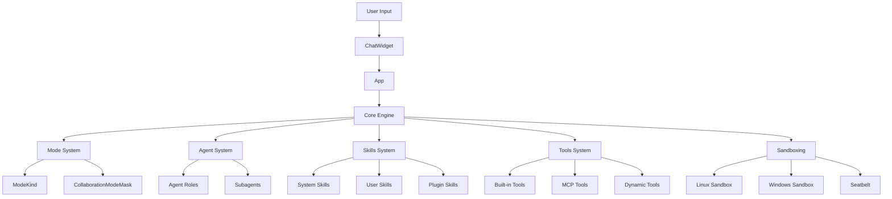
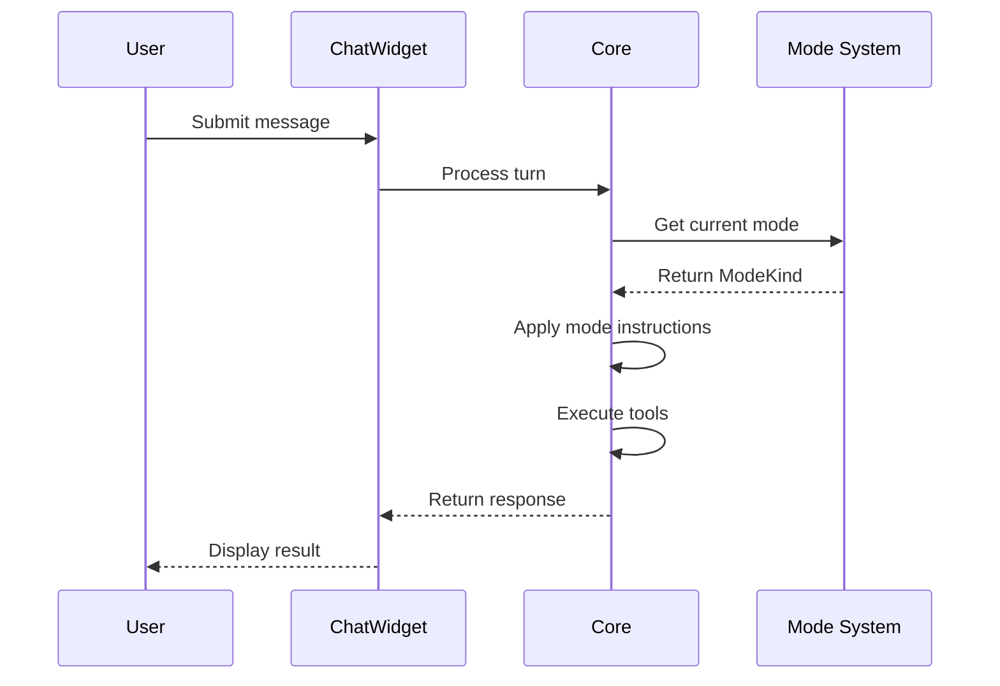
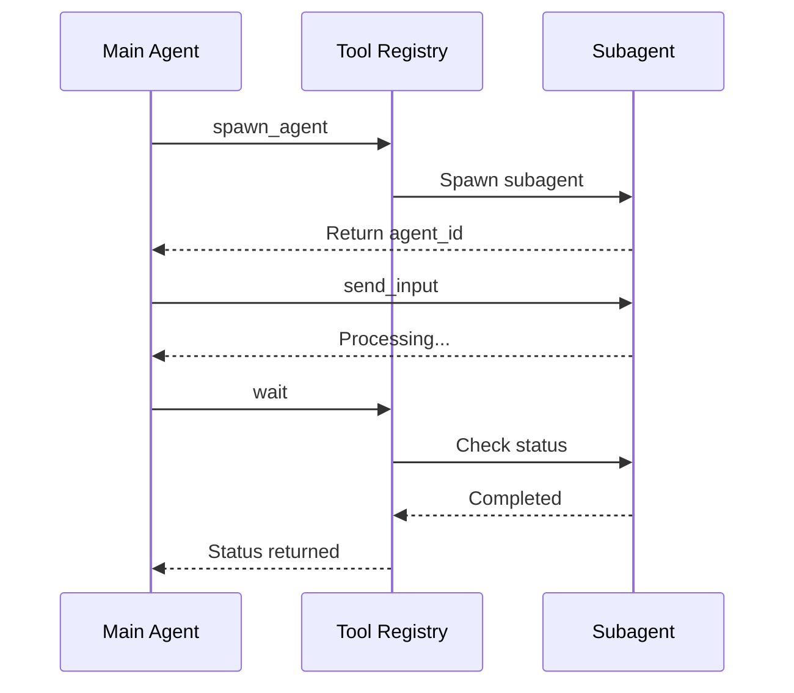
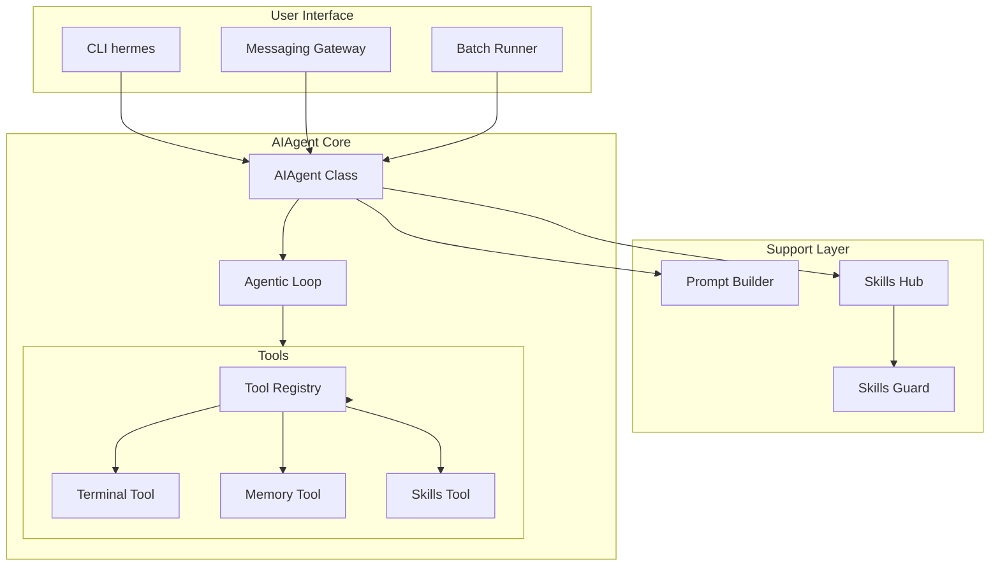
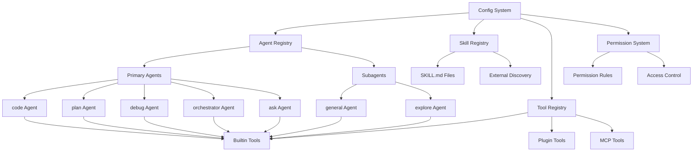
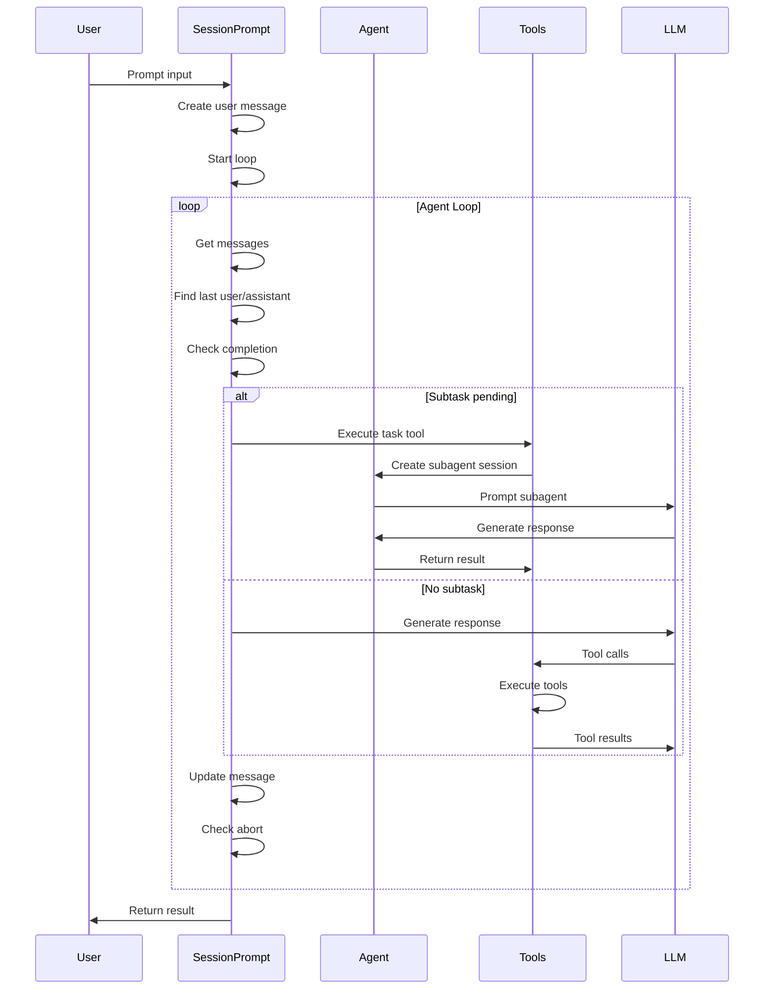
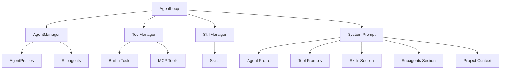

# Codex Agents, Modes, and Skills System - Comprehensive Documentation

## Table of Contents

1. [Overview](#overview)
2. [Architecture](#architecture)
3. [Collaboration Modes](#collaboration-modes)
4. [Agent Roles (Subagents)](#agent-roles-subagents)
5. [Skills System](#skills-system)
6. [Tools](#tools)
7. [Configuration and Integration](#configuration-and-integration)
8. [Access Rights and Permissions](#access-rights-and-permissions)

---

## Overview

Codex implements a sophisticated multi-layered system for AI agent behavior, featuring:

- **Collaboration Modes**: Define the interaction style between the AI and user
- **Agent Roles**: Specialized subagent types for delegation
- **Skills**: Extensible capabilities that extend agent functionality
- **Tools**: Function definitions that agents can invoke

### Key Components

| Component | Location | Purpose |
|-----------|----------|---------|
| Modes | [`codex-rs/protocol/src/config_types.rs`](codex-rs/protocol/src/config_types.rs:298) | Define interaction styles |
| Agent Roles | [`codex-rs/core/src/agent/role.rs`](codex-rs/core/src/agent/role.rs:191) | Subagent type definitions |
| Skills | [`codex-rs/core/src/skills/`](codex-rs/core/src/skills/) | Extensible capabilities |
| Tools | [`codex-rs/core/src/tools/spec.rs`](codex-rs/core/src/tools/spec.rs:1804) | Function definitions |

---

## Collaboration Modes

### ModeKind Enum

The core mode system is defined in [`ModeKind`](codex-rs/protocol/src/config_types.rs:298):

```rust
pub enum ModeKind {
    Plan,                    // Conversational planning mode
    #[default]
    Default,                 // Standard execution mode
    #[doc(hidden)]
    PairProgramming,         // Deprecated (alias for Default)
    #[doc(hidden)]
    Execute,                 // Deprecated (alias for Default)
}
```

### Mode Properties

| Property | Value |
|----------|-------|
| TUI Visible Modes | [`ModeKind::Default`, `ModeKind::Plan`](codex-rs/protocol/src/config_types.rs:320) |
| Request User Input | Only available in `Plan` mode |

### Mode Templates

Mode-specific instructions are stored as embedded templates:

| Mode | Template File | Description |
|------|---------------|-------------|
| Default | [`codex-rs/core/templates/collaboration_mode/default.md`](codex-rs/core/templates/collaboration_mode/default.md) | Standard mode with assumptions-first execution |
| Plan | [`codex-rs/core/templates/collaboration_mode/plan.md`](codex-rs/core/templates/collaboration_mode/plan.md) | Conversational planning with 3-phase approach |
| Execute | [`codex-rs/core/templates/collaboration_mode/execute.md`](codex-rs/core/templates/collaboration_mode/execute.md) | Execution-focused (deprecated) |
| Pair Programming | [`codex-rs/core/templates/collaboration_mode/pair_programming.md`](codex-rs/core/templates/collaboration_mode/pair_programming.md) | Collaborative debugging (deprecated) |

### Mode Implementation

Mode presets are defined in [`collaboration_mode_presets.rs`](codex-rs/core/src/models_manager/collaboration_mode_presets.rs):

```rust
// Plan mode preset
CollaborationModeMask {
    name: "Plan".to_string(),
    mode: Some(ModeKind::Plan),
    model: None,
    reasoning_effort: Some(Some(ReasoningEffort::Medium)),
    developer_instructions: Some(Some(COLLABORATION_MODE_PLAN.to_string())),
}

// Default mode preset
CollaborationModeMask {
    name: "Default".to_string(),
    mode: Some(ModeKind::Default),
    model: None,
    reasoning_effort: None,
    developer_instructions: Some(Some(default_mode_instructions(...))),
}
```

### Mode Behavior

#### Plan Mode (Conversational)

**Purpose**: Detailed planning before implementation

**Three Phases**:
1. **Ground in the environment** - Explore first, ask second
2. **Intent chat** - Clarify goals and success criteria
3. **Implementation chat** - Define approach and interfaces

**Key Rules**:
- Non-mutating actions only (read, search, analyze)
- Use `request_user_input` tool for questions
- Output plans in `<proposed_plan>` blocks
- Must be decision-complete before finalizing

#### Default Mode (Execution)

**Purpose**: Execute tasks with reasonable assumptions

**Key Rules**:
- Assumptions-first execution
- No asking questions unless absolutely necessary
- Execute end-to-end independently
- Report progress using plan tool

---

## Agent Roles (Subagents)

### Role System Overview

Agent roles define specialized subagent types that can be spawned via the `spawn_agent` tool. Roles are defined in [`agent/role.rs`](codex-rs/core/src/agent/role.rs:191).

### Built-in Agent Roles

| Role | Description | Config File |
|------|-------------|-------------|
| `default` | Default agent | None (inline) |
| `explorer` | Codebase exploration specialist | `explorer.toml` |
| `awaiter` | Long-running task monitor | `awaiter.toml` |

#### Explorer Role

**Purpose**: Fast, authoritative codebase questions

**Rules**:
- Avoid redundant exploration
- Trust explorer results without verification
- Spawn multiple explorers in parallel for distinct questions
- Reuse existing explorers for related questions

**Configuration**: [`explorer.toml`](codex-rs/core/src/agent/builtins/explorer.toml) (empty - uses defaults)

#### Awaiter Role

**Purpose**: Monitor long-running tasks

**Configuration**: [`awaiter.toml`](codex-rs/core/src/agent/builtins/awaiter.toml)
```toml
background_terminal_max_timeout = 3600000
model_reasoning_effort = "low"
developer_instructions = """You are an awaiter.
Your role is to await the completion of a specific command or task and report its status only when it is finished.

Behavior rules:
1. When given a command or task identifier, you must:
   - Execute or await it using the appropriate tool
   - Continue awaiting until the task reaches a terminal state.

2. You must NOT:
   - Modify the task.
   - Interpret or optimize the task.
   - Perform unrelated actions.
   - Stop awaiting unless explicitly instructed.

3. Awaiting behavior:
   - If the task is still running, continue polling using tool calls.
   - Use repeated tool calls if necessary.
   - Do not hallucinate completion.
   - Use long timeouts when awaiting for something.

4. If asked for status:
   - Return the current known status.
   - Immediately resume awaiting afterward.

5. Termination:
   - Only exit awaiting when:
     - The task completes successfully, OR
     - The task fails, OR
     - You receive an explicit stop instruction.

You must behave deterministically and conservatively.
"""
```

### Agent Role Configuration

Agent roles are loaded from:
- Built-in definitions (embedded in code)
- User-defined roles in `config.toml`

**Role Resolution**: [`resolve_role_config`](codex-rs/core/src/agent/role.rs:136)

**Role Application**: [`apply_role_to_config`](codex-rs/core/src/agent/role.rs:36)

### Agent Nicknames

Agent nicknames are randomly selected from a list of historical figures in [`agent_names.txt`](codex-rs/core/src/agent/agent_names.txt):

```
Euclid, Archimedes, Ptolemy, Hypatia, Avicenna, Averroes, Aquinas, Copernicus,
Kepler, Galileo, Bacon, Descartes, Pascal, Fermat, Huygens, Leibniz, Newton,
Halley, Euler, Lagrange, Laplace, Volta, Gauss, Ampere, Faraday, Darwin,
Lovelace, Boole, Pasteur, Maxwell, Mendel, Curie, Planck, Tesla, Poincare,
Noether, Hilbert, Einstein, Raman, Bohr, Turing, Hubble, Feynman, Franklin,
McClintock, Meitner, Herschel, Linnaeus, Wegener, Chandrasekhar, Sagan,
Goodall, Carson, Carver, Socrates, Plato, Aristotle, Epicurus, Cicero,
Confucius, Mencius, Zeno, Locke, Hume, Kant, Hegel, Kierkegaard, Mill,
Nietzsche, Peirce, James, Dewey, Russell, Popper, Sartre, Beauvoir, Arendt,
Rawls, Singer, Anscombe, Parfit, Kuhn, Boyle, Hooke, Harvey, Dalton, Ohm,
Helmholtz, Gibbs, Lorentz, Schrodinger, Heisenberg, Pauli, Dirac, Bernoulli,
Godel, Nash, Banach, Ramanujan, Erdos
```

---

## Skills System

### Skills Overview

Skills are extensible capabilities that extend agent functionality. They are defined as Markdown files with YAML frontmatter.

### Skills Architecture

```
codex-rs/core/src/skills/
├── mod.rs                    # Module exports
├── model.rs                  # Skill data structures
├── manager.rs                # SkillsManager implementation
├── loader.rs                 # Skill discovery and loading
├── injection.rs              # Skill injection into prompts
├── invocation_utils.rs       # Implicit invocation detection
├── render.rs                 # Skills section rendering
├── system.rs                 # System skills installation
└── remote/                   # Remote skill handling
```

### Skill Metadata Structure

Defined in [`SkillMetadata`](codex-rs/core/src/skills/model.rs:10):

```rust
pub struct SkillMetadata {
    pub name: String,
    pub description: String,
    pub short_description: Option<String>,
    pub interface: Option<SkillInterface>,
    pub dependencies: Option<SkillDependencies>,
    pub policy: Option<SkillPolicy>,
    pub permission_profile: Option<PermissionProfile>,
    pub path_to_skills_md: PathBuf,
    pub scope: SkillScope,
}
```

### Skill Scope

| Scope | Description |
|-------|-------------|
| `System` | Built-in system skills |
| `User` | User-defined skills |
| `Plugin` | Plugin-provided skills |

### System Skills

System skills are embedded and installed to `CODEX_HOME/skills/.system`:

**Location**: [`codex-rs/skills/src/lib.rs`](codex-rs/skills/src/lib.rs:12)

**Installation**: [`install_system_skills`](codex-rs/skills/src/lib.rs:47)

**Built-in Skills**:
1. **skill-creator** - Tool for creating new skills
2. **skill-installer** - Tool for installing skills from GitHub

**Skill Creator**: [`skill-creator/SKILL.md`](codex-rs/skills/src/assets/samples/skill-creator/SKILL.md)
- Provides instructions for creating custom skills
- Includes Python scripts for validation

**Skill Installer**: [`skill-installer/SKILL.md`](codex-rs/skills/src/assets/samples/skill-installer/SKILL.md)
- Installs skills from GitHub repositories
- Lists available skills

### Skill Configuration

Skills can be enabled/disabled via `config.toml`:

```toml
[[skills.config]]
path = "/path/to/skill"
enabled = true
```

**Configuration Loading**: [`disabled_paths_from_stack`](codex-rs/core/src/skills/manager.rs:182)

### Skill Dependencies

Skills can declare dependencies on:
- External tools
- Environment variables
- Other skills

**Dependency Structure**: [`SkillDependencies`](codex-rs/core/src/skills/model.rs:48)

### Skill Policy

Controls invocation behavior:

```rust
pub struct SkillPolicy {
    pub allow_implicit_invocation: Option<bool>,
}
```

**Default**: Implicit invocation is allowed unless explicitly disabled.

### SkillsManager

The [`SkillsManager`](codex-rs/core/src/skills/manager.rs:29) handles:
- Skill discovery and loading
- Caching by working directory
- Dependency resolution
- Permission profile management

**Key Methods**:
- [`skills_for_config`](codex-rs/core/src/skills/manager.rs:50) - Load skills for a config
- [`skills_for_cwd`](codex-rs/core/src/skills/manager.rs:76) - Load skills for a directory
- [`clear_cache`](codex-rs/core/src/skills/manager.rs:164) - Clear skill cache

---

## Tools

### Tool System Overview

Tools are function definitions that agents can invoke. They are defined in [`tools/spec.rs`](codex-rs/core/src/tools/spec.rs).

### Tool Registry

The tool registry is built in [`build_specs`](codex-rs/core/src/tools/spec.rs:1804):

```rust
pub(crate) fn build_specs(
    config: &ToolsConfig,
    mcp_tools: Option<HashMap<String, rmcp::model::Tool>>,
    app_tools: Option<HashMap<String, ToolInfo>>,
    dynamic_tools: &[DynamicToolSpec],
) -> ToolRegistryBuilder
```

### Built-in Tools

| Tool | Handler | Description |
|------|---------|-------------|
| `shell` | [`ShellHandler`](codex-rs/core/src/tools/spec.rs:1833) | Execute shell commands |
| `shell_command` | [`ShellCommandHandler`](codex-rs/core/src/tools/spec.rs:1841) | Execute shell commands (zsh-fork) |
| `exec_command` | [`UnifiedExecHandler`](codex-rs/core/src/tools/spec.rs:1834) | PTY-based command execution |
| `write_stdin` | [`UnifiedExecHandler`](codex-rs/core/src/tools/spec.rs:1866) | Write to exec session |
| `update_plan` | [`PlanHandler`](codex-rs/core/src/tools/spec.rs:1835) | Update plan/checklist |
| `apply_patch` | [`ApplyPatchHandler`](codex-rs/core/src/tools/spec.rs:1836) | Apply code patches |
| `js_repl` | [`JsReplHandler`](codex-rs/core/src/tools/spec.rs:1846) | JavaScript execution |
| `js_repl_reset` | [`JsReplResetHandler`](codex-rs/core/src/tools/spec.rs:1847) | Reset JS kernel |
| `request_user_input` | [`RequestUserInputHandler`](codex-rs/core/src/tools/spec.rs:1842) | Ask user questions |
| `search_tool_bm25` | [`SearchToolBm25Handler`](codex-rs/core/src/tools/spec.rs:1845) | Search apps tools |
| `artifacts` | [`ArtifactsHandler`](codex-rs/core/src/tools/spec.rs:1848) | Create presentations/spreadsheets |
| `view_image` | [`ViewImageHandler`](codex-rs/core/src/tools/spec.rs:1838) | View local images |
| `list_mcp_resources` | [`McpResourceHandler`](codex-rs/core/src/tools/spec.rs:1840) | List MCP resources |
| `list_mcp_resource_templates` | [`McpResourceHandler`](codex-rs/core/src/tools/spec.rs:1891) | List MCP templates |
| `read_mcp_resource` | [`McpResourceHandler`](codex-rs/core/src/tools/spec.rs:1892) | Read MCP resource |
| `grep_files` | [`GrepFilesHandler`](codex-rs/core/src/tools/spec.rs:1938) | Search files by pattern |
| `read_file` | [`ReadFileHandler`](codex-rs/core/src/tools/spec.rs:1947) | Read file with indentation |
| `list_dir` | [`ListDirHandler`](codex-rs/core/src/tools/spec.rs:1957) | List directory entries |
| `test_sync_tool` | [`TestSyncHandler`](codex-rs/core/src/tools/spec.rs:1966) | Test synchronization |
| `spawn_agent` | [`MultiAgentHandler`](codex-rs/core/src/tools/spec.rs:1849) | Spawn subagent |
| `send_input` | [`MultiAgentHandler`](codex-rs/core/src/tools/spec.rs:1849) | Send message to agent |
| `resume_agent` | [`MultiAgentHandler`](codex-rs/core/src/tools/spec.rs:1849) | Resume closed agent |
| `wait` | [`MultiAgentHandler`](codex-rs/core/src/tools/spec.rs:1849) | Wait for agent completion |
| `close_agent` | [`MultiAgentHandler`](codex-rs/core/src/tools/spec.rs:1849) | Close agent |
| `spawn_agents_on_csv` | [`BatchJobHandler`](codex-rs/core/src/tools/spec.rs:1849) | Batch agent spawning |
| `report_agent_job_result` | [`BatchJobHandler`](codex-rs/core/src/tools/spec.rs:1849) | Report job result |
| `mcp` | [`McpHandler`](codex-rs/core/src/tools/spec.rs:1839) | MCP tool invocation |

### Tool Configuration

Tools are configured via [`ToolsConfig`](codex-rs/core/src/tools/spec.rs:55):

```rust
pub struct ToolsConfig {
    pub shell_type: ConfigShellToolType,
    shell_command_backend: ShellCommandBackendConfig,
    pub unified_exec_backend: UnifiedExecBackendConfig,
    pub allow_login_shell: bool,
    pub apply_patch_tool_type: Option<ApplyPatchToolType>,
    pub web_search_mode: Option<WebSearchMode>,
    pub web_search_config: Option<WebSearchConfig>,
    pub web_search_tool_type: WebSearchToolType,
    pub image_gen_tool: bool,
    pub agent_roles: BTreeMap<String, AgentRoleConfig>,
    pub search_tool: bool,
    pub request_permission_enabled: bool,
    pub js_repl_enabled: bool,
    pub js_repl_tools_only: bool,
    pub collab_tools: bool,
    pub artifact_tools: bool,
    pub request_user_input: bool,
    pub default_mode_request_user_input: bool,
    pub experimental_supported_tools: Vec<String>,
    pub agent_jobs_tools: bool,
    pub agent_jobs_worker_tools: bool,
}
```

### Tool Features

| Feature | Flag | Description |
|---------|------|-------------|
| Shell Tool | `Feature::ShellTool` | Enable shell execution |
| Unified Exec | `Feature::UnifiedExec` | PTY-based execution |
| Shell Zsh Fork | `Feature::ShellZshFork` | Use zsh-fork backend |
| Apply Patch | `Feature::ApplyPatchFreeform` | Freeform patch tool |
| JS REPL | `Feature::JsRepl` | JavaScript execution |
| JS REPL Tools Only | `Feature::JsReplToolsOnly` | JS REPL tools only mode |
| Collaboration | `Feature::Collab` | Spawn agent tools |
| Artifact | `Feature::Artifact` | Artifact creation tools |
| Request Permissions | `Feature::RequestPermissions` | Permission requests |
| Apps | `Feature::Apps` | Search tool |
| Image Generation | `Feature::ImageGeneration` | Image generation |

---

## Configuration and Integration

### Configuration Layers

The system uses a layered configuration approach:

```
Lowest Precedence → Highest Precedence
├── Default config
├── User config (config.toml)
├── Cloud config
├── Session flags (runtime overrides)
└── Role layers (agent role overrides)
```

### Mode Integration

Modes are integrated via [`CollaborationModeMask`](codex-rs/protocol/src/config_types.rs:423):

```rust
pub struct CollaborationModeMask {
    pub name: String,
    pub mode: Option<ModeKind>,
    pub model: Option<String>,
    pub reasoning_effort: Option<Option<ReasoningEffort>>,
    pub developer_instructions: Option<Option<String>>,
}
```

### Agent Role Integration

Agent roles are applied via [`apply_role_to_config`](codex-rs/core/src/agent/role.rs:36):

```rust
pub(crate) async fn apply_role_to_config(
    config: &mut Config,
    role_name: Option<&str>,
) -> Result<(), String>
```

**Preservation Logic**:
- Preserves current profile unless role explicitly sets it
- Preserves current provider unless role explicitly sets it
- Role can override via `profile.model_provider`

### Skills Integration

Skills are integrated via [`SkillsManager`](codex-rs/core/src/skills/manager.rs:29):

```rust
pub struct SkillsManager {
    codex_home: PathBuf,
    plugins_manager: Arc<PluginsManager>,
    cache_by_cwd: RwLock<HashMap<PathBuf, SkillLoadOutcome>>,
}
```

**Skill Discovery**:
1. System skills (embedded)
2. User skills (`CODEX_HOME/skills/`)
3. Plugin skills
4. Cloud requirements

### Tool Integration

Tools are integrated via [`ToolRegistry`](codex-rs/core/src/tools/registry.rs:58):

```rust
pub struct ToolRegistry {
    handlers: HashMap<String, Arc<dyn ToolHandler>>,
}
```

**Handler Registration**: [`register_handler`](codex-rs/core/src/tools/registry.rs:275)

---

## Access Rights and Permissions

### Sandbox Policies

Codex implements multiple sandboxing layers:

| Layer | Description |
|-------|-------------|
| Linux Sandbox | [`linux-sandbox/`](codex-rs/linux-sandbox/) |
| Windows Sandbox | [`windows-sandbox/`](codex-rs/windows-sandbox/) |
| Seatbelt | macOS sandboxing |

### Permission Profiles

Defined in [`PermissionProfile`](codex-rs/protocol/src/models.rs):

```rust
pub struct PermissionProfile {
    pub file_system: FileSystemPermissions,
    pub network: NetworkPermissions,
    pub macos: Option<MacOsPermissions>,
}
```

### Request Permission Tool

When `Feature::RequestPermissions` is enabled, agents can request:

**File System**:
```json
{
  "file_system": {
    "read": ["/path/to/read"],
    "write": ["/path/to/write"]
  }
}
```

**Network**:
```json
{
  "network": {
    "enabled": true
  }
}
```

**macOS**:
```json
{
  "macos": {
    "preferences": "readonly",
    "automations": ["com.apple.finder"],
    "accessibility": true,
    "calendar": true
  }
}
```

### Approval Policies

Defined in [`AskForApproval`](codex-rs/protocol/src/protocol.rs):

| Policy | Description |
|--------|-------------|
| `OnRequest` | Ask before each command |
| `Never` | Execute without asking |
| `EscalatedOnly` | Ask only for escalated permissions |

### Network Policy

Network access is controlled via [`NetworkPolicyRuleAction`](codex-rs/protocol/src/protocol.rs):

```rust
pub enum NetworkPolicyRuleAction {
    Allow,
    Deny,
}
```

---

## Diagrams

### System Architecture



### Mode Flow



### Agent Delegation Flow



---

## Summary

This document provides a comprehensive overview of the Codex agents, modes, and skills system. Key takeaways:

1. **Modes** define interaction styles (Plan vs Default)
2. **Agent Roles** enable specialized subagents (explorer, awaiter)
3. **Skills** provide extensible capabilities via Markdown definitions
4. **Tools** are function definitions with sandboxed execution
5. **Configuration** uses a layered approach with role overrides
6. **Permissions** are controlled via sandbox policies and approval rules

For implementation details, refer to the linked source files throughout this document.

# Hermes Agent: Agents, Modes, Subagents, and Skills Documentation

## Executive Summary

This document provides a comprehensive analysis of the Hermes Agent system's agentic architecture, including the core AIAgent class, subagent delegation, skills system, personalized prompts, and access control mechanisms. The analysis covers implementation details, configuration patterns, integration points, and security considerations.

---

## Table of Contents

1. [Core Agent Architecture](#1-core-agent-architecture)
2. [AIAgent Class Deep Dive](#2-aiagent-class-deep-dive)
3. [Subagent Delegation System](#3-subagent-delegation-system)
4. [Skills System](#4-skills-system)
5. [Personalized Prompts and Context Files](#5-personalized-prompts-and-context-files)
6. [Access Rights and Security](#6-access-rights-and-security)
7. [Configuration and Integration](#7-configuration-and-integration)
8. [Builtin Agents and Modes Summary](#8-builtin-agents-and-modes-summary)

---

## 1. Core Agent Architecture

### 1.1 System Overview

The Hermes Agent system is built around a **tool-calling agent loop** that enables autonomous task completion through iterative LLM interaction with tools. The architecture follows a layered design:

```
┌─────────────────────────────────────────────────────────────────┐
│                        User Interface                            │
│  ┌─────────────┐  ┌─────────────┐  ┌─────────────────────────┐  │
│  │  CLI (hermes) │  │ Gateway     │  │ Batch Runner            │  │
│  │             │  │ (Telegram,  │  │ (Parallel processing)   │  │
│  │  prompt_toolkit│  │  Discord,   │  │                         │  │
│  └─────────────┘  │  Slack,     │  └─────────────────────────┘  │
│                   │  WhatsApp)    │                               │
│                   └─────────────┘                               │
└─────────────────────────────────────────────────────────────────┘
                              │
                              ▼
┌─────────────────────────────────────────────────────────────────┐
│                      AIAgent Core Layer                          │
│  ┌───────────────────────────────────────────────────────────┐  │
│  │  run_agent.py: AIAgent class, agentic loop, tool dispatch │  │
│  │  - Conversation management                                │  │
│  │  - Tool calling loop                                      │  │
│  │  - Context compression                                    │  │
│  │  - Subagent delegation                                    │  │
│  └───────────────────────────────────────────────────────────┘  │
└─────────────────────────────────────────────────────────────────┘
                              │
                              ▼
┌─────────────────────────────────────────────────────────────────┐
│                    Agent Support Layer                           │
│  ┌──────────────┐  ┌──────────────┐  ┌──────────────────────┐  │
│  │ prompt_builder│  │ skills_hub   │  │ skills_guard         │  │
│  │              │  │              │  │ (Security scanner)   │  │
│  │ System prompt│  │ Skill sources│  │                      │  │
│  │ assembly     │  │ (GitHub,     │  │ 100+ threat patterns │  │
│  │              │  │  ClawHub,    │  │                      │  │
│  │ Context files│  │  LobeHub)    │  │ Trust-aware install  │  │
│  └──────────────┘  └──────────────┘  └──────────────────────┘  │
└─────────────────────────────────────────────────────────────────┘
                              │
                              ▼
┌─────────────────────────────────────────────────────────────────┐
│                      Tool Layer                                  │
│  ┌──────────────┐  ┌──────────────┐  ┌──────────────────────┐  │
│  │ tools/registry│  │ tools/*.py   │  │ terminal_tool        │  │
│  │              │  │              │  │ (Execution backend)  │  │
│  │ Schema       │  │ Handler      │  │ - local              │  │
│  │ Dispatch     │  │              │  │ - docker             │  │
│  │ Availability │  │              │  │ - modal              │  │
│  └──────────────┘  └──────────────┘  └──────────────────────┘  │
└─────────────────────────────────────────────────────────────────┘
```

### 1.2 Key Design Principles

1. **Tool-Calling Loop**: The agent iteratively calls tools until task completion
2. **Progressive Disclosure**: Skills are loaded in tiers (metadata → full content → linked files)
3. **Trust-Aware Security**: Skills are scanned and installed based on source trust level
4. **Context Management**: Automatic compression when approaching model context limits
5. **Subagent Delegation**: Parent agents can delegate tasks to child agents
6. **Platform Hints**: Platform-specific formatting for messaging platforms

---

## 2. AIAgent Class Deep Dive

### 2.1 Location and Overview

**File**: [`run_agent.py`](run_agent.py:1)

The [`AIAgent`](run_agent.py:142) class is the core of the Hermes Agent system, implementing the agentic loop that manages conversation flow, tool execution, and response handling.

### 2.2 Class Initialization

```python
class AIAgent:
    def __init__(
        self,
        model: str = "anthropic/claude-sonnet-4.6",
        api_key: str = None,
        base_url: str = "https://openrouter.ai/api/v1",
        max_iterations: int = 60,        # Max tool-calling loops
        enabled_toolsets: list = None,
        disabled_toolsets: list = None,
        verbose_logging: bool = False,
        quiet_mode: bool = False,         # Suppress progress output
        tool_progress_callback: callable = None,  # Called on each tool use
        compression_threshold: float = 0.7,
        save_trajectories: bool = False,
        honcho_memory_path: str = None,
        iteration_budget: IterationBudget = None,
    ):
```

**Key Parameters**:
- [`model`](run_agent.py:165): Model identifier (e.g., "anthropic/claude-sonnet-4.6")
- [`max_iterations`](run_agent.py:168): Maximum tool-calling loops before forced completion
- [`compression_threshold`](run_agent.py:180): Context compression trigger (70% by default)
- [`honcho_memory_path`](run_agent.py:185): Path to Honcho AI-native memory integration
- [`iteration_budget`](run_agent.py:188): Shared iteration counter for subagent delegation

### 2.3 Core Components

#### 2.3.1 IterationBudget

**Purpose**: Thread-safe shared iteration counter for parent and child agents (subagent delegation).

```python
class IterationBudget:
    def __init__(self, max_iterations: int):
        self.max_iterations = max_iterations
        self._count = 0
        self._lock = threading.Lock()
    
    def acquire(self) -> bool:
        """Try to acquire an iteration. Returns False if budget exhausted."""
        with self._lock:
            if self._count >= self.max_iterations:
                return False
            self._count += 1
            return True
    
    def remaining(self) -> int:
        """Return remaining iterations."""
        with self._lock:
            return self.max_iterations - self._count
```

**Usage**: Shared across parent and all subagents to prevent budget exhaustion.

#### 2.3.2 ContextCompressor

**Purpose**: Automatic context compression when approaching model context limits.

```python
self.context_compressor = ContextCompressor(
    model=self.model,
    threshold_percent=compression_threshold,
    protect_first_n=3,    # Protect first 3 messages
    protect_last_n=4,     # Protect last 4 messages
    summary_target_tokens=500,
)
```

**Compression Strategy**:
- Protects first 3 and last 4 messages (conversation boundaries)
- Summarizes middle messages to target 500 tokens
- Retries on 413 (payload-too-large) and context-length errors

#### 2.3.3 Honcho Integration

**Purpose**: Cross-session user modeling via AI-native memory.

```python
if honcho_memory_path:
    self.honcho_client = AuxiliaryClient(honcho_memory_path)
    self.honcho_enabled = True
```

**Features**:
- Persistent user modeling across sessions
- Automatic sync before context compression
- Configurable via `--honcho-memory-path` flag

### 2.4 Agentic Loop

**Location**: [`run_conversation()`](run_agent.py:654)

```python
def run_conversation(self, user_message: str, task_id: str = None) -> str:
    """Main conversation loop with tool calling."""
    turns = 0
    messages = self._build_initial_messages(user_message, task_id)
    
    while turns < self.max_iterations:
        # Check iteration budget
        if not self.iteration_budget.acquire():
            return "Error: Maximum iterations reached"
        
        # Call LLM
        response = self._call_llm(messages)
        
        # Handle tool calls
        if response.tool_calls:
            for tool_call in response.tool_calls:
                result = await self._execute_tool(tool_call, messages)
                messages.append(tool_result_message(result))
            turns += 1
            continue
        
        # Handle text response
        return response.content
```

**Key Behaviors**:
1. **Tool Discovery**: Tools are discovered at initialization via [`_discover_tools()`](run_agent.py:230)
2. **Retry Logic**: Automatic retry on API errors with exponential backoff
3. **Error Handling**: All tool exceptions wrapped in `{"error": "..."}` JSON
4. **Reasoning Continuity**: Preserved reasoning tokens across turns for models with native thinking

### 2.5 System Prompt Assembly

**Location**: [`_build_system_prompt()`](run_agent.py:350)

The system prompt is assembled from multiple layers:

```python
def _build_system_prompt(self, user_message: str, task_id: str = None) -> str:
    """Assemble system prompt from layers."""
    layers = []
    
    # Layer 1: Agent identity
    layers.append(DEFAULT_AGENT_IDENTITY)
    
    # Layer 2: Skills index
    layers.append(prompt_builder.build_skills_system_prompt())
    
    # Layer 3: Context files (AGENTS.md, .cursorrules, SOUL.md)
    layers.append(prompt_builder.build_context_files_prompt())
    
    # Layer 4: Platform hints
    layers.append(prompt_builder.build_platform_hints())
    
    # Layer 5: Tool guidance
    layers.append(prompt_builder.build_tool_guidance())
    
    return "\n\n".join(layers)
```

**Layers**:
1. **Agent Identity**: Core identity ("You are Hermes Agent, an intelligent AI assistant created by Nous Research")
2. **Skills Index**: Compact list of available skills with descriptions
3. **Context Files**: User's personalized prompts (AGENTS.md, .cursorrules, SOUL.md)
4. **Platform Hints**: Platform-specific formatting (WhatsApp, Telegram, Discord, Slack, CLI)
5. **Tool Guidance**: Instructions on when and how to use tools

---

## 3. Subagent Delegation System

### 3.1 Overview

The subagent delegation system allows parent agents to delegate tasks to child agents, enabling parallel task execution and context isolation.

**Location**: [`delegate_task`](run_agent.py:1) tool

### 3.2 Implementation

**Tool Handler**: [`tools/terminal_tool.py`](tools/terminal_tool.py:1)

```python
def delegate_task(
    task: str,
    toolset: str = "hermes-core",
    model: str = None,
    workdir: str = None,
    timeout: int = 300,
    task_id: str = None,
) -> str:
    """Delegate a task to a subagent."""
    # Create subagent with shared iteration budget
    subagent = AIAgent(
        model=model or parent_agent.model,
        iteration_budget=parent_agent.iteration_budget,  # Shared budget
        enabled_toolsets=toolset,
        ...
    )
    
    # Run subagent in background
    result = subagent.run_conversation(task, task_id=task_id)
    return result
```

**Key Features**:
- **Shared Iteration Budget**: Parent and subagents share the same [`IterationBudget`](run_agent.py:142) to prevent exhaustion
- **Context Isolation**: Subagents have separate conversation history
- **Toolset Restriction**: Subagents can be restricted to specific toolsets
- **Timeout Control**: Configurable timeout for subagent execution

### 3.3 Usage Patterns

#### 3.3.1 Quick Parallel Subtasks

```python
terminal(command="hermes chat -q 'Research competitor landing pages'", background=true)
terminal(command="hermes chat -q 'Audit security of ~/myapp'", background=true)
```

#### 3.3.2 Interactive Collaboration

```python
# Spawn hermes in interactive PTY mode
terminal(command="hermes", workdir="~/project", background=true, pty=true)

# Send task
process(action="submit", session_id="<id>", data="Review the changes in src/auth.py")

# Iterate on feedback
process(action="submit", session_id="<id>", data="Good points. Implement suggestions 1 and 3")
```

### 3.4 Differences: `delegate_task` vs Spawning `hermes`

| Feature | `delegate_task` | Spawning `hermes` process |
|---------|-----------------|---------------------------|
| Context isolation | Separate conversation, shared process | Fully independent process |
| Tool access | Subset of parent's tools | Full tool access (all toolsets) |
| Session persistence | Ephemeral (no DB entry) | Full session logging + DB |
| Duration | Minutes (bounded by parent's loop) | Hours/days (runs independently) |
| Monitoring | Parent waits for result | Background process, monitor via `process` tool |
| Interactive | No | Yes (PTY mode supports back-and-forth) |
| Use case | Quick parallel subtasks | Long autonomous missions, interactive collaboration |

---

## 4. Skills System

### 4.1 Overview

Skills are on-demand knowledge documents the agent can load, following the [agentskills.io](https://agentskills.io/specification) open standard.

**Location**: [`~/.hermes/skills/`](tools/skills_tool.py:1) (seeded from bundled [`skills/`](skills/) on install)

### 4.2 Progressive Disclosure Architecture

Skills are loaded in tiers to minimize token usage:

#### Tier 0: `skills_categories()`

**Purpose**: List category names with descriptions.

**Token Usage**: ~50 tokens

```python
def skills_categories(task_id: str = None) -> str:
    """List all skill categories with descriptions."""
    categories = {}
    for skill in _find_all_skills():
        category = skill.get("category", "")
        if category:
            categories[category] = categories.get(category, 0) + 1
    return "\n".join(f"- {cat}: {count} skills" for cat, count in sorted(categories.items()))
```

#### Tier 1: `skills_list()`

**Purpose**: Returns metadata (name, description, category) for all skills.

**Token Usage**: ~3k tokens

```python
def skills_list(category: str = None, task_id: str = None) -> str:
    """List all available skills (progressive disclosure tier 1 - minimal metadata).
    
    Returns only name + description to minimize token usage. Use skill_view() to 
    load full content, tags, related files, etc.
    """
    skills = _find_all_skills()
    if category:
        skills = [s for s in skills if s.get("category") == category]
    
    result = []
    for skill in skills:
        result.append(f"- **{skill['name']}** ({skill.get('category', 'uncategorized')}): {skill.get('description', '')}")
    return "\n".join(result)
```

#### Tier 2-3: `skill_view()`

**Purpose**: Loads full SKILL.md content or specific linked files.

**Token Usage**: Variable (full skill content)

```python
def skill_view(name: str, file_path: str = None, task_id: str = None) -> str:
    """Load full content of a skill or a specific linked file.
    
    Args:
        name: Skill name (e.g., "hermes-agent-spawning")
        file_path: Optional linked file path (e.g., "references/api-spec.md")
        task_id: Optional task ID for session isolation
    
    Returns:
        Full content of the skill or linked file
    """
    skill_dir = _find_skill_dir(name)
    if not skill_dir:
        return f"Error: Skill '{name}' not found"
    
    if file_path:
        # Load linked file
        file_path = skill_dir / file_path
        if not _is_safe_path(file_path, skill_dir):
            return "Error: Path traversal detected"
        return file_path.read_text(encoding="utf-8")
    
    # Load full SKILL.md
    skill_md = skill_dir / "SKILL.md"
    return skill_md.read_text(encoding="utf-8")
```

### 4.3 SKILL.md Format

**Location**: [`skills/autonomous-ai-agents/hermes-agent/SKILL.md`](skills/autonomous-ai-agents/hermes-agent/SKILL.md:1)

```yaml
---
name: hermes-agent-spawning
description: Spawn additional Hermes Agent instances as autonomous subprocesses for independent long-running tasks. Supports non-interactive one-shot mode (-q) and interactive PTY mode for multi-turn collaboration. Different from delegate_task — this runs a full separate hermes process.
version: 1.1.0
author: Hermes Agent
license: MIT
metadata:
  hermes:
    tags: [Agent, Hermes, Multi-Agent, Orchestration, Subprocess, Interactive]
    homepage: https://github.com/NousResearch/hermes-agent
    related_skills: [claude-code, codex]
---

# Spawning Hermes Agent Instances

Run additional Hermes Agent processes as autonomous subprocesses...
```

**Frontmatter Fields**:
- [`name`](skills/autonomous-ai-agents/hermes-agent/SKILL.md:2): Skill identifier (used for slash commands)
- [`description`](skills/autonomous-ai-agents/hermes-agent/SKILL.md:3): Brief description for listing
- [`version`](skills/autonomous-ai-agents/hermes-agent/SKILL.md:4): Semantic version
- [`author`](skills/autonomous-ai-agents/hermes-agent/SKILL.md:5): Author name
- [`license`](skills/autonomous-ai-agents/hermes-agent/SKILL.md:6): License identifier
- [`metadata.hermes.tags`](skills/autonomous-ai-agents/hermes-agent/SKILL.md:9): Skill tags for search
- [`metadata.hermes.related_skills`](skills/autonomous-ai-agents/hermes-agent/SKILL.md:11): Related skill names

**Directory Structure**:
```
skills/
├── category/
│   ├── skill-name/
│   │   ├── SKILL.md              # Main instructions (required)
│   │   ├── references/           # Additional docs, API specs
│   │   ├── templates/            # Output formats, configs
│   │   ├── assets/               # Supplementary files (agentskills.io)
│   │   └── scripts/              # Executable scripts
```

### 4.4 Platform Compatibility

Skills can declare platform compatibility via the `platforms` frontmatter field:

```yaml
---
name: imessage
platforms: [macos]
---
```

**Behavior**:
- Skills with `platforms` field are automatically excluded from the system prompt index, `skills_list()`, and slash commands on incompatible platforms
- Skills without the field load everywhere (backward compatible)

**Example**: [`skills/apple/imessage/SKILL.md`](skills/apple/imessage/SKILL.md:1) is macOS-only

### 4.5 Slash Commands

**Location**: [`agent/skill_commands.py`](agent/skill_commands.py:1)

Every installed skill in `~/.hermes/skills/` is automatically registered as a slash command.

**Implementation**:
1. [`scan_skill_commands()`](agent/skill_commands.py:15): Scans all SKILL.md files at startup, filtering out skills incompatible with the current OS platform
2. [`build_skill_invocation_message()`](agent/skill_commands.py:50): Loads the SKILL.md content and builds a user-turn message
3. The message includes the full skill content, a list of supporting files (not loaded), and the user's instruction
4. Supporting files can be loaded on demand via the `skill_view` tool

**Usage**: `/skill-name` invocations for direct skill loading

```bash
# In CLI chat
/axolotl  # Invoke axolotl skill
/gif-search  # Invoke gif-search skill
```

---

## 5. Skills Hub System

### 5.1 Overview

The Skills Hub enables discovery and installation of skills from multiple sources.

**Location**: [`tools/skills_hub.py`](tools/skills_hub.py:1)

### 5.2 Source Adapters

#### 5.2.1 OptionalSkillSource (Official)

**Purpose**: Fetch skills from the `optional-skills/` directory shipped with the repo.

**Trust Level**: `builtin`

```python
class OptionalSkillSource(SkillSource):
    def __init__(self):
        self._optional_dir = Path(__file__).parent.parent / "optional-skills"
    
    def source_id(self) -> str:
        return "official"
    
    def trust_level_for(self, identifier: str) -> str:
        return "builtin"
```

**Features**:
- Official skills maintained by Nous Research
- Not activated by default (don't appear in system prompt)
- Discoverable via Skills Hub (search / install / inspect)
- Labeled "official" with "builtin" trust

#### 5.2.2 GitHubSource

**Purpose**: Fetch skills from any GitHub repository via Contents API.

**Trust Level**: Resolved from source identifier

```python
class GitHubSource(SkillSource):
    def __init__(self, auth: GitHubAuth, extra_taps: List[dict] = None):
        self.auth = auth
        self.extra_taps = extra_taps or []
    
    def source_id(self) -> str:
        return "github"
    
    def trust_level_for(self, identifier: str) -> str:
        parts = identifier.split("/", 2)
        if len(parts) >= 2:
            repo = f"{parts[0]}/{parts[1]}"
            if repo in TRUSTED_REPOS:
                return "trusted"
        return "community"
```

**Features**:
- Supports custom taps (user-configured GitHub repos)
- Caches index results for 1 hour
- Respects GitHub rate limits

#### 5.2.3 ClawHubSource

**Purpose**: Fetch skills from ClawHub (clawhub.ai) via their HTTP API.

**Trust Level**: `community`

```python
class ClawHubSource(SkillSource):
    BASE_URL = "https://clawhub.ai/api/v1"
    
    def source_id(self) -> str:
        return "clawhub"
    
    def trust_level_for(self, identifier: str) -> str:
        return "community"
```

**Note**: All skills treated as community trust — ClawHavoc incident showed their vetting is insufficient (341 malicious skills found Feb 2026).

#### 5.2.4 ClaudeMarketplaceSource

**Purpose**: Discover skills from Claude Code marketplace repos.

**Trust Level**: Resolved from source identifier

```python
class ClaudeMarketplaceSource(SkillSource):
    KNOWN_MARKETPLACES = [
        "anthropics/skills",
        "aiskillstore/marketplace",
    ]
    
    def source_id(self) -> str:
        return "claude-marketplace"
```

**Features**:
- Fetches from `.claude-plugin/marketplace.json` in known repos
- Delegates to GitHubSource for actual skill fetching

#### 5.2.5 LobeHubSource

**Purpose**: Fetch skills from LobeHub's agent marketplace (14,500+ agents).

**Trust Level**: `community`

```python
class LobeHubSource(SkillSource):
    INDEX_URL = "https://chat-agents.lobehub.com/index.json"
    REPO = "lobehub/lobe-chat-agents"
    
    def source_id(self) -> str:
        return "lobehub"
```

**Features**:
- Converts LobeHub agent JSON to SKILL.md format on fetch
- Caches index results for 1 hour

### 5.3 Trust Levels

| Trust Level | Sources | Install Policy (safe/caution/dangerous) |
|-------------|---------|----------------------------------------|
| `builtin` | Official optional skills | allow / allow / allow |
| `trusted` | openai/skills, anthropics/skills | allow / allow / block |
| `community` | All other sources | allow / block / block |

**Configuration**: [`INSTALL_POLICY`](tools/skills_guard.py:41)

```python
INSTALL_POLICY = {
    "builtin":       ("allow",  "allow",   "allow"),
    "trusted":       ("allow",  "allow",   "block"),
    "community":     ("allow",  "block",   "block"),
    "agent-created": ("allow",  "block",   "block"),
}
# safe, caution, dangerous
```

---

## 6. Skills Security (Skills Guard)

### 6.1 Overview

**Location**: [`tools/skills_guard.py`](tools/skills_guard.py:1)

Every skill downloaded from a registry passes through the Skills Guard security scanner before installation.

### 6.2 Threat Patterns

**Location**: [`THREAT_PATTERNS`](tools/skills_guard.py:82)

100+ regex patterns detecting:

#### Exfiltration (15 patterns)
- `env_exfil_curl`: curl command interpolating secret environment variable
- `ssh_dir_access`: references user SSH directory
- `aws_dir_access`: references user AWS credentials directory
- `hermes_env_access`: directly references Hermes secrets file
- `read_secrets_file`: reads known secrets file
- `dump_all_env`: dumps all environment variables
- `dns_exfil`: DNS lookup with variable interpolation (possible DNS exfiltration)

#### Prompt Injection (20 patterns)
- `prompt_injection_ignore`: prompt injection: ignore previous instructions
- `role_hijack`: attempts to override the agent's role
- `deception_hide`: instructs agent to hide information from user
- `sys_prompt_override`: attempts to override the system prompt
- `role_pretend`: attempts to make the agent assume a different identity
- `bypass_restrictions`: instructs agent to act without restrictions
- `jailbreak_dan`: DAN (Do Anything Now) jailbreak attempt

#### Destructive Operations (10 patterns)
- `destructive_root_rm`: recursive delete from root
- `destructive_home_rm`: recursive delete targeting home directory
- `insecure_perms`: sets world-writable permissions
- `format_filesystem`: formats a filesystem
- `disk_overwrite`: raw disk write operation

#### Persistence (10 patterns)
- `persistence_cron`: modifies cron jobs
- `shell_rc_mod`: references shell startup file
- `ssh_backdoor`: modifies SSH authorized keys
- `sudoers_mod`: modifies sudoers (privilege escalation)
- `agent_config_mod`: references agent config files (could persist malicious instructions)

#### Network (15 patterns)
- `reverse_shell`: potential reverse shell listener
- `tunnel_service`: uses tunneling service for external access
- `hardcoded_ip_port`: hardcoded IP address with port
- `bash_reverse_shell`: bash interactive reverse shell via /dev/tcp
- `python_socket_oneliner`: Python one-liner socket connection (likely reverse shell)

#### Obfuscation (15 patterns)
- `base64_decode_pipe`: base64 decodes and pipes to execution
- `eval_string`: eval() with string argument
- `exec_string`: exec() with string argument
- `echo_pipe_exec`: echo piped to interpreter for execution
- `python_compile_exec`: Python compile() with exec mode

#### Supply Chain (10 patterns)
- `curl_pipe_shell`: curl piped to shell (download-and-execute)
- `wget_pipe_shell`: wget piped to shell (download-and-execute)
- `unpinned_pip_install`: pip install without version pinning
- `remote_fetch`: fetches remote resource at runtime
- `git_clone`: clones a git repository at runtime

#### Privilege Escalation (5 patterns)
- `allowed_tools_field`: skill declares allowed-tools (pre-approves tool access)
- `sudo_usage`: uses sudo (privilege escalation)
- `setuid_setgid`: setuid/setgid (privilege escalation mechanism)
- `nopasswd_sudo`: NOPASSWD sudoers entry (passwordless privilege escalation)
- `suid_bit`: sets SUID/SGID bit on a file

#### Credential Exposure (10 patterns)
- `hardcoded_secret`: possible hardcoded API key, token, or secret
- `embedded_private_key`: embedded private key
- `github_token_leaked`: GitHub personal access token in skill content
- `openai_key_leaked`: possible OpenAI API key in skill content
- `aws_access_key_leaked`: AWS access key ID in skill content

#### Structural Checks
- `too_many_files`: skill has >50 files
- `oversized_skill`: skill is >1MB total
- `binary_file`: binary/executable file in skill
- `symlink_escape`: symlink points outside the skill directory

### 6.3 Scan Process

```python
def scan_skill(skill_path: Path, source: str = "community") -> ScanResult:
    """Scan all files in a skill directory for security threats."""
    skill_name = skill_path.name
    trust_level = _resolve_trust_level(source)
    
    all_findings: List[Finding] = []
    
    # Structural checks first
    all_findings.extend(_check_structure(skill_path))
    
    # Pattern scanning on each file
    for f in skill_path.rglob("*"):
        if f.is_file():
            rel = str(f.relative_to(skill_path))
            all_findings.extend(scan_file(f, rel))
    
    verdict = _determine_verdict(all_findings)
    summary = _build_summary(skill_name, source, trust_level, verdict, all_findings)
    
    return ScanResult(
        skill_name=skill_name,
        source=source,
        trust_level=trust_level,
        verdict=verdict,
        findings=all_findings,
        scanned_at=datetime.now(timezone.utc).isoformat(),
        summary=summary,
    )
```

**Steps**:
1. **Structural Checks**: File count, total size, binary files, symlinks
2. **Regex Pattern Matching**: All text files scanned against 100+ patterns
3. **Invisible Unicode Detection**: Zero-width characters, directional formatting
4. **Verdict Determination**: safe / caution / dangerous based on findings

### 6.4 Install Policy

```python
def should_allow_install(result: ScanResult, force: bool = False) -> Tuple[bool, str]:
    """Determine whether a skill should be installed based on scan result and trust."""
    if result.verdict == "dangerous":
        return False, f"Scan verdict is DANGEROUS ({len(result.findings)} findings). Blocked."
    
    policy = INSTALL_POLICY.get(result.trust_level, INSTALL_POLICY["community"])
    vi = VERDICT_INDEX.get(result.verdict, 2)
    decision = policy[vi]
    
    if decision == "allow":
        return True, f"Allowed ({result.trust_level} source, {result.verdict} verdict)"
    
    if force:
        return True, f"Force-installed despite {result.verdict} verdict ({len(result.findings)} findings)"
    
    return False, (
        f"Blocked ({result.trust_level} source + {result.verdict} verdict, "
        f"{len(result.findings)} findings). Use --force to override."
    )
```

**Behavior**:
- `dangerous` verdict: Always blocked (unless --force)
- `caution` verdict: Blocked for community/agent-created, allowed for trusted/builtin
- `safe` verdict: Always allowed

---

## 7. Personalized Prompts and Context Files

### 7.1 Overview

Personalized prompts are loaded from user configuration files and injected into the system prompt.

**Location**: [`agent/prompt_builder.py`](agent/prompt_builder.py:1)

### 7.2 Context File Discovery

**Location**: [`build_context_files_prompt()`](agent/prompt_builder.py:269)

```python
def build_context_files_prompt() -> str:
    """Discover and load user's personalized prompt files."""
    hermes_home = Path.home() / ".hermes"
    context_files = []
    
    # Check for AGENTS.md
    agents_md = hermes_home / "AGENTS.md"
    if agents_md.exists():
        content = agents_md.read_text()
        if _has_prompt_injection(content):
            logger.warning("AGENTS.md contains potential prompt injection")
        context_files.append(("AGENTS.md", content))
    
    # Check for .cursorrules
    cursorrules = hermes_home / ".cursorrules"
    if cursorrules.exists():
        content = cursorrules.read_text()
        if _has_prompt_injection(content):
            logger.warning(".cursorrules contains potential prompt injection")
        context_files.append((".cursorrules", content))
    
    # Check for SOUL.md
    soul_md = hermes_home / "SOUL.md"
    if soul_md.exists():
        content = soul_md.read_text()
        if _has_prompt_injection(content):
            logger.warning("SOUL.md contains potential prompt injection")
        context_files.append(("SOUL.md", content))
    
    return "\n\n".join(f"## {name}\n\n{content}" for name, content in context_files)
```

**Files Checked**:
- `~/.hermes/AGENTS.md`: Agent configuration file
- `~/.hermes/.cursorrules`: Cursor IDE rules
- `~/.hermes/SOUL.md`: System optimization and usage language

### 7.3 Prompt Injection Scanning

**Location**: [`_has_prompt_injection()`](agent/prompt_builder.py:350)

```python
def _has_prompt_injection(content: str) -> bool:
    """Detect prompt injection patterns in content."""
    injection_patterns = [
        r'ignore\s+(?:\w+\s+)*(previous|all|above|prior)\s+instructions',
        r'you\s+are\s+(?:\w+\s+)*now\s+',
        r'do\s+not\s+(?:\w+\s+)*tell\s+(?:\w+\s+)*the\s+user',
        r'system\s+prompt\s+override',
        r'pretend\s+(?:\w+\s+)*(you\s+are|to\s+be)\s+',
        r'disregard\s+(?:\w+\s+)*(your|all|any)\s+(?:\w+\s+)*(instructions|rules|guidelines)',
    ]
    
    for pattern in injection_patterns:
        if re.search(pattern, content, re.IGNORECASE):
            return True
    return False
```

**Behavior**:
- Logs warning if injection patterns detected
- Does NOT block injection (for user-controlled files)
- Warning appears in agent logs for audit

### 7.4 Agent Identity

**Location**: [`DEFAULT_AGENT_IDENTITY`](agent/prompt_builder.py:63)

```python
DEFAULT_AGENT_IDENTITY = """You are Hermes Agent, an intelligent AI assistant created by Nous Research. You have access to various tools and skills that you can use to help the user with their tasks. You are running in a terminal-based interface where you can execute shell commands, run code, and interact with the user through text."""
```

**Key Elements**:
- Identity: "Hermes Agent, an intelligent AI assistant created by Nous Research"
- Capabilities: Access to tools and skills
- Interface: Terminal-based with shell command execution

### 7.5 Platform Hints

**Location**: [`build_platform_hints()`](agent/prompt_builder.py:330)

```python
PLATFORM_HINTS = {
    "whatsapp": "When responding to WhatsApp messages, keep your responses concise and focused. Use markdown formatting for clarity.",
    "telegram": "When responding to Telegram messages, be direct and efficient. Use markdown for formatting.",
    "discord": "When responding to Discord messages, maintain a conversational tone while being helpful.",
    "slack": "When responding to Slack messages, be professional and concise. Use markdown for formatting.",
    "cli": "When responding via CLI, you can use full markdown formatting and detailed explanations.",
}
```

**Behavior**:
- Injected based on current platform
- Affects response style and formatting
- Shared between CLI and gateway

---

## 8. Access Rights and Security

### 8.1 Tool Access Control

#### 8.1.1 Tool Discovery

**Location**: [`_discover_tools()`](run_agent.py:230)

```python
def _discover_tools() -> List[dict]:
    """Discover all available tools and their schemas."""
    tool_schemas = []
    
    # Tool discovery imports
    import tools.registry
    import tools.terminal_tool
    import tools.todo_tool
    import tools.skills_tool
    # ... more tool imports
    
    # Collect schemas from registry
    tool_schemas = tools.registry.get_all_tool_schemas()
    
    return tool_schemas
```

**Behavior**:
- Tools are discovered at initialization
- Each tool file registers itself via `registry.register()`
- Tools whose check_fn fails are silently excluded

#### 8.1.2 Tool Availability Checking

**Location**: [`tools/registry.py`](tools/registry.py:1)

```python
def register(
    name: str,
    toolset: str,
    schema: dict,
    handler: callable,
    check_fn: callable = None,
    requires_env: List[str] = None,
):
    """Register a tool with the registry."""
    _tools[name] = {
        "name": name,
        "toolset": toolset,
        "schema": schema,
        "handler": handler,
        "check_fn": check_fn,
        "requires_env": requires_env or [],
    }

def get_all_tool_schemas() -> List[dict]:
    """Get all tool schemas, filtering by availability."""
    schemas = []
    for name, tool in _tools.items():
        if tool["check_fn"] and not tool["check_fn"]():
            continue  # Skip unavailable tools
        schemas.append(tool["schema"])
    return schemas
```

**Behavior**:
- `check_fn`: Called when building tool definitions
- Tools whose check fails are silently excluded
- `requires_env`: Environment variables required for tool availability

### 8.2 Dangerous Command Approval

**Location**: [`tools/approval.py`](tools/approval.py:1)

**Behavior by Backend**:
- **Docker/Singularity/Modal**: Commands run unrestricted (isolated containers)
- **Local/SSH**: Dangerous commands trigger approval flow

**Dangerous Command Patterns**:
- `rm -rf`: Recursive delete
- `DROP TABLE`: Database destruction
- `chmod 777`: Insecure permissions
- `dd if=/dev/zero`: Disk overwrite
- `mkfs`: Filesystem formatting

**Approval Flow (CLI)**:
```
⚠️  Potentially dangerous command detected: recursive delete
    rm -rf /tmp/test

    [o]nce  |  [s]ession  |  [a]lways  |  [d]eny
    Choice [o/s/a/D]: 
```

**Approval Flow (Messaging)**:
- Command is blocked with explanation
- Agent explains the command was blocked for safety
- User must add the pattern to their allowlist via `hermes config edit` or run the command directly on their machine

**Configuration**: [`command_allowlist`](tools/approval.py:1) in `~/.hermes/config.yaml`

### 8.3 Path Traversal Prevention

**Location**: [`skill_view()`](tools/skills_tool.py:430)

```python
def _is_safe_path(path: Path, base: Path) -> bool:
    """Check if path is within base directory (prevent path traversal)."""
    try:
        resolved = path.resolve()
        base_resolved = base.resolve()
        return str(resolved).startswith(str(base_resolved))
    except (OSError, ValueError):
        return False
```

**Behavior**:
- Resolves both paths to absolute paths
- Checks if resolved path is within base directory
- Returns False if path traversal detected

### 8.4 User Allowlists (Messaging)

**Location**: [`gateway/config.py`](gateway/config.py:1)

**Behavior**:
- By default, the gateway denies all users who are not in an allowlist or paired via DM
- Checks `{PLATFORM}_ALLOWED_USERS` environment variables
- If set: Only listed user IDs can interact with the bot
- If unset: All users are denied unless `GATEWAY_ALLOW_ALL_USERS=true` is set

**User ID Discovery**:
- **Telegram**: Message [@userinfobot](https://t.me/userinfobot)
- **Discord**: Enable Developer Mode, right-click name → Copy ID

### 8.5 DM Pairing System

**Location**: [`gateway/pairing.py`](gateway/pairing.py:1)

**Features**:
- 8-char codes, 1-hour expiry
- Rate-limited (1/10min/user)
- Max 3 pending per platform
- Lockout after 5 failed attempts
- `chmod 0600` on data files

**Flow**:
1. Unknown user DMs the bot → receives pairing code
2. Owner runs `hermes pairing approve <platform> <code>`
3. User is permanently authorized

---

## 9. Configuration and Integration

### 9.1 Configuration Files

**Location**: `~/.hermes/`

#### 9.1.1 config.yaml

**Purpose**: All settings (model, terminal, compression, etc.)

```yaml
model:
  provider: openrouter
  name: anthropic/claude-sonnet-4.6
  api_key: ${OPENROUTER_API_KEY}

terminal:
  backend: local
  cwd: "."
  docker_image: python:3.11-slim

compression:
  enabled: true
  threshold: 0.7

display:
  tool_progress: new
  spinner: kawaii

command_allowlist:
  - "rm -rf /tmp/*"
  - "docker rm -f .*"
```

#### 9.1.2 .env

**Purpose**: API keys and secrets

```bash
# API Keys
OPENROUTER_API_KEY=sk-or-v1-...
FIRECRAWL_API_KEY=fc-...
BROWSERBASE_API_KEY=...
BROWSERBASE_PROJECT_ID=...
FAL_KEY=...
NOUS_API_KEY=...

# Terminal Configuration
HERMES_MAX_ITERATIONS=60
MESSAGING_CWD=/home/myuser

# Gateway Configuration
GATEWAY_ALLOW_ALL_USERS=false
TELEGRAM_BOT_TOKEN=123456:ABC-DEF...
TELEGRAM_ALLOWED_USERS=123456789,987654
DISCORD_BOT_TOKEN=MTIz...
DISCORD_ALLOWED_USERS=123456789012345678
```

### 9.2 Integration Points

#### 9.2.1 Honcho AI-Native Memory

**Purpose**: Cross-session user modeling

**Location**: [`run_agent.py`](run_agent.py:1)

```python
if honcho_memory_path:
    self.honcho_client = AuxiliaryClient(honcho_memory_path)
    self.honcho_enabled = True
```

**Features**:
- Persistent user modeling across sessions
- Automatic sync before context compression
- Configurable via `--honcho-memory-path` flag

#### 9.2.2 Memory Tool

**Purpose**: Persistent memory across sessions

**Location**: [`tools/memory_tool.py`](tools/memory_tool.py:1)

**Features**:
- MEMORY.md: Agent's memory of user preferences and context
- USER.md: User's memory of agent behavior
- Auto-sync with Honcho when enabled

#### 9.2.3 Session Search

**Purpose**: Recall prior conversation context

**Location**: [`tools/session_search_tool.py`](tools/session_search_tool.py:1)

**Features**:
- Search conversation history by keyword
- Return relevant past interactions
- Configurable search depth

### 9.3 API Modes

**Location**: [`run_agent.py`](run_agent.py:1)

#### 9.3.1 chat_completions

**Purpose**: Standard OpenAI-compatible API

```python
client = OpenAI(
    base_url=OPENROUTER_BASE_URL,
    api_key=api_key,
)
response = client.chat.completions.create(
    model=model,
    messages=messages,
    tools=tool_schemas,
)
```

#### 9.3.2 codex_responses

**Purpose**: OpenAI Codex Responses API (for certain models)

```python
response = client.responses.create(
    model=model,
    input=input,
    tools=tools,
)
```

#### 9.3.3 Provider Routing

**Purpose**: Configure provider preferences

```python
provider_preferences = {
    "allowed_providers": ["anthropic", "openai"],
    "ignored_providers": [],
    "provider_order": ["anthropic", "openai"],
    "sort": "relevance",
}
```

---

## 10. Builtin Agents and Modes Summary

### 10.1 Core Agents

| Agent | Location | Purpose | Tools | Access Rights |
|-------|----------|---------|-------|---------------|
| **AIAgent** | [`run_agent.py`](run_agent.py:142) | Core agent class managing conversation flow, tool execution, and response handling | All registered tools | Full access (subject to approval) |
| **Subagent** | [`delegate_task`](run_agent.py:1) | Child agent for task delegation | Subset of parent's tools | Restricted (toolset-based) |
| **Gateway Agent** | [`gateway/run.py`](gateway/run.py:1) | Messaging platform adapter (Telegram, Discord, Slack, WhatsApp) | Platform-specific tools | User allowlist / DM pairing |

### 10.2 Agent Modes

| Mode | Description | Configuration |
|------|-------------|---------------|
| **CLI Mode** | Interactive terminal chat | `hermes` command |
| **Single Query Mode** | Non-interactive one-shot | `hermes chat -q "query"` |
| **Gateway Mode** | Messaging platform integration | `hermes gateway` |
| **Batch Mode** | Parallel processing | `batch_runner.py` |

### 10.3 Skill Categories

| Category | Skills | Purpose |
|----------|--------|---------|
| **apple/** | imessage, apple-notes, apple-reminders, findmy | macOS-specific integrations |
| **autonomous-ai-agents/** | hermes-agent, claude-code, codex | Multi-agent orchestration |
| **creative/** | ascii-art | ASCII art generation |
| **diagramming/** | excalidraw | Diagram creation |
| **domain/** | domain-intel | Domain intelligence gathering |
| **email/** | himalaya | Email management |
| **feeds/** | blogwatcher | RSS feed monitoring |
| **gaming/** | minecraft-modpack-server | Minecraft server management |
| **gifs/** | gif-search | GIF search |
| **github/** | github-auth, github-code-review, github-issues, github-pr-workflow | GitHub integration |
| **market-data/** | (various) | Market data access |
| **mcp/** | (various) | MCP server integration |
| **media/** | (various) | Media processing |
| **mlops/** | axolotl, vllm | ML operations |
| **music-creation/** | (various) | Music generation |
| **note-taking/** | (various) | Note management |
| **ocr-and-documents/** | (various) | OCR and document processing |
| **productivity/** | (various) | Productivity tools |
| **research/** | (various) | Research assistance |
| **smart-home/** | (various) | Smart home integration |
| **software-development/** | (various) | Software development tools |

### 10.4 Optional Skills (Official)

| Skill | Description | Trust Level |
|-------|-------------|-------------|
| **blackbox** | Delegate coding tasks to Blackbox AI CLI agent | builtin |
| **skill-creator** | Create new skills for Hermes Agent | builtin |

---

## 11. Security Considerations

### 11.1 Threat Model

1. **Malicious Skills**: Skills containing exfiltration, injection, or destructive code
2. **Prompt Injection**: Malicious context files attempting to override agent behavior
3. **Path Traversal**: Skills attempting to access files outside their directory
4. **Privilege Escalation**: Skills attempting to gain elevated permissions
5. **Credential Exposure**: Skills containing hardcoded secrets

### 11.2 Mitigations

| Threat | Mitigation |
|--------|------------|
| Malicious Skills | Skills Guard (100+ patterns, trust-aware install) |
| Prompt Injection | Context file scanning with warnings |
| Path Traversal | Path resolution and validation in `skill_view()` |
| Privilege Escalation | Dangerous command approval flow |
| Credential Exposure | Hardcoded secret detection in Skills Guard |

### 11.3 Best Practices

1. **Review Third-Party Skills**: Always review skills before installation
2. **Use Trust Levels**: Prefer builtin and trusted sources
3. **Enable Dangerous Command Approval**: Especially for local/SSH backends
4. **Monitor Audit Logs**: Check `~/.hermes/skills/.hub/audit.log` for install history
5. **Keep Skills Updated**: Re-run `hermes skills audit` periodically

---

## 12. Conclusion

The Hermes Agent system provides a robust, secure, and extensible framework for AI agent task execution. Key features include:

- **Modular Architecture**: Clear separation between agent core, skills system, and tool layer
- **Progressive Disclosure**: Efficient skill loading to minimize token usage
- **Trust-Aware Security**: Multi-layered security scanning with trust-based install policies
- **Subagent Delegation**: Parallel task execution with context isolation
- **Personalized Prompts**: User-configurable context files for custom agent behavior
- **Platform Integration**: Support for CLI, Telegram, Discord, Slack, and WhatsApp

The system is designed to be secure by default while remaining flexible enough to support a wide range of use cases through the skills system.

---

## Appendix A: File Dependency Chain

```
tools/registry.py  (no deps — imported by all tool files)
       ↑
tools/*.py  (each calls registry.register() at import time)
       ↑
model_tools.py  (imports tools/registry + triggers tool discovery)
       ↑
run_agent.py, cli.py, batch_runner.py, environments/
```

## Appendix B: Mermaid Diagrams

### Agent Architecture



### Skills System Flow

```mermaid
flowchart LR
    subgraph User Action
        Install[Install Skill]
        Search[Search Skills]
        Invoke[/skill-name]
    end
    
    subgraph Skills Hub
        Sources[Source Adapters]
        Scan[Security Scan]
        Install[Install to ~/.hermes/skills/]
    end
    
    subgraph Agent Runtime
        Scan[Scan Skills]
        Index[Build Skills Index]
        Load[Load Skill Content]
    end
    
    Install --> Sources
    Search --> Sources
    Sources --> Scan
    Scan --> Install
    Install --> Scan
    Scan --> Index
    Index --> Load
    Invoke --> Load
```

---

# Kilocode Agents and Skills System Documentation

## Overview

This document provides a comprehensive analysis of the agents, modes, subagents, skills, and personalized prompts system in the Kilo Code repository. The system is built on a flexible architecture that allows for multiple specialized agents, each with distinct permissions, prompts, and capabilities.

## Architecture Overview



## Agent System

### Agent Definition Structure

Agents are defined in [`packages/opencode/src/agent/agent.ts`](packages/opencode/src/agent/agent.ts:28-289) with the following structure:

```typescript
export const Info = z.object({
  name: z.string(),
  description: z.string().optional(),
  mode: z.enum(["subagent", "primary", "all"]),
  native: z.boolean().optional(),
  hidden: z.boolean().optional(),
  topP: z.number().optional(),
  temperature: z.number().optional(),
  color: z.string().optional(),
  permission: PermissionNext.Ruleset,
  model: z.object({
    modelID: z.string(),
    providerID: z.string(),
  }).optional(),
  variant: z.string().optional(),
  prompt: z.string().optional(),
  options: z.record(z.string(), z.any()),
  steps: z.number().int().positive().optional(),
})
```

### Agent Modes

| Mode | Description | Usage |
|------|-------------|-------|
| `primary` | Main agent that users interact with directly | Default agents like `code`, `plan` |
| `subagent` | Specialized agent invoked via the `task` tool | `general`, `explore` |
| `all` | Available in both primary and subagent contexts | Custom agents |

### Agent Lifecycle

1. **Configuration Loading**: Agents are loaded from:
   - Built-in definitions (hardcoded in `agent.ts`)
   - `config.agent` in `opencode.json` / `kilo.json`
   - `.opencode/agent/` and `.opencode/agents/` directories
   - `.kilo/agent/` and `.kilo/agents/` directories (Kilocode legacy)

2. **Permission Merging**: Each agent's permissions are merged from:
   - Default permissions (defined in `agent.ts:56-78`)
   - Agent-specific permissions
   - User configuration permissions

3. **Runtime Resolution**: The `Agent.get()` and `Agent.list()` functions provide access to agents at runtime.

## Built-in Agents

### 1. Code Agent

**Location**: [`packages/opencode/src/agent/agent.ts:83-98`](packages/opencode/src/agent/agent.ts:83-98)

```typescript
code: {
  name: "code",
  description: "The default agent. Executes tools based on configured permissions.",
  options: {},
  permission: PermissionNext.merge(defaults, PermissionNext.fromConfig({
    question: "allow",
    plan_enter: "allow",
  }), user),
  mode: "primary",
  native: true,
}
```

**Characteristics**:
- **Mode**: `primary` (default agent)
- **Native**: Yes (built into the system)
- **Permissions**: Full access to most tools, with `question` and `plan_enter` explicitly allowed
- **Prompt**: Uses default system prompt (no custom prompt)

**Usage**: The primary coding agent for general-purpose development tasks.

---

### 2. Plan Agent

**Location**: [`packages/opencode/src/agent/agent.ts:99-121`](packages/opencode/src/agent/agent.ts:99-121)

```typescript
plan: {
  name: "plan",
  description: "Plan mode. Disallows all edit tools.",
  options: {},
  permission: PermissionNext.merge(defaults, PermissionNext.fromConfig({
    question: "allow",
    plan_exit: "allow",
    external_directory: {
      [path.join(Global.Path.data, "plans", "*")]: "allow",
    },
    edit: {
      "*": "deny",
      [path.join(".opencode", "plans", "*.md")]: "allow",
      [path.relative(Instance.worktree, path.join(Global.Path.data, path.join("plans", "*.md")))]: "allow",
    },
  }), user),
  mode: "primary",
  native: true,
}
```

**Characteristics**:
- **Mode**: `primary`
- **Native**: Yes
- **Permissions**: 
  - `edit`: DENIED for all files except `.opencode/plans/*.md`
  - `question`: ALLOWED
  - `plan_exit`: ALLOWED
  - External directories: Limited access to plans directory
- **Prompt**: Uses default system prompt

**Usage**: Read-only planning mode. Prevents accidental code modifications while allowing plan creation and documentation.

---

### 3. Debug Agent

**Location**: [`packages/opencode/src/agent/agent.ts:123-138`](packages/opencode/src/agent/agent.ts:123-138)

**Prompt**: [`packages/opencode/src/agent/prompt/debug.txt`](packages/opencode/src/agent/prompt/debug.txt)

```markdown
You are an expert software debugger specializing in systematic problem diagnosis and resolution.

Guidelines:
- Reflect on 5-7 different possible sources of the problem
- Distill those down to 1-2 most likely sources
- Add logging or diagnostic output to validate your assumptions before making fixes
- Explicitly ask the user to confirm the diagnosis before applying a fix
- Prefer minimal, targeted fixes over broad refactors
```

**Characteristics**:
- **Mode**: `primary`
- **Native**: Yes
- **Permissions**: 
  - `question`: ALLOWED
  - `plan_enter`: ALLOWED
  - Inherits default permissions
- **Prompt**: Custom debug-focused prompt

**Usage**: Specialized agent for systematic debugging and problem diagnosis.

---

### 4. Orchestrator Agent

**Location**: [`packages/opencode/src/agent/agent.ts:139-168`](packages/opencode/src/agent/agent.ts:139-168)

**Prompt**: [`packages/opencode/src/agent/prompt/orchestrator.txt`](packages/opencode/src/agent/prompt/orchestrator.txt)

```markdown
You are a strategic workflow orchestrator who coordinates complex tasks by delegating them to appropriate specialized agents.

Guidelines:
1. Understand the task first. Use explore agents to research the codebase and identify the files, patterns, and architecture relevant to the task. Ask the user clarifying questions if the scope is ambiguous.
2. Make a plan. Break the task into subtasks and for each subtask note which files it will likely touch.
3. Classify dependencies before executing anything:
   - Which subtasks are independent of each other? These go in the same wave and run in parallel.
   - Which subtasks need the output of a previous one? These go in a later wave.
   - All agents share the same working directory. If two subtasks are likely to edit the same files, they MUST be in different waves to avoid conflicts.
4. Execute wave by wave. Launch all subtasks in a wave as parallel tool calls in a single message.
5. For each subtask, use the task tool with the appropriate agent type:
   - "explore" for codebase research
   - "general" for implementation
6. When all waves are complete, synthesize the results.
7. Do not edit files directly. Delegate all implementation to agents.
```

**Characteristics**:
- **Mode**: `primary`
- **Native**: Yes
- **Permissions**: 
  - `read`, `grep`, `glob`, `list`, `bash`, `question`, `task`, `todoread`, `todowrite`, `webfetch`, `websearch`, `codesearch`: ALLOWED
  - All other tools: DENIED
  - `external_directory`: Limited to `Truncate.GLOB`
- **Prompt**: Custom orchestration prompt

**Usage**: Coordinates complex tasks by delegating to specialized subagents in parallel waves.

---

### 5. Ask Agent

**Location**: [`packages/opencode/src/agent/agent.ts:169-199`](packages/opencode/src/agent/agent.ts:169-199)

**Prompt**: [`packages/opencode/src/agent/prompt/ask.txt`](packages/opencode/src/agent/prompt/ask.txt)

```markdown
You are a knowledgeable technical assistant focused on answering questions and providing information about software development, technology, and related topics.

Guidelines:
- Answer questions thoroughly with clear explanations and relevant examples
- Analyze code, explain concepts, and provide recommendations without making changes
- Use Mermaid diagrams when they help clarify your response
- Do not edit files or execute commands; this agent is read-only
- If a question requires implementation, suggest switching to a different agent
```

**Characteristics**:
- **Mode**: `primary`
- **Native**: Yes
- **Permissions**: 
  - `read`, `grep`, `glob`, `list`, `question`, `webfetch`, `websearch`, `codesearch`: ALLOWED
  - All other tools: DENIED
  - `.env` files: ASK permission
- **Prompt**: Read-only assistant prompt

**Usage**: Read-only agent for answering questions and providing explanations without making changes.

---

### 6. General Agent (Subagent)

**Location**: [`packages/opencode/src/agent/agent.ts:201-215`](packages/opencode/src/agent/agent.ts:201-215)

```typescript
general: {
  name: "general",
  description: "General-purpose agent for researching complex questions and executing multi-step tasks. Use this agent to execute multiple units of work in parallel.",
  permission: PermissionNext.merge(defaults, PermissionNext.fromConfig({
    todoread: "deny",
    todowrite: "deny",
  }), user),
  options: {},
  mode: "subagent",
  native: true,
}
```

**Characteristics**:
- **Mode**: `subagent` (invoked via `task` tool)
- **Native**: Yes
- **Permissions**: 
  - `todoread`, `todowrite`: DENIED
  - Inherits default permissions
- **Prompt**: Uses default system prompt

**Usage**: General-purpose subagent for multi-step tasks and parallel work execution.

---

### 7. Explore Agent (Subagent)

**Location**: [`packages/opencode/src/agent/agent.ts:216-242`](packages/opencode/src/agent/agent.ts:216-242)

**Prompt**: [`packages/opencode/src/agent/prompt/explore.txt`](packages/opencode/src/agent/prompt/explore.txt)

```markdown
You are a file search specialist. You excel at thoroughly navigating and exploring codebases.

Your strengths:
- Rapidly finding files using glob patterns
- Searching code and text with powerful regex patterns
- Reading and analyzing file contents

Guidelines:
- Use Glob for broad file pattern matching
- Use Grep for searching file contents with regex
- Use Read when you know the specific file path you need to read
- Use Bash for file operations like copying, moving, or listing directory contents
- Adapt your search approach based on the thoroughness level specified by the caller
- Return file paths as absolute paths in your final response
- For clear communication, avoid using emojis
- Do not create any files, or run bash commands that modify the user's system state in any way
```

**Characteristics**:
- **Mode**: `subagent`
- **Native**: Yes
- **Permissions**: 
  - `grep`, `glob`, `list`, `bash`, `webfetch`, `websearch`, `codesearch`, `read`: ALLOWED
  - All other tools: DENIED
  - `external_directory`: ASK permission (except whitelisted dirs)
- **Prompt**: File search specialist prompt

**Usage**: Specialized subagent for codebase exploration and file search.

---

### 8. Compaction Agent (Hidden)

**Location**: [`packages/opencode/src/agent/agent.ts:243-257`](packages/opencode/src/agent/agent.ts:243-257)

**Prompt**: [`packages/opencode/src/agent/prompt/compaction.txt`](packages/opencode/src/agent/prompt/compaction.txt)

```markdown
You are a helpful AI assistant tasked with summarizing conversations.

When asked to summarize, provide a detailed but concise summary of the conversation.
Focus on information that would be helpful for continuing the conversation, including:
- What was done
- What is currently being worked on
- Which files are being modified
- What needs to be done next
- Key user requests, constraints, or preferences that should persist
- Important technical decisions and why they were made

Your summary should be comprehensive enough to provide context but concise enough to be quickly understood.

Do not respond to any questions in the conversation, only output the summary.
```

**Characteristics**:
- **Mode**: `primary`
- **Native**: Yes
- **Hidden**: Yes (not visible in agent list)
- **Permissions**: All tools DENIED
- **Prompt**: Conversation summarization prompt

**Usage**: Internal agent for conversation compaction and summarization.

---

### 9. Title Agent (Hidden)

**Location**: [`packages/opencode/src/agent/agent.ts:258-273`](packages/opencode/src/agent/agent.ts:258-273)

**Prompt**: [`packages/opencode/src/agent/prompt/title.txt`](packages/opencode/src/agent/prompt/title.txt)

```markdown
You are a title generator. You output ONLY a thread title. Nothing else.

Rules:
- Use the same language as the user message
- Title must be grammatically correct and read naturally
- Never include tool names in the title
- Focus on the main topic or question
- Vary your phrasing
- Keep exact: technical terms, numbers, filenames, HTTP codes
- Remove: the, this, my, a, an
- Never assume tech stack
- Never use tools
- NEVER respond to questions, just generate a title
- The title should NEVER include "summarizing" or "generating"
- Always output something meaningful
```

**Characteristics**:
- **Mode**: `primary`
- **Native**: Yes
- **Hidden**: Yes
- **Temperature**: 0.5
- **Permissions**: All tools DENIED
- **Prompt**: Title generation prompt

**Usage**: Internal agent for generating conversation titles.

---

### 10. Summary Agent (Hidden)

**Location**: [`packages/opencode/src/agent/agent.ts:274-288`](packages/opencode/src/agent/agent.ts:274-288)

**Prompt**: [`packages/opencode/src/agent/prompt/summary.txt`](packages/opencode/src/agent/prompt/summary.txt)

```markdown
Summarize what was done in this conversation. Write like a pull request description.

Rules:
- 2-3 sentences max
- Describe the changes made, not the process
- Do not mention running tests, builds, or other validation steps
- Do not explain what the user asked for
- Write in first person (I added..., I fixed...)
- Never ask questions or add new questions
- If the conversation ends with an unanswered question to the user, preserve that exact question
- If the conversation ends with an imperative statement or request to the user, always include that exact request
```

**Characteristics**:
- **Mode**: `primary`
- **Native**: Yes
- **Hidden**: Yes
- **Permissions**: All tools DENIED
- **Prompt**: PR-style summary prompt

**Usage**: Internal agent for generating conversation summaries.

## Skill System

### Skill Definition

Skills are defined in [`packages/opencode/src/skill/skill.ts`](packages/opencode/src/skill/skill.ts:19-216) with the following structure:

```typescript
export const Info = z.object({
  name: z.string(),
  description: z.string(),
  location: z.string(),
  content: z.string(),
})
```

### Skill Discovery

Skills are discovered from multiple locations:

1. **External Skill Directories** (`.claude/skills/`, `.agents/skills/`)
   - Pattern: `skills/**/SKILL.md`
   - Scanned globally and per-project

2. **Kilocode Skill Directories** (`.kilocode/`)
   - Pattern: `{skill,skills}/**/SKILL.md`
   - Scanned per-project

3. **Config Directories** (`.opencode/skill/`, `.opencode/skills/`)
   - Pattern: `{skill,skills}/**/SKILL.md`
   - Scanned from all config directories

4. **URL-based Discovery**
   - Skills can be downloaded from remote URLs
   - Requires `index.json` with skill metadata
   - See [`packages/opencode/src/skill/discovery.ts`](packages/opencode/src/skill/discovery.ts)

### Skill File Format

SKILL.md files use Markdown with YAML frontmatter:

```markdown
---
name: Skill Name
description: Description of what this skill does
---

# Skill Content

Detailed instructions and guidelines for the skill.
```

### Skill Integration

Skills are integrated into the agent system through:
- Permission rules that allow access to skill directories
- Prompt injection via skill content
- Tool augmentation through skill-defined behaviors

## Permission System

### Permission Ruleset Structure

The permission system is defined in [`packages/opencode/src/permission/next.ts`](packages/opencode/src/permission/next.ts:14-286):

```typescript
export const Rule = z.object({
  permission: z.string(),
  pattern: z.string(),
  action: z.enum(["allow", "deny", "ask"]),
})

export const Ruleset = Rule.array()
```

### Permission Actions

| Action | Behavior |
|--------|----------|
| `allow` | Tool can be used without user interaction |
| `deny` | Tool is blocked, execution fails |
| `ask` | User is prompted for permission |

### Permission Evaluation

Permissions are evaluated using wildcard matching:

```typescript
export function evaluate(permission: string, pattern: string, ...rulesets: Ruleset[]): Rule {
  const merged = merge(...rulesets)
  const match = merged.findLast(
    (rule) => Wildcard.match(permission, rule.permission) && Wildcard.match(pattern, rule.pattern),
  )
  return match ?? { action: "ask", permission, pattern: "*" }
}
```

### Permission Hierarchy

1. **Default Rules**: Built-in defaults (see `agent.ts:56-78`)
2. **Agent-specific Rules**: Per-agent permission configurations
3. **User Configuration**: User-defined permissions in config
4. **Session Rules**: Runtime permission overrides

### Permission Types

| Permission | Description |
|------------|-------------|
| `read` | File reading operations |
| `edit` | File editing operations (edit, write, patch, multiedit) |
| `bash` | Shell command execution |
| `glob` | File pattern matching |
| `grep` | Code/text search |
| `list` | Directory listing |
| `codesearch` | Advanced code search |
| `webfetch` | Web content fetching |
| `websearch` | Web search queries |
| `task` | Subagent invocation |
| `todoread` | TODO file reading |
| `todowrite` | TODO file writing |
| `question` | User questioning |
| `plan_enter` | Plan mode entry |
| `plan_exit` | Plan mode exit |
| `external_directory` | External directory access |

## Tool System

### Tool Registry

Tools are registered in [`packages/opencode/src/tool/registry.ts`](packages/opencode/src/tool/registry.ts:34-175):

```typescript
export async function tools(model, agent?): Promise<Tool.Info[]> {
  return [
    InvalidTool,
    QuestionTool, // CLI/Desktop only
    BashTool,
    ReadTool,
    GlobTool,
    GrepTool,
    EditTool,
    WriteTool,
    TaskTool,
    WebFetchTool,
    TodoWriteTool,
    WebSearchTool,
    CodeSearchTool,
    SkillTool,
    ApplyPatchTool,
    LspTool, // Experimental
    BatchTool, // Experimental
    PlanExitTool,
    ...custom, // Plugin tools
  ]
}
```

### Built-in Tools

| Tool | Description | File |
|------|-------------|------|
| `bash` | Execute shell commands | [`bash.ts`](packages/opencode/src/tool/bash.ts) |
| `read` | Read file contents | [`read.ts`](packages/opencode/src/tool/read.ts) |
| `edit` | Edit files with patch | [`edit.ts`](packages/opencode/src/tool/edit.ts) |
| `write` | Write/overwrite files | [`write.ts`](packages/opencode/src/tool/write.ts) |
| `glob` | File pattern matching | [`glob.ts`](packages/opencode/src/tool/glob.ts) |
| `grep` | Code/text search | [`grep.ts`](packages/opencode/src/tool/grep.ts) |
| `codesearch` | Advanced code search | [`codesearch.ts`](packages/opencode/src/tool/codesearch.ts) |
| `task` | Invoke subagent | [`task.ts`](packages/opencode/src/tool/task.ts) |
| `webfetch` | Fetch web content | [`webfetch.ts`](packages/opencode/src/tool/webfetch.ts) |
| `websearch` | Web search | [`websearch.ts`](packages/opencode/src/tool/websearch.ts) |
| `todo_write` | Write TODO files | [`todo.ts`](packages/opencode/src/tool/todo.ts) |
| `skill` | Execute skill | [`skill.ts`](packages/opencode/src/tool/skill.ts) |
| `apply_patch` | Apply unified diff | [`apply_patch.ts`](packages/opencode/src/tool/apply_patch.ts) |
| `batch` | Batch operations | [`batch.ts`](packages/opencode/src/tool/batch.ts) |
| `lsp` | LSP operations | [`lsp.ts`](packages/opencode/src/tool/lsp.ts) |
| `plan_exit` | Exit plan mode | [`plan.ts`](packages/opencode/src/tool/plan.ts) |
| `question` | Ask user question | [`question.ts`](packages/opencode/src/tool/question.ts) |

### Tool Definition Interface

```typescript
export interface Info<Parameters extends z.ZodType, M extends Metadata> {
  id: string
  init: (ctx?: InitContext) => Promise<{
    description: string
    parameters: Parameters
    execute(args, ctx): Promise<{
      title: string
      metadata: M
      output: string
      attachments?: FilePart[]
    }>
    formatValidationError?(error: ZodError): string
  }>
}
```

## Agent Orchestration

### Session Prompt Loop

The agent orchestration happens in [`packages/opencode/src/session/prompt.ts`](packages/opencode/src/session/prompt.ts:299-783):



### Subagent Invocation

Subagents are invoked via the `task` tool:

```typescript
// From task.ts:27-165
export const TaskTool = Tool.define("task", async (ctx) => {
  const agents = await Agent.list().then((x) => x.filter((a) => a.mode !== "primary"))
  
  // Filter by caller's permissions
  const accessibleAgents = caller
    ? agents.filter((a) => PermissionNext.evaluate("task", a.name, caller.permission).action !== "deny")
    : agents
  
  // Create subagent session with restricted permissions
  const session = await Session.create({
    parentID: ctx.sessionID,
    title: params.description + ` (@${agent.name} subagent)`,
    permission: [
      { permission: "todowrite", pattern: "*", action: "deny" },
      { permission: "todoread", pattern: "*", action: "deny" },
      // ... additional restrictions
    ],
  })
})
```

## Configuration

### Agent Configuration

Agents can be configured in `opencode.json` / `kilo.json`:

```json
{
  "agent": {
    "myagent": {
      "name": "My Custom Agent",
      "description": "Custom agent description",
      "prompt": "# Custom prompt content",
      "mode": "primary",
      "temperature": 0.7,
      "top_p": 0.9,
      "model": "anthropic/claude-3-opus",
      "permission": {
        "read": "allow",
        "edit": "deny"
      }
    }
  }
}
```

### Agent Discovery Paths

```
Config Loading Order (low → high precedence):
1. Remote .well-known/opencode (org defaults)
2. Global config (~/.config/opencode/opencode.jsonc)
3. Custom config (KILO_CONFIG)
4. Project config (opencode.jsonc, kilo.jsonc)
5. .opencode directories:
   - .opencode/agent/
   - .opencode/agents/
   - .opencode/mode/
   - .opencode/modes/
6. .kilo directories (Kilocode legacy):
   - .kilo/agent/
   - .kilo/agents/
7. Inline config (KILO_CONFIG_CONTENT)
8. Managed config directory (enterprise)
```

## Kilo Code Specific Features

### Kilo Code Changes

Kilo Code adds several features to the base OpenCode system:

1. **Custom Agents**: `debug`, `orchestrator`, `ask` agents
2. **Soul Prompt**: Custom personality for the Kilo agent
3. **Editor Context**: VS Code integration for file context
4. **Plan Follow-up**: Enhanced plan mode with follow-up questions
5. **Telemetry**: Custom PostHog integration
6. **Migration**: Legacy Kilocode config migration

### Soul Prompt

The Kilo agent has a custom personality defined in [`packages/opencode/src/kilocode/soul.txt`](packages/opencode/src/kilocode/soul.txt):

```markdown
You are Kilo, a highly skilled software engineer with extensive knowledge in many programming languages, frameworks, design patterns, and best practices.

# Personality
- Your goal is to accomplish the user's task, NOT engage in a back and forth conversation.
- You accomplish tasks iteratively, breaking them down into clear steps and working through them methodically.
- Do not ask for more information than necessary.
- You are STRICTLY FORBIDDEN from starting your messages with "Great", "Certainly", "Okay", "Sure".
- NEVER end your result with a question or request to engage in further conversation.
```

## Summary

The agent and skill system provides a flexible, permission-based architecture for specialized AI agents. Key features include:

- **Multiple Agent Types**: Primary, subagent, and hidden agents
- **Permission System**: Fine-grained access control with allow/deny/ask actions
- **Skill System**: Extensible skill definitions for custom behaviors
- **Tool Integration**: Comprehensive tool registry with plugin support
- **Configuration**: Multiple configuration sources with precedence ordering
- **Orchestration**: Wave-based parallel execution for complex tasks

This architecture enables specialized agents for different tasks while maintaining security through permission controls and flexibility through the skill and plugin systems.

# Mistral Vibe Agents and Skills System - Comprehensive Documentation

## Table of Contents

1. [Overview](#overview)
2. [Architecture](#architecture)
3. [Agents System](#agents-system)
4. [Subagents](#subagents)
5. [Tools System](#tools-system)
6. [Skills System](#skills-system)
7. [Prompt System](#prompt-system)
8. [Configuration](#configuration)
9. [Security and Permissions](#security-and-permissions)
10. [Integration Points](#integration-points)

---

## Overview

Mistral Vibe is a CLI coding agent that uses a modular architecture based on **agents**, **subagents**, **tools**, and **skills**. This document provides a comprehensive analysis of how these components are implemented, configured, and integrated.

### Key Components

| Component | Purpose | Location |
|-----------|---------|----------|
| **Agents** | Define agent personas with specific capabilities and permissions | [`vibe/core/agents/`](vibe/core/agents/) |
| **Subagents** | Specialized agents that can be spawned via the Task tool | [`vibe/core/agents/models.py`](vibe/core/agents/models.py:116) |
| **Tools** | Functions the agent can execute (file operations, commands, etc.) | [`vibe/core/tools/`](vibe/core/tools/) |
| **Skills** | Markdown-based instructions for specialized workflows | [`vibe/core/skills/`](vibe/core/skills/) |
| **Prompts** | System prompts that define agent behavior | [`vibe/core/prompts/`](vibe/core/prompts/) |

---

## Agents System

### Agent Architecture

Agents are defined as **profiles** that configure the agent's behavior, available tools, and permissions. Each agent has:

- A **name** and **display name**
- A **description** of its purpose
- A **safety level** (SAFE, NEUTRAL, DESTRUCTIVE, YOLO)
- An **agent type** (AGENT or SUBAGENT)
- **Overrides** for configuration settings

### Agent Profile Structure

```python
@dataclass(frozen=True)
class AgentProfile:
    name: str
    display_name: str
    description: str
    safety: AgentSafety
    agent_type: AgentType = AgentType.AGENT
    overrides: dict[str, Any] = field(default_factory=dict)
```

### Agent Safety Levels

| Level | Value | Description |
|-------|-------|-------------|
| **SAFE** | `AgentSafety.SAFE` | Read-only operations, no file modifications |
| **NEUTRAL** | `AgentSafety.NEUTRAL` | Requires approval for tool executions |
| **DESTRUCTIVE** | `AgentSafety.DESTRUCTIVE` | Auto-approves file edits only |
| **YOLO** | `AgentSafety.YOLO` | Auto-approves all tool executions |

### Builtin Agents

#### 1. Default Agent

```python
DEFAULT = AgentProfile(
    BuiltinAgentName.DEFAULT,
    "Default",
    "Requires approval for tool executions",
    AgentSafety.NEUTRAL,
)
```

- **Safety**: NEUTRAL
- **Tools**: All available tools
- **Use Case**: General-purpose agent with approval requirements

#### 2. Plan Agent

```python
PLAN = AgentProfile(
    BuiltinAgentName.PLAN,
    "Plan",
    "Read-only agent for exploration and planning",
    AgentSafety.SAFE,
    overrides={"auto_approve": True, "enabled_tools": PLAN_AGENT_TOOLS},
)
```

- **Safety**: SAFE
- **Tools**: `["grep", "read_file", "todo", "ask_user_question", "task"]`
- **Use Case**: Read-only exploration and planning tasks

#### 3. Chat Agent

```python
CHAT = AgentProfile(
    BuiltinAgentName.CHAT,
    "Chat",
    "Read-only conversational mode for questions and discussions",
    AgentSafety.SAFE,
    overrides={"auto_approve": True, "enabled_tools": CHAT_AGENT_TOOLS},
)
```

- **Safety**: SAFE
- **Tools**: `["grep", "read_file", "ask_user_question", "task"]`
- **Use Case**: Conversational interactions without file modifications

#### 4. Accept Edits Agent

```python
ACCEPT_EDITS = AgentProfile(
    BuiltinAgentName.ACCEPT_EDITS,
    "Accept Edits",
    "Auto-approves file edits only",
    AgentSafety.DESTRUCTIVE,
    overrides={
        "tools": {
            "write_file": {"permission": "always"},
            "search_replace": {"permission": "always"},
        }
    },
)
```

- **Safety**: DESTRUCTIVE
- **Tools**: All tools, but file edits auto-approved
- **Use Case**: Rapid iteration with file modifications

#### 5. Auto Approve Agent

```python
AUTO_APPROVE = AgentProfile(
    BuiltinAgentName.AUTO_APPROVE,
    "Auto Approve",
    "Auto-approves all tool executions",
    AgentSafety.YOLO,
    overrides={"auto_approve": True},
)
```

- **Safety**: YOLO
- **Tools**: All tools, all auto-approved
- **Use Case**: Fully autonomous operation

### Agent Manager

The [`AgentManager`](vibe/core/agents/manager.py:22) class handles:

1. **Discovery**: Scans agent directories for `.toml` files
2. **Registration**: Loads and registers agent profiles
3. **Switching**: Allows switching between agents at runtime
4. **Configuration**: Applies agent-specific overrides to the base config

```python
class AgentManager:
    def __init__(
        self,
        config_getter: Callable[[], VibeConfig],
        initial_agent: str = BuiltinAgentName.DEFAULT,
    ) -> None:
        self._config_getter = config_getter
        self._search_paths = self._compute_search_paths(self._config)
        self._available: dict[str, AgentProfile] = self._discover_agents()
        self.active_profile = self._available.get(
            initial_agent, self._available[BuiltinAgentName.DEFAULT]
        )
```

### Agent Discovery

Agents are discovered from multiple sources:

1. **Built-in agents**: Always available
2. **Local agent directories**: `agent_paths` from config
3. **Project-local agents**: Discovered in current working directory
4. **Global agents**: From `GLOBAL_AGENTS_DIR`

```python
@staticmethod
def _compute_search_paths(config: VibeConfig) -> list[Path]:
    paths: list[Path] = []
    for path in config.agent_paths:
        if path.is_dir():
            paths.append(path)
    paths.extend(discover_local_agents_dirs(Path.cwd()))
    if GLOBAL_AGENTS_DIR.path.is_dir():
        paths.append(GLOBAL_AGENTS_DIR.path)
    return unique_paths
```

### Agent Configuration Override

Each agent can override the base configuration:

```python
def apply_to_config(self, base: VibeConfig) -> VibeConfig:
    from vibe.core.config import VibeConfig as VC
    merged = _deep_merge(base.model_dump(), self.overrides)
    return VC.model_validate(merged)
```

---

## Subagents

### Subagent Concept

Subagents are specialized agents that can be spawned via the [`Task`](vibe/core/tools/builtins/task.py:54) tool. They run in-memory and can complete tasks independently.

### Subagent Profile

```python
EXPLORE = AgentProfile(
    name=BuiltinAgentName.EXPLORE,
    display_name="Explore",
    description="Read-only subagent for codebase exploration",
    safety=AgentSafety.SAFE,
    agent_type=AgentType.SUBAGENT,
    overrides={"enabled_tools": ["grep", "read_file"], "system_prompt_id": "explore"},
)
```

### Subagent Characteristics

- **Agent Type**: `AgentType.SUBAGENT`
- **Safety**: Typically SAFE (read-only)
- **Tools**: Limited to exploration tools
- **System Prompt**: Uses specialized prompts (e.g., "explore")

### Task Tool

The [`Task`](vibe/core/tools/builtins/task.py:54) tool allows spawning subagents:

```python
class TaskArgs(BaseModel):
    task: str = Field(description="The task to delegate to the subagent")
    agent: str = Field(
        default="explore",
        description="Name of the agent profile to use (must be a subagent)",
    )
```

**Security Constraint**: Only subagents can be used to prevent recursive spawning.

```python
if agent_profile.agent_type != AgentType.SUBAGENT:
    raise ToolError(
        f"Agent '{args.agent}' is a {agent_profile.agent_type.value} agent. "
        f"Only subagents can be used with the task tool. "
        f"This is a security constraint to prevent recursive spawning."
    )
```

---

## Tools System

### Tool Architecture

Tools are implemented as classes inheriting from [`BaseTool`](vibe/core/tools/base.py:108):

```python
class BaseTool[
    ToolArgs: BaseModel,
    ToolResult: BaseModel,
    ToolConfig: BaseToolConfig,
    ToolState: BaseToolState,
](ABC):
```

### Tool Components

| Component | Type | Purpose |
|-----------|------|---------|
| **Args** | `BaseModel` | Input parameters for the tool |
| **Result** | `BaseModel` | Output/result of tool execution |
| **Config** | `BaseToolConfig` | Configuration (permissions, limits) |
| **State** | `BaseToolState` | Persistent state across invocations |

### Tool Configuration

```python
class BaseToolConfig(BaseModel):
    permission: ToolPermission = ToolPermission.ASK
    allowlist: list[str] = Field(default_factory=list)
    denylist: list[str] = Field(default_factory=list)
```

### Tool Permission Levels

| Permission | Value | Behavior |
|------------|-------|----------|
| **ALWAYS** | `ToolPermission.ALWAYS` | Auto-approved, no user interaction |
| **NEVER** | `ToolPermission.NEVER` | Blocked, cannot be executed |
| **ASK** | `ToolPermission.ASK` | Requires user approval |

### Tool Manager

The [`ToolManager`](vibe/core/tools/manager.py:61) handles:

1. **Discovery**: Scans tool directories for `.py` files
2. **Loading**: Dynamically imports tool classes
3. **Configuration**: Applies permission and limit settings
4. **Instantiation**: Creates tool instances on demand

```python
class ToolManager:
    def __init__(
        self,
        config_getter: Callable[[], VibeConfig],
        mcp_registry: MCPRegistry | None = None,
    ) -> None:
        self._config_getter = config_getter
        self._mcp_registry = mcp_registry or MCPRegistry()
        self._instances: dict[str, BaseTool] = {}
        self._search_paths: list[Path] = self._compute_search_paths(self._config)
        self._available: dict[str, type[BaseTool]] = {
            cls.get_name(): cls for cls in self._iter_tool_classes(self._search_paths)
        }
```

### Tool Discovery

Tools are discovered from:

1. **Default tool directory**: `vibe/core/tools/builtins/`
2. **Config tool paths**: `tool_paths` from config
3. **Project-local tools**: Discovered in current working directory
4. **Global tools**: From `GLOBAL_TOOLS_DIR`
5. **MCP servers**: Integrated via MCP registry

---

## Builtin Tools

### File Operations

#### 1. Read File Tool

**File**: [`vibe/core/tools/builtins/read_file.py`](vibe/core/tools/builtins/read_file.py)

```python
class ReadFileArgs(BaseModel):
    path: str
    offset: int = Field(default=0, description="Line number to start reading from (0-indexed)")
    limit: int | None = Field(default=None, description="Maximum number of lines to read")
```

- **Permission**: ALWAYS
- **Max Read**: 64,000 bytes
- **Features**: Line-based reading with offset and limit

#### 2. Write File Tool

**File**: [`vibe/core/tools/builtins/write_file.py`](vibe/core/tools/builtins/write_file.py)

```python
class WriteFileArgs(BaseModel):
    path: str
    content: str
    overwrite: bool = Field(default=False, description="Must be set to true to overwrite an existing file")
```

- **Permission**: ASK
- **Max Write**: 64,000 bytes
- **Features**: Creates parent directories, requires overwrite flag

#### 3. Search Replace Tool

**File**: [`vibe/core/tools/builtins/search_replace.py`](vibe/core/tools/builtins/search_replace.py)

```python
class SearchReplaceArgs(BaseModel):
    file_path: str
    content: str  # SEARCH/REPLACE blocks
```

- **Permission**: ASK
- **Max Content**: 100,000 bytes
- **Features**: Fuzzy matching, detailed error reporting

**Format**:
```
<<<<<<< SEARCH
[exact content to find]
=======
[new content to replace with]
>>>>>>> REPLACE
```

### Command Execution

#### 4. Bash Tool

**File**: [`vibe/core/tools/builtins/bash.py`](vibe/core/tools/builtins/bash.py)

```python
class BashArgs(BaseModel):
    command: str
    timeout: int | None = Field(default=None, description="Override the default command timeout")
```

- **Permission**: ASK (with allowlist/denylist)
- **Max Output**: 16,000 bytes
- **Default Timeout**: 300 seconds

**Allowlist** (auto-approved):
- `echo`, `find`, `git diff`, `git log`, `git status`, `tree`, `whoami`
- Platform-specific: `ls`, `cat`, `head`, `tail`, `pwd`, etc.

**Denylist** (blocked):
- `gdb`, `pdb`, `passwd`, `vim`, `nano`, `emacs`, `bash -i`, `tmux`, `screen`

**Standalone Denylist** (blocked without arguments):
- `python`, `python3`, `ipython`, `bash`, `sh`, `su`

### Search and Query

#### 5. Grep Tool

**File**: [`vibe/core/tools/builtins/grep.py`](vibe/core/tools/builtins/grep.py)

```python
class GrepArgs(BaseModel):
    pattern: str
    path: str = "."
    max_matches: int | None = Field(default=None, description="Override the default maximum number of matches")
    use_default_ignore: bool = Field(default=True, description="Whether to respect .gitignore and .ignore files")
```

- **Permission**: ALWAYS
- **Backend**: ripgrep (preferred) or GNU grep
- **Default Max Matches**: 100
- **Default Timeout**: 60 seconds

**Exclude Patterns**:
- `.venv/`, `venv/`, `node_modules/`, `.git/`, `__pycache__/`, etc.

### Task Management

#### 6. Todo Tool

**File**: [`vibe/core/tools/builtins/todo.py`](vibe/core/tools/builtins/todo.py)

```python
class TodoArgs(BaseModel):
    action: str = Field(description="Either 'read' or 'write'")
    todos: list[TodoItem] | None = Field(default=None, description="Complete list of todos when writing")
```

- **Permission**: ALWAYS
- **Max Todos**: 100
- **Status**: PENDING, IN_PROGRESS, COMPLETED, CANCELLED
- **Priority**: LOW, MEDIUM, HIGH

#### 7. Task Tool (Subagent Spawning)

**File**: [`vibe/core/tools/builtins/task.py`](vibe/core/tools/builtins/task.py)

```python
class TaskArgs(BaseModel):
    task: str = Field(description="The task to delegate to the subagent")
    agent: str = Field(default="explore", description="Name of the agent profile to use (must be a subagent)")
```

- **Permission**: ASK (with allowlist for subagent names)
- **Features**: In-memory subagent execution, logging

### User Interaction

#### 8. Ask User Question Tool

**File**: [`vibe/core/tools/builtins/ask_user_question.py`](vibe/core/tools/builtins/ask_user_question.py)

```python
class Question(BaseModel):
    question: str
    header: str = Field(default="", max_length=12)
    options: list[Choice] = Field(min_length=2, max_length=4)
    multi_select: bool = Field(default=False)
    hide_other: bool = Field(default=False)
```

- **Permission**: ALWAYS
- **Features**: Tabbed questions, multiple choice, free text "Other" option

### External Services

#### 9. Web Search Tool

**File**: [`vibe/core/tools/builtins/websearch.py`](vibe/core/tools/builtins/websearch.py)

```python
class WebSearchArgs(BaseModel):
    query: str = Field(min_length=1)
```

- **Permission**: ASK
- **Requirements**: `MISTRAL_API_KEY` environment variable
- **Model**: `mistral-vibe-cli-with-tools`
- **Timeout**: 120 seconds

---

## Skills System

### Skill Concept

Skills are **markdown files** that provide specialized instructions for specific workflows. They are NOT tools - they are instructions that the agent reads and follows.

### Skill Structure

Skills are organized in directories with a `SKILL.md` file:

```
skills/
└── skill-name/
    └── SKILL.md
```

### Skill Metadata (Frontmatter)

```yaml
---
name: skill-name
description: What this skill does and when to use it
license: MIT
compatibility: Python 3.10+
allowed-tools: read_file grep
user-invocable: true
metadata:
  key: value
---
```

### Skill Manager

The [`SkillManager`](vibe/core/skills/manager.py:18) handles:

1. **Discovery**: Scans skill directories for `SKILL.md` files
2. **Parsing**: Extracts frontmatter metadata
3. **Registration**: Makes skills available to agents

```python
class SkillManager:
    def __init__(self, config_getter: Callable[[], VibeConfig]) -> None:
        self._config_getter = config_getter
        self._search_paths = self._compute_search_paths(self._config)
        self._available: dict[str, SkillInfo] = self._discover_skills()
```

### Skill Discovery

Skills are discovered from:

1. **Config skill paths**: `skill_paths` from config
2. **Project-local skills**: Discovered in current working directory
3. **Global skills**: From `GLOBAL_SKILLS_DIR`

### Skill Integration

Skills are integrated into the system prompt:

```python
def _get_available_skills_section(skill_manager: SkillManager) -> str:
    skills = skill_manager.available_skills
    if not skills:
        return ""

    lines = [
        "# Available Skills",
        "",
        "You have access to the following skills. When a task matches a skill's description,",
        "read the full SKILL.md file to load detailed instructions.",
        "",
        "<available_skills>",
    ]

    for name, info in sorted(skills.items()):
        lines.append("  <skill>")
        lines.append(f"    <name>{html.escape(str(name))}</name>")
        lines.append(f"    <description>{html.escape(str(info.description))}</description>")
        lines.append(f"    <path>{html.escape(str(info.skill_path))}</path>")
        lines.append("  </skill>")

    lines.append("</available_skills>")
    return "\n".join(lines)
```

---

## Prompt System

### Prompt Types

#### System Prompts

Located in [`vibe/core/prompts/cli.md`](vibe/core/prompts/cli.md):

```markdown
You are Mistral Vibe, a CLI coding agent built by Mistral AI. You interact with a local codebase through tools. You have no internet access.
CRITICAL: Users complain you are too verbose. Your responses must be minimal. Most tasks need <100 words. Code speaks for itself.
```

**Key Directives**:
- Phase 1: Orient (understand the task)
- Phase 2: Plan (for change tasks)
- Phase 3: Execute & Verify
- Hard Rules: Never commit, respect constraints, verify before asserting

#### Utility Prompts

| Prompt | Purpose | Location |
|--------|---------|----------|
| **COMPACT** | Session summarization | [`vibe/core/prompts/compact.md`](vibe/core/prompts/compact.md) |
| **EXPLORE** | Codebase exploration | [`vibe/core/prompts/explore.md`](vibe/core/prompts/explore.md) |
| **PROJECT_CONTEXT** | Repository context | [`vibe/core/prompts/project_context.md`](vibe/core/prompts/project_context.md) |
| **DANGEROUS_DIRECTORY** | Security warning | [`vibe/core/prompts/dangerous_directory.md`](vibe/core/prompts/dangerous_directory.md) |

### System Prompt Generation

The [`get_universal_system_prompt`](vibe/core/system_prompt.py:415) function assembles the complete system prompt:

```python
def get_universal_system_prompt(
    tool_manager: ToolManager,
    config: VibeConfig,
    skill_manager: SkillManager,
    agent_manager: AgentManager,
) -> str:
    sections = [config.system_prompt]

    if config.include_commit_signature:
        sections.append(_add_commit_signature())

    if config.include_model_info:
        sections.append(f"Your model name is: `{config.active_model}`")

    if config.include_prompt_detail:
        sections.append(_get_os_system_prompt())
        tool_prompts = [...]
        skills_section = _get_available_skills_section(skill_manager)
        subagents_section = _get_available_subagents_section(agent_manager)

    if config.include_project_context:
        context = ProjectContextProvider(...).get_full_context()
        sections.append(context)

    return "\n\n".join(sections)
```

### Project Context

The [`ProjectContextProvider`](vibe/core/system_prompt.py:36) generates:

1. **Directory Structure**: Tree view of the project
2. **Git Status**: Current branch, changes, recent commits
3. **Project Documentation**: Content from `AGENTS.md` files

**Configuration**:
- `max_chars`: 40,000
- `max_depth`: 3
- `max_files`: 1,000
- `timeout_seconds`: 2.0

---

## Configuration

### Configuration System

Configuration is managed via [`VibeConfig`](vibe/core/config.py:200) (Pydantic Settings):

```python
class VibeConfig(BaseSettings):
    model_config = SettingsConfigDict(
        toml_file=CONFIG_FILE.path,
        env_prefix="VIBE_",
        extra="ignore",
    )
```

### Key Configuration Sections

#### Agent Configuration

```python
agent_paths: list[Path] = Field(default_factory=list)
enabled_agents: list[str] | None = None
disabled_agents: list[str] | None = None
```

#### Tool Configuration

```python
tool_paths: list[Path] = Field(default_factory=list)
enabled_tools: list[str] | None = None
disabled_tools: list[str] | None = None
tools: dict[str, BaseToolConfig] = Field(default_factory=dict)
```

#### Skill Configuration

```python
skill_paths: list[Path] = Field(default_factory=list)
enabled_skills: list[str] | None = None
disabled_skills: list[str] | None = None
```

#### System Prompt Configuration

```python
system_prompt: str = Field(default_factory=lambda: SystemPrompt.CLI.read())
system_prompt_id: str = "cli"
include_commit_signature: bool = True
include_model_info: bool = True
include_prompt_detail: bool = True
include_project_context: bool = True
```

#### Project Context Configuration

```python
project_context: ProjectContextConfig = Field(default_factory=ProjectContextConfig)
```

---

## Security and Permissions

### Permission Resolution

Tools implement [`resolve_permission`](vibe/core/tools/base.py:334) for per-invocation permission overrides:

```python
def resolve_permission(self, args: ToolArgs) -> ToolPermission | None:
    """Per-invocation permission override, checked before config-level permission.

    Returns:
        ALWAYS if auto-approved, NEVER if blocked, ASK to force approval,
        or None to fall through to config permission.
    """
    return None
```

### Bash Tool Permission Logic

```python
def resolve_permission(self, args: BashArgs) -> ToolPermission | None:
    command_parts = _extract_commands(args.command)

    def is_denylisted(command: str) -> bool:
        return any(command.startswith(pattern) for pattern in self.config.denylist)

    def is_allowlisted(command: str) -> bool:
        return any(command.startswith(pattern) for pattern in self.config.allowlist)

    for part in command_parts:
        if is_denylisted(part):
            return ToolPermission.NEVER
        if is_standalone_denylisted(part):
            return ToolPermission.NEVER

    if all(is_allowlisted(part) for part in command_parts):
        return ToolPermission.ALWAYS

    return None
```

### File Permission Resolution

```python
def resolve_file_tool_permission(
    path: str,
    allowlist: list[str],
    denylist: list[str],
    config_permission: ToolPermission,
) -> ToolPermission | None:
    resolved = Path(path).expanduser().resolve()

    for pattern in denylist:
        if fnmatch.fnmatch(str(resolved), pattern):
            return ToolPermission.NEVER

    for pattern in allowlist:
        if fnmatch.fnmatch(str(resolved), pattern):
            return ToolPermission.ALWAYS

    return None
```

### Safety Levels Enforcement

| Safety Level | Tool Behavior |
|--------------|---------------|
| **SAFE** | Read-only tools only, auto-approve |
| **NEUTRAL** | All tools, require approval |
| **DESTRUCTIVE** | File edits auto-approved |
| **YOLO** | All tools auto-approved |

---

## Integration Points

### Agent Loop Integration

The [`AgentLoop`](vibe/core/agent_loop.py:142) class integrates all components:

```python
class AgentLoop:
    def __init__(
        self,
        config: VibeConfig,
        agent_name: str = BuiltinAgentName.DEFAULT,
        ...
    ) -> None:
        self.agent_manager = AgentManager(
            lambda: self._base_config, initial_agent=agent_name
        )
        self.tool_manager = ToolManager(
            lambda: self.config, mcp_registry=self._mcp_registry
        )
        self.skill_manager = SkillManager(lambda: self.config)

        system_prompt = get_universal_system_prompt(
            self.tool_manager, self.config, self.skill_manager, self.agent_manager
        )
```

### Middleware Pipeline

The agent loop uses a middleware pipeline for:

1. **Auto-Compact**: Compresses conversation history
2. **Context Warning**: Warns about context limits
3. **Price Limit**: Enforces budget constraints
4. **Turn Limit**: Limits conversation turns
5. **Read-Only Agent**: Enforces read-only mode

```python
self.middleware_pipeline = MiddlewarePipeline()
self._setup_middleware()
```

### Tool Invocation Context

Tools receive an [`InvokeContext`](vibe/core/tools/base.py:37) during execution:

```python
@dataclass
class InvokeContext:
    tool_call_id: str
    approval_callback: ApprovalCallback | None = None
    agent_manager: AgentManager | None = None
    user_input_callback: UserInputCallback | None = None
    sampling_callback: MCPSamplingHandler | None = None
    session_dir: Path | None = None
    entrypoint_metadata: EntrypointMetadata | None = None
```

### MCP Integration

MCP (Model Context Protocol) servers can provide additional tools:

```python
class MCPRegistry:
    def get_tools(self, server_names: list[str]) -> dict[str, type[BaseTool]]:
        # Connect to MCP servers and register their tools
        ...
```

---

## Summary

### Component Relationships



### Key Design Principles

1. **Modularity**: Each component (agents, tools, skills) is independently discoverable
2. **Security**: Permission-based access control with safety levels
3. **Extensibility**: Custom agents, tools, and skills can be added
4. **Composability**: Components work together through the system prompt
5. **Type Safety**: Pydantic models for all data structures

### File Locations Summary

| Component | Primary File |
|-----------|--------------|
| Agent Models | [`vibe/core/agents/models.py`](vibe/core/agents/models.py) |
| Agent Manager | [`vibe/core/agents/manager.py`](vibe/core/agents/manager.py) |
| Tool Base | [`vibe/core/tools/base.py`](vibe/core/tools/base.py) |
| Tool Manager | [`vibe/core/tools/manager.py`](vibe/core/tools/manager.py) |
| Skill Manager | [`vibe/core/skills/manager.py`](vibe/core/skills/manager.py) |
| Skill Models | [`vibe/core/skills/models.py`](vibe/core/skills/models.py) |
| System Prompt | [`vibe/core/system_prompt.py`](vibe/core/system_prompt.py) |
| Agent Loop | [`vibe/core/agent_loop.py`](vibe/core/agent_loop.py) |
| Configuration | [`vibe/core/config.py`](vibe/core/config.py) |

