# Agents Architecture

## Prompt

analyze the current repository and generate a detailed architecture markdown document structured as follows:
1. main components overview, with a summary of the tech stack and purpose of each component
2. a detailed breakdown of the architecture of each component, with the main abstractions and modules defined by each component
3. a overview of the call sequences between components the main use cases of the application
then save this document to the file wordslab/architecture.md

# Codex CLI Architecture Documentation

## 1. Main Components Overview

### Tech Stack
- **Language**: Rust (primary), TypeScript (CLI wrapper)
- **Framework**: Ratatui (TUI), Tokio (async runtime), Clap (CLI parsing)
- **Build System**: Bazel, Cargo
- **Platform Support**: macOS, Linux, Windows

### Main Components

#### 1. **codex-core** (`codex-rs/core/`)
- **Purpose**: Business logic and core functionality
- **Key Features**:
  - Agent management and execution
  - Configuration and state management
  - Sandboxing and security policies
  - Model integration and API clients
  - Memory and session management

#### 2. **codex-tui** (`codex-rs/tui/`)
- **Purpose**: Terminal User Interface
- **Key Features**:
  - Interactive chat interface
  - Markdown rendering and display
  - User input handling
  - Session management UI
  - Theming and styling

#### 3. **codex-cli** (`codex-rs/cli/`)
- **Purpose**: Command-line interface and entry point
- **Key Features**:
  - CLI argument parsing
  - Subcommand routing
  - Configuration overrides
  - Platform-specific handling
  - Entry point for all execution modes

#### 4. **app-server** (`codex-rs/app-server/`)
- **Purpose**: Application server for advanced features
- **Key Features**:
  - Message processing
  - Command execution
  - Dynamic tool integration
  - External agent configuration
  - Transport layer

#### 5. **Supporting Crates**
- **exec**: Headless execution mode
- **mcp-server**: Model Context Protocol server
- **sandboxing**: Platform-specific sandbox implementations
- **state**: Session state management
- **protocol**: Communication protocols

## 2. Detailed Architecture Breakdown

### codex-core Architecture

#### Main Modules

```
codex-core
├── agent/                  # Agent management
├── auth/                    # Authentication
├── codex/                   # Main Codex logic
├── config/                  # Configuration
├── exec/                    # Execution policies
├── mcp/                     # MCP integration
├── memories/                # Memory management
├── sandboxing/              # Sandbox policies
├── state/                   # State management
├── tools/                   # Tool integration
└── unified_exec/            # Unified execution
```

#### Key Abstractions

1. **CodexThread**: Main execution context
2. **ThreadManager**: Session management
3. **ModelClient**: Model API integration
4. **ExecPolicy**: Execution safety policies
5. **SandboxPolicy**: Security sandboxing
6. **RolloutRecorder**: Session recording
7. **AuthManager**: Authentication handling

### codex-tui Architecture

#### Main Modules

```
tui
├── app/                     # Main application
├── chatwidget/              # Chat interface
├── frames/                  # UI frames
├── markdown_render/         # Markdown rendering
├── public_widgets/           # Reusable widgets
├── render/                  # Rendering logic
├── slash_command/           # Command processing
├── status/                  # Status indicators
└── streaming/               # Streaming updates
```

#### Key Components

1. **App**: Main application state
2. **Tui**: Terminal UI manager
3. **ComposerInput**: User input handling
4. **MarkdownRenderer**: Content rendering
5. **StatusIndicatorWidget**: Status display
6. **SessionLog**: Session logging

### codex-cli Architecture

#### Main Structure

```
cli
├── main.rs                  # Entry point
├── app_cmd.rs               # macOS app commands
├── debug_sandbox.rs         # Sandbox debugging
├── login.rs                 # Authentication commands
├── mcp_cmd.rs               # MCP commands
└── wsl_paths.rs             # WSL path handling
```

#### Key Components

1. **MultitoolCli**: Main CLI parser
2. **Subcommand routing**: Exec, Review, Login, etc.
3. **ConfigOverrides**: Configuration management
4. **Arg0Dispatch**: Platform-specific dispatch

## 3. Call Sequences and Main Use Cases

### Typical Execution Flow

```
User Input → CLI Parser → Config Loading → TUI Initialization → 
App Run → Model Integration → Command Execution → Result Display
```

### Main Use Cases

#### 1. Interactive Session
```
1. User runs `codex`
2. CLI parses arguments
3. Config loaded with overrides
4. TUI initialized
5. App::run() starts main loop
6. User interacts through chat interface
7. Commands executed with sandboxing
8. Results displayed in TUI
```

#### 2. Non-interactive Execution
```
1. User runs `codex exec "command"`
2. CLI parses exec subcommand
3. Config loaded with overrides
4. codex_exec::run_main() executes
5. Command runs in sandbox
6. Results output to stdout
7. Process exits
```

#### 3. Session Resume
```
1. User runs `codex resume [ID]`
2. CLI parses resume subcommand
3. Session metadata loaded
4. TUI initialized with session state
5. App::run() continues session
6. User interacts with restored context
```

#### 4. MCP Server Mode
```
1. User runs `codex mcp-server`
2. CLI routes to mcp_server
3. MCP server initialized
4. Listens for incoming connections
5. Processes MCP protocol messages
6. Executes tools as requested
```

### Key Integration Points

1. **CLI → TUI**: `run_interactive_tui()` in cli/main.rs
2. **TUI → Core**: `App::run()` calls core functionality
3. **Core → Model**: `ModelClient` handles API calls
4. **Core → Sandbox**: `ExecPolicy` enforces security
5. **Core → State**: `ThreadManager` manages sessions

## 4. Platform-Specific Considerations

### macOS
- Uses Seatbelt sandboxing
- Supports Apple Events automation
- Preferences access control
- Desktop app integration

### Linux
- Uses Landlock + seccomp sandboxing
- WSL path handling
- Terminal multiplexer detection

### Windows
- Restricted token sandboxing
- Windows toast notifications
- Path normalization

## 5. Build and Dependency Management

### Build System
- **Bazel**: Primary build system
- **Cargo**: Rust package management
- **npm**: TypeScript CLI wrapper

### Key Dependencies
- **Tokio**: Async runtime
- **Ratatui**: TUI framework
- **Clap**: CLI parsing
- **Serde**: Serialization
- **Tracing**: Logging and observability
- **SQLite**: State persistence

## 6. Configuration and Customization

### Configuration Files
- `config.toml`: Main configuration
- `auth.json`: Authentication credentials
- `execpolicy.toml`: Execution policies

### Environment Variables
- `RUST_LOG`: Logging control
- `CODEX_HOME`: Configuration directory
- `WT_SESSION`: Windows Terminal detection

## 7. Security Architecture

### Sandboxing Layers
1. **Policy Layer**: `SandboxPolicy` definition
2. **Platform Layer**: Seatbelt/Landlock/Windows implementation
3. **Execution Layer**: Command validation and filtering
4. **Network Layer**: Network access control

### Approval System
- `AskForApproval` policy
- User confirmation for sensitive operations
- Trust level management
- Project-specific permissions

## 8. Future Directions

### Architectural Improvements
- Modularization of core components
- Enhanced plugin system
- Improved cross-platform consistency
- Better error handling and recovery

### Performance Optimizations
- Reduced memory footprint
- Faster startup times
- Improved streaming performance
- Better resource management

### Feature Roadmap
- Enhanced collaboration features
- Improved model integration
- Advanced sandboxing options
- Better accessibility support

# Hermes Agent Architecture Documentation

## 1. Main Components Overview

### Tech Stack Summary
- **Language**: Python 3.11+
- **AI/ML**: OpenAI API, OpenRouter, Nous Portal, various LLM providers
- **Messaging**: Telegram, Discord, Slack, WhatsApp, Home Assistant
- **Terminal Backends**: Local, Docker, SSH, Daytona, Singularity, Modal
- **Database**: SQLite (for session storage, cron jobs)
- **Web**: FastAPI (for gateway services)
- **RL Training**: Atropos framework integration
- **Browser Automation**: Browserbase, agent-browser

### Purpose of Each Component

#### 1. Core Agent System (`agent/`)
**Purpose**: The intelligent core that processes user input, makes decisions, and orchestrates tool usage.

**Key Modules**:
- `auxiliary_client.py`: Manages secondary LLM clients for auxiliary tasks
- `context_compressor.py`: Compresses conversation context to fit model limits
- `display.py`: Handles terminal display and user interface
- `insights.py`: Provides analytical insights about agent performance
- `model_metadata.py`: Manages model capabilities and metadata
- `prompt_builder.py`: Constructs system prompts and conversation context
- `prompt_caching.py`: Caches prompts for efficiency
- `redact.py`: Handles sensitive data redaction
- `skill_commands.py`: Manages skill execution and management
- `trajectory.py`: Handles trajectory logging and analysis

#### 2. CLI Interface (`hermes_cli/`)
**Purpose**: Command-line interface for interacting with Hermes Agent.

**Key Modules**:
- `main.py`: Main CLI entry point with command parsing
- `commands.py`: Implementation of CLI commands
- `config.py`: Configuration management
- `models.py`: Model provider management
- `runtime_provider.py`: Runtime environment management
- `setup.py`: Initial setup and configuration
- `skills_hub.py`: Skill management interface

#### 3. Gateway System (`gateway/`)
**Purpose**: Multi-platform messaging integration that connects the agent to various messaging platforms.

**Key Modules**:
- `config.py`: Gateway configuration management
- `delivery.py`: Message delivery routing
- `hooks.py`: Platform-specific hooks and integrations
- `mirror.py`: Message mirroring between platforms
- `pairing.py`: User pairing and authentication
- `platforms/`: Platform-specific adapters (Discord, Telegram, etc.)
- `run.py`: Gateway runner and lifecycle management
- `session.py`: Session management and context tracking
- `status.py`: Gateway status monitoring

#### 4. Environment System (`environments/`)
**Purpose**: Integration with Atropos RL training framework and various execution environments.

**Key Modules**:
- `agent_loop.py`: Multi-turn agent loop implementation
- `hermes_base_env.py`: Abstract base environment for Atropos integration
- `tool_context.py`: Tool access context for reward functions
- `benchmarks/`: Evaluation benchmarks (TerminalBench, etc.)
- `tool_call_parsers/`: Client-side tool call parsing for different models

#### 5. Tools System (`tools/`)
**Purpose**: Collection of specialized tools that extend the agent's capabilities.

**Key Tool Categories**:
- **Web Tools**: Search, extraction, crawling
- **Terminal Tools**: Command execution with various backends
- **Vision Tools**: Image analysis
- **Mixture of Agents**: Multi-model collaboration
- **Image Generation**: Text-to-image creation
- **Skills Management**: Skill listing and management
- **Browser Automation**: Web browsing and interaction
- **Cron Management**: Scheduled task management
- **RL Training**: Reinforcement learning tools
- **File Operations**: File reading, writing, searching
- **TTS**: Text-to-speech conversion
- **Task Management**: Todo lists and planning
- **Code Execution**: Sandboxed code execution
- **Subagent Delegation**: Spawning child agents

#### 6. Skills System (`skills/`)
**Purpose**: Procedural memory and reusable capabilities organized by domain.

**Key Categories**:
- **Apple Integration**: Notes, Reminders, iMessage, FindMy
- **Autonomous AI Agents**: Claude, Codex, Hermes-agent skills
- **Creative**: ASCII art generation
- **Diagramming**: Excalidraw integration
- **Domain Intelligence**: Domain analysis tools
- **Email**: Himalaya email client
- **Feeds**: Blog watching
- **Gaming**: Minecraft server management
- **GIFs**: GIF search
- **GitHub**: Code review, issue management, PR workflows
- **Market Data**: Polymarket integration
- **MCP**: MCP server integration
- **Media**: YouTube content analysis
- **MLOps**: Various ML tool integrations
- **Music Creation**: Heartmula, Songsee
- **Note Taking**: Obsidian integration
- **OCR**: Document processing
- **Productivity**: Google Workspace, Notion, PowerPoint
- **Research**: Arxiv, DuckDuckGo search

#### 7. Cron Scheduling (`cron/`)
**Purpose**: Scheduled task execution and automation.

**Key Modules**:
- `jobs.py`: Job creation, management, and persistence
- `scheduler.py`: Scheduling logic and execution timing

#### 8. Honcho Integration (`honcho_integration/`)
**Purpose**: Integration with Honcho dialectic user modeling framework.

**Key Modules**:
- `client.py`: Honcho client implementation
- `session.py`: Honcho session management

## 2. Detailed Architecture Breakdown

### Core Agent System Architecture

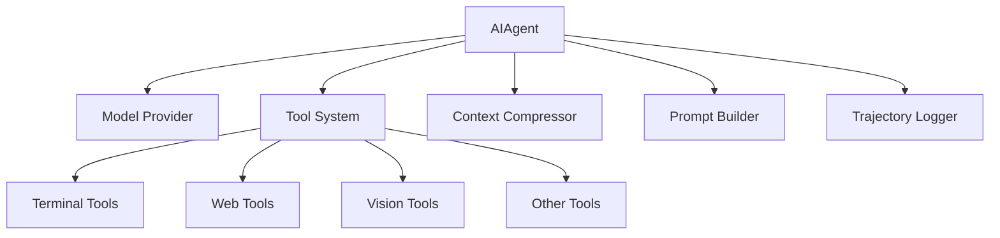

**Main Abstractions**:
- `AIAgent`: Core agent class that orchestrates conversation flow
- `ContextCompressor`: Manages conversation history compression
- `PromptBuilder`: Constructs system prompts and conversation context
- `Trajectory`: Handles logging and analysis of agent interactions

### CLI Interface Architecture

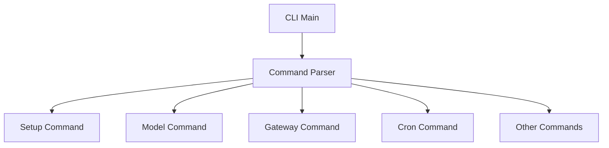

**Main Abstractions**:
- `HermesCLI`: Main CLI class
- `CommandHandler`: Base class for command implementations
- `ConfigManager`: Handles configuration file operations
- `ModelProvider`: Manages model provider configurations

### Gateway System Architecture

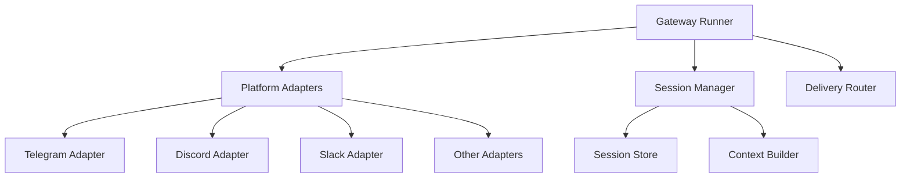

**Main Abstractions**:
- `GatewayRunner`: Main gateway orchestration
- `PlatformAdapter`: Base class for platform-specific implementations
- `SessionStore`: Manages persistent session storage
- `DeliveryRouter`: Routes messages to appropriate destinations
- `SessionContext`: Tracks conversation context and metadata

### Environment System Architecture

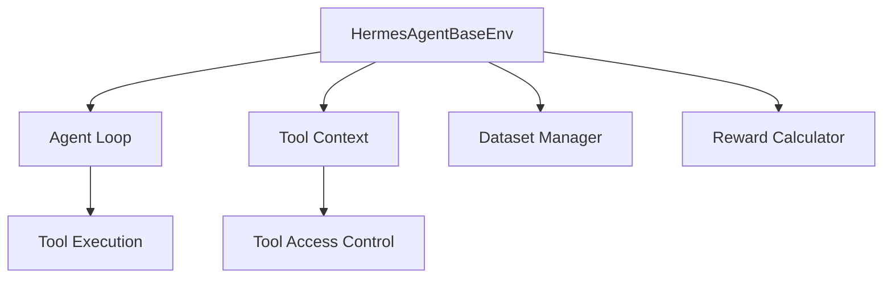

**Main Abstractions**:
- `HermesAgentBaseEnv`: Abstract base environment
- `HermesAgentLoop`: Multi-turn agent loop implementation
- `ToolContext`: Provides tool access for reward functions
- `AgentResult`: Standardized result format

### Tools System Architecture

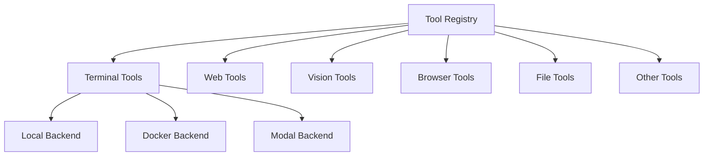

**Main Abstractions**:
- `ToolDefinition`: Standardized tool interface
- `ToolExecutor`: Handles tool execution and error handling
- `RequirementChecker`: Validates tool requirements
- `BackendManager`: Manages terminal backend connections

## 3. Call Sequences and Main Use Cases

### Use Case 1: CLI Conversation Flow

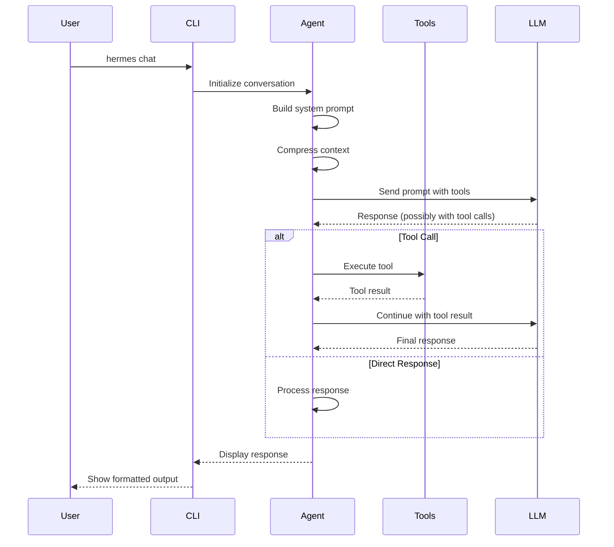

### Use Case 2: Gateway Message Processing

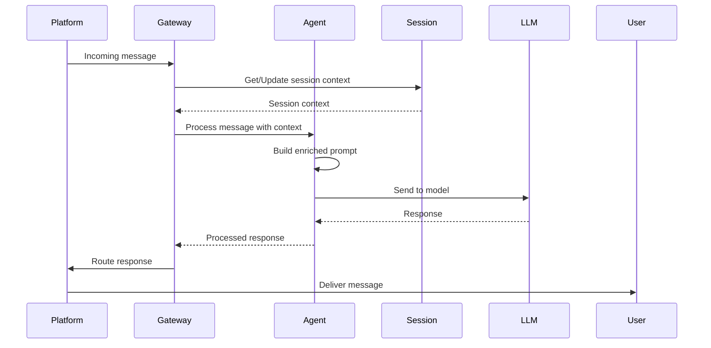

### Use Case 3: Cron Job Execution

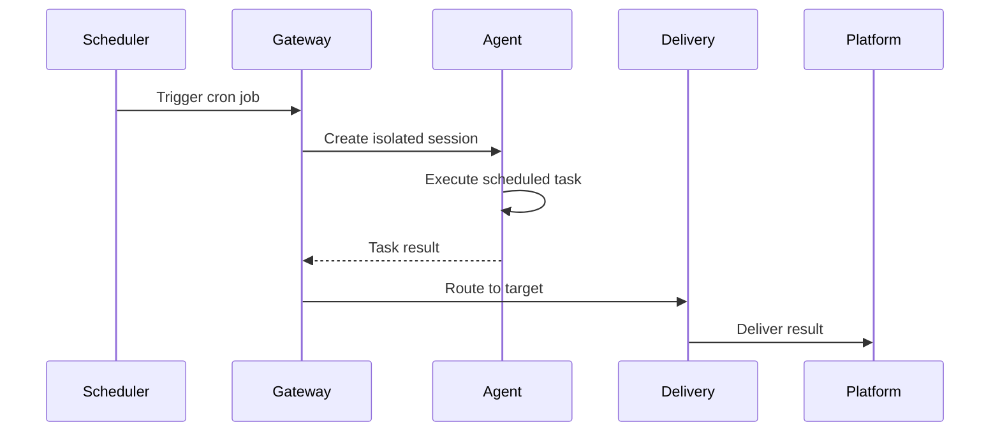

### Use Case 4: Tool Execution Flow

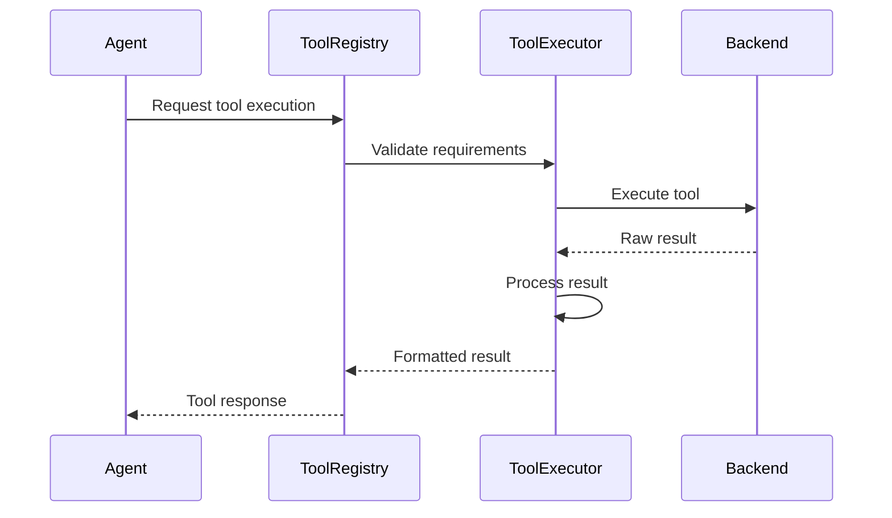

### Use Case 5: RL Training Environment

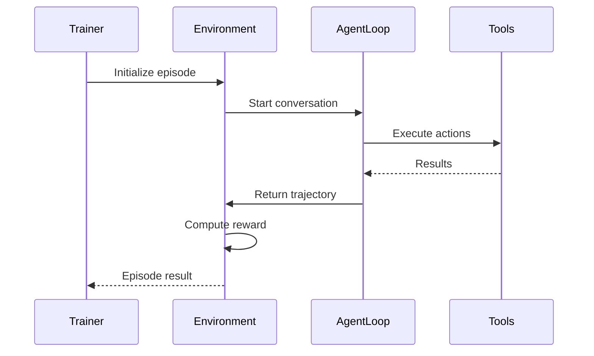

## Key Architectural Patterns

1. **Modular Design**: Each component is self-contained with clear interfaces
2. **Dependency Injection**: Components receive dependencies through constructors
3. **Event-Driven**: Gateway and CLI use event-driven architectures
4. **Adapter Pattern**: Platform adapters standardize different messaging APIs
5. **Strategy Pattern**: Different terminal backends can be swapped
6. **Factory Pattern**: Tool creation and session management
7. **Observer Pattern**: Event handling in gateway and CLI
8. **Repository Pattern**: Data access through standardized interfaces

## Integration Points

1. **CLI ↔ Agent**: Direct function calls with configuration injection
2. **Gateway ↔ Agent**: Message passing with session context
3. **Agent ↔ Tools**: Tool registry and execution interface
4. **Environment ↔ Agent**: RL training loop integration
5. **Skills ↔ Agent**: Skill execution through tool interface
6. **Cron ↔ Gateway**: Scheduled task triggering

## Performance Considerations

1. **Context Compression**: Essential for handling long conversations
2. **Prompt Caching**: Reduces redundant prompt construction
3. **Tool Parallelism**: Multiple tools can execute concurrently
4. **Session Management**: Efficient session storage and retrieval
5. **Model Selection**: Automatic fallback to available models

This architecture provides a flexible, extensible foundation for the Hermes Agent system, allowing it to operate across multiple platforms while maintaining a consistent user experience and powerful tool integration capabilities.

# Kilocode Architecture Documentation

## 1. Main Components Overview

### Tech Stack
- **Language**: TypeScript (primary), JavaScript
- **Framework**: SolidJS (UI), Hono (API), VSCode Extension API
- **Build Tools**: Bun, Vite, esbuild
- **Database**: Drizzle ORM with SQLite
- **AI Integration**: Multiple AI SDKs (Anthropic, OpenAI, Mistral, Claude, etc.)
- **Testing**: Playwright, Jest, Storybook
- **Package Management**: Workspaces with Bun

### Main Components

#### 1. **opencode (CLI)** - `@kilocode/cli`
- **Purpose**: Command-line interface for kilocode operations
- **Location**: `packages/opencode/`
- **Key Features**: Agent management, session handling, file operations, AI model integration

#### 2. **app (Web)** - `@opencode-ai/app`
- **Purpose**: Web application UI for kilocode
- **Location**: `packages/app/`
- **Key Features**: Session management, chat interface, file browsing, settings

#### 3. **desktop** - `@opencode-ai/desktop`
- **Purpose**: Desktop application using Tauri
- **Location**: `packages/desktop/`
- **Key Features**: Cross-platform desktop experience, system integration

#### 4. **kilo-vscode** - VSCode Extension
- **Purpose**: Main IDE integration for Visual Studio Code
- **Location**: `packages/kilo-vscode/`
- **Key Features**: Sidebar integration, agent manager, code actions, autocomplete

#### 5. **kilo-gateway** - API Gateway
- **Purpose**: API gateway and server components
- **Location**: `packages/kilo-gateway/`
- **Key Features**: Authentication, API routing, provider management

#### 6. **kilo-ui** - UI Component Library
- **Purpose**: Shared UI components
- **Location**: `packages/kilo-ui/`
- **Key Features**: Reusable components, theming, accessibility

#### 7. **kilo-telemetry** - Telemetry
- **Purpose**: Telemetry and analytics
- **Location**: `packages/kilo-telemetry/`
- **Key Features**: Usage tracking, error reporting, performance monitoring

#### 8. **kilo-i18n** - Internationalization
- **Purpose**: Internationalization support
- **Location**: `packages/kilo-i18n/`
- **Key Features**: Multi-language support, localization

#### 9. **plugin** - Plugin System
- **Purpose**: Plugin infrastructure
- **Location**: `packages/plugin/`
- **Key Features**: Extensible architecture, third-party integrations

#### 10. **sdk** - Software Development Kit
- **Purpose**: Development kit for kilocode
- **Location**: `packages/sdk/`
- **Key Features**: TypeScript/JavaScript SDK, API clients

#### 11. **util** - Utility Functions
- **Purpose**: Shared utility functions
- **Location**: `packages/util/`
- **Key Features**: Common helpers, data processing, string manipulation

## 2. Detailed Architecture Breakdown

### 2.1 opencode (CLI) Architecture

**Main Entry Point**: `packages/opencode/src/index.ts`

**Key Modules**:
- **CLI Commands**: `src/cli/cmd/` - Various commands like run, generate, auth, agent
- **Agent System**: `src/agent/` - AI agent management and execution
- **Provider System**: `src/provider/` - AI model providers and transformations
- **Project Management**: `src/project/` - Project state and instance management
- **Tools**: `src/tool/` - Various tools for file operations, web access, etc.
- **Session Management**: `src/session/` - Session handling and prompt management
- **Configuration**: `src/config/` - Configuration management
- **Authentication**: `src/auth/` - Authentication and authorization

**Core Abstractions**:
- `Agent`: Manages AI agent execution with different modes (subagent, primary, all)
- `Provider`: Abstract base for AI model providers with concrete implementations
- `Tool`: Interface for various tools that agents can use
- `Session`: Manages conversation sessions with compaction and prompt handling
- `Project`: Manages project state and version control integration

### 2.2 app (Web) Architecture

**Main Entry Point**: `packages/app/src/app.tsx`

**Key Modules**:
- **Context Providers**: Various context providers for state management
- **Pages**: `src/pages/` - Main application pages (home, session, etc.)
- **Components**: Shared UI components
- **Services**: API service integration
- **Routing**: SolidJS Router for navigation

**Core Abstractions**:
- `AppInterface`: Main application component with routing
- `ServerProvider`: Manages server connections
- `SessionProviders`: Provides session-specific context
- `AppShellProviders`: Core application state providers

### 2.3 kilo-vscode Architecture

**Main Entry Point**: `packages/kilo-vscode/src/extension.ts`

**Key Modules**:
- **KiloProvider**: Main VSCode webview provider
- **AgentManagerProvider**: Agent management panel
- **Services**: `src/services/` - CLI backend, autocomplete, browser automation, etc.
- **Commands**: VSCode command registrations
- **Webview Integration**: Communication between VSCode and web content

**Core Abstractions**:
- `KiloProvider`: Manages the sidebar webview
- `AgentManagerProvider`: Manages the agent manager panel
- `KiloConnectionService`: Handles connection to CLI backend
- `BrowserAutomationService`: Manages Playwright-based browser automation

### 2.4 kilo-gateway Architecture

**Main Entry Point**: `packages/kilo-gateway/src/index.ts`

**Key Modules**:
- **Plugin**: Gateway plugin system
- **Provider**: Kilo provider creation and management
- **Auth**: Authentication flows and token management
- **API**: API endpoints for profile, models, notifications
- **Server Routes**: Hono-based API routing
- **TUI**: Text-based user interface components

**Core Abstractions**:
- `KiloAuthPlugin`: Authentication plugin
- `createKilo`: Provider factory function
- `fetchProfile`, `fetchKiloModels`: API client functions
- `createKiloRoutes`: API route generator

## 3. Call Sequences and Main Use Cases

### 3.1 CLI Command Execution Flow

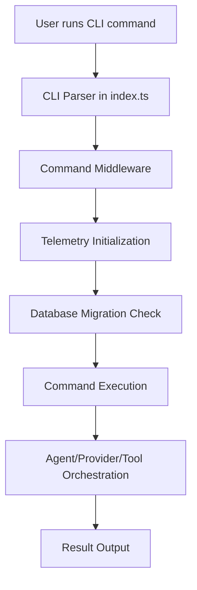

**Example: `kilo run` command**
1. User executes `kilo run "task description"`
2. CLI parser routes to `RunCommand` handler
3. Middleware initializes logging and telemetry
4. Database migration runs if needed
5. `RunCommand` creates agent instance
6. Agent uses appropriate provider (AI model)
7. Tools are executed as needed (file ops, web access, etc.)
8. Results are streamed back to user

### 3.2 VSCode Extension Flow

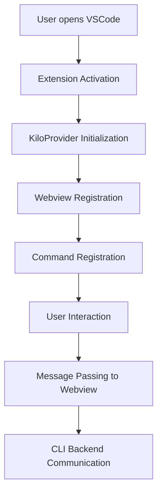

**Example: User clicks "New Task" button**
1. User clicks toolbar button or uses command palette
2. VSCode command handler in `extension.ts` is triggered
3. `KiloProvider.postMessage()` sends action to webview
4. Webview receives message and updates UI
5. User interacts with chat interface
6. Messages sent to CLI backend via `KiloConnectionService`
7. CLI processes request and returns results

### 3.3 Web App Session Flow

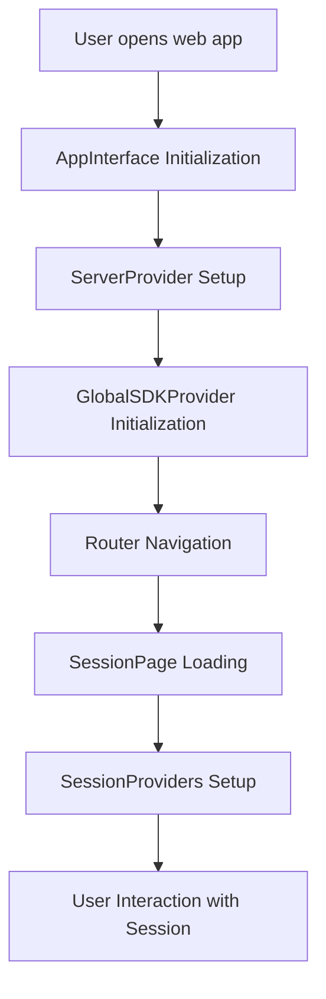

**Example: User creates new session**
1. User navigates to web app URL
2. `AppInterface` initializes with default server connection
3. `GlobalSDKProvider` sets up SDK client
4. Router navigates to session route
5. `SessionProviders` provide session context (terminal, files, prompts)
6. User interacts with chat interface
7. Messages sent to server via SDK
8. Responses streamed back to UI

### 3.4 Main Use Cases

#### Use Case 1: Code Generation
**Actors**: User, CLI/VSCode/Web
**Flow**:
1. User provides natural language description
2. System analyzes context (files, project structure)
3. AI agent generates code suggestions
4. User reviews and accepts/rejects changes
5. System applies changes to files

**Components Involved**:
- Agent system (code generation mode)
- File tools (read/write operations)
- Provider (AI model execution)
- UI (display and interaction)

#### Use Case 2: Browser Automation
**Actors**: User, VSCode Extension, Playwright
**Flow**:
1. User enables browser automation in settings
2. Agent receives task requiring web interaction
3. `BrowserAutomationService` launches Playwright
4. Agent controls browser via MCP protocol
5. Results returned to agent
6. User sees final output

**Components Involved**:
- `BrowserAutomationService`
- MCP (Machine Communication Protocol)
- Playwright integration
- Agent manager UI

#### Use Case 3: Multi-model Orchestration
**Actors**: User, Agent System, Multiple AI Providers
**Flow**:
1. User requests complex task
2. Orchestrator agent breaks down task
3. Sub-tasks assigned to different agents/models
4. Results aggregated and refined
5. Final output presented to user

**Components Involved**:
- Agent orchestration system
- Multiple provider instances
- Session management
- Tool coordination

## 4. Key Architectural Patterns

### 4.1 Plugin Architecture
The system uses a plugin architecture for extensibility:
- Core functionality in main packages
- Plugins can extend providers, tools, and agents
- `packages/plugin/` provides base plugin infrastructure

### 4.2 Provider Pattern
AI model providers follow a consistent pattern:
- Base `Provider` interface
- Concrete implementations for each AI service
- Transformation layer for consistent output
- Provider selection based on configuration

### 4.3 Context Management
Context is managed hierarchically:
- Global context (configuration, authentication)
- Project context (files, VCS state)
- Session context (conversation history)
- Agent context (current task, tools)

### 4.4 Event-Driven Communication
Components communicate via:
- VSCode message passing (extension ↔ webview)
- Event buses for internal state changes
- WebSocket-like connections for real-time updates
- Telemetry events for monitoring

### 4.5 Dependency Injection
Key services are injected:
- `KiloConnectionService` provided to providers
- Configuration injected into components
- Telemetry initialized at startup and passed through

## 5. Data Flow

### 5.1 Configuration Flow
```
User Settings → Config Module → Service Initialization → Component Injection
```

### 5.2 Execution Flow
```
User Input → Command/Action → Agent Creation → Provider Execution → Tool Usage → Result Processing → Output Display
```

### 5.3 Telemetry Flow
```
Component Action → Telemetry Track → Event Batch → API Upload → Analytics Dashboard
```

## 6. Error Handling and Recovery

### 6.1 Error Boundaries
- React-like error boundaries in SolidJS components
- Global error handlers in CLI and extension
- Telemetry captures errors for analysis

### 6.2 Recovery Strategies
- Database migration on startup
- Graceful degradation when services unavailable
- Retry mechanisms for API calls
- User-friendly error messages with recovery options

### 6.3 Debugging Support
- Detailed logging with configurable levels
- Debug commands in CLI
- Telemetry includes error context
- Development mode with enhanced diagnostics

## 7. Performance Considerations

### 7.1 Caching Strategies
- Provider response caching
- Model list caching
- Session compaction to manage context size
- File system caching for frequent operations

### 7.2 Lazy Loading
- Code splitting in web app
- Dynamic imports for heavy components
- Lazy initialization of services

### 7.3 Concurrency Management
- Agent execution throttling
- Parallel tool execution where safe
- Resource limits for browser automation

## 8. Security Architecture

### 8.1 Authentication
- OAuth and API key support
- Token-based authentication
- Secure storage of credentials

### 8.2 Authorization
- Permission system for agent actions
- User confirmation for sensitive operations
- Role-based access control patterns

### 8.3 Data Protection
- Secure communication channels
- Encryption of sensitive data
- Compliance with platform security models

## 9. Deployment Architecture

### 9.1 CLI Distribution
- Single binary distribution
- Cross-platform builds
- Automatic updates

### 9.2 VSCode Extension
- Marketplace distribution
- Automatic updates via VSCode
- Sandboxed execution environment

### 9.3 Web Application
- Static site deployment
- CDN distribution
- Progressive web app capabilities

### 9.4 Desktop Application
- Tauri-based packaging
- Native installers for each platform
- Auto-update mechanism

## 10. Future Evolution

### 10.1 Extensibility Points
- Plugin system for new providers
- Custom agent development
- New tool integrations
- Additional IDE support

### 10.2 Scalability Considerations
- Distributed agent execution
- Load balancing for high-volume usage
- Caching layer optimization
- Performance monitoring

### 10.3 Maintainability
- Modular architecture
- Comprehensive testing
- Documentation generation
- Dependency management

This architecture provides a flexible foundation for kilocode's AI-powered development tooling, supporting multiple interfaces (CLI, VSCode, Web, Desktop) while maintaining a consistent core functionality across all platforms.

# Mistral Vibe Architecture Documentation

## 1. Main Components Overview

### Tech Stack
- **Language**: Python 3.12+
- **Framework**: Custom-built CLI framework with Textual UI
- **Dependencies**: Pydantic, Rich, HTTPX, Pexpect, GitPython, MCP, Agent-Client-Protocol
- **Build System**: Hatch
- **Package Management**: UV

### Main Components

#### 1.1 Core System (`vibe/core/`)
- **Purpose**: Core functionality including agent management, tool system, configuration, and LLM integration
- **Key Modules**:
  - `agent_loop.py`: Main agent execution loop
  - `agents/`: Agent profiles and management
  - `tools/`: Tool discovery and management system
  - `config.py`: Configuration management
  - `llm/`: LLM backend integration
  - `middleware.py`: Middleware pipeline for request processing

#### 1.2 CLI Interface (`vibe/cli/`)
- **Purpose**: Command-line interface and user interaction
- **Key Modules**:
  - `cli.py`: Main CLI entry point and argument parsing
  - `textual_ui/`: Textual-based user interface
  - `commands.py`: Slash command handling
  - `autocompletion/`: Path and command autocompletion

#### 1.3 ACP Integration (`vibe/acp/`)
- **Purpose**: Agent Client Protocol support for editor/IDE integration
- **Key Modules**:
  - `entrypoint.py`: ACP mode entry point
  - `acp_agent_loop.py`: ACP-specific agent loop
  - `tools/`: ACP-specific tools

#### 1.4 Setup & Configuration (`vibe/setup/`)
- **Purpose**: Initial setup, onboarding, and trusted folder management
- **Key Modules**:
  - `onboarding.py`: First-time setup and API key configuration
  - `trusted_folders/`: Trust folder system for security

## 2. Detailed Architecture Breakdown

### 2.1 Core System Architecture

#### Agent Loop (`vibe/core/agent_loop.py`)
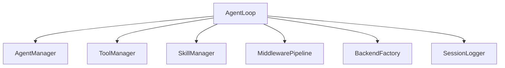

**Key Classes:**
- `AgentLoop`: Main execution loop handling conversation turns
- `AgentManager`: Manages agent profiles and configuration
- `ToolManager`: Discovers and manages available tools
- `SkillManager`: Handles skill discovery and loading
- `MiddlewarePipeline`: Processes middleware for each turn

**Main Methods:**
- `act(msg: str)`: Main entry point for agent actions
- `_conversation_loop(user_msg: str)`: Handles conversation turns
- `_perform_llm_turn()`: Executes LLM turn with tool calls
- `_process_one_tool_call()`: Processes individual tool calls

#### Agent Management (`vibe/core/agents/`)
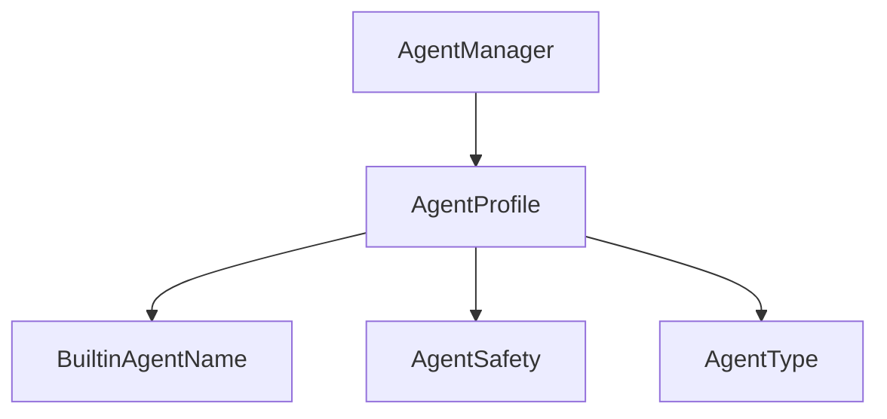

**Key Classes:**
- `AgentManager`: Manages active agent and configuration overrides
- `AgentProfile`: Defines agent behavior and tool permissions
- `BuiltinAgentName`: Enum of built-in agents (default, plan, chat, etc.)

**Built-in Agents:**
- `DEFAULT`: Standard agent requiring tool approval
- `PLAN`: Read-only agent for exploration
- `CHAT`: Read-only conversational mode
- `ACCEPT_EDITS`: Auto-approves file edits
- `AUTO_APPROVE`: Auto-approves all tools
- `EXPLORE`: Subagent for codebase exploration

#### Tool System (`vibe/core/tools/`)
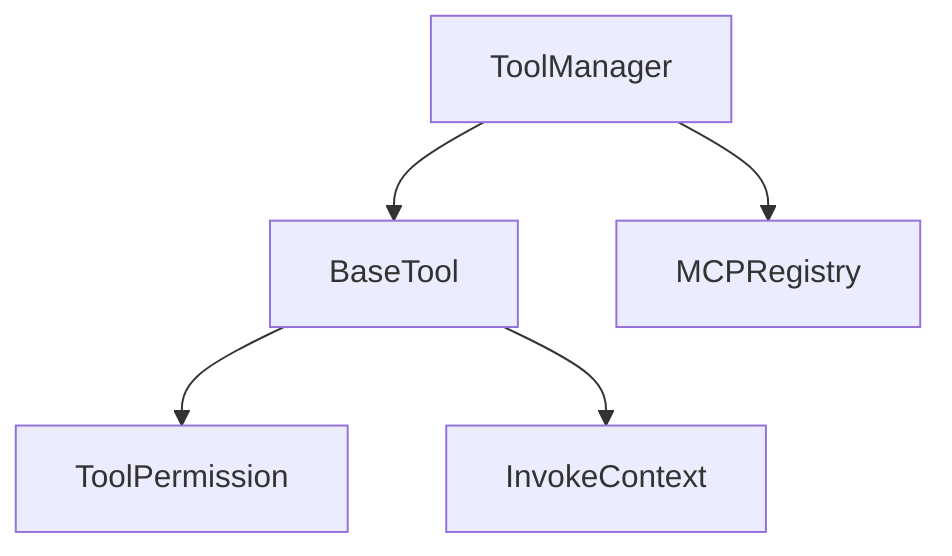

**Key Classes:**
- `ToolManager`: Discovers tools from search paths
- `BaseTool`: Abstract base class for all tools
- `MCPRegistry`: Manages MCP (Model Context Protocol) tools

**Tool Discovery Process:**
1. Search paths: default tools, config paths, local project, global tools
2. Dynamic import of tool modules
3. Registration of tool classes
4. MCP tool integration

#### Configuration System (`vibe/core/config.py`)
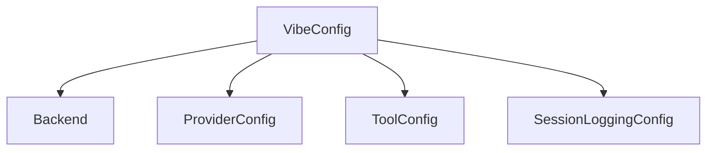

**Key Classes:**
- `VibeConfig`: Main configuration class
- `Backend`: LLM backend configuration
- `ProviderConfig`: API provider settings
- `ToolConfig`: Individual tool permissions

**Configuration Sources:**
1. Default values
2. Environment variables
3. `.env` file (`~/.vibe/.env`)
4. `config.toml` files (local and global)
5. Command-line arguments

### 2.2 CLI Interface Architecture

#### Main CLI Flow (`vibe/cli/cli.py`)
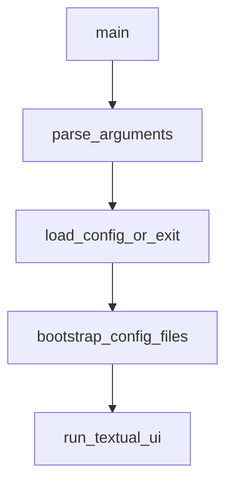

**Key Functions:**
- `main()`: Entry point for CLI
- `get_initial_agent_name()`: Determines agent based on arguments
- `load_config_or_exit()`: Loads configuration with error handling
- `bootstrap_config_files()`: Creates default config if missing

#### Textual UI (`vibe/cli/textual_ui/`)
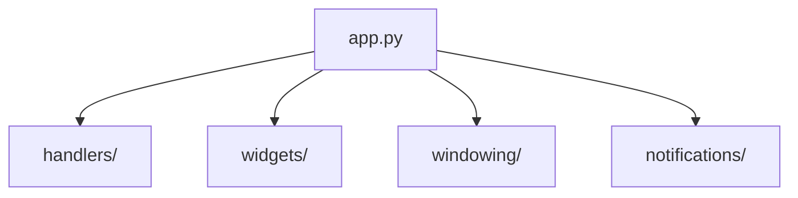

**Key Components:**
- `run_textual_ui()`: Main UI entry point
- `VibeApp`: Textual application class
- `InputHandler`: Handles user input and commands
- `Widget system`: Various UI widgets for display

### 2.3 ACP Integration Architecture

#### ACP Agent Loop (`vibe/acp/acp_agent_loop.py`)
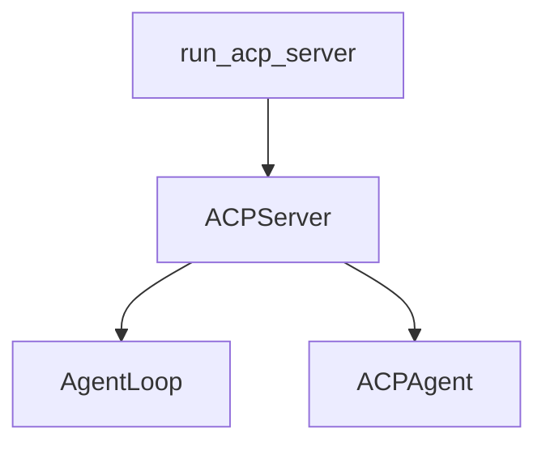

**Key Classes:**
- `ACPServer`: Handles ACP protocol communication
- `ACPAgent`: ACP-specific agent implementation
- `run_acp_server()`: Main ACP entry point

#### ACP Entry Point (`vibe/acp/entrypoint.py`)
```mermaid
graph TD
    A[main] --> B[parse_arguments]
    B --> C[bootstrap_config_files]
    C --> D[run_acp_server]
```

**Key Functions:**
- `main()`: ACP mode entry point
- `parse_arguments()`: Handles ACP-specific arguments
- `bootstrap_config_files()`: Ensures config exists

## 3. Call Sequences and Main Use Cases

### 3.1 Interactive CLI Session

```mermaid
sequenceDiagram
    participant User
    participant CLI
    participant AgentLoop
    participant ToolManager
    participant LLM

    User->>CLI: vibe "refactor code"
    CLI->>AgentLoop: create instance
    AgentLoop->>ToolManager: discover tools
    AgentLoop->>LLM: get system prompt
    AgentLoop->>User: ready for input
    
    User->>AgentLoop: "Find all TODO comments"
    AgentLoop->>Middleware: process input
    Middleware->>AgentLoop: approved
    AgentLoop->>LLM: generate response
    LLM->>AgentLoop: tool call (grep)
    AgentLoop->>ToolManager: execute grep
    ToolManager->>AgentLoop: results
    AgentLoop->>User: display results
```

### 3.2 Tool Execution Flow

```mermaid
sequenceDiagram
    participant AgentLoop
    participant ToolManager
    participant BaseTool
    
    AgentLoop->>ToolManager: get_tool("grep")
    ToolManager->>BaseTool: create instance
    AgentLoop->>BaseTool: invoke(context)
    BaseTool->>AgentLoop: check permission
    AgentLoop->>BaseTool: permission granted
    BaseTool->>BaseTool: execute logic
    BaseTool->>AgentLoop: return result
    AgentLoop->>User: display result
```

### 3.3 Agent Profile Switching

```mermaid
sequenceDiagram
    participant User
    participant AgentLoop
    participant AgentManager
    
    User->>AgentLoop: /agent plan
    AgentLoop->>AgentManager: switch_agent("plan")
    AgentManager->>AgentManager: load profile
    AgentManager->>AgentManager: apply overrides
    AgentManager->>AgentLoop: config updated
    AgentLoop->>User: agent switched to plan
```

### 3.4 ACP Editor Integration

```mermaid
sequenceDiagram
    participant Editor
    participant ACPServer
    participant AgentLoop
    
    Editor->>ACPServer: initialize request
    ACPServer->>AgentLoop: create instance
    AgentLoop->>ACPServer: ready
    ACPServer->>Editor: initialized
    
    Editor->>ACPServer: execute request
    ACPServer->>AgentLoop: act(message)
    AgentLoop->>ACPServer: stream events
    ACPServer->>Editor: stream responses
```

## 4. Key Architectural Patterns

### 4.1 Dependency Injection
- Configuration is passed via callbacks (`lambda: config`)
- Managers receive config getters rather than direct instances
- Enables dynamic configuration updates

### 4.2 Event-Driven Architecture
- Async generators for event streaming
- Middleware pipeline for request processing
- Event-based tool execution and results

### 4.3 Plugin System
- Tool discovery via search paths
- Skill system for extensibility
- MCP integration for external tools

### 4.4 Configuration Layering
- Multiple configuration sources with precedence
- Profile-based agent configurations
- Dynamic configuration merging

## 5. Data Flow

### 5.1 Configuration Loading
```
Environment Variables → .env file → config.toml → Command-line args
```

### 5.2 Tool Execution
```
User Input → Middleware → Agent Loop → Tool Manager → BaseTool → Result
```

### 5.3 LLM Interaction
```
System Prompt + Messages → LLM Backend → Response → Tool Calls → Results → Final Response
```

## 6. Security Architecture

### 6.1 Trust Folder System
- Requires explicit trust for new directories
- Prevents accidental execution in sensitive areas
- Trusted folders stored in config

### 6.2 Tool Permission System
- Per-tool permission levels (ask, always, never)
- Agent profile overrides
- Dynamic permission changes during session

### 6.3 API Key Management
- Secure storage in `.env` file
- Environment variable support
- Interactive setup with encryption

## 7. Extensibility Points

### 7.1 Custom Tools
- Implement `BaseTool` interface
- Place in tool search paths
- Automatic discovery and registration

### 7.2 Custom Agents
- Create agent profile TOML files
- Define tool permissions and overrides
- Place in `~/.vibe/agents/`

### 7.3 Custom Skills
- Follow Agent Skills specification
- Place in skill discovery paths
- Automatic loading and integration

### 7.4 MCP Servers
- Configure in `config.toml`
- HTTP or stdio transport
- Automatic tool registration

## 8. Performance Considerations

### 8.1 Caching
- Tool discovery results cached
- Configuration parsing cached
- LLM response caching via backend

### 8.2 Async Processing
- Non-blocking I/O operations
- Concurrent tool execution
- Streaming responses

### 8.3 Lazy Loading
- Tools loaded on-demand
- MCP servers started when needed
- Configuration loaded once per session

## 9. Error Handling

### 9.1 Middleware Pipeline
- Context warnings for unsafe operations
- Price limits and turn limits
- Read-only agent enforcement

### 9.2 Tool Execution
- Tool permission errors
- Execution timeouts
- Result validation

### 9.3 LLM Integration
- Backend errors and retries
- Rate limiting handling
- Fallback mechanisms

## 10. Testing Strategy

### 10.1 Unit Tests
- Core functionality in `tests/core/`
- Tool testing in `tests/tools/`
- Configuration testing

### 10.2 Integration Tests
- CLI interface testing
- ACP protocol testing
- End-to-end workflows

### 10.3 Snapshot Testing
- UI component snapshots
- Conversation flow testing
- Regression prevention

This architecture provides a flexible, extensible foundation for Mistral Vibe's CLI coding assistant, balancing performance, security, and usability requirements.

