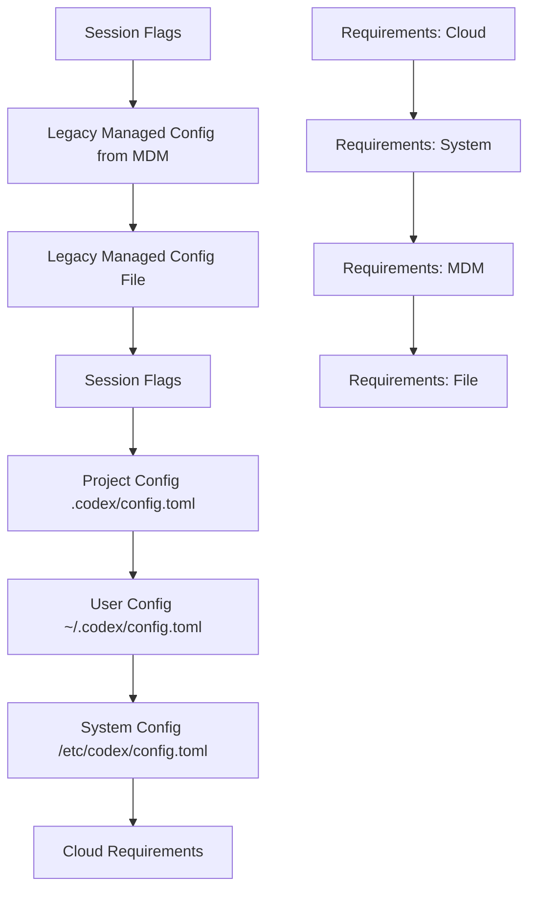
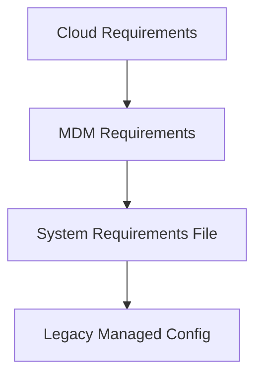
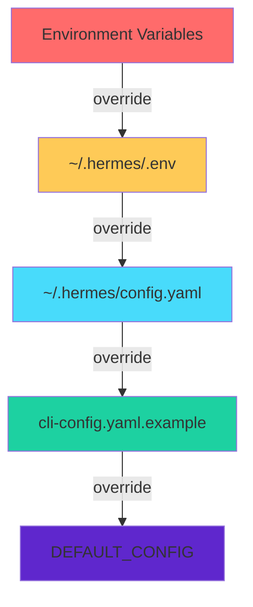
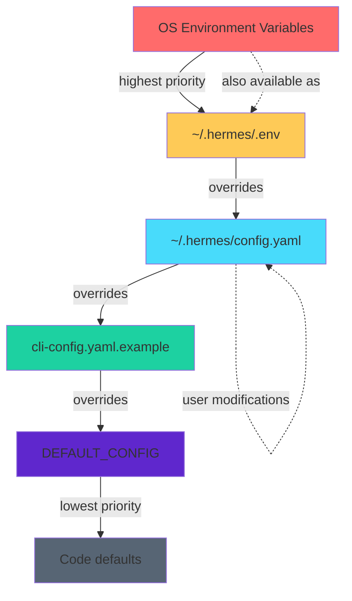
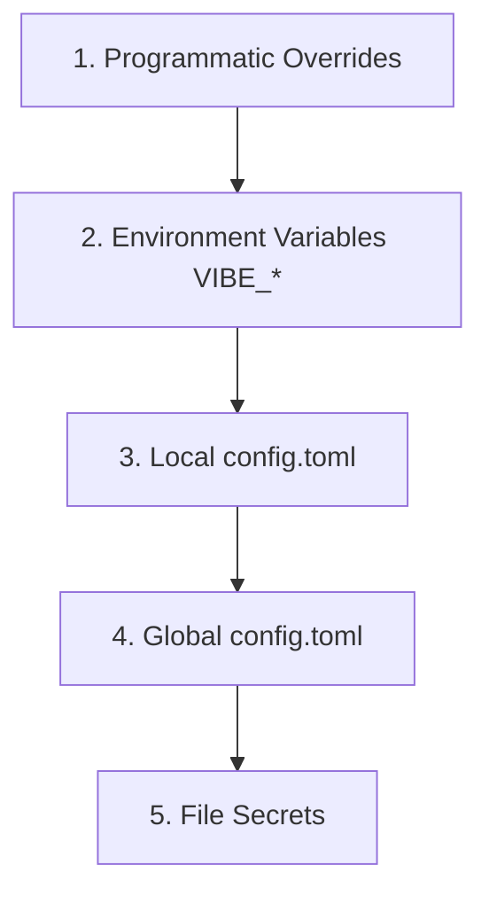
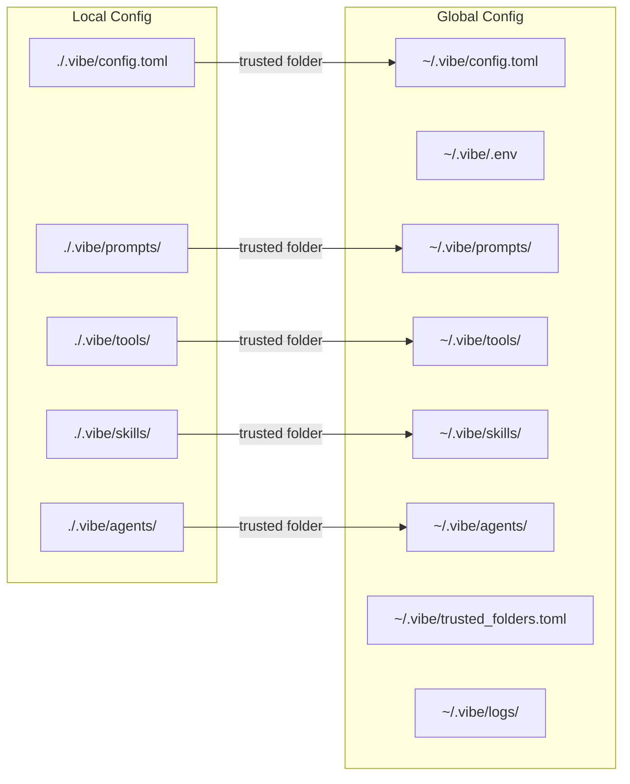
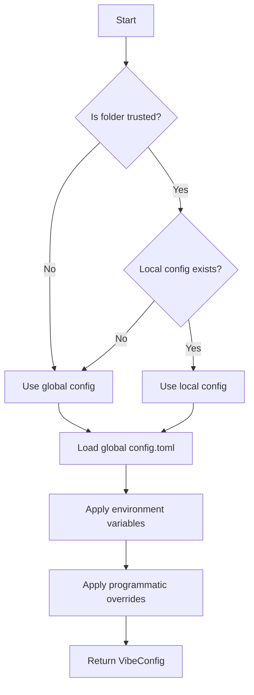

# Codex Configuration System Documentation

## Overview

This document provides a comprehensive reference for the Codex configuration system, including all configuration parameters, their types, default values, usage, and the configuration sources and precedence levels.

## Configuration File Locations

### Primary Configuration Files

| File | Path | Purpose |
|------|------|---------|
| `config.toml` | `${CODEX_HOME}/config.toml` | User-level configuration |
| `requirements.toml` | `/etc/codex/requirements.toml` (Unix) or `%ProgramData%\OpenAI\Codex\requirements.toml` (Windows) | System-level requirements/constraints |
| `managed_config.toml` | `${CODEX_HOME}/managed_config.toml` | Legacy managed configuration (deprecated) |
| `.codex/config.toml` | `${PWD}/.codex/config.toml` | Project-level configuration |

### Environment Variables

| Variable | Purpose |
|----------|---------|
| `CODEX_HOME` | Base directory for Codex configuration (default: `~/.codex`) |

---

## Configuration Parameter Reference

### 1. Core Settings

#### `model`
- **Type**: `String`
- **Default**: `gpt-5.1-codex`
- **Description**: The model slug to use for Codex operations
- **Usage**: Specifies which AI model to use for code generation and analysis

#### `approval_policy`
- **Type**: `AskForApproval` (enum: `onRequest`, `unlessTrusted`, `onFailure`, `never`)
- **Default**: `onRequest`
- **Description**: Controls when Codex asks for user approval before executing commands or modifying files
- **Usage**: Security setting that determines the level of user intervention required

#### `sandbox`
- **Type**: `SandboxPolicy` (enum: `readOnly`, `workspaceWrite`, `dangerFullAccess`, `externalSandbox`)
- **Default**: `readOnly`
- **Description**: Defines the sandbox policy for command execution
- **Usage**: Controls file system and network access for executed commands

#### `web_search_mode`
- **Type**: `WebSearchMode` (enum: `disabled`, `cached`, `live`)
- **Default**: `cached`
- **Description**: Controls how web searches are performed
- **Usage**: Determines whether web searches use cached results or live queries

#### `personality`
- **Type**: `Personality` (enum: `friendly`, `pragmatic`, `none`)
- **Default**: `friendly`
- **Description**: Controls the tone and style of Codex responses
- **Usage**: Affects the conversational style of the AI assistant

#### `summary`
- **Type**: `SummaryLevel` (enum: `concise`, `detailed`)
- **Default**: `concise`
- **Description**: Controls the level of detail in summaries
- **Usage**: Affects how agent messages are summarized

---

### 2. MCP Server Configuration

#### `mcp_servers`
- **Type**: `BTreeMap<String, McpServerConfig>`
- **Default**: `{}` (empty)
- **Description**: Configuration for Model Context Protocol servers
- **Usage**: Enables integration with external tools and services

**Sub-fields:**

| Field | Type | Default | Description |
|-------|------|---------|-------------|
| `command` | `String` | Required for stdio | Command to execute for stdio transport |
| `args` | `Vec<String>` | `[]` | Arguments for the command |
| `env` | `HashMap<String, String>` | `None` | Environment variables for the command |
| `env_vars` | `Vec<String>` | `[]` | Environment variable names to inherit |
| `cwd` | `PathBuf` | `None` | Working directory for the command |
| `url` | `String` | Required for HTTP | URL for streamable HTTP transport |
| `bearer_token_env_var` | `String` | `None` | Environment variable for bearer token |
| `http_headers` | `HashMap<String, String>` | `None` | HTTP headers for requests |
| `env_http_headers` | `HashMap<String, String>` | `None` | HTTP headers from environment variables |
| `startup_timeout_sec` | `Duration` | `30s` | Startup timeout for server initialization |
| `tool_timeout_sec` | `Duration` | `30s` | Timeout for tool calls |
| `enabled` | `bool` | `true` | Whether the server is enabled |
| `required` | `bool` | `false` | Whether startup failure is fatal |
| `enabled_tools` | `Vec<String>` | `None` | Explicit allow-list of tools |
| `disabled_tools` | `Vec<String>` | `None` | Explicit deny-list of tools |
| `scopes` | `Vec<String>` | `None` | OAuth scopes to request |
| `oauth_resource` | `String` | `None` | OAuth resource parameter |

---

### 3. Apps/Connectors Configuration

#### `apps`
- **Type**: `AppsConfigToml`
- **Default**: `{}` (empty)
- **Description**: Configuration for external apps/connectors
- **Usage**: Enables integration with third-party services

**Sub-fields:**

| Field | Type | Default | Description |
|-------|------|---------|-------------|
| `_default` | `AppsDefaultConfig` | Default settings | Default settings for all apps |
| Per-app settings | `HashMap<String, AppConfig>` | `{}` | Per-app configuration |

**AppConfig sub-fields:**

| Field | Type | Default | Description |
|-------|------|---------|-------------|
| `enabled` | `bool` | `true` | Whether the app is enabled |
| `destructive_enabled` | `bool` | `true` | Whether destructive tools are allowed |
| `open_world_enabled` | `bool` | `true` | Whether open-world tools are allowed |
| `default_tools_approval_mode` | `AppToolApproval` | `auto` | Default approval mode for tools |
| `default_tools_enabled` | `bool` | `true` | Whether tools are enabled by default |
| `tools` | `AppToolsConfig` | `{}` | Per-tool overrides |

---

### 4. TUI (Terminal User Interface) Configuration

#### `tui`
- **Type**: `Tui`
- **Default**: See below
- **Description**: Settings specific to the terminal user interface
- **Usage**: Controls TUI behavior and appearance

**Sub-fields:**

| Field | Type | Default | Description |
|-------|------|---------|-------------|
| `notifications` | `Notifications` | `Enabled(true)` | Enable desktop notifications |
| `notification_method` | `NotificationMethod` | `auto` | Method for notifications |
| `animations` | `bool` | `true` | Enable animations |
| `show_tooltips` | `bool` | `true` | Show startup tooltips |
| `alternate_screen` | `AltScreenMode` | `auto` | Alternate screen buffer behavior |
| `status_line` | `Vec<String>` | `None` | Custom status line items |
| `theme` | `String` | `None` | Syntax highlighting theme |

**NotificationMethod values:**
- `auto` (default): Automatically detect best method
- `osc9`: OSC 9 escape sequence
- `bel`: Terminal bell

**AltScreenMode values:**
- `auto` (default): Disable in Zellij, enable elsewhere
- `always`: Always use alternate screen
- `never`: Never use alternate screen

---

### 5. Notice Configuration

#### `notice`
- **Type**: `Notice`
- **Default**: All fields `None`
- **Description**: Tracks user acknowledgments for various warnings and prompts
- **Usage**: Manages user interactions with warnings and NUX (New User Experience) screens

**Sub-fields:**

| Field | Type | Default | Description |
|-------|------|---------|-------------|
| `hide_full_access_warning` | `bool` | `None` | User acknowledged full access warning |
| `hide_world_writable_warning` | `bool` | `None` | User acknowledged world-writable warning |
| `hide_rate_limit_model_nudge` | `bool` | `None` | User opted out of rate limit nudge |
| `hide_gpt5_1_migration_prompt` | `bool` | `None` | User acknowledged GPT-5.1 migration |
| `hide_gpt-5.1-codex-max_migration_prompt` | `bool` | `None` | User acknowledged GPT-5.1-codex-max migration |
| `model_migrations` | `BTreeMap<String, String>` | `{}` | Acknowledged model migrations |

---

### 6. Shell Environment Policy

#### `shell_environment_policy`
- **Type**: `ShellEnvironmentPolicyToml`
- **Default**: See below
- **Description**: Controls environment variable inheritance for shell commands
- **Usage**: Security setting that determines which environment variables are passed to executed commands

**Sub-fields:**

| Field | Type | Default | Description |
|-------|------|---------|-------------|
| `inherit` | `ShellEnvironmentPolicyInherit` | `all` | Inheritance policy |
| `ignore_default_excludes` | `bool` | `true` | Skip default exclude patterns |
| `exclude` | `Vec<String>` | `[]` | Regex patterns to exclude |
| `set` | `HashMap<String, String>` | `{}` | Variables to set |
| `include_only` | `Vec<String>` | `[]` | Regex patterns to include |
| `experimental_use_profile` | `bool` | `false` | Use shell profile |

**ShellEnvironmentPolicyInherit values:**
- `core`: Only core environment variables
- `all` (default): Full environment inheritance
- `none`: No inheritance

---

### 7. Analytics Configuration

#### `analytics`
- **Type**: `AnalyticsConfigToml`
- **Default**: `enabled: true`
- **Description**: Controls analytics collection
- **Usage**: Enables/disables telemetry and usage data collection

**Sub-fields:**

| Field | Type | Default | Description |
|-------|------|---------|-------------|
| `enabled` | `bool` | `true` | Enable analytics |

---

### 8. Feedback Configuration

#### `feedback`
- **Type**: `FeedbackConfigToml`
- **Default**: `enabled: true`
- **Description**: Controls feedback flow
- **Usage**: Enables/disables user feedback mechanisms

**Sub-fields:**

| Field | Type | Default | Description |
|-------|------|---------|-------------|
| `enabled` | `bool` | `true` | Enable feedback flow |

---

### 9. Memories Configuration

#### `memories`
- **Type**: `MemoriesToml`
- **Default**: See below
- **Description**: Controls conversation memory and summarization
- **Usage**: Manages how Codex remembers and summarizes conversation history

**Sub-fields:**

| Field | Type | Default | Description |
|-------|------|---------|-------------|
| `no_memories_if_mcp_or_web_search` | `bool` | `false` | Disable memories with MCP/web search |
| `generate_memories` | `bool` | `true` | Generate memories for new threads |
| `use_memories` | `bool` | `true` | Use memories in prompts |
| `max_raw_memories_for_consolidation` | `usize` | `256` | Max raw memories for consolidation |
| `max_unused_days` | `i64` | `30` | Max days before memory is unused |
| `max_rollout_age_days` | `i64` | `30` | Max age of threads for memories |
| `max_rollouts_per_startup` | `usize` | `16` | Max rollouts processed per startup |
| `min_rollout_idle_hours` | `i64` | `6` | Min idle time before memory creation |
| `extract_model` | `String` | `None` | Model for thread summarization |
| `consolidation_model` | `String` | `None` | Model for memory consolidation |

---

### 10. History Configuration

#### `history`
- **Type**: `History`
- **Default**: See below
- **Description**: Controls conversation history persistence
- **Usage**: Manages how conversation history is stored

**Sub-fields:**

| Field | Type | Default | Description |
|-------|------|---------|-------------|
| `persistence` | `HistoryPersistence` | `saveAll` | Persistence mode |
| `max_bytes` | `usize` | `None` | Maximum file size in bytes |

**HistoryPersistence values:**
- `saveAll` (default): Save all history entries
- `none`: Do not write history to disk

---

### 11. OTEL (OpenTelemetry) Configuration

#### `otel`
- **Type**: `OtelConfigToml`
- **Default**: See below
- **Description**: OpenTelemetry tracing and metrics configuration
- **Usage**: Controls telemetry export for observability

**Sub-fields:**

| Field | Type | Default | Description |
|-------|------|---------|-------------|
| `log_user_prompt` | `bool` | `false` | Log user prompts in traces |
| `environment` | `String` | `dev` | Environment identifier |
| `exporter` | `OtelExporterKind` | `None` | Log exporter |
| `trace_exporter` | `OtelExporterKind` | `None` | Trace exporter |
| `metrics_exporter` | `OtelExporterKind` | `statsig` | Metrics exporter |

**OtelExporterKind values:**
- `none`: No export
- `statsig`: Statsig exporter
- `otlpHttp`: OTLP over HTTP
- `otlpGrpc`: OTLP over gRPC

**OtelTlsConfig sub-fields:**

| Field | Type | Default | Description |
|-------|------|---------|-------------|
| `ca_certificate` | `AbsolutePathBuf` | `None` | CA certificate path |
| `client_certificate` | `AbsolutePathBuf` | `None` | Client certificate path |
| `client_private_key` | `AbsolutePathBuf` | `None` | Client private key path |

---

### 12. Windows Configuration

#### `windows`
- **Type**: `WindowsToml`
- **Default**: `sandbox: None`
- **Description**: Windows-specific configuration
- **Usage**: Controls Windows sandbox behavior

**Sub-fields:**

| Field | Type | Default | Description |
|-------|------|---------|-------------|
| `sandbox` | `WindowsSandboxModeToml` | `None` | Sandbox mode |

**WindowsSandboxModeToml values:**
- `elevated`: Elevated sandbox mode
- `unelevated`: Non-elevated sandbox mode

---

### 13. Feature Requirements

#### `features`
- **Type**: `BTreeMap<String, bool>`
- **Default**: `{}` (empty)
- **Description**: Feature flags for enabling/disabling features
- **Usage**: Controls experimental and beta features

**Example:**
```toml
[features]
apps = true
personality = true
unified_exec = false
```

---

### 14. Network Requirements (Experimental)

#### `experimental_network`
- **Type**: `NetworkRequirementsToml`
- **Default**: All fields `None`
- **Description**: Network access constraints and policies
- **Usage**: Controls network access for sandboxed commands

**Sub-fields:**

| Field | Type | Default | Description |
|-------|------|---------|-------------|
| `enabled` | `bool` | `None` | Enable network constraints |
| `http_port` | `u16` | `None` | HTTP proxy port |
| `socks_port` | `u16` | `None` | SOCKS proxy port |
| `allow_upstream_proxy` | `bool` | `None` | Allow upstream proxy |
| `dangerously_allow_non_loopback_proxy` | `bool` | `None` | Allow non-loopback proxy |
| `dangerously_allow_all_unix_sockets` | `bool` | `None` | Allow all Unix sockets |
| `allowed_domains` | `Vec<String>` | `None` | Allowed domains |
| `managed_allowed_domains_only` | `bool` | `None` | Only managed domains |
| `denied_domains` | `Vec<String>` | `None` | Denied domains |
| `allow_unix_sockets` | `Vec<String>` | `None` | Allowed Unix sockets |
| `allow_local_binding` | `bool` | `None` | Allow local binding |

---

### 15. Execution Policy Rules

#### `rules`
- **Type**: `RequirementsExecPolicyToml`
- **Default**: `{}` (empty)
- **Description**: Execution policy rules for command approval
- **Usage**: Defines rules for automatic command approval/forbiddance

**Sub-fields:**

| Field | Type | Default | Description |
|-------|------|---------|-------------|
| `prefix_rules` | `Vec<PrefixRule>` | `[]` | Prefix-based rules |
| `suffix_rules` | `Vec<SuffixRule>` | `[]` | Suffix-based rules |
| `regex_rules` | `Vec<RegexRule>` | `[]` | Regex-based rules |

**Rule structure:**
```toml
[prefix_rules]
pattern = [{ token = "rm" }]
decision = "forbidden"
```

---

### 16. Allowed Values (Requirements)

These fields define the allowed values for various settings. They are typically set in `requirements.toml` for managed environments.

#### `allowed_approval_policies`
- **Type**: `Vec<AskForApproval>`
- **Default**: All values allowed
- **Description**: Allowed approval policy values
- **Usage**: Restricts which approval policies can be used

#### `allowed_sandbox_modes`
- **Type**: `Vec<SandboxModeRequirement>`
- **Default**: All values allowed
- **Description**: Allowed sandbox mode values
- **Usage**: Restricts which sandbox modes can be used

#### `allowed_web_search_modes`
- **Type**: `Vec<WebSearchModeRequirement>`
- **Default**: All values allowed
- **Description**: Allowed web search mode values
- **Usage**: Restricts which web search modes can be used

---

### 17. Residency Requirements

#### `enforce_residency`
- **Type**: `ResidencyRequirement`
- **Default**: `None`
- **Description**: Data residency requirements
- **Usage**: Ensures data stays within specific geographic boundaries

**Values:**
- `us`: Data must reside in the United States

---

## Configuration Sources and Precedence

### Configuration Layer Stack

The Codex configuration system uses a layered approach where configurations from different sources are merged. Higher precedence layers override lower precedence layers.

### Precedence Order (Highest to Lowest)



### Configuration Sources

| Source | Path/Location | Precedence | Description |
|--------|---------------|------------|-------------|
| **Session Flags** | CLI flags, UI settings | Highest | Runtime overrides from command line or UI |
| **Legacy Managed Config from MDM** | macOS managed preferences | High | Managed configuration from MDM (macOS only) |
| **Legacy Managed Config File** | `${CODEX_HOME}/managed_config.toml` | High | Legacy managed configuration file |
| **Project Config** | `${PWD}/.codex/config.toml` | Medium | Per-project configuration |
| **User Config** | `${CODEX_HOME}/config.toml` | Medium | User-level configuration |
| **System Config** | `/etc/codex/config.toml` (Unix) | Low | System-wide configuration |
| **Cloud Requirements** | Cloud-managed | Low | Cloud-enforced requirements |
| **System Requirements** | `/etc/codex/requirements.toml` | Lowest | System-level requirements |

### Requirements Sources

Requirements (constraints) follow a different precedence order:



| Source | Path/Location | Description |
|--------|---------------|-------------|
| **Cloud Requirements** | Cloud-managed | Cloud-enforced constraints |
| **MDM Requirements** | macOS managed preferences | MDM-managed constraints (macOS only) |
| **System Requirements** | `/etc/codex/requirements.toml` | System-level constraints |
| **Legacy Managed Config** | `${CODEX_HOME}/managed_config.toml` | Legacy constraints |

---

## Configuration API

The Codex configuration system exposes several API endpoints for reading and writing configuration:

### Configuration Read API

- **Method**: `config/read`
- **Purpose**: Fetch the effective configuration after resolving all layers
- **Response**: Includes the effective config, origins, and optional layer details

### Configuration Write API

- **Method**: `config/value/write`
- **Purpose**: Write a single configuration key/value
- **Method**: `config/batchWrite`
- **Purpose**: Apply multiple configuration edits atomically

### Configuration Requirements API

- **Method**: `configRequirements/read`
- **Purpose**: Fetch loaded requirements constraints
- **Response**: Includes allow-lists, pinned feature values, residency requirements, and network constraints

### MCP Server Reload

- **Method**: `config/mcpServer/reload`
- **Purpose**: Reload MCP server configuration without restarting the server

---

## Configuration Validation

The configuration system includes validation for:

1. **TOML Syntax**: All configuration files must be valid TOML
2. **Field Types**: Each field must match its expected type
3. **Value Constraints**: Values must be within allowed ranges
4. **Feature Requirements**: Feature flags must comply with requirements
5. **Cross-field Validation**: Some fields have interdependencies

### Common Validation Errors

| Error Code | Description |
|------------|-------------|
| `ConfigValidationError` | General validation failure |
| `ConfigPathNotFound` | Configuration path does not exist |
| `ConfigVersionConflict` | Configuration was modified since last read |
| `ConfigLayerReadonly` | Attempted to write to a read-only layer |

---

## Example Configuration

### Complete `config.toml` Example

```toml
# Codex user configuration

# Core settings
model = "gpt-5.1-codex"
approval_policy = "on-request"
sandbox = "readOnly"
web_search_mode = "cached"
personality = "friendly"
summary = "concise"

# MCP Servers
[mcp_servers.docs]
command = "codex-mcp"
args = ["docs"]
startup_timeout_sec = 60
enabled = true
required = false

[mcp_servers.remote]
url = "https://example.com/mcp"
bearer_token_env_var = "MCP_TOKEN"
startup_timeout_sec = 30

# Apps
[apps._default]
enabled = true
destructive_enabled = true
open_world_enabled = true

[apps.google_drive]
enabled = true
default_tools_approval_mode = "prompt"

# TUI Settings
[tui]
notifications = true
notification_method = "auto"
animations = true
show_tooltips = true
alternate_screen = "auto"
theme = "monokai"

# Notice Settings
[notice]
hide_full_access_warning = false
hide_rate_limit_model_nudge = false

# Shell Environment Policy
[shell_environment_policy]
inherit = "all"
ignore_default_excludes = true
exclude = ["*KEY*", "*SECRET*", "*TOKEN*"]
set = {}
include_only = []
experimental_use_profile = false

# Analytics
[analytics]
enabled = true

# Feedback
[feedback]
enabled = true

# Memories
[memories]
no_memories_if_mcp_or_web_search = false
generate_memories = true
use_memories = true
max_raw_memories_for_consolidation = 256
max_unused_days = 30
max_rollout_age_days = 30
max_rollouts_per_startup = 16
min_rollout_idle_hours = 6

# History
[history]
persistence = "saveAll"
max_bytes = 10485760

# OTEL
[otel]
log_user_prompt = false
environment = "dev"
exporter = "none"
trace_exporter = "none"
metrics_exporter = "statsig"

# Features
[features]
apps = true
personality = true
unified_exec = true
```

### Requirements.toml Example

```toml
# System requirements/constraints

# Allowed approval policies
allowed_approval_policies = ["on-request", "unlessTrusted"]

# Allowed sandbox modes
allowed_sandbox_modes = ["read-only", "workspace-write"]

# Allowed web search modes
allowed_web_search_modes = ["cached", "live"]

# Feature requirements
[features]
apps = true
personality = false

# MCP server requirements
[mcp_servers.docs]
identity = { command = "codex-mcp" }

# Execution policy rules
[rules.prefix_rules]
pattern = [{ token = "rm" }]
decision = "forbidden"

# Network constraints
[experimental_network]
enabled = true
http_port = 8080
socks_port = 1080
allow_upstream_proxy = false
allowed_domains = ["api.openai.com", "*.github.com"]
denied_domains = ["blocked.example.com"]
allow_unix_sockets = ["/tmp/proxy.sock"]
allow_local_binding = false

# Residency requirements
enforce_residency = "us"
```

---

## Migration Guide

### From Legacy `managed_config.toml`

The legacy `managed_config.toml` format is still supported but deprecated. Migrate to the new structure:

1. Move `managed_config.toml` content to `config.toml`
2. Move requirements to `requirements.toml`
3. Update any MDM configurations to use the new format

### Feature Flag Migration

When migrating feature flags:

1. Review the `features` section in `requirements.toml`
2. Ensure your `config.toml` complies with the requirements
3. Update any hardcoded feature flags in your code

---

## Troubleshooting

### Common Issues

1. **Configuration not loading**: Check file permissions and path
2. **Validation errors**: Review TOML syntax and field types
3. **Override not working**: Verify precedence order
4. **MCP server not starting**: Check timeout and command path

### Debugging

Enable verbose logging:
```bash
export RUST_LOG=debug
codex ...
```

Check effective configuration:
```bash
codex app-server config/read
```

---

## References

- [App Server README](codex-rs/app-server/README.md)
- [Config Types](codex-rs/core/src/config/types.rs)
- [Config Service](codex-rs/core/src/config/service.rs)
- [Config Loader](codex-rs/core/src/config_loader/mod.rs)
- [Config Requirements](codex-rs/config/src/config_requirements.rs)

# Hermes Agent Configuration System Reference

A comprehensive reference document for the Hermes Agent configuration system, documenting all configuration parameters, their types, usage, default values, and sources.

---

## Table of Contents

1. [Configuration Overview](#configuration-overview)
2. [Configuration Sources and Priority](#configuration-sources-and-priority)
3. [Configuration Files](#configuration-files)
4. [Configuration Parameters by Theme](#configuration-parameters-by-theme)
   - [LLM Provider Configuration](#llm-provider-configuration)
   - [Tool API Keys](#tool-api-keys)
   - [Terminal Configuration](#terminal-configuration)
   - [Browser Configuration](#browser-configuration)
   - [Context Compression](#context-compression)
   - [Persistent Memory](#persistent-memory)
   - [Session Reset Policy](#session-reset-policy)
   - [Skills Configuration](#skills-configuration)
   - [Agent Behavior](#agent-behavior)
   - [Toolsets](#toolsets)
   - [MCP Servers](#mcp-servers)
   - [Display Settings](#display-settings)
   - [Text-to-Speech / Speech-to-Text](#text-to-speech--speech-to-text)
   - [Human Delay Settings](#human-delay-settings)
   - [Timezone](#timezone)
   - [Command Allowlist](#command-allowlist)
   - [Gateway Configuration](#gateway-configuration)
   - [Benchmark Environment Configuration](#benchmark-environment-configuration)
5. [Configuration Migration System](#configuration-migration-system)
6. [Configuration Management Commands](#configuration-management-commands)

---

## Configuration Overview

The Hermes Agent configuration system uses a **hierarchical, multi-source approach** with the following characteristics:

- **Two primary configuration files**: `~/.hermes/config.yaml` (settings) and `~/.hermes/.env` (secrets)
- **Environment variable overrides**: All settings can be overridden via environment variables
- **Versioned configuration**: Automatic migration system ensures backward compatibility
- **Deep merge**: User config is merged with defaults, preserving unspecified values
- **Platform-specific filtering**: Skills and tools can be restricted by OS platform

---

## Configuration Sources and Priority

Configuration values are resolved in the following priority order (highest to lowest):

```
1. Environment Variables (OS-level)
2. ~/.hermes/.env file
3. ~/.hermes/config.yaml file
4. cli-config.yaml.example (project-level defaults)
5. DEFAULT_CONFIG (code defaults in hermes_cli/config.py)
```

### Source Hierarchy Diagram



---

## Configuration Files

### File Locations

| File | Path | Purpose |
|------|------|---------|
| User Config | `~/.hermes/config.yaml` | All settings (model, toolsets, terminal, etc.) |
| Secrets | `~/.hermes/.env` | API keys and secrets |
| Gateway Config | `~/.hermes/gateway.json` | Messaging platform configuration |
| Project Example | `cli-config.yaml.example` | Template for user config |
| Env Example | `.env.example` | Template for secrets |

### Config Version

The configuration system uses versioning to ensure backward compatibility:

- **Current version**: `5`
- **Migration**: Automatic on `hermes update` or `hermes config migrate`
- **Version tracking**: Stored in `config.yaml` as `_config_version`

---

## Configuration Parameters by Theme

### LLM Provider Configuration

#### `model` (config.yaml)

| Property | Value |
|----------|-------|
| **Type** | `string` |
| **Default** | `"anthropic/claude-opus-4.6"` |
| **Location** | `~/.hermes/config.yaml` |
| **Env Override** | `LLM_MODEL` |

**Description**: Default LLM model to use (OpenRouter format: `provider/model`)

**Examples**:
```yaml
model: "anthropic/claude-opus-4.6"
model: "openai/gpt-4o"
model: "google/gemini-3-flash-preview"
model: "zhipuai/glm-4-plus"
```

#### `provider` (config.yaml)

| Property | Value |
|----------|-------|
| **Type** | `string` |
| **Default** | `"auto"` |
| **Location** | `~/.hermes/config.yaml` |
| **Env Override** | `HERMES_INFERENCE_PROVIDER` |

**Description**: Inference provider selection

**Options**:
- `"auto"` - Use Nous Portal if logged in, otherwise OpenRouter/env vars (default)
- `"openrouter"` - Always use OpenRouter API key from `OPENROUTER_API_KEY`
- `"nous"` - Always use Nous Portal (requires: `hermes login`)
- `"zai"` - Use z.ai / ZhipuAI GLM models (requires: `GLM_API_KEY`)
- `"kimi-coding"` - Use Kimi / Moonshot AI models (requires: `KIMI_API_KEY`)
- `"minimax"` - Use MiniMax global endpoint (requires: `MINIMAX_API_KEY`)
- `"minimax-cn"` - Use MiniMax China endpoint (requires: `MINIMAX_CN_API_KEY`)

#### `base_url` (config.yaml)

| Property | Value |
|----------|-------|
| **Type** | `string` |
| **Default** | `"https://openrouter.ai/api/v1"` |
| **Location** | `~/.hermes/config.yaml` |

**Description**: API base URL for the LLM provider

---

### Tool API Keys

#### `OPENROUTER_API_KEY` (.env)

| Property | Value |
|----------|-------|
| **Type** | `string` (secret) |
| **Default** | `(not set)` |
| **Location** | `~/.hermes/.env` |
| **Required for** | Vision analysis, web scraping helpers, MoA |

**Description**: OpenRouter API key for vision, web scraping helpers, and MoA

**Get at**: [https://openrouter.ai/keys](https://openrouter.ai/keys)

#### `GLM_API_KEY` / `ZAI_API_KEY` / `Z_AI_API_KEY` (.env)

| Property | Value |
|----------|-------|
| **Type** | `string` (secret) |
| **Default** | `(not set)` |
| **Location** | `~/.hermes/.env` |
| **Required for** | ZhipuAI GLM models |

**Description**: Z.AI / GLM API key (aliases: `ZAI_API_KEY`, `Z_AI_API_KEY`)

**Get at**: [https://z.ai/](https://z.ai/)

#### `KIMI_API_KEY` (.env)

| Property | Value |
|----------|-------|
| **Type** | `string` (secret) |
| **Default** | `(not set)` |
| **Location** | `~/.hermes/.env` |
| **Required for** | Kimi / Moonshot AI models |

**Description**: Kimi / Moonshot API key

**Get at**: [https://platform.moonshot.cn/](https://platform.moonshot.cn/)

#### `MINIMAX_API_KEY` (.env)

| Property | Value |
|----------|-------|
| **Type** | `string` (secret) |
| **Default** | `(not set)` |
| **Location** | `~/.hermes/.env` |
| **Required for** | MiniMax global endpoint |

**Description**: MiniMax API key (international)

**Get at**: [https://www.minimax.io/](https://www.minimax.io/)

#### `MINIMAX_CN_API_KEY` (.env)

| Property | Value |
|----------|-------|
| **Type** | `string` (secret) |
| **Default** | `(not set)` |
| **Location** | `~/.hermes/.env` |
| **Required for** | MiniMax China endpoint |

**Description**: MiniMax API key (China endpoint)

**Get at**: [https://www.minimaxi.com/](https://www.minimaxi.com/)

#### `FIRECRAWL_API_KEY` (.env)

| Property | Value |
|----------|-------|
| **Type** | `string` (secret) |
| **Default** | `(not set)` |
| **Location** | `~/.hermes/.env` |
| **Required for** | `web_search`, `web_extract` |

**Description**: Firecrawl API key for web search and scraping

**Get at**: [https://firecrawl.dev/](https://firecrawl.dev/)

#### `FIRECRAWL_API_URL` (.env)

| Property | Value |
|----------|-------|
| **Type** | `string` |
| **Default** | `(empty - uses cloud)` |
| **Location** | `~/.hermes/.env` |

**Description**: Firecrawl API URL for self-hosted instances

#### `BROWSERBASE_API_KEY` (.env)

| Property | Value |
|----------|-------|
| **Type** | `string` (secret) |
| **Default** | `(not set)` |
| **Location** | `~/.hermes/.env` |
| **Required for** | `browser_navigate`, `browser_click` |

**Description**: Browserbase API key for cloud browser (optional — local browser works without this)

**Get at**: [https://browserbase.com/](https://browserbase.com/)

#### `BROWSERBASE_PROJECT_ID` (.env)

| Property | Value |
|----------|-------|
| **Type** | `string` |
| **Default** | `(not set)` |
| **Location** | `~/.hermes/.env` |

**Description**: Browserbase project ID (only needed for cloud browser)

#### `FAL_KEY` (.env)

| Property | Value |
|----------|-------|
| **Type** | `string` (secret) |
| **Default** | `(not set)` |
| **Location** | `~/.hermes/.env` |
| **Required for** | `image_generate` |

**Description**: FAL API key for image generation

**Get at**: [https://fal.ai/](https://fal.ai/)

#### `TINKER_API_KEY` (.env)

| Property | Value |
|----------|-------|
| **Type** | `string` (secret) |
| **Default** | `(not set)` |
| **Location** | `~/.hermes/.env` |
| **Required for** | `rl_start_training`, `rl_check_status`, `rl_stop_training` |

**Description**: Tinker API key for RL training

**Get at**: [https://tinker-console.thinkingmachines.ai/keys](https://tinker-console.thinkingmachines.ai/keys)

#### `WANDB_API_KEY` (.env)

| Property | Value |
|----------|-------|
| **Type** | `string` (secret) |
| **Default** | `(not set)` |
| **Location** | `~/.hermes/.env` |
| **Required for** | `rl_get_results`, `rl_check_status` |

**Description**: Weights & Biases API key for experiment tracking

**Get at**: [https://wandb.ai/authorize](https://wandb.ai/authorize)

#### `VOICE_TOOLS_OPENAI_KEY` (.env)

| Property | Value |
|----------|-------|
| **Type** | `string` (secret) |
| **Default** | `(not set)` |
| **Location** | `~/.hermes/.env` |
| **Required for** | `voice_transcription`, `openai_tts` |

**Description**: OpenAI API key for voice transcription (Whisper) and OpenAI TTS

**Get at**: [https://platform.openai.com/api-keys](https://platform.openai.com/api-keys)

#### `ELEVENLABS_API_KEY` (.env)

| Property | Value |
|----------|-------|
| **Type** | `string` (secret) |
| **Default** | `(not set)` |
| **Location** | `~/.hermes/.env` |

**Description**: ElevenLabs API key for premium text-to-speech voices

**Get at**: [https://elevenlabs.io/](https://elevenlabs.io/)

#### `GITHUB_TOKEN` (.env)

| Property | Value |
|----------|-------|
| **Type** | `string` (secret) |
| **Default** | `(not set)` |
| **Location** | `~/.hermes/.env` |

**Description**: GitHub token for Skills Hub (higher API rate limits, skill publish)

**Get at**: [https://github.com/settings/tokens](https://github.com/settings/tokens)

#### `HONCHO_API_KEY` (.env)

| Property | Value |
|----------|-------|
| **Type** | `string` (secret) |
| **Default** | `(not set)` |
| **Location** | `~/.hermes/.env` |
| **Required for** | `query_user_context` |

**Description**: Honcho API key for AI-native persistent memory

**Get at**: [https://app.honcho.dev](https://app.honcho.dev)

#### `NOUS_API_KEY` (.env)

| Property | Value |
|----------|-------|
| **Type** | `string` (secret) |
| **Default** | `(not set)` |
| **Location** | `~/.hermes/.env` |

**Description**: Nous Research API key for vision analysis and multi-model reasoning

**Get at**: [https://inference-api.nousresearch.com/](https://inference-api.nousresearch.com/)

---

### Terminal Configuration

#### `terminal.backend` (config.yaml)

| Property | Value |
|----------|-------|
| **Type** | `string` |
| **Default** | `"local"` |
| **Location** | `~/.hermes/config.yaml` |
| **Env Override** | `TERMINAL_ENV` |

**Description**: Terminal backend type

**Options**:
- `"local"` - Commands run directly on your machine (default)
- `"docker"` - Commands run in an isolated Docker container
- `"singularity"` - Commands run in a Singularity container (HPC)
- `"modal"` - Commands run on Modal's cloud infrastructure
- `"daytona"` - Commands run in Daytona cloud sandboxes
- `"ssh"` - Commands run on a remote server via SSH

#### `terminal.cwd` (config.yaml)

| Property | Value |
|----------|-------|
| **Type** | `string` |
| **Default** | `"."` |
| **Location** | `~/.hermes/config.yaml` |
| **Env Override** | `TERMINAL_CWD` |

**Description**: Working directory for terminal commands

**Behavior**:
- **Local backend**: `"."` means current directory (resolved automatically)
- **Remote backends**: Use an absolute path INSIDE the target environment, or leave unset for the backend's default (`/root` for modal, `/` for docker, `~` for ssh)

#### `terminal.timeout` (config.yaml)

| Property | Value |
|----------|-------|
| **Type** | `integer` |
| **Default** | `180` |
| **Location** | `~/.hermes/config.yaml` |
| **Env Override** | `TERMINAL_TIMEOUT` |

**Description**: Default command timeout in seconds

#### `terminal.lifetime_seconds` (config.yaml)

| Property | Value |
|----------|-------|
| **Type** | `integer` |
| **Default** | `300` |
| **Location** | `~/.hermes/config.yaml` |

**Description**: Cleanup inactive environments after this many seconds

#### `terminal.docker_image` (config.yaml)

| Property | Value |
|----------|-------|
| **Type** | `string` |
| **Default** | `"nikolaik/python-nodejs:python3.11-nodejs20"` |
| **Location** | `~/.hermes/config.yaml` |
| **Env Override** | `TERMINAL_DOCKER_IMAGE` |

**Description**: Docker image for Docker backend

#### `terminal.singularity_image` (config.yaml)

| Property | Value |
|----------|-------|
| **Type** | `string` |
| **Default** | `"docker://nikolaik/python-nodejs:python3.11-nodejs20"` |
| **Location** | `~/.hermes/config.yaml` |

**Description**: Singularity image for Singularity backend

#### `terminal.modal_image` (config.yaml)

| Property | Value |
|----------|-------|
| **Type** | `string` |
| **Default** | `"nikolaik/python-nodejs:python3.11-nodejs20"` |
| **Location** | `~/.hermes/config.yaml` |
| **Env Override** | `TERMINAL_MODAL_IMAGE` |

**Description**: Modal image for Modal backend

#### `terminal.daytona_image` (config.yaml)

| Property | Value |
|----------|-------|
| **Type** | `string` |
| **Default** | `"nikolaik/python-nodejs:python3.11-nodejs20"` |
| **Location** | `~/.hermes/config.yaml` |

**Description**: Daytona image for Daytona backend

#### `terminal.container_cpu` (config.yaml)

| Property | Value |
|----------|-------|
| **Type** | `integer` |
| **Default** | `1` |
| **Location** | `~/.hermes/config.yaml` |

**Description**: CPU cores for container backends (docker, singularity, modal, daytona)

#### `terminal.container_memory` (config.yaml)

| Property | Value |
|----------|-------|
| **Type** | `integer` (MB) |
| **Default** | `5120` (5GB) |
| **Location** | `~/.hermes/config.yaml` |

**Description**: Memory allocation for container backends in MB

#### `terminal.container_disk` (config.yaml)

| Property | Value |
|----------|-------|
| **Type** | `integer` (MB) |
| **Default** | `51200` (50GB) |
| **Location** | `~/.hermes/config.yaml` |

**Description**: Disk allocation for container backends in MB

#### `terminal.container_persistent` (config.yaml)

| Property | Value |
|----------|-------|
| **Type** | `boolean` |
| **Default** | `true` |
| **Location** | `~/.hermes/config.yaml` |

**Description**: Persist filesystem across sessions for container backends

#### `terminal.ssh_host` (config.yaml)

| Property | Value |
|----------|-------|
| **Type** | `string` |
| **Default** | `(not set)` |
| **Location** | `~/.hermes/config.yaml` |
| **Env Override** | `TERMINAL_SSH_HOST` |

**Description**: SSH host for remote execution

#### `terminal.ssh_user` (config.yaml)

| Property | Value |
|----------|-------|
| **Type** | `string` |
| **Default** | `(not set)` |
| **Location** | `~/.hermes/config.yaml` |
| **Env Override** | `TERMINAL_SSH_USER` |

**Description**: SSH user for remote execution

#### `terminal.ssh_key` (config.yaml)

| Property | Value |
|----------|-------|
| **Type** | `string` |
| **Default** | `(not set)` |
| **Location** | `~/.hermes/config.yaml` |
| **Env Override** | `TERMINAL_SSH_KEY` |

**Description**: SSH key path for remote execution

#### `terminal.sudo_password` (config.yaml)

| Property | Value |
|----------|-------|
| **Type** | `string` (secret) |
| **Default** | `(not set)` |
| **Location** | `~/.hermes/config.yaml` |
| **Env Override** | `SUDO_PASSWORD` |

**Description**: Sudo password for terminal commands requiring root access

**⚠️ SECURITY WARNING**: Password stored in plaintext!

---

### Browser Configuration

#### `browser.inactivity_timeout` (config.yaml)

| Property | Value |
|----------|-------|
| **Type** | `integer` |
| **Default** | `120` |
| **Location** | `~/.hermes/config.yaml` |
| **Env Override** | `BROWSER_INACTIVITY_TIMEOUT` |

**Description**: Browser inactivity timeout in seconds - browser sessions are automatically closed after this period of no activity

---

### Context Compression

#### `compression.enabled` (config.yaml)

| Property | Value |
|----------|-------|
| **Type** | `boolean` |
| **Default** | `true` |
| **Location** | `~/.hermes/config.yaml` |
| **Env Override** | `CONTEXT_COMPRESSION_ENABLED` |

**Description**: Enable automatic context compression

#### `compression.threshold` (config.yaml)

| Property | Value |
|----------|-------|
| **Type** | `float` (0.0-1.0) |
| **Default** | `0.85` |
| **Location** | `~/.hermes/config.yaml` |
| **Env Override** | `CONTEXT_COMPRESSION_THRESHOLD` |

**Description**: Trigger compression at this percentage of model's context limit

#### `compression.summary_model` (config.yaml)

| Property | Value |
|----------|-------|
| **Type** | `string` |
| **Default** | `"google/gemini-3-flash-preview"` |
| **Location** | `~/.hermes/config.yaml` |

**Description**: Model to use for generating summaries (fast/cheap recommended)

---

### Persistent Memory

#### `memory.memory_enabled` (config.yaml)

| Property | Value |
|----------|-------|
| **Type** | `boolean` |
| **Default** | `true` |
| **Location** | `~/.hermes/config.yaml` |

**Description**: Enable agent's personal notes (environment facts, conventions, things learned)

#### `memory.user_profile_enabled` (config.yaml)

| Property | Value |
|----------|-------|
| **Type** | `boolean` |
| **Default** | `true` |
| **Location** | `~/.hermes/config.yaml` |

**Description**: Enable user profile (preferences, communication style, expectations)

#### `memory.memory_char_limit` (config.yaml)

| Property | Value |
|----------|-------|
| **Type** | `integer` |
| **Default** | `2200` (~800 tokens) |
| **Location** | `~/.hermes/config.yaml` |

**Description**: Character limit for agent's personal notes

#### `memory.user_char_limit` (config.yaml)

| Property | Value |
|----------|-------|
| **Type** | `integer` |
| **Default** | `1375` (~500 tokens) |
| **Location** | `~/.hermes/config.yaml` |

**Description**: Character limit for user profile

#### `memory.nudge_interval` (config.yaml)

| Property | Value |
|----------|-------|
| **Type** | `integer` |
| **Default** | `10` |
| **Location** | `~/.hermes/config.yaml` |

**Description**: Periodic memory nudge: remind the agent to consider saving memories every N user turns (0 = disabled)

#### `memory.flush_min_turns` (config.yaml)

| Property | Value |
|----------|-------|
| **Type** | `integer` |
| **Default** | `6` |
| **Location** | `~/.hermes/config.yaml` |

**Description**: Memory flush: give the agent one turn to save memories before context is lost (0 = disabled)

---

### Session Reset Policy

#### `session_reset.mode` (config.yaml)

| Property | Value |
|----------|-------|
| **Type** | `string` |
| **Default** | `"both"` |
| **Location** | `~/.hermes/config.yaml` |

**Description**: Controls when messaging sessions are automatically cleared

**Options**:
- `"both"` - Reset on EITHER inactivity timeout or daily boundary (recommended)
- `"idle"` - Reset only after N minutes of inactivity
- `"daily"` - Reset only at a fixed hour each day
- `"none"` - Never auto-reset; context lives until `/reset` or compression kicks in

#### `session_reset.idle_minutes` (config.yaml)

| Property | Value |
|----------|-------|
| **Type** | `integer` |
| **Default** | `1440` (24 hours) |
| **Location** | `~/.hermes/config.yaml` |
| **Env Override** | `SESSION_IDLE_MINUTES` |

**Description**: Inactivity timeout in minutes before reset

#### `session_reset.at_hour` (config.yaml)

| Property | Value |
|----------|-------|
| **Type** | `integer` (0-23) |
| **Default** | `4` (4 AM) |
| **Location** | `~/.hermes/config.yaml` |
| **Env Override** | `SESSION_RESET_HOUR` |

**Description**: Daily reset hour, 0-23 local time

---

### Skills Configuration

#### `skills.creation_nudge_interval` (config.yaml)

| Property | Value |
|----------|-------|
| **Type** | `integer` |
| **Default** | `15` |
| **Location** | `~/.hermes/config.yaml` |

**Description**: Nudge the agent to create skills after complex tasks. Every N tool-calling iterations, remind the model to consider saving a skill (0 = disabled)

---

### Agent Behavior

#### `max_turns` (config.yaml)

| Property | Value |
|----------|-------|
| **Type** | `integer` |
| **Default** | `100` |
| **Location** | `~/.hermes/config.yaml` |
| **Env Override** | `HERMES_MAX_ITERATIONS` |

**Description**: Maximum tool-calling iterations per conversation

**Recommended**: 20-30 for focused tasks, 50-100 for open exploration

#### `verbose` (config.yaml)

| Property | Value |
|----------|-------|
| **Type** | `boolean` |
| **Default** | `false` |
| **Location** | `~/.hermes/config.yaml` |

**Description**: Enable verbose logging

#### `reasoning_effort` (config.yaml)

| Property | Value |
|----------|-------|
| **Type** | `string` |
| **Default** | `"medium"` |
| **Location** | `~/.hermes/config.yaml` |

**Description**: Reasoning effort level (OpenRouter and Nous Portal)

**Options**: `"xhigh"` (max), `"high"`, `"medium"`, `"low"`, `"minimal"`, `"none"` (disable)

#### `personality` (config.yaml)

| Property | Value |
|----------|-------|
| **Type** | `string` |
| **Default** | `"kawaii"` |
| **Location** | `~/.hermes/config.yaml` |

**Description**: Predefined personality for the agent

**Available personalities**: `helpful`, `concise`, `technical`, `creative`, `teacher`, `kawaii`, `catgirl`, `pirate`, `shakespeare`, `surfer`, `noir`, `uwu`, `philosopher`, `hype`

---

### Toolsets

#### `toolsets` (config.yaml)

| Property | Value |
|----------|-------|
| **Type** | `array` of `string` |
| **Default** | `["hermes-cli"]` |
| **Location** | `~/.hermes/config.yaml` |

**Description**: Control which tools the agent has access to

**Individual toolsets**: `web`, `search`, `terminal`, `file`, `browser`, `vision`, `image_gen`, `skills`, `skills_hub`, `moa`, `todo`, `tts`, `cronjob`, `rl`

**Presets**: `hermes-cli`, `hermes-telegram`, `hermes-discord`, `hermes-whatsapp`, `hermes-slack`

**Composite**: `debugging` (terminal + web + file), `safe` (web + vision + moa), `all` (everything)

---

### MCP Servers

#### `mcp_servers` (config.yaml)

| Property | Value |
|----------|-------|
| **Type** | `object` |
| **Default** | `{}` (empty) |
| **Location** | `~/.hermes/config.yaml` |

**Description**: Connect to external MCP servers to add tools from the MCP ecosystem

**Configuration format**:
```yaml
mcp_servers:
  server_name:
    command: uvx
    args: ["mcp-server-time"]
    # or
    url: "http://localhost:3000"
    headers:
      Authorization: "Bearer token"
    timeout: 120
    connect_timeout: 60
```

---

### Display Settings

#### `display.compact` (config.yaml)

| Property | Value |
|----------|-------|
| **Type** | `boolean` |
| **Default** | `false` |
| **Location** | `~/.hermes/config.yaml` |

**Description**: Enable compact display mode

#### `display.tool_progress` (config.yaml)

| Property | Value |
|----------|-------|
| **Type** | `string` |
| **Default** | `"all"` |
| **Location** | `~/.hermes/config.yaml` |
| **Env Override** | `HERMES_TOOL_PROGRESS`, `HERMES_TOOL_PROGRESS_MODE` (deprecated) |

**Description**: Tool progress notification mode

**Options**:
- `"off"` - No progress notifications
- `"new"` - Only when switching to a different tool (less spam)
- `"all"` - Every single tool call
- `"verbose"` - Detailed progress information

---

### Text-to-Speech / Speech-to-Text

#### `tts.provider` (config.yaml)

| Property | Value |
|----------|-------|
| **Type** | `string` |
| **Default** | `"edge"` |
| **Location** | `~/.hermes/config.yaml` |

**Description**: Text-to-speech provider

**Options**: `"edge"` (free), `"elevenlabs"` (premium), `"openai"`

#### `tts.edge.voice` (config.yaml)

| Property | Value |
|----------|-------|
| **Type** | `string` |
| **Default** | `"en-US-AriaNeural"` |
| **Location** | `~/.hermes/config.yaml` |

**Description**: Edge TTS voice

**Popular options**: `AriaNeural`, `JennyNeural`, `AndrewNeural`, `BrianNeural`, `SoniaNeural`

#### `tts.elevenlabs.voice_id` (config.yaml)

| Property | Value |
|----------|-------|
| **Type** | `string` |
| **Default** | `"pNInz6obpgDQGcFmaJgB"` (Adam) |
| **Location** | `~/.hermes/config.yaml` |

**Description**: ElevenLabs voice ID

#### `tts.elevenlabs.model_id` (config.yaml)

| Property | Value |
|----------|-------|
| **Type** | `string` |
| **Default** | `"eleven_multilingual_v2"` |
| **Location** | `~/.hermes/config.yaml` |

**Description**: ElevenLabs model ID

#### `tts.openai.model` (config.yaml)

| Property | Value |
|----------|-------|
| **Type** | `string` |
| **Default** | `"gpt-4o-mini-tts"` |
| **Location** | `~/.hermes/config.yaml` |

**Description**: OpenAI TTS model

#### `tts.openai.voice` (config.yaml)

| Property | Value |
|----------|-------|
| **Type** | `string` |
| **Default** | `"alloy"` |
| **Location** | `~/.hermes/config.yaml` |

**Description**: OpenAI TTS voice

**Options**: `alloy`, `echo`, `fable`, `onyx`, `nova`, `shimmer`

#### `stt.enabled` (config.yaml)

| Property | Value |
|----------|-------|
| **Type** | `boolean` |
| **Default** | `true` |
| **Location** | `~/.hermes/config.yaml` |

**Description**: Enable speech-to-text transcription

#### `stt.model` (config.yaml)

| Property | Value |
|----------|-------|
| **Type** | `string` |
| **Default** | `"whisper-1"` |
| **Location** | `~/.hermes/config.yaml` |

**Description**: STT model to use

---

### Human Delay Settings

#### `human_delay.mode` (config.yaml)

| Property | Value |
|----------|-------|
| **Type** | `string` |
| **Default** | `"off"` |
| **Location** | `~/.hermes/config.yaml` |
| **Env Override** | `HERMES_HUMAN_DELAY_MODE` |

**Description**: Human-like delays between message chunks on messaging platforms

**Options**: `"off"`, `"natural"`, `"custom"`

#### `human_delay.min_ms` (config.yaml)

| Property | Value |
|----------|-------|
| **Type** | `integer` |
| **Default** | `800` |
| **Location** | `~/.hermes/config.yaml` |
| **Env Override** | `HERMES_HUMAN_DELAY_MIN_MS` |

**Description**: Minimum delay in milliseconds (custom mode)

#### `human_delay.max_ms` (config.yaml)

| Property | Value |
|----------|-------|
| **Type** | `integer` |
| **Default** | `2500` |
| **Location** | `~/.hermes/config.yaml` |
| **Env Override** | `HERMES_HUMAN_DELAY_MAX_MS` |

**Description**: Maximum delay in milliseconds (custom mode)

---

### Timezone

#### `timezone` (config.yaml)

| Property | Value |
|----------|-------|
| **Type** | `string` |
| **Default** | `""` (server-local) |
| **Location** | `~/.hermes/config.yaml` |
| **Env Override** | `HERMES_TIMEZONE` |

**Description**: IANA timezone (e.g., `"Asia/Kolkata"`, `"America/New_York"`)

---

### Command Allowlist

#### `command_allowlist` (config.yaml)

| Property | Value |
|----------|-------|
| **Type** | `array` of `string` |
| **Default** | `[]` |
| **Location** | `~/.hermes/config.yaml` |

**Description**: Permanently allowed dangerous command patterns (added via "always" approval)

---

### Gateway Configuration

Gateway configuration is stored in `~/.hermes/gateway.json` and managed via `gateway/config.py`.

#### Platform Configuration

| Platform | Env Var | Description |
|----------|---------|-------------|
| Telegram | `TELEGRAM_BOT_TOKEN` | Bot token from @BotFather |
| Discord | `DISCORD_BOT_TOKEN` | Bot token from Developer Portal |
| WhatsApp | `WHATSAPP_ENABLED` | Enable WhatsApp bridge |
| Slack | `SLACK_BOT_TOKEN` | Slack bot integration |
| Home Assistant | `HASS_TOKEN` | Home Assistant token |

#### User Allowlists

| Platform | Env Var | Description |
|----------|---------|-------------|
| Telegram | `TELEGRAM_ALLOWED_USERS` | Comma-separated user IDs |
| Discord | `DISCORD_ALLOWED_USERS` | Comma-separated user IDs |
| Slack | `SLACK_ALLOWED_USERS` | Comma-separated user IDs |

#### Gateway-Wide Settings

| Setting | Env Var | Default |
|---------|---------|---------|
| Allow all users | `GATEWAY_ALLOW_ALL_USERS` | `false` |
| Home channel (Telegram) | `TELEGRAM_HOME_CHANNEL` | (not set) |
| Home channel (Discord) | `DISCORD_HOME_CHANNEL` | (not set) |
| Home channel (Slack) | `SLACK_HOME_CHANNEL` | (not set) |

---

### Benchmark Environment Configuration

Benchmark environments use `default.yaml` files in `environments/benchmarks/*/` directories.

#### TBLite Benchmark (`environments/benchmarks/tblite/default.yaml`)

| Parameter | Default | Description |
|-----------|---------|-------------|
| `env.enabled_toolsets` | `["terminal", "file"]` | Enabled toolsets for evaluation |
| `env.max_agent_turns` | `60` | Maximum agent turns |
| `env.max_token_length` | `32000` | Maximum token length |
| `env.agent_temperature` | `0.8` | Agent temperature |
| `env.terminal_backend` | `"modal"` | Terminal backend for evaluation |
| `env.terminal_timeout` | `300` | Timeout per command (seconds) |
| `env.tool_pool_size` | `128` | Thread pool size for parallel tasks |
| `env.dataset_name` | `"NousResearch/openthoughts-tblite"` | Dataset to evaluate on |
| `env.test_timeout` | `600` | Test timeout (seconds) |
| `env.task_timeout` | `1200` | Task timeout (seconds) |
| `env.tokenizer_name` | `"NousResearch/Hermes-3-Llama-3.1-8B"` | Tokenizer to use |
| `env.use_wandb` | `true` | Enable Weights & Biases |
| `env.wandb_name` | `"openthoughts-tblite"` | W&B run name |
| `env.ensure_scores_are_not_same` | `false` | Ensure scores vary |
| `env.data_dir_to_save_evals` | `"environments/benchmarks/evals/openthoughts-tblite"` | Output directory |
| `openai.base_url` | `"https://openrouter.ai/api/v1"` | API base URL |
| `openai.model_name` | `"anthropic/claude-opus-4.6"` | Model to evaluate |
| `openai.server_type` | `"openai"` | Server type |
| `openai.health_check` | `false` | Enable health checks |

---

## Configuration Migration System

The configuration system includes an automatic migration system that handles schema changes between versions.

### Migration Process

1. **Version Check**: On startup, the system compares current config version with latest
2. **Field Detection**: Identifies missing fields by walking the config tree
3. **Interactive Prompts**: For required fields, prompts user for values
4. **Automatic Defaults**: For optional fields, applies default values
5. **Version Update**: Updates `_config_version` after migration

### Migration History

| Version | Changes |
|---------|---------|
| 3 → 4 | Migrated tool progress from `.env` to `config.yaml` |
| 4 → 5 | Added `timezone` field |

### Migration Commands

```bash
# Check for missing config
hermes config check

# Run migration interactively
hermes config migrate

# Force migration
hermes config migrate
```

---

## Configuration Management Commands

### CLI Commands

| Command | Description |
|---------|-------------|
| `hermes config` | Show current configuration |
| `hermes config edit` | Open config in editor |
| `hermes config set KEY VALUE` | Set a specific value |
| `hermes config check` | Check for missing/outdated config |
| `hermes config migrate` | Update config with new options |
| `hermes config path` | Show config file path |
| `hermes config env-path` | Show .env file path |

### Setting Values

```bash
# Set model
hermes config set model anthropic/claude-sonnet-4

# Set terminal backend
hermes config set terminal.backend docker

# Set API key (goes to .env)
hermes config set OPENROUTER_API_KEY sk-or-...

# Set nested value
hermes config set compression.threshold 0.9
```

### Editing Config

```bash
# Open config in editor
hermes config edit

# Editor detection order: $EDITOR, $VISUAL, nano, vim, vi, code, notepad
```

---

## Configuration Priority Diagram



---

## Best Practices

1. **Use environment variables for secrets**: Keep API keys in `~/.hermes/.env`
2. **Use config.yaml for settings**: All non-secret configuration in `~/.hermes/config.yaml`
3. **Check for updates regularly**: Run `hermes config check` to see what's missing
4. **Backup your config**: `~/.hermes/` contains all your personalized settings
5. **Use worktree isolation**: For parallel agents, use `hermes -w` flag
6. **Set appropriate timeouts**: Adjust `terminal.timeout` for your use case
7. **Configure compression**: Enable context compression for long conversations
8. **Use personalities**: Set a personality that matches your workflow

---

## Troubleshooting

### Config not loading

```bash
# Check config path
hermes config path

# Check .env path
hermes config env-path

# Verify YAML syntax
cat ~/.hermes/config.yaml
```

### Missing API keys

```bash
# Check what's missing
hermes config check

# Configure interactively
hermes config migrate
```

### Config version outdated

```bash
# Update config
hermes config migrate
```

---

## Appendix: Complete Default Config

```yaml
model: "anthropic/claude-opus-4.6"
toolsets: ["hermes-cli"]
max_turns: 100

terminal:
  backend: "local"
  cwd: "."
  timeout: 180
  docker_image: "nikolaik/python-nodejs:python3.11-nodejs20"
  singularity_image: "docker://nikolaik/python-nodejs:python3.11-nodejs20"
  modal_image: "nikolaik/python-nodejs:python3.11-nodejs20"
  daytona_image: "nikolaik/python-nodejs:python3.11-nodejs20"
  container_cpu: 1
  container_memory: 5120
  container_disk: 51200
  container_persistent: true

browser:
  inactivity_timeout: 120

compression:
  enabled: true
  threshold: 0.85
  summary_model: "google/gemini-3-flash-preview"

display:
  compact: false
  personality: "kawaii"

tts:
  provider: "edge"
  edge:
    voice: "en-US-AriaNeural"
  elevenlabs:
    voice_id: "pNInz6obpgDQGcFmaJgB"
    model_id: "eleven_multilingual_v2"
  openai:
    model: "gpt-4o-mini-tts"
    voice: "alloy"

stt:
  enabled: true
  model: "whisper-1"

human_delay:
  mode: "off"
  min_ms: 800
  max_ms: 2500

memory:
  memory_enabled: true
  user_profile_enabled: true
  memory_char_limit: 2200
  user_char_limit: 1375

prefill_messages_file: ""
honcho: {}
timezone: ""
command_allowlist: []

_config_version: 5
```

---

# Kilo Code Configuration System Reference

A comprehensive reference document for the Kilo Code configuration system, covering all configuration parameters, their types, usage, default values, and configuration hierarchy.

## Table of Contents

1. [Configuration Overview](#configuration-overview)
2. [Configuration Hierarchy and Precedence](#configuration-hierarchy-and-precedence)
3. [Configuration Files and Locations](#configuration-files-and-locations)
4. [Environment Variables](#environment-variables)
5. [Configuration Parameters by Theme](#configuration-parameters-by-theme)
   - [Core Configuration](#core-configuration)
   - [Agent Configuration](#agent-configuration)
   - [Provider Configuration](#provider-configuration)
   - [MCP Configuration](#mcp-configuration)
   - [Permission Configuration](#permission-configuration)
   - [UI/TUI Configuration](#uitui-configuration)
   - [Server Configuration](#server-configuration)
   - [Command Configuration](#command-configuration)
   - [Skill Configuration](#skill-configuration)
   - [LSP Configuration](#lsp-configuration)
   - [Formatter Configuration](#formatter-configuration)
   - [Compaction Configuration](#compaction-configuration)
   - [Experimental Configuration](#experimental-configuration)
6. [VS Code Extension Configuration](#vs-code-extension-configuration)
7. [Desktop App Configuration](#desktop-app-configuration)
8. [Configuration Migration](#configuration-migration)
9. [Schema Reference](#schema-reference)

---

## Configuration Overview

The Kilo Code configuration system uses a hierarchical approach with multiple configuration sources that can be merged. Configuration is validated using [Zod](https://zod.dev/) schemas and supports JSON and JSONC (JSON with comments) formats.

### Key Features

- **Schema Validation**: All configuration is validated against Zod schemas
- **Deep Merging**: Configuration sources are merged deeply, with later sources overriding earlier ones
- **Array Concatenation**: Some arrays (like `plugin` and `instructions`) are concatenated rather than replaced
- **Environment Variable Substitution**: Supports `{env:VAR_NAME}` syntax for environment variable injection
- **File Reference Substitution**: Supports `{file:path/to/file}` syntax for including file contents

---

## Configuration Hierarchy and Precedence

Configuration sources are loaded in the following order (lowest to highest precedence):

```mermaid
graph TD
    A[1. Remote .well-known/opencode] --> B[2. Global Config]
    B --> C[3. Custom Config (KILO_CONFIG)]
    C --> D[4. Project Config]
    D --> E[5. .opencode/.kilo Directories]
    E --> F[6. Inline Config (KILO_CONFIG_CONTENT)]
    F --> G[7. Managed Config (Enterprise)]
    
    style G fill:#f9f,stroke:#333,stroke-width:2px
```

### Precedence Order

| Level | Source | Description |
|-------|--------|-------------|
| 1 | Remote `.well-known/opencode` | Organization-provided defaults |
| 2 | Global config (`~/.config/kilo/`) | User's global configuration |
| 3 | Custom config (`KILO_CONFIG` env) | User-specified config path |
| 4 | Project config (`kilo.jsonc`, `opencode.jsonc`) | Project-specific configuration |
| 5 | `.kilo/`, `.opencode/` directories | Directory-based configuration |
| 6 | Inline config (`KILO_CONFIG_CONTENT`) | Runtime configuration |
| 7 | Managed config (`/etc/kilo/`, etc.) | Enterprise admin-controlled (highest priority) |

---

## Configuration Files and Locations

### File Names

Configuration files can use any of the following names (all are equivalent):

- `kilo.jsonc` / `kilo.json`
- `opencode.jsonc` / `opencode.json`
- `config.json` (legacy)

### Directory Locations

| Environment | Path |
|-------------|------|
| **Global Config** | `~/.config/kilo/` (Linux/macOS)<br>`%APPDATA%/kilo/` (Windows) |
| **Managed Config** | `/etc/kilo/` (Linux)<br>`/Library/Application Support/kilo/` (macOS)<br>`%ProgramData%/kilo/` (Windows) |
| **Project Config** | `.kilo/` or `.opencode/` in project root |
| **Worktree Config** | `.kilo/` or `.opencode/` in worktree directories |

### File Format

Configuration files use JSONC format, which supports:
- Standard JSON syntax
- Trailing commas
- Single-line comments (`//`)
- Multi-line comments (`/* */`)
- Environment variable substitution: `{env:VAR_NAME}`
- File reference substitution: `{file:path/to/file}`

---

## Environment Variables

| Variable | Description |
|----------|-------------|
| `KILO_CONFIG` | Path to custom configuration file |
| `KILO_CONFIG_DIR` | Path to custom configuration directory |
| `KILO_CONFIG_CONTENT` | Inline JSON configuration content |
| `KILO_DISABLE_PROJECT_CONFIG` | Disable project-level configuration |
| `KILO_DISABLE_AUTOCOMPACT` | Disable automatic compaction |
| `KILO_DISABLE_PRUNE` | Disable pruning of old tool outputs |
| `KILO_PERMISSION` | JSON string for permission overrides |
| `KILO_TEST_MANAGED_CONFIG_DIR` | Test override for managed config directory |

---

## Configuration Parameters by Theme

### Core Configuration

| Parameter | Type | Default | Description |
|-----------|------|---------|-------------|
| `$schema` | `string` | `https://kilo.ai/config.json` | JSON schema reference for validation |
| `logLevel` | `"DEBUG" \| "INFO" \| "WARN" \| "ERROR"` | `INFO` | Logging verbosity level |
| `username` | `string` | System username | Display name shown in conversations |
| `model` | `string` | `undefined` | Default model in format `provider/model` |
| `small_model` | `string` | `undefined` | Small model for tasks like title generation |
| `default_agent` | `string` | `code` | Default agent to use (must be primary) |
| `disabled_providers` | `string[]` | `[]` | List of provider IDs to disable |
| `enabled_providers` | `string[]` | `undefined` | When set, ONLY these providers are enabled |
| `share` | `"manual" \| "auto" \| "disabled"` | `undefined` | Session sharing behavior |
| `autoshare` | `boolean` | `undefined` | @deprecated Use `share` instead |
| `autoupdate` | `boolean \| "notify"` | `undefined` | Auto-update behavior |
| `snapshot` | `boolean` | `undefined` | Enable session snapshots |
| `instructions` | `string[]` | `[]` | Additional instruction file paths |
| `plugin` | `string[]` | `[]` | Plugin specifiers (npm packages or file:// URLs) |
| `skills` | `object` | `undefined` | Additional skill folder configuration |
| `watcher` | `object` | `undefined` | File watcher configuration |

#### Skills Configuration

```json
{
  "skills": {
    "paths": ["path/to/skills"],
    "urls": ["https://example.com/.well-known/skills/"]
  }
}
```

| Field | Type | Description |
|-------|------|-------------|
| `paths` | `string[]` | Additional local paths to skill folders |
| `urls` | `string[]` | URLs to fetch skills from |

#### Watcher Configuration

```json
{
  "watcher": {
    "ignore": ["**/node_modules/**", "**/*.log"]
  }
}
```

| Field | Type | Description |
|-------|------|-------------|
| `ignore` | `string[]` | Glob patterns to exclude from file watching |

---

### Agent Configuration

Agents define specialized AI behaviors with custom prompts, models, and permissions.

#### Agent Schema

```typescript
{
  name: string,
  model?: string | null,
  variant?: string,
  temperature?: number,
  top_p?: number,
  prompt?: string,
  description?: string,
  mode?: "subagent" \| "primary" \| "all",
  hidden?: boolean,
  color?: string \| "primary" \| "secondary" \| "accent" \| "success" \| "warning" \| "error" \| "info",
  steps?: number,
  permission?: Permission,
  options?: Record<string, any>
}
```

| Field | Type | Default | Description |
|-------|------|---------|-------------|
| `model` | `string` | Inherits from parent | Model to use (format: `provider/model`) |
| `variant` | `string` | Inherits from parent | Model variant (e.g., `high`, `xhigh`) |
| `temperature` | `number` | Inherits from parent | Sampling temperature (0.0-2.0) |
| `top_p` | `number` | Inherits from parent | Nucleus sampling parameter (0.0-1.0) |
| `prompt` | `string` | Required | Agent's system prompt |
| `description` | `string` | `undefined` | Description of when to use this agent |
| `mode` | `"subagent" \| "primary" \| "all"` | `primary` | Agent role: `subagent` (task delegation), `primary` (main agent), `all` (both) |
| `hidden` | `boolean` | `false` | Hide from autocomplete menu (subagents only) |
| `color` | `string` \| theme color | `undefined` | Hex color (#FF5733) or theme color |
| `steps` | `number` | `undefined` | Max agentic iterations before forcing text response |
| `permission` | `Permission` | Inherits from parent | Tool permission rules |
| `options` | `Record<string, any>` | `{}` | Additional provider-specific options |

#### Built-in Agents

| Agent | Mode | Description |
|-------|------|-------------|
| `plan` | `primary` | Planning and task breakdown |
| `build` | `primary` | Code building and implementation |
| `debug` | `primary` | Debugging and troubleshooting |
| `orchestrator` | `primary` | Task orchestration |
| `ask` | `primary` | Q&A and information retrieval |
| `general` | `subagent` | General-purpose subagent |
| `explore` | `subagent` | Code exploration |
| `title` | `subagent` | Title generation |
| `summary` | `subagent` | Summary generation |
| `compaction` | `subagent` | Context compaction |

---

### Provider Configuration

Provider configuration allows customization of AI model providers.

#### Provider Schema

```typescript
{
  api?: string,
  whitelist?: string[],
  blacklist?: string[],
  models?: Record<string, {
    variants?: Record<string, {
      disabled?: boolean,
      [key: string]: any
    }>
  }>,
  options?: {
    apiKey?: string,
    baseURL?: string,
    enterpriseUrl?: string,
    setCacheKey?: boolean,
    timeout?: number \| false
  }
}
```

| Field | Type | Default | Description |
|-------|------|---------|-------------|
| `api` | `string` | Provider default | API endpoint override |
| `whitelist` | `string[]` | `undefined` | Allow only these models |
| `blacklist` | `string[]` | `undefined` | Exclude these models |
| `models` | `Record<string, ModelConfig>` | `undefined` | Model-specific overrides |
| `options` | `ProviderOptions` | `undefined` | Provider-specific options |

#### Provider Options

| Field | Type | Default | Description |
|-------|------|---------|-------------|
| `apiKey` | `string` | Environment variable | API key for authentication |
| `baseURL` | `string` | Provider default | Custom API endpoint |
| `enterpriseUrl` | `string` | `undefined` | GitHub Enterprise URL for copilot |
| `setCacheKey` | `boolean` | `false` | Enable prompt cache key |
| `timeout` | `number \| false` | `300000` (5 min) | Request timeout in ms, or `false` to disable |

#### Model Variant Configuration

```json
{
  "provider": {
    "openai": {
      "models": {
        "gpt-4": {
          "variants": {
            "high": { "disabled": false },
            "xhigh": { "disabled": true }
          }
        }
      }
    }
  }
}
```

---

### MCP Configuration

MCP (Model Context Protocol) servers provide additional capabilities to the AI.

#### MCP Local Server

```json
{
  "mcp": {
    "server-name": {
      "type": "local",
      "command": ["npx", "-y", "mcp-server-name"],
      "environment": {
        "API_KEY": "secret"
      },
      "enabled": true,
      "timeout": 5000
    }
  }
}
```

| Field | Type | Default | Description |
|-------|------|---------|-------------|
| `type` | `"local"` | Required | Connection type |
| `command` | `string[]` | Required | Command and arguments to run |
| `environment` | `Record<string, string>` | `{}` | Environment variables |
| `enabled` | `boolean` | `true` | Enable on startup |
| `timeout` | `number` | `5000` | Request timeout in ms |

#### MCP Remote Server

```json
{
  "mcp": {
    "remote-server": {
      "type": "remote",
      "url": "https://mcp.example.com",
      "enabled": true,
      "headers": {
        "Authorization": "Bearer token"
      },
      "oauth": {
        "clientId": "client-id",
        "clientSecret": "secret",
        "scope": "read write"
      },
      "timeout": 5000
    }
  }
}
```

| Field | Type | Default | Description |
|-------|------|---------|-------------|
| `type` | `"remote"` | Required | Connection type |
| `url` | `string` | Required | Server URL |
| `enabled` | `boolean` | `true` | Enable on startup |
| `headers` | `Record<string, string>` | `{}` | Custom HTTP headers |
| `oauth` | `OAuthConfig \| false` | `undefined` | OAuth configuration |
| `timeout` | `number` | `5000` | Request timeout in ms |

#### OAuth Configuration

```json
{
  "oauth": {
    "clientId": "client-id",
    "clientSecret": "secret",
    "scope": "read write"
  }
}
```

| Field | Type | Default | Description |
|-------|------|---------|-------------|
| `clientId` | `string` | `undefined` | OAuth client ID |
| `clientSecret` | `string` | `undefined` | OAuth client secret |
| `scope` | `string` | `undefined` | OAuth scopes to request |

---

### Permission Configuration

Permissions control which tools the AI can use.

#### Permission Schema

```typescript
{
  read?: "ask" \| "allow" \| "deny",
  edit?: "ask" \| "allow" \| "deny",
  glob?: "ask" \| "allow" \| "deny",
  grep?: "ask" \| "allow" \| "deny",
  list?: "ask" \| "allow" \| "deny",
  bash?: "ask" \| "allow" \| "deny",
  task?: "ask" \| "allow" \| "deny",
  external_directory?: "ask" \| "allow" \| "deny",
  todowrite?: "ask" \| "allow" \| "deny",
  todoread?: "ask" \| "allow" \| "deny",
  question?: "ask" \| "allow" \| "deny",
  webfetch?: "ask" \| "allow" \| "deny",
  websearch?: "ask" \| "allow" \| "deny",
  codesearch?: "ask" \| "allow" \| "deny",
  lsp?: "ask" \| "allow" \| "deny",
  doom_loop?: "ask" \| "allow" \| "deny",
  skill?: "ask" \| "allow" \| "deny"
}
```

| Field | Type | Default | Description |
|-------|------|---------|-------------|
| `read` | `"ask" \| "allow" \| "deny"` | `ask` | Read file permissions |
| `edit` | `"ask" \| "allow" \| "deny"` | `ask` | Edit file permissions (includes write, patch, multiedit) |
| `glob` | `"ask" \| "allow" \| "deny"` | `ask` | Glob pattern matching |
| `grep` | `"ask" \| "allow" \| "deny"` | `ask` | Regex search in files |
| `list` | `"ask" \| "allow" \| "deny"` | `ask` | List directory contents |
| `bash` | `"ask" \| "allow" \| "deny"` | `ask` | Shell command execution |
| `task` | `"ask" \| "allow" \| "deny"` | `ask` | Subagent execution |
| `external_directory` | `"ask" \| "allow" \| "deny"` | `ask` | Access files outside project |
| `todowrite` | `"ask" \| "allow" \| "deny"` | `ask` | Write to todo list |
| `todoread` | `"ask" \| "allow" \| "deny"` | `ask` | Read todo list |
| `question` | `"ask" \| "allow" \| "deny"` | `ask` | Ask follow-up questions |
| `webfetch` | `"ask" \| "allow" \| "deny"` | `ask` | Fetch web content |
| `websearch` | `"ask" \| "allow" \| "deny"` | `ask` | Web search |
| `codesearch` | `"ask" \| "allow" \| "deny"` | `ask` | Code search |
| `lsp` | `"ask" \| "allow" \| "deny"` | `ask` | Language server queries |
| `doom_loop` | `"ask" \| "allow" \| "deny"` | `ask` | Detect tool call loops |
| `skill` | `"ask" \| "allow" \| "deny"` | `ask` | Load skills by name |

#### Global Permission Override

```json
{
  "permission": {
    "read": "allow",
    "edit": "ask",
    "bash": "deny"
  }
}
```

---

### UI/TUI Configuration

#### TUI Options

```json
{
  "tui": {
    "scroll_speed": 1.0,
    "scroll_acceleration": {
      "enabled": true
    },
    "diff_style": "auto",
    "theme": "default",
    "keybinds": {
      "leader": "ctrl+x",
      "app_exit": "ctrl+c,ctrl+d,<leader>q"
    }
  }
}
```

| Field | Type | Default | Description |
|-------|------|---------|-------------|
| `scroll_speed` | `number` | `1.0` | TUI scroll speed multiplier |
| `scroll_acceleration.enabled` | `boolean` | `true` | Enable scroll acceleration |
| `diff_style` | `"auto" \| "stacked"` | `auto` | Diff rendering: `auto` adapts to width, `stacked` shows single column |
| `theme` | `string` | `default` | UI theme name |
| `keybinds` | `KeybindOverride` | Inherits | Keybind overrides |

#### Keybinds Reference

| Action | Default | Description |
|--------|---------|-------------|
| `leader` | `ctrl+x` | Leader key for combinations |
| `app_exit` | `ctrl+c,ctrl+d,<leader>q` | Exit application |
| `editor_open` | `<leader>e` | Open external editor |
| `theme_list` | `<leader>t` | List themes |
| `sidebar_toggle` | `<leader>b` | Toggle sidebar |
| `scrollbar_toggle` | `none` | Toggle scrollbar |
| `username_toggle` | `none` | Toggle username |
| `status_view` | `<leader>s` | View status |
| `session_export` | `<leader>x` | Export session |
| `session_new` | `<leader>n` | New session |
| `session_list` | `<leader>l` | List sessions |
| `session_timeline` | `<leader>g` | Session timeline |
| `session_fork` | `none` | Fork session |
| `session_rename` | `ctrl+r` | Rename session |
| `session_delete` | `ctrl+d` | Delete session |
| `stash_delete` | `ctrl+d` | Delete stash |
| `model_provider_list` | `ctrl+a` | Provider list |
| `model_favorite_toggle` | `ctrl+f` | Toggle favorite |
| `session_share` | `none` | Share session |
| `session_unshare` | `none` | Unshare session |
| `session_interrupt` | `escape` | Interrupt session |
| `session_compact` | `<leader>c` | Compact session |
| `messages_page_up` | `pageup,ctrl+alt+b` | Scroll up page |
| `messages_page_down` | `pagedown,ctrl+alt+f` | Scroll down page |
| `messages_line_up` | `ctrl+alt+y` | Scroll up line |
| `messages_line_down` | `ctrl+alt+e` | Scroll down line |
| `messages_half_page_up` | `ctrl+alt+u` | Scroll up half page |
| `messages_half_page_down` | `ctrl+alt+d` | Scroll down half page |
| `messages_first` | `ctrl+g,home` | First message |
| `messages_last` | `ctrl+alt+g,end` | Last message |
| `messages_next` | `none` | Next message |
| `messages_previous` | `none` | Previous message |
| `messages_last_user` | `none` | Last user message |
| `messages_copy` | `<leader>y` | Copy message |
| `messages_undo` | `<leader>u` | Undo message |
| `messages_redo` | `<leader>r` | Redo message |
| `messages_toggle_conceal` | `<leader>h` | Toggle code conceal |
| `tool_details` | `none` | Toggle tool details |
| `model_list` | `<leader>m` | List models |
| `model_cycle_recent` | `f2` | Next recent model |
| `model_cycle_recent_reverse` | `shift+f2` | Previous recent |
| `model_cycle_favorite` | `none` | Next favorite |
| `model_cycle_favorite_reverse` | `none` | Previous favorite |
| `command_list` | `ctrl+p` | List commands |
| `agent_list` | `<leader>a` | List agents |
| `agent_cycle` | `tab` | Next agent |
| `agent_cycle_reverse` | `shift+tab` | Previous agent |
| `variant_cycle` | `ctrl+t` | Cycle variants |
| `input_clear` | `ctrl+c` | Clear input |
| `input_paste` | `ctrl+v` | Paste |
| `input_submit` | `return` | Submit input |
| `input_newline` | `shift+return,ctrl+return,alt+return,ctrl+j` | Newline |
| `input_move_left` | `left,ctrl+b` | Move left |
| `input_move_right` | `right,ctrl+f` | Move right |
| `input_move_up` | `up` | Move up |
| `input_move_down` | `down` | Move down |
| `input_select_left` | `shift+left` | Select left |
| `input_select_right` | `shift+right` | Select right |
| `input_select_up` | `shift+up` | Select up |
| `input_select_down` | `shift+down` | Select down |
| `input_line_home` | `ctrl+a` | Line home |
| `input_line_end` | `ctrl+e` | Line end |
| `input_select_line_home` | `ctrl+shift+a` | Select to line start |
| `input_select_line_end` | `ctrl+shift+e` | Select to line end |
| `input_visual_line_home` | `alt+a` | Visual line home |
| `input_visual_line_end` | `alt+e` | Visual line end |
| `input_select_visual_line_home` | `alt+shift+a` | Select visual line start |
| `input_select_visual_line_end` | `alt+shift+e` | Select visual line end |
| `input_buffer_home` | `home` | Buffer home |
| `input_buffer_end` | `end` | Buffer end |
| `input_select_buffer_home` | `shift+home` | Select buffer start |
| `input_select_buffer_end` | `shift+end` | Select buffer end |
| `input_delete_line` | `ctrl+shift+d` | Delete line |
| `input_delete_to_line_end` | `ctrl+k` | Delete to line end |
| `input_delete_to_line_start` | `ctrl+u` | Delete to line start |
| `input_backspace` | `backspace,shift+backspace` | Backspace |
| `input_delete` | `ctrl+d,delete,shift+delete` | Delete char |
| `input_undo` | `ctrl+-,super+z` | Undo |
| `input_redo` | `ctrl+.,super+shift+z` | Redo |
| `input_word_forward` | `alt+f,alt+right,ctrl+right` | Word forward |
| `input_word_backward` | `alt+b,alt+left,ctrl+left` | Word backward |
| `input_select_word_forward` | `alt+shift+f,alt+shift+right` | Select word forward |
| `input_select_word_backward` | `alt+shift+b,alt+shift+left` | Select word backward |
| `input_delete_word_forward` | `alt+d,alt+delete,ctrl+delete` | Delete word forward |
| `input_delete_word_backward` | `ctrl+w,ctrl+backspace,alt+backspace` | Delete word backward |
| `history_previous` | `up` | Previous history |
| `history_next` | `down` | Next history |
| `session_child_cycle` | `<leader>right` | Next child session |
| `session_child_cycle_reverse` | `<leader>left` | Previous child |
| `session_parent` | `<leader>up` | Go to parent |
| `terminal_suspend` | `ctrl+z` | Suspend terminal |
| `terminal_title_toggle` | `none` | Toggle terminal title |
| `tips_toggle` | `<leader>h` | Toggle tips |
| `news_toggle` | `none` | Toggle news |
| `display_thinking` | `none` | Toggle thinking blocks |

---

### Server Configuration

```json
{
  "server": {
    "port": 3000,
    "hostname": "localhost",
    "mdns": true,
    "mdnsDomain": "opencode.local",
    "cors": ["https://example.com"]
  }
}
```

| Field | Type | Default | Description |
|-------|------|---------|-------------|
| `port` | `number` | Auto-assigned | Port to listen on |
| `hostname` | `string` | `localhost` | Hostname to bind to |
| `mdns` | `boolean` | `false` | Enable mDNS discovery |
| `mdnsDomain` | `string` | `opencode.local` | Custom mDNS domain |
| `cors` | `string[]` | `[]` | Additional allowed CORS domains |

---

### Command Configuration

Commands are predefined templates for common tasks.

```json
{
  "command": {
    "deploy": {
      "template": "Deploy the current project to production",
      "description": "Deploy to production environment",
      "agent": "build",
      "model": "openai/gpt-4",
      "subtask": true
    }
  }
}
```

| Field | Type | Default | Description |
|-------|------|---------|-------------|
| `template` | `string` | Required | Command template text |
| `description` | `string` | `undefined` | Command description |
| `agent` | `string` | `undefined` | Agent to use for this command |
| `model` | `string` | `undefined` | Model override for this command |
| `subtask` | `boolean` | `false` | Run as subtask |

---

### LSP Configuration

Language Server Protocol configuration for code intelligence.

```json
{
  "lsp": {
    "typescript": {
      "disabled": false,
      "command": ["typescript-language-server", "--stdio"],
      "extensions": [".ts", ".tsx"],
      "env": {
        "TS_CONFIG": "tsconfig.json"
      },
      "initialization": {
        "settings": {}
      }
    }
  }
}
```

| Field | Type | Default | Description |
|-------|------|---------|-------------|
| `disabled` | `boolean` | `false` | Disable this LSP |
| `command` | `string[]` | Auto-detected | LSP server command |
| `extensions` | `string[]` | Required for custom | File extensions this LSP handles |
| `env` | `Record<string, string>` | `{}` | Environment variables |
| `initialization` | `Record<string, any>` | `{}` | LSP initialization options |

---

### Formatter Configuration

Code formatter configuration.

```json
{
  "formatter": {
    "prettier": {
      "disabled": false,
      "command": ["prettier", "--write"],
      "environment": {
        "PRETTIER_CONFIG": ".prettierrc"
      },
      "extensions": [".ts", ".tsx", ".js", ".jsx"]
    }
  }
}
```

| Field | Type | Default | Description |
|-------|------|---------|-------------|
| `disabled` | `boolean` | `false` | Disable this formatter |
| `command` | `string[]` | Required | Formatter command |
| `environment` | `Record<string, string>` | `{}` | Environment variables |
| `extensions` | `string[]` | Required | File extensions |

---

### Compaction Configuration

Context compaction settings for managing conversation length.

```json
{
  "compaction": {
    "auto": true,
    "prune": true,
    "reserved": 10000
  }
}
```

| Field | Type | Default | Description |
|-------|------|---------|-------------|
| `auto` | `boolean` | `true` | Enable automatic compaction when context is full |
| `prune` | `boolean` | `true` | Enable pruning of old tool outputs |
| `reserved` | `number` | `undefined` | Token buffer to avoid overflow during compaction |

---

### Experimental Configuration

Experimental features and advanced options.

```json
{
  "experimental": {
    "disable_paste_summary": false,
    "batch_tool": false,
    "openTelemetry": true,
    "primary_tools": ["read", "edit"],
    "continue_loop_on_deny": false,
    "mcp_timeout": 10000
  }
}
```

| Field | Type | Default | Description |
|-------|------|---------|-------------|
| `disable_paste_summary` | `boolean` | `false` | Disable summary for pasted content |
| `batch_tool` | `boolean` | `false` | Enable batch tool |
| `openTelemetry` | `boolean` | `true` | Enable telemetry |
| `primary_tools` | `string[]` | `undefined` | Tools available only to primary agents |
| `continue_loop_on_deny` | `boolean` | `false` | Continue agent loop when tool is denied |
| `mcp_timeout` | `number` | `undefined` | Global MCP request timeout in ms |

---

## VS Code Extension Configuration

The VS Code extension provides additional configuration options through VS Code's settings system.

### Extension Settings

| Setting | Type | Default | Description |
|---------|------|---------|-------------|
| `kilo-code.new.language` | `string` | `""` (auto) | Override UI language |
| `kilo-code.new.model.providerID` | `string` | `kilo` | Default model provider |
| `kilo-code.new.model.modelID` | `string` | `kilo-auto/frontier` | Default model ID |
| `kilo-code.new.autocomplete.enableAutoTrigger` | `boolean` | `true` | Enable inline completions |
| `kilo-code.new.autocomplete.enableSmartInlineTaskKeybinding` | `boolean` | `false` | Smart inline task keybinding |
| `kilo-code.new.autocomplete.enableChatAutocomplete` | `boolean` | `false` | Chat textarea autocomplete |
| `kilo-code.new.browserAutomation.enabled` | `boolean` | `false` | Browser automation |
| `kilo-code.new.browserAutomation.useSystemChrome` | `boolean` | `true` | Use system Chrome |
| `kilo-code.new.browserAutomation.headless` | `boolean` | `false` | Headless browser mode |
| `kilo-code.new.notifications.agent` | `boolean` | `true` | Agent completion notifications |
| `kilo-code.new.notifications.permissions` | `boolean` | `true` | Permission request notifications |
| `kilo-code.new.notifications.errors` | `boolean` | `true` | Error notifications |
| `kilo-code.new.sounds.agent` | `"default" \| "none"` | `default` | Agent completion sound |
| `kilo-code.new.sounds.permissions` | `"default" \| "none"` | `default` | Permission sound |
| `kilo-code.new.sounds.errors` | `"default" \| "none"` | `default` | Error sound |

### Supported Languages

| Code | Name |
|------|------|
| `en` | English |
| `zh` | 简体中文 |
| `zht` | 繁體中文 |
| `ko` | 한국어 |
| `de` | Deutsch |
| `es` | Español |
| `fr` | Français |
| `da` | Dansk |
| `ja` | 日本語 |
| `pl` | Polski |
| `ru` | Русский |
| `ar` | العربية |
| `no` | Norsk |
| `br` | Português (Brasil) |
| `th` | ภาษาไทย |
| `bs` | Bosanski |

---

## Desktop App Configuration

The desktop app includes additional platform-specific settings.

### WSL Integration (Windows)

```json
{
  "wsl": {
    "enabled": true
  }
}
```

| Field | Type | Default | Description |
|-------|------|---------|-------------|
| `enabled` | `boolean` | `false` | Run Kilo server inside WSL |

### Appearance Settings

| Setting | Type | Default | Description |
|---------|------|---------|-------------|
| `theme` | `string` | `system` | UI theme (light, dark, system) |
| `font` | `string` | `IBM Plex Mono` | Monospace font for code blocks |
| `wayland` | `boolean` | `false` | Use native Wayland (Linux) |

---

## Configuration Migration

### Legacy Field Migrations

| Legacy Field | New Field | Notes |
|--------------|-----------|-------|
| `mode` | `agent` | `mode` is deprecated, use `agent` |
| `build` (in mode) | `build` (in agent) | Moved to agent configuration |
| `maxSteps` | `steps` | `maxSteps` is deprecated |
| `tools` | `permission` | `tools` is deprecated, use `permission` |
| `autoshare` | `share` | `autoshare` is deprecated |
| `theme` (in config) | `theme` (in tui) | Moved to tui.json |
| `keybinds` (in config) | `keybinds` (in tui) | Moved to tui.json |
| `tui` (in config) | `tui` (in tui.json) | Moved to tui.json |

### Migration Process

1. **Automatic Migration**: The system automatically migrates deprecated fields on load
2. **Warnings**: Deprecated fields trigger warnings in logs
3. **Manual Migration**: For complex migrations, use the TUI migration tool

---

## Schema Reference

### Main Config Schema

```typescript
{
  $schema?: string,
  logLevel?: "DEBUG" \| "INFO" \| "WARN" \| "ERROR",
  server?: ServerConfig,
  command?: Record<string, Command>,
  skills?: SkillsConfig,
  watcher?: { ignore?: string[] },
  plugin?: string[],
  snapshot?: boolean,
  share?: "manual" \| "auto" \| "disabled",
  autoshare?: boolean,
  autoupdate?: boolean \| "notify",
  disabled_providers?: string[],
  enabled_providers?: string[],
  model?: string,
  small_model?: string,
  default_agent?: string,
  username?: string,
  mode?: Record<string, Agent>,
  agent?: Record<string, Agent>,
  provider?: Record<string, Provider>,
  mcp?: Record<string, Mcp>,
  formatter?: boolean \| Record<string, FormatterConfig>,
  lsp?: boolean \| Record<string, LSPConfig>,
  instructions?: string[],
  layout?: "auto" \| "stretch",
  permission?: Permission,
  tools?: Record<string, boolean>,
  enterprise?: { url?: string },
  compaction?: CompactionConfig,
  experimental?: ExperimentalConfig
}
```

### TUI Schema

```typescript
{
  $schema?: string,
  theme?: string,
  keybinds?: Record<string, string>,
  scroll_speed?: number,
  scroll_acceleration?: { enabled: boolean },
  diff_style?: "auto" \| "stacked"
}
```

---

## Examples

### Complete Example Configuration

```jsonc
{
  "$schema": "https://kilo.ai/config.json",
  "logLevel": "INFO",
  "model": "openai/gpt-4",
  "default_agent": "build",
  "username": "Developer",
  
  "agent": {
    "custom-agent": {
      "model": "anthropic/claude-3",
      "temperature": 0.7,
      "description": "Custom agent for specific tasks",
      "prompt": "You are a specialized agent...",
      "color": "primary",
      "permission": {
        "read": "allow",
        "edit": "ask"
      }
    }
  },
  
  "provider": {
    "openai": {
      "options": {
        "apiKey": "{env:OPENAI_API_KEY}",
        "timeout": 60000
      }
    }
  },
  
  "mcp": {
    "filesystem": {
      "type": "local",
      "command": ["npx", "-y", "@modelcontextprotocol/server-filesystem"],
      "enabled": true
    }
  },
  
  "permission": {
    "read": "allow",
    "edit": "ask",
    "bash": "deny"
  },
  
  "experimental": {
    "openTelemetry": true,
    "mcp_timeout": 10000
  }
}
```

### Environment Variable Substitution

```json
{
  "provider": {
    "custom": {
      "options": {
        "apiKey": "{env:MY_API_KEY}",
        "baseURL": "{env:API_BASE_URL}"
      }
    }
  }
}
```

### File Reference Substitution

```json
{
  "agent": {
    "secure-agent": {
      "prompt": "{file:~/.kilo/secure-prompt.md}"
    }
  }
}
```

---

## Troubleshooting

### Common Issues

1. **Configuration Not Loading**
   - Check file permissions
   - Verify JSON syntax
   - Check for unsupported fields

2. **Provider Not Available**
   - Check `disabled_providers` list
   - Verify API credentials
   - Check network connectivity

3. **MCP Server Not Connecting**
   - Verify command is executable
   - Check timeout settings
   - Review error logs

4. **Keybinds Not Working**
   - Check for conflicts
   - Verify keybind format
   - Reset to defaults if needed

### Debug Mode

Enable debug logging:

```json
{
  "logLevel": "DEBUG"
}
```

---

## References

- [Configuration Documentation](https://kilo.ai/docs/config)
- [Agent Documentation](https://kilo.ai/docs/agents)
- [MCP Documentation](https://kilo.ai/docs/mcp)
- [Provider Configuration](https://kilo.ai/docs/providers)

---

# Mistral Vibe Configuration System Reference

## Overview

This document provides a comprehensive reference for the Mistral Vibe configuration system, including all configuration parameters, their types, default values, usage, and sources.

## Configuration Sources and Priority

The configuration system uses a hierarchical priority model with the following sources (highest to lowest priority):



### Configuration Sources

| Priority | Source | Description |
|----------|--------|-------------|
| 1 | Programmatic Overrides | Direct `VibeConfig.load(**overrides)` calls |
| 2 | Environment Variables | `VIBE_*` prefixed variables |
| 3 | Local config.toml | `./.vibe/config.toml` in trusted folders |
| 4 | Global config.toml | `~/.vibe/config.toml` |
| 5 | File Secrets | Pydantic file secret settings |

**Note:** `.env` files are loaded separately and used for API keys, not for `VibeConfig` settings.

## Configuration File Locations



### Path Resolution

- **VIBE_HOME**: `~/.vibe` (or `$VIBE_HOME` if set)
- **Local config**: `./.vibe/` (only used in trusted folders)
- **Global config**: `~/.vibe/`
- **Trusted folders**: Determined by `~/.vibe/trusted_folders.toml`

---

## Configuration Parameters by Theme

### 1. Model Configuration

| Parameter | Type | Default | Description |
|-----------|------|---------|-------------|
| `active_model` | `str` | `"devstral-2"` | Alias of the active model to use |

**Built-in Models:**

| Alias | Name | Provider | Input Price | Output Price |
|-------|------|----------|-------------|--------------|
| `devstral-2` | `mistral-vibe-cli-latest` | mistral | $0.40/M | $2.00/M |
| `devstral-small` | `devstral-small-latest` | mistral | $0.10/M | $0.30/M |
| `local` | `devstral` | llamacpp | $0.00 | $0.00 |

**Model Configuration Fields:**

| Field | Type | Default | Description |
|-------|------|---------|-------------|
| `name` | `str` | Required | Full model name |
| `provider` | `str` | Required | Provider name (e.g., "mistral", "llamacpp") |
| `alias` | `str` | Same as `name` | Short alias for selection |
| `temperature` | `float` | `0.2` | Sampling temperature |
| `input_price` | `float` | `0.0` | Price per million input tokens |
| `output_price` | `float` | `0.0` | Price per million output tokens |
| `thinking` | `Literal["off","low","medium","high"]` | `"off"` | Thinking mode for supported models |

### 2. Provider Configuration

| Parameter | Type | Default | Description |
|-----------|------|---------|-------------|
| `providers` | `list[ProviderConfig]` | See defaults | List of API providers |

**Built-in Providers:**

| Name | API Base | API Key Env Var | Backend |
|------|----------|-----------------|---------|
| `mistral` | `https://api.mistral.ai/v1` | `MISTRAL_API_KEY` | `MISTRAL` |
| `llamacpp` | `http://127.0.0.1:8080/v1` | (none) | `GENERIC` |

**Provider Configuration Fields:**

| Field | Type | Default | Description |
|-------|------|---------|-------------|
| `name` | `str` | Required | Provider identifier |
| `api_base` | `str` | Required | API endpoint URL |
| `api_key_env_var` | `str` | `""` | Environment variable for API key |
| `api_style` | `str` | `"openai"` | API compatibility style |
| `backend` | `Backend` | `GENERIC` | Backend type (`MISTRAL` or `GENERIC`) |
| `reasoning_field_name` | `str` | `"reasoning_content"` | Field name for reasoning content |
| `project_id` | `str` | `""` | Project ID for provider |
| `region` | `str` | `""` | Region for provider |

### 3. UI Settings

| Parameter | Type | Default | Description |
|-----------|------|---------|-------------|
| `vim_keybindings` | `bool` | `False` | Enable Vim-style keybindings |
| `disable_welcome_banner_animation` | `bool` | `False` | Disable welcome banner animation |
| `autocopy_to_clipboard` | `bool` | `True` | Auto-copy assistant responses |
| `file_watcher_for_autocomplete` | `bool` | `False` | Enable file watcher for autocomplete |
| `displayed_workdir` | `str` | `""` | Custom working directory display |
| `context_warnings` | `bool` | `False` | Show context usage warnings |
| `auto_approve` | `bool` | `False` | Auto-approve tool executions |
| `enable_telemetry` | `bool` | `True` | Enable telemetry collection |
| `enable_update_checks` | `bool` | `True` | Enable automatic update checks |
| `enable_auto_update` | `bool` | `True` | Enable automatic updates |
| `enable_notifications` | `bool` | `True` | Enable system notifications |

### 4. System Prompt Settings

| Parameter | Type | Default | Description |
|-----------|------|---------|-------------|
| `system_prompt_id` | `str` | `"cli"` | Identifier for system prompt |

**Built-in System Prompts:**

| ID | Description |
|----|-------------|
| `cli` | Default CLI mode |
| `chat` | Conversational mode |
| `plan` | Planning mode |
| `accept-edits` | Accept edits mode |
| `auto-approve` | Auto-approve mode |
| `explore` | Exploration mode |

**Prompt Inclusion Settings:**

| Parameter | Type | Default | Description |
|-----------|------|---------|-------------|
| `include_commit_signature` | `bool` | `True` | Include commit signature in prompts |
| `include_model_info` | `bool` | `True` | Include model information in prompts |
| `include_project_context` | `bool` | `True` | Include project context in prompts |
| `include_prompt_detail` | `bool` | `True` | Include prompt detail in prompts |

### 5. API Settings

| Parameter | Type | Default | Description |
|-----------|------|---------|-------------|
| `api_timeout` | `float` | `720.0` | API request timeout in seconds |

### 6. Project Context Settings

| Parameter | Type | Default | Description |
|-----------|------|---------|-------------|
| `project_context.max_chars` | `int` | `40000` | Maximum characters for context |
| `project_context.default_commit_count` | `int` | `5` | Default number of commits to include |
| `project_context.max_doc_bytes` | `int` | `32768` | Maximum document size in bytes |
| `project_context.truncation_buffer` | `int` | `1000` | Buffer for truncation |
| `project_context.max_depth` | `int` | `3` | Maximum directory depth |
| `project_context.max_files` | `int` | `1000` | Maximum files to process |
| `project_context.max_dirs_per_level` | `int` | `20` | Maximum directories per level |
| `project_context.timeout_seconds` | `float` | `2.0` | Timeout for context operations |

### 7. Session Logging Settings

| Parameter | Type | Default | Description |
|-----------|------|---------|-------------|
| `session_logging.save_dir` | `str` | `~/.vibe/logs/session` | Directory to save session logs |
| `session_logging.session_prefix` | `str` | `"session"` | Prefix for session log files |
| `session_logging.enabled` | `bool` | `True` | Enable session logging |

### 8. Context Management

| Parameter | Type | Default | Description |
|-----------|------|---------|-------------|
| `auto_compact_threshold` | `int` | `200000` | Context size threshold for auto-compact |

### 9. Tool Configuration

| Parameter | Type | Default | Description |
|-----------|------|---------|-------------|
| `tools` | `dict[str, BaseToolConfig]` | `{}` | Tool-specific configurations |
| `tool_paths` | `list[Path]` | `[]` | Additional directories for custom tools |
| `enabled_tools` | `list[str]` | `[]` | Explicitly enabled tools (glob/regex patterns) |
| `disabled_tools` | `list[str]` | `[]` | Tools to disable (glob/regex patterns) |

**Tool Configuration Fields:**

| Field | Type | Default | Description |
|-------|------|---------|-------------|
| `permission` | `ToolPermission` | `ASK` | Permission level (`ALWAYS`, `NEVER`, `ASK`) |
| `allowlist` | `list[str]` | `[]` | Patterns that allow tool execution |
| `denylist` | `list[str]` | `[]` | Patterns that deny tool execution |

**Tool-Specific Configuration Fields:**

| Tool | Field | Type | Default | Description |
|------|-------|------|---------|-------------|
| `bash` | `max_output_bytes` | `int` | `16000` | Maximum output bytes |
| `bash` | `default_timeout` | `int` | `300` | Default command timeout (seconds) |
| `read_file` | `max_read_bytes` | `int` | `64000` | Maximum bytes to read |
| `grep` | `max_output_bytes` | `int` | `64000` | Maximum output bytes |
| `grep` | `default_max_matches` | `int` | `100` | Default max matches |
| `grep` | `default_timeout` | `int` | `60` | Default timeout (seconds) |
| `grep` | `exclude_patterns` | `list[str]` | `["*.pyc", "*.pyo", "*.so"]` | Patterns to exclude |
| `grep` | `codeignore_file` | `str` | `".vibeignore"` | Code ignore filename |
| `webfetch` | `default_timeout` | `int` | `30` | Default timeout (seconds) |
| `webfetch` | `max_timeout` | `int` | `120` | Maximum timeout (seconds) |
| `webfetch` | `max_content_bytes` | `int` | `512000` | Maximum content size |
| `websearch` | `timeout` | `int` | `120` | HTTP timeout (seconds) |
| `websearch` | `model` | `str` | `"mistral-vibe-cli-with-tools"` | Model to use |
| `todo` | (none) | - | - | No additional config |
| `search_replace` | `max_content_size` | `int` | `100000` | Maximum content size |
| `write_file` | (none) | - | - | No additional config |
| `ask_user_question` | (none) | - | - | No additional config |

### 10. Agent Configuration

| Parameter | Type | Default | Description |
|-----------|------|---------|-------------|
| `agent_paths` | `list[Path]` | `[]` | Additional directories for custom agents |
| `enabled_agents` | `list[str]` | `[]` | Explicitly enabled agents (glob/regex patterns) |
| `disabled_agents` | `list[str]` | `[]` | Agents to disable (glob/regex patterns) |

**Built-in Agents:**

| Name | Display Name | Safety | Description |
|------|--------------|--------|-------------|
| `default` | Default | NEUTRAL | Requires approval for tool executions |
| `chat` | Chat | SAFE | Read-only conversational mode |
| `plan` | Plan | SAFE | Read-only exploration and planning |
| `accept-edits` | Accept Edits | DESTRUCTIVE | Auto-approves file edits only |
| `auto-approve` | Auto Approve | DESTRUCTIVE | Auto-approves all tools |
| `explore` | Explore | SAFE | Exploration mode |

**Agent Profile Fields:**

| Field | Type | Default | Description |
|-------|------|---------|-------------|
| `name` | `str` | Required | Agent identifier |
| `display_name` | `str` | Same as `name` | Human-readable name |
| `description` | `str` | `""` | Agent description |
| `safety` | `AgentSafety` | `NEUTRAL` | Safety level (`SAFE`, `NEUTRAL`, `DESTRUCTIVE`, `YOLO`) |
| `agent_type` | `AgentType` | `AGENT` | Type (`AGENT` or `SUBAGENT`) |
| `overrides` | `dict[str, Any]` | `{}` | Configuration overrides |

### 11. Skill Configuration

| Parameter | Type | Default | Description |
|-----------|------|---------|-------------|
| `skill_paths` | `list[Path]` | `[]` | Additional directories for custom skills |
| `enabled_skills` | `list[str]` | `[]` | Explicitly enabled skills (glob/regex patterns) |
| `disabled_skills` | `list[str]` | `[]` | Skills to disable (glob/regex patterns) |

### 12. MCP Server Configuration

| Parameter | Type | Default | Description |
|-----------|------|---------|-------------|
| `mcp_servers` | `list[MCPServer]` | `[]` | MCP server configurations |

**MCP Server Types:**

| Type | Transport | Required Fields |
|------|-----------|-----------------|
| `MCPHttp` | `http` | `name`, `url` |
| `MCPStreamableHttp` | `streamable-http` | `name`, `url` |
| `MCPStdio` | `stdio` | `name`, `command` |

**MCP Base Fields:**

| Field | Type | Default | Description |
|-------|------|---------|-------------|
| `name` | `str` | Required | Short alias for tool name prefix |
| `prompt` | `str \| None` | `None` | Optional usage hint |
| `startup_timeout_sec` | `float` | `10.0` | Server startup timeout (seconds) |
| `tool_timeout_sec` | `float` | `60.0` | Tool execution timeout (seconds) |
| `sampling_enabled` | `bool` | `True` | Allow MCP sampling requests |

**HTTP Transport Fields:**

| Field | Type | Default | Description |
|-------|------|---------|-------------|
| `url` | `str` | Required | Base URL of MCP HTTP server |
| `headers` | `dict[str, str]` | `{}` | Additional HTTP headers |
| `api_key_env` | `str` | `""` | Environment variable for API token |
| `api_key_header` | `str` | `"Authorization"` | Header name for API key |
| `api_key_format` | `str` | `"Bearer {token}"` | Format string for header value |

**Stdio Transport Fields:**

| Field | Type | Default | Description |
|-------|------|---------|-------------|
| `command` | `str \| list[str]` | Required | Command to execute |
| `args` | `list[str]` | `[]` | Command arguments |
| `env` | `dict[str, str]` | `{}` | Environment variables for process |

### 13. Nuage Configuration (Experimental)

| Parameter | Type | Default | Description |
|-----------|------|---------|-------------|
| `nuage_enabled` | `bool` | `False` | Enable Nuage teleport feature |
| `nuage_base_url` | `str` | `"https://api.globalaegis.net"` | Nuage API base URL |
| `nuage_workflow_id` | `str` | `"__shared-nuage-workflow"` | Workflow ID for Nuage |
| `nuage_api_key_env_var` | `str` | `"STAGING_MISTRAL_API_KEY"` | Environment variable for Nuage API key |

**Note:** These fields are excluded from serialization until publicly available.

---

## Environment Variables

### Configuration Environment Variables (VIBE_*)

| Variable | Type | Default | Description |
|----------|------|---------|-------------|
| `VIBE_ACTIVE_MODEL` | `str` | `devstral-2` | Active model alias |
| `VIBE_VIM_KEYBINDINGS` | `bool` | `False` | Vim keybindings |
| `VIBE_DISABLE_WELCOME_BANNER_ANIMATION` | `bool` | `False` | Disable welcome animation |
| `VIBE_AUTOCOPY_TO_CLIPBOARD` | `bool` | `True` | Auto-copy responses |
| `VIBE_FILE_WATCHER_FOR_AUTOCOMPLETION` | `bool` | `False` | File watcher for autocomplete |
| `VIBE_DISPLAYED_WORKDIR` | `str` | `""` | Custom workdir display |
| `VIBE_AUTO_COMPACT_THRESHOLD` | `int` | `200000` | Auto-compact threshold |
| `VIBE_CONTEXT_WARNINGS` | `bool` | `False` | Context warnings |
| `VIBE_AUTO_APPROVE` | `bool` | `False` | Auto-approve tools |
| `VIBE_ENABLE_TELEMETRY` | `bool` | `True` | Enable telemetry |
| `VIBE_SYSTEM_PROMPT_ID` | `str` | `cli` | System prompt ID |
| `VIBE_INCLUDE_COMMIT_SIGNATURE` | `bool` | `True` | Include commit signature |
| `VIBE_INCLUDE_MODEL_INFO` | `bool` | `True` | Include model info |
| `VIBE_INCLUDE_PROJECT_CONTEXT` | `bool` | `True` | Include project context |
| `VIBE_INCLUDE_PROMPT_DETAIL` | `bool` | `True` | Include prompt detail |
| `VIBE_ENABLE_UPDATE_CHECKS` | `bool` | `True` | Enable update checks |
| `VIBE_ENABLE_AUTO_UPDATE` | `bool` | `True` | Enable auto-update |
| `VIBE_ENABLE_NOTIFICATIONS` | `bool` | `True` | Enable notifications |
| `VIBE_API_TIMEOUT` | `float` | `720.0` | API timeout (seconds) |

### API Key Environment Variables

| Variable | Provider | Description |
|----------|----------|-------------|
| `MISTRAL_API_KEY` | Mistral | API key for Mistral API |
| `STAGING_MISTRAL_API_KEY` | Nuage | API key for Nuage (staging) |

### Other Environment Variables

| Variable | Description |
|----------|-------------|
| `VIBE_HOME` | Custom home directory (default: `~/.vibe`) |
| `LOG_LEVEL` | Logging level (DEBUG, INFO, WARNING, ERROR, CRITICAL) |
| `LOG_MAX_BYTES` | Maximum log file size in bytes (default: 10MB) |
| `DEBUG_MODE` | Enable debug mode |
| `VIBE_ACP_LOGGING_ENABLED` | Enable ACP logging |
| `EDITOR` / `VISUAL` | External editor for editing |
| `SHELL` | Shell to use for bash commands |

---

## Local Configuration Directory Structure

```
./.vibe/
├── config.toml              # Local configuration file
├── prompts/                 # Custom system prompts
│   └── <name>.md
├── tools/                   # Custom tool definitions
│   └── <tool_name>.py
├── skills/                  # Custom skill definitions
│   └── <skill_name>.py
└── agents/                  # Custom agent profiles
    └── <agent_name>.toml
```

### Agent Profile Format (TOML)

```toml
display_name = "Custom Agent"
description = "A custom agent for specific tasks"
safety = "SAFE"
agent_type = "AGENT"

# Configuration overrides
auto_approve = true
active_model = "devstral-small"
```

**Agent Safety Levels:**

| Level | Description |
|-------|-------------|
| `SAFE` | Read-only operations |
| `NEUTRAL` | Standard operations requiring approval |
| `DESTRUCTIVE` | Operations that modify files |
| `YOLO` | Potentially dangerous operations |

---

## Trusted Folders Configuration

File: `~/.vibe/trusted_folders.toml`

```toml
trusted = [
    "/path/to/trusted/project1",
    "/path/to/trusted/project2",
]

untrusted = [
    "/path/to/untrusted/project",
]
```

**Trust Behavior:**

- Trusted folders use local `./.vibe/config.toml` instead of global config
- Trusted folders allow local tools, skills, and agents
- Untrusted folders are treated as untrusted (global config only)
- Unknown folders prompt for trust decision on first use

---

## Proxy Configuration

Proxy settings are stored in `~/.vibe/.env`:

| Variable | Description |
|----------|-------------|
| `HTTP_PROXY` | Proxy URL for HTTP requests |
| `HTTPS_PROXY` | Proxy URL for HTTPS requests |
| `ALL_PROXY` | Fallback proxy for all requests |
| `NO_PROXY` | Comma-separated list of hosts to bypass |
| `SSL_CERT_FILE` | Path to custom SSL certificate |
| `SSL_CERT_DIR` | Directory containing SSL certificates |

---

## Configuration Resolution Flow



---

## UI Configuration Widget

The `/config` command opens a configuration UI that allows editing:

| Setting | Type | Options |
|---------|------|---------|
| `active_model` | cycle | All model aliases |
| `autocopy_to_clipboard` | cycle | On / Off |
| `file_watcher_for_autocomplete` | cycle | On / Off |

**Navigation:**
- `↑` / `↓`: Navigate settings
- `Space` / `Enter`: Toggle setting
- `ESC`: Exit without saving

---

## Programmatic API

### Loading Configuration

```python
from vibe.core.config import VibeConfig

# Load with defaults
config = VibeConfig.load()

# Load with overrides
config = VibeConfig.load(active_model="devstral-small", auto_approve=True)

# Create default config dict
default_config = VibeConfig.create_default()
```

### Saving Configuration Updates

```python
from vibe.core.config import VibeConfig

# Save updates to config.toml
VibeConfig.save_updates({
    "active_model": "devstral-small",
    "auto_approve": True
})
```

### Accessing Configuration

```python
# Get active model
model = config.get_active_model()

# Get provider for model
provider = config.get_provider_for_model(model)

# Access system prompt
prompt = config.system_prompt

# Access nuage API key
api_key = config.nuage_api_key
```

---

## Tool Configuration Examples

### TOML Format

```toml
[tools.bash]
permission = "ASK"
max_output_bytes = 16000
default_timeout = 300

[tools.read_file]
permission = "ALWAYS"
max_read_bytes = 64000

[tools.grep]
permission = "ALWAYS"
max_output_bytes = 64000
default_max_matches = 100
default_timeout = 60
exclude_patterns = ["*.pyc", "*.pyo", "*.so"]
codeignore_file = ".vibeignore"
```

### MCP Server Configuration

```toml
[[mcp_servers]]
name = "filesystem"
transport = "stdio"
command = "npx"
args = ["@modelcontextprotocol/server-filesystem", "/path/to/files"]
startup_timeout_sec = 10.0
tool_timeout_sec = 60.0
sampling_enabled = true

[[mcp_servers]]
name = "http-server"
transport = "http"
url = "http://localhost:3000"
api_key_env = "MCP_API_KEY"
api_key_header = "Authorization"
api_key_format = "Bearer {token}"
startup_timeout_sec = 10.0
tool_timeout_sec = 60.0
sampling_enabled = true
```

---

## Validation Rules

1. **Model Aliases**: Must be unique across all models
2. **System Prompt ID**: Must be a built-in prompt or a `.md` file in prompts directory
3. **API Keys**: Required for active model's provider
4. **Backend Compatibility**: Mistral API requires `backend = "MISTRAL"`, others require `backend = "GENERIC"`
5. **Tool Patterns**: `enabled_tools` and `disabled_tools` support glob patterns and regex with `re:` prefix

---

## Migration Notes

- Configuration files are automatically migrated when loaded
- Tool defaults are automatically populated from discovered tools
- Path fields are automatically expanded and resolved

---

## References

- [Core Configuration Module](vibe/core/config.py)
- [Configuration Paths](vibe/core/paths/config_paths.py)
- [Global Paths](vibe/core/paths/global_paths.py)
- [Trusted Folders](vibe/core/trusted_folders.py)
- [Proxy Setup](vibe/core/proxy_setup.py)
- [Agent Models](vibe/core/agents/models.py)
- [Tool Base](vibe/core/tools/base.py)


