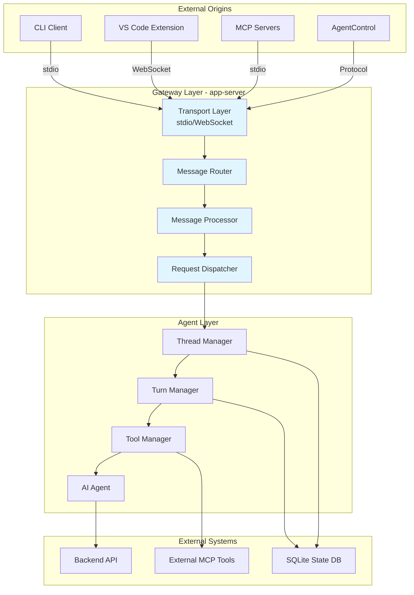
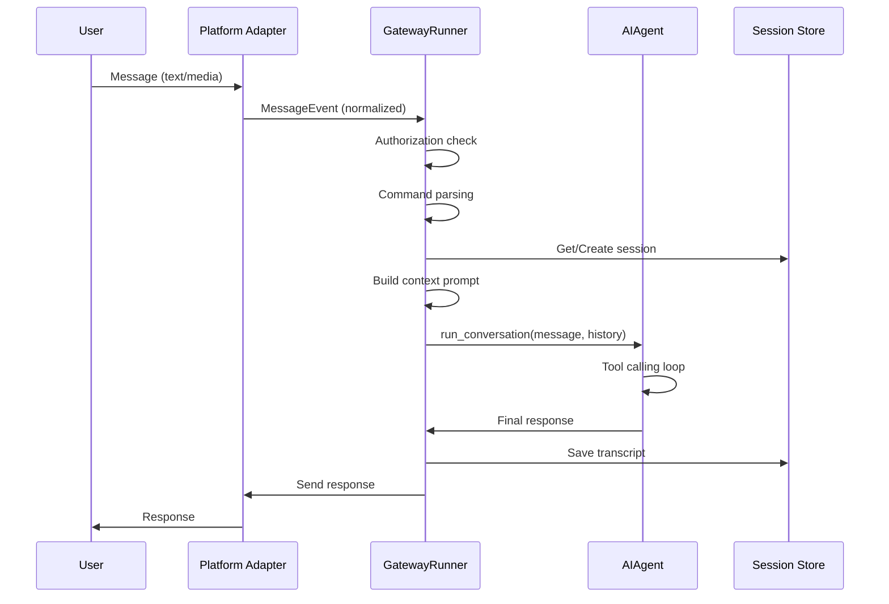
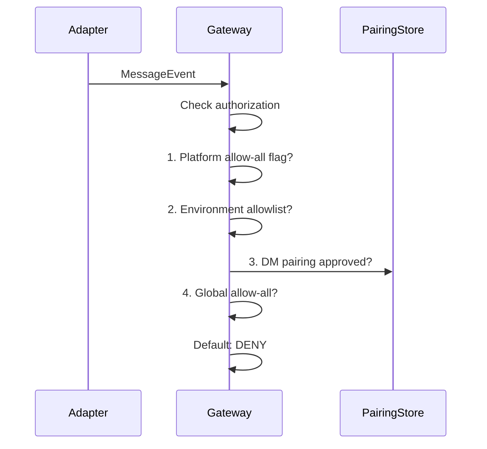
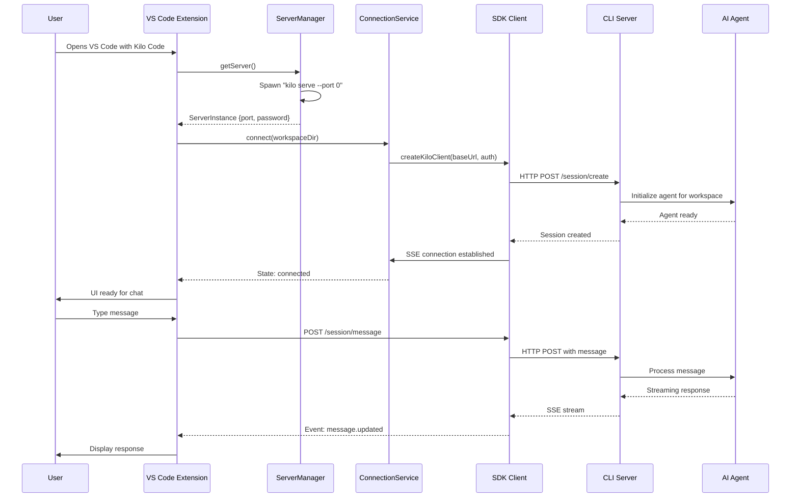
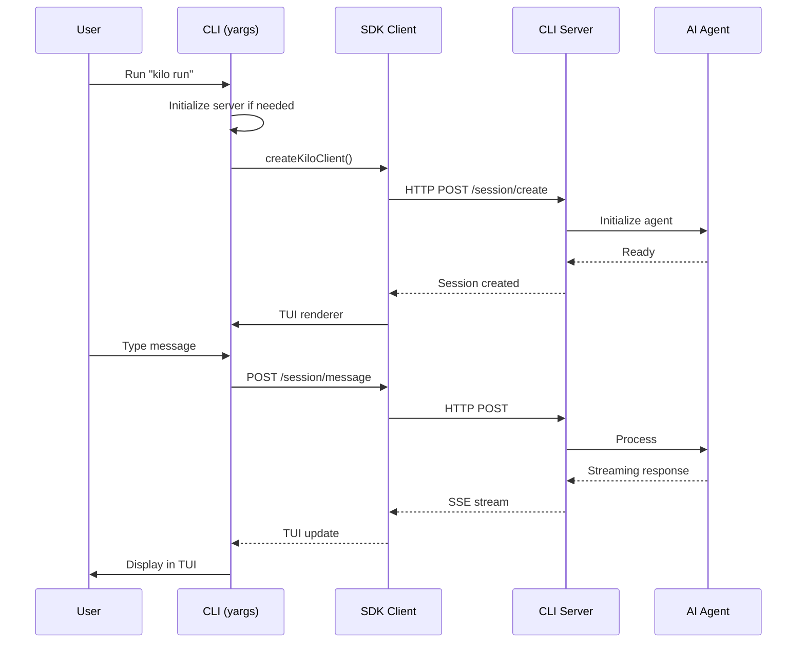

# Agentgateway architecture and features


# Codex Gateway and Scheduling Systems Documentation

## Executive Summary

This document provides a comprehensive analysis of the Codex system's gateway architecture, scheduling mechanisms, and protocol conversion layers. The system features a multi-transport gateway (`app-server`) that routes messages from various origins to AI agents, a memory-based job scheduling system for agent wake-up, and extensive MCP (Model Context Protocol) integration for external tool connectivity.

---

## 1. Gateway System Architecture

### 1.1 Overview

The **app-server** (`codex-rs/app-server`) serves as the central gateway system that routes messages from different origins to the AI agent. It acts as a bidirectional communication hub supporting multiple transport protocols.

### 1.2 Transport Layer

The gateway supports two primary transport modes, defined in [`AppServerTransport`](codex-rs/app-server/src/transport.rs:73):

```rust
pub enum AppServerTransport {
    Stdio,
    WebSocket { bind_address: SocketAddr },
}
```

#### Stdio Transport (Default)
- **Configuration**: `--listen stdio://`
- **Protocol**: Newline-delimited JSON (JSONL)
- **Use Case**: CLI-based interactions, MCP server communication
- **Message Format**: Each JSON-RPC message is terminated with a newline character

#### WebSocket Transport (Experimental)
- **Configuration**: `--listen ws://IP:PORT`
- **Protocol**: One JSON-RPC message per WebSocket text frame
- **Use Case**: Rich client interfaces (e.g., VS Code extension)
- **Status**: Experimental/unsupported for production workloads

### 1.3 Gateway Entry Points

The gateway accepts messages from multiple origins:

| Origin | Transport | Description |
|--------|-----------|-------------|
| **CLI** | stdio | Direct command-line interaction via `codex` binary |
| **VS Code Extension** | WebSocket | Rich IDE integration |
| **MCP Servers** | stdio | External tool integration via Model Context Protocol |
| **AgentControl** | Protocol | Sub-agent spawning with `agent_nickname` and `agent_role` fields |

### 1.4 Message Routing

Messages are routed through the [`route_outgoing_envelope`](codex-rs/app-server/src/transport.rs:150) function, which manages connection state and dispatches messages to appropriate transport endpoints.

```rust
pub(crate) async fn route_outgoing_envelope(
    connections: &mut HashMap<ConnectionId, OutboundConnectionState>,
    envelope: OutgoingEnvelope,
)
```

The routing system uses:
- **ConnectionId**: Unique identifier for each transport connection
- **OutboundConnectionState**: Tracks initialization state, experimental API opt-in, and notification preferences
- **CancellationToken**: Graceful disconnect handling

---

## 2. Scheduling System

### 2.1 Memory Job Scheduler

The system includes a **memory-based job scheduler** (`codex-rs/state/src/runtime/memories.rs`) that handles agent wake-up and background task execution. This scheduler manages two-stage memory processing pipelines.

#### Job Types

| Job Kind | Description |
|----------|-------------|
| `memory_stage1` | Stage 1 memory processing - generates summaries from thread history |
| `memory_consolidate_global` | Stage 2 global consolidation - merges memory outputs |

#### Job Claiming Mechanism

The scheduler uses a database-backed claiming system with watermark-based tracking:

```rust
pub enum Stage1JobClaimOutcome {
    Claimed {
        thread: ThreadRow,
        lease_seconds: i64,
        job_key: String,
    },
    SkippedUpToDate,
    SkippedRunning,
}

pub enum Phase2JobClaimOutcome {
    Claimed {
        job_key: String,
        lease_seconds: i64,
        ownership_token: String,
    },
    SkippedNotDirty,
    SkippedRunning,
}
```

#### Wake-Up Triggers

Agents are woken up by the scheduler based on:

1. **Thread Age**: Threads inactive for `min_rollout_idle_hours` become eligible
2. **Memory Staleness**: `stage1_outputs.source_updated_at < threads.updated_at`
3. **Global Lock**: Phase 2 jobs require exclusive ownership via SQLite global lock
4. **Startup Claim**: On server startup, stale threads are claimed for processing

#### Watermark System

The scheduler tracks progress using watermarks:
- **Input Watermark**: Tracks the latest processed source update timestamp
- **Last Success Watermark**: Records the last successful job completion watermark
- **Lease Mechanism**: Jobs are leased for a configurable duration to prevent concurrent processing

### 2.2 Backfill System

A separate backfill mechanism handles historical data processing:

```rust
pub enum BackfillStatus {
    Pending,
    Running,
    Complete,
}
```

The backfill system:
- Processes historical rollouts for memory generation
- Tracks progress via watermark comparison
- Supports retry logic with configurable limits

---

## 3. Protocol Between Gateway and Agents

### 3.1 JSON-RPC 2.0 Protocol

The gateway uses **JSON-RPC 2.0** for all communication, following the specification at https://www.jsonrpc.org/specification.

#### Message Structure

```json
{
  "jsonrpc": "2.0",
  "id": <request_id>,
  "method": "<method_name>",
  "params": { ... }
}
```

#### Request/Response Pattern

| Type | Description |
|------|-------------|
| **Request** | Client → Server: `{"id": <number>, "method": <string>, "params": <object>}` |
| **Response** | Server → Client: `{"id": <number>, "result": <object>}` |
| **Notification** | One-way: `{"method": <string>, "params": <object>}` |
| **Error** | `{"id": <number>, "error": {"code": <number>, "message": <string>}}` |

### 3.2 Core API Methods

#### Thread Management

| Method | Direction | Description |
|--------|-----------|-------------|
| `initialize` | Client → Server | Initialize connection, register client metadata |
| `thread/start` | Client → Server | Create new conversation thread |
| `thread/resume` | Client → Server | Resume existing thread |
| `thread/fork` | Client → Server | Create fork of existing thread |
| `thread/list` | Client → Server | List threads with pagination |
| `thread/read` | Client → Server | Read thread contents |
| `thread/archive` | Client → Server | Archive a thread |
| `thread/unarchive` | Client → Server | Restore archived thread |
| `thread/compact/start` | Client → Server | Trigger conversation compaction |
| `thread/rollback` | Client → Server | Rollback turns from thread |

#### Turn Management

| Method | Direction | Description |
|--------|-----------|-------------|
| `turn/start` | Client → Server | Begin new turn with user input |
| `turn/steer` | Client → Server | Add input to in-flight turn |
| `turn/interrupt` | Client → Server | Cancel in-flight turn |

#### MCP Integration

| Method | Direction | Description |
|--------|-----------|-------------|
| `mcpServerStatus/list` | Client → Server | List configured MCP servers |
| `mcpServer/oauth/login` | Client → Server | Start OAuth flow for MCP server |
| `config/mcpServer/reload` | Client → Server | Reload MCP server configuration |

### 3.3 Agent Control Protocol

The system supports **sub-agent spawning** via the `AgentControl` protocol:

#### Session Source Types

```rust
pub enum SessionSource {
    Cli,
    VSCode,
    Exec,
    Mcp,
    SubAgent(SubAgentSource),
    Unknown,
}

pub enum SubAgentSource {
    Review,
    Compact,
    MemoryConsolidation,
    ThreadSpawn {
        parent_thread_id: ThreadId,
        depth: i32,
        agent_nickname: String,
        agent_role: String,
    },
    Other(String),
}
```

#### Collaboration Events

The protocol defines collaboration events for agent-to-agent communication:

| Event | Description |
|-------|-------------|
| `CollabAgentInteractionBeginEvent` | Marks start of agent interaction |
| `CollabAgentSpawnEndEvent` | Signals spawned agent completion |
| `CollabAgentStatusEntry` | Status update for collaborating agents |
| `CollabWaitingBeginEvent` | Agent waiting for other agents |

#### Session Metadata

```rust
pub struct SessionMeta {
    pub id: ThreadId,
    pub forked_from_id: Option<ThreadId>,
    pub timestamp: String,
    pub cwd: PathBuf,
    pub originator: String,
    pub cli_version: String,
    pub source: SessionSource,
    pub agent_nickname: Option<String>,
    pub agent_role: Option<String>,
    pub model_provider: Option<String>,
    pub base_instructions: Option<BaseInstructions>,
    pub dynamic_tools: Option<Vec<DynamicToolSpec>>,
    pub memory_mode: Option<String>,
}
```

---

## 4. External Messaging System Integration

### 4.1 MCP (Model Context Protocol) Integration

The system integrates with MCP servers for external tool connectivity. MCP servers communicate via stdio transport.

#### MCP Server Configuration

```rust
pub enum McpServerTransportConfig {
    Stdio {
        command: String,
        args: Vec<String>,
        env: Option<HashMap<String, String>>,
    },
    StreamableHttp {
        url: String,
        headers: Option<HashMap<String, String>>,
        oauth_client_id: Option<String>,
        oauth_client_secret: Option<String>,
    },
}
```

#### MCP Transport Types

| Transport | Description |
|-----------|-------------|
| **stdio** | Standard input/output communication |
| **streamable_http** | HTTP-based transport with optional OAuth |

#### MCP Server Lifecycle

1. **Configuration**: MCP servers defined in `config.toml`
2. **Startup**: Servers spawned as child processes
3. **Tool Discovery**: Servers expose available tools via `listTools` request
4. **Tool Execution**: Tools called via `callTool` request
5. **OAuth Flow**: Streamable HTTP servers support OAuth authentication

### 4.2 Backend API Client

The system includes a backend client (`codex-rs/backend-client`) for communicating with external APIs:

```rust
pub struct Client {
    base_url: String,
    http: reqwest::Client,
    bearer_token: Option<String>,
    user_agent: Option<HeaderValue>,
    chatgpt_account_id: Option<String>,
    path_style: PathStyle,
}
```

#### API Endpoints

| Endpoint | Description |
|----------|-------------|
| `/api/codex/usage` | Get rate limits and usage statistics |
| `/api/codex/tasks/list` | List tasks with pagination |
| `/wham/usage` | ChatGPT API rate limits |
| `/wham/tasks/list` | ChatGPT API task listing |

#### Path Style Detection

```rust
pub enum PathStyle {
    CodexApi,    // /api/codex/…
    ChatGptApi,  // /wham/…
}
```

The client automatically detects the API path style based on the base URL.

### 4.3 Proxy Routing

The system includes managed proxy routing for sandboxed environments:

```rust
pub(crate) struct ProxyRouteSpec {
    routes: Vec<ProxyRouteEntry>,
}

pub(crate) struct ProxyRouteEntry {
    env_key: String,
    uds_path: PathBuf,
}
```

Proxy routes are activated in network namespaces to enable sandboxed network access.

---

## 5. Protocol Conversion

### 5.1 Transport Serialization

#### Stdio Transport

Messages are serialized as newline-delimited JSON:

```rust
// In transport.rs
while let Some(line) = lines.next_line().await.unwrap_or_default() {
    match serde_json::from_str::<IncomingMessage>(&line) {
        Ok(msg) => {
            if incoming_tx.send(msg).await.is_err() {
                break;
            }
        }
        Err(e) => error!("Failed to deserialize JSON-RPC message: {e}"),
    }
}
```

#### WebSocket Transport

Messages are wrapped in WebSocket text frames:

```rust
// In transport.rs
match WebSocketMessage::Text(text) {
    WebSocketMessage::Text(msg) => {
        match serde_json::from_str::<JSONRPCMessage>(&msg) {
            Ok(message) => {
                // Process incoming message
            }
            Err(e) => error!("Failed to deserialize: {e}"),
        }
    }
    _ => {}
}
```

### 5.2 Message Processing Pipeline

```
┌─────────────────────────────────────────────────────────────────────┐
│                         MESSAGE FLOW                                 │
├─────────────────────────────────────────────────────────────────────┤
│                                                                      │
│  ┌──────────┐    ┌──────────────┐    ┌──────────────┐    ┌────────┐ │
│  │ Transport│───▶│ Message      │───▶│ Request      │───▶│ Agent  │ │
│  │ Layer    │    │ Processor    │    │ Dispatcher   │    │        │ │
│  └──────────┘    └──────────────┘    └──────────────┘    └────────┘ │
│       │                │                   │                    │     │
│       ▼                ▼                   ▼                    ▼     │
│  JSON-RPC        Deserialize          Route to            Execute     │
│  Parse           & Validate           Target              Tool/       │
│                  Event                Connection          Command     │
│                                                                      │
└─────────────────────────────────────────────────────────────────────┘
```

### 5.3 Event Streaming

The gateway streams events to clients via notifications:

```rust
pub enum ServerNotification {
    ThreadStarted(ThreadStartedNotification),
    TurnStarted(TurnStartedNotification),
    TurnCompleted(TurnCompletedNotification),
    ItemStarted(ItemStartedNotification),
    ItemCompleted(ItemCompletedNotification),
    ExecCommandBegin(ExecCommandBeginEvent),
    ExecCommandEnd(ExecCommandEndEvent),
    AgentMessageDelta(AgentMessageDeltaEvent),
    // ... more event types
}
```

### 5.4 Protocol Versioning

The system supports protocol versioning through the `codex_app_server_protocol` crate:

- **v1**: Initial protocol version
- **v2**: Enhanced protocol with improved pagination, optional fields, and new features

TypeScript types are auto-generated to the `codex-rs/app-server-protocol/schema/typescript/v2/` directory.

---

## 6. System Architecture Diagram



---

## 7. Key Files and Components

### 7.1 Core Gateway Files

| File | Purpose |
|------|---------|
| [`codex-rs/app-server/src/transport.rs`](codex-rs/app-server/src/transport.rs:1) | Transport layer implementation (stdio/WebSocket) |
| [`codex-rs/app-server/src/lib.rs`](codex-rs/app-server/src/lib.rs:1) | Main server entry point and message routing |
| [`codex-rs/app-server/src/message_processor.rs`](codex-rs/app-server/src/message_processor.rs:1) | Message processing and validation |
| [`codex-rs/app-server/src/outgoing_message.rs`](codex-rs/app-server/src/outgoing_message.rs:1) | Outgoing message routing and delivery |

### 7.2 Protocol Definitions

| File | Purpose |
|------|---------|
| [`codex-rs/protocol/src/protocol.rs`](codex-rs/protocol/src/protocol.rs:1) | Core protocol definitions and types |
| [`codex-rs/app-server-protocol/schema/json/`](codex-rs/app-server-protocol/schema/json/:1) | JSON schema definitions |
| [`codex-rs/app-server-protocol/schema/typescript/`](codex-rs/app-server-protocol/schema/typescript/:1) | TypeScript type definitions |

### 7.3 Scheduling System

| File | Purpose |
|------|---------|
| [`codex-rs/state/src/runtime/memories.rs`](codex-rs/state/src/runtime/memories.rs:1) | Memory job scheduler implementation |
| [`codex-rs/state/src/runtime/backfill.rs`](codex-rs/state/src/runtime/backfill.rs:1) | Backfill processing system |
| [`codex-rs/state/src/model/`](codex-rs/state/src/model/:1) | Database models for job tracking |

### 7.4 MCP Integration

| File | Purpose |
|------|---------|
| [`codex-rs/mcp-server/src/lib.rs`](codex-rs/mcp-server/src/lib.rs:1) | MCP server implementation |
| [`codex-rs/mcp-server/src/codex_tool_runner.rs`](codex-rs/mcp-server/src/codex_tool_runner.rs:1) | Codex tool execution via MCP |
| [`codex-rs/mcp-server/src/codex_tool_config.rs`](codex-rs/mcp-server/src/codex_tool_config.rs:1) | MCP tool configuration |

### 7.5 External API Client

| File | Purpose |
|------|---------|
| [`codex-rs/backend-client/src/client.rs`](codex-rs/backend-client/src/client.rs:1) | Backend API client implementation |
| [`codex-rs/backend-client/src/types.rs`](codex-rs/backend-client/src/types.rs:1) | API response type definitions |

---

## 8. Configuration

### 8.1 Transport Configuration

```toml
# config.toml
listen = "stdio://"  # or "ws://127.0.0.1:8080"
```

### 8.2 MCP Server Configuration

```toml
[mcpServers.myServer]
command = "npx"
args = ["-y", "@modelcontextprotocol/server-filesystem", "/path/to/share"]
```

### 8.3 Memory Scheduler Configuration

Memory scheduling parameters are configured via:
- `max_age_days`: Maximum age of threads eligible for memory processing
- `min_rollout_idle_hours`: Minimum idle time before thread becomes eligible
- `scan_limit`: Maximum threads to scan per iteration
- `max_claimed`: Maximum jobs to claim per iteration

---

## 9. Security Considerations

### 9.1 Transport Security

- **WebSocket**: Currently unencrypted; consider TLS for production
- **Stdio**: Local-only communication, no network exposure
- **Authentication**: Bearer tokens for backend API communication

### 9.2 Sandbox Isolation

The system uses Linux sandboxing with:
- Network proxy routing for controlled access
- File system access restrictions
- Command execution policy enforcement

### 9.3 OAuth Integration

MCP servers with streamable_http transport support OAuth 2.0 authentication:
- Client ID and secret configuration
- Authorization URL generation
- Token exchange and refresh

---

## 10. Summary

The Codex system features a robust gateway architecture with:

1. **Multi-transport Gateway**: Supports stdio and WebSocket transports for flexible client integration
2. **Memory Job Scheduler**: Database-backed scheduling system for agent wake-up and background processing
3. **JSON-RPC Protocol**: Standardized communication protocol with versioning support
4. **MCP Integration**: Extensive support for external tool connectivity via Model Context Protocol
5. **Agent Control Protocol**: Sub-agent spawning with nickname and role assignment
6. **Backend API Client**: Communication with external APIs for rate limiting and task management

The system is designed for extensibility, with clear separation between transport, protocol, and agent layers, allowing for easy addition of new transport types or protocol versions.

# Hermes Agent Gateway and Scheduling System Protocols

## Overview

The Hermes Agent includes a **messaging gateway system** that routes messages from multiple external platforms (Telegram, Discord, Slack, WhatsApp, Home Assistant) to the AI agent, and a **cron scheduler** that wakes up the agent to execute scheduled tasks.

---

## 1. Gateway System Architecture

### 1.1 Core Components

```
┌─────────────────────────────────────────────────────────────────────────┐
│                         GATEWAY RUNNER                                   │
│  (gateway/run.py: GatewayRunner class)                                  │
│                                                                         │
│  ┌─────────────────────────────────────────────────────────────────┐   │
│  │  Platform Adapters (Abstract Base Class)                        │   │
│  │  ┌─────────────┐ ┌─────────────┐ ┌─────────────┐ ┌───────────┐  │   │
│  │  │ Telegram    │ │  Discord    │ │    Slack    │ │ WhatsApp  │  │   │
│  │  │ Adapter     │ │  Adapter    │ │  Adapter    │ │  Adapter  │  │   │
│  │  └─────────────┘ └─────────────┘ └─────────────┘ └───────────┘  │   │
│  │         │              │              │                │          │   │
│  │         └──────────────┴──────────────┴────────────────┘          │   │
│  │                          │                                         │   │
│  │  ┌───────────────────────┴───────────────────────────────────┐   │   │
│  │  │  MessageHandler (_handle_message)                          │   │   │
│  │  │  - User authorization check                                │   │   │
│  │  │  - Command parsing (/new, /reset, etc.)                    │   │   │
│  │  │  - Session management                                      │   │   │
│  │  │  - Message enrichment (vision, transcription)              │   │   │
│  │  └───────────────────────────────────────────────────────────┘   │   │
│  └─────────────────────────────────────────────────────────────────┘   │
│                              │                                          │
│                              ▼                                          │
│  ┌─────────────────────────────────────────────────────────────────┐   │
│  │  AI AGENT (run_agent.py: AIAgent class)                          │   │
│  │  - Conversation loop with tool calling                           │   │
│  │  - Context compression                                           │   │
│  │  - Memory management                                             │   │
│  └─────────────────────────────────────────────────────────────────┘   │
│                              │                                          │
│                              ▼                                          │
│  ┌─────────────────────────────────────────────────────────────────┐   │
│  │  Session Store (gateway/session.py)                              │   │
│  │  - Session metadata (SQLite/JSONL)                               │   │
│  │  - Transcript storage                                            │   │
│  │  - Reset policy evaluation                                       │   │
│  └─────────────────────────────────────────────────────────────────┘   │
└─────────────────────────────────────────────────────────────────────────┘
```

### 1.2 Platform Adapters

| Platform | Library | Protocol | File |
|----------|---------|----------|------|
| Telegram | `python-telegram-bot` | Bot API (polling) | [`gateway/platforms/telegram.py`](gateway/platforms/telegram.py) |
| Discord | `discord.py` | WebSocket (gateway) | [`gateway/platforms/discord.py`](gateway/platforms/discord.py) |
| Slack | `slack-bolt` | Socket Mode / Events API | [`gateway/platforms/slack.py`](gateway/platforms/slack.py) |
| WhatsApp | Node.js Bridge | HTTP webhook | [`gateway/platforms/whatsapp.py`](gateway/platforms/whatsapp.py) |
| Home Assistant | `aiohttp` | WebSocket API | [`gateway/platforms/homeassistant.py`](gateway/platforms/homeassistant.py) |

---

## 2. Gateway-to-Agent Protocol

### 2.1 Message Flow



### 2.2 Core Protocol: `MessageEvent`

The gateway uses a normalized [`MessageEvent`](gateway/platforms/base.py:265) dataclass to represent incoming messages:

```python
@dataclass
class MessageEvent:
    """Normalized representation of incoming messages."""
    text: str                          # Message content
    message_type: MessageType          # TEXT, PHOTO, VIDEO, AUDIO, etc.
    source: SessionSource              # Origin information
    raw_message: Any                   # Original platform data
    message_id: Optional[str]          # Platform-specific message ID
    media_urls: List[str]              # Attached media files
    media_types: List[str]             # MIME types for media
    reply_to_message_id: Optional[str] # Reply context
    timestamp: datetime                # Arrival time
```

### 2.3 Session Context Protocol

The gateway injects a dynamic [`SessionContext`](gateway/session.py:107) into the agent's system prompt:

```python
@dataclass
class SessionContext:
    source: SessionSource                # Where message came from
    connected_platforms: List[Platform]  # Available platforms
    home_channels: Dict[Platform, HomeChannel]  # Delivery targets
    session_key: str                     # Deterministic session identifier
    session_id: str                      # Unique session UUID
    created_at: datetime
    updated_at: datetime
```

**Context Injection Example:**
```
## Current Session Context

**Source:** Telegram (DM with user123)
**User:** John Doe
**Connected Platforms:** local (files on this machine), telegram: Connected ✓, discord: Connected ✓

**Home Channels (default destinations):**
  - telegram: General Chat (ID: 123456)
  - discord: #general (ID: 789012)

**Delivery options for scheduled tasks:**
- "origin" → Back to this chat (General Chat)
- "local" → Save to local files only
- "telegram" → Home channel (General Chat)
- "discord" → Home channel (#general)
```

### 2.4 Agent Interface

The gateway calls the agent via [`AIAgent.run_conversation()`](run_agent.py:2200):

```python
def run_conversation(
    self,
    message: str,
    conversation_history: List[Dict[str, Any]],
    task_id: str = None
) -> Dict[str, Any]:
    """
    Execute a conversation turn.
    
    Returns:
        {
            "final_response": str,           # Text to send back
            "messages": List[Dict],          # Full conversation state
            "api_calls": int,                # Number of API calls made
            "completed": bool,               # Whether agent finished
            "interrupted": bool,             # If interrupted by new message
            "error": Optional[str],          # Error message if failed
        }
    """
```

---

## 3. External Messaging System Protocols

### 3.1 Telegram Protocol

**Library:** `python-telegram-bot`  
**Connection:** Long-polling via `Application.start_polling()`

**Message Reception:**
```python
# In TelegramAdapter.connect():
self._app.add_handler(TelegramMessageHandler(
    filters.TEXT & ~filters.COMMAND,
    self._handle_text_message
))
self._app.add_handler(TelegramMessageHandler(
    filters.COMMAND,
    self._handle_command
))
self._app.add_handler(TelegramMessageHandler(
    filters.PHOTO | filters.VIDEO | filters.AUDIO | filters.VOICE,
    self._handle_media_message
))
```

**Message Normalization:**
```python
async def _handle_text_message(self, update: Update, context: ContextTypes):
    event = MessageEvent(
        text=update.effective_message.text,
        message_type=MessageType.TEXT,
        source=self.build_source(
            chat_id=update.effective_chat.id,
            chat_name=update.effective_chat.title,
            chat_type=self._get_chat_type(update.effective_chat.type),
            user_id=update.effective_user.id if update.effective_user else None,
            user_name=update.effective_user.name if update.effective_user else None,
            thread_id=update.effective_message.message_thread_id,
        ),
        raw_message=update,
        message_id=str(update.effective_message.message_id),
        timestamp=datetime.fromtimestamp(update.effective_message.date.timestamp()),
    )
    await self.handle_message(event)
```

**Response Sending:**
```python
async def send(self, chat_id: str, content: str, ...) -> SendResult:
    # Telegram MarkdownV2 formatting
    formatted = self.format_message(content)
    chunks = self.truncate_message(formatted, max_length=4096)
    
    for chunk in chunks:
        msg = await self._bot.send_message(
            chat_id=int(chat_id),
            text=chunk,
            parse_mode=ParseMode.MARKDOWN_V2,
            reply_to_message_id=int(reply_to),
            message_thread_id=int(thread_id),
        )
```

### 3.2 Discord Protocol

**Library:** `discord.py`  
**Connection:** WebSocket gateway

**Message Reception:**
```python
async def on_message(self, message: discord.Message):
    if message.author == self.bot.user:
        return
    
    event = MessageEvent(
        text=message.content,
        message_type=self._map_discord_type(message),
        source=self.build_source(
            chat_id=str(message.channel.id),
            chat_name=message.channel.name,
            chat_type=self._get_channel_type(message.channel.type),
            user_id=str(message.author.id),
            user_name=message.author.name,
            thread_id=str(message.channel.id) if message.channel.type == discord.ChannelType.thread else None,
        ),
        raw_message=message,
        message_id=str(message.id),
    )
    await self.handle_message(event)
```

**Response Sending:**
```python
async def send(self, chat_id: str, content: str, ...) -> SendResult:
    channel = await self.bot.fetch_channel(int(chat_id))
    chunks = self.truncate_message(content, max_length=2000)
    
    for chunk in chunks:
        msg = await channel.send(
            content=chunk,
            mention_author=True,
        )
```

### 3.3 Slack Protocol

**Library:** `slack-bolt`  
**Connection:** Socket Mode (WebSocket)

**Message Reception:**
```python
@app.event("app_mention")
@app.message(".+")
def handle_message(event: dict, say: Say):
    event = MessageEvent(
        text=event.get("text", ""),
        message_type=MessageType.TEXT,
        source=self.build_source(
            chat_id=str(event["channel"]),
            user_id=str(event["user"]),
            chat_type="dm" if event.get("type") == "app_mention" else "channel",
        ),
        raw_message=event,
        message_id=str(event.get("ts")),
    )
    asyncio.create_task(self.handle_message(event))
```

### 3.4 WhatsApp Protocol

**Bridge:** Node.js HTTP server (`scripts/whatsapp-bridge/bridge.js`)  
**Connection:** HTTP webhook from WhatsApp Business API

**Message Reception:**
```python
# In WhatsAppAdapter:
async def _handle_webhook(self, request: Request):
    payload = await request.json()
    
    for entry in payload.get("entry", []):
        for change in entry.get("changes", []):
            for message in change.get("messages", []):
                event = MessageEvent(
                    text=message.get("text", {}).get("body", ""),
                    message_type=self._map_whatsapp_type(message),
                    source=self.build_source(
                        chat_id=message.get("from"),  # JID with @s.whatsapp.net
                        user_id=message.get("from"),
                    ),
                    raw_message=message,
                )
                await self.handle_message(event)
```

### 3.5 Home Assistant Protocol

**Library:** `aiohttp`  
**Connection:** WebSocket API

**Message Reception:**
```python
async def _handle_state_change(self, event: dict):
    # Home Assistant events are system-generated (state changes)
    # They are always authorized (HASS_TOKEN authenticates)
    event = MessageEvent(
        text=f"State changed: {event['data'].get('entity_id')} = {event['data'].get('new_state')}",
        message_type=MessageType.TEXT,
        source=self.build_source(
            chat_id="hass",
            chat_type="system",
        ),
        raw_message=event,
    )
    await self.handle_message(event)
```

---

## 4. Scheduling System (Cron)

### 4.1 Architecture

```mermaid
graph LR
    A[Cron Ticker Thread] -->|every 60s| B[cron/scheduler.py:tick()]
    B -->|acquire lock| C{Jobs due?}
    C -->|Yes| D[cron/jobs.py:get_due_jobs()]
    D --> E[run_job(job)]
    E --> F[AIAgent.run_conversation()]
    F --> G[Deliver result]
    G --> H[Send to origin/home channel]
    G --> I[Mirror to session]
```

### 4.2 Wake-up Mechanism

The scheduler runs in a **background thread** within the gateway process:

```python
# In gateway/run.py: _start_cron_ticker()
def _start_cron_ticker(stop_event: threading.Event, interval: int = 60):
    """Background thread that ticks the cron scheduler."""
    while not stop_event.is_set():
        try:
            cron_tick(verbose=False)  # Check and run due jobs
        except Exception as e:
            logger.debug("Cron tick error: %s", e)
        
        # Sleep in small increments for responsive shutdown
        for _ in range(interval):
            if not stop_event.is_set():
                break
            time.sleep(1)
```

**Key Features:**
- **File-based locking** prevents concurrent ticks
- **60-second interval** (configurable)
- **Runs inside gateway** (no separate daemon needed)
- **Auto-recovery** on crashes (checkpointed state)

### 4.3 Job Execution Protocol

```python
def run_job(job: dict) -> tuple[bool, str, str, Optional[str]]:
    """
    Execute a cron job.
    
    Args:
        job: {
            "id": str,              # Unique job ID
            "name": str,            # Human-readable name
            "prompt": str,          # Task description for agent
            "schedule": str,        # Cron expression
            "origin": {             # Delivery target
                "platform": str,
                "chat_id": str,
                "chat_name": str,
            },
            "deliver": str,         # "origin", "local", or platform name
        }
    
    Returns:
        (success, full_output, final_response, error_message)
    """
```

**Delivery Protocol:**
```python
def _deliver_result(job: dict, content: str) -> None:
    """Deliver job output to configured target."""
    deliver = job.get("deliver", "local")
    origin = _resolve_origin(job)
    
    if deliver == "origin":
        platform_name = origin["platform"]
        chat_id = origin["chat_id"]
    elif ":" in deliver:
        platform_name, chat_id = deliver.split(":", 1)
    else:
        # Platform name only → use home channel
        platform_name = deliver
        chat_id = os.getenv(f"{platform_name.upper()}_HOME_CHANNEL")
    
    # Send via send_message_tool (works standalone)
    result = asyncio.run(_send_to_platform(platform, config, chat_id, content))
    
    # Mirror to gateway session
    mirror_to_session(platform_name, chat_id, content, source_label="cron")
```

---

## 5. Message Conversion/Normalization

### 5.1 Inbound Normalization

All platform-specific messages are converted to [`MessageEvent`](gateway/platforms/base.py:265):

| Platform | Native Format | Normalized Fields |
|----------|---------------|-------------------|
| Telegram | `Update` object | `text`, `message_type`, `source`, `raw_message` |
| Discord | `Message` object | `text`, `message_type`, `source`, `raw_message` |
| Slack | Event dict | `text`, `message_type`, `source`, `raw_message` |
| WhatsApp | JSON payload | `text`, `message_type`, `source`, `raw_message` |

**Media Handling:**
```python
# Inbound: Download and cache media files
async def _handle_media_message(self, update: Update):
    if update.effective_message.photo:
        file = await self._bot.get_file(update.effective_message.photo[-1].file_id)
        cached_path = await cache_image_from_url(f"https://api.telegram.org/file/bot{token}/{file.file_path}")
        event = MessageEvent(
            text=update.effective_message.caption or "",
            message_type=MessageType.PHOTO,
            media_urls=[cached_path],
            media_types=["image/jpeg"],
            ...
        )
```

### 5.2 Outbound Normalization

Agent responses are converted back to platform-specific formats:

```python
# In BasePlatformAdapter._process_message_background():
response = await self._message_handler(event)

# Extract MEDIA: tags (TTS output)
media_files, response = self.extract_media(response)

# Extract image URLs
images, text_content = self.extract_images(response)

# Send text first
if text_content:
    await self.send(chat_id, text_content, reply_to=event.message_id)

# Send images as native attachments
for image_url, alt_text in images:
    await self.send_image(chat_id, image_url, caption=alt_text)

# Send media files (audio/video/document)
for media_path, is_voice in media_files:
    await self.send_voice(chat_id, media_path)  # or send_video, send_document
```

### 5.3 Format-Specific Handling

| Platform | Text Format | Image Format | Audio Format |
|----------|-------------|--------------|--------------|
| Telegram | MarkdownV2 | `send_photo()` | `send_voice()` (.ogg) |
| Discord | Markdown | `send_image()` | `send_document()` |
| Slack | Markdown | `files.upload()` | `files.upload()` |
| WhatsApp | Plain text | `sendImage()` | `sendAudio()` |

---

## 6. Security and Authorization

### 6.1 User Authorization Flow



**Authorization Methods (in order):**
1. **Platform allow-all** (`TELEGRAM_ALLOW_ALL_USERS=true`)
2. **Environment allowlist** (`TELEGRAM_ALLOWED_USERS=123,456`)
3. **DM pairing** (one-time code authorization)
4. **Global allow-all** (`GATEWAY_ALLOW_ALL_USERS=true`)
5. **Default: DENY**

### 6.2 DM Pairing Protocol

```python
# Unknown user DMs bot → receives pairing code
code = self.pairing_store.generate_code(
    platform_name="telegram",
    user_id="123456",
    user_name="John Doe"
)
# Returns: "ABCD1234" (8-char, 1-hour expiry)

# User sends code to owner → owner approves
hermes pairing approve telegram ABCD1234

# PairingStore stores approved users
# Subsequent messages from user are authorized
```

---

## 7. Session Management

### 7.1 Session Key Protocol

Sessions are identified by deterministic keys:

```python
def build_session_key(source: SessionSource) -> str:
    """Build deterministic session key from message source."""
    platform = source.platform.value
    if source.chat_type == "dm":
        if platform == "whatsapp" and source.chat_id:
            # WhatsApp DMs include chat_id (multi-user)
            return f"agent:main:{platform}:dm:{source.chat_id}"
        return f"agent:main:{platform}:dm"
    return f"agent:main:{platform}:{source.chat_type}:{source.chat_id}"
```

**Session Key Examples:**
- CLI: `agent:main:local:dm`
- Telegram DM: `agent:main:telegram:dm`
- Telegram group: `agent:main:telegram:group:123456`
- WhatsApp DM: `agent:main:whatsapp:dm:+1234567890`

### 7.2 Reset Policies

Sessions can auto-reset based on configurable policies:

```python
@dataclass
class SessionResetPolicy:
    mode: str  # "none", "idle", "daily", "both"
    idle_minutes: int  # Idle time before reset
    at_hour: int  # Daily reset hour (0-23)
```

**Policy Modes:**
- `none`: Never reset
- `idle`: Reset after X minutes of inactivity
- `daily`: Reset at specified hour each day
- `both`: Combine idle + daily

---

## 8. Event Hook System

### 8.1 Hook Events

The gateway emits events at lifecycle points:

| Event | When | Payload |
|-------|------|---------|
| `gateway:startup` | Gateway starts | `{"platforms": [...]}` |
| `session:start` | New session created | `{"platform", "user_id", "session_id"}` |
| `session:reset` | Session reset | `{"platform", "user_id", "session_key"}` |
| `agent:start` | Agent begins processing | `{"platform", "user_id", "session_id", "message"}` |
| `agent:step` | Each tool-calling iteration | `{"platform", "iteration", "tool_names"}` |
| `agent:end` | Agent completes | `{"platform", "response"}` |
| `command:*` | Command executed | `{"platform", "command", "args"}` |

### 8.2 Hook Implementation

```python
# In gateway/hooks.py:
class HookRegistry:
    def __init__(self):
        self.loaded_hooks = []
    
    def discover_and_load(self):
        """Load hooks from ~/.hermes/hooks/"""
        hook_dir = _hermes_home / "hooks"
        for hook_dir_path in hook_dir.iterdir():
            if hook_dir_path.is_dir():
                hook = self._load_hook(hook_dir_path)
                if hook:
                    self.loaded_hooks.append(hook)
    
    async def emit(self, event: str, context: dict):
        """Emit event to all registered hooks."""
        for hook in self.loaded_hooks:
            if event in hook.events:
                try:
                    await hook.handler(event, context)
                except Exception as e:
                    logger.error("Hook %s error: %s", hook.name, e)
```

---

## 9. Configuration

### 9.1 Environment Variables

| Variable | Description | Default |
|----------|-------------|---------|
| `TELEGRAM_BOT_TOKEN` | Telegram bot token | Required |
| `TELEGRAM_ALLOWED_USERS` | Comma-separated user IDs | None |
| `DISCORD_BOT_TOKEN` | Discord bot token | Required |
| `DISCORD_ALLOWED_USERS` | Comma-separated user IDs | None |
| `SLACK_BOT_TOKEN` | Slack bot token | Required |
| `WHATSAPP_BRIDGE_URL` | WhatsApp bridge URL | Required |
| `MESSAGING_CWD` | Terminal working directory | `~` |
| `HERMES_MAX_ITERATIONS` | Max tool-calling turns | 60 |
| `GATEWAY_ALLOW_ALL_USERS` | Allow all users (dev) | False |

### 9.2 Config.yaml Settings

```yaml
# ~/.hermes/config.yaml
agent:
  max_turns: 60
  personalities:
    helpful: "You are a helpful assistant..."
    developer: "You are a software developer..."

platform_toolsets:
  telegram:
    - hermes-telegram
  discord:
    - hermes-discord

display:
  tool_progress: "new"  # off, new, all, verbose

session_hygiene:
  auto_compress_tokens: 100000
  auto_compress_messages: 200
  warn_tokens: 200000
```

---

## 10. Summary

The Hermes Agent gateway system provides:

1. **Multi-platform support** via adapter pattern (Telegram, Discord, Slack, WhatsApp, Home Assistant)
2. **Message normalization** through `MessageEvent` dataclass
3. **Session management** with deterministic keys and reset policies
4. **Cron scheduling** via background ticker thread
5. **Event hooks** for extensibility
6. **Security** via user authorization and DM pairing
7. **Media handling** with caching and auto-transcription/vision

The protocol between gateway and agent is clean:
- **Input**: `MessageEvent` → `run_conversation(message, history)`
- **Output**: `{"final_response": str, "messages": [...]}` → platform-specific send

# KiloCode Architecture: CLI and VS Code Extension Integration

## Overview

KiloCode implements a **client-server architecture** where the core AI agent runtime runs as a standalone CLI binary (`kilo serve`), and different frontends (CLI TUI, VS Code extension, desktop app) communicate with it via HTTP + SSE (Server-Sent Events). This design enables the same agent logic to power multiple interfaces.

## High-Level Architecture

```mermaid
graph TB
    subgraph "Frontend Layer"
        CLI[CLI TUI<br/>kilo run/kilo tui]
        VSCode[VS Code Extension<br/>kilo-code]
        Desktop[Desktop App<br/>@opencode-ai/desktop]
    end

    subgraph "Communication Layer"
        SDK[@kilocode/sdk<br/>HTTP + SSE Client]
        Auth[Basic Auth<br/>kilo:password]
    end

    subgraph "Core Agent Layer"
        Server[CLI Server<br/>kilo serve<br/>Hono HTTP Server]
        Agent[AI Agent Runtime<br/>Agent, Skill, Tool]
        MCP[MCP Servers<br/>Tool Extensions]
    end

    CLI --> SDK
    VSCode --> SDK
    Desktop --> SDK
    SDK --> Auth
    Auth --> Server
    Server --> Agent
    Server --> MCP
```

## Core Components

### 1. **CLI Server (`packages/opencode/src/server/server.ts`)**

The heart of the system is the HTTP server that runs when `kilo serve` is executed:

- **Framework**: [`Hono`](https://hono.dev/) - lightweight, fast web framework
- **Port**: Default `4096` (or `0` for auto-assign)
- **Authentication**: Basic Auth with dynamically generated password
- **Protocol**: REST API + SSE for streaming responses

**Key Routes**:
| Route | Purpose |
|-------|---------|
| `/session` | Session management, message history |
| `/project` | Workspace operations, file system |
| `/pty` | Terminal emulation (PTY) |
| `/mcp` | MCP server registration and management |
| `/file` | File operations (read, write, search) |
| `/config` | Configuration management |
| `/provider` | AI provider configuration |
| `/agent` | Agent/mode listing and selection |
| `/skill` | Skill listing and management |
| `/command` | Available commands |
| `/global/health` | Health check endpoint |

### 2. **SDK (`packages/sdk/js/`)**

A generated TypeScript SDK that provides a unified client API:

- **Auto-generated** from OpenAPI specs via [`@hey-api/openapi-ts`](https://heyapi.vercel.app/)
- **Location**: `src/gen/` (generated, not edited manually)
- **Regeneration**: Run `./script/generate.ts` after server endpoint changes

**Client Structure**:
```typescript
// packages/sdk/js/src/v2/client.ts
export function createKiloClient(config?: Config & { directory?: string }) {
  // Creates HTTP client with optional directory header for workspace scoping
  const client = createClient(config)
  return new KiloClient({ client })
}
```

### 3. **VS Code Extension (`packages/kilo-vscode/`)**

The VS Code extension acts as a **frontend-only client** that spawns and manages the CLI server:

#### Extension Entry Point
[`packages/kilo-vscode/src/extension.ts`](packages/kilo-vscode/src/extension.ts:12)

```typescript
export function activate(context: vscode.ExtensionContext) {
  // Create shared connection service (one server for all webviews)
  const connectionService = new KiloConnectionService(context)
  
  // Create provider with shared service
  const provider = new KiloProvider(context.extensionUri, connectionService, context)
  
  // Register webview view provider for sidebar
  vscode.window.registerWebviewViewProvider(KiloProvider.viewType, provider, {
    webviewOptions: { retainContextWhenHidden: true },
  })
}
```

#### Server Management
[`packages/kilo-vscode/src/services/cli-backend/server-manager.ts`](packages/kilo-vscode/src/services/cli-backend/server-manager.ts:14)

The `ServerManager` class handles spawning and managing the `kilo serve` process:

```typescript
class ServerManager {
  async getServer(): Promise<ServerInstance> {
    // Spawns: kilo serve --port 0
    // Environment: KILO_SERVER_PASSWORD, KILO_CLIENT=vscode, etc.
    const serverProcess = spawn(cliPath, ["serve", "--port", "0"], {
      env: {
        ...process.env,
        KILO_SERVER_PASSWORD: password,
        KILO_CLIENT: "vscode",
        KILOCODE_FEATURE: "vscode-extension",
        // ... telemetry and platform info
      },
      detached: true,
    })
  }
}
```

#### Connection Service
[`packages/kilo-vscode/src/services/cli-backend/connection-service.ts`](packages/kilo-vscode/src/services/cli-backend/connection-service.ts:22)

The `KiloConnectionService` manages the SDK client and SSE connection:

```typescript
class KiloConnectionService {
  private client: KiloClient | null = null
  private sseClient: SdkSSEAdapter | null = null
  
  async connect(workspaceDir: string): Promise<void> {
    const server = await this.serverManager.getServer()
    
    // Create SDK client with Basic Auth
    this.client = createKiloClient({
      baseUrl: `http://127.0.0.1:${server.port}`,
      headers: { Authorization: `Basic ${authHeader}` },
    })
    
    // Connect to SSE stream for real-time updates
    this.sseClient = new SdkSSEAdapter(this.client)
    this.sseClient.connect()
  }
}
```

### 4. **CLI TUI (`packages/opencode/src/index.ts`)**

The CLI uses the same server but with a different frontend:

```typescript
// packages/opencode/src/index.ts:70
let cli = yargs(hideBin(process.argv))
  .command(RunCommand)
  .command(GenerateCommand)
  .command(ServeCommand)
  .command(TuiThreadCommand)
  // ... other commands

// When 'kilo serve' is run, it starts the HTTP server
// When 'kilo run' or 'kilo tui' is run, it connects to the server
```

## Communication Flow

### VS Code Extension Flow



### CLI TUI Flow



## Key Design Patterns

### 1. **Single Binary, Multiple Frontends**

The `kilo` binary serves all purposes:
- `kilo run` - CLI TUI mode
- `kilo serve` - HTTP server mode (used by extensions)
- `kilo tui` - Terminal UI mode
- `kilo web` - Web UI mode (disabled in Kilo Code)

### 2. **Workspace Scoping via Instance**

The server uses an `Instance` pattern to manage workspace context:

```typescript
// packages/opencode/src/server/server.ts:210
.use(async (c, next) => {
  const raw = c.req.query("directory") || c.req.header("x-opencode-directory") || process.cwd()
  const directory = decodeURIComponent(raw)
  
  return Instance.provide({
    directory,
    init: InstanceBootstrap,
    async fn() {
      return next()
    },
  })
})
```

This allows multiple workspaces to be managed simultaneously.

### 3. **SSE for Streaming Responses**

All agent responses stream via Server-Sent Events:

```typescript
// packages/opencode/src/server/server.ts
import { streamSSE } from "hono/streaming"

// Agent streaming response
return streamSSE(c, async (stream) => {
  for await (const event of agent.stream()) {
    await stream.write({
      data: event,
      event: event.type,
    })
  }
})
```

### 4. **Shared Connection Service**

VS Code extension uses a singleton `KiloConnectionService` that:
- Manages a single server instance for all webviews
- Broadcasts SSE events to multiple providers
- Handles reconnection and health checks

### 5. **MCP Server Integration**

MCP (Model Context Protocol) servers extend agent capabilities:

```typescript
// packages/opencode/src/server/routes/mcp.ts
.route("/mcp", McpRoutes())
```

The VS Code extension registers the **Browser Automation MCP server** dynamically when connected.

## Environment Variables

### Server Configuration
| Variable | Purpose |
|----------|---------|
| `KILO_SERVER_PASSWORD` | Authentication password |
| `KILO_CLIENT` | Client type (vscode, cli, etc.) |
| `KILOCODE_FEATURE` | Feature flag for telemetry |
| `KILO_CONFIG_CONTENT` | Serialized config for nested instances |

### Telemetry
| Variable | Purpose |
|----------|---------|
| `KILO_TELEMETRY_LEVEL` | Telemetry verbosity |
| `KILO_APP_NAME` | Application identifier |
| `KILO_EDITOR_NAME` | Editor name (VS Code, etc.) |
| `KILO_PLATFORM` | Platform identifier |
| `KILO_MACHINE_ID` | Unique machine identifier |

## Security Model

1. **Basic Auth**: All HTTP requests require `Authorization: Basic kilo:<password>`
2. **Localhost Only**: Server binds to `127.0.0.1`
3. **Dynamic Password**: Password generated per server instance
4. **CORS**: Restricted to localhost and trusted origins
5. **Workspace Isolation**: Directory header scopes all operations

## File Structure

```
packages/
├── opencode/                    # Core CLI package
│   ├── src/
│   │   ├── index.ts           # CLI entry point (yargs)
│   │   ├── server/
│   │   │   ├── server.ts      # HTTP server (Hono)
│   │   │   └── routes/        # Route handlers
│   │   ├── agent/             # AI agent logic
│   │   ├── skill/             # Skill system
│   │   ├── tool/              # Tool definitions
│   │   └── cli/               # CLI commands
│   └── package.json
│
├── kilo-vscode/               # VS Code extension
│   ├── src/
│   │   ├── extension.ts       # Extension entry
│   │   ├── KiloProvider.ts    # Sidebar webview
│   │   ├── agent-manager/     # Multi-session panel
│   │   └── services/
│   │       ├── cli-backend/
│   │       │   ├── server-manager.ts   # Spawn/manage server
│   │       │   ├── connection-service.ts # SDK + SSE client
│   │       │   └── sdk-sse-adapter.ts  # SSE event handling
│   │       └── autocomplete/  # Inline suggestions
│   └── package.json
│
├── sdk/js/                    # Generated SDK
│   ├── src/
│   │   ├── v2/
│   │   │   ├── client.ts      # Client factory
│   │   │   └── server.ts      # Server spawn utilities
│   │   └── gen/               # Auto-generated
│   └── package.json
│
└── kilo-gateway/              # Kilo-specific services
    └── package.json
```

## Communication Protocol

### Authentication

All HTTP requests require Basic Auth:

```
Authorization: Basic kilo:<password>
```

The password is dynamically generated per server instance and passed via `KILO_SERVER_PASSWORD` environment variable.

### Request Headers

| Header | Value | Description |
|--------|-------|-------------|
| `Authorization` | `Basic kilo:<password>` | Authentication |
| `x-opencode-directory` | URL-encoded path | Workspace scoping (optional) |

### REST API Endpoints

#### Session Management

| Method | Endpoint | Description |
|--------|----------|-------------|
| `GET` | `/session` | List all sessions |
| `GET` | `/session/status` | Get session statuses |
| `GET` | `/session/:sessionID` | Get session details |
| `GET` | `/session/:sessionID/children` | Get child sessions |
| `GET` | `/session/:sessionID/todo` | Get session todos |
| `POST` | `/session` | Create new session |
| `PATCH` | `/session/:sessionID` | Update session (title, archive) |
| `DELETE` | `/session/:sessionID` | Delete session |
| `POST` | `/session/:sessionID/init` | Initialize session |
| `POST` | `/session/:sessionID/fork` | Fork session |
| `POST` | `/session/:sessionID/abort` | Abort active session |
| `POST` | `/session/:sessionID/share` | Create share link |
| `DELETE` | `/session/:sessionID/share` | Remove share link |
| `GET` | `/session/:sessionID/diff` | Get message diff |
| `POST` | `/session/:sessionID/summarize` | Summarize session |

#### Message Operations

| Method | Endpoint | Description |
|--------|----------|-------------|
| `GET` | `/session/:sessionID/message` | List messages |
| `GET` | `/session/:sessionID/message/:messageID` | Get message |
| `DELETE` | `/session/:sessionID/message/:messageID` | Delete message |
| `DELETE` | `/session/:sessionID/message/:messageID/part/:partID` | Delete part |
| `PATCH` | `/session/:sessionID/message/:messageID/part/:partID` | Update part |
| `POST` | `/session/:sessionID/message` | Send message (streaming) |
| `POST` | `/session/:sessionID/prompt_async` | Send async message |
| `POST` | `/session/:sessionID/command` | Send command |
| `POST` | `/session/:sessionID/shell` | Run shell command |
| `POST` | `/session/:sessionID/revert` | Revert message |
| `POST` | `/session/:sessionID/unrevert` | Restore reverted |

#### Other Endpoints

| Method | Endpoint | Description |
|--------|----------|-------------|
| `GET` | `/project` | List projects |
| `GET` | `/project/:projectID` | Get project |
| `POST` | `/project` | Create project |
| `GET` | `/pty` | List PTYs |
| `POST` | `/pty` | Create PTY |
| `GET` | `/config` | Get config |
| `POST` | `/config` | Update config |
| `GET` | `/provider` | List providers |
| `POST` | `/provider` | Create provider |
| `GET` | `/mcp` | List MCP servers |
| `POST` | `/mcp` | Register MCP server |
| `GET` | `/agent` | List agents |
| `GET` | `/skill` | List skills |
| `GET` | `/command` | List commands |
| `GET` | `/global/health` | Health check |
| `POST` | `/instance/dispose` | Dispose instance |
| `GET` | `/path` | Get paths |
| `GET` | `/vcs` | Get VCS info |
| `POST` | `/log` | Write log |

### SSE Event Types

The server streams events via Server-Sent Events. Each event has a `type` and `properties`:

#### Session Events

| Event Type | Description |
|------------|-------------|
| `session.created` | New session created |
| `session.updated` | Session metadata changed |
| `session.deleted` | Session removed |
| `session.status` | Session busy/idle/retry status |
| `session.idle` | Session became idle |
| `session.compacted` | Session auto-compacted |
| `session.diff` | File diff available |
| `session.error` | Session-level error |
| `session.turn.open` | New turn started |
| `session.turn.close` | Turn completed/errored/interrupted |

#### Message Events

| Event Type | Description |
|------------|-------------|
| `message.updated` | Message content changed |
| `message.removed` | Message deleted |
| `message.part.updated` | Part content updated |
| `message.part.delta` | Streaming delta for part |
| `message.part.removed` | Part deleted |

#### Part Types

| Part Type | Description |
|-----------|-------------|
| `text` | Text content |
| `subtask` | Subtask definition |
| `reasoning` | Agent reasoning |
| `file` | File reference |
| `tool` | Tool call/execution |
| `step-start` | Step started |
| `step-finish` | Step completed |
| `snapshot` | State snapshot |
| `patch` | File patch |
| `agent` | Agent/mode change |
| `retry` | API retry |
| `compaction` | Auto-compaction |

#### Permission & Question Events

| Event Type | Description |
|------------|-------------|
| `permission.asked` | Permission request |
| `permission.replied` | Permission response |
| `question.asked` | Question for user |
| `question.replied` | User answer |
| `question.rejected` | Question rejected |

#### System Events

| Event Type | Description |
|------------|-------------|
| `server.connected` | Server connected |
| `server.instance.disposed` | Instance disposed |
| `global.disposed` | Global cleanup |
| `installation.updated` | Installation updated |
| `installation.update-available` | Update available |
| `project.updated` | Project changed |
| `lsp.client.diagnostics` | LSP diagnostics |
| `lsp.updated` | LSP status changed |
| `file.edited` | File edited |
| `file.watcher.updated` | File system change |
| `vcs.branch.updated` | Git branch changed |
| `worktree.ready` | Worktree ready |
| `worktree.failed` | Worktree failed |
| `mcp.tools.changed` | MCP tools updated |
| `mcp.browser.open.failed` | Browser automation failed |
| `command.executed` | Command executed |
| `todo.updated` | Todo list changed |
| `tui.*` | TUI-specific events |

### Message Structure

**User Message**:
```typescript
{
  id: string
  sessionID: string
  role: "user"
  time: { created: number }
  format?: OutputFormat
  summary?: { title, body, diffs: FileDiff[] }
  agent: string
  model: { providerID: string, modelID: string }
  system?: string
  tools?: { [toolName]: boolean }
  variant?: string
  editorContext?: {
    visibleFiles: string[]
    openTabs: string[]
    activeFile: string
    shell: string
    timezone: string
  }
}
```

**Assistant Message**:
```typescript
{
  id: string
  sessionID: string
  role: "assistant"
  time: { created: number, completed?: number }
  error?: ProviderAuthError | ApiError | ...
  parentID: string
  modelID: string
  providerID: string
  mode: string
  agent: string
  path: { cwd: string, root: string }
  summary?: boolean
  cost: number
  tokens: { total, input, output, reasoning, cache: { read, write } }
  structured?: unknown
  variant?: string
  finish?: string
}
```

### Streaming Response Flow

1. Client sends `POST /session/:sessionID/message` with user message
2. Server responds with `Content-Type: application/json` and initial message object
3. Server opens SSE stream for the session
4. Server emits events as agent processes:
   - `message.updated` - Message metadata changes
   - `message.part.delta` - Streaming text content
   - `message.part.updated` - Tool calls, steps, etc.
   - `permission.asked` - Permission requests
   - `question.asked` - Questions for user
5. Client updates UI in real-time
6. Server emits `session.turn.close` when complete

### Error Handling

Errors are returned as JSON objects with standardized structure:

```typescript
{
  name: "APIError" | "ProviderAuthError" | "UnknownError" | ...
  data: {
    message: string
    statusCode?: number
    isRetryable?: boolean
    responseHeaders?: { [key: string]: string }
    responseBody?: string
    metadata?: { [key: string]: string }
  }
}
```

Common error types:
- `APIError` - HTTP/API errors
- `ProviderAuthError` - AI provider authentication failed
- `MessageOutputLengthError` - Response too long
- `MessageAbortedError` - Message was aborted
- `StructuredOutputError` - Failed to parse structured output
- `ContextOverflowError` - Context window exceeded

## Summary

The KiloCode architecture achieves **code sharing** between CLI and VS Code by:

1. **Separating concerns**: Core agent logic runs in the CLI server, frontends are thin clients
2. **Standardized protocol**: HTTP + SSE with typed SDK ensures consistency
3. **Process isolation**: Each frontend spawns its own server instance, avoiding conflicts
4. **Shared configuration**: Environment variables and config serialization enable nested instances

This design allows the same agent to power:
- CLI TUI (`kilo run`)
- VS Code extension (current)
- Desktop app (Tauri, legacy)
- Web UI (disabled in Kilo Code)

All with identical capabilities and behavior.
