# Codex Architecture Specification

## Table of Contents
1. [Providers and Models Abstraction](#providers-and-models-abstraction)
2. [Messages Abstraction](#messages-abstraction)
3. [Agentic Loop Interface with LLMs](#agentic-loop-interface-with-llms)

## Providers and Models Abstraction

### Provider Architecture

The provider system in Codex is designed to abstract different LLM service providers behind a unified interface. This allows Codex to work with multiple providers (OpenAI, Azure, Ollama, LMStudio, etc.) while maintaining consistent behavior.

#### Key Components:

1. **ModelProviderInfo** (`codex-rs/core/src/model_provider_info.rs`)
   - Serializable configuration for provider definitions
   - Contains:
     - `name`: Friendly display name
     - `base_url`: API endpoint URL
     - `env_key`: Environment variable for API key
     - `wire_api`: Protocol version (currently only "responses")
     - `query_params`: Optional URL parameters
     - `http_headers`: Additional HTTP headers
     - `env_http_headers`: Headers from environment variables
     - `request_max_retries`: Retry configuration
     - `stream_max_retries`: Stream reconnection attempts
     - `stream_idle_timeout_ms`: Stream timeout
     - `requires_openai_auth`: Authentication requirements
     - `supports_websockets`: WebSocket support flag

2. **Provider** (`codex-rs/codex-api/src/provider.rs`)
   - Runtime representation of a configured provider
   - Contains:
     - `name`: Provider name
     - `base_url`: Resolved base URL
     - `query_params`: URL query parameters
     - `headers`: HTTP headers
     - `retry`: Retry configuration
     - `stream_idle_timeout`: Stream timeout duration
   - Methods:
     - `url_for_path()`: Constructs full URLs
     - `build_request()`: Creates HTTP requests
     - `is_azure_responses_endpoint()`: Azure detection
     - `websocket_url_for_path()`: WebSocket URL construction

3. **RetryConfig**
   - Controls retry behavior for HTTP requests
   - Parameters:
     - `max_attempts`: Maximum retry attempts
     - `base_delay`: Initial delay between retries
     - `retry_429`: Retry on rate limiting
     - `retry_5xx`: Retry on server errors
     - `retry_transport`: Retry on transport errors

#### Provider Discovery and Management:

**ModelsManager** (`codex-rs/core/src/models_manager/manager.rs`)
- Coordinates model discovery and caching
- Supports multiple refresh strategies:
  - `Online`: Always fetch from network
  - `Offline`: Use only cached data
  - `OnlineIfUncached`: Use cache if available, otherwise fetch
- Manages model metadata caching with TTL
- Handles ETag-based cache invalidation
- Provides model listing and default model selection

**Built-in Providers:**
- OpenAI (default)
- Ollama (open-source)
- LMStudio (open-source)
- Custom providers can be added via config.toml

#### Provider Configuration Flow:

```mermaid
graph TD
    A[Config File/Environment] -->|model_providers| B[ModelProviderInfo]
    B -->|to_api_provider()| C[ApiProvider]
    C -->|Used by| D[ModelsClient]
    D -->|Fetches| E[ModelInfo]
    E -->|Stored in| F[ModelsManager]
```

### Model Management

**ModelInfo** (`codex-protocol/openai_models.rs`)
- Contains model metadata:
  - `slug`: Model identifier
  - `name`: Display name
  - `description`: Model description
  - `capabilities`: Supported features
  - `context_window`: Token limit
  - `max_output_tokens`: Output limit
  - `training_date`: Cutoff date
  - `provider`: Provider identifier
  - `priority`: Display ordering
  - `show_in_picker`: UI visibility

**ModelPreset**
- UI-ready representation of available models
- Derived from ModelInfo with auth filtering
- Contains `is_default` flag for default selection

#### Model Resolution:

1. **Prefix Matching**: Longest prefix match against model slugs
2. **Namespaced Suffix**: Support for `namespace/model-name` patterns
3. **Fallback**: Built-in defaults when no match found
4. **Config Overrides**: Runtime configuration adjustments

## Messages Abstraction

### Message Types

The messaging system handles communication between users, agents, and the system through structured message types.

#### Core Message Types:

1. **UserMessageItem** (`codex-protocol/items.rs`)
   - Represents user input
   - Contains:
     - `id`: Unique identifier
     - `content`: Vector of UserInput elements

2. **AgentMessageItem**
   - Represents agent responses
   - Contains:
     - `id`: Unique identifier
     - `content`: Vector of AgentMessageContent
     - `phase`: Optional message phase (thinking, final answer)

3. **AgentMessageContent**
   - Content types for agent messages:
     - `Text { text: String }`: Plain text content
     - (Extensible for future content types)

#### Event System:

**EventMsg** (`codex-protocol/protocol.rs`)
- Enumeration of all event types in the system
- Message-related events:
  - `UserMessage(UserMessageEvent)`: Complete user message
  - `AgentMessage(AgentMessageEvent)`: Complete agent message
  - `AgentMessageContentDelta(AgentMessageContentDeltaEvent)`: Streaming message delta

**AgentMessageContentDeltaEvent**
- Streaming message content updates
- Contains:
  - `thread_id`: Conversation thread
  - `turn_id`: Current turn
  - `item_id`: Message identifier
  - `delta`: Content delta string

### Message Flow:

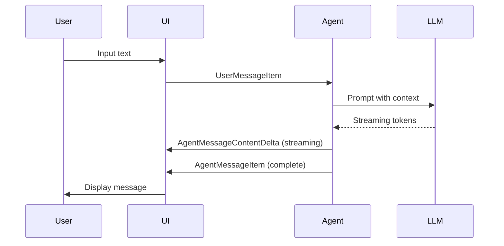

### Message Processing:

1. **Input Processing**:
   - User input parsed into `UserInput` elements
   - Text elements with optional text formatting
   - File attachments and references

2. **Agent Response Handling**:
   - Streaming deltas converted to complete messages
   - Content type preservation (text, code, etc.)
   - Phase tracking for UI rendering

3. **Event Mapping** (`codex-rs/core/src/event_mapping.rs`):
   - Converts between protocol events and internal representations
   - Handles legacy event compatibility
   - Manages content serialization

## Agentic Loop Interface with LLMs

### Core Agent Loop

The agentic loop coordinates interaction between the Codex system and LLMs, managing conversation state, tool usage, and response processing.

#### Main Components:

1. **Session** (`codex-rs/core/src/codex.rs`)
   - Maintains conversation state
   - Manages turn-based interaction
   - Handles event dispatching

2. **TurnContext**
   - Context for current interaction turn
   - Tracks tools, permissions, and state

3. **Agent Jobs** (`codex-rs/core/src/tools/handlers/agent_jobs.rs`)
   - Manages background agent tasks
   - Handles concurrent agent execution
   - Implements job queues and progress tracking

### Agent Loop Architecture:

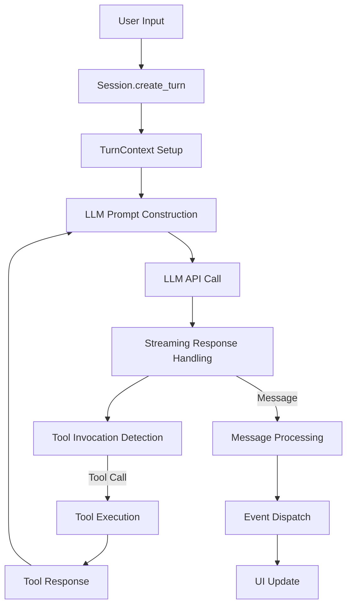

### Key Processes:

1. **Turn Management**:
   - Each user interaction creates a turn
   - Turn context maintains state for the duration
   - Multiple turns form a conversation thread

2. **LLM Interaction**:
   - Provider-specific API calls
   - Streaming response handling
   - Error recovery and retries

3. **Tool Integration**:
   - Function calling detection
   - Tool execution coordination
   - Result incorporation into context

4. **Agent Jobs**:
   - Background task management
   - Concurrent agent execution
   - Progress tracking and reporting

### Agent Job Loop:

The `run_agent_job_loop` function implements the core agent execution loop:

```rust
async fn run_agent_job_loop(
    session: Arc<Session>,
    turn: Arc<TurnContext>,
    db: Arc<codex_state::StateRuntime>,
    job_id: String,
    options: JobRunnerOptions,
) -> anyhow::Result<()>
```

**Loop Phases:**
1. **Initialization**: Load job configuration
2. **Recovery**: Restore running items from previous sessions
3. **Main Loop**:
   - Check for cancellation
   - Spawn new workers (if slots available)
   - Monitor active items
   - Update progress
   - Handle completions and failures
4. **Cleanup**: Finalize job state

### Event Processing:

The system processes various event types during agent execution:

- **UserMessage**: User input events
- **AgentMessageContentDelta**: Streaming message updates
- **AgentMessage**: Complete agent messages
- **ToolCall**: Function invocation requests
- **ToolResult**: Tool execution results
- **Error**: Error conditions

### Concurrency Model:

- **Max Concurrency**: Configurable limit (default: 16, max: 64)
- **Worker Management**: Dynamic worker spawning based on available slots
- **Progress Tracking**: Regular progress updates to UI
- **Cancellation**: Graceful handling of cancellation requests

## Integration Points

### Provider-LLM Interface:

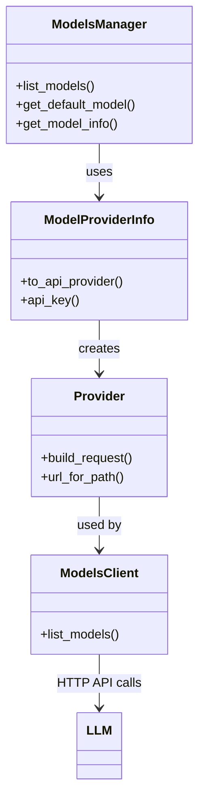

### Message-Agent Interface:

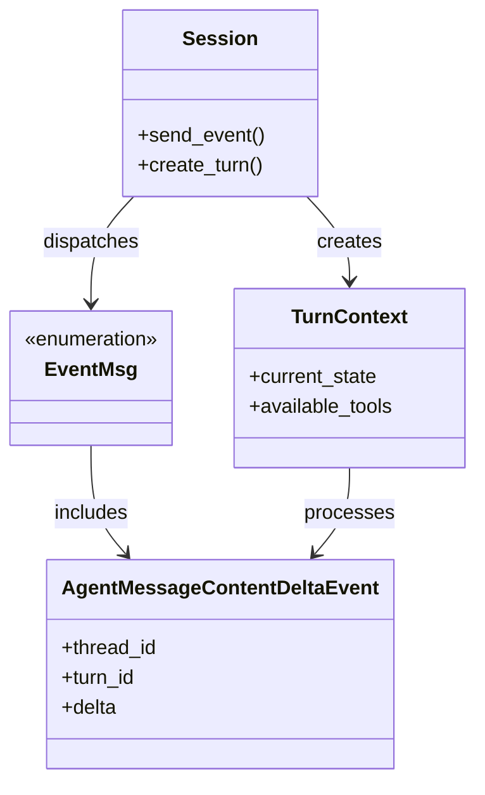

### Complete System Flow:

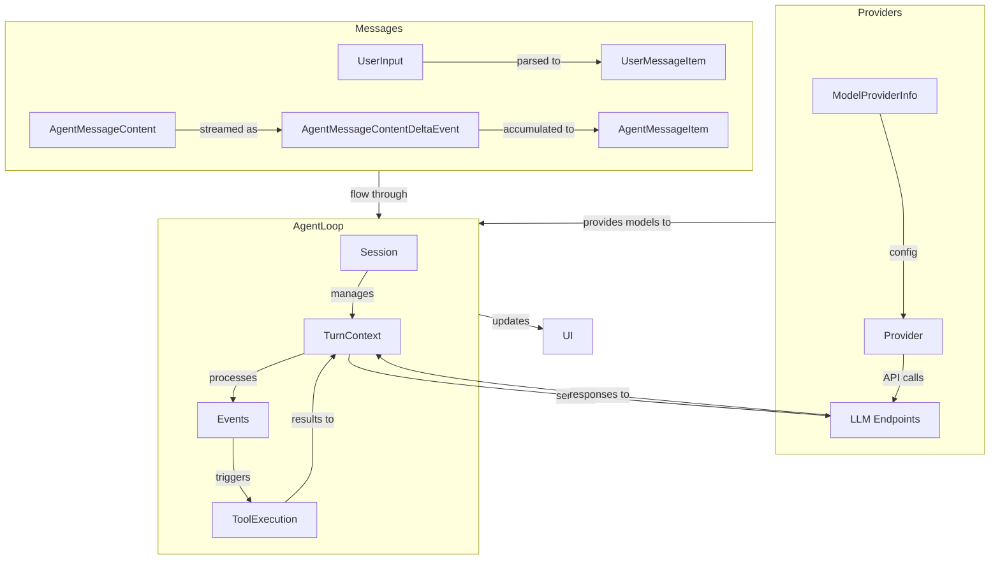

## Configuration and Extensibility

### Adding New Providers:

1. **Configuration File**: Add provider to `~/.codex/config.toml`
2. **Environment Variables**: Set required API keys
3. **Runtime Selection**: Use provider ID in commands

### Extending Message Types:

1. **New Content Types**: Add variants to `AgentMessageContent` enum
2. **Event Handling**: Implement event mapping in `event_mapping.rs`
3. **UI Integration**: Update TUI/web UI components

### Customizing Agent Behavior:

1. **Tool Registration**: Add tools to the registry
2. **Prompt Engineering**: Modify system prompts
3. **Concurrency Tuning**: Adjust max_concurrency settings
4. **Timeout Configuration**: Set appropriate timeouts

## Error Handling and Recovery

### Provider Errors:
- Network retries with exponential backoff
- Fallback to cached models when available
- Clear error messages for configuration issues

### Message Processing:
- Graceful handling of malformed messages
- Recovery from interrupted streams
- Validation of message content

### Agent Loop Recovery:
- Job state persistence across restarts
- Worker recovery mechanisms
- Progress tracking preservation
- Cancellation handling

## Performance Considerations

### Provider Performance:
- Connection pooling for HTTP requests
- Caching of model metadata
- ETag-based cache invalidation
- Configurable retry limits

### Message Processing:
- Efficient streaming with deltas
- Batch processing where appropriate
- Memory-efficient content handling

### Agent Loop:
- Configurable concurrency limits
- Progress tracking to avoid UI freezes
- Timeout handling for long-running operations
- Resource cleanup on completion

## Future Evolution

### Provider System:
- Additional wire API versions
- Provider health checking
- Load balancing across providers
- Cost tracking and optimization

### Messaging:
- Rich content types (images, tables)
- Message editing and revision
- Multi-modal content support
- Improved streaming protocols

### Agent Loop:
- Enhanced tool coordination
- Multi-agent collaboration
- Improved error recovery
- Advanced scheduling algorithms
- Resource-aware execution

This specification provides a comprehensive overview of the Codex architecture focusing on providers, models, messaging, and the agentic loop interface with LLMs. The system is designed for extensibility, allowing integration with multiple LLM providers while maintaining a consistent user experience and powerful agent capabilities.

# Kilo Code - Agentic Loop Interface Specification

## Overview

This document provides a detailed specification for the agentic loop interface with LLMs in the KiloCode system. The agentic loop is responsible for managing the interaction between agents, models, and the LLM provider to execute tasks and generate responses.

## Core Components

### 1. Agent Interface

The `Agent` namespace defines the structure and behavior of agents within the system.

#### Agent.Info

```typescript
interface AgentInfo {
  name: string;
  description?: string;
  mode: "subagent" | "primary" | "all";
  native?: boolean;
  hidden?: boolean;
  topP?: number;
  temperature?: number;
  color?: string;
  permission: PermissionNext.Ruleset;
  model?: {
    modelID: string;
    providerID: string;
  };
  variant?: string;
  prompt?: string;
  options: Record<string, any>;
  steps?: number;
}
```

**Fields:**
- `name`: Unique identifier for the agent
- `description`: Human-readable description of the agent's purpose
- `mode`: Determines agent visibility and usage context
- `native`: Indicates if this is a built-in agent
- `hidden`: Controls whether the agent appears in UI lists
- `topP`: Top-p sampling parameter for model generation
- `temperature`: Controls randomness in model outputs
- `color`: UI color association
- `permission`: Permission ruleset for tool access
- `model`: Default model configuration
- `variant`: Model variant to use
- `prompt`: Custom system prompt override
- `options`: Additional model-specific options
- `steps`: Maximum number of steps the agent can execute

**Agent Modes:**
- `primary`: Main agents visible in UI for direct user interaction
- `subagent`: Specialized agents for delegation by primary agents
- `all`: Agents available in all contexts

### 2. LLM Stream Interface

The `LLM` namespace handles the core interaction with language models.

#### LLM.StreamInput

```typescript
interface StreamInput {
  user: MessageV2.User;
  sessionID: string;
  model: Provider.Model;
  agent: Agent.Info;
  system: string[];
  abort: AbortSignal;
  messages: ModelMessage[];
  small?: boolean;
  tools: Record<string, Tool>;
  retries?: number;
  toolChoice?: "auto" | "required" | "none";
}
```

**Fields:**
- `user`: User message context
- `sessionID`: Current session identifier
- `model`: Model configuration
- `agent`: Agent configuration
- `system`: System prompts
- `abort`: Abort signal for cancellation
- `messages`: Message history
- `small`: Flag for small model optimization
- `tools`: Available tools
- `retries`: Number of retry attempts
- `toolChoice`: Tool selection strategy

#### LLM.StreamOutput

```typescript
type StreamOutput = StreamTextResult<ToolSet, unknown>;
```

The output is a stream of text generation results from the AI SDK, including tool invocations and completions.

### 3. Message Structure

Messages are structured using the `MessageV2` namespace, which defines the format for both user and assistant messages.

#### MessageV2.User

```typescript
interface UserMessage {
  id: string;
  sessionID: string;
  role: "user";
  time: {
    created: number;
  };
  format?: OutputFormat;
  summary?: {
    title?: string;
    body?: string;
    diffs: Snapshot.FileDiff[];
  };
  agent: string;
  model: {
    providerID: string;
    modelID: string;
  };
  system?: string;
  tools?: Record<string, boolean>;
  variant?: string;
  editorContext?: {
    visibleFiles?: string[];
    openTabs?: string[];
    activeFile?: string;
    shell?: string;
    timezone?: string;
  };
}
```

#### MessageV2.Assistant

```typescript
interface AssistantMessage {
  id: string;
  sessionID: string;
  role: "assistant";
  time: {
    created: number;
    completed?: number;
  };
  error?: ErrorObject;
  parentID: string;
  modelID: string;
  providerID: string;
  mode: string;
  agent: string;
  path: {
    cwd: string;
    root: string;
  };
  summary?: boolean;
  cost: number;
  tokens: {
    total?: number;
    input: number;
    output: number;
    reasoning: number;
    cache: {
      read: number;
      write: number;
    };
  };
  structured?: any;
  variant?: string;
  finish?: string;
}
```

### 4. Provider Integration

The `Provider` namespace handles model and provider management.

#### Provider.Model

```typescript
interface Model {
  id: string;
  providerID: string;
  api: {
    id: string;
    url: string;
    npm: string;
  };
  name: string;
  family?: string;
  capabilities: {
    temperature: boolean;
    reasoning: boolean;
    attachment: boolean;
    toolcall: boolean;
    input: {
      text: boolean;
      audio: boolean;
      image: boolean;
      video: boolean;
      pdf: boolean;
    };
    output: {
      text: boolean;
      audio: boolean;
      image: boolean;
      video: boolean;
      pdf: boolean;
    };
    interleaved: boolean | {
      field: "reasoning_content" | "reasoning_details";
    };
  };
  cost: {
    input: number;
    output: number;
    cache: {
      read: number;
      write: number;
    };
    experimentalOver200K?: {
      input: number;
      output: number;
      cache: {
        read: number;
        write: number;
      };
    };
  };
  limit: {
    context: number;
    input?: number;
    output: number;
  };
  status: "alpha" | "beta" | "deprecated" | "active";
  options: Record<string, any>;
  headers: Record<string, string>;
  release_date: string;
  variants?: Record<string, Record<string, any>>;
  recommendedIndex?: number;
  prompt?: Prompt;
}
```

### 5. Agentic Loop Flow

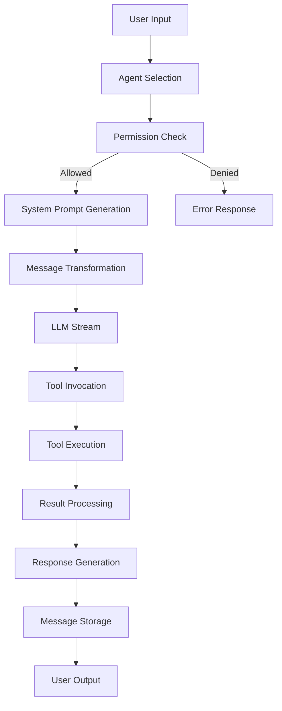

## Detailed Process Flow

### 1. Agent Selection

- User specifies agent via configuration or command line
- System loads agent configuration from `Agent.get()`
- Default agent is determined by `Agent.defaultAgent()`

### 2. Permission Validation

- `PermissionNext` ruleset is evaluated
- Tools are filtered based on agent permissions
- Disabled tools are removed from available set

### 3. System Prompt Generation

- Base system prompts are constructed:
  - Agent-specific prompt (if configured)
  - Provider-specific prompt
  - Custom system messages
  - User-provided system prompt

- Plugins can transform system prompts via `experimental.chat.system.transform` event

### 4. Message Transformation

- User messages are converted to model-compatible format
- Tool invocations are processed
- Media attachments are handled appropriately
- Message history is compacted if necessary

### 5. LLM Stream Execution

- Model is loaded via `Provider.getLanguage()`
- Stream parameters are configured:
  - Temperature, topP, topK
  - Max output tokens
  - Tool selection strategy
  - Retry configuration

- Headers are set for provider-specific requirements
- Telemetry is configured (if enabled)

### 6. Tool Invocation and Execution

- Tools are invoked based on LLM tool calls
- Tool results are processed and formatted
- Errors are handled with appropriate retry logic
- Media attachments from tools are managed

### 7. Response Processing

- Stream output is processed in real-time
- Tool results are formatted for display
- Errors are converted to user-friendly messages
- Context overflow is detected and handled

### 8. Message Storage

- Messages and parts are stored in database
- Session state is updated
- Cost and token usage is recorded

## Configuration and Customization

### Agent Configuration

Agents can be configured in the system configuration:

```json
{
  "agent": {
    "custom-agent": {
      "description": "Custom agent description",
      "prompt": "Custom system prompt",
      "model": "provider/model",
      "temperature": 0.7,
      "permission": {
        "read": "allow",
        "edit": "deny"
      }
    }
  }
}
```

### Model Configuration

Models are configured through the provider system with support for:
- Multiple providers (OpenAI, Anthropic, Azure, etc.)
- Custom API endpoints
- Authentication methods
- Model-specific options

### Tool Configuration

Tools are defined and registered with the system, with permissions controlled by the agent's permission ruleset.

## Error Handling

The system handles various error conditions:

- `AuthError`: Authentication failures
- `APIError`: API call failures with retry logic
- `OutputLengthError`: Output length violations
- `ContextOverflowError`: Context window overflow
- `AbortedError`: User-initiated aborts
- `StructuredOutputError`: JSON schema validation failures

## Telemetry and Monitoring

- OpenTelemetry integration for tracing
- Custom tracer for performance monitoring
- Configurable data collection (inputs/outputs can be disabled)
- Project and machine identification for Kilo provider

## Provider-Specific Considerations

### OpenAI/Codex

- Special handling for OAuth authentication
- Instructions are sent via provider options
- Tool call repair mechanism for case sensitivity

### Anthropic

- Custom headers for beta features
- Native support for media in tool results
- Interleaved thinking support

### Kilo Gateway

- Project ID and machine ID headers
- Task ID tracking
- Special model variants

### LiteLLM Proxies

- Dummy tool injection when history contains tool calls
- Compatibility mode for tool validation

## Performance Optimization

- Model caching to avoid repeated initialization
- Message compaction for long sessions
- Small model optimization for certain tasks
- Token usage tracking and cost calculation

## Security Considerations

- API key management through Auth system
- Permission-based tool access control
- Environment variable sanitization
- Secure credential handling for cloud providers

## Future Enhancements

- Enhanced multi-agent coordination
- Improved context management
- Advanced tool result handling
- Better error recovery mechanisms
- Expanded telemetry capabilities


# Kilo Code - Messages Abstraction and Implementation Specification

## Overview

This document provides a comprehensive specification for the messages abstraction and implementation in the KiloCode system. The messaging system handles the structure, storage, and processing of all communication between users, agents, and the LLM.

## Core Message Structure

### MessageV2 Namespace

The `MessageV2` namespace defines the modern message format used throughout the system.

#### Message Types

```mermaid
classDiagram
    class Message {
        <<abstract>>
        +id: string
        +sessionID: string
        +role: "user" | "assistant"
    }
    
    class UserMessage {
        +time: { created: number }
        +format?: OutputFormat
        +summary?: Summary
        +agent: string
        +model: { providerID: string, modelID: string }
        +system?: string
        +tools?: Record<string, boolean>
        +variant?: string
        +editorContext?: EditorContext
    }
    
    class AssistantMessage {
        +time: { created: number, completed?: number }
        +error?: ErrorObject
        +parentID: string
        +modelID: string
        +providerID: string
        +mode: string
        +agent: string
        +path: { cwd: string, root: string }
        +summary?: boolean
        +cost: number
        +tokens: Tokens
        +structured?: any
        +variant?: string
        +finish?: string
    }
    
    Message <|-- UserMessage
    Message <|-- AssistantMessage
```

### Message Parts

Messages are composed of parts that represent different types of content:

```typescript
type Part =
  | TextPart
  | SubtaskPart
  | ReasoningPart
  | FilePart
  | ToolPart
  | StepStartPart
  | StepFinishPart
  | SnapshotPart
  | PatchPart
  | AgentPart
  | RetryPart
  | CompactionPart;
```

#### Part Types

1. **TextPart**: Plain text content
   - `text`: string content
   - `synthetic?`: boolean (AI-generated)
   - `ignored?`: boolean (should be ignored)
   - `time?`: timing information
   - `metadata?`: additional metadata

2. **ReasoningPart**: Agent reasoning and thought process
   - `text`: reasoning content
   - `metadata?`: provider-specific metadata
   - `time`: timing information

3. **FilePart**: File attachments and references
   - `mime`: MIME type
   - `filename?`: optional filename
   - `url`: file URL or data URI
   - `source?`: file source information

4. **ToolPart**: Tool invocation and execution
   - `callID`: unique tool call identifier
   - `tool`: tool name
   - `state`: tool execution state
   - `metadata?`: additional metadata

5. **StepStartPart/StepFinishPart**: Step boundary markers
   - Step start may include snapshot
   - Step finish includes reason, cost, and token usage

6. **SnapshotPart**: Codebase snapshot references
   - `snapshot`: snapshot identifier

7. **PatchPart**: File patch information
   - `hash`: patch hash
   - `files`: affected files

8. **AgentPart**: Agent-related content
   - `name`: agent name
   - `source?`: source information

9. **SubtaskPart**: Subtask delegation
   - `prompt`: subtask prompt
   - `description`: subtask description
   - `agent`: target agent
   - `model?`: model override
   - `command?`: command to execute

10. **RetryPart**: Retry information
    - `attempt`: retry attempt number
    - `error`: error information
    - `time`: timestamp

11. **CompactionPart**: Message compaction marker
    - `auto`: whether compaction was automatic
    - `overflow?`: whether due to overflow

### Tool State Machine

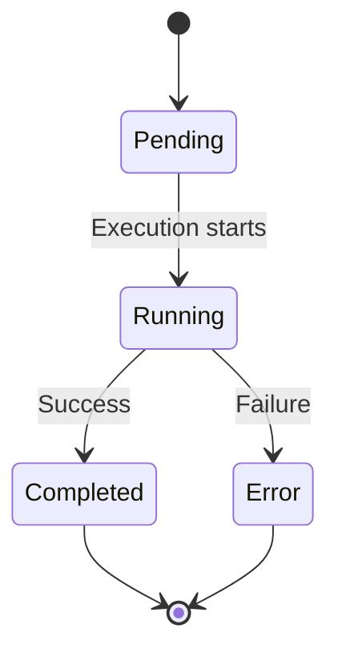

#### Tool State Types

1. **ToolStatePending**: Initial state
   - `status`: "pending"
   - `input`: tool input parameters
   - `raw`: raw input string

2. **ToolStateRunning**: Execution in progress
   - `status`: "running"
   - `input`: tool input parameters
   - `title?`: execution title
   - `metadata?`: additional metadata
   - `time`: start timestamp

3. **ToolStateCompleted**: Successful completion
   - `status`: "completed"
   - `input`: tool input parameters
   - `output`: tool output
   - `title`: execution title
   - `metadata`: additional metadata
   - `time`: timing information
   - `attachments?`: file attachments

4. **ToolStateError**: Execution failure
   - `status`: "error"
   - `input`: tool input parameters
   - `error`: error message
   - `metadata?`: additional metadata
   - `time`: timing information

## Message Storage and Retrieval

### Database Schema

Messages are stored in a SQLite database with the following tables:

```sql
-- MessageTable: Stores message metadata
CREATE TABLE message (
    id TEXT PRIMARY KEY,
    session_id TEXT NOT NULL,
    role TEXT NOT NULL,
    data JSON NOT NULL,
    time_created INTEGER NOT NULL,
    time_completed INTEGER,
    FOREIGN KEY (session_id) REFERENCES session(id) ON DELETE CASCADE
);

-- PartTable: Stores message parts
CREATE TABLE part (
    id TEXT PRIMARY KEY,
    session_id TEXT NOT NULL,
    message_id TEXT NOT NULL,
    type TEXT NOT NULL,
    data JSON NOT NULL,
    FOREIGN KEY (session_id) REFERENCES session(id) ON DELETE CASCADE,
    FOREIGN KEY (message_id) REFERENCES message(id) ON DELETE CASCADE
);
```

### Storage Operations

#### Message Creation

```typescript
// Create a new message with parts
async function createMessage(
  sessionID: string,
  message: MessageV2.Info,
  parts: MessageV2.Part[]
): Promise<void> {
  // Insert message into MessageTable
  // Insert parts into PartTable
  // Update session timestamp
}
```

#### Message Retrieval

```typescript
// Get message with all parts
async function getMessage(
  sessionID: string,
  messageID: string
): Promise<MessageV2.WithParts> {
  const message = await db.get(MessageTable, messageID);
  const parts = await db.getPartsForMessage(messageID);
  return { info: message, parts };
}
```

#### Message Streaming

```typescript
// Stream messages for a session
async function* streamMessages(sessionID: string): AsyncIterable<MessageV2.WithParts> {
  let offset = 0;
  const size = 50;
  
  while (true) {
    const messages = await db.getMessages(sessionID, { limit: size, offset });
    if (messages.length === 0) break;
    
    for (const message of messages) {
      const parts = await db.getPartsForMessage(message.id);
      yield { info: message, parts };
    }
    
    offset += messages.length;
    if (messages.length < size) break;
  }
}
```

## Message Processing Pipeline

### Input Processing

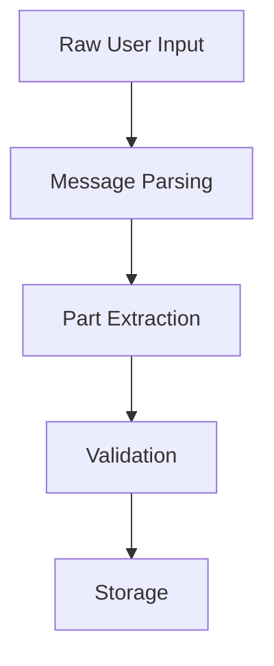

### Output Processing

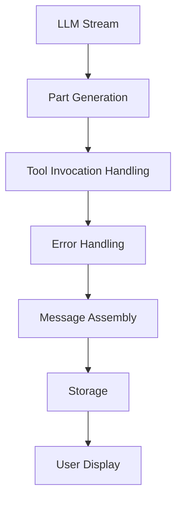

## Message Transformation

### toModelMessages

Converts internal message format to provider-specific format:

```typescript
function toModelMessages(
  input: MessageV2.WithParts[],
  model: Provider.Model,
  options?: { stripMedia?: boolean }
): ModelMessage[] {
  // Transform message parts to provider-compatible format
  // Handle tool invocations
  // Process media attachments
  // Apply provider-specific formatting
}
```

### Key Transformation Rules

1. **Text Parts**: Converted to plain text or structured content
2. **Tool Parts**: Mapped to provider-specific tool formats
3. **File Parts**: Handled based on provider capabilities
4. **Reasoning Parts**: Preserved or transformed based on provider
5. **Media Handling**: Special processing for images/PDFs

## Error Handling in Messages

### Error Types

```typescript
type MessageError =
  | AuthError
  | APIError
  | OutputLengthError
  | AbortedError
  | StructuredOutputError
  | ContextOverflowError
  | NamedError.Unknown;
```

#### Error Structure

```typescript
interface ErrorObject {
  name: string;
  message: string;
  // Additional error-specific fields
}
```

### Error Processing

```typescript
function fromError(e: unknown, ctx: { providerID: string }): MessageError {
  switch (true) {
    case e instanceof DOMException && e.name === "AbortError":
      return new AbortedError(...);
    case LoadAPIKeyError.isInstance(e):
      return new AuthError(...);
    case APICallError.isInstance(e):
      return new APIError(...);
    // ... other error types
    default:
      return new NamedError.Unknown(...);
  }
}
```

## Message Compaction

### Compaction Process

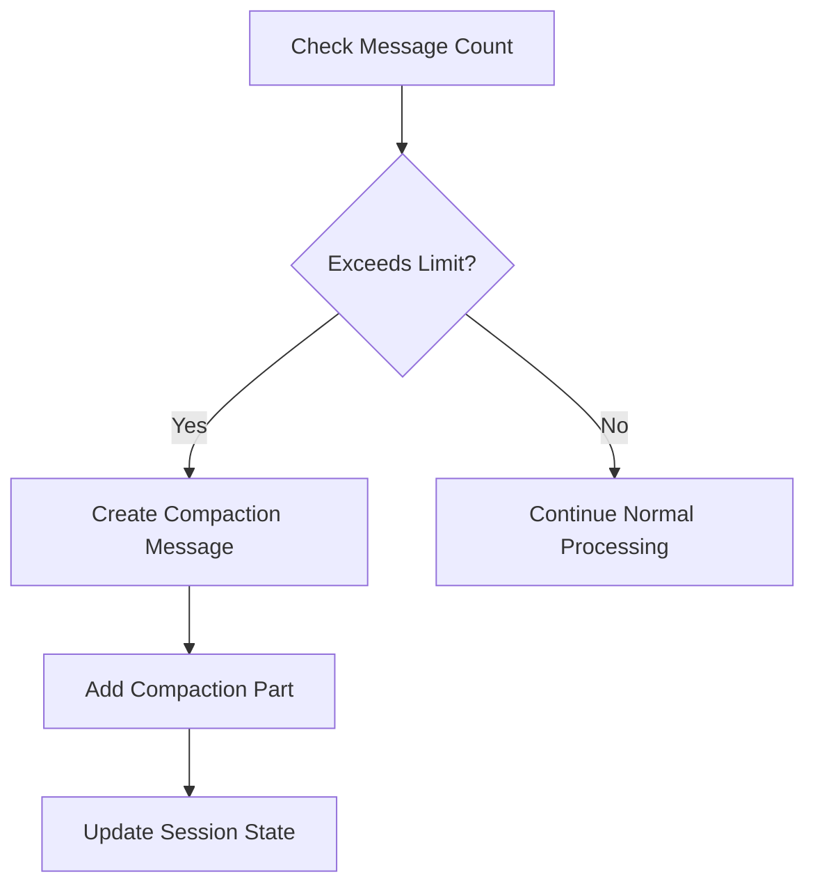

### Compaction Logic

```typescript
async function filterCompacted(
  stream: AsyncIterable<MessageV2.WithParts>
): Promise<MessageV2.WithParts[]> {
  const result = [];
  const completed = new Set<string>();
  
  for await (const msg of stream) {
    result.push(msg);
    
    if (msg.info.role === "user" && 
        completed.has(msg.info.id) &&
        msg.parts.some(part => part.type === "compaction")) {
      break; // Stop at compaction point
    }
    
    if (msg.info.role === "assistant" && 
        msg.info.summary && 
        msg.info.finish && 
        !msg.info.error) {
      completed.add(msg.info.parentID);
    }
  }
  
  return result.reverse();
}
```

## Message Events

The system emits events for message lifecycle management:

```typescript
const Event = {
  Updated: BusEvent.define("message.updated", z.object({ info: Info })),
  Removed: BusEvent.define("message.removed", z.object({ 
    sessionID: z.string(), 
    messageID: z.string() 
  })),
  PartUpdated: BusEvent.define("message.part.updated", z.object({ part: Part })),
  PartDelta: BusEvent.define("message.part.delta", z.object({ 
    sessionID: z.string(), 
    messageID: z.string(), 
    partID: z.string(), 
    field: z.string(), 
    delta: z.string() 
  })),
  PartRemoved: BusEvent.define("message.part.removed", z.object({ 
    sessionID: z.string(), 
    messageID: z.string(), 
    partID: z.string() 
  })),
};
```

## Message Validation

### Schema Validation

All messages are validated against Zod schemas:

```typescript
const User = Base.extend({
  role: z.literal("user"),
  time: z.object({ created: z.number() }),
  // ... other fields with validation
});

const Assistant = Base.extend({
  role: z.literal("assistant"),
  time: z.object({ 
    created: z.number(), 
    completed: z.number().optional() 
  }),
  // ... other fields with validation
});
```

### Runtime Validation

```typescript
function validateMessage(message: unknown): MessageV2.Info {
  try {
    return MessageV2.Info.parse(message);
  } catch (error) {
    throw new ValidationError("Invalid message format", { cause: error });
  }
}
```

## Message Serialization

### JSON Serialization

Messages are serialized to JSON for storage:

```typescript
function serializeMessage(message: MessageV2.Info): string {
  return JSON.stringify({
    id: message.id,
    sessionID: message.sessionID,
    role: message.role,
    time: message.time,
    // ... other fields
  });
}
```

### Database Storage

```typescript
function storeMessage(message: MessageV2.Info, parts: MessageV2.Part[]): Promise<void> {
  return db.transaction(async (tx) => {
    // Insert message
    await tx.insert(MessageTable).values({
      id: message.id,
      session_id: message.sessionID,
      role: message.role,
      data: JSON.stringify(omit(message, ['id', 'sessionID', 'role'])),
      time_created: message.time.created,
      time_completed: 'time' in message && message.time.completed 
        ? message.time.completed 
        : null
    });
    
    // Insert parts
    for (const part of parts) {
      await tx.insert(PartTable).values({
        id: part.id,
        session_id: message.sessionID,
        message_id: message.id,
        type: part.type,
        data: JSON.stringify(omit(part, ['id', 'sessionID', 'messageID', 'type']))
      });
    }
  });
}
```

## Message Lifecycle

### Creation

1. User input is received
2. Message is created with initial parts
3. Message is validated
4. Message is stored in database
5. Events are emitted

### Processing

1. Message is retrieved from storage
2. Message is transformed for LLM
3. LLM processes message
4. Response is generated
5. Response message is created

### Completion

1. Final message parts are added
2. Message status is updated
3. Session is marked as complete
4. Summary is generated (if requested)

### Archival

1. Old messages are compacted
2. Session is marked as archived
3. Storage is optimized

## Performance Considerations

### Batch Processing

```typescript
// Process messages in batches for efficiency
async function processMessageBatch(
  messages: MessageV2.WithParts[],
  batchSize: number = 10
): Promise<void> {
  for (let i = 0; i < messages.length; i += batchSize) {
    const batch = messages.slice(i, i + batchSize);
    await processBatch(batch);
  }
}
```

### Caching

```typescript
// Cache frequently accessed messages
const messageCache = new LRUCache<string, MessageV2.WithParts>({ max: 1000 });

async function getMessageCached(id: string): Promise<MessageV2.WithParts> {
  const cached = messageCache.get(id);
  if (cached) return cached;
  
  const message = await getMessageFromDB(id);
  messageCache.set(id, message);
  return message;
}
```

### Streaming Optimization

```typescript
// Optimized message streaming
async function* streamMessagesOptimized(sessionID: string): AsyncIterable<MessageV2.WithParts> {
  const stmt = db.prepare(`
    SELECT m.id, m.role, m.data as message_data,
           p.id as part_id, p.type as part_type, p.data as part_data
    FROM message m
    LEFT JOIN part p ON m.id = p.message_id
    WHERE m.session_id = ?
    ORDER BY m.time_created DESC, p.id
  `);
  
  let currentMessage: MessageV2.WithParts | null = null;
  for (const row of stmt.iter(sessionID)) {
    if (!currentMessage || currentMessage.info.id !== row.message_id) {
      if (currentMessage) yield currentMessage;
      currentMessage = {
        info: JSON.parse(row.message_data),
        parts: []
      };
    }
    
    if (row.part_id) {
      currentMessage.parts.push(JSON.parse(row.part_data));
    }
  }
  
  if (currentMessage) yield currentMessage;
}
```

## Security Considerations

### Input Sanitization

```typescript
function sanitizeMessageInput(input: string): string {
  // Remove potentially harmful content
  // Escape special characters
  // Validate against allowed patterns
  return sanitizedInput;
}
```

### Permission Checking

```typescript
async function checkMessagePermission(
  message: MessageV2.Info,
  userID: string
): Promise<boolean> {
  // Verify user has access to session
  // Check message visibility rules
  // Validate against permission ruleset
  return hasPermission;
}
```

### Data Protection

```typescript
function redactSensitiveMessageData(message: MessageV2.Info): MessageV2.Info {
  // Remove API keys
  // Redact personal information
  // Handle sensitive file content
  return redactedMessage;
}
```

## Future Enhancements

### Planned Features

1. **Message Versioning**: Support for multiple message format versions
2. **Message Encryption**: End-to-end encryption for sensitive messages
3. **Message Search**: Full-text search capabilities
4. **Message Analytics**: Usage patterns and insights
5. **Message Export**: Standardized export formats
6. **Message Import**: Import from other systems
7. **Message Templates**: Pre-defined message structures
8. **Message Validation**: Enhanced validation rules
9. **Message Transformation**: More flexible transformation pipeline
10. **Message Optimization**: Better storage and retrieval performance

### Architecture Improvements

1. **Modular Design**: More modular message processing components
2. **Plugin System**: Extensible message handling through plugins
3. **Performance Monitoring**: Detailed performance metrics
4. **Error Recovery**: Better error handling and recovery
5. **Internationalization**: Multi-language support
6. **Accessibility**: Improved accessibility features
7. **Offline Support**: Better offline message handling
8. **Conflict Resolution**: Advanced merge conflict handling
9. **Collaboration Features**: Real-time collaborative editing
10. **Integration APIs**: Better integration with external systems

## Conclusion

The message abstraction in KiloCode provides a robust, flexible foundation for handling all communication within the system. The design supports complex workflows, tool integration, and multi-modal content while maintaining performance and security. The system is designed to be extensible for future requirements while providing a solid base for current functionality.


# Kilo Code - Providers and Models Abstraction and Implementation Specification

## Overview

This document provides a comprehensive specification for the providers and models abstraction and implementation in the KiloCode system. The provider system manages all interactions with language model providers, handling authentication, model selection, and API communication.

## Architecture Overview

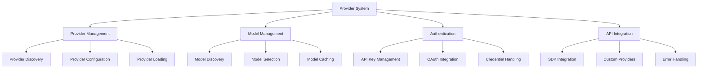

## Provider Management

### Provider Information Structure

```typescript
interface ProviderInfo {
  id: string;
  name: string;
  source: "env" | "config" | "custom" | "api";
  env: string[];
  key?: string;
  options: Record<string, any>;
  models: Record<string, Model>;
}
```

### Provider Sources

1. **Environment Variables**: Detected from process environment
2. **Configuration**: Defined in user configuration files
3. **Custom**: Programmatically defined providers
4. **API**: Providers from external APIs

### Provider Discovery Process

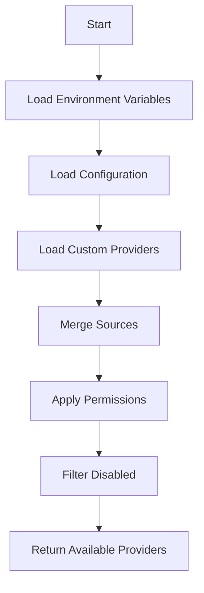

## Model Management

### Model Structure

```typescript
interface Model {
  id: string;
  providerID: string;
  api: {
    id: string;
    url: string;
    npm: string;
  };
  name: string;
  family?: string;
  capabilities: ModelCapabilities;
  cost: ModelCost;
  limit: ModelLimits;
  status: "alpha" | "beta" | "deprecated" | "active";
  options: Record<string, any>;
  headers: Record<string, string>;
  release_date: string;
  variants?: Record<string, Record<string, any>>;
  recommendedIndex?: number;
  prompt?: Prompt;
}
```

### Model Capabilities

```typescript
interface ModelCapabilities {
  temperature: boolean;
  reasoning: boolean;
  attachment: boolean;
  toolcall: boolean;
  input: {
    text: boolean;
    audio: boolean;
    image: boolean;
    video: boolean;
    pdf: boolean;
  };
  output: {
    text: boolean;
    audio: boolean;
    image: boolean;
    video: boolean;
    pdf: boolean;
  };
  interleaved: boolean | {
    field: "reasoning_content" | "reasoning_details";
  };
}
```

### Model Cost Structure

```typescript
interface ModelCost {
  input: number; // Cost per input token
  output: number; // Cost per output token
  cache: {
    read: number; // Cost per cached token read
    write: number; // Cost per cached token write
  };
  experimentalOver200K?: {
    input: number;
    output: number;
    cache: {
      read: number;
      write: number;
    };
  };
}
```

### Model Limits

```typescript
interface ModelLimits {
  context: number; // Maximum context window size
  input?: number; // Maximum input size
  output: number; // Maximum output size
}
```

## Provider Implementation Details

### Bundled Providers

The system includes built-in support for multiple providers:

```typescript
const BUNDLED_PROVIDERS: Record<string, (options: any) => SDK> = {
  "@ai-sdk/amazon-bedrock": createAmazonBedrock,
  "@ai-sdk/anthropic": createAnthropic,
  "@ai-sdk/azure": createAzure,
  "@ai-sdk/google": createGoogleGenerativeAI,
  "@ai-sdk/google-vertex": createVertex,
  "@ai-sdk/google-vertex/anthropic": createVertexAnthropic,
  "@ai-sdk/openai": createOpenAI,
  "@ai-sdk/openai-compatible": createOpenAICompatible,
  "@openrouter/ai-sdk-provider": createOpenRouter,
  "@kilocode/kilo-gateway": createKilo,
  "@ai-sdk/xai": createXai,
  "@ai-sdk/mistral": createMistral,
  "@ai-sdk/groq": createGroq,
  "@ai-sdk/deepinfra": createDeepInfra,
  "@ai-sdk/cerebras": createCerebras,
  "@ai-sdk/cohere": createCohere,
  "@ai-sdk/gateway": createGateway,
  "@ai-sdk/togetherai": createTogetherAI,
  "@ai-sdk/perplexity": createPerplexity,
  "@ai-sdk/vercel": createVercel,
  "@gitlab/gitlab-ai-provider": createGitLab,
  "@ai-sdk/github-copilot": createGitHubCopilotOpenAICompatible,
};
```

### Custom Provider Loaders

```typescript
type CustomLoader = (provider: Info) => Promise<{
  autoload: boolean;
  getModel?: CustomModelLoader;
  options?: Record<string, any>;
}>;
```

#### Example Custom Loaders

1. **Anthropic Loader**:
   - Sets custom headers for beta features
   - Configures adaptive thinking options

2. **OpenAI Loader**:
   - Handles responses vs chat API selection
   - Manages model-specific configurations

3. **Azure Loader**:
   - Handles completion vs responses URLs
   - Manages region-specific configurations

4. **Amazon Bedrock Loader**:
   - Complex region prefix handling
   - Credential chain management
   - Cross-region inference support

## Authentication System

### Authentication Types

```typescript
type AuthType = "api" | "oauth" | "none";

interface AuthInfo {
  type: AuthType;
  key?: string; // For API key auth
  access?: string; // For OAuth
  accountId?: string; // For OAuth account identification
}
```

### Authentication Flow

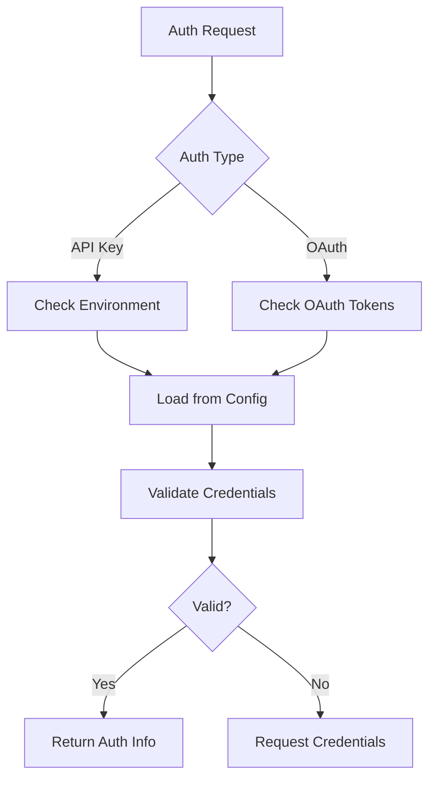

### Provider-Specific Authentication

#### Amazon Bedrock

```typescript
// Complex credential handling for AWS
const awsAccessKeyId = Env.get("AWS_ACCESS_KEY_ID");
const awsBearerToken = getBearerToken();
const awsWebIdentityTokenFile = Env.get("AWS_WEB_IDENTITY_TOKEN_FILE");
const containerCreds = checkContainerCredentials();

// Credential precedence:
// 1. Bearer token
// 2. Access key + secret
// 3. IAM roles
// 4. Web identity tokens
// 5. Container credentials
```

#### Google Vertex AI

```typescript
// Google Cloud authentication
const auth = new GoogleAuth();
const client = await auth.getApplicationDefault();
const token = await client.credential.getAccessToken();

// Custom fetch with auth headers
options.fetch = async (input, init) => {
  const headers = new Headers(init?.headers);
  headers.set("Authorization", `Bearer ${token.token}`);
  return fetch(input, { ...init, headers });
};
```

#### GitHub Copilot

```typescript
// GitHub authentication handling
const auth = await Auth.get("github-copilot");
const apiKey = await (async () => {
  if (auth?.type === "oauth") return auth.access;
  if (auth?.type === "api") return auth.key;
  return Env.get("GITHUB_COPILOT_TOKEN");
})();
```

## Model Selection and Loading

### Model Selection Algorithm

```typescript
async function getModel(providerID: string, modelID: string): Promise<Model> {
  const providers = await listProviders();
  const provider = providers[providerID];
  
  if (!provider) {
    throw new ModelNotFoundError({ providerID, modelID });
  }
  
  const model = provider.models[modelID];
  if (!model) {
    throw new ModelNotFoundError({ providerID, modelID });
  }
  
  return model;
}
```

### Language Model Loading

```typescript
async function getLanguage(model: Model): Promise<LanguageModelV2> {
  const sdk = await getSDK(model);
  const provider = await getProvider(model.providerID);
  
  const customLoader = CUSTOM_LOADERS[model.providerID]?.getModel;
  if (customLoader) {
    return customLoader(sdk, model.api.id, provider.options);
  }
  
  return sdk.languageModel(model.api.id);
}
```

### SDK Management

```typescript
async function getSDK(model: Model): Promise<SDK> {
  const cacheKey = calculateCacheKey(model);
  const cached = sdkCache.get(cacheKey);
  if (cached) return cached;
  
  const options = buildSDKOptions(model);
  const bundledFn = BUNDLED_PROVIDERS[model.api.npm];
  
  if (bundledFn) {
    const sdk = bundledFn(options);
    sdkCache.set(cacheKey, sdk);
    return sdk;
  }
  
  // Dynamic import for custom providers
  const mod = await import(model.api.npm);
  const createFn = findCreateFunction(mod);
  const sdk = createFn(options);
  sdkCache.set(cacheKey, sdk);
  return sdk;
}
```

## Provider-Specific Implementations

### OpenAI/Codex

```typescript
// Special handling for Codex (GitHub Copilot OAuth)
function isCodex(provider: ProviderInfo): boolean {
  return provider.id === "openai" && auth?.type === "oauth";
}

// Instructions handling for Codex
if (isCodex) {
  options.instructions = SystemPrompt.soul() + "\n" + SystemPrompt.instructions();
}
```

### Anthropic

```typescript
// Custom headers for Anthropic beta features
options.headers = {
  "anthropic-beta": "claude-code-20250219,interleaved-thinking-2025-05-14,fine-grained-tool-streaming-2025-05-14,context-1m-2025-08-07"
};
```

### Amazon Bedrock

```typescript
// Complex region prefix handling
function getModelWithRegion(sdk: any, modelID: string, region: string): any {
  const crossRegionPrefixes = ["global.", "us.", "eu.", "jp.", "apac.", "au."];
  
  if (crossRegionPrefixes.some(prefix => modelID.startsWith(prefix))) {
    return sdk.languageModel(modelID);
  }
  
  // Apply region prefix based on model and region
  const regionPrefix = getRegionPrefix(region);
  const prefixedModelID = applyRegionPrefix(modelID, regionPrefix);
  
  return sdk.languageModel(prefixedModelID);
}
```

### Kilo Gateway

```typescript
// Kilo-specific configurations
const kiloOptions = {
  ...(kiloOrgId ? { kilocodeOrganizationId: kiloOrgId } : {}),
  ...(normalizedBaseURL ? { baseURL: normalizedBaseURL } : {})
};

// Dynamic model fetching from Kilo API
const kiloModels = await ModelCache.fetch("kilo", kiloFetchOptions);
```

## Error Handling

### Error Types

```typescript
const ModelNotFoundError = NamedError.create(
  "ProviderModelNotFoundError",
  z.object({
    providerID: z.string(),
    modelID: z.string(),
    suggestions: z.array(z.string()).optional(),
  }),
);

const InitError = NamedError.create(
  "ProviderInitError",
  z.object({
    providerID: z.string(),
  }),
);
```

### Error Processing

```typescript
function handleProviderError(e: unknown, ctx: { providerID: string }): never {
  if (e instanceof NoSuchModelError) {
    throw new ModelNotFoundError(
      { modelID: model.id, providerID: model.providerID },
      { cause: e }
    );
  }
  
  if (e instanceof APICallError) {
    const parsed = parseAPICallError(e);
    if (parsed.type === "auth") {
      throw new AuthError({ providerID: ctx.providerID, message: parsed.message });
    }
    throw new APIError({ ...parsed, providerID: ctx.providerID });
  }
  
  throw new InitError({ providerID: ctx.providerID }, { cause: e });
}
```

## Configuration Management

### Configuration Sources

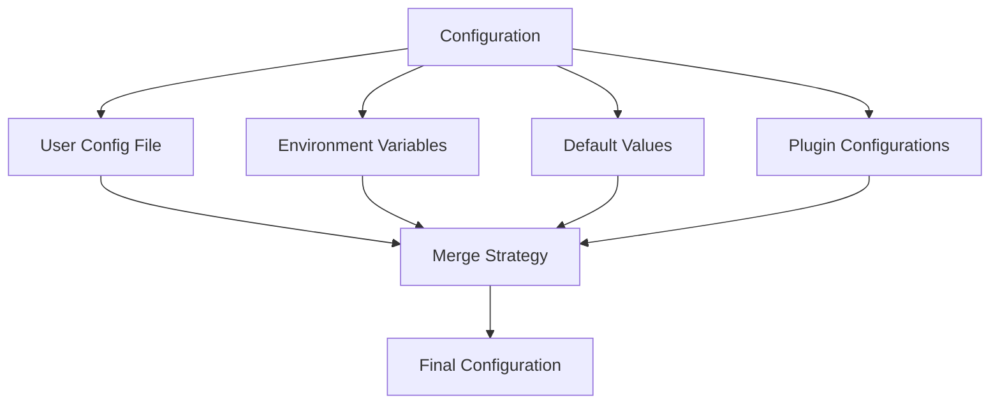

### Configuration Merge Strategy

```typescript
function mergeConfigurations(...sources: any[]): any {
  let result = {};
  
  for (const source of sources) {
    result = mergeDeep(result, source);
  }
  
  // Apply precedence rules
  // Environment variables override config file
  // Config file overrides defaults
  // Plugins can modify final configuration
  
  return result;
}
```

## Performance Optimization

### Caching Strategies

```typescript
// Model caching
const modelCache = new LRUCache<string, Model>({ max: 100 });

// SDK caching
const sdkCache = new Map<number, SDK>();

// Provider state caching
const providerState = Instance.state(async () => {
  // Expensive initialization
  return { providers, models, sdkCache };
});
```

### Lazy Loading

```typescript
// Lazy load provider data
const providers = lazy(async () => {
  const config = await Config.get();
  const modelsDev = await ModelsDev.get();
  return mergeConfigurations(config, modelsDev);
});
```

### Batch Processing

```typescript
// Batch model operations
async function processModelsInBatch(
  models: Model[],
  batchSize: number = 10
): Promise<void> {
  for (let i = 0; i < models.length; i += batchSize) {
    const batch = models.slice(i, i + batchSize);
    await Promise.all(batch.map(processModel));
  }
}
```

## Security Considerations

### Credential Management

```typescript
// Secure credential handling
function secureCredentials(credentials: any): any {
  // Remove credentials from logs
  // Use secure storage for sensitive data
  // Implement credential rotation
  // Apply least privilege principle
  return sanitizedCredentials;
}
```

### API Key Protection

```typescript
// API key protection strategies
function protectAPIKeys(config: any): any {
  // Mask keys in logs
  // Use environment variables for sensitive data
  // Implement key rotation
  // Apply rate limiting
  return protectedConfig;
}
```

### Permission Validation

```typescript
// Permission checking
async function checkProviderPermission(
  providerID: string,
  userID: string
): Promise<boolean> {
  // Check user access to provider
  // Validate against permission rules
  // Handle sensitive provider restrictions
  return hasPermission;
}
```

## Monitoring and Telemetry

### Telemetry Integration

```typescript
// OpenTelemetry integration
const telemetryOptions = {
  isEnabled: config.experimental?.openTelemetry !== false,
  recordInputs: false,
  recordOutputs: false,
  tracer: Telemetry.getTracer(),
  metadata: {
    userId: config.username ?? "unknown",
  },
};
```

### Performance Monitoring

```typescript
// Performance tracking
const performance = {
  modelLoadTime: 0,
  requestTime: 0,
  tokenProcessingTime: 0,
  // ... other metrics
};

// Log performance data
log.info("provider.performance", performance);
```

## Future Enhancements

### Planned Features

1. **Dynamic Provider Loading**: Load providers on-demand
2. **Provider Health Checks**: Monitor provider availability
3. **Fallback Mechanisms**: Automatic fallback to backup providers
4. **Cost Optimization**: Intelligent model selection based on cost
5. **Performance Benchmarking**: Compare provider performance
6. **Provider Recommendations**: Suggest optimal providers for tasks
7. **Multi-Provider Orchestration**: Coordinate across multiple providers
8. **Provider Caching**: Cache provider responses intelligently
9. **Provider Rate Limiting**: Manage API rate limits
10. **Provider Retry Logic**: Sophisticated retry strategies

### Architecture Improvements

1. **Modular Provider System**: More modular provider architecture
2. **Plugin Architecture**: Extensible provider system through plugins
3. **Provider SDK**: Standardized provider development kit
4. **Provider Testing**: Comprehensive provider testing framework
5. **Provider Documentation**: Better provider documentation
6. **Provider Discovery**: Improved provider discovery mechanism
7. **Provider Configuration**: More flexible configuration options
8. **Provider Security**: Enhanced security features
9. **Provider Performance**: Better performance optimization
10. **Provider Monitoring**: Comprehensive monitoring and alerting

## Provider-Specific Considerations

### OpenAI/Codex

- OAuth integration for GitHub Copilot
- Special instruction handling
- Tool call repair mechanism
- Rate limit management

### Anthropic

- Beta feature headers
- Interleaved thinking support
- Custom tool handling
- Model variant support

### Amazon Bedrock

- Complex region management
- Credential chain handling
- Cross-region inference
- Model prefix handling

### Google Vertex AI

- Google Cloud authentication
- Project and location management
- Custom fetch implementation
- Model variant handling

### Kilo Gateway

- Organization ID handling
- Dynamic model fetching
- Custom base URL support
- Project-specific configurations

### Azure

- Completion vs responses API
- Region-specific configurations
- Custom endpoint support
- Enterprise features

## Conclusion

The provider and model system in KiloCode provides a robust, flexible foundation for managing language model providers. The design supports multiple providers with different authentication mechanisms, handles complex model capabilities, and provides a unified interface for LLM interactions. The system is designed to be extensible for future requirements while providing excellent performance and security characteristics.


# Mistral vibe - LLM Provider and Model Abstraction Specification

## Overview

This specification defines the architecture for accessing Large Language Models (LLMs) through a unified abstraction layer that supports multiple providers while maintaining consistency, performance, and security.

## Core Components

### 1. Provider Configuration

**Class: `ProviderConfig`**

```python
class ProviderConfig(BaseModel):
    name: str  # Unique provider identifier
    api_base: str  # Base API URL (e.g., "https://api.mistral.ai/v1")
    api_key_env_var: str = ""  # Environment variable name for API key
    api_style: str = "openai"  # API compatibility style
    backend: Backend = Backend.GENERIC  # Backend implementation type
    reasoning_field_name: str = "reasoning_content"  # Field name for reasoning data
    project_id: str = ""  # For cloud providers (e.g., GCP)
    region: str = ""  # For cloud providers (e.g., "us-central1")
```

**Validation Requirements:**
- `name` must be unique across providers
- `api_base` must be a valid URL
- If `api_key_env_var` is set, the environment variable must exist at runtime
- For Vertex AI, both `project_id` and `region` must be provided

### 2. Model Configuration

**Class: `ModelConfig`**

```python
class ModelConfig(BaseModel):
    name: str  # Model identifier from provider
    provider: str  # Provider name (must match ProviderConfig.name)
    alias: str  # User-friendly alias
    temperature: float = 0.2  # Default sampling temperature
    input_price: float = 0.0  # Price per million input tokens
    output_price: float = 0.0  # Price per million output tokens
    thinking: Literal["off", "low", "medium", "high"] = "off"  # Reasoning level
    auto_compact_threshold: int = 200_000  # Token threshold for message compaction
```

**Validation Requirements:**
- `alias` must be unique across models
- `provider` must reference an existing `ProviderConfig`
- `temperature` must be between 0.0 and 2.0
- `auto_compact_threshold` must be positive

### 3. Backend Interface

**Protocol: `APIAdapter`**

```python
class APIAdapter(Protocol):
    endpoint: ClassVar[str]  # API endpoint path
    
    def prepare_request(
        self,
        *,
        model_name: str,
        messages: Sequence[LLMMessage],
        temperature: float,
        tools: list[AvailableTool] | None,
        max_tokens: int | None,
        tool_choice: StrToolChoice | AvailableTool | None,
        enable_streaming: bool,
        provider: ProviderConfig,
        api_key: str | None = None,
        thinking: str = "off",
    ) -> PreparedRequest: ...
    
    def parse_response(
        self, data: dict[str, Any], provider: ProviderConfig
    ) -> LLMChunk: ...
```

**PreparedRequest Type:**
```python
class PreparedRequest(NamedTuple):
    endpoint: str  # API endpoint path
    headers: dict[str, str]  # HTTP headers
    body: bytes  # Request body
    base_url: str = ""  # Optional base URL override
```

## Backend Implementations

### 1. Generic Backend

**Class: `GenericBackend`**

**Features:**
- HTTP-based communication using `httpx.AsyncClient`
- Automatic retry mechanism (3 attempts by default)
- Connection pooling (max 10 connections, 5 keepalive)
- Timeout configuration (default 720 seconds)
- Stream and non-stream completion support

**Methods:**

```python
async def complete(
    *,
    model: ModelConfig,
    messages: Sequence[LLMMessage],
    temperature: float = 0.2,
    tools: list[AvailableTool] | None = None,
    max_tokens: int | None = None,
    tool_choice: StrToolChoice | AvailableTool | None = None,
    extra_headers: dict[str, str] | None = None,
    metadata: dict[str, str] | None = None,
) -> LLMChunk

async def complete_streaming(
    # Same parameters as complete
) -> AsyncGenerator[LLMChunk, None]

async def count_tokens(
    # Same parameters as complete
) -> int
```

**Adapter Selection:**
```python
api_style = getattr(provider, "api_style", "openai")
adapter = ADAPTERS[api_style]  # From global registry
```

### 2. Mistral Backend

**Class: `MistralBackend`**

**Features:**
- Uses Mistral's official Python SDK
- Specialized message mapping for Mistral API
- ThinkChunk support for reasoning content
- Automatic retry with exponential backoff
- Token usage tracking

**MistralMapper Responsibilities:**
- Convert `LLMMessage` ↔ `mistralai.Messages`
- Handle tool call serialization/deserialization
- Parse ThinkChunk content for reasoning
- Manage content blocks and tool calls

## Adapter Implementations

### 1. OpenAI Adapter

**Class: `OpenAIAdapter`**

**Features:**
- OpenAI-compatible API format
- Tool calling support
- Streaming support with usage tracking
- Message merging for consecutive user messages

**Message Conversion:**
- System/user/assistant/tool roles
- Tool call serialization
- Reasoning field mapping

### 2. Anthropic Adapter

**Class: `AnthropicAdapter`**

**Features:**
- Anthropic API format (v1/messages)
- Thinking blocks for reasoning
- Tool use/tool result message format
- Cache control for prompt caching
- Adaptive model detection

**Special Handling:**
- Thinking budget configuration
- Signature support for reasoning
- Fine-grained tool streaming
- Prompt caching integration

### 3. Vertex AI Adapter

**Class: `VertexAnthropicAdapter`**

**Features:**
- Google Vertex AI integration
- Automatic credential management
- Region-specific endpoint construction
- Inherits Anthropic message format

**Authentication:**
- Uses Google Application Default Credentials
- Automatic token refresh
- Thread-safe credential handling

### 4. Reasoning Adapter

**Class: `ReasoningAdapter`**

**Features:**
- Enhanced reasoning support
- Thinking content blocks
- Tool call integration with reasoning
- Effort level configuration

## Error Handling

### BackendErrorBuilder

**Responsibilities:**
- HTTP error construction
- Request error construction
- Context preservation (model, messages, parameters)
- Provider-specific error messages

**Error Types:**
- `BackendError`: Base error class
- `HTTPError`: HTTP status errors (4xx, 5xx)
- `RequestError`: Network/connection errors
- `AuthenticationError`: API key/authentication failures
- `RateLimitError`: Rate limiting exceeded
- `ValidationError`: Invalid request parameters

**Context Included:**
- Provider name
- Endpoint URL
- Model name
- Temperature setting
- Tool configuration
- Full request headers
- Response headers (for HTTP errors)

## Performance Features

### 1. Connection Management

**GenericBackend:**
- Connection pooling with `httpx.Limits`
- Keepalive connections (max 5)
- Total connection limit (max 10)
- Automatic connection closure

**MistralBackend:**
- SDK-managed connection pooling
- Configurable retry with backoff
- Timeout configuration in milliseconds

### 2. Retry Mechanism

**Retry Configuration:**
```python
RetryConfig(
    strategy="backoff",
    backoff=BackoffStrategy(
        initial_interval=500,
        max_interval=30000,
        exponent=1.5,
        max_elapsed_time=300000,
    ),
    retry_connection_errors=True,
)
```

**Retry Decorators:**
- `@async_retry(tries=3)` for non-streaming requests
- `@async_generator_retry(tries=3)` for streaming requests

### 3. Caching

**Prompt Caching (Anthropic):**
- Cache control headers
- Ephemeral content marking
- Cache creation/read token tracking

## Security Features

### 1. API Key Management

**Key Handling:**
- Environment variable reference only
- Never stored in configuration
- Automatic loading from `.env` files
- Validation at startup

**Vertex AI Authentication:**
- Google Application Default Credentials
- Thread-safe credential storage
- Automatic token refresh
- Minimal permission scope

### 2. Input Validation

**Message Validation:**
- Role validation (system/user/assistant/tool)
- Content length limits
- Tool call ID sanitization
- JSON validation for tool arguments

**Configuration Validation:**
- URL format validation
- Environment variable existence check
- Unique name/alias enforcement
- Price validation (non-negative)

### 3. Data Sanitization

**Tool Call IDs:**
```python
def _sanitize_tool_call_id(self, tool_id: str | None) -> str:
    return re.sub(r"[^a-zA-Z0-9_-]", "_", tool_id or "")
```

**Content Filtering:**
- Remove invalid characters
- Handle null/empty content
- Validate JSON structures

## Monitoring and Telemetry

### Metrics Collection

**Tracked Metrics:**
- Request latency
- Token usage (prompt/completion)
- Error rates by provider/model
- Retry attempts
- Connection pool utilization

### Logging

**Log Levels:**
- DEBUG: Request/response details
- INFO: Successful operations
- WARNING: Retries, non-critical errors
- ERROR: Failed operations

**Sensitive Data Handling:**
- API keys masked in logs
- Message content redacted based on configuration
- Headers filtered for sensitive information

## Implementation Details

### Message Processing Pipeline

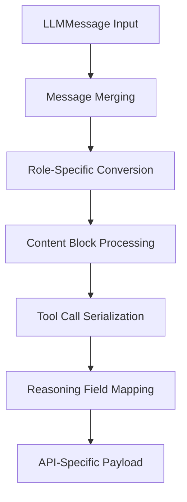

### Streaming Protocol

**Streaming Events (Anthropic):**
- `message_start`: Initial message with usage
- `content_block_start`: Beginning of content block
- `content_block_delta`: Incremental content
- `content_block_stop`: End of content block
- `message_delta`: Usage updates
- `message_stop`: Final message

**Stream Parser State:**
- Current index tracking
- Block type handling
- Delta accumulation
- Usage aggregation

### Token Counting

**Strategy:**
```python
async def count_tokens(self, ...) -> int:
    # Add probe message if needed
    if not messages or messages[-1].role != Role.user:
        messages.append(LLMMessage(role=Role.user, content=""))
    
    # Make minimal completion (max_tokens=16)
    result = await self.complete(..., max_tokens=16)
    
    # Return prompt token count
    return result.usage.prompt_tokens
```

## Configuration Management

### Settings Sources Priority

1. **Command-line arguments** (highest priority)
2. **Environment variables** (`VIBE_*` prefix)
3. **TOML configuration file**
4. **Default values** (lowest priority)

### Configuration Validation

**Validation Steps:**
1. Load all sources in priority order
2. Merge configurations (later sources override earlier)
3. Validate provider uniqueness
4. Validate model uniqueness
5. Check provider references
6. Validate API key availability
7. Validate system prompt existence

### Persistence

**Configuration File:**
- Location: `~/.vibe/config.toml`
- Format: TOML
- Automatic creation with defaults
- Deep merge for updates

## Testing Requirements

### Unit Tests
- Adapter message conversion
- Request preparation
- Response parsing
- Error handling
- Retry logic

### Integration Tests
- End-to-end completion
- Streaming behavior
- Token counting
- Error scenarios

### Performance Tests
- Latency benchmarks
- Throughput testing
- Connection pool behavior
- Memory usage

## Future Extensibility

### Adding New Providers

1. **Implement Adapter:**
   - Create new class implementing `APIAdapter` protocol
   - Add to `ADAPTERS` registry

2. **Update Configuration:**
   - Add provider to default providers list
   - Define required configuration fields

3. **Add Tests:**
   - Unit tests for message conversion
   - Integration tests for API calls

### Adding New Features

**Feature Addition Process:**
1. Extend `APIAdapter` protocol if needed
2. Implement in all existing adapters
3. Update configuration schema
4. Add validation logic
5. Update documentation

## Migration Path

### From Previous Versions

**Breaking Changes:**
- Provider configuration format changes
- Model configuration validation
- Error handling structure

**Migration Steps:**
1. Validate existing configuration
2. Convert to new format
3. Test all providers
4. Update documentation

## Documentation Requirements

### User Documentation
- Configuration guide
- Provider setup instructions
- Error troubleshooting
- Performance tuning

### Developer Documentation
- Architecture overview
- Adapter implementation guide
- Testing strategy
- Contribution guidelines

## Message Abstractions

### Core Message Types

**Class: `LLMMessage`**

```python
class LLMMessage(BaseModel):
    role: Role  # Message role (system/user/assistant/tool)
    content: str | None = None  # Main content text
    reasoning_content: str | None = None  # Reasoning/thinking content
    reasoning_signature: str | None = None  # Reasoning signature
    tool_calls: list[ToolCall] | None = None  # Tool calls
    tool_call_id: str | None = None  # Tool call ID (for tool messages)
    name: str | None = None  # Tool name (for tool messages)
    message_id: str | None = None  # Unique message identifier
```

**Role Enum:**
```python
class Role(StrEnum):
    SYSTEM = "system"
    USER = "user"
    ASSISTANT = "assistant"
    TOOL = "tool"
```

**ToolCall Class:**
```python
class ToolCall(BaseModel):
    id: str | None = None  # Tool call ID
    index: int | None = None  # Tool call index
    function: FunctionCall  # Function call details
```

**FunctionCall Class:**
```python
class FunctionCall(BaseModel):
    name: str  # Function name
    arguments: str  # JSON-encoded arguments
```

### Message Processing Utilities

**Message Merging:**
```python
def merge_consecutive_user_messages(
    messages: Sequence[LLMMessage]
) -> list[LLMMessage]:
    """Merge consecutive user messages to reduce API calls."""
    merged: list[LLMMessage] = []
    for msg in messages:
        if (
            msg.role == Role.user
            and merged
            and merged[-1].role == Role.user
            and merged[-1].content
            and msg.content
        ):
            # Merge with previous user message
            merged[-1].content += "\n" + msg.content
        else:
            merged.append(msg)
    return merged
```

### Provider-Specific Message Mappings

**Anthropic Message Format:**
```python
{
    "role": "user",
    "content": [
        {"type": "text", "text": "Hello"},
        {"type": "thinking", "thinking": "Let me think..."},
        {"type": "tool_use", "id": "call_123", "name": "func", "input": {}}
    ]
}
```

**Mistral Message Format:**
```python
mistralai.UserMessage(
    role="user",
    content="Hello"
)

mistralai.AssistantMessage(
    role="assistant",
    content=[
        mistralai.ThinkChunk(type="thinking", thinking=[...]),
        mistralai.TextChunk(type="text", text="Response")
    ],
    tool_calls=[...]
)
```

**OpenAI Message Format:**
```python
{
    "role": "assistant",
    "content": "Response",
    "tool_calls": [
        {
            "id": "call_123",
            "type": "function",
            "function": {"name": "func", "arguments": "{}"}
        }
    ]
}
```

## Agentic Loop Interface

### Core Agent Loop

**Class: `AgentLoop`**

**Main Method:**
```python
async def run(
    self,
    initial_messages: list[LLMMessage],
    tools: list[AvailableTool],
    max_iterations: int = 10,
    temperature: float = 0.2,
    thinking: str = "off"
) -> AsyncGenerator[AgentStep, None]:
    """Run the agentic loop, yielding steps as they complete."""
```

### Agent Step Abstraction

**Class: `AgentStep`**

```python
class AgentStep(NamedTuple):
    messages: list[LLMMessage]  # Current conversation state
    tool_calls: list[ToolCall] | None = None  # Tool calls to execute
    final_answer: str | None = None  # Final answer if complete
    is_complete: bool = False  # Whether this is the final step
    usage: LLMUsage | None = None  # Token usage
    error: Exception | None = None  # Error if occurred
```

### LLM Chunk Interface

**Class: `LLMChunk`**

```python
class LLMChunk(NamedTuple):
    message: LLMMessage  # Message content
    usage: LLMUsage | None = None  # Token usage information
```

**LLMUsage Class:**
```python
class LLMUsage(BaseModel):
    prompt_tokens: int = 0  # Input tokens
    completion_tokens: int = 0  # Output tokens
```

### Agent Loop Execution Flow

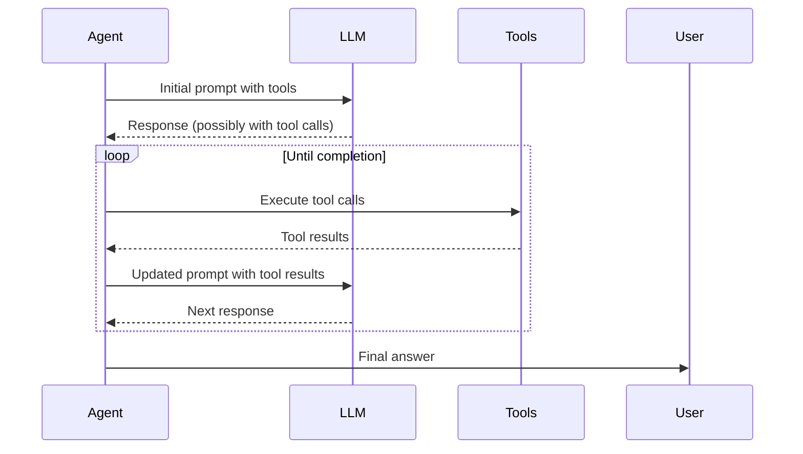

### Tool Integration

**AvailableTool Class:**
```python
class AvailableTool(BaseModel):
    type: Literal["function"] = "function"
    function: ToolFunction  # Function definition
```

**ToolFunction Class:**
```python
class ToolFunction(BaseModel):
    name: str  # Function name
    description: str | None = None  # Function description
    parameters: dict[str, Any] | None = None  # JSON Schema parameters
```

### Agent Loop Implementation Details

**Main Loop Structure:**
```python
async def run_agent_loop(
    backend: GenericBackend | MistralBackend,
    model: ModelConfig,
    tools: list[AvailableTool],
    messages: list[LLMMessage],
    max_iterations: int
) -> AsyncGenerator[AgentStep, None]:
    
    for iteration in range(max_iterations):
        # Get LLM response
        chunk = await backend.complete(
            model=model,
            messages=messages,
            tools=tools,
            temperature=model.temperature,
            thinking=model.thinking
        )
        
        # Yield current step
        yield AgentStep(
            messages=messages + [chunk.message],
            tool_calls=chunk.message.tool_calls,
            usage=chunk.usage
        )
        
        # Check for tool calls
        if chunk.message.tool_calls:
            # Execute tools and get results
            tool_results = await execute_tools(
                chunk.message.tool_calls,
                tools
            )
            
            # Add tool results to messages
            for result in tool_results:
                messages.append(LLMMessage(
                    role=Role.tool,
                    content=result.content,
                    tool_call_id=result.tool_call_id,
                    name=result.name
                ))
        else:
            # No more tool calls, return final answer
            yield AgentStep(
                messages=messages + [chunk.message],
                final_answer=chunk.message.content,
                is_complete=True,
                usage=chunk.usage
            )
            return
```

### Error Handling in Agent Loop

**Error Scenarios:**
- **LLM Errors**: Propagate backend errors with context
- **Tool Errors**: Catch and handle tool execution failures
- **Iteration Limits**: Return partial results when max iterations reached
- **Validation Errors**: Validate tool inputs/outputs

**Error Recovery:**
- Retry failed tool executions (configurable attempts)
- Provide error messages to LLM for recovery
- Graceful degradation when tools fail

### Performance Optimizations

**Optimization Techniques:**
- **Message Compaction**: Merge messages when exceeding token limits
- **Parallel Tool Execution**: Execute independent tools concurrently
- **Caching**: Cache frequent tool results
- **Batching**: Batch multiple tool calls when possible

**Compaction Strategy:**
```python
async def compact_messages(
    messages: list[LLMMessage],
    backend: GenericBackend,
    model: ModelConfig,
    threshold: int
) -> list[LLMMessage]:
    """Compact messages if token count exceeds threshold."""
    token_count = await backend.count_tokens(
        model=model,
        messages=messages
    )
    
    if token_count > threshold:
        # Implement compaction strategy
        return compacted_messages
    
    return messages
```

### Monitoring and Instrumentation

**Agent Loop Metrics:**
- Iteration count
- Tool execution time
- LLM response time
- Token usage per iteration
- Error rates

**Logging:**
- Step-by-step execution trace
- Tool call details
- Error information
- Performance metrics

### Configuration Integration

**Agent Configuration:**
```python
class AgentConfig(BaseModel):
    max_iterations: int = 10
    max_tool_retries: int = 3
    enable_compaction: bool = True
    compaction_threshold: int = 200000
    parallel_tool_execution: bool = True
    max_parallel_tools: int = 5
```

## Compliance and Standards

### Security Compliance
- API key handling best practices
- Secure credential storage
- Minimal permission principles

### Data Privacy
- Message content handling
- Logging redaction
- Compliance with provider terms

### Performance Standards
- Response time targets
- Error rate thresholds
- Resource utilization limits


