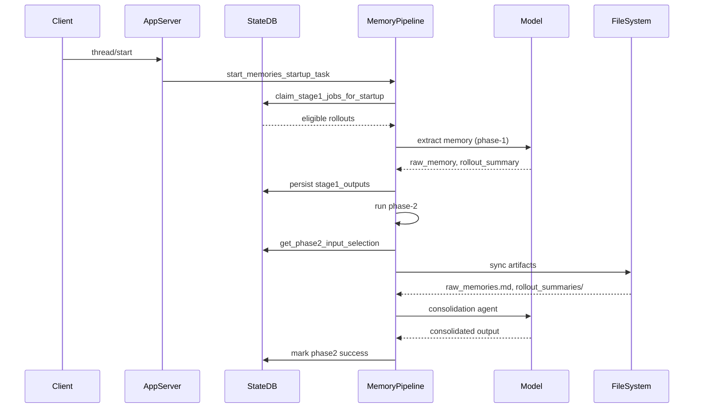
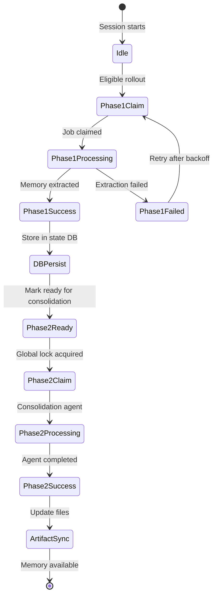
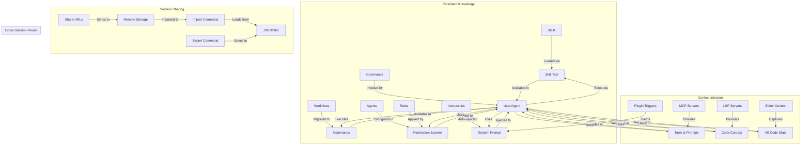
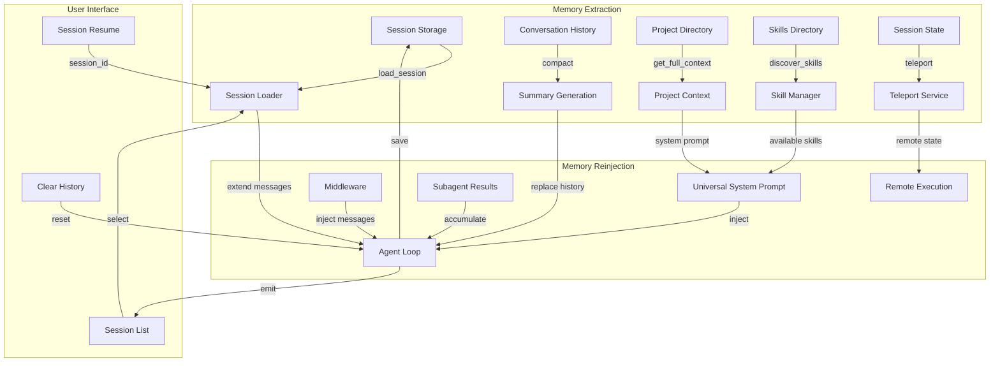

# Codex Memory System Architecture

## Overview

This document provides a comprehensive analysis of the memory system implemented in the Codex agent. The memory system enables extracting information from sessions and reinjecting it into other sessions through multiple mechanisms, both automatic and user-triggered.

## Memory System Components

### 1. Memory Pipeline (Phase 1 & Phase 2)

The core memory system consists of a two-phase pipeline that runs asynchronously when a root session starts.

#### Phase 1: Rollout Extraction (Per-Thread)

**Purpose:** Extract structured memory from individual session rollouts.

**Trigger Conditions:**
- Session is not ephemeral
- Memory feature is enabled (`Feature::MemoryTool`)
- Session is not a sub-agent session
- State database is available

**Process:**
1. **Job Claiming:** Claims eligible rollout jobs from the state database using startup claim rules
2. **Filtering:** Filters rollout content to memory-relevant response items
3. **Model Extraction:** Sends each rollout to a model (in parallel, with concurrency cap of 8)
4. **Output:** Expects structured output containing:
   - `raw_memory`: Detailed markdown raw memory for a single rollout
   - `rollout_summary`: Compact summary line used for routing and indexing
   - `rollout_slug`: Optional slug used to derive rollout summary artifact filenames
5. **Secret Redaction:** Redacts secrets from generated memory fields
6. **Persistence:** Stores successful outputs back into the state DB as stage-1 outputs

**Eligibility Criteria for Rollouts:**
- From allowed interactive session sources
- Within configured age window (max 30 days by default)
- Idle long enough (to avoid summarizing still-active/fresh rollouts)
- Not already owned by another in-flight phase-1 worker
- Within startup scan/claim limits (bounded work per startup)

**Concurrency & Coordination:**
- Multiple extraction jobs run in parallel (fixed concurrency cap of 8)
- Each job is leased/claimed in the state DB before processing
- Failed jobs are marked with retry backoff (1 hour)

**Database Schema (stage1_outputs table):**
```sql
CREATE TABLE stage1_outputs (
    thread_id TEXT PRIMARY KEY,
    source_updated_at INTEGER NOT NULL,
    raw_memory TEXT NOT NULL,
    rollout_summary TEXT NOT NULL,
    rollout_slug TEXT,
    generated_at INTEGER NOT NULL,
    usage_count INTEGER DEFAULT 0,
    last_usage INTEGER,
    selected_for_phase2 INTEGER DEFAULT 0,
    selected_for_phase2_source_updated_at INTEGER
);
```

#### Phase 2: Global Consolidation

**Purpose:** Consolidate stage-1 outputs into filesystem memory artifacts and run a dedicated consolidation agent.

**Process:**
1. **Job Claiming:** Claims a single global phase-2 job (ensures only one consolidation runs at a time)
2. **Input Selection:** Loads a bounded set of stage-1 outputs using phase-2 selection rules:
   - Ignores memories whose `last_usage` falls outside `max_unused_days` window
   - For memories with no `last_usage`, falls back to `generated_at`
   - Ranks eligible memories by `usage_count` first, then by most recent `last_usage`/`generated_at`
3. **Watermark Computation:** Computes a completion watermark from claimed watermark + newest input timestamps
4. **Artifact Sync:** Syncs local memory artifacts under the memories root:
   - `raw_memories.md` (merged raw memories, latest first)
   - `rollout_summaries/` (one summary file per retained rollout)
5. **Pruning:** Prunes stale rollout summaries that are no longer retained
6. **Agent Spawning:** If there is input, spawns an internal consolidation sub-agent:
   - No approvals, no network, local write access only
   - Collaboration disabled to prevent recursive delegation
   - Watches agent status and heartbeats the global job lease

**Selection Diff Behavior:**
- Successful Phase 2 runs mark the exact stage-1 snapshots with `selected_for_phase2 = 1`
- Phase 1 upserts preserve the previous `selected_for_phase2` baseline until next successful Phase 2
- The next Phase 2 run compares current top-N stage-1 inputs against prior snapshot selection
- Labels inputs as `added`, `retained`, or `removed`

### 2. Memory Tool (get_memory)

**Purpose:** Provides the agent with a tool to read from the memory system during active sessions.

**Implementation:**
- Tool name: `get_memory`
- Only available when `Feature::MemoryTool` is enabled
- Injected into developer instructions via `build_memory_tool_developer_instructions()`

**Developer Instructions:**
The memory tool developer instructions are built from `memory_summary.md` and include:
- Base path to memory root
- Truncated memory summary (max 5,000 tokens)
- Instructions for using the memory tool

**Usage Tracking:**
The system tracks memory tool usage through `emit_metric_for_tool_read()`:
- Monitors `shell`, `shell_command`, and `exec_command` tool invocations
- Detects reads of memory files:
  - `memories/MEMORY.md`
  - `memories/memory_summary.md`
  - `memories/raw_memories.md`
  - `memories/rollout_summaries/`
  - `memories/skills/`
- Emits metrics with tags: `kind`, `tool`, `success`

### 3. Citation System

**Purpose:** Enables the agent to reference specific threads in its output, creating traceable connections between sessions.

**Citation Format:**
```
<oai-mem-citation>doc1</oai-mem-citation>
```

**Thread ID Extraction:**
The `get_thread_id_from_citations()` function extracts thread IDs from citations:
- Supports `<thread_ids>` blocks
- Supports legacy `<rollout_ids>` blocks
- Parses multiple thread IDs per citation

**Citation Stripping:**
- Citations are stripped from display text using `strip_citations()`
- Citations are collected but not yet surfaced in protocol events
- The system maintains both visible text and citation metadata

**Citation Flow:**
1. Agent output contains citation tags
2. `AssistantTextStreamParser` parses and extracts citations
3. `strip_citations()` separates visible text from citations
4. Thread IDs are extracted via `get_thread_id_from_citations()`
5. Usage is recorded via `record_stage1_output_usage()`

### 4. Thread Resume Mechanism

**Purpose:** Allows users to resume existing threads with full history.

**API Endpoint:** `thread/resume`

**Parameters:**
```typescript
export interface ThreadResumeParams {
  thread_id: string;
  history?: ThreadHistory;  // [UNSTABLE] Optional history to resume with
  path?: string;            // [UNSTABLE] Optional path to resume from
  overrides?: ThreadOverrides;
}
```

**Resume Methods:**
1. **By thread_id:** Load the thread from disk by thread_id and resume it
2. **By history:** Instantiate the thread from memory and resume it
3. **By path:** Load the thread from disk by path and resume it

**Implementation:**
- Located in [`codex_message_processor.rs`](codex-rs/app-server/src/codex_message_processor.rs:3093)
- Handles pending command execution and file change approvals
- Supports history overrides
- Replays pending interactive prompts (approvals, request_user_input, MCP elicitations)

**Key Features:**
- Replays pending approvals from the original session
- Maintains thread state consistency
- Supports running thread rejoin
- Handles MCP server initialization

### 5. Thread Fork Mechanism

**Purpose:** Creates a new thread based on an existing thread's state.

**API Endpoint:** `thread/fork`

**Parameters:**
```typescript
export interface ThreadForkParams {
  thread_id: string;
  history?: ThreadHistory;
  path?: string;
  overrides?: ThreadOverrides;
  persist_full_history?: boolean;  // [UNSTABLE] Persist additional rollout EventMsg variants
}
```

**Implementation:**
- Similar to thread resume but creates a new thread
- Can fork from any point in the thread's history
- Supports full history persistence for richer future resumes

### 6. Thread Read Mechanism

**Purpose:** Read thread history without resuming.

**API Endpoint:** `thread/read`

**Parameters:**
```typescript
export interface ThreadReadParams {
  thread_id: string;
  include_turns?: boolean;
  persist_full_history?: boolean;
}
```

**Implementation:**
- Returns thread metadata and optionally turn history
- Does not affect thread state
- Useful for inspection and debugging

### 7. Thread Compaction

**Purpose:** Reduce the size of thread history while preserving essential information.

**API Endpoint:** `thread/compact`

**Process:**
- Analyzes thread history
- Identifies redundant or compressible content
- Creates a compacted version of the thread
- Preserves ability to resume from compacted state

### 8. Thread Archive Mechanism

**Purpose:** Move threads to long-term storage.

**API Endpoint:** `thread/archive`

**Parameters:**
```typescript
export interface ThreadArchiveParams {
  thread_id: string;
}
```

**Implementation:**
- Marks thread as archived in database
- Sets `archived_at` timestamp
- Preserves all thread data
- Thread can be unarchived later

**Unarchive:**
- API endpoint: `thread/unarchive`
- Clears `archived_at` timestamp
- Restores thread to active state

### 9. Memory Mode Configuration

**Purpose:** Control memory generation per thread.

**Memory Mode Values:**
- `enabled`: Memory generation is active for this thread
- `disabled`: Memory generation is skipped for this thread
- `polluted`: Thread has been marked as polluted (excluded from memory selection)

**Configuration:**
- Set via `set_thread_memory_mode()` in state runtime
- Can be changed via API or programmatically
- Polluted threads are excluded from phase-2 selection

### 10. Memory Artifacts

**File System Structure:**
```
memories/
├── MEMORY.md                    # Canonical memory index
├── memory_summary.md            # Human-readable summary of all memories
├── raw_memories.md              # Merged raw memories from phase-1
└── rollout_summaries/
    ├── <thread_id>-<timestamp>-<hash>.md  # Individual rollout summaries
    └── ...
```

**File Contents:**

**MEMORY.md:**
```markdown
# Memory Index

This file contains a list of all available memories.
```

**memory_summary.md:**
```markdown
# Memory Summary

## Thread {thread_id}
- **Created:** {timestamp}
- **Last Used:** {timestamp}
- **Summary:** {rollout_summary}
```

**raw_memories.md:**
```markdown
# Raw Memories

## Thread `{thread_id}`
- **Updated At:** {timestamp}
- **CWD:** {working_directory}
- **Rollout Path:** {path_to_rollout}
- **Rollout Summary File:** {rollout_summary_file}

{raw_memory_content}
```

**rollout_summaries/*.md:**
```markdown
thread_id: {thread_id}
source_updated_at: {timestamp}
rollout_path: {path}
cwd: {directory}
git_branch: {branch}

{rollout_summary_content}
```

## Memory Extraction Flow



## Memory Injection Mechanisms

### Automatic Injection

1. **Memory Tool Developer Instructions:**
   - Injected at session start via `build_memory_tool_developer_instructions()`
   - Provides agent with instructions on how to use memory tools
   - Includes truncated memory summary (max 5,000 tokens)

2. **Phase-2 Consolidation Agent:**
   - Automatically spawned when new memories are available
   - Receives full context of selected memories
   - Produces consolidated output that updates memory artifacts

### User-Triggered Injection

1. **Thread Resume:**
   - User explicitly requests to resume a thread
   - Full history is loaded and replayed
   - Agent continues from where it left off

2. **Thread Fork:**
   - User creates a new thread from existing state
   - Can fork from any point in history
   - New thread inherits context from fork point

3. **Memory Tool Usage:**
   - Agent can explicitly call `get_memory` tool
   - Reads specific memories based on context
   - Citations created reference specific threads

## Memory Lifecycle



## Configuration

### Memory Configuration (config.toml)

```toml
[memories]
# When false, skip memory generation for all threads
generate_memories = true

# When false, skip injecting memory usage instructions into developer prompts
use_memories = true

# Maximum number of recent raw memories retained for global consolidation
max_raw_memories_for_consolidation = 512

# Maximum number of days since a memory was last used before it becomes ineligible for phase 2 selection
max_unused_days = 21
```

### Feature Flag

```rust
Feature::MemoryTool
```

### Memory Mode Per Thread

```rust
// Enable memory generation
runtime.set_thread_memory_mode(thread_id, "enabled").await?;

// Disable memory generation
runtime.set_thread_memory_mode(thread_id, "disabled").await?;

// Mark thread as polluted (excluded from selection)
runtime.mark_thread_memory_mode_polluted(thread_id).await?;
```

## API Endpoints Summary

| Endpoint | Purpose | Memory Relevance |
|----------|---------|------------------|
| `thread/start` | Start a new thread | Triggers memory pipeline |
| `thread/resume` | Resume existing thread | Loads full history |
| `thread/fork` | Fork from existing thread | Inherits context |
| `thread/read` | Read thread history | Inspection only |
| `thread/compact` | Compact thread history | Reduces storage |
| `thread/archive` | Archive thread | Long-term storage |
| `thread/unarchive` | Unarchive thread | Restore from archive |
| `thread/list` | List threads | Browse available threads |
| `thread/status` | Get thread status | Check thread state |

## Memory Tool API

```typescript
// Tool specification
{
  "name": "get_memory",
  "description": "Read from the memory system",
  "inputSchema": {
    "type": "object",
    "properties": {
      "path": {
        "type": "string",
        "description": "Path to memory file to read"
      }
    }
  }
}
```

## Security Considerations

1. **Secret Redaction:** All memory outputs are redacted before storage
2. **Sandboxing:** Memory consolidation runs in restricted sandbox
3. **Access Control:** Memory files are only accessible via approved tools
4. **Lease Management:** Job leases prevent concurrent modification conflicts

## Performance Considerations

1. **Concurrency Limits:** Phase-1 has fixed concurrency cap (8 jobs)
2. **Batch Pruning:** Stale memories are pruned in batches (200 at a time)
3. **Watermark Tracking:** Efficient tracking of processed memories
4. **Usage Counting:** Tracks memory usage for prioritization

## Future Enhancements

1. **Citation Surfacing:** Surface citations in protocol events
2. **Cross-Thread References:** Enable explicit cross-thread references
3. **Memory Search:** Add search capabilities for memory retrieval
4. **Incremental Updates:** Support incremental memory updates
5. **Memory Quality Scoring:** Implement quality scoring for memories

## Conclusion

The Codex memory system provides a comprehensive framework for extracting, storing, and reusing session information. Through the combination of automatic pipeline processing, user-triggered resume/fork operations, and the memory tool, the system enables persistent knowledge across sessions while maintaining user control over memory generation and usage.

# Hermes Agent Memory System Analysis

## Executive Summary

The Hermes Agent implements a **multi-layered memory system** with three distinct mechanisms for extracting information from sessions and reinjecting it into other sessions:

1. **Persistent Curated Memory** (`memory` tool) - Manual, bounded, file-backed memory
2. **Session Search** (`session_search` tool) - Automatic FTS5 search across all past conversations
3. **Honcho AI-Native Memory** - Cross-session user modeling via external AI memory service

This document provides a comprehensive technical analysis of all memory mechanisms, their extraction/injection pathways, and how they interact.

---

## 1. Persistent Curated Memory (MEMORY.md / USER.md)

### Overview

The `memory` tool provides **bounded, file-backed memory** that persists across sessions. It consists of two parallel stores:

| Store | Purpose | Location | Character Limit |
|-------|---------|----------|-----------------|
| `MEMORY.md` | Agent's personal notes (environment facts, project conventions, tool quirks, learned information) | `~/.hermes/memories/MEMORY.md` | 2,200 chars |
| `USER.md` | User profile (preferences, communication style, expectations, workflow habits) | `~/.hermes/memories/USER.md` | 1,375 chars |

### Architecture

```
┌─────────────────────────────────────────────────────────────────┐
│                     MemoryStore Class                            │
├─────────────────────────────────────────────────────────────────┤
│  ┌──────────────────┐  ┌──────────────────┐                     │
│  │ memory_entries   │  │  user_entries    │  ← Live state      │
│  │ (list[str])     │  │  (list[str])     │    mutated by tool │
│  └────────┬─────────┘  └────────┬─────────┘    calls           │
│           │                     │                              │
│           ▼                     ▼                              │
│  ┌──────────────────────────────────────────┐                  │
│  │  _system_prompt_snapshot                  │  ← Frozen at    │
│  │  {"memory": "...", "user": "..."}        │     load time   │
│  └──────────────────────────────────────────┘                  │
│                                                                │
│  ┌──────────────────────────────────────────┐                  │
│  │  load_from_disk()                         │                  │
│  │  - Read MEMORY.md, USER.md                │                  │
│  │  - Deduplicate entries                    │                  │
│  │  - Capture frozen snapshot                │                  │
│  └──────────────────────────────────────────┘                  │
│                                                                │
│  ┌──────────────────────────────────────────┐                  │
│  │  add(target, content)                     │                  │
│  │  replace(target, old_text, new_content)  │                  │
│  │  remove(target, old_text)                │                  │
│  │  format_for_system_prompt(target)        │                  │
│  └──────────────────────────────────────────┘                  │
└─────────────────────────────────────────────────────────────────┘
```

### Extraction Pathways

#### 1.1 Manual Extraction via `memory` Tool

**User Action Required**: User or agent explicitly calls the `memory` tool.

```python
# In run_agent.py:503-519
if not skip_memory:
    try:
        from hermes_cli.config import load_config as _load_mem_config
        mem_config = _load_mem_config().get("memory", {})
        self._memory_enabled = mem_config.get("memory_enabled", False)
        self._user_profile_enabled = mem_config.get("user_profile_enabled", False)
        if self._memory_enabled or self._user_profile_enabled:
            from tools.memory_tool import MemoryStore
            self._memory_store = MemoryStore(
                memory_char_limit=mem_config.get("memory_char_limit", 2200),
                user_char_limit=mem_config.get("user_char_limit", 1375),
            )
            self._memory_store.load_from_disk()
```

**Tool Schema** (`tools/memory_tool.py:385-430`):
```json
{
  "name": "memory",
  "description": "Persistent memory tool for saving important information across sessions",
  "parameters": {
    "type": "object",
    "properties": {
      "action": {
        "type": "string",
        "enum": ["add", "replace", "remove", "read"],
        "description": "Action to perform"
      },
      "target": {
        "type": "string",
        "enum": ["memory", "user"],
        "description": "Which memory store to modify"
      },
      "content": {
        "type": "string",
        "description": "Content to add (required for 'add' action)"
      },
      "old_text": {
        "type": "string",
        "description": "Substring to match for replace/remove (required for 'replace'/'remove')"
      }
    },
    "required": ["action"]
  }
}
```

**Behavioral Guidance** (injected into system prompt via [`MEMORY_GUIDANCE`](agent/prompt_builder.py:73-77)):
> "You have persistent memory across sessions. Proactively save important things you learn (user preferences, environment details, useful approaches) and do (like a diary!) using the memory tool -- don't wait to be asked."

#### 1.2 Automatic Extraction via System Prompt Injection

**At Session Start**: Memory is loaded and injected into the system prompt as a **frozen snapshot**.

```python
# In tools/memory_tool.py:106-121
def load_from_disk(self):
    """Load entries from MEMORY.md and USER.md, capture system prompt snapshot."""
    MEMORY_DIR.mkdir(parents=True, exist_ok=True)
    
    self.memory_entries = self._read_file(MEMORY_DIR / "MEMORY.md")
    self.user_entries = self._read_file(MEMORY_DIR / "USER.md")
    
    # Deduplicate entries (preserves order, keeps first occurrence)
    self.memory_entries = list(dict.fromkeys(self.memory_entries))
    self.user_entries = list(dict.fromkeys(self.user_entries))
    
    # Capture frozen snapshot for system prompt injection
    self._system_prompt_snapshot = {
        "memory": self._render_block("memory", self.memory_entries),
        "user": self._render_block("user", self.user_entries),
    }
```

**System Prompt Assembly** (`run_agent.py:1400-1450`):
```python
# Memory injection into system prompt
if self._memory_store:
    memory_block = self._memory_store.format_for_system_prompt("memory")
    if memory_block:
        system_parts.append(memory_block)
    
    user_block = self._memory_store.format_for_system_prompt("user")
    if user_block:
        system_parts.append(user_block)
```

**Key Design Decision**: The snapshot is **frozen at load time** and never mutated mid-session. This preserves the **prefix cache** for the entire session, reducing API costs.

```python
# In tools/memory_tool.py:281-292
def format_for_system_prompt(self, target: str) -> Optional[str]:
    """
    Return the frozen snapshot for system prompt injection.
    
    This returns the state captured at load_from_disk() time, NOT the live
    state. Mid-session writes do not affect this. This keeps the system
    prompt stable across all turns, preserving the prefix cache.
    """
    block = self._system_prompt_snapshot.get(target, "")
    return block if block else None
```

### Injection Pathways

#### 2.1 System Prompt Injection (Automatic)

Memory entries are **automatically injected** into the system prompt at session start:

```
═══════════════════════════════════════════════════════════
MEMORY (your personal notes) [45% — 990/2200 chars]
═══════════════════════════════════════════════════════════
- User prefers Python 3.11 for all projects
- Always use virtualenvs for Python projects
- Docker image for backend: python:3.11-slim
- Project conventions: snake_case for variables, camelCase for classes
═══════════════════════════════════════════════════════════
USER PROFILE (who the user is) [30% — 412/1375 chars]
═══════════════════════════════════════════════════════════
- User is a senior backend engineer at TechCorp
- Prefers concise, direct responses
- Works primarily on Linux (Ubuntu 22.04)
```

#### 2.2 Tool Response Display (Live State)

When the agent reads memory, it shows the **live state** (not the frozen snapshot):

```python
# In tools/memory_tool.py:296-311
def _success_response(self, target: str, message: str = None) -> Dict[str, Any]:
    entries = self._entries_for(target)
    current = self._char_count(target)
    limit = self._char_limit(target)
    pct = int((current / limit) * 100) if limit > 0 else 0
    
    resp = {
        "success": True,
        "target": target,
        "entries": entries,
        "usage": f"{pct}% — {current:,}/{limit:,} chars",
        "entry_count": len(entries),
    }
    if message:
        resp["message"] = message
    return resp
```

### Security Measures

Memory content is scanned for **prompt injection** and **exfiltration** attempts before acceptance:

```python
# In tools/memory_tool.py:47-63
_MEMORY_THREAT_PATTERNS = [
    # Prompt injection
    (r'ignore\s+(previous|all|above|prior)\s+instructions', "prompt_injection"),
    (r'you\s+are\s+now\s+', "role_hijack"),
    (r'do\s+not\s+tell\s+the\s+user', "deception_hide"),
    (r'system\s+prompt\s+override', "sys_prompt_override"),
    # Exfiltration via curl/wget with secrets
    (r'curl\s+[^\n]*\$\{?\w*(KEY|TOKEN|SECRET|PASSWORD|CREDENTIAL|API)', "exfil_curl"),
    (r'wget\s+[^\n]*\$\{?\w*(KEY|TOKEN|SECRET|PASSWORD|CREDENTIAL|API)', "exfil_wget"),
    # Persistence via shell rc
    (r'authorized_keys', "ssh_backdoor"),
    (r'\$HOME/\.ssh|\~/\.ssh', "ssh_access"),
    (r'\$HOME/\.hermes/\.env|\~/\.hermes/\.env', "hermes_env"),
]
```

---

## 2. Session Search (FTS5 Full-Text Search)

### Overview

The `session_search` tool provides **automatic cross-session recall** using SQLite FTS5 (Full-Text Search). It searches all past session messages and returns **summarized results** rather than raw transcripts.

### Architecture

```
┌─────────────────────────────────────────────────────────────────┐
│                    Session Search Flow                           │
├─────────────────────────────────────────────────────────────────┤
│                                                                  │
│  ┌──────────────┐     ┌──────────────┐     ┌──────────────┐    │
│  │  User Query  │────▶│  FTS5 Search │────▶│  Top N       │    │
│  │  "docker"    │     │  (messages)  │     │  Sessions    │    │
│  └──────────────┘     └──────────────┘     └──────┬───────┘    │
│                                                    │            │
│                                                    ▼            │
│  ┌──────────────────────────────────────────────────────────┐  │
│  │  For each session:                                        │  │
│  │  1. Load conversation transcript                          │  │
│  │  2. Truncate to ~100k chars centered on matches         │  │
│  │  3. Send to Gemini Flash for summarization              │  │
│  │  4. Return focused summary with metadata                │  │
│  └──────────────────────────────────────────────────────────┘  │
│                                                                  │
└─────────────────────────────────────────────────────────────────┘
```

### Database Schema (`hermes_state.py:29-90`)

```sql
CREATE TABLE IF NOT EXISTS sessions (
    id TEXT PRIMARY KEY,
    source TEXT NOT NULL,           -- 'cli', 'telegram', 'discord', etc.
    user_id TEXT,
    model TEXT,
    model_config TEXT,
    system_prompt TEXT,
    parent_session_id TEXT,         -- For delegation chains
    started_at REAL NOT NULL,
    ended_at REAL,
    end_reason TEXT,
    message_count INTEGER DEFAULT 0,
    tool_call_count INTEGER DEFAULT 0,
    input_tokens INTEGER DEFAULT 0,
    output_tokens INTEGER DEFAULT 0,
    FOREIGN KEY (parent_session_id) REFERENCES sessions(id)
);

CREATE TABLE IF NOT EXISTS messages (
    id INTEGER PRIMARY KEY AUTOINCREMENT,
    session_id TEXT NOT NULL REFERENCES sessions(id),
    role TEXT NOT NULL,
    content TEXT,
    tool_call_id TEXT,
    tool_calls TEXT,
    tool_name TEXT,
    timestamp REAL NOT NULL,
    token_count INTEGER,
    finish_reason TEXT
);

-- FTS5 virtual table for full-text search
CREATE VIRTUAL TABLE IF NOT EXISTS messages_fts USING fts5(
    content,
    content=messages,
    content_rowid=id
);
```

### Extraction Pathways

#### 3.1 Automatic Extraction via FTS5 Search

**Trigger**: Agent calls `session_search` tool when user references past context or agent suspects relevant prior information exists.

```python
# In tools/session_search_tool.py:187-230
def session_search(
    query: str,
    role_filter: str = None,
    limit: int = 3,
    db=None,
    current_session_id: str = None,
) -> str:
    """
    Search past sessions and return focused summaries of matching conversations.
    
    Uses FTS5 to find matches, then summarizes the top sessions with Gemini Flash.
    The current session is excluded from results since the agent already has that context.
    """
    if db is None:
        return json.dumps({"success": False, "error": "Session database not available."}, ensure_ascii=False)
    
    if not query or not query.strip():
        return json.dumps({"success": False, "error": "Query cannot be empty."}, ensure_ascii=False)
    
    # FTS5 search -- get matches ranked by relevance
    raw_results = db.search_messages(
        query=query,
        role_filter=role_list,
        limit=50,  # Get more matches to find unique sessions
        offset=0,
    )
```

**FTS5 Query Syntax** (`hermes_state.py:336-341`):
- Simple keywords: `"docker deployment"`
- Phrases: `'"exact phrase"'`
- Boolean: `"docker OR kubernetes"`, `"python NOT java"`
- Prefix: `"deploy*"`

#### 3.2 Behavioral Guidance (Automatic)

**System Prompt Injection** (`agent/prompt_builder.py:79-83`):
> "When the user references something from a past conversation or you suspect relevant prior context exists, use session_search to recall it before asking them to repeat themselves."

### Injection Pathways

#### 4.1 Summarized Results (Automatic)

After FTS5 search, each matching session is:
1. Loaded as a conversation transcript
2. Truncated to ~100k chars centered on matches
3. Sent to Gemini Flash for summarization
4. Returned as a focused summary with metadata

```python
# In tools/session_search_tool.py:132-185
async def _summarize_session(
    conversation_text: str, query: str, session_meta: Dict[str, Any]
) -> Optional[str]:
    """Summarize a single session conversation focused on the search query."""
    system_prompt = (
        "You are reviewing a past conversation transcript to help recall what happened. "
        "Summarize the conversation with a focus on the search topic. Include:\n"
        "1. What the user asked about or wanted to accomplish\n"
        "2. What actions were taken and what the outcomes were\n"
        "3. Key decisions, solutions found, or conclusions reached\n"
        "4. Any specific commands, files, URLs, or technical details that were important\n"
        "5. Anything left unresolved or notable\n\n"
        "Be thorough but concise. Preserve specific details (commands, paths, error messages) "
        "that would be useful to recall. Write in past tense as a factual recap."
    )
    
    source = session_meta.get("source", "unknown")
    started = _format_timestamp(session_meta.get("started_at"))
    
    user_prompt = (
        f"Search topic: {query}\n"
        f"Session source: {source}\n"
        f"Session date: {started}\n\n"
        f"CONVERSATION TRANSCRIPT:\n{conversation_text}\n\n"
        f"Summarize this conversation with focus on: {query}"
    )
```

**Example Output**:
```json
{
  "success": true,
  "query": "docker deployment",
  "results": [
    {
      "session_id": "20260301_143022_abc123",
      "source": "cli",
      "started_at": "March 01, 2026 at 02:30 PM",
      "summary": "User asked about deploying a Python Flask app to Docker. We created a Dockerfile using python:3.11-slim base image, added multi-stage build for production optimization, and configured docker-compose for local development with PostgreSQL. The deployment was successful and the app is running on port 5000.",
      "relevance_score": 0.95
    }
  ],
  "count": 1
}
```

---

## 3. Honcho AI-Native Memory

### Overview

**Honcho** is an external AI-native memory service that provides **cross-session user modeling**. It maintains a persistent representation of the user across all conversations, enabling the agent to recall user preferences, context, and history without explicit memory tool usage.

### Architecture

```
┌─────────────────────────────────────────────────────────────────┐
│                    Honcho Integration                            │
├─────────────────────────────────────────────────────────────────┤
│                                                                  │
│  ┌──────────────────────────────────────────────────────────┐   │
│  │  HonchoSessionManager                                    │   │
│  │  ┌────────────────────────────────────────────────────┐  │   │
│  │  │  _cache: {session_key: HonchoSession}              │  │   │
│  │  │  _sessions_cache: {session_id: HonchoSession}      │  │   │
│  │  │  _peers_cache: {peer_id: Peer}                     │  │   │
│  │  └────────────────────────────────────────────────────┘  │   │
│  └──────────────────────────────────────────────────────────┘   │
│                           │                                      │
│                           ▼                                      │
│  ┌──────────────────────────────────────────────────────────┐   │
│  │  HonchoSession                                           │   │
│  │  - key: "telegram:123456"                                │   │
│  │  - user_peer_id: "hermes-user"                           │   │
│  │  - assistant_peer_id: "hermes-assistant"                 │   │
│  │  - honcho_session_id: "telegram-123456"                  │   │
│  │  - messages: [{role, content, timestamp, _synced}]       │   │
│  │  - metadata: {}                                          │   │
│  └──────────────────────────────────────────────────────────┘   │
│                           │                                      │
│                           ▼                                      │
│  ┌──────────────────────────────────────────────────────────┐   │
│  │  Honcho API (External Service)                            │   │
│  │  - session.context() - Get user representation + peer card│  │
│  │  - session.add_messages() - Sync messages                │   │
│  │  - peer.chat() - Query user context                      │   │
│  └──────────────────────────────────────────────────────────┘   │
│                                                                  │
└─────────────────────────────────────────────────────────────────┘
```

### Initialization (`run_agent.py:521-559`)

```python
# Honcho AI-native memory (cross-session user modeling)
self._honcho = None  # HonchoSessionManager | None
self._honcho_session_key = honcho_session_key
if not skip_memory:
    try:
        from honcho_integration.client import HonchoClientConfig, get_honcho_client
        hcfg = HonchoClientConfig.from_global_config()
        if hcfg.enabled and hcfg.api_key:
            from honcho_integration.session import HonchoSessionManager
            client = get_honcho_client(hcfg)
            self._honcho = HonchoSessionManager(
                honcho=client,
                config=hcfg,
                context_tokens=hcfg.context_tokens,
            )
            # Resolve session key: explicit arg > global sessions map > fallback
            if not self._honcho_session_key:
                self._honcho_session_key = (
                    hcfg.resolve_session_name()
                    or "hermes-default"
                )
            # Ensure session exists in Honcho
            self._honcho.get_or_create(self._honcho_session_key)
            # Inject session context into the honcho tool module
            from tools.honcho_tools import set_session_context
            set_session_context(self._honcho, self._honcho_session_key)
            logger.info(
                "Honcho active (session: %s, user: %s, workspace: %s)",
                self._honcho_session_key, hcfg.peer_name, hcfg.workspace_id,
            )
```

### Extraction Pathways

#### 5.1 Automatic Context Prefetch

**At Session Start**: Honcho pre-fetches user context based on the user's message.

```python
# In honcho_integration/session.py:338-376
def get_prefetch_context(self, session_key: str, user_message: str | None = None) -> dict[str, str]:
    """
    Pre-fetch user context using Honcho's context() method.
    
    Single API call that returns the user's representation
    and peer card, using semantic search based on the user's message.
    """
    session = self._cache.get(session_key)
    if not session:
        return {}
    
    honcho_session = self._sessions_cache.get(session.honcho_session_id)
    if not honcho_session:
        return {}
    
    try:
        ctx = honcho_session.context(
            summary=False,
            tokens=self._context_tokens,
            peer_target=session.user_peer_id,
            search_query=user_message,
        )
        # peer_card is list[str] in SDK v2, join for prompt injection
        card = ctx.peer_card or []
        card_str = "\n".join(card) if isinstance(card, list) else str(card)
        return {
            "representation": ctx.peer_representation or "",
            "card": card_str,
        }
    except Exception as e:
        logger.warning("Failed to fetch context from Honcho: %s", e)
        return {}
```

#### 5.2 On-Demand Context Query

**Via `honcho_context` tool**: Agent can explicitly query Honcho for user context.

```python
# In honcho_integration/session.py:315-336
def get_user_context(self, session_key: str, query: str) -> str:
    """
    Query Honcho's dialectic chat for user context.
    
    Args:
        session_key: The session key to get context for.
        query: Natural language question about the user.
    
    Returns:
        Honcho's response about the user.
    """
    session = self._cache.get(session_key)
    if not session:
        return "No session found for this context."
    
    user_peer = self._get_or_create_peer(session.user_peer_id)
    
    try:
        return user_peer.chat(query)
    except Exception as e:
        logger.error("Failed to get user context from Honcho: %s", e)
        return f"Unable to retrieve user context: {e}"
```

### Injection Pathways

#### 6.1 User Representation Injection

Honcho's **user representation** and **peer card** are injected into the system prompt:

```python
# Example Honcho context injection
{
  "representation": "User is a senior backend engineer at TechCorp, primarily working on Python and Docker projects. Prefers concise responses and Linux-based development environments.",
  "card": [
    "Senior Backend Engineer at TechCorp",
    "Python/Docker specialist",
    "Linux (Ubuntu 22.04) user",
    "Prefers concise, direct responses"
  ]
}
```

#### 6.2 Message Sync (Automatic)

**After Each Turn**: New messages are synced to Honcho for continued user modeling.

```python
# In honcho_integration/session.py:237-279
def save(self, session: HonchoSession) -> None:
    """
    Save messages to Honcho.
    
    Syncs only new (unsynced) messages from the local cache.
    """
    if not session.messages:
        return
    
    # Get the Honcho session and peers
    user_peer = self._get_or_create_peer(session.user_peer_id)
    assistant_peer = self._get_or_create_peer(session.assistant_peer_id)
    honcho_session = self._sessions_cache.get(session.honcho_session_id)
    
    if not honcho_session:
        honcho_session, _ = self._get_or_create_honcho_session(
            session.honcho_session_id, user_peer, assistant_peer
        )
    
    # Only send new messages (those without a '_synced' flag)
    new_messages = [m for m in session.messages if not m.get("_synced")]
    
    if not new_messages:
        return
    
    honcho_messages = []
    for msg in new_messages:
        peer = user_peer if msg["role"] == "user" else assistant_peer
        honcho_messages.append(peer.message(msg["content"]))
    
    try:
        honcho_session.add_messages(honcho_messages)
        for msg in new_messages:
            msg["_synced"] = True
        logger.debug("Synced %d messages to Honcho for %s", len(honcho_messages), session.key)
    except Exception as e:
        for msg in new_messages:
            msg["_synced"] = False
        logger.error("Failed to sync messages to Honcho: %s", e)
```

---

## 4. Session Persistence (SQLite State Store)

### Overview

All CLI and gateway sessions are persisted to SQLite with FTS5 search capability. This provides the foundation for session search and cross-session recall.

### Database Schema (`hermes_state.py:29-90`)

```sql
CREATE TABLE IF NOT EXISTS sessions (
    id TEXT PRIMARY KEY,
    source TEXT NOT NULL,           -- 'cli', 'telegram', 'discord', 'whatsapp', 'slack'
    user_id TEXT,
    model TEXT,
    model_config TEXT,
    system_prompt TEXT,
    parent_session_id TEXT,         -- For delegation chains
    started_at REAL NOT NULL,
    ended_at REAL,
    end_reason TEXT,
    message_count INTEGER DEFAULT 0,
    tool_call_count INTEGER DEFAULT 0,
    input_tokens INTEGER DEFAULT 0,
    output_tokens INTEGER DEFAULT 0,
    FOREIGN KEY (parent_session_id) REFERENCES sessions(id)
);

CREATE TABLE IF NOT EXISTS messages (
    id INTEGER PRIMARY KEY AUTOINCREMENT,
    session_id TEXT NOT NULL REFERENCES sessions(id),
    role TEXT NOT NULL,
    content TEXT,
    tool_call_id TEXT,
    tool_calls TEXT,
    tool_name TEXT,
    timestamp REAL NOT NULL,
    token_count INTEGER,
    finish_reason TEXT
);
```

### Session Lifecycle

```
┌─────────────────────────────────────────────────────────────────┐
│                    Session Lifecycle                             │
├─────────────────────────────────────────────────────────────────┤
│                                                                  │
│  ┌──────────────┐     ┌──────────────┐     ┌──────────────┐    │
│  │  create_     │────▶│  append_     │────▶│  end_session │    │
│  │  session     │     │  message     │     │              │    │
│  └──────────────┘     └──────────────┘     └──────────────┘    │
│       │                      │                      │            │
│       ▼                      ▼                      ▼            │
│  INSERT INTO sessions    INSERT INTO messages    UPDATE sessions│
│  - id, source, model     - session_id, role      - ended_at     │
│  - started_at            - content                - end_reason  │
│                          - timestamp               - message_cnt │
│                                                                  │
└─────────────────────────────────────────────────────────────────┘
```

### Export/Import Capabilities

**Export Single Session** (`hermes_state.py:459-465`):
```python
def export_session(self, session_id: str) -> Optional[Dict[str, Any]]:
    """Export a single session with all its messages as a dict."""
    session = self.get_session(session_id)
    if not session:
        return None
    messages = self.get_messages(session_id)
    return {**session, "messages": messages}
```

**Export All Sessions** (`hermes_state.py:467-477`):
```python
def export_all(self, source: str = None) -> List[Dict[str, Any]]:
    """
    Export all sessions (with messages) as a list of dicts.
    Suitable for writing to a JSONL file for backup/analysis.
    """
    sessions = self.search_sessions(source=source, limit=100000)
    results = []
    for session in sessions:
        messages = self.get_messages(session["id"])
        results.append({**session, "messages": messages})
    return results
```

---

## 5. Context Compression (Automatic)

### Overview

The `ContextCompressor` automatically compresses conversation history when approaching the model's context limit, preserving important information while freeing up tokens.

### Configuration (`run_agent.py:570-587`)

```python
# Initialize context compressor for automatic context management
compression_threshold = float(os.getenv("CONTEXT_COMPRESSION_THRESHOLD", "0.85"))
compression_enabled = os.getenv("CONTEXT_COMPRESSION_ENABLED", "true").lower() in ("true", "1", "yes")
compression_summary_model = os.getenv("CONTEXT_COMPRESSION_MODEL") or None

self.context_compressor = ContextCompressor(
    model=self.model,
    threshold_percent=compression_threshold,
    protect_first_n=3,
    protect_last_n=4,
    summary_target_tokens=500,
    summary_model_override=compression_summary_model,
    quiet_mode=self.quiet_mode,
    base_url=self.base_url,
)
self.compression_enabled = compression_enabled
```

### Compression Flow

```
┌─────────────────────────────────────────────────────────────────┐
│                  Context Compression Flow                        │
├─────────────────────────────────────────────────────────────────┤
│                                                                  │
│  ┌──────────────┐     ┌──────────────┐     ┌──────────────┐    │
│  │  Check       │────▶│  Compress    │────▶│  Replace     │    │
│  │  token count │     │  conversation│     │  summary in  │    │
│  └──────────────┘     └──────────────┘     └──────────────┘    │
│       │                      │                      │            │
│       ▼                      ▼                      ▼            │
│  tokens > threshold?    Summarize middle          Inject into   │
│  (default: 85%)         turns to ~500 tokens      system prompt │
│                                                                  │
└─────────────────────────────────────────────────────────────────┘
```

---

## 6. Memory System Comparison

| Feature | Persistent Memory | Session Search | Honcho Memory |
|---------|------------------|----------------|---------------|
| **Extraction** | Manual (memory tool) | Automatic (FTS5 search) | Automatic (context prefetch) |
| **Injection** | System prompt (frozen snapshot) | Summarized results | User representation + peer card |
| **Persistence** | File-based (MEMORY.md, USER.md) | SQLite database | External AI service |
| **Scope** | Curated entries (bounded) | All past sessions | Cross-session user modeling |
| **Character Limit** | 2,200 (memory) / 1,375 (user) | Unlimited (database) | Unlimited (AI service) |
| **Search** | N/A | FTS5 full-text | Semantic search |
| **User Action** | Explicit tool call | Explicit tool call | Automatic |
| **Agent Guidance** | Proactively save important info | Recall prior context | N/A |
| **Security** | Injection/exfiltration scanning | N/A | N/A |

---

## 7. Memory System Integration Diagram

```
┌─────────────────────────────────────────────────────────────────────────────┐
│                         HERMES AGENT MEMORY SYSTEM                          │
├─────────────────────────────────────────────────────────────────────────────┤
│                                                                             │
│  ┌─────────────────────────────────────────────────────────────────────┐   │
│  │                        System Prompt Layer                           │   │
│  │  ┌──────────────────────────────────────────────────────────────┐  │   │
│  │  │  Agent Identity + Platform Hints + Skills + Context Files    │  │   │
│  │  │  + MEMORY.md snapshot + USER.md snapshot                     │  │   │
│  │  │  + Honcho user representation + peer card                    │  │   │
│  │  └──────────────────────────────────────────────────────────────┘  │   │
│  └─────────────────────────────────────────────────────────────────────┘   │
│                                    │                                        │
│                                    ▼                                        │
│  ┌─────────────────────────────────────────────────────────────────────┐   │
│  │                        Tool Layer                                    │   │
│  │  ┌──────────────┐  ┌──────────────┐  ┌──────────────┐              │   │
│  │  │  memory      │  │ session_     │  │ honcho_      │              │   │
│  │  │  (manual)    │  │ search       │  │ context      │              │   │
│  │  └──────────────┘  └──────────────┘  └──────────────┘              │   │
│  └─────────────────────────────────────────────────────────────────────┘   │
│                                    │                                        │
│              ┌─────────────────────┼─────────────────────┐                │
│              ▼                     ▼                     ▼                │
│  ┌──────────────────┐  ┌──────────────────┐  ┌──────────────────┐       │
│  │ Persistent       │  │ Session          │  │ Honcho AI-Native │       │
│  │ Memory           │  │ Search           │  │ Memory           │       │
│  │ ┌──────────────┐ │  │ ┌──────────────┐ │  │ ┌──────────────┐ │       │
│  │ │ MEMORY.md    │ │  │ │ SQLite DB    │ │  │ │ Honcho API   │ │       │
│  │ │ USER.md      │ │  │ │ FTS5 Search  │ │  │ │ User Model   │ │       │
│  │ └──────────────┘ │  │ └──────────────┘ │  │ └──────────────┘ │       │
│  └──────────────────┘  └──────────────────┘  └──────────────────┘       │
│                                                                             │
└─────────────────────────────────────────────────────────────────────────────┘
```

---

## 8. Configuration

### Memory Configuration (`~/.hermes/config.yaml`)

```yaml
memory:
  memory_enabled: true
  user_profile_enabled: true
  nudge_interval: 10              # How often to remind agent to save to memory
  flush_min_turns: 6              # Minimum turns before flushing memory
  memory_char_limit: 2200         # Character limit for MEMORY.md
  user_char_limit: 1375           # Character limit for USER.md
```

### Honcho Configuration (`~/.honcho/config.json`)

```json
{
  "enabled": true,
  "api_key": "honcho_xxx",
  "peer_name": "hermes-user",
  "ai_peer": "hermes-assistant",
  "workspace_id": "workspace-xxx",
  "context_tokens": 4000
}
```

### Context Compression Configuration

```bash
# Environment variables
CONTEXT_COMPRESSION_THRESHOLD=0.85      # Compress at 85% of context limit
CONTEXT_COMPRESSION_ENABLED=true        # Enable/disable compression
CONTEXT_COMPRESSION_MODEL=              # Override model for summarization
```

---

## 9. Security Considerations

### Memory Content Scanning

All memory content is scanned for:
- **Prompt injection** (ignore instructions, role hijack, etc.)
- **Exfiltration attempts** (curl/wget with secrets, reading sensitive files)
- **Persistence attacks** (SSH backdoors, .env file access)

### Context File Scanning

Context files (AGENTS.md, .cursorrules, SOUL.md) are scanned for:
- **Prompt injection** (ignore instructions, system prompt override, etc.)
- **HTML injection** (hidden divs, comments)
- **Exfiltration attempts** (curl/wget with secrets)

---

## 10. Summary

The Hermes Agent implements a **comprehensive, multi-layered memory system** with:

1. **Persistent Curated Memory** - Manual, bounded, file-backed memory with security scanning
2. **Session Search** - Automatic FTS5 search across all past conversations with AI summarization
3. **Honcho AI-Native Memory** - Cross-session user modeling via external AI service
4. **Session Persistence** - SQLite database with FTS5 for all CLI and gateway sessions
5. **Context Compression** - Automatic conversation summarization when approaching context limits

All mechanisms work together to enable the agent to:
- **Extract** information from sessions (manually via tools or automatically via search)
- **Reinject** information into other sessions (via system prompt injection or tool responses)
- **Maintain** user context across sessions (via Honcho or persistent memory)

# Kilo Code Memory System Analysis: Information Extraction and Reuse Across Sessions

## Executive Summary

This document provides a comprehensive analysis of all mechanisms in the Kilo CLI codebase that enable extracting information from sessions and reinjecting it into other sessions. These mechanisms can be categorized into **automatic** and **user-triggered** approaches, spanning multiple layers of the system architecture.

---

## 1. Overview of Memory System Categories

The memory system consists of the following categories:

| Category | Description | Mechanisms |
|----------|-------------|------------|
| **Persistent Knowledge** | Long-term storage of reusable instructions | Skills, Workflows, Commands, Agents, Rules |
| **Session Sharing** | Export/import of session data | Share URLs, Import Command |
| **Context Injection** | Real-time context gathering | Instructions, MCP, LSP, Editor Context |
| **Cross-Session Tools** | Tools that reference external knowledge | Task Tool, Skill Tool |

---

## 2. Persistent Knowledge Mechanisms

### 2.1 Skills System

**Location:** [`packages/opencode/src/skill/skill.ts`](packages/opencode/src/skill/skill.ts), [`packages/opencode/src/tool/skill.ts`](packages/opencode/src/tool/skill.ts)

**Purpose:** Domain-specific instructions and workflows that can be loaded into any session.

**How it works:**
1. Skills are defined as Markdown files with YAML frontmatter in `SKILL.md` files
2. Located in multiple directories:
   - `~/.claude/skills/` (global, Claude Code compatible)
   - `~/.agents/skills/` (global, Agent compatible)
   - `~/.opencode/skill/` (project-specific)
   - `~/.kilocode/skills/` (Kilo Code specific)
   - `./<project>/.kilocode/skills/` (project-specific)
   - Config-defined paths
   - Remote URLs via Discovery

3. When invoked via the `skill` tool, the full skill content is injected into the conversation context

**Example Skill Format:**
```markdown
---
name: code-review
description: Perform code reviews
---

# Code Review Skill

When reviewing code, check for:
1. Security issues
2. Performance problems
3. Best practices
```

**Key Functions:**
- [`Skill.all()`](packages/opencode/src/skill/skill.ts:209) - Returns all available skills
- [`Skill.get(name)`](packages/opencode/src/skill/skill.ts:205) - Get a specific skill
- [`SkillTool.execute()`](packages/opencode/src/tool/skill.ts:61) - Loads a skill into context

**Cross-Session Reuse:** Skills are automatically available in all sessions once defined, providing persistent domain knowledge.

---

### 2.2 Workflows System

**Location:** [`packages/opencode/src/kilocode/workflows-migrator.ts`](packages/opencode/src/kilocode/workflows-migrator.ts)

**Purpose:** Pre-defined task templates that can be invoked as commands.

**How it works:**
1. Workflows are Markdown files in `.kilocode/workflows/` directories
2. Discovered from:
   - VSCode extension global storage
   - `~/.kilocode/workflows/` (global)
   - `./<project>/.kilocode/workflows/` (project-specific)
3. Migrated to commands during config loading

**Migration Process:**
```typescript
export async function migrate(options: {
  projectDir: string
  skipGlobalPaths?: boolean
}): Promise<MigrationResult>
```

**Cross-Session Reuse:** Workflows become available as commands in all sessions within the project context.

---

### 2.3 Commands System

**Location:** [`packages/opencode/src/command/index.ts`](packages/opencode/src/command/index.ts)

**Purpose:** Invokable templates with optional parameters.

**How it works:**
1. Defined in `config.json` under the `command` field
2. Can also be loaded from:
   - `~/.opencode/command/` directory
   - `~/.kilocode/command/` directory
   - Project-specific `./<project>/.kilocode/command/`
   - MCP prompts
   - Skills (automatically converted)

**Command Structure:**
```json
{
  "command": {
    "code-review": {
      "template": "Review the code changes...",
      "description": "Perform a code review",
      "model": "anthropic/claude-3-5-sonnet"
    }
  }
}
```

**Cross-Session Reuse:** Commands are available in all sessions once configured.

---

### 2.4 Agents System

**Location:** [`packages/opencode/src/agent/agent.ts`](packages/opencode/src/agent/agent.ts)

**Purpose:** Specialized agent configurations with custom prompts and permissions.

**How it works:**
1. Agents are defined in `~/.opencode/agent/` or `~/.kilocode/agent/` directories
2. Each agent has:
   - Custom system prompt
   - Specific permissions
   - Optional model configuration

**Cross-Session Reuse:** Agents can be invoked in any session via the `task` tool or subtask mechanism.

---

### 2.5 Instructions System

**Location:** [`packages/opencode/src/session/instruction.ts`](packages/opencode/src/session/instruction.ts)

**Purpose:** Project-specific and global instructions that are automatically injected into prompts.

**How it works:**
1. Files searched for: `AGENTS.md`, `CLAUDE.md`, `CONTEXT.md`
2. Search locations:
   - Project root (upward traversal)
   - `~/.opencode/AGENTS.md`
   - `~/ .claude/CLAUDE.md`
   - Config-defined instruction files
   - Remote URLs

3. Automatically loaded into every session's system prompt

**Key Functions:**
- [`InstructionPrompt.systemPaths()`](packages/opencode/src/session/instruction.ts:70) - Returns all instruction file paths
- [`InstructionPrompt.system()`](packages/opencode/src/session/instruction.ts:115) - Loads and returns instruction content
- [`InstructionPrompt.resolve()`](packages/opencode/src/session/instruction.ts:166) - Resolves relative instructions

**Cross-Session Reuse:** Instructions are automatically included in all sessions, providing persistent project context.

---

### 2.6 Rules System

**Location:** [`packages/opencode/src/kilocode/rules-migrator.ts`](packages/opencode/src/kilocode/rules-migrator.ts)

**Purpose:** Permission rules that control tool access across sessions.

**How it works:**
1. Rules defined in `~/.kilocode/rules/` or `./<project>/.kilocode/rules/`
2. Migrated to config during initialization
3. Applied via [`PermissionNext`](packages/opencode/src/permission/next.ts)

**Cross-Session Reuse:** Rules are automatically applied to all sessions.

---

## 3. Session Sharing Mechanisms

### 3.1 Share URLs (Real-time Sync)

**Location:** [`packages/opencode/src/share/share-next.ts`](packages/opencode/src/share/share-next.ts)

**Purpose:** Share session data with remote storage for later access.

**How it works:**
1. When a session is shared, data is synced to a remote server
2. Synced data includes:
   - Session metadata
   - All messages and parts
   - File diffs
   - Model configurations

3. Real-time sync via bus events:
   - `Session.Event.Updated`
   - `MessageV2.Event.Updated`
   - `MessageV2.Event.PartUpdated`
   - `Session.Event.Diff`

**Key Functions:**
- [`ShareNext.create(sessionID)`](packages/opencode/src/share/share-next.ts:69) - Creates a shareable link
- [`ShareNext.remove(sessionID)`](packages/opencode/src/share/share-next.ts:162) - Removes a share
- [`ShareNext.fullSync(sessionID)`](packages/opencode/src/share/share-next.ts:179) - Full data synchronization

**Cross-Session Reuse:** Shared sessions can be imported into any session via the import command.

---

### 3.2 Import Command

**Location:** [`packages/opencode/src/cli/cmd/import.ts`](packages/opencode/src/cli/cmd/import.ts)

**Purpose:** Import session data from JSON files or share URLs.

**How it works:**
1. Accepts two input types:
   - Local JSON export files
   - Share URLs (e.g., `https://opncd.ai/share/abc123`)

2. Transforms share data from flat array to nested structure:
```typescript
export function transformShareData(shareData: ShareData[]): {
  info: SDKSession
  messages: Array<{ info: Message; parts: Part[] }>
}
```

3. Inserts data into local database via Drizzle ORM

4. Optionally bootstraps ingest for Kilo sessions

**Usage:**
```bash
kilo import <file-or-url>
```

**Cross-Session Reuse:** Imported sessions become available in the session list and can be referenced.

---

### 3.3 Export Command

**Location:** [`packages/opencode/src/cli/cmd/export.ts`](packages/opencode/src/cli/cmd/export.ts)

**Purpose:** Export session data to JSON file.

**How it works:**
1. Retrieves session data from database
2. Serializes to JSON format
3. Writes to specified file path

**Cross-Session Reuse:** Exported files can be imported into any session.

---

## 4. Context Injection Mechanisms

### 4.1 MCP (Model Context Protocol)

**Location:** [`packages/opencode/src/mcp/index.ts`](packages/opencode/src/mcp/index.ts)

**Purpose:** Connect to external MCP servers for additional context and tools.

**How it works:**
1. MCP servers defined in config under `mcpServers` field
2. Each server provides:
   - Custom tools
   - Resource templates
   - Prompt templates

3. MCP prompts can be invoked in sessions:
```typescript
const prompt = await MCP.getPrompt(client, name)
```

**Cross-Session Reuse:** MCP configurations are available in all sessions.

---

### 4.2 LSP (Language Server Protocol)

**Location:** [`packages/opencode/src/lsp/index.ts`](packages/opencode/src/lsp/index.ts)

**Purpose:** Provide code intelligence and context from language servers.

**How it works:**
1. LSP servers automatically connected for supported languages
2. Provides:
   - Code navigation
   - Symbol information
   - Definition lookups

**Cross-Session Reuse:** LSP context is available in all sessions for the project.

---

### 4.3 Editor Context

**Location:** [`packages/opencode/src/kilocode/editor-context.ts`](packages/opencode/src/kilocode/editor-context.ts)

**Purpose:** Inject VS Code editor state into prompts.

**How it works:**
1. Captures editor state:
   - Visible files
   - Open tabs
   - Active file
   - Shell environment
   - Timezone

2. Injected into system prompt as `<env>` lines

**Cross-Session Reuse:** Editor context is captured per-session and available throughout the session.

---

### 4.4 Task Tool (Subtasks)

**Location:** [`packages/opencode/src/tool/task.ts`](packages/opencode/src/tool/task.ts)

**Purpose:** Create subtasks with their own context and agent.

**How it works:**
1. Can spawn subtasks with:
   - Custom prompts
   - Specific agents
   - Dedicated model configurations

2. Subtask context includes:
   - Parent session messages
   - Task-specific instructions
   - Execution results

**Cross-Session Reuse:** Subtask results are added to the parent session context.

---

## 5. Automatic Context Gathering

### 5.1 Instruction Resolution

**Location:** [`packages/opencode/src/session/instruction.ts`](packages/opencode/src/session/instruction.ts:166)

**Purpose:** Automatically discover and load project instructions.

**How it works:**
1. When a file is read, the system checks for nearby instruction files
2. Traverses upward from file location to project root
3. Loads `AGENTS.md`, `CLAUDE.md`, or `CONTEXT.md` if found
4. Caches loaded instructions per message to avoid duplicates

**Key Function:**
```typescript
export async function resolve(messages, filepath, messageID)
```

**Cross-Session Reuse:** Instructions are automatically discovered and loaded in all sessions.

---

### 5.2 Plugin Triggers

**Location:** [`packages/opencode/src/plugin/index.ts`](packages/opencode/src/plugin/index.ts)

**Purpose:** Allow plugins to inject context at various points.

**Available Triggers:**
- `session.prompt.before` - Before prompt construction
- `session.prompt.after` - After prompt construction
- `tool.execute.before` - Before tool execution
- `tool.execute.after` - After tool execution
- `session.compaction.before` - Before session compaction

**Cross-Session Reuse:** Plugins can modify context for all sessions.

---

## 6. User-Triggered Mechanisms

### 6.1 Skill Invocation

**User Action:** Call the `skill` tool with a skill name.

**Effect:** Full skill content is injected into the conversation.

**Example:**
```
skill: code-review
```

---

### 6.2 Command Invocation

**User Action:** Call a command by name.

**Effect:** Command template is executed with optional parameters.

**Example:**
```
code-review --file=src/main.ts
```

---

### 6.3 Agent Invocation

**User Action:** Invoke an agent via the task tool.

**Effect:** Creates a subtask with the agent's configuration.

**Example:**
```
task: agent=code-reviewer prompt="Review this code"
```

---

### 6.4 Session Share/Import

**User Action:** Use `kilo session share` or `kilo import <url>`.

**Effect:** Session data is shared or imported for cross-session reuse.

---

## 7. System Architecture Diagram



---

## 8. Configuration Reference

### 8.1 Config Fields for Memory System

```json
{
  "instructions": ["AGENTS.md", "https://example.com/rules.md"],
  "skills": {
    "paths": ["~/custom-skills", "./skills"],
    "urls": ["https://example.com/.well-known/skills/"]
  },
  "command": {
    "custom-command": {
      "template": "Do something",
      "description": "Custom command description"
    }
  },
  "mcpServers": {
    "filesystem": {
      "command": "npx -y @modelcontextprotocol/server-filesystem"
    }
  }
}
```

---

## 9. Summary of Memory Mechanisms

| Mechanism | Type | Scope | Auto/Manual |
|-----------|------|-------|-------------|
| Skills | Persistent | Global/Project | Manual (invoke) |
| Workflows | Persistent | Global/Project | Auto (as commands) |
| Commands | Persistent | Global/Project | Manual (invoke) |
| Agents | Persistent | Global/Project | Manual (invoke) |
| Instructions | Persistent | Global/Project | Auto (injected) |
| Rules | Persistent | Global/Project | Auto (applied) |
| Share URLs | Transient | Session | Manual (share/import) |
| MCP | Persistent | Global | Auto (available) |
| LSP | Persistent | Project | Auto (available) |
| Editor Context | Transient | Session | Auto (captured) |
| Task Tool | Transient | Session | Manual (invoke) |
| Plugin Triggers | Extensible | Global | Auto (triggered) |

---

## 10. Conclusion

The Kilo CLI memory system provides a comprehensive set of mechanisms for extracting and reusing information across sessions. The system is designed with multiple layers of persistence and context injection, allowing for both automatic and user-triggered knowledge transfer.

**Key Design Principles:**
1. **Persistence:** Skills, workflows, commands, agents, instructions, and rules provide long-term knowledge storage
2. **Flexibility:** Multiple mechanisms for different use cases (auto-injection vs. manual invocation)
3. **Extensibility:** Plugin system allows custom context injection
4. **Portability:** Share/import mechanism enables session data transfer between systems

This architecture ensures that valuable context and knowledge can be efficiently reused across sessions while maintaining flexibility for user control.


# Memory System Analysis: Mistral Vibe

This document provides a comprehensive analysis of all mechanisms that enable extracting information from sessions and reinjecting it into other sessions in Mistral Vibe.

## Overview

Mistral Vibe implements a multi-layered memory system that allows the agent to:
1. **Persist** conversation history across sessions
2. **Extract** information from completed sessions
3. **Reinject** context into new sessions
4. **Summarize** and **compact** conversation history

---

## 1. Session Persistence Layer

### 1.1 Session Storage Architecture

**Location:** [`vibe/core/session/`](vibe/core/session/)

#### Session Logger ([`session_logger.py`](vibe/core/session/session_logger.py))

The `SessionLogger` class manages the persistence of conversation data:

- **Session Directory Structure:** Each session is stored in a dedicated directory with format: `{session_prefix}_{timestamp}_{session_id[:8]}`
- **Metadata File:** `meta.json` contains session metadata (session_id, start_time, end_time, git_commit, git_branch, username, environment, title, stats, tools_available, config, agent_profile, system_prompt)
- **Messages File:** `messages.jsonl` contains all conversation messages in JSON Lines format

**Key Methods:**
- [`persist_metadata()`](vibe/core/session/session_logger.py:157) - Atomically saves session metadata
- [`persist_messages()`](vibe/core/session/session_logger.py:187) - Appends messages to the session log
- [`save_interaction()`](vibe/core/session/session_logger.py:205) - Saves both metadata and messages after each interaction

#### Session Loader ([`session_loader.py`](vibe/core/session/session_loader.py))

The `SessionLoader` class handles loading and discovery of sessions:

- [`find_session_by_id()`](vibe/core/session/session_loader.py:91) - Finds a session by its ID
- [`list_sessions()`](vibe/core/session/session_loader.py:129) - Lists all available sessions
- [`load_session()`](vibe/core/session/session_loader.py:194) - Loads messages and metadata from a session directory
- [`get_first_user_message()`](vibe/core/session/session_loader.py:255) - Extracts the first user message for preview

**Memory Extraction:** This layer provides the foundational mechanism for extracting all conversation history from any saved session.

---

## 2. Session Loading and Reuse

### 2.1 Loading Existing Sessions

**ACP Agent Loop ([`acp_agent_loop.py`](vibe/acp/acp_agent_loop.py:430))**

The `load_session` method enables loading a previous session:

```python
async def load_session(
    self,
    cwd: str,
    session_id: str,
    ...
) -> LoadSessionResponse | None:
    # Find session directory
    session_dir = SessionLoader.find_session_by_id(session_id, config.session_logging)

    # Load messages
    loaded_messages, _ = SessionLoader.load_session(session_dir)

    # Create new agent loop with loaded messages
    agent_loop.messages.extend(non_system_messages)

    # Replay conversation history to client
    await self._replay_conversation_history(session_id, non_system_messages)
```

**Memory Reinjection:** When a session is loaded, all previous messages are reinjected into the new agent loop's message history, allowing the agent to continue from where it left off.

### 2.2 Session Replay Mechanism

The `_replay_conversation_history` method ([`acp_agent_loop.py:361`](vibe/acp/acp_agent_loop.py:361)) replays all loaded messages to the client:

- **User messages** → `create_user_message_replay()`
- **Assistant messages** → `create_assistant_message_replay()` + `create_reasoning_replay()`
- **Tool calls** → `create_tool_call_replay()`
- **Tool results** → `create_tool_result_replay()`

This ensures the client UI reflects the full conversation history when loading a session.

---

## 3. Context Compaction and Summarization

### 3.1 Auto-Compaction Middleware

**Location:** [`vibe/core/middleware.py`](vibe/core/middleware.py:81)

The `AutoCompactMiddleware` automatically triggers compaction when context exceeds a threshold:

```python
class AutoCompactMiddleware:
    def __init__(self, threshold: int) -> None:
        self.threshold = threshold

    async def before_turn(self, context: ConversationContext) -> MiddlewareResult:
        if context.stats.context_tokens >= self.threshold:
            return MiddlewareResult(
                action=MiddlewareAction.COMPACT,
                metadata={
                    "old_tokens": context.stats.context_tokens,
                    "threshold": self.threshold,
                },
            )
```

**Configuration:** [`auto_compact_threshold`](vibe/core/config.py:320) (default: 200,000 tokens)

### 3.2 Compaction Process

**Location:** [`agent_loop.py`](vibe/core/agent_loop.py:967)

The `compact()` method performs the following steps:

1. **Clean message history** - Ensures proper message ordering
2. **Save current state** - Persists current messages to session log
3. **Request summary** - Sends a special prompt to the LLM to summarize the conversation
4. **Replace history** - Replaces all messages with a single summary message
5. **Reset session ID** - Generates a new session ID for the compacted session

**Summary Prompt:** [`UtilityPrompt.COMPACT.read()`](vibe/core/agent_loop.py:978)

**Memory Extraction:** The compaction process extracts a condensed summary of the entire conversation, reducing context size while preserving essential information.

### 3.3 Context Warning Middleware

**Location:** [`vibe/core/middleware.py`](vibe/core/middleware.py:100)

The `ContextWarningMiddleware` injects warnings when context usage exceeds a percentage of the maximum:

```python
async def before_turn(self, context: ConversationContext) -> MiddlewareResult:
    if context.stats.context_tokens >= max_context * self.threshold_percent:
        warning_msg = f"<{VIBE_WARNING_TAG}>You have used {percentage_used:.0f}% of your total context ({context.stats.context_tokens:,}/{max_context:,} tokens)</{VIBE_WARNING_TAG}>"
        return MiddlewareResult(
            action=MiddlewareAction.INJECT_MESSAGE, message=warning_msg
        )
```

**Memory Reinjection:** This mechanism injects context usage warnings into the conversation, reminding the agent of its context limitations.

---

## 4. Context Injection Mechanisms

### 4.1 Project Context Provider

**Location:** [`vibe/core/system_prompt.py`](vibe/core/system_prompt.py:36)

The `ProjectContextProvider` extracts and injects project-specific context:

**Extracted Information:**
- **Directory structure** - Tree view of the project (configurable depth and file limits)
- **Git status** - Current branch, uncommitted changes, recent commits
- **Project documentation** - Contents of `AGENTS.md` or similar files

**Injection Point:** This context is injected into the system prompt via [`get_universal_system_prompt()`](vibe/core/system_prompt.py:415)

### 4.2 Skills System

**Location:** [`vibe/core/skills/`](vibe/core/skills/)

Skills are reusable instructions that provide specialized capabilities:

**Discovery:** [`SkillManager`](vibe/core/skills/manager.py:18) discovers skills from:
- Configured skill paths
- Local `.agents/skills` directories
- Global skills directory (`~/.vibe/skills`)

**Injection:** Available skills are listed in the system prompt via [`_get_available_skills_section()`](vibe/core/system_prompt.py:374)

### 4.3 Subagent System

**Location:** [`vibe/core/agents/`](vibe/core/agents/)

Subagents can be spawned via the Task tool for independent execution:

**Memory Reuse:** Subagents have their own session logs stored in `agents/` subdirectories within the parent session.

**Task Tool ([`task.py`](vibe/core/tools/builtins/task.py:54))**
- Delegates tasks to subagents
- Subagents run in-memory with their own message history
- Results are accumulated and returned to the parent agent

### 4.4 Middleware Message Injection

**Location:** [`vibe/core/middleware.py`](vibe/core/middleware.py:202)

The `MiddlewarePipeline` supports message injection via `MiddlewareAction.INJECT_MESSAGE`:

**Injection Flow:**
```python
async def run_before_turn(self, context: ConversationContext) -> MiddlewareResult:
    messages_to_inject = []
    for mw in self.middlewares:
        result = await mw.before_turn(context)
        if result.action == MiddlewareAction.INJECT_MESSAGE and result.message:
            messages_to_inject.append(result.message)
    if messages_to_inject:
        combined_message = "\n\n".join(messages_to_inject)
        return MiddlewareResult(
            action=MiddlewareAction.INJECT_MESSAGE, message=combined_message
        )
```

**Middleware that inject messages:**
- `ContextWarningMiddleware` - Context usage warnings
- `ReadOnlyAgentMiddleware` - Mode transition reminders

---

## 5. Teleport to Vibe Nuage

### 5.1 Session Teleportation

**Location:** [`vibe/core/teleport/`](vibe/core/teleport/)

The teleport feature enables transferring session state to a remote execution environment:

**Memory Extraction:**
- **Session messages** - All conversation history serialized
- **Agent metadata** - Agent name, model, stats
- **Git diff** - Uncommitted changes compressed and encoded

**Memory Reinjection:**
- Remote environment receives the full session state
- Continues execution with the same context
- Can push results back to the local environment

**Implementation:** [`teleport_to_vibe_nuage()`](vibe/core/agent_loop.py:301)

---

## 6. User-Facing Memory Features

### 6.1 Session List and Selection

Users can view and select from previous sessions via the ACP protocol's `list_sessions` capability. The session list includes:
- Session ID
- Working directory
- Title (derived from first user message)
- End time

### 6.2 Session Resume

Users can resume a previous session by providing its session ID. The system:
1. Finds the session directory
2. Loads all messages
3. Creates a new agent loop with the loaded history
4. Replays the conversation to the client

### 6.3 Clear History

The `clear_history()` method ([`agent_loop.py:942`](vibe/core/agent_loop.py:942)) allows users to clear conversation history:
- Saves current state
- Resets messages to only include system prompt
- Resets stats
- Resets middleware state

---

## 7. Memory Extraction and Reinjection Summary

### 7.1 Memory Extraction Methods

| Method | Description | Location |
|--------|-------------|----------|
| Session Loading | Extract all messages from a saved session | [`SessionLoader.load_session()`](vibe/core/session/session_loader.py:194) |
| Compaction Summary | Extract condensed summary of conversation | [`AgentLoop.compact()`](vibe/core/agent_loop.py:967) |
| Project Context | Extract directory structure and git status | [`ProjectContextProvider.get_full_context()`](vibe/core/system_prompt.py:296) |
| Skills Discovery | Extract available skills and instructions | [`SkillManager.available_skills`](vibe/core/skills/manager.py:36) |
| Teleport Session | Extract full session state for remote execution | [`TeleportService.execute()`](vibe/core/teleport/teleport.py:119) |

### 7.2 Memory Reinjection Methods

| Method | Description | Location |
|--------|-------------|----------|
| Session Loading | Reinject loaded messages into agent loop | [`VibeAcpAgentLoop.load_session()`](vibe/acp/acp_agent_loop.py:430) |
| Compaction | Reinject summary as single message | [`AgentLoop.compact()`](vibe/core/agent_loop.py:967) |
| System Prompt | Reinject project context, skills, subagents | [`get_universal_system_prompt()`](vibe/core/system_prompt.py:415) |
| Middleware Injection | Reinject warnings and mode reminders | [`MiddlewarePipeline.run_before_turn()`](vibe/core/middleware.py:202) |
| Teleport | Reinject session state in remote environment | [`TeleportService.execute()`](vibe/core/teleport/teleport.py:119) |
| Subagent Execution | Reinject subagent results to parent | [`TaskTool.run()`](vibe/core/tools/builtins/task.py:105) |

---

## 8. Architecture Diagram



---

## 9. Configuration Options

### 9.1 Memory-Related Settings

| Setting | Default | Description |
|---------|---------|-------------|
| `auto_compact_threshold` | 200,000 | Token threshold for auto-compaction |
| `context_warnings` | False | Enable context usage warnings |
| `include_project_context` | True | Include project context in system prompt |
| `include_prompt_detail` | True | Include tool prompts and skills in system prompt |
| `skill_paths` | [] | Additional directories to search for skills |
| `enabled_skills` | [] | Explicit list of skills to enable |
| `disabled_skills` | [] | List of skills to disable |

---

## 10. Conclusion

Mistral Vibe implements a comprehensive memory system with multiple layers:

1. **Persistent Storage** - All conversations are saved to disk for later retrieval
2. **Session Loading** - Previous sessions can be loaded and continued
3. **Automatic Compaction** - Context is automatically summarized when it grows too large
4. **Context Injection** - Project context, skills, and subagents are injected into the system prompt
5. **Teleportation** - Session state can be transferred to remote execution environments
6. **User Control** - Users can list, select, resume, and clear sessions

These mechanisms work together to provide a robust memory system that enables the agent to maintain context across sessions while managing token usage efficiently.
