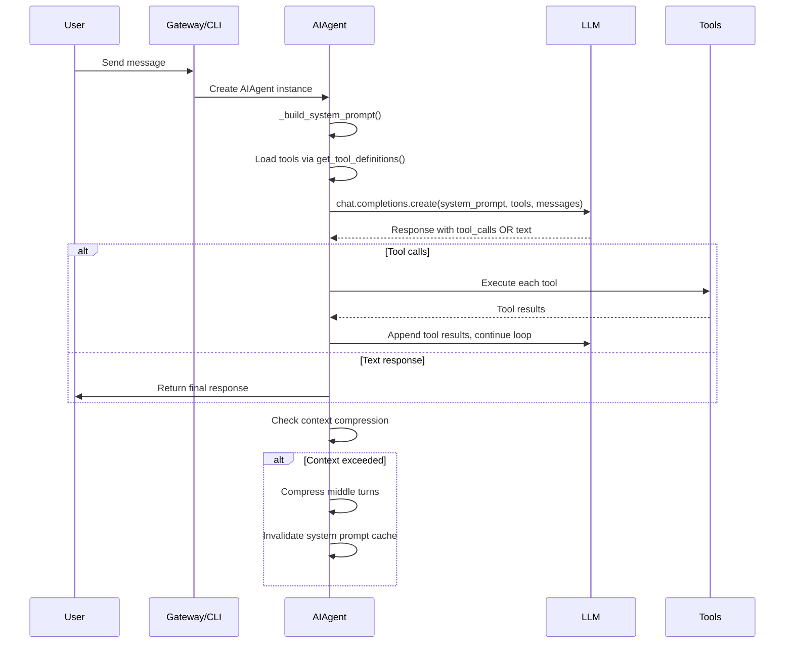
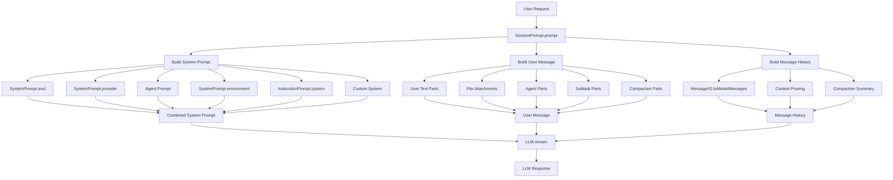
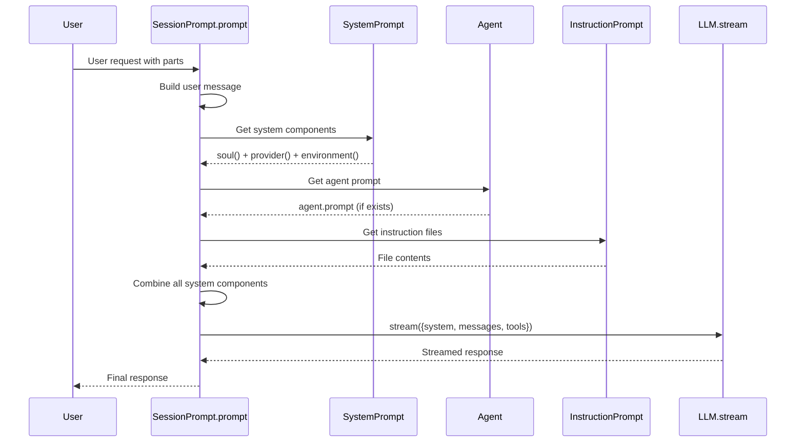
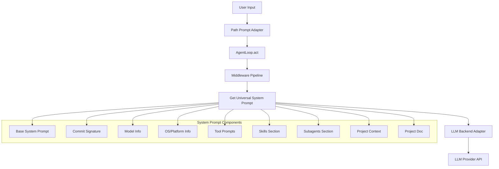
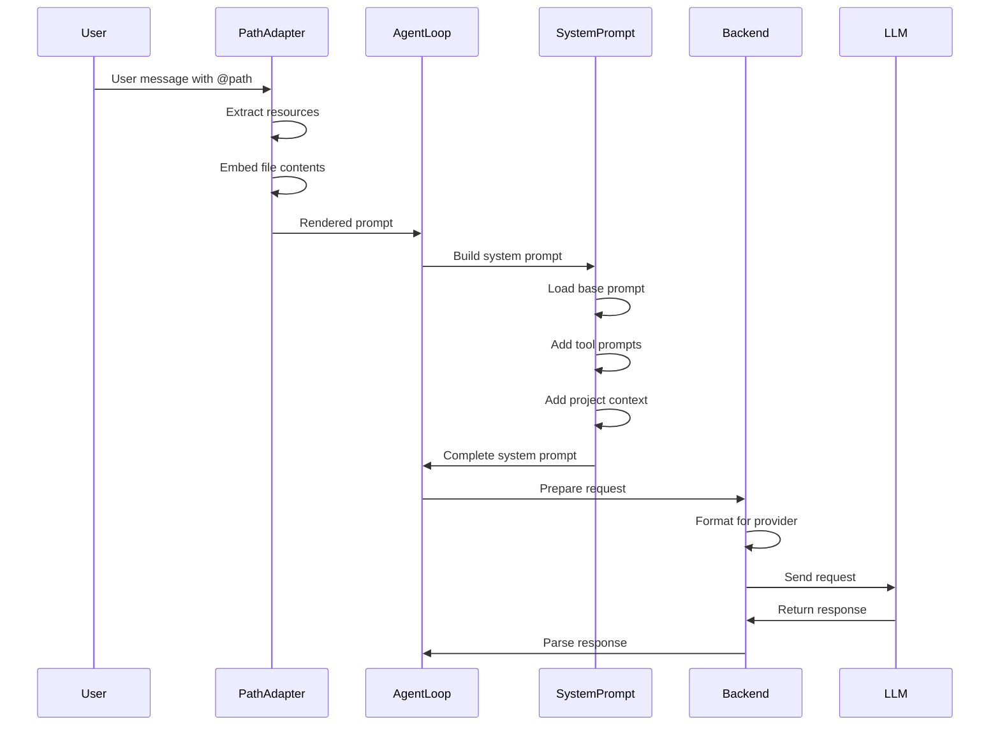

# Codex LLM Prompt Components Summary

This document provides a comprehensive analysis of the prompt components used in the Codex CLI system, including their origins, functions, and how they are injected into LLM requests.

## Overview

The Codex CLI system uses a multi-layered prompt injection architecture that combines:
1. **Base instructions** - Core system behavior and capabilities
2. **Developer instructions** - Configuration-specific guidance (sandbox, approvals, etc.)
3. **User instructions** - Project-specific context (AGENTS.md, skills, plugins)
4. **Contextual fragments** - Dynamic context updates (environment, subagents, etc.)

These components are assembled by the [`build_initial_context()`](codex-rs/core/src/codex.rs:3167) function and injected as separate messages in the LLM conversation history.

---

## Prompt Component Categories

### 1. Base Instructions

**Location:** [`codex-rs/protocol/src/prompts/base_instructions/default.md`](codex-rs/protocol/src/prompts/base_instructions/default.md)

**Function:** Provides the foundational system prompt that defines the agent's core capabilities, behavior, and working methodology.

**Key Content:**
- Agent identity and capabilities (coding agent in Codex CLI)
- Personality guidelines (concise, direct, friendly)
- AGENTS.md specification handling
- Responsiveness guidelines (preamble messages, planning)
- Task execution criteria
- Validation and testing philosophy
- Ambition vs. precision balance
- Progress update and final message formatting

**Injection Point:** This is the base prompt that is baked into the model configuration and forms the foundation of all prompts.

---

### 2. Developer Instructions

**Location:** [`codex-rs/protocol/src/models.rs`](codex-rs/protocol/src/models.rs:394)

**Function:** Configuration-specific instructions that adapt the agent's behavior based on sandbox settings, approval policies, and feature flags.

#### 2.1 Permissions Instructions

Built by [`DeveloperInstructions::from_policy()`](codex-rs/protocol/src/models.rs:517) and assembled in [`build_initial_context()`](codex-rs/core/src/codex.rs:3191).

**Components:**

| Component | Origin File | Function |
|-----------|-------------|----------|
| Sandbox Mode | [`workspace_write.md`](codex-rs/protocol/src/prompts/permissions/sandbox_mode/workspace_write.md), [`read_only.md`](codex-rs/protocol/src/prompts/permissions/sandbox_mode/read_only.md), [`danger_full_access.md`](codex-rs/protocol/src/prompts/permissions/sandbox_mode/danger_full_access.md) | Defines filesystem access boundaries |
| Approval Policy | [`never.md`](codex-rs/protocol/src/prompts/permissions/approval_policy/never.md), [`unless_trusted.md`](codex-rs/protocol/src/prompts/permissions/approval_policy/unless_trusted.md), [`on_failure.md`](codex-rs/protocol/src/prompts/permissions/approval_policy/on_failure.md), [`on_request_rule.md`](codex-rs/protocol/src/prompts/permissions/approval_policy/on_request_rule.md) | Defines when user approval is required |
| Guardian Feature | [`guardian.md`](codex-rs/protocol/src/prompts/permissions/approval_policy/guardian.md) | Enables subagent review for approval requests |

**Example Output:**
```
<permissions instructions>
Filesystem sandboxing defines which files can be read or written. `sandbox_mode` is `workspace-write`: The sandbox permits reading files, and editing files in `cwd` and `writable_roots`. Editing files in other directories requires approval. Network access is restricted.

# Escalation Requests
Commands are run outside the sandbox if they are approved by the user...
</permissions instructions>
```

#### 2.2 Collaboration Mode Instructions

**Function:** Provides mode-specific instructions for collaboration features.

**Location:** [`DeveloperInstructions::from_collaboration_mode()`](codex-rs/protocol/src/models.rs:553)

#### 2.3 Model Switch Instructions

**Function:** Instructs the agent when switching between different models.

**Location:** [`DeveloperInstructions::model_switch_message()`](codex-rs/protocol/src/models.rs:490)

#### 2.4 Realtime Conversation Instructions

**Function:** Manages realtime audio conversation state.

**Location:** [`DeveloperInstructions::realtime_start_message()`](codex-rs/protocol/src/models.rs:496), [`realtime_end_message()`](codex-rs/protocol/src/models.rs:503)

#### 2.5 Personality Instructions

**Function:** Communicates personality specification changes.

**Location:** [`DeveloperInstructions::personality_spec_message()`](codex-rs/protocol/src/models.rs:510)

#### 2.6 Memory Tool Instructions

**Function:** Provides instructions for the memory tool feature.

**Location:** [`build_memory_tool_developer_instructions()`](codex-rs/core/src/memories/prompts.rs:158)

#### 2.7 Apps Feature Instructions

**Function:** Provides instructions for the apps feature.

**Location:** [`render_apps_section()`](codex-rs/core/src/apps.rs)

#### 2.8 Git Commit Instructions

**Function:** Provides instructions for git commit attribution.

**Location:** [`commit_message_trailer_instruction()`](codex-rs/core/src/codex.rs)

---

### 3. User Instructions (Project Documentation)

**Location:** [`codex-rs/core/src/project_doc.rs`](codex-rs/core/src/project_doc.rs)

**Function:** Injects project-specific documentation and configuration into the prompt.

#### 3.1 AGENTS.md Instructions

**Function:** Loads and injects AGENTS.md files from the project hierarchy.

**Key Functions:**
- [`get_user_instructions()`](codex-rs/core/src/project_doc.rs:81) - Main entry point
- [`read_project_docs()`](codex-rs/core/src/project_doc.rs:149) - Discovers and reads AGENTS.md files
- [`discover_project_doc_paths()`](codex-rs/core/src/project_doc.rs) - Finds AGENTS.md files hierarchically

**Format:** Wrapped in [`AGENTS_MD_FRAGMENT`](codex-rs/core/src/contextual_user_message.rs:66):
```
# AGENTS.md instructions for /path/to/dir

<INSTRUCTIONS>
[content]
</INSTRUCTIONS>
```

#### 3.2 Skill Instructions

**Function:** Injects skill definitions from the `skills/` directory.

**Location:** [`render_skills_section()`](codex-rs/core/src/skills.rs)

**Format:** Wrapped in [`SKILL_FRAGMENT`](codex-rs/core/src/contextual_user_message.rs:73):
```
<skill>
<name>skill-name</name>
<path>skills/path/SKILL.md</path>
[content]
</skill>
```

#### 3.3 Plugin Instructions

**Function:** Injects plugin capabilities and instructions.

**Location:** [`render_plugins_section()`](codex-rs/core/src/plugins.rs)

#### 3.4 JavaScript REPL Instructions

**Function:** Provides instructions for the JavaScript REPL feature.

**Location:** [`render_js_repl_instructions()`](codex-rs/core/src/project_doc.rs:47)

#### 3.5 Hierarchical Agents Message

**Function:** Provides instructions for child agents feature.

**Location:** [`HIERARCHICAL_AGENTS_MESSAGE`](codex-rs/core/src/project_doc.rs:35)

---

### 4. Contextual User Fragments

**Location:** [`codex-rs/core/src/contextual_user_message.rs`](codex-rs/core/src/contextual_user_message.rs)

**Function:** Dynamic context updates that are injected as user messages.

#### 4.1 Environment Context

**Location:** [`codex-rs/core/src/environment_context.rs`](codex-rs/core/src/environment_context.rs)

**Function:** Provides runtime environment information.

**Components:**
- Current working directory (cwd)
- Shell configuration
- Current date and timezone
- Network context (allowed/denied domains)
- Subagent configuration

**Format:** Wrapped in [`ENVIRONMENT_CONTEXT_FRAGMENT`](codex-rs/core/src/contextual_user_message.rs:68):
```xml
<environment_context>
<cwd>/path/to/project</cwd>
<shell>bash</shell>
<current_date>2026-03-08</current_date>
<timezone>UTC</timezone>
<network>
  <allowed_domains></allowed_domains>
  <denied_domains></denied_domains>
</network>
</environment_context>
```

#### 4.2 User Shell Command

**Function:** Indicates when a shell command was used.

**Location:** [`USER_SHELL_COMMAND_FRAGMENT`](codex-rs/core/src/contextual_user_message.rs:75)

#### 4.3 Turn Aborted Notification

**Function:** Indicates when a turn was aborted.

**Location:** [`TURN_ABORTED_FRAGMENT`](codex-rs/core/src/contextual_user_message.rs:80)

#### 4.4 Subagent Notification

**Function:** Communicates between parent and child agents.

**Location:** [`SUBAGENT_NOTIFICATION_FRAGMENT`](codex-rs/core/src/contextual_user_message.rs:82)

---

### 5. Memory System Prompts

**Location:** [`codex-rs/core/src/memories/prompts.rs`](codex-rs/core/src/memories/prompts.rs)

#### 5.1 Memory Tool Developer Instructions

**Function:** Provides instructions for the memory tool feature.

**Template:** [`read_path.md`](codex-rs/core/src/memories/read_path.md)

#### 5.2 Consolidation Prompt

**Function:** Used for memory consolidation subagent.

**Template:** [`consolidation.md`](codex-rs/core/src/memories/consolidation.md)

#### 5.3 Stage One Input

**Function:** Used for memory extraction phase 1.

**Template:** [`stage_one_input.md`](codex-rs/core/src/memories/stage_one_input.md)

---

### 6. Guardian Subagent Prompt

**Location:** [`codex-rs/core/src/guardian.rs`](codex-rs/core/src/guardian.rs)

**Function:** A separate subagent that reviews approval requests.

**Key Functions:**
- [`build_guardian_prompt_items()`](codex-rs/core/src/guardian.rs:256) - Builds the prompt for guardian review
- [`guardian_policy_prompt()`](codex-rs/core/src/guardian.rs:821) - Policy instructions
- [`guardian_output_contract_prompt()`](codex-rs/core/src/guardian.rs:806) - Output format requirements

**Components:**
1. Transcript of the conversation
2. Planned action JSON
3. Guardian policy instructions
4. Output contract (JSON schema)

---

## Prompt Assembly Flow

### Main Assembly Function

**Location:** [`Session::build_initial_context()`](codex-rs/core/src/codex.rs:3167)

**Flow:**
```
1. Collect developer_sections:
   - Model switch message (if applicable)
   - Permissions instructions (sandbox + approval policy)
   - Custom developer_instructions (from config)
   - Memory tool instructions (if enabled)
   - Collaboration mode instructions
   - Realtime conversation instructions
   - Personality instructions
   - Apps feature instructions
   - Git commit instructions

2. Collect contextual_user_sections:
   - User instructions (AGENTS.md, skills, plugins)
   - Environment context (cwd, shell, network, subagents)

3. Build ResponseItems:
   - Developer message (from developer_sections)
   - User message (from contextual_user_sections)

4. Return items to be prepended to conversation history
```

### Steady-State Updates

**Location:** [`Session::build_settings_update_items()`](codex-rs/core/src/codex.rs:3337)

**Function:** On subsequent turns, only emits changes to minimize token usage.

**Components:**
- Model instructions update
- Permissions update
- Collaboration mode update
- Realtime update
- Personality update

---

## Prompt Injection Points

### 1. Initial Context Injection

**Location:** [`codex-rs/core/src/codex.rs:1856`](codex-rs/core/src/codex.rs:1856), [`codex-rs/core/src/codex.rs:1968`](codex-rs/core/src/codex.rs:1968)

**When:** First turn of a session or after compaction

**Effect:** Full context is injected as developer + user messages

### 2. Context Diff Injection

**Location:** [`codex-rs/core/src/codex.rs:3337`](codex-rs/core/src/codex.rs:3337)

**When:** Subsequent turns after initial context established

**Effect:** Only changed settings are injected

### 3. Guardian Subagent

**Location:** [`codex-rs/core/src/guardian.rs:177`](codex-rs/core/src/guardian.rs:177)

**When:** Guardian approval feature is enabled and approval request needs review

**Effect:** Separate subagent invocation with transcript + action review

### 4. Memory System

**Location:** [`codex-rs/core/src/memories/phase1.rs:106`](codex-rs/core/src/memories/phase1.rs:106), [`codex-rs/core/src/memories/phase2.rs:315`](codex-rs/core/src/memories/phase2.rs:315)

**When:** Memory feature is enabled

**Effect:** Memory tool instructions injected into developer message

---

## Prompt Component Diagram

```mermaid
graph TD
    A[LLM Request] --> B[Base Instructions]
    A --> C[Developer Instructions]
    A --> D[User Instructions]
    A --> E[Contextual Fragments]
    
    C --> C1[Permissions]
    C --> C2[Collaboration Mode]
    C --> C3[Model Switch]
    C --> C4[Realtime]
    C --> C5[Personality]
    C --> C6[Memory Tool]
    C --> C7[Apps Feature]
    C --> C8[Git Commit]
    
    D --> D1[AGENTS.md]
    D --> D2[Skills]
    D --> D3[Plugins]
    D --> D4[JS REPL]
    D --> D5[Hierarchical Agents]
    
    E --> E1[Environment Context]
    E --> E2[User Shell Command]
    E --> E3[Turn Aborted]
    E --> E4[Subagent Notification]
    
    F[Guardian Subagent] --> F1[Transcript]
    F --> F2[Planned Action]
    F --> F3[Policy]
    F --> F4[Output Contract]
```



---

## Key Functions Summary

| Function | File | Purpose |
|----------|------|---------|
| [`build_initial_context()`](codex-rs/core/src/codex.rs:3167) | codex.rs | Main prompt assembly for initial context |
| [`build_settings_update_items()`](codex-rs/core/src/codex.rs:3337) | codex.rs | Steady-state context diff injection |
| [`get_user_instructions()`](codex-rs/core/src/project_doc.rs:81) | project_doc.rs | Load project documentation |
| [`build_guardian_prompt_items()`](codex-rs/core/src/guardian.rs:256) | guardian.rs | Build guardian subagent prompt |
| [`build_memory_tool_developer_instructions()`](codex-rs/core/src/memories/prompts.rs:158) | memories/prompts.rs | Memory tool instructions |
| [`DeveloperInstructions::from_policy()`](codex-rs/protocol/src/models.rs:517) | models.rs | Build permissions instructions |
| [`build_contextual_user_message()`](codex-rs/core/src/context_manager/updates.rs:154) | context_manager/updates.rs | Build contextual user message |
| [`build_developer_update_item()`](codex-rs/core/src/context_manager/updates.rs:150) | context_manager/updates.rs | Build developer update item |

---

## Configuration Integration

### Config Parameters

| Parameter | Type | Effect |
|-----------|------|--------|
| `developer_instructions` | Option<String> | Custom developer instructions override |
| `user_instructions` | Option<String> | System-level user instructions |
| `base_instructions` | Option<String> | Override base instructions |
| `compact_prompt` | Option<String> | Custom compaction prompt |
| `personality` | Option<Personality> | Personality specification |
| `collaboration_mode` | CollaborationMode | Collaboration mode settings |

### Feature Flags

| Feature | Effect |
|---------|--------|
| `MemoryTool` | Enables memory tool instructions |
| `GuardianApproval` | Enables guardian subagent for approvals |
| `RequestPermissions` | Enables request permission feature |
| `Apps` | Enables apps feature instructions |
| `CodexGitCommit` | Enables git commit attribution |
| `JsRepl` | Enables JavaScript REPL instructions |
| `ChildAgentsMd` | Enables hierarchical agents message |

---

## Security Considerations

1. **Prompt Injection Protection:** Contextual user fragments are detected and handled specially to prevent injection attacks.

2. **Guardian Subagent:** Provides an additional layer of review for approval requests, especially for sandbox escapes and blocked network access.

3. **Token Budgets:** Project documentation has size limits (`project_doc_max_bytes`) to prevent prompt injection via oversized files.

4. **Sandboxing:** The filesystem sandboxing instructions clearly define boundaries and require approval for operations outside allowed paths.

---

## References

- [Base Instructions](codex-rs/protocol/src/prompts/base_instructions/default.md)
- [Developer Instructions API](codex-rs/protocol/src/models.rs:394)
- [Guardian Subagent](codex-rs/core/src/guardian.rs)
- [Memory System](codex-rs/core/src/memories/)
- [Contextual User Messages](codex-rs/core/src/contextual_user_message.rs)

# Hermes Agent Prompt System Analysis

## Overview

The Hermes Agent uses a multi-layered prompt injection system that assembles the system prompt from multiple components. Prompts are built in two main contexts: **CLI/standalone agent** (`run_agent.py`) and **messaging gateway** (`gateway/run.py`).

---

## Core Prompt Building Functions

### 1. [`_build_system_prompt()`](run_agent.py:1355)

**Location:** `run_agent.py:1355-1420`

**Purpose:** Assembles the complete system prompt from all layers. Called once per session and cached for efficiency.

**Layers (in order of injection):**

| Layer | Function | Origin | Description |
|-------|----------|--------|-------------|
| 1 | `DEFAULT_AGENT_IDENTITY` | [`agent/prompt_builder.py:63-71`](agent/prompt_builder.py:63) | Core agent identity: "You are Hermes Agent, an intelligent AI assistant created by Nous Research..." |
| 2 | Tool-aware guidance | [`agent/prompt_builder.py:73-89`](agent/prompt_builder.py:73) | Conditional: MEMORY_GUIDANCE, SESSION_SEARCH_GUIDANCE, SKILLS_GUIDANCE (only if corresponding tools are loaded) |
| 3 | User system prompt | Config/env | Optional user-provided system prompt (via `system_message` param) |
| 4 | Memory store | [`tools/memory_tool.py`](tools/memory_tool.py) | MEMORY.md and USER.md content (if enabled) |
| 5 | Skills index | [`build_skills_system_prompt()`](agent/prompt_builder.py:173) | Scans `~/.hermes/skills/` for SKILL.md files, builds compact index with descriptions |
| 6 | Context files | [`build_context_files_prompt()`](agent/prompt_builder.py:269) | Discovers and loads SOUL.md, AGENTS.md, .cursorrules from cwd and ~/.hermes/ |
| 7 | Timestamp | [`hermes_time.now()`](hermes_time.py) | Current date/time frozen at build time |
| 8 | Platform hints | [`PLATFORM_HINTS`](agent/prompt_builder.py:91) | Platform-specific formatting (cli, telegram, discord, whatsapp, slack) |

**Caching behavior:**
- Cached on `self._cached_system_prompt`
- Only rebuilt after context compression events
- Maximizes prefix cache hits for cost efficiency

---

### 2. [`build_skills_system_prompt()`](agent/prompt_builder.py:173)

**Location:** `agent/prompt_builder.py:173-250`

**Purpose:** Builds a compact skill index for the system prompt.

**Process:**
1. Scans `~/.hermes/skills/` for SKILL.md files
2. Filters out platform-incompatible skills (via `platforms` frontmatter field)
3. Groups skills by category
4. Reads category descriptions from DESCRIPTION.md files
5. Extracts per-skill descriptions from frontmatter
6. Returns formatted index with `<available_skills>` tags

**Output format:**
```markdown
## Skills (mandatory)
Before responding, scan the skills below. If one clearly matches your task,
load it with skill_view(name) and follow its instructions.

<available_skills>
  category: category description
    - skill-name: skill description
    - another-skill: another description
  ...
</available_skills>
```

---

### 3. [`build_context_files_prompt()`](agent/prompt_builder.py:269)

**Location:** `agent/prompt_builder.py:269-369`

**Purpose:** Discovers and loads project context files.

**Discovery order:**
1. **AGENTS.md** (recursive, hierarchical)
   - Searches cwd recursively for AGENTS.md files
   - Sorts by path depth (shallowest first)
   - Merges all found files

2. **.cursorrules** and **.cursor/rules/*.mdc**
   - Reads `.cursorrules` file
   - Reads all `.mdc` files in `.cursor/rules/` directory

3. **SOUL.md** (persona file)
   - Searches cwd first, then `~/.hermes/SOUL.md` fallback
   - Injected with special handling: "embody its persona and tone"

**Security scanning:**
- [`_scan_context_content()`](agent/prompt_builder.py:39) checks for prompt injection patterns
- Blocks invisible unicode characters
- Detects patterns like `ignore previous instructions`, `system prompt override`, etc.

**Truncation:**
- Max 20,000 chars per file
- Head/tail truncation with 70%/20% split and marker

---

## Prompt Injection Points

### AIAgent Constructor Parameters

**Location:** [`run_agent.py:150-227`](run_agent.py:150)

| Parameter | Purpose | Injection Point |
|-----------|---------|-----------------|
| `ephemeral_system_prompt` | User system prompt (not saved to trajectories) | Layer 2 in `_build_system_prompt()` |
| `prefill_messages` | Few-shot examples to prepend | Passed to API as initial messages |
| `platform` | Platform hint (cli, telegram, discord, etc.) | Layer 8 in `_build_system_prompt()` |
| `skip_context_files` | Skip SOUL.md/AGENTS.md injection | Bypasses Layer 6 |
| `skip_memory` | Skip memory store loading | Bypasses Layer 4 |

---

### Gateway-Specific Injection

**Location:** [`gateway/run.py:2292-2295`](gateway/run.py:2292)

**Context prompt:**
```python
combined_ephemeral = context_prompt or ""
if self._ephemeral_system_prompt:
    combined_ephemeral = (combined_ephemeral + "\n\n" + self._ephemeral_system_prompt).strip()
```

**Sources:**
1. **`context_prompt`**: Platform-specific context (e.g., "You are on WhatsApp...")
2. **`_ephemeral_system_prompt`**: Loaded from:
   - `HERMES_EPHEMERAL_SYSTEM_PROMPT` env var (highest priority)
   - `agent.system_prompt` in `~/.hermes/config.yaml`

---

## Prompt Caching Strategy

**Location:** [`agent/prompt_caching.py`](agent/prompt_caching.py)

**Function:** [`apply_anthropic_cache_control()`](agent/prompt_caching.py:38)

**Strategy:** `system_and_3` (Anthropic max: 4 breakpoints)
1. System prompt (stable across all turns)
2-4. Last 3 non-system messages (rolling window)

**Effect:** Reduces input token costs by ~75% on multi-turn conversations.

**Auto-enabled for:**
- OpenRouter base URL
- Claude models

---

## Context Compression

**Location:** [`agent/context_compressor.py`](agent/context_compressor.py)

**Class:** `ContextCompressor`

**Trigger:** When prompt tokens exceed 85% of context limit (configurable)

**Algorithm:**
1. Protect first N turns (default: 3)
2. Protect last N turns (default: 4)
3. Summarize middle turns using Gemini Flash (cheap/fast)
4. Sanitize orphaned tool_call/tool_result pairs

**Summary prompt:**
```
Summarize these conversation turns concisely. This summary will replace 
these turns in the conversation history.

Write from a neutral perspective describing:
1. What actions were taken (tool calls, searches, file operations)
2. Key information or results obtained
3. Important decisions or findings
4. Relevant data, file names, or outputs

Keep factual and informative. Target ~2500 tokens.

---
TURNS TO SUMMARIZE:
{conversation_turns}
---

Write only the summary, starting with "[CONTEXT SUMMARY]:" prefix.
```

---

## Prompt Injection Security

**Location:** [`agent/prompt_builder.py:20-57`](agent/prompt_builder.py:20)

**Threat patterns detected:**
- `ignore\s+(previous|all|above|prior)\s+instructions`
- `do\s+not\s+tell\s+the\s+user`
- `system\s+prompt\s+override`
- `disregard\s+(your|all|any)\s+(instructions|rules|guidelines)`
- `act\s+as\s+(if|though)\s+you\s+(have\s+no|don\'t\s+have)\s+(restrictions|limits|rules)`
- HTML comment injection: `<!--[^>]*(?:ignore|override|system|secret|hidden)[^>]*-->`
- Hidden div injection: `<\s*div\s+style\s*=\s*["\'].*display\s*:\s*none`
- Translate-execute attacks
- Credential exfiltration via curl/cat

**Invisible unicode characters blocked:**
- U+200B (zero-width space)
- U+200C (zero-width non-joiner)
- U+200D (zero-width joiner)
- U+2060 (word joiner)
- U+FEFF (BOM)
- U+202A-U+202E (directional overrides)

---

## Tool Schema Injection

**Location:** [`model_tools.py:164-250`](model_tools.py:164)

**Function:** [`get_tool_definitions()`](model_tools.py:164)

**Purpose:** Provides tool schemas to the LLM via `tools` parameter in API call.

**Toolset filtering:**
- `enabled_toolsets`: Only include tools from specified toolsets
- `disabled_toolsets`: Exclude tools from specified toolsets
- Dynamic `execute_code` schema: Only lists sandbox tools that are actually enabled

**Dynamic schema example:**
```python
if "execute_code" in tools_to_include:
    from tools.code_execution_tool import SANDBOX_ALLOWED_TOOLS, build_execute_code_schema
    sandbox_enabled = SANDBOX_ALLOWED_TOOLS & tools_to_include
    dynamic_schema = build_execute_code_schema(sandbox_enabled)
```

---

## Conversation Flow



---

## Configuration Files

| File | Purpose | Prompt-related settings |
|------|---------|------------------------|
| `~/.hermes/config.yaml` | Main configuration | `agent.system_prompt`, `agent.reasoning_effort`, `compression.*` |
| `~/.hermes/.env` | API keys and secrets | `HERMES_EPHEMERAL_SYSTEM_PROMPT`, `HERMES_MAX_ITERATIONS` |
| `~/.hermes/SOUL.md` | Persona file | Defines agent persona and tone |
| `AGENTS.md` (project) | Project context | Project-specific instructions |
| `.cursorrules` | Cursor IDE rules | IDE-specific agent behavior |

---

## Key Design Principles

1. **Layered injection**: Each layer serves a distinct purpose (identity, tools, skills, context, platform)
2. **Caching**: System prompt cached per session for efficiency
3. **Security**: Context files scanned for prompt injection before injection
4. **Platform awareness**: Platform-specific formatting hints injected based on `platform` parameter
5. **Tool awareness**: Behavioral guidance only injected when corresponding tools are loaded
6. **Ephemeral vs persistent**: User system prompts can be ephemeral (not saved to trajectories) for batch processing

---

## Summary Table

| Component | Function | File | Called By |
|-----------|----------|------|-----------|
| Agent identity | Core persona | [`DEFAULT_AGENT_IDENTITY`](agent/prompt_builder.py:63) | `_build_system_prompt()` |
| Skills index | Skill discovery | [`build_skills_system_prompt()`](agent/prompt_builder.py:173) | `_build_system_prompt()` |
| Context files | Project context | [`build_context_files_prompt()`](agent/prompt_builder.py:269) | `_build_system_prompt()` |
| Tool schemas | Tool definitions | [`get_tool_definitions()`](model_tools.py:164) | AIAgent.__init__() |
| Prompt caching | Cost optimization | [`apply_anthropic_cache_control()`](agent/prompt_caching.py:38) | AIAgent.chat() |
| Context compression | Context management | [`ContextCompressor.compress()`](agent/context_compressor.py:301) | AIAgent._run_agent_loop() |
| Security scanning | Injection prevention | [`_scan_context_content()`](agent/prompt_builder.py:39) | `build_context_files_prompt()` |

# LLM Prompt System Analysis

## Overview

This document provides a comprehensive analysis of the prompt components, their origins, and their functions within the Kilo Code system. The prompt system is modular and layered, with different components serving distinct purposes in constructing the final system prompt sent to the LLM.

## Architecture



## Kilocode Prompt Components

### 1. SystemPrompt.soul (`packages/opencode/src/kilocode/soul.txt`)

**Origin:** Kilo Code-specific identity definition

**Function:** Defines the core personality and behavioral constraints of the AI agent.

**Content:**
- Identity: "You are Kilo, a highly skilled software engineer"
- Personality traits:
  - Goal-oriented (accomplish tasks, not converse)
  - Methodical (iterative approach)
  - Efficient (don't ask for more info than necessary)
  - Direct (no conversational openers like "Great", "Certainly")
  - Final (no questions at end of responses)
- Code standards: Consider context, follow project conventions

**Injection Point:** [`packages/opencode/src/session/llm.ts:78`](packages/opencode/src/session/llm.ts:78) - Always included except for Codex sessions

---

### 2. SystemPrompt.provider (`packages/opencode/src/session/system.ts:30`)

**Origin:** Provider-specific prompt templates

**Function:** Adapts the system prompt based on the target LLM provider/model characteristics.

**Templates:**

| Template | File | Provider Models |
|----------|------|-----------------|
| `anthropic` | [`anthropic.txt`](packages/opencode/src/session/prompt/anthropic.txt) | Claude models |
| `anthropic_without_todo` | [`qwen.txt`](packages/opencode/src/session/prompt/qwen.txt) | Default fallback |
| `beast` | [`beast.txt`](packages/opencode/src/session/prompt/beast.txt) | GPT-3.5, GPT-4, o1, o3 |
| `codex` | [`codex_header.txt`](packages/opencode/src/session/prompt/codex_header.txt) | GPT-5, Codex sessions |
| `gemini` | [`gemini.txt`](packages/opencode/src/session/prompt/gemini.txt) | Gemini models |
| `trinity` | [`trinity.txt`](packages/opencode/src/session/prompt/trinity.txt) | Trinity models |

**Selection Logic:**
```typescript
// packages/opencode/src/session/system.ts:30-56
if (model.api.id.includes("gpt-5")) return [PROMPT_CODEX]
if (model.api.id.includes("gpt-") || model.api.id.includes("o1") || model.api.id.includes("o3"))
  return [PROMPT_BEAST]
if (model.api.id.includes("gemini-")) return [PROMPT_GEMINI]
if (model.api.id.includes("claude")) return [PROMPT_ANTHROPIC]
if (model.api.id.toLowerCase().includes("trinity")) return [PROMPT_TRINITY]
return [PROMPT_ANTHROPIC_WITHOUT_TODO]
```

**Key Template Contents:**

#### [`beast.txt`](packages/opencode/src/session/prompt/beast.txt) (Default for GPT models)
- Core identity: "You are Kilo, the best coding agent on the planet"
- Tool usage guidelines
- Git/workspace hygiene rules
- Frontend design principles
- Response formatting guidelines
- File reference conventions

#### [`codex_header.txt`](packages/opencode/src/session/prompt/codex_header.txt) (GPT-5/Codex)
- Extended version of beast with:
  - Detailed editing constraints (ASCII preference, comment usage)
  - Comprehensive tool usage hierarchy
  - Frontend design specifics (typography, color, motion, background)
  - Final answer structure and style guidelines
  - File reference format specifications

#### [`anthropic.txt`](packages/opencode/src/session/prompt/anthropic.txt)
- Anthropic-specific formatting
- Todo list handling
- Tool call patterns

#### [`gemini.txt`](packages/opencode/src/session/prompt/gemini.txt)
- Gemini-specific instructions
- Context window optimization

---

### 3. Agent Prompt (`packages/opencode/src/agent/agent.ts`)

**Origin:** Per-agent configuration files

**Function:** Provides agent-specific instructions and constraints.

**Location:** Agent files in `packages/opencode/src/agent/` directory

**Format:** YAML frontmatter with `prompt` field:
```yaml
---
identifier: agent-name
name: Agent Name
prompt: |
  Your custom agent instructions here...
---
```

**Injection Point:** [`packages/opencode/src/session/llm.ts:82`](packages/opencode/src/session/llm.ts:82)
```typescript
...(input.agent.prompt ? [input.agent.prompt] : isCodex ? [] : SystemPrompt.provider(input.model))
```

**Example Agents:**
- `plan` - Planning mode agent
- `code` - Code execution agent
- `compaction` - Context compaction agent

---

### 4. SystemPrompt.environment (`packages/opencode/src/session/system.ts:59`)

**Origin:** Runtime environment detection

**Function:** Provides contextual information about the current execution environment.

**Content:**
```
You are powered by the model named ${model.api.id}. The exact model ID is ${model.providerID}/${model.api.id}
Here is some useful information about the environment you are running in:
<env>
  Working directory: ${Instance.directory}
  Is directory a git repo: ${project.vcs === "git" ? "yes" : "no"}
  Platform: ${process.platform}
  [Editor context lines]
</env>
<directories>
  [Project directory tree]
</directories>
```

**Editor Context Injection:** [`packages/opencode/src/kilocode/editor-context.ts`](packages/opencode/src/kilocode/editor-context.ts)
- User timezone
- Default shell
- Active file
- Visible files
- Open tabs

**Injection Point:** [`packages/opencode/src/session/prompt.ts:697`](packages/opencode/src/session/prompt.ts:697)

---

### 5. InstructionPrompt.system (`packages/opencode/src/session/instruction.ts`)

**Origin:** User-defined instruction files

**Function:** Loads and injects user-provided instructions from configuration files.

**Search Order:**
1. Project-level files (AGENTS.md, CLAUDE.md, CONTEXT.md)
2. Global config files (`~/.opencode/AGENTS.md`)
3. User home directory (`.claude/CLAUDE.md`)
4. Config-specified instruction paths

**File Types:**
- `AGENTS.md` - Project-specific agent instructions
- `CLAUDE.md` - Claude Code compatible instructions
- `CONTEXT.md` - Deprecated, use AGENTS.md
- Custom paths from config

**Injection Point:** [`packages/opencode/src/session/prompt.ts:698`](packages/opencode/src/session/prompt.ts:698)

---

### 6. Custom System Prompts

**Origin:** Direct API calls or plugin modifications

**Function:** Allows explicit system prompt override.

**Sources:**
- `input.system` - Direct system prompt passed to prompt function
- `input.user.system` - System prompt from last user message
- Plugin triggers (`experimental.chat.system.transform`)

**Injection Point:** [`packages/opencode/src/session/llm.ts:84-86`](packages/opencode/src/session/llm.ts:84-86)

---

### 7. Special Mode Prompts

#### Plan Mode (`packages/opencode/src/session/prompt/plan.txt`)
**Function:** Restricts agent to read-only planning phase

**Content:**
- STRICTLY FORBIDDEN: file edits, system changes
- Allowed: observe, analyze, plan
- Must use `plan_exit` tool when complete
- Focus on understanding and asking clarifying questions

#### Max Steps (`packages/opencode/src/session/prompt/max-steps.txt`)
**Function:** Signals maximum step limit reached

**Content:**
- Tools disabled
- Text response only
- Must summarize work done
- Must list remaining tasks
- Must provide recommendations

#### Code Switch (`packages/opencode/src/session/prompt/code-switch.txt`)
**Function:** Transition between plan and code modes

---

### 8. Structured Output Prompt

**Origin:** [`packages/opencode/src/session/prompt.ts:53-61`](packages/opencode/src/session/prompt.ts:53-61)

**Function:** Enforces JSON schema output format

**Content:**
```
IMPORTANT: The user has requested structured output. You MUST use the StructuredOutput tool to provide your final response. Do NOT respond with plain text - you MUST call the StructuredOutput tool with your answer formatted according to the schema.
```

**Injection Point:** [`packages/opencode/src/session/prompt.ts:701-702`](packages/opencode/src/session/prompt.ts:701-702)

---

## Prompt Construction Flow



## Message History Processing

### MessageV2.toModelMessages (`packages/opencode/src/session/message-v2.ts:503`)

**Function:** Converts internal message format to LLM-compatible format.

**Processing:**
1. Iterates through all messages in session
2. Converts user messages:
   - Text parts → `type: "text"`
   - File parts → `type: "file"` (with base64 data)
   - Compaction parts → `type: "text"` with summary
   - Subtask parts → `type: "text"` with tool execution context
3. Converts assistant messages:
   - Text parts → `type: "text"`
   - Step parts → `type: "step-start"`
   - Tool parts → `type: "tool-${toolName}"` with state
   - Reasoning parts → `type: "reasoning"`
4. Injects pending media for providers that don't support media in tool results

**Media Handling:**
- For providers without media support in tool results:
  - Extract images/PDFs from tool results
  - Inject as separate user messages
  - Preserve ordering and context

---

## Plugin Hooks

The system supports plugin modifications at multiple points:

| Hook | Purpose | Location |
|------|---------|----------|
| `experimental.chat.system.transform` | Modify system prompt | [`llm.ts:93`](packages/opencode/src/session/llm.ts:93) |
| `chat.params` | Modify LLM parameters | [`llm.ts:126`](packages/opencode/src/session/llm.ts:126) |
| `chat.headers` | Modify HTTP headers | [`llm.ts:145`](packages/opencode/src/session/llm.ts:145) |
| `experimental.chat.messages.transform` | Modify message history | [`prompt.ts:693`](packages/opencode/src/session/prompt.ts:693) |
| `chat.message` | Modify user message | [`prompt.ts:1355`](packages/opencode/src/session/prompt.ts:1355) |

---

## Kilo Code Specific Additions

### Project ID & Machine ID Headers
**Origin:** [`packages/opencode/src/session/llm.ts:159-163`](packages/opencode/src/session/llm.ts:159-163)

**Function:** Injects Kilo-specific telemetry headers for the Kilo provider.

```typescript
const isKilo = input.model.api.npm === "@kilocode/kilo-gateway"
const kiloProjectId = isKilo ? await getKiloProjectId() : undefined
const machineId = isKilo ? await Identity.getMachineId() : undefined
```

### Plan Follow-up Logic
**Origin:** [`packages/opencode/src/kilocode/plan-followup.ts`](packages/opencode/src/kilocode/plan-followup.ts)

**Function:** Detects when plan_exit tool was called and prompts user for continuation.

---

## Summary Table

| Component | File | Origin | Function |
|-----------|------|--------|----------|
| Soul | `kilocode/soul.txt` | Kilo Code | Core identity & behavior |
| Provider | `session/prompt/*.txt` | Provider-specific | Model adaptation |
| Agent | `agent/*.md` | User-defined | Agent-specific instructions |
| Environment | `session/system.ts` | Runtime | Context injection |
| Instructions | `session/instruction.ts` | User files | Configurable prompts |
| Plan Mode | `session/prompt/plan.txt` | Kilo Code | Read-only planning |
| Max Steps | `session/prompt/max-steps.txt` | Kilo Code | Step limit handling |
| Structured Output | `session/prompt.ts` | Kilo Code | JSON enforcement |

---

## Key Design Principles

1. **Layered Approach:** Multiple prompt components are combined, not replaced
2. **Provider Adaptation:** Different models receive tailored instructions
3. **Agent Specialization:** Per-agent prompts allow specialized behavior
4. **Context Awareness:** Environment and editor context injected dynamically
5. **User Extensibility:** Instruction files allow user customization
6. **Plugin Extensibility:** Multiple hooks for third-party modifications
7. **Mode Awareness:** Special prompts for different operational modes

# Mistral Vibe Prompt System Analysis

## Overview

This document provides a comprehensive summary of the prompt components, their origins, and their functions in the Mistral Vibe system. The system uses a modular approach to building prompts for LLM interaction, with multiple layers of configuration and injection points.

---

## Architecture Overview



---

## 1. System Prompt Components

### 1.1 Base System Prompt (`vibe/core/system_prompt.py:415-466`)

The `get_universal_system_prompt()` function builds the system prompt by combining multiple sections:

| Component | Origin | Function |
|-----------|--------|----------|
| **Base Prompt** | [`VibeConfig.system_prompt`](vibe/core/config.py:432-447) | User-selectable prompt template (cli, explore, tests) |
| **Commit Signature** | [`_add_commit_signature()`](vibe/core/system_prompt.py:361-371) | Instructs agent to use git commit with co-authorship attribution |
| **Model Info** | [`config.include_model_info`](vibe/core/config.py:326) | Injects active model name into prompt |
| **OS System Prompt** | [`_get_os_system_prompt()`](vibe/core/system_prompt.py:339-346) | Provides platform-specific shell and command compatibility rules |
| **Tool Prompts** | [`tool_class.get_tool_prompt()`](vibe/core/tools/base.py:136-150) | Loads per-tool instruction files from `prompts/*.md` |
| **Skills Section** | [`_get_available_skills_section()`](vibe/core/system_prompt.py:374-399) | Lists available skills for the agent to use |
| **Subagents Section** | [`_get_available_subagents_section()`](vibe/core/system_prompt.py:402-412) | Lists available subagents for delegation |
| **Project Context** | [`ProjectContextProvider`](vibe/core/system_prompt.py:36-313) | Provides directory tree and git status |
| **Project Doc** | [`_load_project_doc()`](vibe/core/system_prompt.py:24-33) | Loads `AGENTS.md` or similar project documentation |

### 1.2 Prompt Template Files

Located in [`vibe/core/prompts/`](vibe/core/prompts/):

| File | Purpose | Key Content |
|------|---------|-------------|
| [`cli.md`](vibe/core/prompts/cli.md:1-126) | Default CLI agent behavior | Phase-based workflow (Orient → Plan → Execute), hard rules, response format |
| [`explore.md`](vibe/core/prompts/explore.md:1-50) | Exploration-focused agent | Code/diagram-first responses, minimal context |
| [`tests.md`](vibe/core/prompts/tests.md:1-1) | Testing agent | Minimal prompt for test-focused tasks |
| [`compact.md`](vibe/core/prompts/compact.md:1-48) | Session summarization | Structure for conversation summaries during auto-compact |
| [`project_context.md`](vibe/core/prompts/project_context.md:1-8) | Project context template | Directory structure and git status placeholders |
| [`dangerous_directory.md`](vibe/core/prompts/dangerous_directory.md:1-5) | Security warning | Disables context scanning in dangerous directories |

---

## 2. Tool-Specific Prompts

Located in [`vibe/core/tools/builtins/prompts/`](vibe/core/tools/builtins/prompts/):

| Tool | Prompt File | Key Instructions |
|------|-------------|------------------|
| **bash** | [`bash.md`](vibe/core/tools/builtins/prompts/bash.md:1-73) | Use for system checks, not file operations; prefer dedicated tools |
| **read_file** | [`read_file.md`](vibe/core/tools/builtins/prompts/read_file.md:1-18) | Safe large file handling, offset/limit strategy |
| **write_file** | [`write_file.md`](vibe/core/tools/builtins/prompts/write_file.md:1-42) | Safety rules, prefer search_replace for edits |
| **search_replace** | [`search_replace.md`](vibe/core/tools/builtins/prompts/search_replace.md:1-43) | SEARCH/REPLACE block format, exact matching |
| **grep** | [`grep.md`](vibe/core/tools/builtins/prompts/grep.md:1-4) | Fast recursive pattern search |
| **todo** | [`todo.md`](vibe/core/tools/builtins/prompts/todo.md:1-199) | Task list management, status tracking |
| **task** | [`task.md`](vibe/core/tools/builtins/prompts/task.md:1-24) | Subagent delegation for autonomous work |
| **ask_user_question** | [`ask_user_question.md`](vibe/core/tools/builtins/prompts/ask_user_question.md:1-84) | Question structure, when to use |
| **webfetch** | [`webfetch.md`](vibe/core/tools/builtins/prompts/webfetch.md:1-6) | URL content fetching |
| **websearch** | [`websearch.md`](vibe/core/tools/builtins/prompts/websearch.md:1-25) | Web search best practices, citation requirements |

---

## 3. Path Prompt Injection

### 3.1 Path Prompt Adapter (`vibe/core/autocompletion/path_prompt_adapter.py:18-26`)

The [`render_path_prompt()`](vibe/core/autocompletion/path_prompt_adapter.py:18-26) function processes user messages to inject file/directory context:

```python
def render_path_prompt(
    message: str,
    *,
    base_dir: Path,
    max_embed_bytes: int = 256 * 1024,
) -> str:
    payload = build_path_prompt_payload(message, base_dir=base_dir)
    blocks = _path_prompt_to_content_blocks(payload, max_embed_bytes=max_embed_bytes)
    return _content_blocks_to_prompt_text(blocks)
```

### 3.2 Path Anchor Detection (`vibe/core/autocompletion/path_prompt.py:22-47`)

The [`build_path_prompt_payload()`](vibe/core/autocompletion/path_prompt.py:22-47) function identifies `@path` anchors in user messages:

| Component | Function | Behavior |
|-----------|----------|----------|
| **Anchor Detection** | [`_is_path_anchor()`](vibe/core/autocompletion/path_prompt.py:50-55) | Detects `@` prefix not preceded by alphanumeric |
| **Path Extraction** | [`_extract_candidate()`](vibe/core/autocompletion/path_prompt.py:58-76) | Extracts quoted or unquoted path strings |
| **Resource Resolution** | [`_to_resource()`](vibe/core/autocompletion/path_prompt.py:83-97) | Resolves relative paths to absolute, validates existence |
| **Deduplication** | [`_dedupe_resources()`](vibe/core/autocompletion/path_prompt.py:100-108) | Removes duplicate resource references |

### 3.3 Content Block Types

| Type | Description | Injection Behavior |
|------|-------------|-------------------|
| **text** | Plain message text | Passed through unchanged |
| **resource** | Embedded file content | Full file content injected if < 256KB and text |
| **resource_link** | File/directory reference | URI, name, mime_type, size metadata |

---

## 4. Prompt Injection Points

### 4.1 Agent Loop Initialization (`vibe/core/agent_loop.py:179-183`)

```python
system_prompt = get_universal_system_prompt(
    self.tool_manager, self.config, self.skill_manager, self.agent_manager
)
system_message = LLMMessage(role=Role.system, content=system_prompt)
self.messages = MessageList(initial=[system_message], observer=message_observer)
```

### 4.2 ACP Agent Loop (`vibe/acp/acp_agent_loop.py:646-689`)

The ACP (Agent Communication Protocol) agent builds prompts differently:

```python
def _build_text_prompt(self, acp_prompt: list[ContentBlock]) -> str:
    text_prompt = ""
    for block in acp_prompt:
        match block.type:
            case "text":
                text_prompt = f"{text_prompt}{separator}{block.text}"
            case "resource":
                # Embed resource content
            case "resource_link":
                # Inject resource metadata
```

### 4.3 Path Prompt Rendering in ACP (`vibe/acp/acp_agent_loop.py:694`)

```python
rendered_prompt = render_path_prompt(prompt, base_dir=Path.cwd())
```

---

## 5. LLM Backend Adapters

### 5.1 Anthropic Adapter (`vibe/core/llm/backend/anthropic.py:352-360`)

```python
@staticmethod
def _build_system_blocks(system_prompt: str | None) -> list[dict[str, Any]]:
    blocks: list[dict[str, Any]] = []
    if system_prompt:
        blocks.append({
            "type": "text",
            "text": system_prompt,
            "cache_control": {"type": "ephemeral"},
        })
    return blocks
```

**Features:**
- System prompts cached with `ephemeral` cache control
- Supports thinking content (reasoning)
- Tool use blocks with sanitized IDs

### 5.2 Mistral Adapter (`vibe/core/llm/backend/mistral.py:38-83`)

```python
def prepare_message(self, msg: LLMMessage) -> mistralai.Messages:
    match msg.role:
        case Role.system:
            return mistralai.SystemMessage(role="system", content=msg.content or "")
        case Role.user:
            return mistralai.UserMessage(role="user", content=msg.content)
        # ... assistant and tool handling
```

**Features:**
- ThinkChunk for reasoning content
- Tool call integration
- Metadata headers for message tracking

---

## 6. Prompt Configuration Options

### 6.1 VibeConfig Settings (`vibe/core/config.py:323-328`)

| Setting | Default | Effect |
|---------|---------|--------|
| `include_commit_signature` | `True` | Adds git commit co-authorship instructions |
| `include_model_info` | `True` | Injects active model name |
| `include_prompt_detail` | `True` | Includes OS info, tool prompts, skills, subagents |
| `include_project_context` | `True` | Adds directory tree and git status |
| `system_prompt_id` | `"cli"` | Selects base prompt template |

### 6.2 Project Context Config (`vibe/core/system_prompt.py:36-41`)

| Setting | Default | Effect |
|---------|---------|--------|
| `max_depth` | `6` | Maximum directory tree depth |
| `max_files` | `500` | Maximum files to scan |
| `max_chars` | `50000` | Maximum context characters |
| `timeout_seconds` | `10` | Timeout for tree generation |
| `max_doc_bytes` | `10000` | Maximum project doc size |

---

## 7. Prompt Flow Diagram



---

## 8. Key Functions Summary

| Function | File | Purpose |
|----------|------|---------|
| [`get_universal_system_prompt()`](vibe/core/system_prompt.py:415-466) | `system_prompt.py` | Main system prompt builder |
| [`render_path_prompt()`](vibe/core/autocompletion/path_prompt_adapter.py:18-26) | `path_prompt_adapter.py` | Injects file context into messages |
| [`build_path_prompt_payload()`](vibe/core/autocompletion/path_prompt.py:22-47) | `path_prompt.py` | Identifies @path anchors |
| [`get_tool_prompt()`](vibe/core/tools/base.py:136-150) | `base.py` | Loads tool-specific instructions |
| [`_build_text_prompt()`](vibe/acp/acp_agent_loop.py:646-689) | `acp_agent_loop.py` | ACP prompt builder |
| [`prepare_messages()`](vibe/core/llm/backend/anthropic.py:25-45) | `anthropic.py` | Anthropic message formatting |
| [`prepare_message()`](vibe/core/llm/backend/mistral.py:38-83) | `mistral.py` | Mistral message formatting |

---

## 9. Security Considerations

1. **Trusted Folders**: Project context scanning only runs in trusted directories ([`trusted_folders_manager.is_trusted()`](vibe/core/trusted_folders.py))
2. **Dangerous Directory Detection**: [`is_dangerous_directory()`](vibe/core/utils.py) checks for sensitive locations
3. **Gitignore Filtering**: Default patterns exclude sensitive files (`.env`, `node_modules`, etc.)
4. **File Size Limits**: Embedded resources capped at 256KB to prevent context overflow
5. **Binary File Detection**: Non-text files are not embedded, only linked

---

## 10. Extension Points

Developers can extend the prompt system by:

1. **Adding Prompt Templates**: Create new files in `vibe/core/prompts/`
2. **Adding Tool Prompts**: Create `.md` files in `vibe/core/tools/builtins/prompts/`
3. **Custom System Prompt**: Set `system_prompt_id` to a custom `.md` file path
4. **Global Prompts**: Place custom prompts in `~/.vibe/prompts/`
5. **Project Docs**: Add `AGENTS.md` to project root for custom context
