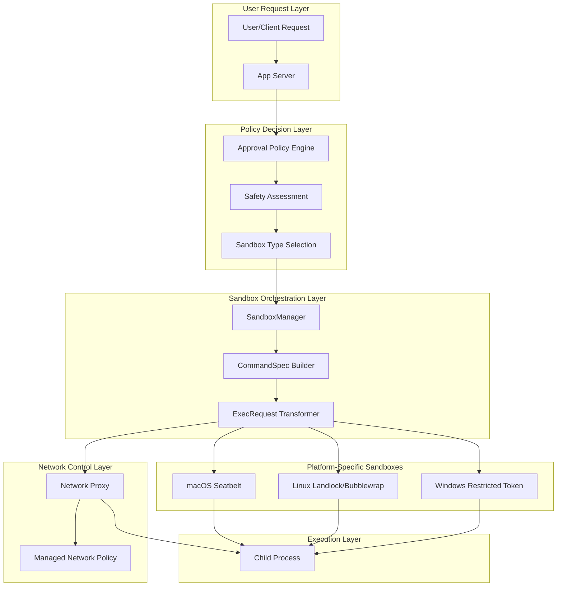
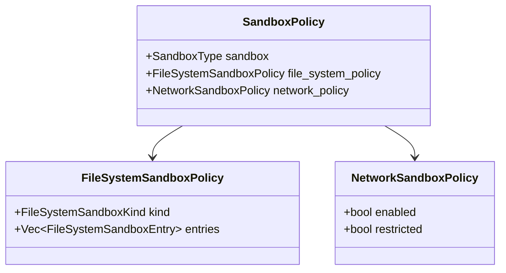
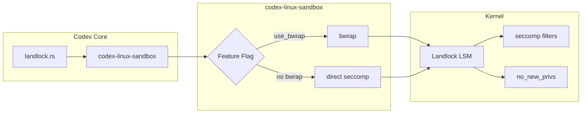
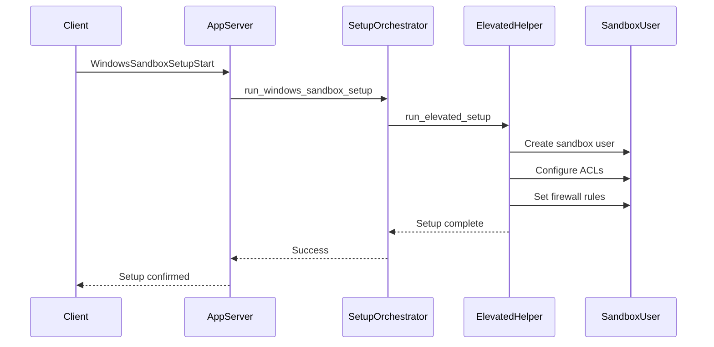
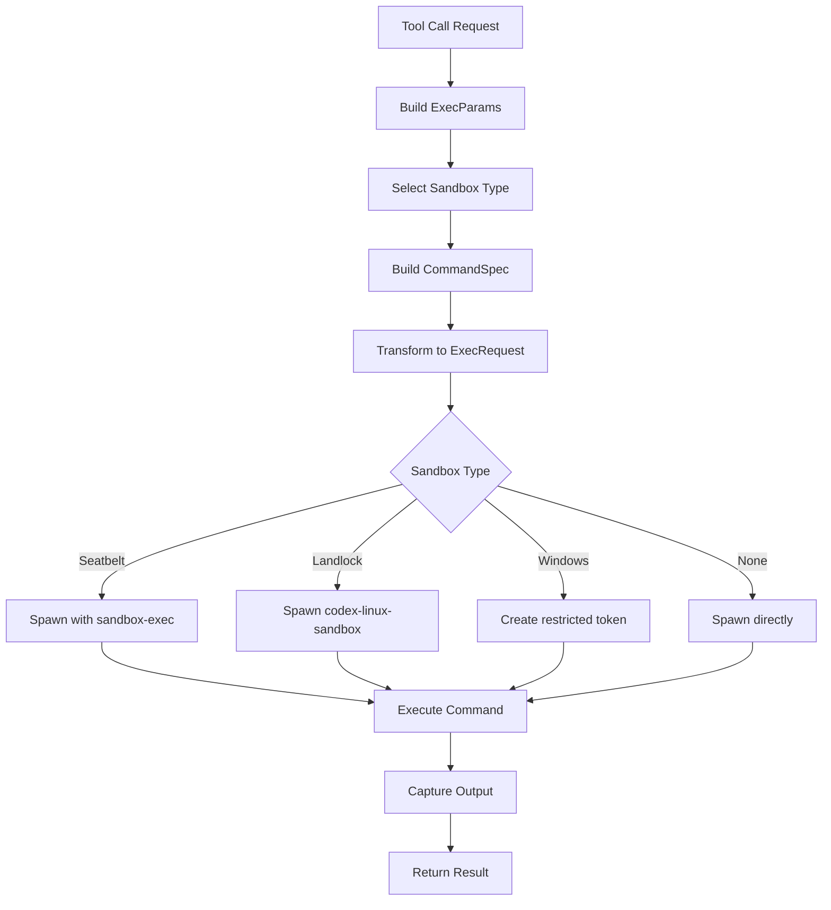
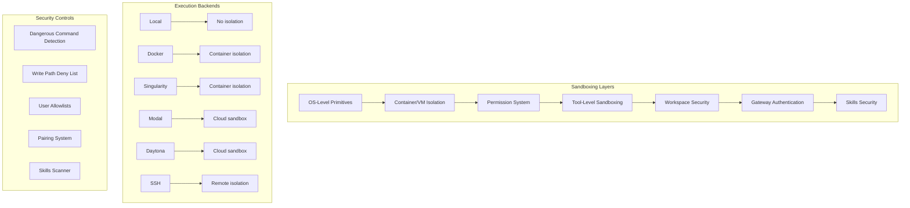
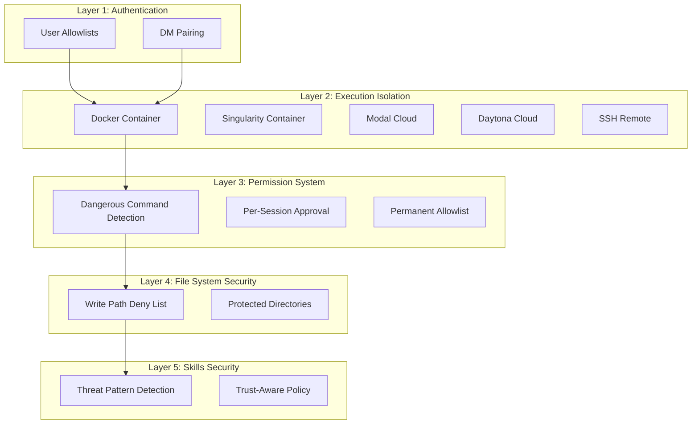
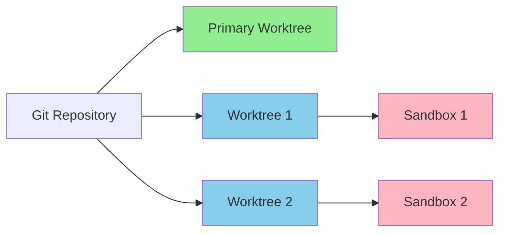
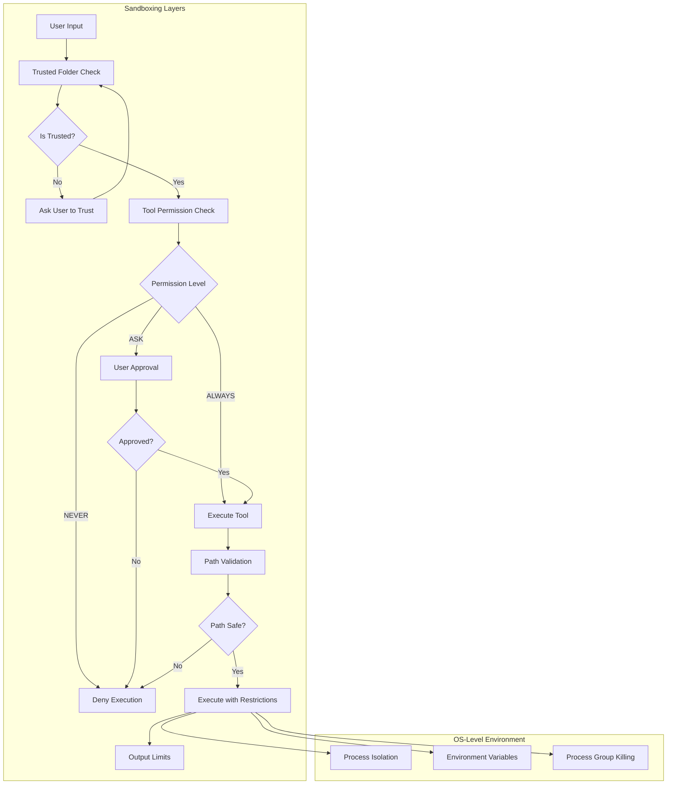
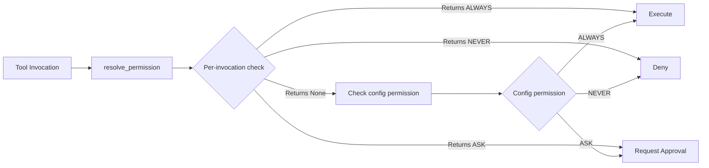

# Codex Sandboxing Architecture Documentation

## Executive Summary

This document provides a comprehensive analysis of the sandboxing architecture implemented in the Codex project. The sandboxing system is a multi-layered security framework that protects the host system from potentially unsafe code execution by the AI agent. It operates through several complementary mechanisms:

1. **Tool-level sandboxing** - Per-command execution isolation
2. **Permission system** - Policy-based access control for tool calls
3. **Workspace/trusted folder system** - Filesystem boundary management
4. **Operating system primitives** - Platform-specific sandboxing technologies

---

## 1. High-Level Architecture Overview



### Key Components

| Component | Responsibility | Location |
|-----------|---------------|----------|
| [`SandboxManager`](codex-rs/core/src/sandboxing/mod.rs:378) | Orchestrates sandbox transformation | `codex-rs/core/src/sandboxing/` |
| [`ExecRequest`](codex-rs/core/src/sandboxing/mod.rs:62) | Unified execution request structure | `codex-rs/core/src/sandboxing/mod.rs` |
| [`CommandSpec`](codex-rs/core/src/sandboxing/mod.rs:50) | Portable command specification | `codex-rs/core/src/sandboxing/mod.rs` |
| [`SandboxType`](codex-rs/core/src/exec.rs:149) | Platform-specific sandbox enum | `codex-rs/core/src/exec.rs` |
| [`SafetyCheck`](codex-rs/core/src/safety.rs:17) | Approval decision logic | `codex-rs/core/src/safety.rs` |

---

## 2. Sandbox Policy System

### 2.1 SandboxPolicy Enum

The [`SandboxPolicy`](codex-rs/app-server-protocol/src/protocol/common.rs:830) defines the security posture for each command execution:

```rust
// From codex-rs/app-server-protocol/src/protocol/common.rs
pub enum SandboxPolicy {
    /// Full access - no sandboxing applied
    DangerFullAccess,
    
    /// External sandbox (e.g., container) handles isolation
    ExternalSandbox {
        network_access: NetworkAccess,
    },
    
    /// Read-only access with configurable readable roots
    ReadOnly {
        access: ReadOnlyAccess,
        network_access: bool,
    },
    
    /// Workspace-write with explicit writable roots
    WorkspaceWrite {
        writable_roots: Vec<AbsolutePathBuf>,
        read_only_access: ReadOnlyAccess,
        network_access: bool,
        exclude_tmpdir_env_var: bool,
        exclude_slash_tmp: bool,
    },
}
```

### 2.2 Policy Variants Explained

| Policy | Filesystem Access | Network Access | Use Case |
|--------|------------------|----------------|----------|
| `DangerFullAccess` | Full read/write | Full | Trusted operations, bypass sandbox |
| `ExternalSandbox` | Delegated to external | Configurable | Containerized execution |
| `ReadOnly` | Configurable read-only | Configurable | Safe read operations |
| `WorkspaceWrite` | Explicit writable roots | Configurable | Code editing in workspace |

### 2.3 Split Policies

The system uses split policies for finer-grained control:

- **[`FileSystemSandboxPolicy`](codex-rs/app-server-protocol/src/protocol/common.rs:830)**: Controls filesystem access
- **[`NetworkSandboxPolicy`](codex-rs/app-server-protocol/src/protocol/common.rs:830)**: Controls network access



---

## 3. Platform-Specific Sandboxing Implementations

### 3.1 macOS: Seatbelt Sandbox

#### Overview

macOS uses Apple's **Seatbelt** sandbox framework via the `sandbox-exec` utility. This is a MAC (Mandatory Access Control) system that enforces fine-grained access controls.

#### Implementation Location

- **Main module**: [`codex-rs/core/src/seatbelt.rs`](codex-rs/core/src/seatbelt.rs:1)
- **Executable path**: `/usr/bin/sandbox-exec` (hardcoded for security)

#### Policy Generation

The Seatbelt policy is generated dynamically based on the sandbox policy:

```rust
// From codex-rs/core/src/seatbelt.rs:327
pub(crate) fn create_seatbelt_command_args(
    command: Vec<String>,
    sandbox_policy: &SandboxPolicy,
    sandbox_policy_cwd: &Path,
    enforce_managed_network: bool,
    network: Option<&NetworkProxy>,
) -> Vec<String>
```

#### Policy Components

1. **Base Policy** (`seatbelt_base_policy.sbpl`): Default restrictions
2. **Network Policy** (`seatbelt_network_policy.sbpl`): Network access rules
3. **Platform Defaults** (`seatbelt_platform_defaults.sbpl`): System paths

#### Filesystem Access Control

```rust
// From codex-rs/core/src/seatbelt.rs:434-464
if file_system_sandbox_policy.has_full_disk_write_access() {
    // Full write access with optional exclusions
    r#"(allow file-write* (regex #"^/"))"#
} else {
    // Restricted write to specific roots
    build_seatbelt_access_policy(
        "file-write*",
        "WRITABLE_ROOT",
        writable_roots,
    )
}
```

#### Network Control

The Seatbelt sandbox supports:
- **Loopback binding**: `(allow network-bind (local ip "localhost:*"))`
- **Specific ports**: `(allow network-outbound (remote ip "localhost:8080"))`
- **Unix domain sockets**: Configurable allowlists
- **Proxy support**: Automatic detection of proxy environment variables

#### macOS Permission Extensions

The system supports extensions for macOS-specific permissions:

```rust
// From codex-rs/core/src/seatbelt_permissions.rs:32
pub(crate) fn build_seatbelt_extensions(
    extensions: &MacOsSeatbeltProfileExtensions,
) -> SeatbeltExtensionPolicy
```

Supported extensions:
- **Preferences**: Read/Write access to user preferences
- **Automation**: AppleEvents to specific bundle IDs
- **Accessibility**: AXServer access
- **Calendar**: CalendarAgent access

### 3.2 Linux: Landlock + Bubblewrap

#### Overview

Linux uses a hybrid approach combining:
1. **Landlock** (kernel-level LSM) for seccomp-based restrictions
2. **Bubblewrap** (`bwrap`) for filesystem namespace isolation

#### Implementation Location

- **Main module**: [`codex-rs/core/src/landlock.rs`](codex-rs/core/src/landlock.rs:1)
- **Helper binary**: [`codex-rs/linux-sandbox/`](codex-rs/linux-sandbox/)
- **Bubblewrap wrapper**: [`codex-rs/linux-sandbox/src/bwrap.rs`](codex-rs/linux-sandbox/src/bwrap.rs:1)

#### Architecture



#### Bubblewrap Filesystem Isolation

```rust
// From codex-rs/linux-sandbox/src/bwrap.rs:95
pub fn create_linux_sandbox_command_args_for_policies(
    command: Vec<String>,
    sandbox_policy: &SandboxPolicy,
    file_system_sandbox_policy: &FileSystemSandboxPolicy,
    network_sandbox_policy: NetworkSandboxPolicy,
    sandbox_policy_cwd: &Path,
    use_bwrap_sandbox: bool,
    allow_network_for_proxy: bool,
) -> Vec<String>
```

#### Seccomp Restrictions

When not using Bubblewrap, the system applies:
- **`PR_SET_NO_NEW_PRIVS`**: Prevents privilege escalation
- **Seccomp filters**: Network syscall blocking

#### Network Proxy Integration

The Linux sandbox supports managed network via a proxy:

```rust
// From codex-rs/core/src/landlock.rs:61
pub(crate) fn allow_network_for_proxy(enforce_managed_network: bool) -> bool {
    enforce_managed_network
}
```

### 3.3 Windows: Restricted Token Sandbox

#### Overview

Windows uses **Restricted Token Sandboxing**, which creates a limited-access security token for child processes. This is a Windows-specific security feature that restricts:
- File system access via ACLs
- Registry access
- Network access via firewall rules
- Process creation

#### Implementation Location

- **Main module**: [`codex-rs/core/src/windows_sandbox.rs`](codex-rs/core/src/windows_sandbox.rs:1)
- **Windows sandbox crate**: [`codex-rs/windows-sandbox-rs/`](codex-rs/windows-sandbox-rs/)
- **Command runner**: [`codex-rs/windows-sandbox-rs/src/command_runner_win.rs`](codex-rs/windows-sandbox-rs/src/command_runner_win.rs:1)

#### Two Modes

1. **Elevated Mode**: Uses elevated privileges for setup
2. **Unelevated (Restricted Token)**: Standard user execution

```rust
// From codex-rs/core/src/windows_sandbox.rs:251
pub enum WindowsSandboxSetupMode {
    Elevated,
    Unelevated,
}
```

#### Setup Process



#### Capability-Based Access Control

The Windows sandbox uses capability SIDs for fine-grained access:

```rust
// From codex-rs/windows-sandbox-rs/src/cap.rs
pub trait Capability {
    fn as_sid(&self) -> *mut c_void;
}
```

Capabilities include:
- **Read-only access**: Limited file system read
- **Workspace write**: Write access to specific paths
- **Network access**: Firewall rule-based control

#### Firewall Integration

```rust
// From codex-rs/windows-sandbox-rs/src/firewall.rs
const OFFLINE_BLOCK_RULE_NAME: &str = "codex_sandbox_offline_block_outbound";
```

The sandbox creates firewall rules to:
- Block outbound connections by default
- Allow specific ports when needed
- Isolate sandboxed processes from network

---

## 4. Permission and Approval System

### 4.1 Approval Policy

The approval system determines when user interaction is required:

```rust
// From codex-rs/app-server-protocol/src/protocol/common.rs
pub enum AskForApproval {
    Never,              // Auto-approve all
    OnFailure,          // Ask only on failure
    OnRequest,          // Ask on first request (unless DangerFullAccess)
    UnlessTrusted,      // Always ask
    Reject(RejectConfig), // Reject specific categories
}
```

### 4.2 Safety Assessment

The [`assess_patch_safety`](codex-rs/core/src/safety.rs:28) function determines execution safety:

```rust
// From codex-rs/core/src/safety.rs:28
pub fn assess_patch_safety(
    action: &ApplyPatchAction,
    policy: AskForApproval,
    sandbox_policy: &SandboxPolicy,
    file_system_sandbox_policy: &FileSystemSandboxPolicy,
    cwd: &Path,
    windows_sandbox_level: WindowsSandboxLevel,
) -> SafetyCheck
```

### 4.3 Safety Check Outcomes

```rust
// From codex-rs/core/src/safety.rs:17
pub enum SafetyCheck {
    AutoApprove {
        sandbox_type: SandboxType,
        user_explicitly_approved: bool,
    },
    AskUser,
    Reject {
        reason: String,
    },
}
```

### 4.4 Approval Store

The approval system caches decisions for session-wide consistency:

```rust
// From codex-rs/core/src/tools/sandboxing.rs:34
pub(crate) struct ApprovalStore {
    map: HashMap<String, ReviewDecision>,
}
```

---

## 5. Workspace and Trusted Folder System

### 5.1 Workspace Definition

The workspace is the primary trusted directory for the agent:

```rust
// From codex-rs/core/src/sandboxing/mod.rs:50
pub struct CommandSpec {
    pub program: String,
    pub args: Vec<String>,
    pub cwd: PathBuf,  // Working directory (workspace)
    pub env: HashMap<String, String>,
    pub expiration: ExecExpiration,
    pub sandbox_permissions: SandboxPermissions,
    pub additional_permissions: Option<PermissionProfile>,
    pub justification: Option<String>,
}
```

### 5.2 Writable Roots

For `WorkspaceWrite` policy, writable roots are explicitly defined:

```rust
// From codex-rs/core/src/safety.rs:146
let unreadable_roots = file_system_sandbox_policy.get_unreadable_roots_with_cwd(cwd);
let writable_roots = file_system_sandbox_policy.get_writable_roots_with_cwd(cwd);
```

### 5.3 Additional Permissions

The system supports additional permissions beyond the base policy:

```rust
// From codex-rs/core/src/sandboxing/mod.rs:146
pub(crate) fn normalize_additional_permissions(
    additional_permissions: PermissionProfile,
) -> Result<PermissionProfile, String>
```

Permission profile structure:
```rust
pub struct PermissionProfile {
    pub network: Option<NetworkPermission>,
    pub file_system: Option<FileSystemPermissions>,
    pub macos: Option<MacOsPermissions>,
}
```

---

## 6. Network Sandboxing

### 6.1 Network Proxy

The system uses a network proxy for managed network access:

```rust
// From codex-rs/core/src/sandboxing/mod.rs:66
pub struct ExecRequest {
    pub network: Option<NetworkProxy>,
    // ... other fields
}
```

### 6.2 Network Policy

```rust
// From codex-rs/app-server-protocol/src/protocol/common.rs
pub enum NetworkSandboxPolicy {
    Enabled,
    Restricted,
}
```

### 6.3 Environment Variable Control

Network restrictions are communicated via environment variables:

```rust
// From codex-rs/core/src/spawn.rs:19
pub const CODEX_SANDBOX_NETWORK_DISABLED_ENV_VAR: &str = "CODEX_SANDBOX_NETWORK_DISABLED";

// From codex-rs/core/src/spawn.rs:24
pub const CODEX_SANDBOX_ENV_VAR: &str = "CODEX_SANDBOX";
```

---

## 7. Execution Flow

### 7.1 Command Execution Pipeline



### 7.2 Key Functions

| Function | Purpose | Location |
|----------|---------|----------|
| [`select_initial`](codex-rs/core/src/sandboxing/mod.rs:383) | Select sandbox type | `codex-rs/core/src/sandboxing/mod.rs` |
| [`transform`](codex-rs/core/src/sandboxing/mod.rs:418) | Transform CommandSpec to ExecRequest | `codex-rs/core/src/sandboxing/mod.rs` |
| [`spawn_child_async`](codex-rs/core/src/spawn.rs:50) | Spawn child process | `codex-rs/core/src/spawn.rs` |
| [`execute_env`](codex-rs/core/src/sandboxing/mod.rs:560) | Execute with environment | `codex-rs/core/src/sandboxing/mod.rs` |

---

## 8. Configuration

### 8.1 Config Schema

Sandboxing is configured via `config.toml`:

```toml
# Sandbox mode
sandbox_mode = "read-only"  # or "workspace-write" or "danger-full-access"

# Workspace write configuration
[sandbox_workspace_write]
writable_roots = ["/path/to/workspace"]
network_access = false

# Windows sandbox mode
[windows]
sandbox = "elevated"  # or "unelevated"
```

### 8.2 Feature Flags

```rust
// From codex-rs/core/src/features.rs
pub enum Feature {
    WindowsSandbox,           // Legacy Windows sandbox
    WindowsSandboxElevated,   // Elevated Windows sandbox
    UseLinuxSandboxBwrap,     // Use Bubblewrap on Linux
}
```

---

## 9. Security Considerations

### 9.1 Defense in Depth

The sandboxing system employs multiple layers:

1. **Policy layer**: Determines what should be sandboxed
2. **Orchestration layer**: Transforms requests for sandbox execution
3. **Platform layer**: Enforces restrictions via OS primitives
4. **Network layer**: Controls network access

### 9.2 Known Limitations

| Platform | Limitation | Mitigation |
|----------|------------|------------|
| macOS | Seatbelt can be bypassed with root | Root access already compromises system |
| Linux | Landlock requires kernel support | Fallback to Bubblewrap |
| Windows | Restricted token has limited scope | Elevated mode for full isolation |

### 9.3 Environment Variables

The system uses environment variables to communicate sandbox state:

| Variable | Purpose | Value |
|----------|---------|-------|
| `CODEX_SANDBOX` | Indicates sandbox execution | "seatbelt" (macOS) |
| `CODEX_SANDBOX_NETWORK_DISABLED` | Network disabled flag | "1" |

---

## 10. Testing and Debugging

### 10.1 Debug Commands

The CLI provides sandbox debugging commands:

```bash
# macOS
codex sandbox macos --log-denials <command>

# Linux
codex sandbox landlock <command>

# Windows
codex sandbox windows <command>
```

### 10.2 Test Coverage

Key test files:
- [`codex-rs/linux-sandbox/tests/suite/managed_proxy.rs`](codex-rs/linux-sandbox/tests/suite/managed_proxy.rs)
- [`codex-rs/app-server/tests/suite/v2/windows_sandbox_setup.rs`](codex-rs/app-server/tests/suite/v2/windows_sandbox_setup.rs)
- [`codex-rs/core/src/safety.rs#tests`](codex-rs/core/src/safety.rs:198)

---

## 11. Summary

The Codex sandboxing architecture provides a comprehensive, multi-layered security framework that:

1. **Adapts to platform capabilities**: Uses native sandboxing technologies on each platform
2. **Provides fine-grained control**: Split filesystem and network policies
3. **Supports flexible policies**: From read-only to full access
4. **Integrates with approval system**: User consent for sensitive operations
5. **Manages network access**: Proxy-based control for managed environments

The system is designed with defense-in-depth principles, ensuring that even if one layer is bypassed, other layers provide protection.

# Hermes Agent Sandboxing Architecture

## Executive Summary

Hermes Agent implements a **defense-in-depth sandboxing strategy** with multiple layers of isolation and protection. This document provides a comprehensive analysis of all sandboxing mechanisms, from OS-level primitives to application-level permission systems.

## Architecture Overview



---

## 1. Terminal Execution Backends

The terminal tool supports six execution backends, each with different isolation characteristics.

### 1.1 Local Backend (`tools/environments/local.py`)

**Isolation Level:** None (direct host execution)

**Implementation:**
```python
# tools/environments/local.py
class LocalEnvironment(BaseEnvironment):
    """Local execution environment with interrupt support and non-blocking I/O."""
    
    def execute(self, command: str, cwd: str = "", *,
                timeout: int | None = None,
                stdin_data: str | None = None) -> dict:
        """Execute command directly on host using subprocess."""
        # Uses subprocess.Popen with PTY mode for interactive support
        # Output fence marker: "__HERMES_FENCE_a9f7b3__"
        # Shell noise filtering for bash/zsh startup messages
```

**Security Characteristics:**
- **No isolation** - commands execute with full host privileges
- **Interrupt support** - polls interrupt event during execution
- **Shell noise filtering** - strips bash/zsh startup warnings
- **Best for:** Development, testing, trusted environments

**Key Code:**
```python
# tools/environments/local.py:17
_OUTPUT_FENCE = "__HERMES_FENCE_a9f7b3__"

# tools/environments/local.py:75-100
def _clean_shell_noise(output: str) -> str:
    """Strip shell startup/exit warnings."""
    _SHELL_NOISE_SUBSTRINGS = (
        "bash: cannot set terminal process group",
        "bash: no job control in this shell",
        "Restored session:",
        "Last login:",
        # ... more patterns
    )
```

---

### 1.2 Docker Backend (`tools/environments/docker.py`)

**Isolation Level:** Container-level with security hardening

**Implementation:**
```python
# tools/environments/docker.py
class DockerEnvironment(BaseEnvironment):
    """Hardened Docker container execution with resource limits and persistence."""
    
    _SECURITY_ARGS = [
        "--cap-drop", "ALL",
        "--security-opt", "no-new-privileges",
        "--pids-limit", "256",
        "--tmpfs", "/tmp:rw,nosuid,size=512m",
        "--tmpfs", "/var/tmp:rw,noexec,nosuid,size=256m",
        "--tmpfs", "/run:rw,noexec,nosuid,size=64m",
    ]
```

**Security Features:**
| Feature | Description |
|---------|-------------|
| **Capability Dropping** | `--cap-drop ALL` removes all Linux capabilities |
| **No Privilege Escalation** | `--security-opt no-new-privileges` prevents setuid exploits |
| **PID Limits** | `--pids-limit 256` prevents fork bombs |
| **Size-Limited tmpfs** | `/tmp`, `/var/tmp`, `/run` are size-limited and nosuid |
| **Resource Limits** | Configurable CPU, memory, disk quotas |
| **Network Control** | `--network=none` for air-gapped execution |

**Persistence Modes:**
```python
# tools/environments/docker.py:104-119
if self._persistent:
    # Bind mounts from host sandbox directory
    writable_args = [
        "-v", f"{self._workspace_dir}:/workspace",
        "-v", f"{self._home_dir}:/root",
    ]
else:
    # Ephemeral tmpfs (fast, gone on cleanup)
    writable_args = [
        "--tmpfs", "/workspace:rw,exec,size=10g",
        "--tmpfs", "/home:rw,exec,size=1g",
        "--tmpfs", "/root:rw,exec,size=1g",
    ]
```

**Disk Quota Support:**
```python
# tools/environments/docker.py:148-185
@staticmethod
def _storage_opt_supported() -> bool:
    """Check if Docker's storage driver supports per-container disk quotas.
    
    Only overlay2 on XFS with pquota supports this feature.
    Ubuntu (and most distros) default to ext4, where this flag errors out.
    """
```

---

### 1.3 Singularity/Apptainer Backend (`tools/environments/singularity.py`)

**Isolation Level:** Container-level with HPC-focused security

**Implementation:**
```python
# tools/environments/singularity.py
class SingularityEnvironment(BaseEnvironment):
    """Hardened Singularity/Apptainer container with resource limits and persistence."""
    
    def _start_instance(self):
        cmd = [self.executable, "instance", "start"]
        
        # Security: full isolation from host
        cmd.extend(["--containall", "--no-home"])
        
        # Writable layer
        if self._persistent and self._overlay_dir:
            cmd.extend(["--overlay", str(self._overlay_dir)])
        else:
            cmd.extend(["--writable-tmpfs"])
```

**Security Features:**
| Feature | Description |
|---------|-------------|
| **--containall** | Full isolation (PID, IPC, mount namespaces, no host home mount) |
| **--no-home** | Prevents automatic /home mount from host |
| **Writable Overlay** | Persistent filesystem via overlay directories |
| **--writable-tmpfs** | Ephemeral writable layer |
| **SIF Images** | Immutable container images from Docker Hub |

**SIF Image Management:**
```python
# tools/environments/singularity.py:90-141
def _get_or_build_sif(image: str, executable: str = "apptainer") -> str:
    """Get or build a SIF image from a docker:// URL.
    
    Caches SIF images in ~/.hermes/sandboxes/singularity/.
    Builds from docker:// URLs on first use.
    """
```

---

### 1.4 Modal Backend (`tools/environments/modal.py`)

**Isolation Level:** Cloud-based sandbox with filesystem snapshots

**Implementation:**
```python
# tools/environments/modal.py
class ModalEnvironment(BaseEnvironment):
    """Modal cloud execution via mini-swe-agent.
    
    Wraps SwerexModalEnvironment and adds filesystem persistence
    via Modal's snapshot_filesystem() API.
    """
```

**Security Features:**
| Feature | Description |
|---------|-------------|
| **Cloud Isolation** | Runs in isolated Modal containers |
| **Snapshot Persistence** | Filesystem snapshotted on cleanup, restored on next creation |
| **Configurable Resources** | CPU, memory, disk via Modal API |
| **Auto-Cleanup** | Containers terminated after inactivity |

**Snapshot Management:**
```python
# tools/environments/modal.py:76-88
if self._persistent:
    snapshot_id = _load_snapshots().get(self._task_id)
    if snapshot_id:
        try:
            restored_image = modal.Image.from_id(snapshot_id)
            logger.info("Modal: restoring from snapshot %s", snapshot_id[:20])
        except Exception as e:
            logger.warning("Modal: failed to restore snapshot: %s", e)
```

---

### 1.5 Daytona Backend (`tools/environments/daytona.py`)

**Isolation Level:** Cloud-based sandbox with stopped/started lifecycle

**Implementation:**
```python
# tools/environments/daytona.py
class DaytonaEnvironment(BaseEnvironment):
    """Daytona cloud sandbox execution backend.
    
    Uses stopped/started sandbox lifecycle for filesystem persistence
    instead of snapshots, making it faster and stateless on the host.
    """
```

**Security Features:**
| Feature | Description |
|---------|-------------|
| **Cloud Isolation** | Runs in isolated Daytona sandboxes |
| **Stopped/Started Lifecycle** | Sandboxes stopped on cleanup, resumed on next creation |
| **Resource Limits** | CPU, memory, disk (max 10GB) |
| **Label-Based Discovery** | `hermes_task_id` label for sandbox management |

**Sandbox Lifecycle:**
```python
# tools/environments/daytona.py:72-96
if self._persistent:
    try:
        self._sandbox = self._daytona.find_one(labels=labels)
        self._sandbox.start()
        logger.info("Daytona: resumed sandbox %s for task %s",
                    self._sandbox.id, task_id)
    except DaytonaError:
        self._sandbox = None

if self._sandbox is None:
    self._sandbox = self._daytona.create(
        CreateSandboxFromImageParams(
            image=image,
            labels=labels,
            auto_stop_interval=0,
            resources=resources,
        )
    )
```

---

### 1.6 SSH Backend (`tools/environments/ssh.py`)

**Isolation Level:** Remote host execution with connection persistence

**Implementation:**
```python
# tools/environments/ssh.py
class SSHEnvironment(BaseEnvironment):
    """Run commands on a remote machine over SSH.
    
    Uses SSH ControlMaster for connection persistence.
    Security benefit: the agent cannot modify its own code since
    execution happens on a separate machine.
    """
```

**Security Features:**
| Feature | Description |
|---------|-------------|
| **Remote Isolation** | Execution on separate machine |
| **ControlMaster** | SSH connection persistence for performance |
| **Key-Based Auth** | SSH key authentication |
| **Batch Mode** | `BatchMode=yes` for non-interactive execution |

**Connection Management:**
```python
# tools/environments/ssh.py:35-38
self.control_dir = Path(tempfile.gettempdir()) / "hermes-ssh"
self.control_socket = self.control_dir / f"{user}@{host}:{port}.sock"

# tools/environments/ssh.py:40-55
def _build_ssh_command(self, extra_args: list = None) -> list:
    cmd = ["ssh"]
    cmd.extend(["-o", f"ControlPath={self.control_socket}"])
    cmd.extend(["-o", "ControlMaster=auto"])
    cmd.extend(["-o", "ControlPersist=300"])
    cmd.extend(["-o", "BatchMode=yes"])
    cmd.extend(["-o", "StrictHostKeyChecking=accept-new"])
```

---

## 2. Dangerous Command Approval System

The approval system provides a **permission layer** that intercepts potentially destructive commands before execution.

### 2.1 Pattern Detection (`tools/approval.py`)

**Implementation:**
```python
# tools/approval.py:23-50
DANGEROUS_PATTERNS = [
    (r'\brm\s+(-[^\s]*\s+)*/', "delete in root path"),
    (r'\brm\s+-[^\s]*r', "recursive delete"),
    (r'\bchmod\s+(-[^\s]*\s+)*777\b', "world-writable permissions"),
    (r'\bchown\s+(-[^\s]*)?R\s+root', "recursive chown to root"),
    (r'\bmkfs\b', "format filesystem"),
    (r'\bdd\s+.*if=', "disk copy"),
    (r'>\s*/dev/sd', "write to block device"),
    (r'\bDROP\s+(TABLE|DATABASE)\b', "SQL DROP"),
    (r'\bDELETE\s+FROM\b(?!.*\bWHERE\b)', "SQL DELETE without WHERE"),
    (r'\bTRUNCATE\s+(TABLE)?\s*\w', "SQL TRUNCATE"),
    (r'>\s*/etc/', "overwrite system config"),
    (r'\bsystemctl\s+(stop|disable|mask)\b', "stop/disable system service"),
    (r'\bkill\s+-9\s+-1\b', "kill all processes"),
    (r'\bpkill\s+-9\b', "force kill processes"),
    (r':()\s*{\s*:\s*\|\s*:&\s*}\s*;:', "fork bomb"),
    (r'\b(curl|wget)\b.*\|\s*(ba)?sh\b', "pipe remote content to shell"),
    # ... 30+ patterns total
]
```

**Detection Logic:**
```python
# tools/approval.py:57-68
def detect_dangerous_command(command: str) -> tuple:
    """Check if a command matches any dangerous patterns.
    
    Returns:
        (is_dangerous, pattern_key, description) or (False, None, None)
    """
    command_lower = command.lower()
    for pattern, description in DANGEROUS_PATTERNS:
        if re.search(pattern, command_lower, re.IGNORECASE | re.DOTALL):
            pattern_key = pattern.split(r'\b')[1] if r'\b' in pattern else pattern[:20]
            return (True, pattern_key, description)
    return (False, None, None)
```

### 2.2 Per-Session Approval State

**Thread-Safe State Management:**
```python
# tools/approval.py:75-130
_lock = threading.Lock()
_pending: dict[str, dict] = {}
_session_approved: dict[str, set] = {}
_permanent_approved: set = set()

def approve_session(session_key: str, pattern_key: str):
    """Approve a pattern for this session only."""
    with _lock:
        _session_approved.setdefault(session_key, set()).add(pattern_key)

def is_approved(session_key: str, pattern_key: str) -> bool:
    """Check if a pattern is approved (session-scoped or permanent)."""
    with _lock:
        if pattern_key in _permanent_approved:
            return True
        return pattern_key in _session_approved.get(session_key, set())

def approve_permanent(pattern_key: str):
    """Add a pattern to the permanent allowlist."""
    with _lock:
        _permanent_approved.add(pattern_key)
```

### 2.3 Approval Flow

**Backend-Specific Behavior:**
```python
# tools/approval.py:235-300
def check_dangerous_command(command: str, env_type: str,
                            approval_callback=None) -> dict:
    """Check if a command is dangerous and handle approval."""
    
    # ISOLATED BACKENDS: No approval needed
    if env_type in ("docker", "singularity", "modal", "daytona"):
        return {"approved": True, "message": None}
    
    # LOCAL/SSH: Check for dangerous patterns
    is_dangerous, pattern_key, description = detect_dangerous_command(command)
    if not is_dangerous:
        return {"approved": True, "message": None}
    
    # Check session/permanent approval
    session_key = os.getenv("HERMES_SESSION_KEY", "default")
    if is_approved(session_key, pattern_key):
        return {"approved": True, "message": None}
    
    # Prompt user for approval
    if is_gateway or os.getenv("HERMES_EXEC_ASK"):
        submit_pending(session_key, {...})
        return {"approved": False, "status": "approval_required", ...}
    
    choice = prompt_dangerous_approval(command, description)
    # Returns: "once", "session", "always", or "deny"
```

**Approval Options:**
| Option | Behavior |
|--------|----------|
| **once** | Allow this specific command execution only |
| **session** | Allow this pattern for the current session |
| **always** | Add to permanent allowlist (saved to config.yaml) |
| **deny** | Block the command |

**Permanent Allowlist Persistence:**
```python
# tools/approval.py:136-162
def load_permanent_allowlist() -> set:
    """Load permanently allowed command patterns from config."""
    from hermes_cli.config import load_config
    config = load_config()
    patterns = set(config.get("command_allowlist", []) or [])
    if patterns:
        load_permanent(patterns)
    return patterns

def save_permanent_allowlist(patterns: set):
    """Save permanently allowed command patterns to config."""
    from hermes_cli.config import load_config, save_config
    config = load_config()
    config["command_allowlist"] = list(patterns)
    save_config(config)
```

---

## 3. Workspace and Trusted Folders

### 3.1 Write Path Deny List (`tools/file_operations.py`)

**Implementation:**
```python
# tools/file_operations.py:42-75
_WRITE_DENIED_PATHS = {
    os.path.realpath(p) for p in [
        os.path.join(_HOME, ".ssh", "authorized_keys"),
        os.path.join(_HOME, ".ssh", "id_rsa"),
        os.path.join(_HOME, ".ssh", "id_ed25519"),
        os.path.join(_HOME, ".ssh", "config"),
        os.path.join(_HOME, ".hermes", ".env"),
        os.path.join(_HOME, ".bashrc"),
        os.path.join(_HOME, ".zshrc"),
        os.path.join(_HOME, ".profile"),
        os.path.join(_HOME, ".netrc"),
        os.path.join(_HOME, ".pgpass"),
        os.path.join(_HOME, ".npmrc"),
        os.path.join(_HOME, ".pypirc"),
        "/etc/sudoers",
        "/etc/passwd",
        "/etc/shadow",
    ]
}

_WRITE_DENIED_PREFIXES = [
    os.path.realpath(p) + os.sep for p in [
        os.path.join(_HOME, ".ssh"),
        os.path.join(_HOME, ".aws"),
        os.path.join(_HOME, ".gnupg"),
        os.path.join(_HOME, ".kube"),
        "/etc/sudoers.d",
        "/etc/systemd",
    ]
]

def _is_write_denied(path: str) -> bool:
    """Return True if path is on the write deny list."""
    resolved = os.path.realpath(os.path.expanduser(path))
    if resolved in WRITE_DENIED_PATHS:
        return True
    for prefix in WRITE_DENIED_PREFIXES:
        if resolved.startswith(prefix):
            return True
    return False
```

**Protected Directories:**
| Path | Protection |
|------|------------|
| `~/.ssh/*` | SSH keys and configuration |
| `~/.hermes/.env` | API keys and secrets |
| `~/.aws/` | AWS credentials |
| `~/.gnupg/` | GPG keyring |
| `~/.kube/` | Kubernetes configuration |
| `/etc/sudoers*` | Sudo privileges |
| `/etc/passwd`, `/etc/shadow` | System authentication |

---

## 4. Gateway Security Mechanisms

### 4.1 User Allowlists

**Configuration:**
```bash
# ~/.hermes/.env
TELEGRAM_ALLOWED_USERS=123456789,987654
DISCORD_ALLOWED_USERS=123456789012345678
SLACK_ALLOWED_USERS=U12345678,U87654321
```

**Default Deny Policy:**
```python
# gateway/platforms/base.py
# If {PLATFORM}_ALLOWED_USERS is set:
#   - Only listed user IDs can interact with the bot
# If unset and GATEWAY_ALLOW_ALL_USERS != true:
#   - All users are denied unless paired via DM
```

### 4.2 DM Pairing System (`gateway/pairing.py`)

**Security Features:**
| Feature | Implementation |
|---------|----------------|
| **8-char codes** | From 32-char unambiguous alphabet (no 0/O/1/I) |
| **Cryptographic randomness** | `secrets.choice()` |
| **1-hour expiry** | `CODE_TTL_SECONDS = 3600` |
| **Max 3 pending** | `MAX_PENDING_PER_PLATFORM = 3` |
| **Rate limiting** | 1 request per user per 10 minutes |
| **Lockout** | After 5 failed approval attempts (1 hour) |
| **File permissions** | `chmod 0600` on all data files |
| **No logging** | Codes never logged to stdout |

**Implementation:**
```python
# gateway/pairing.py:29-42
ALPHABET = "ABCDEFGHJKLMNPQRSTUVWXYZ23456789"
CODE_LENGTH = 8
CODE_TTL_SECONDS = 3600
RATE_LIMIT_SECONDS = 600
LOCKOUT_SECONDS = 3600
MAX_PENDING_PER_PLATFORM = 3
MAX_FAILED_ATTEMPTS = 5

class PairingStore:
    """Manages pairing codes and approved user lists."""
    
    def generate_code(self, platform: str, user_id: str, user_name: str = "") -> Optional[str]:
        """Generate a pairing code for a new user."""
        # Check lockout, rate limit, max pending
        code = "".join(secrets.choice(ALPHABET) for _ in range(CODE_LENGTH))
        # Store pending request
        return code
    
    def approve_code(self, platform: str, code: str) -> Optional[dict]:
        """Approve a pairing code. Adds the user to the approved list."""
        # Validate code, add user to approved list
```

**Data Files:**
```
~/.hermes/pairing/
├── telegram-pending.json    # Pending pairing requests
├── telegram-approved.json   # Approved (paired) users
├── discord-pending.json
├── discord-approved.json
└── _rate_limits.json        # Rate limit tracking
```

---

## 5. Skills Security (`tools/skills_guard.py`)

### 5.1 Threat Detection

**Pattern Categories:**
| Category | Description | Examples |
|----------|-------------|----------|
| **Exfiltration** | Data leakage attempts | `curl $API_KEY`, `base64 env`, `os.environ` |
| **Injection** | Prompt injection | `ignore previous instructions`, `system prompt override` |
| **Destructive** | System damage | `rm -rf /`, `mkfs`, `shutil.rmtree` |
| **Persistence** | Unauthorized persistence | `crontab`, `authorized_keys`, `sudoers` |
| **Network** | Reverse shells | `nc -l`, `python socket`, `ngrok` |
| **Obfuscation** | Evasion techniques | `base64 decode pipe`, `eval()`, `exec()` |

**Detection Implementation:**
```python
# tools/skills_guard.py:82-350
THREAT_PATTERNS = [
    # Exfiltration
    (r'curl\s+[^\n]*\$\{?\w*(KEY|TOKEN|SECRET|PASSWORD|API)',
     "env_exfil_curl", "critical", "exfiltration",
     "curl command interpolating secret environment variable"),
    
    # Injection
    (r'ignore\s+(?:\w+\s+)*(previous|all|above|prior)\s+instructions',
     "prompt_injection_ignore", "critical", "injection",
     "prompt injection: ignore previous instructions"),
    
    # Destructive
    (r'rm\s+-rf\s+/',
     "destructive_root_rm", "critical", "destructive",
     "recursive delete from root"),
    
    # Persistence
    (r'authorized_keys',
     "ssh_backdoor", "critical", "persistence",
     "modifies SSH authorized keys"),
    
    # Network
    (r'\bnc\s+-[lp]|\bncat\s+-[lp]|\bsocat\b',
     "reverse_shell", "critical", "network",
     "potential reverse shell listener"),
    
    # Obfuscation
    (r'\beval\s*\(\s*["\']',
     "eval_string", "high", "obfuscation",
     "eval() with string argument"),
]
```

### 5.2 Trust-Aware Install Policy

**Trust Levels:**
| Level | Source | Safe | Caution | Dangerous |
|-------|--------|------|---------|-----------|
| **builtin** | Ships with Hermes | ✅ | ✅ | ✅ |
| **trusted** | openai/skills, anthropics/skills | ✅ | ✅ | ❌ |
| **community** | All other sources | ✅ | ❌ | ❌ |
| **agent-created** | Agent-generated | ✅ | ❌ | ❌ |

**Policy Implementation:**
```python
# tools/skills_guard.py:41-49
INSTALL_POLICY = {
    "builtin":       ("allow",  "allow",   "allow"),
    "trusted":       ("allow",  "allow",   "block"),
    "community":     ("allow",  "block",   "block"),
    "agent-created": ("allow",  "block",   "block"),
}

def should_allow_install(result: ScanResult) -> tuple[bool, str]:
    """Determine if a skill should be installed based on scan verdict and trust level."""
    safe, caution, dangerous = INSTALL_POLICY[result.trust_level]
    verdict_map = {"safe": safe, "caution": caution, "dangerous": dangerous}
    if verdict_map[result.verdict] == "allow":
        return True, "Install allowed"
    return False, f"Install blocked: {result.verdict} verdict for {result.trust_level} source"
```

---

## 6. OS-Level Sandboxing Primitives

### 6.1 File Permissions

**Secure Write Function:**
```python
# gateway/pairing.py:45-52
def _secure_write(path: Path, data: str) -> None:
    """Write data to file with restrictive permissions (owner read/write only)."""
    path.parent.mkdir(parents=True, exist_ok=True)
    path.write_text(data, encoding="utf-8")
    try:
        os.chmod(path, 0o600)
    except OSError:
        pass  # Windows doesn't support chmod the same way
```

### 6.2 Environment Variables

**Terminal Backend Configuration:**
```yaml
# ~/.hermes/config.yaml
terminal:
  backend: "local"  # local, docker, singularity, modal, daytona, ssh
  cwd: "."          # Working directory
  timeout: 180      # Command timeout in seconds
  docker_image: "nikolaik/python-nodejs:python3.11-nodejs20"
  singularity_image: "docker://nikolaik/python-nodejs:python3.11-nodejs20"
  modal_image: "nikolaik/python-nodejs:python3.11-nodejs20"
  daytona_image: "nikolaik/python-nodejs:python3.11-nodejs20"
  container_cpu: 1
  container_memory: 5120      # MB
  container_disk: 51200       # MB
  container_persistent: true
```

**Environment-Specific Variables:**
```bash
# ~/.hermes/.env
TERMINAL_ENV=local|docker|singularity|modal|daytona|ssh
TERMINAL_SANDBOX_DIR=~/.hermes/sandboxes
TERMINAL_SCRATCH_DIR=/scratch  # For Singularity
TERMINAL_SSH_HOST=remote.server
TERMINAL_SSH_USER=user
TERMINAL_SSH_KEY=~/.ssh/id_rsa
MESHING_CWD=/home/myuser       # Working dir for messaging platforms
```

---

## 7. Security Architecture Summary

### 7.1 Defense-in-Depth Layers



### 7.2 Backend Security Comparison

| Backend | Isolation | Privilege Escalation | Resource Limits | Persistence |
|---------|-----------|---------------------|-----------------|-------------|
| **Local** | None | Full host access | None | N/A |
| **Docker** | Container | Blocked (no-new-privileges) | CPU, Memory, Disk | Optional |
| **Singularity** | Container | Blocked (--containall) | CPU, Memory | Optional |
| **Modal** | Cloud | Isolated | CPU, Memory, Disk | Snapshot |
| **Daytona** | Cloud | Isolated | CPU, Memory, Disk | Stopped/Started |
| **SSH** | Remote | Remote host privileges | Remote limits | N/A |

### 7.3 Dangerous Command Coverage

| Threat Type | Patterns | Detection |
|-------------|----------|-----------|
| **Filesystem Destruction** | `rm -rf`, `mkfs`, `dd` | ✅ |
| **Permission Escalation** | `chmod 777`, `chown root` | ✅ |
| **SQL Injection** | `DROP TABLE`, `DELETE FROM` | ✅ |
| **System Service Disruption** | `systemctl stop` | ✅ |
| **Process Killing** | `kill -9 -1`, `pkill -9` | ✅ |
| **Fork Bombs** | `:(){:|:&};:` | ✅ |
| **Remote Code Execution** | `curl \| bash` | ✅ |
| **Reverse Shells** | `nc -l`, `python socket` | ✅ |

---

## 8. Recommendations

### 8.1 For Production Deployments

1. **Use containerized backends** (Docker/Singularity) for all non-local deployments
2. **Enable resource limits** to prevent resource exhaustion attacks
3. **Configure user allowlists** for messaging gateways
4. **Regularly audit** the command allowlist for unnecessary entries
5. **Monitor** the skills installation logs for blocked attempts

### 8.2 For Development Environments

1. **Local backend** is acceptable for trusted development machines
2. **Enable dangerous command detection** even on local backend
3. **Use ephemeral sandbox mode** for testing to avoid state leakage

### 8.3 For High-Security Environments

1. **Use Modal/Daytona** for complete cloud isolation
2. **Disable persistent filesystems** to prevent state-based attacks
3. **Enable strict skills scanning** with community source blocking
4. **Implement network segmentation** for containerized backends

---

## 9. References

### Key Files

| File | Purpose |
|------|---------|
| [`tools/terminal_tool.py`](tools/terminal_tool.py) | Terminal orchestration and approval integration |
| [`tools/approval.py`](tools/approval.py) | Dangerous command detection and approval system |
| [`tools/file_operations.py`](tools/file_operations.py) | File operations with write path protection |
| [`tools/skills_guard.py`](tools/skills_guard.py) | Skills security scanner |
| [`gateway/pairing.py`](gateway/pairing.py) | DM pairing system |
| [`tools/environments/docker.py`](tools/environments/docker.py) | Docker backend implementation |
| [`tools/environments/singularity.py`](tools/environments/singularity.py) | Singularity backend implementation |
| [`tools/environments/modal.py`](tools/environments/modal.py) | Modal cloud backend |
| [`tools/environments/daytona.py`](tools/environments/daytona.py) | Daytona cloud backend |
| [`tools/environments/ssh.py`](tools/environments/ssh.py) | SSH remote backend |

### Configuration Files

| File | Purpose |
|------|---------|
| [`~/.hermes/config.yaml`](~/.hermes/config.yaml) | Main configuration (terminal settings, toolsets, etc.) |
| [`~/.hermes/.env`](~/.hermes/.env) | API keys and environment variables |
| [`~/.hermes/pairing/`](~/.hermes/pairing/) | Pairing data files |

---

# Kilo Code Sandboxing Architecture

## Overview

Kilo Code implements a **defense-in-depth** sandboxing strategy that combines multiple layers of isolation mechanisms. Rather than relying on a single sandboxing technology, the system uses a combination of:

1. **Permission-based access control** (application-level)
2. **Workspace/project boundary enforcement** (logical sandboxing)
3. **Tool-specific isolation** (per-tool security)
4. **MCP server isolation** (external tool sandboxing)
5. **OS-level process isolation** (child process management)

This document provides a comprehensive analysis of each sandboxing mechanism.

---

## 1. Permission-Based Access Control System

### Architecture

The permission system is the **primary sandboxing mechanism** in Kilo Code. It implements a fine-grained, pattern-based access control system that governs all tool interactions.

### Core Components

#### [`PermissionNext`](packages/opencode/src/permission/next.ts:14)

The permission system is implemented in [`packages/opencode/src/permission/next.ts`](packages/opencode/src/permission/next.ts:14) and consists of:

- **Ruleset**: A collection of permission rules with patterns and actions
- **Actions**: `allow`, `deny`, or `ask`
- **Pattern Matching**: Wildcard-based pattern matching for flexible permission rules

#### Permission Rule Structure

```typescript
{
  permission: string;      // Tool/permission name (e.g., "bash", "edit", "read")
  pattern: string;         // Pattern to match (e.g., "*", "rm", "src/*")
  action: "allow" | "deny" | "ask"
}
```

### Permission Types

The system supports multiple permission types, each controlling access to specific capabilities:

| Permission | Description |
|------------|-------------|
| `bash` | Shell command execution |
| `edit` | File modification (edit, write, patch, multiedit) |
| `read` | File reading |
| `external_directory` | Access to files outside project directory |
| `task` | Sub-agent/task launching |
| `skill` | Skill loading |
| `glob` | File pattern matching |
| `grep` | Content search |
| `list` | Directory listing |
| `webfetch` | Web content fetching |
| `websearch` | Web search |
| `codesearch` | Code search |
| `lsp` | Language server queries |
| `mcp` | MCP tool access |
| `doom_loop` | Repeated failure detection |
| `question` | User interaction questions |
| `plan_enter` / `plan_exit` | Plan management |

### Permission Evaluation Algorithm

The permission evaluation uses a **last-match-wins** strategy:

```typescript
// Simplified evaluation logic from permission/next.ts:236-242
export function evaluate(permission: string, pattern: string, ...rulesets: Ruleset[]): Rule {
  const merged = merge(...rulesets)
  const match = merged.findLast(
    (rule) => Wildcard.match(permission, rule.permission) && Wildcard.match(pattern, rule.pattern)
  )
  return match ?? { action: "ask", permission, pattern: "*" }
}
```

**Key behaviors:**
1. Rules are merged from multiple sources (config, approved, defaults)
2. The **last matching rule** determines the action
3. Unknown permissions default to `ask`
4. Wildcard permissions (`*`) match any permission name

### Permission Request Flow

```mermaid
sequenceDiagram
    participant Tool as Tool
    participant Perm as PermissionNext
    participant User as User
    participant SDK as SDK
    
    Tool->>Perm: ask(permission, patterns, ruleset)
    Perm->>Perm: evaluate(permission, pattern, ruleset)
    
    alt action = "deny"
        Perm-->>Tool: throw DeniedError
    alt action = "allow"
        Perm-->>Tool: continue execution
    alt action = "ask"
        Perm->>SDK: publish permission.asked event
        SDK->>User: Show permission prompt
        User->>SDK: Reply (once/always/reject)
        SDK->>Perm: reply(requestID, reply)
        Perm->>Perm: Store approval if "always"
        Perm-->>Tool: resolve/reject
    end
```

### Configuration

Permissions can be configured in [`opencode.json`](packages/opencode/src/config/config.ts:1376):

```json
{
  "permission": {
    "bash": "allow",
    "edit": {
      "src/*": "allow",
      "src/secret/*": "deny"
    },
    "read": {
      "*.env": "deny",
      "secrets/*": "deny"
    }
  }
}
```

---

## 2. Workspace and Project Boundary Sandboxing

### Concept

Kilo Code uses a **project-based sandboxing model** where each project has a defined boundary (worktree) that limits tool access by default.

### Key Components

#### [`Instance`](packages/opencode/src/project/instance.ts:21)

The `Instance` class maintains the current project context:

```typescript
// From instance.ts:54-65
/**
 * Check if a path is within the project boundary.
 * Returns true if path is inside Instance.directory OR Instance.worktree.
 * Paths within the worktree but outside the working directory should not trigger external_directory permission.
 */
containsPath(filepath: string) {
  if (Filesystem.contains(Instance.directory, filepath)) return true
  // Non-git projects set worktree to "/" which would match ANY absolute path.
  // Skip worktree check in this case to preserve external_directory permissions.
  if (Instance.worktree === "/") return false
  return Filesystem.contains(Instance.worktree, filepath)
}
```

#### [`Project`](packages/opencode/src/project/project.ts:18)

The `Project` namespace manages project metadata and sandboxes:

```typescript
// From project.ts:33-61
export const Info = z.object({
  id: z.string(),
  worktree: z.string(),      // Git worktree root
  vcs: z.literal("git").optional(),
  name: z.string().optional(),
  sandboxes: z.array(z.string()),  // Additional sandbox directories
  commands: {
    start: z.string().optional()  // Startup script for new workspaces
  }
})
```

### Sandbox Types

1. **Primary Worktree**: The main project directory (detected via `.git` folder)
2. **Git Worktrees**: Additional git worktrees that can be added as sandboxes
3. **External Directories**: Paths outside the project that require explicit permission

### External Directory Permission

The [`external_directory`](packages/opencode/src/tool/external-directory.ts:12) permission is triggered when tools access files outside the project boundary:

```typescript
// From external-directory.ts:12-32
export async function assertExternalDirectory(ctx: Tool.Context, target?: string, options?: Options) {
  if (!target) return
  if (options?.bypass) return
  if (Instance.containsPath(target)) return  // Inside project - no permission needed

  const kind = options?.kind ?? "file"
  const parentDir = kind === "directory" ? target : path.dirname(target)
  const glob = path.join(parentDir, "*").replaceAll("\\", "/")

  await ctx.ask({
    permission: "external_directory",
    patterns: [glob],
    always: [glob],
    metadata: { filepath: target, parentDir },
  })
}
```

### Git Worktree Support

Kilo Code supports **git worktrees**, allowing multiple working directories to share the same git repository:



Each worktree is tracked in the `sandboxes` array and can be selected independently.

---

## 3. Tool-Specific Sandboxing

### Bash Tool

The [`BashTool`](packages/opencode/src/tool/bash.ts:55) implements several sandboxing mechanisms:

#### Command Parsing and Analysis

```typescript
// From bash.ts:84-142
const tree = await parser().then((p) => p.parse(params.command))
const directories = new Set<string>()
const patterns = new Set<string>()
const always = new Set<string>()

for (const node of tree.rootNode.descendantsOfType("command")) {
  // Extract command name and arguments
  // Detect file operations (cd, rm, cp, mv, mkdir, touch, chmod, chown, cat)
  // Resolve paths and check if they're outside project
  if (["cd", "rm", "cp", "mv", "mkdir", "touch", "chmod", "chown", "cat"].includes(command[0])) {
    for (const arg of command.slice(1)) {
      const resolved = await $`realpath ${arg}`.cwd(cwd).quiet().nothrow().text()
      if (resolved) {
        const normalized = process.platform === "win32" 
          ? Filesystem.windowsPath(resolved).replace(/[\\/]+$/, "") 
          : resolved
        if (!Instance.containsPath(normalized)) {
          const dir = (await Filesystem.isDir(normalized)) ? normalized : path.dirname(normalized)
          directories.add(dir)
        }
      }
    }
  }
}
```

#### Security Features

1. **Tree-sitter parsing**: Commands are parsed using a bash grammar to extract actual commands and arguments
2. **Path resolution**: Arguments are resolved to absolute paths before permission checks
3. **Pattern extraction**: Command patterns are extracted for permission matching
4. **Timeout enforcement**: Commands have configurable timeouts (default 2 minutes)
5. **Process isolation**: Commands run in a controlled environment with custom shell

#### BashArity

The [`BashArity`](packages/opencode/src/permission/arity.ts:148) system defines command arity for specific commands:

```typescript
// From arity.ts:148-150
terraform: 2,  // terraform apply
"terraform workspace": 3,  // terraform workspace select prod
tmux: 2,  // tmux new -s dev
docker: 2,  // docker run nginx
"docker builder": 3,  // docker builder prune
"docker compose": 3,  // docker compose up
"docker container": 3,  // docker container ls
"docker image": 3,  // docker image prune
"docker network": 3,  // docker network inspect
"docker volume": 3,  // docker volume ls
podman: 2,  // podman run alpine
"podman container": 3,  // podman container ls
"podman image": 3,  // podman image prune
```

This allows for more precise permission patterns for complex commands.

### File Operations

#### Read Tool

The read tool checks file paths against the project boundary:

```typescript
// From read.test.ts:56-76
test("asks for external_directory permission when reading absolute path outside project", async () => {
  await using outerTmp = await tmpdir({
    config: { permission: { read: { "/tmp/*": "ask" } } }
  })
  
  await read.execute({ filePath: path.join(outerTmp.path, "secret.txt") }, testCtx)
  const extDirReq = requests.find((r) => r.permission === "external_directory")
  expect(extDirReq).toBeDefined()
})
```

#### Write/Edit Tool

File write operations are controlled by the `edit` permission with pattern matching:

```typescript
// From permission/next.ts:245-246
const EDIT_TOOLS = ["edit", "write", "patch", "multiedit"]

export function disabled(tools: string[], ruleset: Ruleset): Set<string> {
  const result = new Set<string>()
  for (const tool of tools) {
    const permission = EDIT_TOOLS.includes(tool) ? "edit" : tool
    // ...
  }
  return result
}
```

---

## 4. MCP Server Sandboxing

### MCP Server Types

Kilo Code supports two types of MCP (Model Context Protocol) servers:

1. **Local MCP Servers**: Spawned as child processes
2. **Remote MCP Servers**: Connected via HTTP/SSE

### Local MCP Server Isolation

Local MCP servers are spawned with controlled environments:

```typescript
// From mcp/index.ts:408-421
if (mcp.type === "local") {
  const [cmd, ...args] = mcp.command
  const cwd = Instance.directory
  const transport = new StdioClientTransport({
    stderr: "pipe",
    command: cmd,
    args,
    cwd,
    env: {
      ...process.env,
      ...(cmd === "opencode" ? { BUN_BE_BUN: "1" } : {}),
      ...mcp.environment,
    },
  })
}
```

**Security features:**
- Runs in the project directory (`cwd = Instance.directory`)
- Environment variables can be customized per server
- Stderr is captured for logging
- Timeout enforcement (default 30 seconds)

### Remote MCP Server Isolation

Remote MCP servers connect via:
- **Streamable HTTP** transport
- **SSE** (Server-Sent Events) transport

OAuth support is built-in for authentication:

```typescript
// From mcp/index.ts:304-343
if (mcp.type === "remote") {
  const oauthDisabled = mcp.oauth === false
  const oauthConfig = typeof mcp.oauth === "object" ? mcp.oauth : undefined
  let authProvider: McpOAuthProvider | undefined

  if (!oauthDisabled) {
    authProvider = new McpOAuthProvider(
      key,
      mcp.url,
      {
        clientId: oauthConfig?.clientId,
        clientSecret: oauthConfig?.clientSecret,
        scope: oauthConfig?.scope,
      },
      {
        onRedirect: async (url) => {
          log.info("oauth redirect requested", { key, url: url.toString() })
        },
      },
    )
  }
}
```

### MCP Tool Permission

MCP tools are exposed to the agent with a `mcp` permission that can be restricted:

```typescript
// From mcp/index.ts:120-148
async function convertMcpTool(mcpTool: MCPToolDef, client: MCPClient, timeout?: number): Promise<Tool> {
  return dynamicTool({
    description: mcpTool.description ?? "",
    inputSchema: jsonSchema(schema),
    execute: async (args: unknown) => {
      return client.callTool(
        {
          name: mcpTool.name,
          arguments: (args || {}) as Record<string, unknown>,
        },
        CallToolResultSchema,
        {
          resetTimeoutOnProgress: true,
          timeout,
        },
      )
    },
  })
}
```

---

## 5. OS-Level Process Isolation

### Child Process Management

Kilo Code uses Bun's process spawning capabilities for child process management:

#### [`Process`](packages/opencode/src/util/process.ts:1)

```typescript
// From process.ts:51-52
export function spawn(cmd: string[], opts: Options = {}): Child {
  if (cmd.length === 0) throw new Error("Command is required")
  // ...
}
```

#### Bash Tool Process Spawning

```typescript
// From bash.ts:172-181
const proc = spawn(params.command, {
  shell,
  cwd,
  env: {
    ...process.env,
    ...shellEnv.env,
  },
  stdio: ["ignore", "pipe", "pipe"],
  detached: process.platform !== "win32",
})
```

**Security considerations:**
- Commands run with controlled `cwd` (working directory)
- Environment can be customized via plugins
- Output is captured and truncated (max 30KB)
- Process can be killed on timeout or abort

### Platform-Specific Handling

#### Windows Process Killing

```typescript
// From shell/shell.ts:15-17
if (process.platform === "win32") {
  await new Promise<void>((resolve) => {
    const killer = spawn("taskkill", ["/pid", String(pid), "/f", "/t"], { stdio: "ignore" })
    killer.once("exit", () => resolve())
  })
}
```

#### Unix Process Killing

```typescript
// From shell/shell.ts:10-14
export function killTree(proc: ChildProcess, options: { exited: () => boolean }) {
  if (process.platform === "win32") {
    // Windows-specific handling
  } else {
    // Unix-specific handling using process group
  }
}
```

### Pseudo-TTY Support

For interactive commands, Kilo Code supports pseudo-TTY:

```typescript
// From pty/index.ts:90-101
const pty = lazy(async () => {
  const { spawn } = await import("bun-pty")
  return spawn
})

const spawn = await pty()
const ptyProcess = spawn(command, args, {
  name: "xterm-256color",
  // ...
})
```

---

## 6. VS Code Extension Sandboxing

### File Ignore Controller

The VS Code extension includes a [`FileIgnoreController`](packages/kilo-vscode/src/services/autocomplete/shims/FileIgnoreController.ts:17) that controls file access:

```typescript
// From FileIgnoreController.ts:98-109
validateAccess(filePath: string): boolean {
  if (!this.workspacePath) {
    return false
  }
  const relative = path.relative(this.workspacePath, resolved)
  if (!relative || relative.startsWith("..")) {
    // Outside workspace or unresolvable path: deny by default for security.
    return false
  }
  // ...
}
```

### Sensitive File Detection

The system detects and excludes sensitive files:

```typescript
// From ignore.ts:53-77
const SECURITY_CONCERNS = [
  // Docker secrets
  "docker-compose.override.yml",
  "docker-compose.override.yaml",
  // Kubernetes configs
  ".kube/",
  ".docker/",
  // AWS credentials
  ".aws/credentials",
]
```

### Autocomplete Context Isolation

The autocomplete system tracks visible code with workspace-aware filtering:

```typescript
// From VisibleCodeTracker.ts:16-17
function toRelativePath(absolutePath: string, workspacePath: string): string {
  return vscode.workspace.asRelativePath(absolutePath, false) || absolutePath.replace(workspacePath + "/", "")
}
```

---

## 7. Trusted Folders and .kilocodeignore

### .kilocodeignore File

Kilo Code supports a `.kilocodeignore` file for defining trusted/untrusted paths:

```typescript
// From FileIgnoreController.ts:35-50
// Try .kilocodeignore first — if it exists, use only that.
const kilocodeignorePath = path.join(this.workspacePath, KILOCODEIGNORE)
if (fs.existsSync(kilocodeignorePath)) {
  this.ignoreInstance.addIgnoreRules(fs.readFileSync(kilocodeignorePath, "utf-8").split("\n"))
  return
}

// Fallback: use .gitignore + hardcoded sensitive patterns.
const gitignorePath = path.join(this.workspacePath, GITIGNORE)
if (fs.existsSync(gitignorePath)) {
  this.ignoreInstance.addIgnoreRules(fs.readFileSync(gitignorePath, "utf-8").split("\n"))
}
```

### Migration from .kilocodeignore to Permissions

The system can migrate `.kilocodeignore` patterns to permission rules:

```typescript
// From ignore-migrator.test.ts:288-299
test("returns permission config for project with .kilocodeignore", async () => {
  await using tmp = await tmpdir({
    files: { ".kilocodeignore": ["secrets/*", "*.env"] }
  })
  
  const permission = await IgnoreMigrator.loadIgnoreConfig(tmp.path, true)
  expect(permission.read).toBeDefined()
  expect(permission.edit).toBeDefined()
})
```

---

## 8. Auto-Mode and Autonomous Execution

### Auto Mode

The `--auto` flag enables autonomous execution without permission prompts:

```typescript
// From run.ts:300-305
.option("auto", {
  type: "boolean",
  describe: "auto-approve all permissions (for autonomous/pipeline usage)",
  default: false,
})

// From run.ts:362-374
permission: [
  { permission: "*", action: "allow" },
  { permission: "question", action: "deny" },
  { permission: "plan_enter", action: "deny" },
  { permission: "plan_exit", action: "deny" },
]
```

**Behavior:**
- All permissions are auto-approved except `question`, `plan_enter`, and `plan_exit`
- Designed for CI/CD and automated workflows
- Can be used with `kilo run --auto`

---

## Security Considerations

### Attack Surface

| Vector | Mitigation |
|--------|------------|
| Command injection | Tree-sitter parsing, argument extraction |
| Path traversal | `Instance.containsPath()` checks |
| External file access | `external_directory` permission |
| MCP server compromise | Permission-based tool exposure |
| Environment variable leakage | Controlled `env` in process spawning |
| Process escape | Timeout enforcement, kill on abort |

### Known Limitations

1. **No containerization**: Tools run in the host environment, not in containers
2. **No seccomp/AppArmor**: No Linux syscall filtering
3. **No SELinux**: No mandatory access control
4. **Path-based only**: No capability-based security
5. **User-level isolation**: All processes run as the user, not as a restricted user

### Recommendations for Production

For enhanced security in production environments:

1. **Run in containers**: Use Docker/Podman to isolate the agent process
2. **Use seccomp profiles**: Restrict available syscalls
3. **Capability dropping**: Drop unnecessary Linux capabilities
4. **Read-only filesystem**: Mount project directories as read-only where possible
5. **Network isolation**: Restrict network access for the agent process
6. **Resource limits**: Set CPU/memory limits via cgroups

---

## Summary

Kilo Code's sandboxing architecture is a **multi-layered permission-based system** that provides:

1. **Fine-grained access control** via pattern-based permissions
2. **Project boundary enforcement** via worktree detection
3. **Tool-specific isolation** via controlled process spawning
4. **MCP server sandboxing** via environment control
5. **OS-level process management** via Bun's process APIs

While not as isolated as container-based solutions, this approach provides a practical balance between security and usability for an AI coding agent.

# Mistral Vibe Sandboxing Architecture

## Executive Summary

Mistral Vibe implements a **defense-in-depth sandboxing strategy** that combines multiple layers of protection to safely execute AI agent actions. Unlike traditional sandboxing that relies on OS-level primitives (containers, chroot, seccomp), this implementation uses a **permission-based application-layer sandboxing model** that operates through:

1. **Tool-level permission systems** with allowlist/denylist patterns
2. **Trusted folder management** for workspace isolation
3. **Path validation and workdir restrictions** for file operations
4. **Command filtering** for shell execution
5. **Dangerous directory detection** for user warnings

This document provides a comprehensive analysis of each sandboxing mechanism and its implementation.

---

## High-Level Architecture



---

## Layer 1: Trusted Folders System

### Purpose
The trusted folders system establishes a **workspace boundary** that determines which directories the agent is allowed to operate in. This is the foundational layer of the sandboxing model.

### Implementation

**File:** [`vibe/core/trusted_folders.py`](vibe/core/trusted_folders.py)

#### Core Components

```python
class TrustedFoldersManager:
    """Manages trusted and untrusted folder lists."""

    def is_trusted(self, path: Path) -> bool | None:
        """Returns True if trusted, False if untrusted, None if unknown."""

    def add_trusted(self, path: Path) -> None:
        """Adds a path to the trusted list."""

    def add_untrusted(self, path: Path) -> None:
        """Adds a path to the untrusted list."""
```

#### Storage Format

The trusted folders are persisted in `~/.vibe/trusted_folders.toml`:

```toml
trusted = [
    "/home/user/projects/my-project",
    "/home/user/workspace"
]
untrusted = [
    "/home/user/Downloads"
]
```

#### Key Methods

| Method | Description |
|--------|-------------|
| [`is_trusted()`](vibe/core/trusted_folders.py:61) | Checks if a path is in the trusted or untrusted list |
| [`add_trusted()`](vibe/core/trusted_folders.py:69) | Adds a path to the trusted list and removes from untrusted |
| [`add_untrusted()`](vibe/core/trusted_folders.py:77) | Adds a path to the untrusted list and removes from trusted |
| [`_normalize_path()`](vibe/core/trusted_folders.py:32) | Normalizes paths using `expanduser().resolve()` for comparison |

#### Integration Points

1. **System Prompt Loading** ([`vibe/core/system_prompt.py:24-33`](vibe/core/system_prompt.py:24))
   - Only loads `AGENTS.md` files from trusted folders
   - Prevents reading project context from untrusted locations

2. **Config Path Resolution** ([`vibe/core/paths/config_paths.py:22-25`](vibe/core/paths/config_paths.py:22))
   - Redirects config files to safe locations for untrusted folders

3. **Local Config Walking** ([`vibe/core/paths/local_config_walk.py`](vibe/core/paths/local_config_walk.py))
   - Only discovers tools, skills, and agents in trusted folders

---

## Layer 2: Tool Permission System

### Purpose
The tool permission system provides **fine-grained control** over which tools can be executed and under what conditions. This is the primary sandboxing mechanism for controlling agent behavior.

### Implementation

**File:** [`vibe/core/tools/base.py`](vibe/core/tools/base.py)

#### Permission Levels

```python
class ToolPermission(StrEnum):
    ALWAYS = auto()   # Execute without user approval
    NEVER = auto()    # Block execution entirely
    ASK = auto()      # Request user approval before execution
```

#### Tool Configuration

Each tool has a configuration that defines its permission behavior:

```python
class BaseToolConfig(BaseModel):
    permission: ToolPermission = ToolPermission.ASK
    allowlist: list[str] = Field(default_factory=list)
    denylist: list[str] = Field(default_factory=list)
```

#### Permission Resolution Flow



#### Key Methods

| Method | Description |
|--------|-------------|
| [`resolve_permission()`](vibe/core/tools/base.py:334) | Per-invocation permission override |
| [`get_tool_config_class()`](vibe/core/tools/base.py:179) | Dynamically determines the config class for a tool |
| [`create_config_with_permission()`](vibe/core/tools/base.py:328) | Creates a config with a specific permission level |

---

## Layer 3: File Path Sandboxing

### Purpose
File-based tools (read_file, write_file, search_replace) implement **path-based sandboxing** to restrict operations to the working directory unless explicitly allowed.

### Implementation

**File:** [`vibe/core/tools/utils.py`](vibe/core/tools/utils.py)

#### Path Permission Resolution

```python
def resolve_path_permission(
    path_str: str, *, allowlist: list[str], denylist: list[str]
) -> ToolPermission | None:
    """
    Returns NEVER on denylist match, ALWAYS on allowlist match, None otherwise.
    """
```

#### Workdir Restriction

```python
def is_path_within_workdir(path_str: str) -> bool:
    """Return True if the resolved path is inside cwd."""
    file_path = Path(path_str).expanduser()
    if not file_path.is_absolute():
        file_path = Path.cwd() / file_path
    try:
        file_path.resolve().relative_to(Path.cwd().resolve())
        return True
    except ValueError:
        return False
```

#### File Tool Permission Resolution

```python
def resolve_file_tool_permission(
    path_str: str,
    *,
    allowlist: list[str],
    denylist: list[str],
    config_permission: ToolPermission,
) -> ToolPermission | None:
    """
    Checks allowlist/denylist first, then escalates to ASK for paths outside
    the working directory (unless the tool is configured as NEVER).
    """
```

#### Security Features

| Feature | Implementation |
|---------|----------------|
| **Path Resolution** | Uses `Path.resolve()` to prevent symlink attacks |
| **Denylist Priority** | Denylist patterns are checked before allowlist |
| **Workdir Check** | Paths outside cwd require explicit approval |
| **Absolute Path Handling** | Converts relative paths to absolute before checking |

---

## Layer 4: Bash Command Sandboxing

### Purpose
The bash tool implements **command-level sandboxing** through allowlist/denylist patterns and process isolation.

### Implementation

**File:** [`vibe/core/tools/builtins/bash.py`](vibe/core/tools/builtins/bash.py)

#### Command Parsing

Uses tree-sitter for robust bash parsing:

```python
def _extract_commands(command: str) -> list[str]:
    """Extracts individual commands from a bash script using tree-sitter."""
```

#### Default Allowlist

```python
def _get_default_allowlist() -> list[str]:
    """Safe commands that are automatically allowed."""
    return [
        "echo", "find", "git diff", "git log", "git status", "tree", "whoami",
        "cat", "file", "head", "ls", "pwd", "stat", "tail", "uname", "wc", "which"
    ]
```

#### Default Denylist

```python
def _get_default_denylist() -> list[str]:
    """Dangerous commands that are automatically blocked."""
    return [
        "gdb", "pdb", "passwd",
        "nano", "vim", "vi", "emacs",
        "bash -i", "sh -i", "zsh -i", "fish -i", "dash -i",
        "screen", "tmux"
    ]
```

#### Standalone Denylist

```python
def _get_default_denylist_standalone() -> list[str]:
    """Commands denied only when run without arguments."""
    return [
        "python", "python3", "ipython",
        "bash", "sh", "nohup", "vi", "vim", "emacs", "nano", "su"
    ]
```

#### Permission Resolution Logic

```python
def resolve_permission(self, args: BashArgs) -> ToolPermission | None:
    command_parts = _extract_commands(args.command)

    # Check denylist first
    for part in command_parts:
        if is_denylisted(part):
            return ToolPermission.NEVER
        if is_standalone_denylisted(part):
            return ToolPermission.NEVER

    # Check allowlist
    if all(is_allowlisted(part) for part in command_parts):
        return ToolPermission.ALWAYS

    return None  # Fall back to config permission
```

#### Process Isolation

```python
def _get_base_env() -> dict[str, str]:
    """Creates a restricted environment for command execution."""
    base_env = {
        **os.environ,
        "CI": "true",
        "NONINTERACTIVE": "1",
        "NO_TTY": "1",
        "TERM": "dumb",
        "DEBIAN_FRONTEND": "noninteractive",
        "GIT_PAGER": "cat",
        "PAGER": "cat",
        "LESS": "-FX",
        "LC_ALL": "en_US.UTF-8"
    }
```

#### Process Tree Killing

```python
async def _kill_process_tree(proc: asyncio.subprocess.Process) -> None:
    """Kills the entire process tree on timeout or error."""
    if sys.platform == "win32":
        # Windows: taskkill /F /T /PID
        await asyncio.create_subprocess_exec(
            "taskkill", "/F", "/T", "/PID", str(proc.pid)
        )
    else:
        # Unix: kill process group
        os.killpg(os.getpgid(proc.pid), signal.SIGKILL)
```

---

## Layer 5: Dangerous Directory Detection

### Purpose
Provides **user warnings** when operating in sensitive directories that could lead to accidental data loss or system damage.

### Implementation

**File:** [`vibe/core/utils.py`](vibe/core/utils.py)

#### Detection Logic

```python
def is_dangerous_directory(path: Path | str = ".") -> tuple[bool, str]:
    """
    Check if the current directory is a dangerous folder.

    Returns:
        tuple[bool, str]: (is_dangerous, reason)
    """
```

#### Dangerous Paths

| Path | Description |
|------|-------------|
| `~/` | Home directory |
| `~/Documents` | Documents folder |
| `~/Desktop` | Desktop folder |
| `~/Downloads` | Downloads folder |
| `~/Pictures` | Pictures folder |
| `~/Movies` | Movies folder |
| `~/Music` | Music folder |
| `~/Library` | Library folder (macOS) |
| `/Applications` | Applications folder (macOS) |
| `/System` | System folder (macOS) |
| `/Library` | System Library (macOS) |
| `/usr` | System usr folder |
| `/private` | System private folder |

#### Integration

The dangerous directory check is integrated into the system prompt:

```python
def get_universal_system_prompt(...):
    ...
    if config.include_project_context:
        is_dangerous, reason = is_dangerous_directory()
        if is_dangerous:
            template = UtilityPrompt.DANGEROUS_DIRECTORY.read()
            context = template.format(reason=reason.lower(), abs_path=Path(".").resolve())
```

---

## Layer 6: Output and Size Limits

### Purpose
Prevents resource exhaustion and information leakage through **output size limits**.

### Implementation

#### Bash Tool Limits

```python
class BashToolConfig(BaseToolConfig):
    max_output_bytes: int = Field(default=16_000)
    default_timeout: int = Field(default=300)
```

#### File Tool Limits

```python
class ReadFileToolConfig(BaseToolConfig):
    max_read_bytes: int = Field(default=64_000)

class WriteFileConfig(BaseToolConfig):
    max_write_bytes: int = 64_000

class SearchReplaceConfig(BaseToolConfig):
    max_content_size: int = 100_000
```

---

## Security Considerations

### Strengths

1. **Defense in Depth**: Multiple layers of protection provide redundancy
2. **User Control**: Users can explicitly trust/untrust folders
3. **Granular Control**: Allowlist/denylist patterns provide fine-grained control
4. **Platform-Aware**: Different behavior for Windows vs Unix systems
5. **Process Isolation**: Command execution runs in isolated environment

### Limitations

1. **No OS-Level Isolation**: Relies on application-layer controls only
2. **Symlink Attacks**: While paths are resolved, symlink-based attacks are possible
3. **No Network Isolation**: Tools can make network requests
4. **No Resource Limits**: CPU/memory limits are not enforced at OS level
5. **No Filesystem Isolation**: Full filesystem access within workdir

### Recommendations for Enhanced Security

1. **Containerization**: Run agent in Docker/container with restricted capabilities
2. **Seccomp Profiles**: Use Linux seccomp to restrict syscalls
3. **AppArmor/SELinux**: Apply mandatory access control policies
4. **Network Isolation**: Use firewall rules to restrict outbound connections
5. **Cgroups**: Enforce CPU/memory limits
6. **Filesystem Mounts**: Use read-only mounts for sensitive directories

---

## Configuration Examples

### Custom Tool Permissions

```python
# In vibe config
{
    "tools": {
        "bash": {
            "permission": "ask",
            "allowlist": ["git", "ls", "cat"],
            "denylist": ["rm", "sudo", "curl"]
        },
        "write_file": {
            "permission": "always",
            "allowlist": ["*.py", "*.md"],
            "denylist": ["*.conf", "*.env"]
        }
    }
}
```

### Trusted Folders Configuration

```toml
# ~/.vibe/trusted_folders.toml
trusted = [
    "/home/user/projects/*",
    "/home/user/workspace"
]
untrusted = [
    "/home/user/Downloads",
    "/tmp"
]
```

---

## Conclusion

Mistral Vibe's sandboxing architecture represents a **pragmatic approach** to AI agent safety that prioritizes user control and flexibility over strict isolation. The permission-based model allows users to customize security boundaries while providing sensible defaults for common use cases.

The architecture follows these key principles:

1. **Explicit Trust**: Users must explicitly trust folders before the agent can operate
2. **Permission Escalation**: Tools require approval unless explicitly allowed
3. **Path Validation**: File operations are restricted to the working directory
4. **Command Filtering**: Dangerous commands are blocked by default
5. **User Warnings**: Dangerous directories trigger warnings in the system prompt

This approach balances security with usability, making it suitable for developer tools where flexibility is essential.


