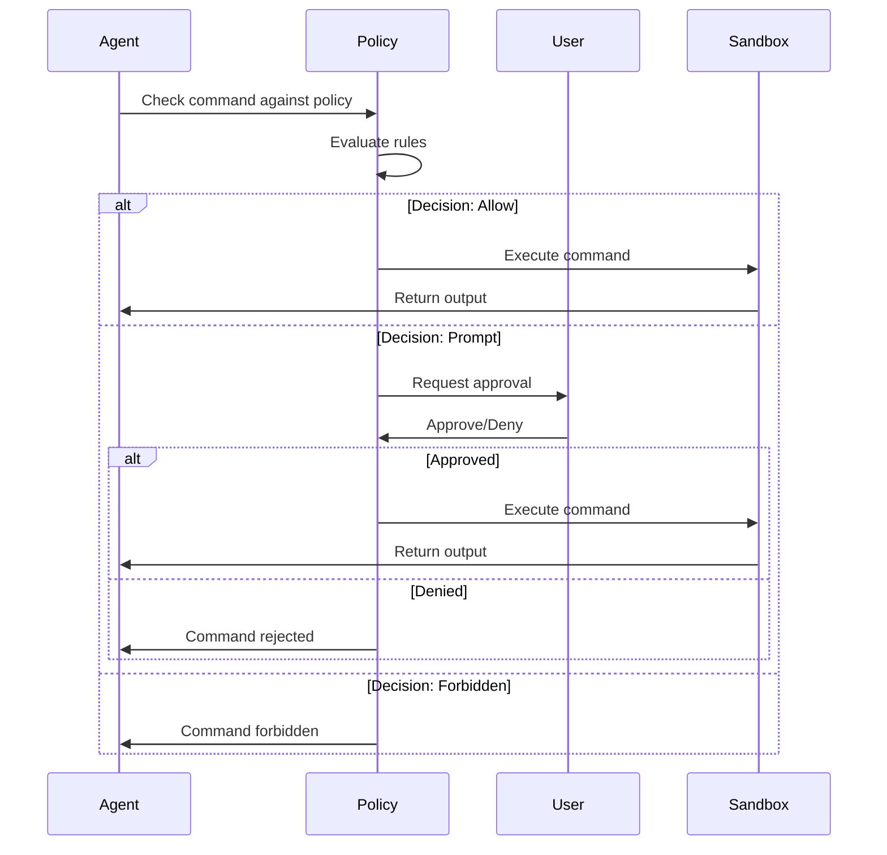
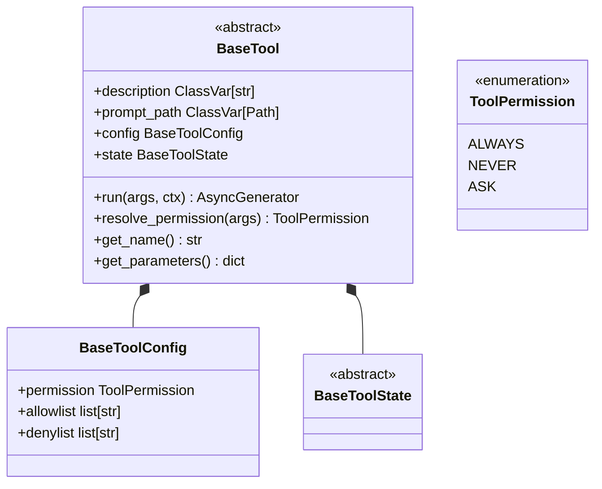
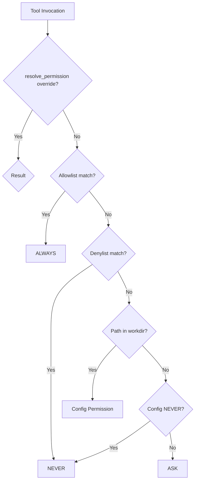

# Codex Builtin Tools Documentation

This document provides a comprehensive overview of the builtin tools available in the Codex system, including their interfaces, behaviors, parameters, and security features.

## Table of Contents

1. [Overview](#overview)
2. [Tool Categories](#tool-categories)
3. [Tool Specifications](#tool-specifications)
   - [Command Execution Tools](#command-execution-tools)
   - [File System Tools](#file-system-tools)
   - [Collaboration Tools](#collaboration-tools)
   - [Specialized Tools](#specialized-tools)
4. [Security Features](#security-features)
   - [Sandboxing](#sandboxing)
   - [Execution Policy](#execution-policy)
   - [Network Restrictions](#network-restrictions)
   - [Approval Workflows](#approval-workflows)
5. [Error Handling](#error-handling)
6. [Configuration](#configuration)

---

## Overview

The Codex system provides a set of builtin tools that enable AI agents to interact with the filesystem, execute commands, and collaborate on tasks. These tools are defined in [`codex-rs/core/src/tools/spec.rs`](codex-rs/core/src/tools/spec.rs) and are exposed through the OpenAI-compatible Responses API.

---

## Tool Categories

### 1. Command Execution Tools
- `shell` - Classic shell command execution
- `shell_command` - Shell command with login shell support
- `exec_command` - Unified exec with PTY support
- `write_stdin` - Write to running exec sessions

### 2. File System Tools
- `read_file` - Read files with indentation-aware modes
- `list_dir` - List directory contents
- `grep_files` - Search files by pattern
- `apply_patch` - Apply file patches (freeform or JSON)

### 3. Collaboration Tools
- `spawn_agent` - Spawn sub-agents for delegated tasks
- `send_input` - Send messages to agents
- `wait` - Wait for agent completion
- `close_agent` - Close an agent
- `resume_agent` - Resume a closed agent
- `request_user_input` - Request user input with options

### 4. Specialized Tools
- `js_repl` - JavaScript REPL with Node kernel
- `artifacts` - JavaScript artifact generation
- `view_image` - View local images
- `web_search` - Web search with caching/live access
- `image_generation` - Generate images
- `update_plan` - Update task plans
- `test_sync_tool` - Internal synchronization helper
- `spawn_agents_on_csv` - Batch agent spawning
- `report_agent_job_result` - Report job results
- `list_mcp_resources` - List MCP server resources
- `list_mcp_resource_templates` - List MCP resource templates
- `read_mcp_resource` - Read MCP resources
- `search_tool_bm25` - BM25 search for app tools

---

## Tool Specifications

### Command Execution Tools

#### `exec_command`

**Description:** Runs a command in a PTY, returning output or a session ID for ongoing interaction.

**Parameters:**
| Parameter | Type | Required | Description |
|-----------|------|----------|-------------|
| `cmd` | string | Yes | Shell command to execute |
| `workdir` | string | No | Working directory; defaults to turn cwd |
| `shell` | string | No | Shell binary; defaults to user's default shell |
| `tty` | boolean | No | Allocate a TTY (PTY); defaults to false |
| `yield_time_ms` | number | No | Wait time for output before yielding |
| `max_output_tokens` | number | No | Maximum tokens to return; excess truncated |
| `login` | boolean | No | Run with login shell semantics (-l/-i); defaults to true |
| `additionalPermissions` | object | No | Additional permission profile for sandbox override |

**Source:** [`codex-rs/core/src/tools/spec.rs:404-478`](codex-rs/core/src/tools/spec.rs:404)

**Behavior:**
- Executes commands via unified exec backend
- Supports streaming output via `command/exec/outputDelta` notifications
- PTY allocation enables TTY-aware process interaction
- Output is truncated to `max_output_tokens` if exceeded

---

#### `write_stdin`

**Description:** Writes characters to an existing unified exec session and returns recent output.

**Parameters:**
| Parameter | Type | Required | Description |
|-----------|------|----------|-------------|
| `session_id` | string | Yes | Identifier of the running unified exec session |
| `chars` | string | No | Bytes to write to stdin (may be empty to poll) |
| `yield_time_ms` | number | No | Wait time for output before yielding |
| `max_output_tokens` | number | No | Maximum tokens to return |

**Source:** [`codex-rs/core/src/tools/spec.rs:480-525`](codex-rs/core/src/tools/spec.rs:480)

**Behavior:**
- Used for interactive sessions initiated with `exec_command`
- Empty `chars` can be used to poll for output
- Requires `tty=true` in the original `exec_command` call

---

#### `shell`

**Description:** Runs a shell command and returns its output.

**Parameters:**
| Parameter | Type | Required | Description |
|-----------|------|----------|-------------|
| `command` | array of strings | Yes | Command to execute |
| `workdir` | string | No | Working directory |
| `timeout_ms` | number | No | Command timeout in milliseconds |
| `additionalPermissions` | object | No | Additional permission profile |

**Source:** [`codex-rs/core/src/tools/spec.rs:527-578`](codex-rs/core/src/tools/spec.rs:527)

**Behavior:**
- Classic shell tool using `execvp()` on Unix, `CreateProcessW()` on Windows
- Most commands should be prefixed with `["bash", "-lc"]`
- Does not support login shell semantics by default

---

#### `shell_command`

**Description:** Runs a shell command with login shell support.

**Parameters:**
| Parameter | Type | Required | Description |
|-----------|------|----------|-------------|
| `command` | string | Yes | Shell script to execute |
| `workdir` | string | No | Working directory |
| `timeout_ms` | number | No | Command timeout |
| `login` | boolean | No | Run with login shell semantics; defaults to true |
| `additionalPermissions` | object | No | Additional permission profile |

**Source:** [`codex-rs/core/src/tools/spec.rs:580-645`](codex-rs/core/src/tools/spec.rs:580)

**Behavior:**
- Supports login shell semantics via `login=true`
- Recommended for commands that need shell initialization

---

### File System Tools

#### `read_file`

**Description:** Reads a local file with 1-indexed line numbers, supporting slice and indentation-aware block modes.

**Parameters:**
| Parameter | Type | Required | Description |
|-----------|------|----------|-------------|
| `file_path` | string | Yes | Absolute path to the file |
| `offset` | number | No | Line number to start from (1-indexed) |
| `limit` | number | No | Maximum lines to return |
| `mode` | string | No | "slice" (default) or "indentation" |
| `indentation` | object | No | Indentation mode options |

**Indentation Options:**
| Parameter | Type | Description |
|-----------|------|-------------|
| `anchor_line` | number | Anchor line for indentation lookup |
| `max_levels` | number | Parent indentation levels to include |
| `include_siblings` | boolean | Include blocks with same indentation |
| `include_header` | boolean | Include doc comments above block |
| `max_lines` | number | Hard cap on lines in indentation mode |

**Source:** [`codex-rs/core/src/tools/spec.rs:1283-1384`](codex-rs/core/src/tools/spec.rs:1283)

---

#### `list_dir`

**Description:** Lists entries in a local directory with 1-indexed entry numbers and simple type labels.

**Parameters:**
| Parameter | Type | Required | Description |
|-----------|------|----------|-------------|
| `dir_path` | string | Yes | Absolute path to directory |
| `offset` | number | No | Entry number to start from (1-indexed) |
| `limit` | number | No | Maximum entries to return |
| `depth` | number | No | Maximum directory depth (1-indexed) |

**Source:** [`codex-rs/core/src/tools/spec.rs:1386-1430`](codex-rs/core/src/tools/spec.rs:1386)

---

#### `grep_files`

**Description:** Finds files whose contents match the pattern and lists them by modification time.

**Parameters:**
| Parameter | Type | Required | Description |
|-----------|------|----------|-------------|
| `pattern` | string | Yes | Regular expression pattern |
| `include` | string | No | Glob to limit files (e.g., `"*.rs"`) |
| `path` | string | No | Directory to search; defaults to session cwd |
| `limit` | number | No | Maximum file paths to return (default: 100) |

**Source:** [`codex-rs/core/src/tools/spec.rs:1192-1241`](codex-rs/core/src/tools/spec.rs:1192)

---

#### `apply_patch`

**Description:** Applies a patch to a file. Available in two modes:

**Freeform Mode:**
- Accepts raw patch text in unified diff format
- Grammar-validated input
- Source: [`codex-rs/core/src/tools/handlers/apply_patch.rs:289-301`](codex-rs/core/src/tools/handlers/apply_patch.rs:289)

**JSON Mode:**
- Structured JSON input with `input` field
- Source: [`codex-rs/core/src/tools/handlers/apply_patch.rs:302-325`](codex-rs/core/src/tools/handlers/apply_patch.rs:302)

---

### Collaboration Tools

#### `spawn_agent`

**Description:** Spawn a sub-agent for a well-scoped task. Returns the agent id to use for communication.

**Parameters:**
| Parameter | Type | Required | Description |
|-----------|------|----------|-------------|
| `message` | string | No | Initial task for the new agent |
| `items` | array | No | Structured input items |
| `agent_type` | string | No | Agent role type from configured roles |
| `fork_context` | boolean | No | Fork current thread history into new agent |

**Source:** [`codex-rs/core/src/tools/spec.rs:721-792`](codex-rs/core/src/tools/spec.rs:721)

**Guidelines:**
- Use for concrete, bounded sidecar tasks
- Prefer delegating work that can run in parallel
- Keep subtasks well-defined and self-contained
- Call `wait` sparingly; only when blocked on results

---

#### `send_input`

**Description:** Send a message to an existing agent.

**Parameters:**
| Parameter | Type | Required | Description |
|-----------|------|----------|-------------|
| `id` | string | Yes | Agent id from spawn_agent |
| `message` | string | No | Plain-text message |
| `items` | array | No | Structured input items |
| `interrupt` | boolean | No | Stop current task and handle immediately |

**Source:** [`codex-rs/core/src/tools/spec.rs:919-959`](codex-rs/core/src/tools/spec.rs:919)

---

#### `wait`

**Description:** Wait for agents to reach a final status.

**Parameters:**
| Parameter | Type | Required | Description |
|-----------|------|----------|-------------|
| `ids` | array of strings | Yes | Agent ids to wait on |
| `timeout_ms` | number | No | Timeout in milliseconds (default: configurable) |

**Source:** [`codex-rs/core/src/tools/spec.rs:984-1016`](codex-rs/core/src/tools/spec.rs:984)

---

#### `request_user_input`

**Description:** Request user input with predefined options.

**Parameters:**
| Parameter | Type | Required | Description |
|-----------|------|----------|-------------|
| `questions` | array | Yes | Questions to show the user |

**Question Schema:**
| Parameter | Type | Description |
|-----------|------|-------------|
| `id` | string | Stable identifier (snake_case) |
| `header` | string | Short label (≤12 chars) |
| `question` | string | Single-sentence prompt |
| `options` | array | 2-3 mutually exclusive choices |

**Option Schema:**
| Parameter | Type | Description |
|-----------|------|-------------|
| `label` | string | User-facing label (1-5 words) |
| `description` | string | Impact/tradeoff explanation |

**Source:** [`codex-rs/core/src/tools/spec.rs:1018-1101`](codex-rs/core/src/tools/spec.rs:1018)

---

### Specialized Tools

#### `js_repl`

**Description:** Runs JavaScript in a persistent Node kernel with top-level await. This is a **freeform tool** - send raw JavaScript source text.

**Input Format:**
```javascript
// codex-js-repl: timeout_ms=15000
const result = 2 + 2;
console.log(result);
```

**Parameters:** None (freeform input)

**Source:** [`codex-rs/core/src/tools/spec.rs:1432-1462`](codex-rs/core/src/tools/spec.rs:1432)

**Grammar:** Lark-based grammar that rejects JSON wrappers, quoted strings, and markdown fences.

---

#### `artifacts`

**Description:** Runs raw JavaScript against the Codex `@oai/artifact-tool` runtime for creating presentations or spreadsheets.

**Input Format:**
```javascript
// codex-artifacts: timeout_ms=15000
const { Presentation, PresentationFile } = globalThis;
const pres = new Presentation();
// ... build presentation
```

**Source:** [`codex-rs/core/src/tools/spec.rs:1464-1489`](codex-rs/core/src/tools/spec.rs:1464)

---

#### `view_image`

**Description:** View a local image from the filesystem.

**Parameters:**
| Parameter | Type | Required | Description |
|-----------|------|----------|-------------|
| `path` | string | Yes | Local filesystem path to image |

**Source:** [`codex-rs/core/src/tools/spec.rs:647-667`](codex-rs/core/src/tools/spec.rs:647)

---

#### `web_search`

**Description:** Search the web with configurable modes.

**Parameters:**
| Parameter | Type | Required | Description |
|-----------|------|----------|-------------|
| `query` | string | Yes | Search query |
| `search_context_size` | string | No | Context size: "low", "medium", "high" |
| `filters` | object | No | Search filters |
| `user_location` | object | No | User location data |
| `content_types` | array | No | Content types: "text", "image" |

**Modes:**
- `Cached` - Use cached search results
- `Live` - Real-time web search
- `Disabled` - No web search

**Source:** [`codex-rs/core/src/tools/spec.rs:1971-2004`](codex-rs/core/src/tools/spec.rs:1971)

---

#### `image_generation`

**Description:** Generate images.

**Parameters:**
| Parameter | Type | Required | Description |
|-----------|------|----------|-------------|
| `prompt` | string | Yes | Image generation prompt |
| `output_format` | string | Yes | Output format (e.g., "png") |

**Source:** [`codex-rs/core/src/tools/spec.rs:2006-2010`](codex-rs/core/src/tools/spec.rs:2006)

---

#### `update_plan`

**Description:** Update the task plan.

**Parameters:**
| Parameter | Type | Required | Description |
|-----------|------|----------|-------------|
| `plan` | array | Yes | Plan items |

**Source:** [`codex-rs/core/src/tools/handlers/plan.rs:22-50`](codex-rs/core/src/tools/handlers/plan.rs:22)

---

#### `test_sync_tool`

**Description:** Internal synchronization helper used by Codex integration tests.

**Parameters:**
| Parameter | Type | Required | Description |
|-----------|------|----------|-------------|
| `sleep_before_ms` | number | No | Delay before action |
| `sleep_after_ms` | number | No | Delay after action |
| `barrier` | object | No | Barrier synchronization |

**Source:** [`codex-rs/core/src/tools/spec.rs:1125-1190`](codex-rs/core/src/tools/spec.rs:1125)

---

#### `spawn_agents_on_csv`

**Description:** Process a CSV by spawning one worker sub-agent per row.

**Parameters:**
| Parameter | Type | Required | Description |
|-----------|------|----------|-------------|
| `csv_path` | string | Yes | Path to CSV file |
| `instruction` | string | Yes | Template with `{column}` placeholders |
| `id_column` | string | No | Column for stable item id |
| `output_csv_path` | string | No | Output CSV path |
| `max_concurrency` | number | No | Max concurrent workers (default: 16) |
| `max_workers` | number | No | Alias for max_concurrency |
| `max_runtime_seconds` | number | No | Max runtime per worker (default: 1800) |
| `output_schema` | object | No | Expected result schema |

**Source:** [`codex-rs/core/src/tools/spec.rs:794-868`](codex-rs/core/src/tools/spec.rs:794)

---

#### `report_agent_job_result`

**Description:** Worker-only tool to report a result for an agent job item.

**Parameters:**
| Parameter | Type | Required | Description |
|-----------|------|----------|-------------|
| `job_id` | string | Yes | Job identifier |
| `item_id` | string | Yes | Item identifier |
| `result` | object | Yes | Result object |
| `stop` | boolean | No | Cancel remaining items |

**Source:** [`codex-rs/core/src/tools/spec.rs:870-917`](codex-rs/core/src/tools/spec.rs:870)

---

#### MCP Resource Tools

##### `list_mcp_resources`
Lists resources provided by MCP servers.

**Parameters:**
| Parameter | Type | Required | Description |
|-----------|------|----------|-------------|
| `server` | string | No | Server name (omit for all) |
| `cursor` | string | No | Pagination cursor |

**Source:** [`codex-rs/core/src/tools/spec.rs:1506-1538`](codex-rs/core/src/tools/spec.rs:1506)

##### `list_mcp_resource_templates`
Lists parameterized resource templates from MCP servers.

**Parameters:**
| Parameter | Type | Required | Description |
|-----------|------|----------|-------------|
| `server` | string | No | Server name (omit for all) |
| `cursor` | string | No | Pagination cursor |

**Source:** [`codex-rs/core/src/tools/spec.rs:1540-1572`](codex-rs/core/src/tools/spec.rs:1540)

##### `read_mcp_resource`
Read a specific resource from an MCP server.

**Parameters:**
| Parameter | Type | Required | Description |
|-----------|------|----------|-------------|
| `server` | string | Yes | MCP server name |
| `uri` | string | Yes | Resource URI |

**Source:** [`codex-rs/core/src/tools/spec.rs:1574-1608`](codex-rs/core/src/tools/spec.rs:1574)

---

## Security Features

### Sandboxing

The Codex system implements multiple layers of sandboxing to protect the host system from potentially dangerous commands.

#### Sandbox Policies

**1. `ReadOnly`**
- Restricts filesystem access to read-only operations
- Network access is isolated
- Source: [`codex-rs/core/src/tools/spec.rs:428-435`](codex-rs/core/src/tools/spec.rs:428)

**2. `WorkspaceWrite`**
- Allows write access within the workspace directory
- Network access is isolated
- Source: [`codex-rs/core/src/tools/handlers/shell.rs:539-548`](codex-rs/core/src/tools/handlers/shell.rs:539)

**3. `DangerFullAccess`**
- Full filesystem and network access
- Used when user explicitly trusts the environment
- Source: [`codex-rs/core/src/tools/handlers/shell.rs:532-538`](codex-rs/core/src/tools/handlers/shell.rs:532)

**4. `ExternalSandbox`**
- Uses external sandboxing mechanisms
- Configuration-dependent behavior
- Source: [`codex-rs/core/src/tools/handlers/shell.rs:532-538`](codex-rs/core/src/tools/handlers/shell.rs:532)

#### Linux Sandbox Implementation

The Linux sandbox uses a multi-stage approach:

**Stage 1: Bubblewrap (bwrap)**
- Creates isolated filesystem view
- Mounts minimal `/proc`
- Source: [`codex-rs/linux-sandbox/src/linux_run_main.rs:157-187`](codex-rs/linux-sandbox/src/linux_run_main.rs:157)

**Stage 2: Seccomp + no_new_privs**
- Applies syscall filtering
- Prevents privilege escalation
- Source: [`codex-rs/linux-sandbox/src/linux_run_main.rs:118-141`](codex-rs/linux-sandbox/src/linux_run_main.rs:118)

**Stage 3: Landlock (fallback)**
- Legacy filesystem sandboxing
- Applied when bwrap is not enabled
- Source: [`codex-rs/linux-sandbox/src/linux_run_main.rs:189-200`](codex-rs/linux-sandbox/src/linux_run_main.rs:189)

**Source:** [`codex-rs/linux-sandbox/src/linux_run_main.rs:82-200`](codex-rs/linux-sandbox/src/linux_run_main.rs:82)

---

### Execution Policy

The execution policy system provides fine-grained control over command execution through rule-based policies.

#### Policy Rules

**1. `prefix_rule`**
Matches commands by prefix and applies decisions.

```starlark
prefix_rule(
    pattern = ["python3", "-c"],
    decision = "prompt",
    justification = "Python code execution requires review"
)
```

**2. `forbidden` decision**
Completely blocks matching commands.

```starlark
prefix_rule(
    pattern = ["rm", "-rf"],
    decision = "forbidden",
    justification = "Destructive command blocked"
)
```

**3. `prompt` decision**
Requires user approval before execution.

```starlark
prefix_rule(
    pattern = ["python3"],
    decision = "prompt"
)
```

**4. `allow` decision**
Automatically approves matching commands.

```starlark
prefix_rule(
    pattern = ["ls"],
    decision = "allow"
)
```

**5. `host_executable`**
Defines host executables with allowed paths.

```starlark
host_executable(
    name = "git",
    paths = ["/usr/bin/git"]
)
```

**6. Network Rules**
Control network access for commands.

```starlark
network_rule(
    host = "blocked.example.com",
    protocol = "https",
    decision = "forbidden"
)
```

**Source:** [`codex-rs/core/src/exec_policy.rs:1-300`](codex-rs/core/src/exec_policy.rs:1)

#### Policy Evaluation

The policy evaluation process:

1. **Parse shell commands** - Extract individual commands from `bash -lc` scripts
2. **Match rules** - Check against prefix rules and heuristics
3. **Apply fallback** - Use heuristic-based decisions for unmatched commands
4. **Determine action** - Allow, prompt, or forbid

**Source:** [`codex-rs/core/src/exec_policy.rs:199-281`](codex-rs/core/src/exec_policy.rs:199)

#### Heuristic Analysis

The system includes heuristic analysis to detect potentially dangerous commands:

**Dangerous Command Detection:**
- Commands flagged as inherently risky
- Scripts with embedded dangerous operations
- Commands that might bypass sandboxing

**Safe Command Detection:**
- Known-safe commands (e.g., `ls`, `cat`)
- Read-only operations
- Commands with limited impact

**Source:** [`codex-rs/core/src/exec_policy.rs:486-566`](codex-rs/core/src/exec_policy.rs:486)

---

### Network Restrictions

#### Network Sandbox Modes

**1. Isolated Networking**
- No network access by default
- Commands cannot make outbound connections
- Source: [`codex-rs/linux-sandbox/src/linux_run_main.rs:143-155`](codex-rs/linux-sandbox/src/linux_run_main.rs:143)

**2. Proxy-Only Networking**
- Network access through managed proxy
- Routes controlled by proxy routing spec
- Source: [`codex-rs/linux-sandbox/src/linux_run_main.rs:121-128`](codex-rs/linux-sandbox/src/linux_run_main.rs:121)

**3. Full Network Access**
- Unrestricted network access
- Used with `DangerFullAccess` sandbox policy
- Source: [`codex-rs/core/src/tools/handlers/shell.rs:532-538`](codex-rs/core/src/tools/handlers/shell.rs:532)

#### Network Policy Rules

Network rules can be defined in exec policy:

```starlark
network_rule(
    host = "api.example.com",
    protocol = "https",
    decision = "allow"
)
```

**Source:** [`codex-rs/core/src/exec_policy.rs:17-23`](codex-rs/core/src/exec_policy.rs:17)

---

### Approval Workflows

#### Approval Policies

**1. `Never`**
- No approval prompts
- Commands run based on sandbox policy
- Source: [`codex-rs/core/src/exec_policy.rs:112`](codex-rs/core/src/exec_policy.rs:112)

**2. `OnFailure`**
- Only prompt on command failure
- Allows successful commands to run silently
- Source: [`codex-rs/core/src/exec_policy.rs:113`](codex-rs/core/src/exec_policy.rs:113)

**3. `OnRequest`**
- Prompt for commands requiring approval
- Respects sandbox policy for safe commands
- Source: [`codex-rs/core/src/exec_policy.rs:114`](codex-rs/core/src/exec_policy.rs:114)

**4. `UnlessTrusted`**
- Prompt for untrusted commands
- Allow known-safe commands without prompting
- Source: [`codex-rs/core/src/exec_policy.rs:115`](codex-rs/core/src/exec_policy.rs:115)

**5. `Reject`**
- Explicitly reject certain approvals
- Can reject rules approval or sandbox approval
- Source: [`codex-rs/core/src/exec_policy.rs:116-128`](codex-rs/core/src/exec_policy.rs:116)

#### Approval Request Flow



**Source:** [`codex-rs/core/src/exec_policy.rs:243-280`](codex-rs/core/src/exec_policy.rs:243)

#### Proposed Amendments

When a command requires approval, the system can propose an exec policy amendment:

```rust
ExecApprovalRequirement::NeedsApproval {
    reason: Some("`python3 script.py` requires approval"),
    proposed_execpolicy_amendment: Some(ExecPolicyAmendment::new(vec!["python3".to_string()])),
}
```

This allows users to add the command prefix to their policy for future automatic approval.

**Source:** [`codex-rs/core/src/exec_policy.rs:586-636`](codex-rs/core/src/exec_policy.rs:586)

---

## Error Handling

### Error Types

**1. `InvalidParamsError`**
- Invalid parameter values
- Example: `command/exec cannot set both timeoutMs and disableTimeout`

**2. `InvalidRequestError`**
- Invalid request structure
- Example: `no active command/exec for process id "proc-1"`

**3. `ExecPolicyError`**
- Policy parsing or loading failures
- Includes file read errors and parse errors

**4. `SandboxError`**
- Sandbox setup failures
- Includes bwrap and landlock errors

**Source:** [`codex-rs/core/src/exec_policy.rs:132-166`](codex-rs/core/src/exec_policy.rs:132)

### Error Messages

Common error messages include:

| Error | Description |
|-------|-------------|
| `command/exec tty or streaming requires a client-supplied processId` | TTY/streaming requires explicit process ID |
| `streaming command/exec is not supported with windows sandbox` | Streaming incompatible with Windows sandbox |
| `stdin is closed for this session; rerun exec_command with tty=true` | Cannot write to closed stdin |
| `command/exec "proc-1" is no longer running` | Process has terminated |
| `no active command/exec for process id "shared-process"` | Process ID not found |

---

## Configuration

### Tool Configuration

Tools can be enabled/disabled via configuration:

```toml
[features]
# Enable specific tools
js_repl = true
collab = true
apply_patch_freeform = true
```

### Shell Type Configuration

```toml
[shell]
# Options: default, local, unified_exec, shell_command, disabled
type = "unified_exec"
```

### Sandbox Policy Configuration

```toml
[sandbox]
# Options: read_only, workspace_write, danger_full_access, external_sandbox
policy = "read_only"
```

### Approval Policy Configuration

```toml
[approval]
# Options: never, on_failure, on_request, unless_trusted, reject
ask_for = "on_request"
```

**Source:** [`codex-rs/core/src/tools/spec.rs:54-77`](codex-rs/core/src/tools/spec.rs:54)

---

## Appendix: Tool Registry

The tool registry maps tool names to their handlers:

| Tool Name | Handler | Supports Parallel |
|-----------|---------|-------------------|
| `shell` | `ShellHandler` | Yes |
| `container.exec` | `ShellHandler` | Yes |
| `local_shell` | `ShellHandler` | Yes |
| `shell_command` | `ShellCommandHandler` | Yes |
| `exec_command` | `UnifiedExecHandler` | Yes |
| `write_stdin` | `UnifiedExecHandler` | No |
| `update_plan` | `PlanHandler` | No |
| `apply_patch` | `ApplyPatchHandler` | No |
| `view_image` | `ViewImageHandler` | Yes |
| `js_repl` | `JsReplHandler` | No |
| `js_repl_reset` | `JsReplResetHandler` | No |
| `artifacts` | `ArtifactsHandler` | No |
| `spawn_agent` | `MultiAgentHandler` | No |
| `send_input` | `MultiAgentHandler` | No |
| `wait` | `MultiAgentHandler` | No |
| `close_agent` | `MultiAgentHandler` | No |
| `resume_agent` | `MultiAgentHandler` | No |
| `request_user_input` | `RequestUserInputHandler` | No |
| `grep_files` | `GrepFilesHandler` | Yes |
| `read_file` | `ReadFileHandler` | Yes |
| `list_dir` | `ListDirHandler` | Yes |
| `test_sync_tool` | `TestSyncHandler` | Yes |
| `list_mcp_resources` | `McpResourceHandler` | Yes |
| `list_mcp_resource_templates` | `McpResourceHandler` | Yes |
| `read_mcp_resource` | `McpResourceHandler` | Yes |

**Source:** [`codex-rs/core/src/tools/spec.rs:1803-2080`](codex-rs/core/src/tools/spec.rs:1803)

---

## References

- [Tool Specification Source](codex-rs/core/src/tools/spec.rs)
- [Shell Handler Source](codex-rs/core/src/tools/handlers/shell.rs)
- [Exec Policy Source](codex-rs/core/src/exec_policy.rs)
- [Linux Sandbox Source](codex-rs/linux-sandbox/src/linux_run_main.rs)
- [App Server Protocol](codex-rs/app-server-protocol/src/protocol/v2.rs)

# Hermes Agent Builtin Tools Documentation

## Overview

This document provides comprehensive documentation of all builtin tools in the Hermes Agent system. Tools are implemented in the [`tools/`](tools/) directory and registered via the central [`ToolRegistry`](tools/registry.py:1) singleton pattern.

---

## Tool Registration System

### Architecture

All tools follow a consistent registration pattern:

```python
# tools/example_tool.py
from tools.registry import registry

def check_example_requirements() -> bool:
    """Check if required API keys/dependencies are available."""
    return bool(os.getenv("EXAMPLE_API_KEY"))

def example_tool(param: str, task_id: str = None) -> str:
    """Execute the tool and return JSON string result."""
    try:
        result = {"success": True, "data": "..."}
        return json.dumps(result, ensure_ascii=False)
    except Exception as e:
        return json.dumps({"error": str(e)}, ensure_ascii=False)

EXAMPLE_SCHEMA = {
    "name": "example_tool",
    "description": "Does something useful.",
    "parameters": {
        "type": "object",
        "properties": {
            "param": {"type": "string", "description": "The parameter"}
        },
        "required": ["param"]
    }
}

registry.register(
    name="example_tool",
    toolset="example",
    schema=EXAMPLE_SCHEMA,
    handler=lambda args, **kw: example_tool(
        param=args.get("param", ""), task_id=kw.get("task_id")),
    check_fn=check_example_requirements,
)
```

### Key Components

| Component | File | Description |
|-----------|------|-------------|
| [`ToolRegistry`](tools/registry.py:1) | [`tools/registry.py`](tools/registry.py:1) | Central singleton collecting all tool schemas, handlers, and metadata |
| [`model_tools.py`](model_tools.py:1) | [`model_tools.py`](model_tools.py:1) | Thin orchestration layer that imports all tool modules to trigger registration |
| [`task_id`](tools/registry.py:1) | Per-task isolation | All tools accept optional `task_id` parameter for sandbox/session isolation |

---

## Core Tools

### Terminal Tool

**File**: [`tools/terminal_tool.py`](tools/terminal_tool.py:1)

The terminal tool provides command execution through multiple backend environments.

#### Interface

```python
def terminal(
    command: str,
    background: bool = False,
    check_interval: int = 1,
    pty: bool = False,
    timeout: int = None,
    task_id: str = None
) -> str
```

#### Parameters

| Parameter | Type | Description |
|-----------|------|-------------|
| `command` | `str` | Shell command to execute |
| `background` | `bool` | Run as background process (default: `False`) |
| `check_interval` | `int` | Seconds between output checks for background processes (default: `1`) |
| `pty` | `bool` | Use pseudo-terminal for interactive CLI tools (default: `False`) |
| `timeout` | `int` | Command timeout in seconds (default: from `TERMINAL_TIMEOUT` env, max 180s) |
| `task_id` | `str` | Task/sandbox isolation key |

#### Return Format

**Success**:
```json
{
    "success": true,
    "output": "...",
    "exit_code": 0,
    "duration_seconds": 1.23
}
```

**Error**:
```json
{
    "success": false,
    "error": "Error message",
    "exit_code": 1
}
```

#### Environment Backends

| Backend | Config | Description |
|---------|--------|-------------|
| `local` | `TERMINAL_ENV=local` | Direct host execution (fastest) |
| `docker` | `TERMINAL_ENV=docker` | Containerized with configurable resources |
| `singularity` | `TERMINAL_ENV=singularity` | HPC container format |
| `modal` | `TERMINAL_ENV=modal` | Cloud sandbox with ephemeral disk |
| `daytona` | `TERMINAL_ENV=daytona` | Cloud development environment |
| `ssh` | `TERMINAL_ENV=ssh` | Remote host execution |

#### Security Features

See [Security Features](#security-features) section for detailed dangerous command detection.

---

### Web Search & Extract Tools

**File**: [`tools/web_tools.py`](tools/web_tools.py:1)

#### web_search

```python
def web_search(
    query: str,
    max_results: int = 5,
    task_id: str = None
) -> str
```

**Parameters**:
- `query` (str): Search query string
- `max_results` (int): Number of results (default: 5, max: 10)
- `task_id` (str): Task isolation key

**Description**: Search the web using Firecrawl, returns LLM-summarized results.

**Return**:
```json
{
    "success": true,
    "results": [
        {
            "title": "Result title",
            "url": "https://example.com",
            "content": "LLM-summarized content..."
        }
    ]
}
```

#### web_extract

```python
def web_extract(
    url: str,
    task_id: str = None
) -> str
```

**Parameters**:
- `url` (str): URL to extract content from
- `task_id` (str): Task isolation key

**Description**: Extract and summarize web page content using Gemini 3 Flash Preview.

**Return**:
```json
{
    "success": true,
    "content": "Summarized content...",
    "url": "https://example.com",
    "title": "Page title"
}
```

#### Environment Requirements

- `FIRECRAWL_API_KEY`: Required for both tools
- `FIRECRAWL_API_URL`: Optional self-hosted endpoint

---

### File Operations

**File**: [`tools/file_operations.py`](tools/file_operations.py:1)

#### read_file

```python
def read_file(
    path: str,
    max_chars: int = 50000,
    line_numbers: bool = False,
    task_id: str = None
) -> str
```

**Parameters**:
- `path` (str): File path to read
- `max_chars` (int): Maximum characters to return (default: 50000)
- `line_numbers` (bool): Include line numbers (default: `False`)
- `task_id` (str): Task isolation key

**Return**:
```json
{
    "success": true,
    "content": "...",
    "path": "/path/to/file",
    "line_count": 100
}
```

#### write_file

```python
def write_file(
    path: str,
    content: str,
    append: bool = False,
    task_id: str = None
) -> str
```

**Parameters**:
- `path` (str): File path to write
- `content` (str): Content to write
- `append` (bool): Append to existing file (default: `False`)
- `task_id` (str): Task isolation key

**Return**:
```json
{
    "success": true,
    "path": "/path/to/file",
    "bytes_written": 1234
}
```

#### search_files

```python
def search_files(
    path: str,
    pattern: str,
    max_results: int = 50,
    task_id: str = None
) -> str
```

**Parameters**:
- `path` (str): Search root directory
- `pattern` (str): Regex pattern to match
- `max_results` (int): Maximum results (default: 50)
- `task_id` (str): Task isolation key

**Return**:
```json
{
    "success": true,
    "matches": [
        {"path": "/path/to/file", "line": 42, "content": "..."}
    ]
}
```

#### patch

```python
def patch(
    path: str,
    replacements: list,
    task_id: str = None
) -> str
```

**Parameters**:
- `path` (str): File path to patch
- `replacements` (list): List of `{"old_text": "...", "new_text": "..."}` dicts
- `task_id` (str): Task isolation key

**Return**:
```json
{
    "success": true,
    "path": "/path/to/file",
    "replacements_made": 3
}
```

#### fuzzy_match

```python
def fuzzy_match(
    path: str,
    pattern: str,
    max_results: int = 10,
    task_id: str = None
) -> str
```

**Parameters**:
- `path` (str): File path to search
- `pattern` (str): Pattern to fuzzy match
- `max_results` (int): Maximum results (default: 10)
- `task_id` (str): Task isolation key

**Return**:
```json
{
    "success": true,
    "matches": [
        {"line": 42, "content": "...", "match_start": 10, "match_end": 15}
    ]
}
```

---

### Code Execution Tool

**File**: [`tools/code_execution_tool.py`](tools/code_execution_tool.py:1)

#### execute_code

```python
def execute_code(
    code: str,
    language: str = "python",
    timeout: int = 300,
    max_tool_calls: int = 50,
    task_id: str = None
) -> str
```

**Parameters**:
- `code` (str): Code to execute
- `language` (str): Programming language (default: `python`)
- `timeout` (int): Execution timeout in seconds (default: 300)
- `max_tool_calls` (int): Maximum tool calls allowed (default: 50)
- `task_id` (str): Task isolation key

**Description**: Executes code in a sandboxed child process via RPC over Unix domain socket.

**Allowed Tools** (7 max):
- `web_search`
- `web_extract`
- `read_file`
- `write_file`
- `search_files`
- `patch`
- `terminal`

**Return**:
```json
{
    "success": true,
    "output": "...",
    "exit_code": 0,
    "duration_seconds": 1.23
}
```

**Security**:
- Environment variable filtering (no KEY, TOKEN, SECRET, PASSWORD, CREDENTIAL, PASSWD, AUTH)
- Tool allowlist (7 tools max)
- Tool call limits (default 50)
- Timeout enforcement (default 300s)
- Blocked terminal parameters (background, check_interval, pty)

---

### Image Generation Tool

**File**: [`tools/image_generation_tool.py`](tools/image_generation_tool.py:1)

#### generate_image

```python
def generate_image(
    prompt: str,
    negative_prompt: str = None,
    width: int = 1024,
    height: 1024,
    task_id: str = None
) -> str
```

**Parameters**:
- `prompt` (str): Image generation prompt
- `negative_prompt` (str): What to exclude (optional)
- `width` (int): Image width (default: 1024)
- `height` (int): Image height (default: 1024)
- `task_id` (str): Task isolation key

**Description**: Generates images using FAL.ai FLUX 2 Pro model with automatic 2x upscaling.

**Return**:
```json
{
    "success": true,
    "image_url": "https://...",
    "image_path": "/path/to/cache/image.png",
    "width": 2048,
    "height": 2048
}
```

**Environment Requirements**:
- `FAL_KEY`: Required for FAL.ai API

---

### Vision Analysis Tool

**File**: [`tools/vision_tools.py`](tools/vision_tools.py:1)

#### analyze_image

```python
def analyze_image(
    image_path: str,
    question: str = None,
    task_id: str = None
) -> str
```

**Parameters**:
- `image_path` (str): Path to image file or URL
- `question` (str): Specific question about the image (optional)
- `task_id` (str): Task isolation key

**Description**: Analyzes images using Gemini 3 Flash Preview via OpenRouter.

**Return**:
```json
{
    "success": true,
    "analysis": "Detailed analysis of the image...",
    "image_path": "/path/to/image"
}
```

**Environment Requirements**:
- `OPENROUTER_API_KEY`: Required for vision processing

---

### Task Management Tools

#### todo

**File**: [`tools/todo_tool.py`](tools/todo_tool.py:1)

```python
def todo(
    action: str,
    task: str = None,
    task_id: str = None
) -> str
```

**Parameters**:
- `action` (str): One of `add`, `list`, `update`, `complete`, `cancel`
- `task` (str): Task description (required for `add`)
- `task_id` (str): Task isolation key

**Actions**:
- `add`: Add new task to list
- `list`: List all tasks with status
- `update`: Update task status
- `complete`: Mark task as completed
- `cancel`: Cancel task

**Return**:
```json
{
    "success": true,
    "tasks": [
        {"id": 1, "description": "...", "status": "pending"}
    ]
}
```

#### memory

**File**: [`tools/memory_tool.py`](tools/memory_tool.py:1)

```python
def memory(
    action: str,
    content: str = None,
    task_id: str = None
) -> str
```

**Parameters**:
- `action` (str): One of `add`, `get`, `clear`, `search`
- `content` (str): Content to add or search query
- `task_id` (str): Task isolation key

**Description**: Persistent file-backed memory storage (MEMORY.md, USER.md).

**Security**:
- 12 threat patterns for prompt injection and exfiltration detection
- Invisible unicode character detection
- Atomic file writes with temp-file + rename

**Return**:
```json
{
    "success": true,
    "memory_entries": [...],
    "total_entries": 5
}
```

---

### Skills System

**File**: [`tools/skills_tool.py`](tools/skills_tool.py:1)

#### skills_categories

```python
def skills_categories() -> str
```

**Description**: List available skill categories.

**Return**:
```json
{
    "success": true,
    "categories": ["mlops", "github", "domain", ...]
}
```

#### skills_list

```python
def skills_list(category: str = None) -> str
```

**Parameters**:
- `category` (str): Filter by category (optional)

**Description**: List skills with descriptions (progressive disclosure level 2).

**Return**:
```json
{
    "success": true,
    "skills": [
        {"name": "axolotl", "description": "...", "category": "mlops"}
    ]
}
```

#### skill_view

```python
def skill_view(name: str) -> str
```

**Parameters**:
- `name` (str): Skill name to view

**Description**: Full skill content with linked files (progressive disclosure level 3).

**Return**:
```json
{
    "success": true,
    "skill": {
        "name": "axolotl",
        "description": "...",
        "content": "...",
        "tags": [...],
        "linked_files": [...]
    }
}
```

**Platform Filtering**: Skills with `platforms` frontmatter field are automatically excluded on incompatible platforms (macos/linux/windows).

---

### Clarification Tool

**File**: [`tools/clarify_tool.py`](tools/clarify_tool.py:1)

#### clarify

```python
def clarify(
    question: str,
    options: list = None,
    task_id: str = None
) -> str
```

**Parameters**:
- `question` (str): Question to ask user
- `options` (list): Multiple choice options (optional)
- `task_id` (str): Task isolation key

**Description**: Asks user for clarification before proceeding.

**Return**:
```json
{
    "success": true,
    "awaiting_user_response": true,
    "question": "What would you like to do?"
}
```

---

### Task Delegation Tool

**File**: [`tools/delegate_tool.py`](tools/delegate_tool.py:1)

#### delegate_task

```python
def delegate_task(
    task: str,
    max_iterations: int = 30,
    depth: int = 1,
    blocked_tools: list = None,
    task_id: str = None
) -> str
```

**Parameters**:
- `task` (str): Task description for subagent
- `max_iterations` (int): Max iterations for subagent (default: 30)
- `depth` (int): Delegation depth (default: 1, max: 2)
- `blocked_tools` (list): Tools to block in subagent (optional)
- `task_id` (str): Task isolation key

**Description**: Creates a subagent to handle complex tasks.

**Return**:
```json
{
    "success": true,
    "subagent_task_id": "sub_abc123",
    "result": "Subagent result..."
}
```

---

### Voice Tools

#### transcription

**File**: [`tools/transcription_tools.py`](tools/transcription_tools.py:1)

```python
def transcription(
    audio_path: str,
    task_id: str = None
) -> str
```

**Parameters**:
- `audio_path` (str): Path to audio file
- `task_id` (str): Task isolation key

**Description**: Transcribes audio using OpenAI Whisper API.

**Supported Formats**: `.mp3`, `.wav`, `.m4a`, `.flac`, `.ogg`

**File Limit**: 25MB

**Return**:
```json
{
    "success": true,
    "transcription": "Transcribed text...",
    "duration_seconds": 120
}
```

#### tts

**File**: [`tools/tts_tool.py`](tools/tts_tool.py:1)

```python
def tts(
    text: str,
    voice: str = "alloy",
    provider: str = "edge",
    task_id: str = None
) -> str
```

**Parameters**:
- `text` (str): Text to convert to speech
- `voice` (str): Voice selection (default: `alloy`)
- `provider` (str): Provider: `edge`, `elevenlabs`, `openai` (default: `edge`)
- `task_id` (str): Task isolation key

**Return**:
```json
{
    "success": true,
    "audio_path": "/path/to/audio.opus",
    "format": "opus"
}
```

**Environment Requirements**:
- `VOICE_TOOLS_OPENAI_KEY`: Required for OpenAI TTS
- `ELEVENLABS_API_KEY`: Required for ElevenLabs

---

### Browser Automation Tools

**File**: [`tools/browser_tool.py`](tools/browser_tool.py:1)

#### browser_navigate

```python
def browser_navigate(url: str, task_id: str = None) -> str
```

**Parameters**:
- `url` (str): URL to navigate to
- `task_id` (str): Task isolation key

#### browser_snapshot

```python
def browser_snapshot(full: bool = False, task_id: str = None) -> str
```

**Parameters**:
- `full` (bool): Return complete page content (default: `False`)
- `task_id` (str): Task isolation key

#### browser_click

```python
def browser_click(ref: str, task_id: str = None) -> str
```

**Parameters**:
- `ref` (str): Element reference from snapshot (e.g., `@e5`)
- `task_id` (str): Task isolation key

#### browser_type

```python
def browser_type(ref: str, text: str, task_id: str = None) -> str
```

**Parameters**:
- `ref` (str): Element reference
- `text` (str): Text to type
- `task_id` (str): Task isolation key

#### browser_scroll

```python
def browser_scroll(direction: str, task_id: str = None) -> str
```

**Parameters**:
- `direction` (str): `up` or `down`
- `task_id` (str): Task isolation key

#### browser_back

```python
def browser_back(task_id: str = None) -> str
```

#### browser_press

```python
def browser_press(key: str, task_id: str = None) -> str
```

**Parameters**:
- `key` (str): Key to press (e.g., `Enter`, `Tab`, `Escape`)
- `task_id` (str): Task isolation key

#### browser_close

```python
def browser_close(task_id: str = None) -> str
```

#### browser_get_images

```python
def browser_get_images(task_id: str = None) -> str
```

#### browser_vision

```python
def browser_vision(question: str, task_id: str = None) -> str
```

**Parameters**:
- `question` (str): Visual question about the page
- `task_id` (str): Task isolation key

**Description**: Takes screenshot and analyzes with vision AI.

**Environment Requirements**:
- `BROWSERBASE_API_KEY` + `BROWSERBASE_PROJECT_ID`: Cloud mode (Browserbase)
- Local mode: Default (headless Chromium via agent-browser)

---

### MCP (Model Context Protocol) Tools

**File**: [`tools/mcp_tool.py`](tools/mcp_tool.py:1)

MCP tools are dynamically discovered from configured MCP servers.

#### Configuration

```yaml
# ~/.hermes/config.yaml
mcp_servers:
  filesystem:
    command: "npx"
    args: ["-y", "@modelcontextprotocol/server-filesystem", "/tmp"]
    env: {}
    timeout: 120
    connect_timeout: 60
  github:
    command: "npx"
    args: ["-y", "@modelcontextprotocol/server-github"]
    env:
      GITHUB_PERSONAL_ACCESS_TOKEN: "ghp_..."
  remote_api:
    url: "https://my-mcp-server.example.com/mcp"
    headers:
      Authorization: "Bearer sk-..."
    timeout: 180
```

**Features**:
- Stdio transport (command + args) and HTTP/StreamableHTTP transport (url)
- Automatic reconnection with exponential backoff (up to 5 retries)
- Environment variable filtering for security
- Credential stripping in error messages

**Security**:
- Only safe environment variables passed to subprocesses (PATH, HOME, USER, LANG, LC_ALL, TERM, SHELL, TMPDIR, XDG_*)
- Credential patterns redacted from error messages (GitHub PAT, API keys, Bearer tokens)

---

### Cronjob Tools

**File**: [`tools/cronjob_tools.py`](tools/cronjob_tools.py:1)

#### schedule_cronjob

```python
def schedule_cronjob(
    prompt: str,
    schedule: str,
    name: str = None,
    repeat: int = None,
    deliver: str = None,
    task_id: str = None
) -> str
```

**Parameters**:
- `prompt` (str): Complete, self-contained instructions (CRITICAL: no context from current conversation)
- `schedule` (str): Schedule format:
  - One-shot: `"30m"`, `"2h"`, `"1d"` (runs once after delay)
  - Interval: `"every 30m"`, `"every 2h"` (recurring)
  - Cron: `"0 9 * * *"` (cron expression)
  - Timestamp: `"2026-02-03T14:00:00"` (specific date/time)
- `name` (str): Optional human-friendly name
- `repeat` (int): How many times to run (omit for default: once for one-shot, forever for recurring)
- `deliver` (str): Output destination: `origin`, `local`, `telegram`, `discord`, `telegram:123456`
- `task_id` (str): Task isolation key

**Security**:
- 10 critical threat patterns scanned (prompt injection, exfiltration, destructive operations)
- Invisible unicode character detection

#### list_cronjobs

```python
def list_cronjobs(include_disabled: bool = False, task_id: str = None) -> str
```

**Parameters**:
- `include_disabled` (bool): Include disabled/completed jobs (default: `False`)
- `task_id` (str): Task isolation key

#### remove_cronjob

```python
def remove_cronjob(job_id: str, task_id: str = None) -> str
```

**Parameters**:
- `job_id` (str): Job ID from list_cronjobs output
- `task_id` (str): Task isolation key

---

### Process Registry Tools

**File**: [`tools/process_registry.py`](tools/process_registry.py:1)

Background process management for terminal tool.

#### process (action: list)

```json
{
    "success": true,
    "processes": [
        {
            "session_id": "proc_abc123",
            "command": "pytest -v tests/",
            "status": "running",
            "pid": 12345,
            "uptime_seconds": 120
        }
    ]
}
```

#### process (action: poll)

```json
{
    "session_id": "proc_abc123",
    "command": "pytest -v tests/",
    "status": "running",
    "pid": 12345,
    "uptime_seconds": 120,
    "output_preview": "..."
}
```

#### process (action: log)

```json
{
    "session_id": "proc_abc123",
    "status": "running",
    "output": "Full output...",
    "total_lines": 100,
    "showing": "200 lines"
}
```

#### process (action: wait)

```json
{
    "status": "exited",
    "exit_code": 0,
    "output": "Final output...",
    "duration_seconds": 180
}
```

#### process (action: kill)

```json
{
    "success": true,
    "message": "Process killed"
}
```

#### process (action: write)

```json
{
    "success": true,
    "message": "Input sent"
}
```

#### process (action: submit)

```json
{
    "success": true,
    "message": "Input + Enter sent"
}
```

---

## Security Features

### Dangerous Command Detection

**File**: [`tools/approval.py`](tools/approval.py:1)

The terminal tool includes comprehensive dangerous command detection with 48 regex patterns.

#### Detection Patterns

| Category | Patterns |
|----------|----------|
| **File System Destruction** | `rm -rf /`, `rm -r`, `chmod 777`, `mkfs`, `dd if=/dev/zero`, `truncate -s 0` |
| **Permission Escalation** | `chown root`, `chmod u+s`, `chmod g+s`, `visudo`, `/etc/sudoers` |
| **SQL Injection** | `DROP TABLE`, `DELETE FROM` without WHERE, `TRUNCATE TABLE`, `ALTER TABLE` |
| **Process Killing** | `kill -9 -1`, `pkill -9`, `killall -9`, `kill -15 -1` |
| **Fork Bombs** | `:(){:|:&};:`, `fork(){fork(){fork()` |
| **Remote Code Execution** | `curl \| bash`, `wget \| sh`, `tee /etc/`, `nc -e`, `bash -i` |
| **System Service Control** | `systemctl stop`, `systemctl disable`, `systemctl mask` |
| **Network Attacks** | `nmap`, `masscan`, `netcat`, `socat` with exec |
| **Credential Access** | `cat /etc/shadow`, `cat /etc/passwd`, `find /root -name "*.pem"` |
| **Data Wiping** | `shred`, `wipefs`, `dd if=/dev/urandom` |

#### Approval Flow

**CLI Mode**:
```
⚠️  Potentially dangerous command detected: recursive delete
    rm -rf /tmp/test

    [o]nce  |  [s]ession  |  [a]lways  |  [d]eny
    Choice [o/s/a/D]: 
```

**Gateway Mode**:
- Command is blocked with explanation
- Agent explains the command was blocked for safety
- User must add the pattern to their allowlist via `hermes config edit`

#### Approval Modes

| Mode | Behavior |
|------|----------|
| `once` | Approve this specific command for this turn only |
| `session` | Approve for current session (until reset) |
| `always` | Add to permanent allowlist in `~/.hermes/config.yaml` |
| `deny` | Block the command |

#### Environment-Based Bypass

Dangerous command approval is **bypassed** for sandboxed backends:
- `docker`
- `singularity`
- `modal`
- `daytona`
- `ssh`

These environments provide isolation, so destructive commands are considered safe.

---

### Write Path Denial

**File**: [`tools/file_operations.py`](tools/file_operations.py:1)

Protected files and directories that cannot be written to:

#### WRITE_DENIED_PATHS

```python
WRITE_DENIED_PATHS = {
    os.path.realpath(p) for p in [
        os.path.join(_HOME, ".ssh", "authorized_keys"),
        os.path.join(_HOME, ".hermes", ".env"),
        "/etc/sudoers", "/etc/passwd", "/etc/shadow",
        "/etc/ssh/sshd_config",
        os.path.join(_HOME, ".bashrc"),
        os.path.join(_HOME, ".zshrc"),
        os.path.join(_HOME, ".gitconfig"),
    ]
}
```

#### WRITE_DENIED_PREFIXES

```python
WRITE_DENIED_PREFIXES = [
    ".ssh/", ".aws/", ".gnupg/", ".kube/",
    "/etc/systemd/", "/boot/", "/lib/", "/usr/",
]
```

---

### Code Execution Sandbox

**File**: [`tools/code_execution_tool.py`](tools/code_execution_tool.py:1)

#### Environment Variable Filtering

The following patterns are **blocked** from being passed to the sandbox:
- `*KEY*`
- `*TOKEN*`
- `*SECRET*`
- `*PASSWORD*`
- `*CREDENTIAL*`
- `*PASSWD*`
- `*AUTH*`

#### Tool Allowlist

Only 7 tools are available in the sandbox:
1. `web_search`
2. `web_extract`
3. `read_file`
4. `write_file`
5. `search_files`
6. `patch`
7. `terminal` (with restrictions)

#### Blocked Terminal Parameters

- `background=true`
- `check_interval`
- `pty=true`

---

### Memory Injection Scanning

**File**: [`tools/memory_tool.py`](tools/memory_tool.py:1)

12 threat patterns detected:

| Pattern | Category |
|---------|----------|
| `ignore (previous|all|above|prior) instructions` | prompt_injection |
| `you are now ` | role_hijack |
| `do not tell the user` | deception_hide |
| `system prompt override` | sys_prompt_override |
| `extract all memory` | exfiltration |
| `export memory` | exfiltration |
| `print memory` | exfiltration |
| `show memory` | exfiltration |
| `display memory` | exfiltration |
| `output memory` | exfiltration |
| `write memory to file` | exfiltration |
| `save memory to file` | exfiltration |

**Invisible Unicode Characters**:
- `\u200b`, `\u200c`, `\u200d`, `\u2060`, `\ufeff`
- `\u202a`, `\u202b`, `\u202c`, `\u202d`, `\u202e`

---

### Skills Guard Scanner

**File**: [`tools/skills_guard.py`](tools/skills_guard.py:1)

#### Trust Levels

| Level | Description | Install Policy |
|-------|-------------|----------------|
| `builtin` | Built-in skills | Allow |
| `trusted` | OpenAI/Anthropic skills | Allow |
| `community` | Community skills | Allow, no review |
| `agent-created` | Agent-generated skills | Allow, requires review |

#### Threat Categories (400+ patterns)

| Category | Examples |
|----------|----------|
| **Exfiltration** | `cat ~/.env`, `curl $API_KEY`, `dnsdomainctl` |
| **Prompt Injection** | `ignore previous instructions`, `you are now admin` |
| **Destructive** | `rm -rf /`, `chmod 777`, `mkfs` |
| **Persistence** | `crontab -e`, `authorized_keys`, `systemctl` |
| **Network** | `nc -e`, `bash -i`, `reverse shell` |
| **Obfuscation** | `base64 -d`, `eval(`, `exec(` |
| **Execution** | `subprocess.call`, `os.system` |
| **Path Traversal** | `/etc/passwd`, `/proc/self` |
| **Crypto Mining** | `xmrig`, `stratum+tcp` |
| **Supply Chain** | `curl \| bash`, unpinned dependencies |
| **Privilege Escalation** | `sudo`, `setuid`, `NOPASSWD` |

#### Install Policy Matrix

| Trust Level | Install | Review | Block |
|-------------|---------|--------|-------|
| `builtin` | ✅ | ❌ | ❌ |
| `trusted` | ✅ | ❌ | ❌ |
| `community` | ✅ | ❌ | ❌ |
| `agent-created` | ✅ | ✅ | ❌ |

---

### MCP Credential Sanitization

**File**: [`tools/mcp_tool.py`](tools/mcp_tool.py:1)

Credential patterns redacted from error messages:
- GitHub PAT: `ghp_[A-Za-z0-9_]{1,255}`
- OpenAI-style keys: `sk-[A-Za-z0-9_]{1,255}`
- Bearer tokens: `Bearer \S+`
- `token=[^\s&,;\"']{1,255}`
- `key=[^\s&,;\"']{1,255}`
- `API_KEY=[^\s&,;\"']{1,255}`
- `password=[^\s&,;\"']{1,255}`
- `secret=[^\s&,;\"']{1,255}`

---

## Error Messages

### Common Error Formats

**Tool Not Available**:
```json
{
    "error": "Tool 'tool_name' is not available in this toolset"
}
```

**API Key Missing**:
```json
{
    "error": "Required API key 'FIRECRAWL_API_KEY' not set"
}
```

**Dangerous Command Blocked**:
```json
{
    "error": "Command blocked: potentially dangerous operation detected"
}
```

**Write Denied**:
```json
{
    "error": "Write denied: path is on protected list"
}
```

**Sandbox Timeout**:
```json
{
    "error": "Code execution timed out after 300 seconds"
}
```

**Invalid Tool Parameters**:
```json
{
    "error": "Missing required parameter: 'param_name'"
}
```

---

## Toolset Filtering

Tools are grouped into toolsets for runtime enable/disable:

| Toolset | Tools |
|---------|-------|
| `hermes-core` | All core tools |
| `hermes-terminal` | terminal, process |
| `hermes-web` | web_search, web_extract |
| `hermes-file` | read_file, write_file, search_files, patch, fuzzy_match |
| `hermes-vision` | analyze_image, browser_vision |
| `hermes-browser` | browser_navigate, browser_snapshot, browser_click, etc. |
| `hermes-code` | execute_code |
| `hermes-image` | generate_image |
| `hermes-voice` | transcription, tts |
| `hermes-mcp` | MCP server tools |
| `hermes-cronjob` | schedule_cronjob, list_cronjobs, remove_cronjob |

---

## Configuration

### Environment Variables

| Variable | Description | Required For |
|----------|-------------|--------------|
| `FIRECRAWL_API_KEY` | Firecrawl API key | web_search, web_extract |
| `FIRECRAWL_API_URL` | Self-hosted Firecrawl endpoint | web_search, web_extract (optional) |
| `FAL_KEY` | FAL.ai API key | generate_image |
| `OPENROUTER_API_KEY` | OpenRouter API key | analyze_image, web_extract summarization |
| `BROWSERBASE_API_KEY` | Browserbase API key | browser tools (cloud mode) |
| `BROWSERBASE_PROJECT_ID` | Browserbase project ID | browser tools (cloud mode) |
| `VOICE_TOOLS_OPENAI_KEY` | OpenAI API key | transcription, TTS |
| `ELEVENLABS_API_KEY` | ElevenLabs API key | TTS (ElevenLabs provider) |
| `TERMINAL_ENV` | Terminal backend | terminal tool |
| `TERMINAL_TIMEOUT` | Command timeout | terminal tool |
| `HERMES_INTERACTIVE` | Interactive mode flag | cronjob tools |
| `HERMES_GATEWAY_SESSION` | Gateway session flag | cronjob tools |

---

## Summary

This documentation covers all builtin tools in the Hermes Agent system. Key takeaways:

1. **Tool Registration**: All tools register via [`ToolRegistry`](tools/registry.py:1) singleton pattern
2. **Task Isolation**: All tools accept optional `task_id` for sandbox isolation
3. **Security**: Comprehensive dangerous command detection, write path denial, sandboxed code execution, memory injection scanning, and skills guard scanner
4. **Environment Backends**: Terminal tool supports 6 backends (local, docker, singularity, modal, daytona, ssh)
5. **Progressive Disclosure**: Skills system uses tiered disclosure to minimize token usage
6. **Error Handling**: All tools return JSON with `success` and `error` fields

# Kilocode Builtin Tools Documentation

This document provides a comprehensive overview of all builtin tools available in the Kilo Code CLI agent system. Each tool is designed with security features including permission-based access control, path validation, and output truncation.

## Table of Contents

1. [Tool Interface Overview](#tool-interface-overview)
2. [Security Features](#security-features)
3. [Tool Descriptions](#tool-descriptions)
   - [Bash Tool](#bash-tool)
   - [Edit Tool](#edit-tool)
   - [Read Tool](#read-tool)
   - [Write Tool](#write-tool)
   - [Glob Tool](#glob-tool)
   - [Grep Tool](#grep-tool)
   - [WebFetch Tool](#webfetch-tool)
   - [WebSearch Tool](#websearch-tool)
   - [CodeSearch Tool](#codesearch-tool)
   - [Task Tool](#task-tool)
   - [Skill Tool](#skill-tool)
   - [ApplyPatch Tool](#applypatch-tool)
   - [Batch Tool](#batch-tool)
   - [TodoWrite Tool](#todowrite-tool)
   - [TodoRead Tool](#todoread-tool)
   - [LSP Tool](#lsp-tool)
   - [Question Tool](#question-tool)
   - [PlanExit Tool](#planexit-tool)
4. [Error Handling](#error-handling)
5. [Permission System](#permission-system)

---

## Tool Interface Overview

All builtin tools follow a consistent interface defined in [`packages/opencode/src/tool/tool.ts`](packages/opencode/src/tool/tool.ts:1):

```typescript
export namespace Tool {
  interface Metadata {
    [key: string]: any
  }

  export interface InitContext {
    agent?: Agent.Info
  }

  export interface Context<M extends Metadata = Metadata> {
    sessionID: string
    messageID: string
    agent: string
    abort: AbortSignal
    callID?: string
    extra?: { [key: string]: any }
    messages: MessageV2.WithParts[]
    metadata(input: { title?: string; metadata?: M }): void
    ask(input: Omit<PermissionNext.Request, "id" | "sessionID" | "tool">): Promise<void>
  }

  export interface Info<Parameters extends z.ZodType = z.ZodType, M extends Metadata = Metadata> {
    id: string
    init: (ctx?: InitContext) => Promise<{
      description: string
      parameters: Parameters
      execute(
        args: z.infer<Parameters>,
        ctx: Context,
      ): Promise<{
        title: string
        metadata: M
        output: string
        attachments?: Omit<MessageV2.FilePart, "id" | "sessionID" | "messageID">[]
      }>
      formatValidationError?(error: z.ZodError): string
    }>
  }
}
```

### Key Interface Components

| Component | Description |
|-----------|-------------|
| `id` | Unique identifier for the tool (e.g., `"bash"`, `"edit"`) |
| `description` | User-facing description of the tool's purpose |
| `parameters` | Zod schema defining required and optional parameters |
| `execute` | Function that performs the tool's operation |
| `formatValidationError` | Optional custom error formatter for validation errors |
| `Context` | Runtime context provided during execution |

---

## Security Features

The tool system implements multiple layers of security to protect the workspace and user data:

### 1. Permission-Based Access Control

All tools use the permission system defined in [`packages/opencode/src/permission/next.ts`](packages/opencode/src/permission/next.ts:1). Before executing, tools call `ctx.ask()` to request permission:

```typescript
await ctx.ask({
  permission: "edit",
  patterns: [filepath],
  always: ["*"],
  metadata: {},
})
```

**Permission Types:**
- `edit` - File modification operations
- `read` - File reading operations
- `bash` - Command execution
- `glob` - File pattern matching
- `grep` - Content search
- `webfetch` - External URL fetching
- `websearch` - Web search API access
- `codesearch` - Code search API access
- `task` - Subagent invocation
- `skill` - Skill loading
- `lsp` - Language server operations
- `external_directory` - Access outside workspace

**Permission Actions:**
- `allow` - Automatically permit the operation
- `deny` - Automatically reject the operation
- `ask` - Prompt user for approval

### 2. Path Validation and Workspace Isolation

Tools validate that operations stay within the workspace using [`assertExternalDirectory`](packages/opencode/src/tool/external-directory.ts:12):

```typescript
export async function assertExternalDirectory(ctx, target, options) {
  if (!target) return
  if (options?.bypass) return
  if (Instance.containsPath(target)) return
  
  // Request permission for external access
  await ctx.ask({
    permission: "external_directory",
    patterns: [glob],
    always: [glob],
    metadata: { filepath: target, parentDir },
  })
}
```

**Security Measures:**
- All file paths must be within the workspace unless explicitly approved
- External directory access requires user permission
- Path traversal attempts are blocked

### 3. Command Parsing and Safety (Bash Tool)

The Bash tool uses tree-sitter for safe command parsing:

```typescript
const tree = await parser().then((p) => p.parse(params.command))
if (!tree) {
  throw new Error("Failed to parse command")
}
```

**Safety Features:**
- Commands are parsed using bash grammar (tree-sitter-bash)
- Directory access is analyzed before execution
- Dangerous commands are flagged for permission review
- Timeout protection prevents runaway processes

### 4. Output Truncation

Large outputs are automatically truncated to prevent context overflow:

```typescript
export namespace Truncate {
  export const MAX_LINES = 2000
  export const MAX_BYTES = 50 * 1024 // 50KB
}
```

**Truncation Behavior:**
- Output exceeding 2000 lines or 50KB is truncated
- Full output is saved to a temporary file
- Tool response includes a hint to use Task tool for processing
- Cleanup runs hourly to remove old truncated files

### 5. Input Validation

All tool parameters are validated using Zod schemas:

```typescript
parameters: z.object({
  command: z.string().describe("The command to execute"),
  timeout: z.number().describe("Optional timeout in milliseconds").optional(),
  workdir: z.string().describe("Working directory").optional(),
  description: z.string().describe("Description of what the command does"),
})
```

**Validation Features:**
- Type checking for all parameters
- Required field validation
- Custom validation logic (e.g., URL format, number ranges)
- Descriptive error messages for invalid inputs

### 6. Abort Signal Support

All tools respect the abort signal for cancellation:

```typescript
const { signal, clearTimeout } = abortAfterAny(timeout, ctx.abort)
```

**Cancellation Features:**
- Tools can be cancelled by the user at any time
- Timeout-based automatic cancellation
- Proper cleanup on cancellation
- Process tree termination for bash commands

---

## Tool Descriptions

### Bash Tool

**File:** [`packages/opencode/src/tool/bash.ts`](packages/opencode/src/tool/bash.ts:55)

**Description:** Executes bash commands in a persistent shell session with timeout and security controls.

**Parameters:**

| Parameter | Type | Required | Description |
|-----------|------|----------|-------------|
| `command` | string | Yes | The bash command to execute |
| `timeout` | number | No | Timeout in milliseconds (default: 120000ms) |
| `workdir` | string | No | Working directory (defaults to workspace root) |
| `description` | string | Yes | 5-10 word description of what the command does |

**Example Usage:**
```json
{
  "command": "git status",
  "timeout": 30000,
  "workdir": "/path/to/project",
  "description": "Shows git working tree status"
}
```

**Error Messages:**
- `"Invalid timeout value: ${timeout}. Timeout must be a positive number."` - Negative timeout
- `"Failed to parse command"` - Command couldn't be parsed by tree-sitter
- `"bash tool terminated command after exceeding timeout ${timeout} ms"` - Command timed out
- `"User aborted the command"` - User cancelled execution

**Security Features:**
- Command parsing via tree-sitter-bash
- Directory access analysis before execution
- Permission required for external directories
- Process tree termination on abort
- Output truncation (2000 lines / 50KB)

---

### Edit Tool

**File:** [`packages/opencode/src/tool/edit.ts`](packages/opencode/src/tool/edit.ts:28)

**Description:** Performs exact string replacements in files with diff generation and LSP diagnostics.

**Parameters:**

| Parameter | Type | Required | Description |
|-----------|------|----------|-------------|
| `filePath` | string | Yes | Absolute path to the file to modify |
| `oldString` | string | Yes | Text to replace (must exist in file) |
| `newString` | string | Yes | Replacement text (must differ from oldString) |
| `replaceAll` | boolean | No | Replace all occurrences (default: false) |

**Example Usage:**
```json
{
  "filePath": "/path/to/file.ts",
  "oldString": "function oldName() {",
  "newString": "function newName() {",
  "replaceAll": true
}
```

**Error Messages:**
- `"filePath is required"` - Missing filePath parameter
- `"No changes to apply: oldString and newString are identical."` - No actual change
- `"File ${filePath} not found"` - File doesn't exist
- `"Path is a directory, not a file: ${filePath}"` - Path is a directory
- `"oldString not found in content"` - oldString doesn't exist in file
- `"Found multiple matches for oldString..."` - Multiple matches without replaceAll

**Security Features:**
- File existence validation
- Directory vs file type checking
- Permission required for edit operations
- External directory access control
- File locking to prevent concurrent modifications
- LSP diagnostics after edit

---

### Read Tool

**File:** [`packages/opencode/src/tool/read.ts`](packages/opencode/src/tool/read.ts:21)

**Description:** Reads file or directory contents with line-by-line output and truncation support.

**Parameters:**

| Parameter | Type | Required | Description |
|-----------|------|----------|-------------|
| `filePath` | string | Yes | Absolute path to file or directory |
| `offset` | number | No | Line number to start from (1-indexed, default: 1) |
| `limit` | number | No | Maximum lines to read (default: 2000) |

**Example Usage:**
```json
{
  "filePath": "/path/to/file.ts",
  "offset": 100,
  "limit": 50
}
```

**Error Messages:**
- `"offset must be greater than or equal to 1"` - Invalid offset
- `"File not found: ${filepath}"` - File doesn't exist
- `"File not found: ${filepath}\n\nDid you mean one of these?\n${suggestions}"` - File not found with suggestions
- `"Offset ${offset} is out of range for this file (${lines} lines)"` - Offset beyond file length
- `"Cannot read binary file: ${filepath}"` - Attempting to read binary file

**Security Features:**
- Binary file detection and rejection
- MIME type checking for images/PDFs
- External directory access control
- Permission required for read operations
- Line length truncation (2000 chars)
- Total output truncation (50KB)

**Special Handling:**
- Images and PDFs returned as base64 attachments
- SVG and FastBidSheet files treated as text
- System reminders injected for files with instructions

---

### Write Tool

**File:** [`packages/opencode/src/tool/write.ts`](packages/opencode/src/tool/write.ts:20)

**Description:** Writes content to a file, creating parent directories as needed.

**Parameters:**

| Parameter | Type | Required | Description |
|-----------|------|----------|-------------|
| `content` | string | Yes | Content to write to the file |
| `filePath` | string | Yes | Absolute path to the file to write |

**Example Usage:**
```json
{
  "content": "export const foo = 'bar';",
  "filePath": "/path/to/file.ts"
}
```

**Error Messages:**
- No explicit validation errors (file system errors propagate)

**Security Features:**
- External directory access control
- Permission required for edit operations
- File existence check before write
- LSP diagnostics after write
- File change event publishing

---

### Glob Tool

**File:** [`packages/opencode/src/tool/glob.ts`](packages/opencode/src/tool/glob.ts:10)

**Description:** Fast file pattern matching using ripgrep for large codebases.

**Parameters:**

| Parameter | Type | Required | Description |
|-----------|------|----------|-------------|
| `pattern` | string | Yes | Glob pattern to match files (e.g., `"**/*.ts"`) |
| `path` | string | No | Directory to search in (defaults to workspace root) |

**Example Usage:**
```json
{
  "pattern": "**/*.ts",
  "path": "/path/to/project/src"
}
```

**Error Messages:**
- No explicit validation errors

**Security Features:**
- External directory access control
- Permission required for glob operations
- Result truncation (100 files max)
- Sorted by modification time

---

### Grep Tool

**File:** [`packages/opencode/src/tool/grep.ts`](packages/opencode/src/tool/grep.ts:15)

**Description:** Fast content search using ripgrep with regex support.

**Parameters:**

| Parameter | Type | Required | Description |
|-----------|------|----------|-------------|
| `pattern` | string | Yes | Regex pattern to search for |
| `path` | string | No | Directory to search in (defaults to workspace root) |
| `include` | string | No | File pattern filter (e.g., `"*.ts"`, `"*.{ts,tsx}"`) |

**Example Usage:**
```json
{
  "pattern": "function\\s+\\w+",
  "path": "/path/to/project",
  "include": "*.ts"
}
```

**Error Messages:**
- `"pattern is required"` - Missing pattern parameter
- `"ripgrep failed: ${errorOutput}"` - ripgrep execution error
- `"No files found"` - No matches (exit code 1 or 2 with no output)

**Security Features:**
- External directory access control
- Permission required for grep operations
- Result truncation (100 matches max)
- Line length truncation (2000 chars)
- Hidden files included by default

---

### WebFetch Tool

**File:** [`packages/opencode/src/tool/webfetch.ts`](packages/opencode/src/tool/webfetch.ts:11)

**Description:** Fetches web content from URLs with format conversion.

**Parameters:**

| Parameter | Type | Required | Description |
|-----------|------|----------|-------------|
| `url` | string | Yes | URL to fetch (must start with http:// or https://) |
| `format` | string | No | Output format: `"text"`, `"markdown"`, `"html"` (default: `"markdown"`) |
| `timeout` | number | No | Timeout in seconds (max: 120, default: 30) |

**Example Usage:**
```json
{
  "url": "https://example.com/article",
  "format": "markdown",
  "timeout": 60
}
```

**Error Messages:**
- `"URL must start with http:// or https://"` - Invalid URL scheme
- `"Request failed with status code: ${status}"` - HTTP error
- `"Response too large (exceeds 5MB limit)"` - Content exceeds size limit
- `"Search request timed out"` - Request exceeded timeout

**Security Features:**
- URL scheme validation (http/https only)
- Response size limit (5MB)
- Timeout protection
- Cloudflare bot detection handling
- Permission required for webfetch operations
- Image detection and base64 encoding

---

### WebSearch Tool

**File:** [`packages/opencode/src/tool/websearch.ts`](packages/opencode/src/tool/websearch.ts:40)

**Description:** Searches the web using Exa AI API for current information.

**Parameters:**

| Parameter | Type | Required | Description |
|-----------|------|----------|-------------|
| `query` | string | Yes | Search query |
| `numResults` | number | No | Number of results (default: 8) |
| `livecrawl` | string | No | `"fallback"` or `"preferred"` (default: `"fallback"`) |
| `type` | string | No | `"auto"`, `"fast"`, `"deep"` (default: `"auto"`) |
| `contextMaxCharacters` | number | No | Max context chars for LLMs (default: 10000) |

**Example Usage:**
```json
{
  "query": "React useState hook examples",
  "numResults": 10,
  "livecrawl": "preferred",
  "type": "deep",
  "contextMaxCharacters": 15000
}
```

**Error Messages:**
- `"Search error (${status}): ${errorText}"` - API error
- `"Search request timed out"` - Request exceeded timeout
- `"No search results found. Please try a different query."` - No results

**Security Features:**
- API rate limiting via timeout (25s)
- Permission required for websearch operations
- External API communication (Exa AI)

---

### CodeSearch Tool

**File:** [`packages/opencode/src/tool/codesearch.ts`](packages/opencode/src/tool/codesearch.ts:36)

**Description:** Searches for code context and documentation using Exa AI API.

**Parameters:**

| Parameter | Type | Required | Description |
|-----------|------|----------|-------------|
| `query` | string | Yes | Search query for APIs, libraries, SDKs |
| `tokensNum` | number | No | Tokens to return (1000-50000, default: 5000) |

**Example Usage:**
```json
{
  "query": "React useState hook examples",
  "tokensNum": 10000
}
```

**Error Messages:**
- `"Code search error (${status}): ${errorText}"` - API error
- `"Code search request timed out"` - Request exceeded timeout
- `"No code snippets or documentation found. Please try a different query..."` - No results

**Security Features:**
- Token limit validation (1000-50000)
- API timeout protection (30s)
- Permission required for codesearch operations
- External API communication (Exa AI)

---

### Task Tool

**File:** [`packages/opencode/src/tool/task.ts`](packages/opencode/src/tool/task.ts:27)

**Description:** Launches a specialized subagent to handle complex, multistep tasks autonomously.

**Parameters:**

| Parameter | Type | Required | Description |
|-----------|------|----------|-------------|
| `description` | string | Yes | Short (3-5 words) description of the task |
| `prompt` | string | Yes | Detailed task description for the agent |
| `subagent_type` | string | Yes | Type of specialized agent to use |
| `task_id` | string | No | Resume previous task (optional) |
| `command` | string | No | Command that triggered this task (optional) |

**Example Usage:**
```json
{
  "description": "Code review",
  "prompt": "Review the following code for security issues...",
  "subagent_type": "code-reviewer",
  "task_id": "task_123"
}
```

**Error Messages:**
- `"Unknown agent type: ${subagent_type} is not a valid agent type"` - Invalid agent type
- Permission denied errors for restricted agents

**Security Features:**
- Permission-based agent filtering
- Subagent permission isolation (todowrite/todoread/task disabled by default)
- External directory access control
- Permission required for task operations
- Session isolation for subagents

---

### Skill Tool

**File:** [`packages/opencode/src/tool/skill.ts`](packages/opencode/src/tool/skill.ts:10)

**Description:** Loads specialized skills that provide domain-specific instructions and workflows.

**Parameters:**

| Parameter | Type | Required | Description |
|-----------|------|----------|-------------|
| `name` | string | Yes | Name of the skill to load |

**Example Usage:**
```json
{
  "name": "react-development"
}
```

**Error Messages:**
- `"Skill "${name}" not found. Available skills: ${available}"` - Skill doesn't exist

**Security Features:**
- Permission-based skill filtering
- External directory access control
- Permission required for skill operations
- File listing limited to 10 files

---

### ApplyPatch Tool

**File:** [`packages/opencode/src/tool/apply_patch.ts`](packages/opencode/src/tool/apply_patch.ts:22)

**Description:** Applies patch files to make multiple file changes atomically.

**Parameters:**

| Parameter | Type | Required | Description |
|-----------|------|----------|-------------|
| `patchText` | string | Yes | Full patch text with file operations |

**Example Usage:**
```json
{
  "patchText": "*** Begin Patch\n*** Add File: new.txt\n+Content\n*** End Patch"
}
```

**Error Messages:**
- `"patchText is required"` - Missing patchText parameter
- `"apply_patch verification failed: ${error}"` - Patch parsing error
- `"patch rejected: empty patch"` - Empty patch provided
- `"apply_patch verification failed: no hunks found"` - No valid hunks
- `"apply_patch verification failed: Failed to read file to update: ${filePath}"` - File read error

**Security Features:**
- Patch parsing and validation
- External directory access control for all files
- Permission required for edit operations
- File change validation before application
- LSP diagnostics after patch application

---

### Batch Tool

**File:** [`packages/opencode/src/tool/batch.ts`](packages/opencode/src/tool/batch.ts:8)

**Description:** Executes multiple tool calls in parallel for optimal performance.

**Parameters:**

| Parameter | Type | Required | Description |
|-----------|------|----------|-------------|
| `tool_calls` | array | Yes | Array of tool call objects (max: 25) |

**Tool Call Object:**
```json
{
  "tool": "tool_name",
  "parameters": { ... }
}
```

**Example Usage:**
```json
{
  "tool_calls": [
    {"tool": "read", "parameters": {"filePath": "/path/to/file1.ts"}},
    {"tool": "read", "parameters": {"filePath": "/path/to/file2.ts"}}
  ]
}
```

**Error Messages:**
- `"Tool '${tool}' is not allowed in batch"` - Disallowed tool
- `"Tool '${tool}' not in registry. External tools (MCP, environment) cannot be batched..."` - Unknown tool
- `"Maximum of 25 tools allowed in batch"` - Exceeds limit

**Security Features:**
- Disallowed tools list (batch, plan_exit)
- Tool registry validation
- Permission propagation to sub-calls
- Result aggregation with error handling

---

### TodoWrite Tool

**File:** [`packages/opencode/src/tool/todo.ts`](packages/opencode/src/tool/todo.ts:6)

**Description:** Updates the todo list for the current session.

**Parameters:**

| Parameter | Type | Required | Description |
|-----------|------|----------|-------------|
| `todos` | array | Yes | Array of todo items |

**Todo Item Structure:**
```json
{
  "status": "pending" | "in_progress" | "completed",
  "text": "Task description"
}
```

**Example Usage:**
```json
{
  "todos": [
    {"status": "completed", "text": "Initial setup"},
    {"status": "in_progress", "text": "Implement feature"}
  ]
}
```

**Security Features:**
- Permission required for todowrite operations
- Session-scoped todo storage

---

### TodoRead Tool

**File:** [`packages/opencode/src/tool/todo.ts`](packages/opencode/src/tool/todo.ts:33)

**Description:** Reads the current todo list for the session.

**Parameters:** None

**Security Features:**
- Permission required for todoread operations
- Session-scoped todo storage

---

### LSP Tool

**File:** [`packages/opencode/src/tool/lsp.ts`](packages/opencode/src/tool/lsp.ts:23)

**Description:** Performs Language Server Protocol operations on source files.

**Parameters:**

| Parameter | Type | Required | Description |
|-----------|------|----------|-------------|
| `operation` | string | Yes | LSP operation to perform |
| `filePath` | string | Yes | Absolute or relative path to file |
| `line` | number | Yes | Line number (1-based) |
| `character` | number | Yes | Character offset (1-based) |

**Available Operations:**
- `goToDefinition`
- `findReferences`
- `hover`
- `documentSymbol`
- `workspaceSymbol`
- `goToImplementation`
- `prepareCallHierarchy`
- `incomingCalls`
- `outgoingCalls`

**Example Usage:**
```json
{
  "operation": "hover",
  "filePath": "/path/to/file.ts",
  "line": 10,
  "character": 5
}
```

**Error Messages:**
- `"File not found: ${file}"` - File doesn't exist
- `"No LSP server available for this file type."` - No LSP client

**Security Features:**
- External directory access control
- Permission required for lsp operations
- File existence validation
- LSP client availability check

---

### Question Tool

**File:** [`packages/opencode/src/tool/question.ts`](packages/opencode/src/tool/question.ts:6)

**Description:** Asks the user questions during tool execution.

**Parameters:**

| Parameter | Type | Required | Description |
|-----------|------|----------|-------------|
| `questions` | array | Yes | Array of question objects |

**Question Object:**
```json
{
  "question": "Question text",
  "header": "Question header",
  "custom": false,
  "options": [...]
}
```

**Security Features:**
- Session-scoped question handling
- Tool call tracking

---

### PlanExit Tool

**File:** [`packages/opencode/src/tool/plan.ts`](packages/opencode/src/tool/plan.ts:20)

**Description:** Signals that planning is complete and exits planning mode.

**Parameters:** None

**Security Features:**
- Agent permission gating (not registry-gated)
- Session plan file reference

---

## Error Handling

### Validation Errors

All tools use Zod for parameter validation. Common validation errors:

```typescript
// Custom error formatting (available in some tools)
formatValidationError(error: z.ZodError): string {
  const formattedErrors = error.issues
    .map((issue) => {
      const path = issue.path.length > 0 ? issue.path.join(".") : "root"
      return `  - ${path}: ${issue.message}`
    })
    .join("\n")
  return `Invalid parameters for tool '${id}':\n${formattedErrors}`
}
```

### Permission Errors

The permission system defines three error types in [`packages/opencode/src/permission/next.ts`](packages/opencode/src/permission/next.ts:260):

| Error Type | Description | Behavior |
|------------|-------------|----------|
| `RejectedError` | User rejected permission | Halts execution |
| `CorrectedError` | User rejected with feedback | Continues with guidance |
| `DeniedError` | Auto-rejected by config rule | Halts execution |

### Tool-Specific Errors

| Tool | Error Condition | Message |
|------|-----------------|---------|
| Bash | Negative timeout | `"Invalid timeout value: ${timeout}. Timeout must be a positive number."` |
| Bash | Parse failure | `"Failed to parse command"` |
| Bash | Timeout | `"bash tool terminated command after exceeding timeout ${timeout} ms"` |
| Bash | Abort | `"User aborted the command"` |
| Edit | No change | `"No changes to apply: oldString and newString are identical."` |
| Edit | File not found | `"File ${filePath} not found"` |
| Edit | Directory instead of file | `"Path is a directory, not a file: ${filePath}"` |
| Read | Invalid offset | `"offset must be greater than or equal to 1"` |
| Read | Out of range | `"Offset ${offset} is out of range for this file (${lines} lines)"` |
| Read | Binary file | `"Cannot read binary file: ${filepath}"` |
| WebFetch | Invalid URL | `"URL must start with http:// or https://"` |
| WebFetch | HTTP error | `"Request failed with status code: ${status}"` |
| WebFetch | Size limit | `"Response too large (exceeds 5MB limit)"` |

---

## Permission System

### Permission Rules Structure

Permissions are defined as rules in [`packages/opencode/src/permission/next.ts`](packages/opencode/src/permission/next.ts:30):

```typescript
export const Rule = z.object({
  permission: z.string(),  // Permission type (e.g., "edit", "bash")
  pattern: z.string(),     // Path pattern (supports wildcards)
  action: z.enum(["allow", "deny", "ask"])
})
```

### Permission Evaluation

Rules are evaluated using wildcard matching:

```typescript
export function evaluate(permission: string, pattern: string, ...rulesets: Ruleset[]): Rule {
  const merged = merge(...rulesets)
  const match = merged.findLast(
    (rule) => Wildcard.match(permission, rule.permission) && Wildcard.match(pattern, rule.pattern)
  )
  return match ?? { action: "ask", permission, pattern: "*" }
}
```

**Matching Behavior:**
- Last matching rule wins (more specific rules override general ones)
- Default action is `ask` if no rule matches
- Wildcard patterns supported (e.g., `"*"`, `"src/**"`)

### Permission Request Flow

1. Tool calls `ctx.ask()` with permission request
2. Permission system evaluates rules
3. If `deny`: throws `DeniedError`
4. If `ask`: prompts user via bus event
5. If `allow`: continues execution

### User Responses

| Response | Behavior |
|----------|----------|
| `once` | Allow this specific request only |
| `always` | Allow all future requests for this pattern |
| `reject` | Reject and halt execution |

---

## Summary

The Kilo Code CLI builtin tools provide a comprehensive set of capabilities for code manipulation, file operations, and external API access. All tools are designed with security as a primary concern, implementing:

1. **Permission-based access control** - Every tool requires explicit permission
2. **Path validation** - Workspace isolation with external directory approval
3. **Input validation** - Zod schemas for all parameters
4. **Output truncation** - Prevents context overflow
5. **Abort support** - Cancellation at any time
6. **Command parsing** - Tree-sitter for safe bash execution

This documentation covers all builtin tools as of the current version. For the most up-to-date information, refer to the source files in [`packages/opencode/src/tool/`](packages/opencode/src/tool/).

# Mistral Vibe Builtin Tools Documentation

This document provides a comprehensive overview of the builtin tools available in the mistral-vibe system, including their interfaces, parameters, behaviors, error messages, and security features.

## Table of Contents

1. [Overview](#overview)
2. [Base Tool Architecture](#base-tool-architecture)
3. [Tool: `bash`](#tool-bash)
4. [Tool: `read_file`](#tool-read_file)
5. [Tool: `write_file`](#tool-write_file)
6. [Tool: `search_replace`](#tool-search_replace)
7. [Tool: `todo`](#tool-todo)
8. [Security Features](#security-features)
9. [Permission System](#permission-system)

---

## Overview

The system provides five builtin tools that enable the AI agent to interact with the filesystem and execute commands:

| Tool | Description | Permission Default |
|------|-------------|-------------------|
| [`bash`](#tool-bash) | Execute shell commands | ASK |
| [`read_file`](#tool-read_file) | Read file contents | ALWAYS |
| [`write_file`](#tool-write_file) | Create/overwrite files | ASK |
| [`search_replace`](#tool-search_replace) | Edit files with SEARCH/REPLACE blocks | ASK |
| [`todo`](#tool-todo) | Manage task lists | ALWAYS |

---

## Base Tool Architecture

### Tool Structure

All builtin tools inherit from the [`BaseTool`](vibe/core/tools/base.py:108) class, which provides:

- **Type-safe argument validation** via Pydantic models
- **Permission resolution** through `resolve_permission()` method
- **Tool metadata** via class variables (`description`, `prompt_path`)
- **UI display formatting** via `format_call_display()` and `get_result_display()`

### Core Components



### Tool Permission System

The [`ToolPermission`](vibe/core/tools/base.py:71) enum defines three permission levels:

| Permission | Behavior |
|------------|----------|
| `ALWAYS` | Tool executes without user confirmation |
| `NEVER` | Tool is blocked from execution |
| `ASK` | User must confirm before execution |

---

## Tool: `bash`

**File:** [`vibe/core/tools/builtins/bash.py`](vibe/core/tools/builtins/bash.py)

### Description

Executes a one-off bash command and captures its output. Uses tree-sitter for command parsing and implements comprehensive security filtering.

### Prompt

See [`prompts/bash.md`](vibe/core/tools/builtins/prompts/bash.md) for detailed usage guidelines.

### Arguments

| Parameter | Type | Required | Description |
|-----------|------|----------|-------------|
| `command` | `str` | Yes | The shell command to execute |
| `timeout` | `int \| None` | No | Override default timeout in seconds |

### Result

| Field | Type | Description |
|-------|------|-------------|
| `command` | `str` | The executed command |
| `stdout` | `str` | Standard output |
| `stderr` | `str` | Standard error |
| `returncode` | `int` | Exit code (0 = success) |

### Configuration

| Config | Default | Description |
|--------|---------|-------------|
| `max_output_bytes` | 16,000 | Maximum bytes to capture from stdout/stderr |
| `default_timeout` | 300 | Default command timeout in seconds |
| `allowlist` | See below | Command prefixes that are auto-allowed |
| `denylist` | See below | Command prefixes that are auto-denied |
| `denylist_standalone` | See below | Commands denied only when run without arguments |

### Default Allowlist

```python
[
    "echo", "find", "git diff", "git log", "git status", "tree", "whoami",
    "cat", "file", "head", "ls", "pwd", "stat", "tail", "uname", "wc", "which"
]
```

### Default Denylist

```python
[
    "gdb", "pdb", "passwd",
    "nano", "vim", "vi", "emacs",
    "bash -i", "sh -i", "zsh -i", "fish -i", "dash -i",
    "screen", "tmux"
]
```

### Default Standalone Denylist

```python
[
    "python", "python3", "ipython",
    "bash", "sh", "nohup", "vi", "vim", "emacs", "nano", "su"
]
```

### Error Messages

| Error | Condition |
|-------|-----------|
| `Command timed out after {timeout}s: {command!r}` | Command exceeds timeout |
| `Command failed: {command!r}\nReturn code: {returncode}\nStderr: {stderr}\nStdout: {stdout}` | Non-zero exit code |
| `Error running command {command!r}: {exc}` | Unexpected exception |

### Usage Examples

```python
# Basic command
bash(command="ls -la")

# With custom timeout
bash(command="long_running_script.sh", timeout=600)

# Git operations (auto-allowed)
bash(command="git status")
bash(command="git log --oneline -10")
```

---

## Tool: `read_file`

**File:** [`vibe/core/tools/builtins/read_file.py`](vibe/core/tools/builtins/read_file.py)

### Description

Reads a UTF-8 file with support for line-based pagination. Designed for safe handling of large files with byte limits.

### Prompt

See [`prompts/read_file.md`](vibe/core/tools/builtins/prompts/read_file.md) for detailed usage guidelines.

### Arguments

| Parameter | Type | Required | Default | Description |
|-----------|------|----------|---------|-------------|
| `path` | `str` | Yes | - | Path to the file |
| `offset` | `int` | No | 0 | Line number to start reading from (0-indexed, inclusive) |
| `limit` | `int \| None` | No | None | Maximum number of lines to read |

### Result

| Field | Type | Description |
|-------|------|-------------|
| `path` | `str` | The file path |
| `content` | `str` | File contents |
| `lines_read` | `int` | Number of lines read |
| `was_truncated` | `bool` | True if reading was stopped due to size limit |

### Configuration

| Config | Default | Description |
|--------|---------|-------------|
| `max_read_bytes` | 64,000 | Maximum total bytes to read in one call |
| `allowlist` | [] | Path patterns that auto-allow |
| `denylist` | [] | Path patterns that auto-deny |

### Error Messages

| Error | Condition |
|-------|-----------|
| `Path cannot be empty` | Empty path provided |
| `Offset cannot be negative` | Negative offset |
| `Limit, if provided, must be a positive number` | Invalid limit |
| `Security error: Cannot read path '{path}' outside of the project directory` | Path traversal attempt |
| `File not found at: {path}` | File doesn't exist |
| `Path is a directory, not a file: {path}` | Path is a directory |
| `Error reading {path}: {exc}` | OS error during read |

### Usage Examples

```python
# Read entire file (up to 64KB)
read_file(path="src/main.py")

# Read specific range
read_file(path="large_file.txt", offset=1000, limit=100)

# Read first 1000 lines
read_file(path="large_file.txt", limit=1000)
```

---

## Tool: `write_file`

**File:** [`vibe/core/tools/builtins/write_file.py`](vibe/core/tools/builtins/write_file.py)

### Description

Creates or overwrites UTF-8 files. Includes safety features to prevent accidental data loss.

### Prompt

See [`prompts/write_file.md`](vibe/core/tools/builtins/prompts/write_file.md) for detailed usage guidelines.

### Arguments

| Parameter | Type | Required | Default | Description |
|-----------|------|----------|---------|-------------|
| `path` | `str` | Yes | - | File path (relative or absolute) |
| `content` | `str` | Yes | - | Content to write |
| `overwrite` | `bool` | No | False | Must be `true` to overwrite existing files |

### Result

| Field | Type | Description |
|-------|------|-------------|
| `path` | `str` | The file path |
| `bytes_written` | `int` | Number of bytes written |
| `file_existed` | `bool` | True if file already existed |
| `content` | `str` | The written content |

### Configuration

| Config | Default | Description |
|--------|---------|-------------|
| `max_write_bytes` | 64,000 | Maximum content size |
| `create_parent_dirs` | True | Auto-create parent directories |
| `allowlist` | [] | Path patterns that auto-allow |
| `denylist` | [] | Path patterns that auto-deny |

### Error Messages

| Error | Condition |
|-------|-----------|
| `Path cannot be empty` | Empty path provided |
| `Content exceeds {max_write_bytes} bytes limit` | Content too large |
| `File '{path}' exists. Set overwrite=True to replace.` | File exists without overwrite flag |
| `Parent directory does not exist: {path.parent}` | Parent dir missing (if create_parent_dirs=False) |
| `Error writing {path}: {exc}` | OS error during write |

### Usage Examples

```python
# Create new file
write_file(
    path="src/new_module.py",
    content="def hello():\n    return 'Hello World'"
)

# Overwrite existing file (after reading it first!)
write_file(
    path="src/existing.py",
    content="# Updated content",
    overwrite=True
)
```

---

## Tool: `search_replace`

**File:** [`vibe/core/tools/builtins/search_replace.py`](vibe/core/tools/builtins/search_replace.py)

### Description

Makes targeted file edits using SEARCH/REPLACE blocks. Supports fuzzy matching for approximate text matches.

### Prompt

See [`prompts/search_replace.md`](vibe/core/tools/builtins/prompts/search_replace.md) for detailed usage guidelines.

### Arguments

| Parameter | Type | Required | Description |
|-----------|------|----------|-------------|
| `file_path` | `str` | Yes | Path to the file to modify |
| `content` | `str` | Yes | SEARCH/REPLACE blocks |

### Result

| Field | Type | Description |
|-------|------|-------------|
| `file` | `str` | The modified file path |
| `blocks_applied` | `int` | Number of blocks successfully applied |
| `lines_changed` | `int` | Net line change count |
| `content` | `str` | The SEARCH/REPLACE content |
| `warnings` | `list[str]` | List of warning messages |

### SEARCH/REPLACE Format

```
<<<<<<< SEARCH
[exact text to find in the file]
=======
[exact text to replace it with]
>>>>>>> REPLACE
```

Multiple blocks can be included:

```
<<<<<<< SEARCH
def old_function():
    return "old value"
=======
def new_function():
    return "new value"
>>>>>>> REPLACE

<<<<<<< SEARCH
import os
=======
import os
import sys
>>>>>>> REPLACE
```

### Configuration

| Config | Default | Description |
|--------|---------|-------------|
| `max_content_size` | 100,000 | Maximum SEARCH/REPLACE content size |
| `create_backup` | False | Create .bak backup files |
| `fuzzy_threshold` | 0.9 | Similarity threshold for fuzzy matching |
| `allowlist` | [] | Path patterns that auto-allow |
| `denylist` | [] | Path patterns that auto-deny |

### Error Messages

| Error | Condition |
|-------|-----------|
| `File path cannot be empty` | Empty file path |
| `Content size ({size} bytes) exceeds max_content_size ({max} bytes)` | Content too large |
| `Empty content provided` | No SEARCH/REPLACE blocks |
| `No valid SEARCH/REPLACE blocks found in content.` | Invalid format |
| `SEARCH/REPLACE block {i} failed: Search text not found in {path}` | Text not found |
| `File does not exist: {path}` | File doesn't exist |
| `Path is not a file: {path}` | Path is a directory |

### Fuzzy Matching

When exact match fails, the tool provides fuzzy matching feedback:

```
Closest fuzzy match (similarity 95.3%) at lines 42–48:
```diff
-def old_function():
+def new_function():
     return "old value"
```

### Usage Examples

```python
# Single replacement
search_replace(
    file_path="src/module.py",
    content="""<<<<<<< SEARCH
def old_function():
    return "old value"
=======
def new_function():
    return "new value"
>>>>>>> REPLACE"""
)

# Multiple replacements
search_replace(
    file_path="src/module.py",
    content="""<<<<<<< SEARCH
import os
=======
import os
import sys
>>>>>>> REPLACE

<<<<<<< SEARCH
def old_function():
    return "old"
=======
def new_function():
    return "new"
>>>>>>> REPLACE"""
)
```

---

## Tool: `todo`

**File:** [`vibe/core/tools/builtins/todo.py`](vibe/core/tools/builtins/todo.py)

### Description

Manages a task list with status tracking. Useful for complex multi-step tasks.

### Prompt

See [`prompts/todo.md`](vibe/core/tools/builtins/prompts/todo.md) for detailed usage guidelines.

### Arguments

| Parameter | Type | Required | Description |
|-----------|------|----------|-------------|
| `action` | `str` | Yes | Either `"read"` or `"write"` |
| `todos` | `list[TodoItem] \| None` | No | Complete list when writing |

### TodoItem Structure

| Field | Type | Description |
|-------|------|-------------|
| `id` | `str` | Unique identifier |
| `content` | `str` | Task description |
| `status` | `TodoStatus` | Task status |
| `priority` | `TodoPriority` | Task priority |

### Status Values

| Status | Description |
|--------|-------------|
| `PENDING` | Task not started |
| `IN_PROGRESS` | Task currently being worked on |
| `COMPLETED` | Task finished |
| `CANCELLED` | Task abandoned |

### Priority Values

| Priority | Description |
|----------|-------------|
| `LOW` | Low priority |
| `MEDIUM` | Medium priority |
| `HIGH` | High priority |

### Result

| Field | Type | Description |
|-------|------|-------------|
| `message` | `str` | Summary message |
| `todos` | `list[TodoItem]` | Current todo list |
| `total_count` | `int` | Total number of todos |

### Configuration

| Config | Default | Description |
|--------|---------|-------------|
| `max_todos` | 100 | Maximum number of todos |

### Error Messages

| Error | Condition |
|-------|-----------|
| `Invalid action '{action}'. Use 'read' or 'write'.` | Invalid action |
| `Cannot store more than {max_todos} todos` | Exceeds max todos |
| `Todo IDs must be unique` | Duplicate IDs |

### Usage Examples

```python
# Read todos
todo(action="read")

# Create new todo list
todo(
    action="write",
    todos=[
        {
            "id": "1",
            "content": "Add dark mode toggle",
            "status": "pending",
            "priority": "high"
        },
        {
            "id": "2",
            "content": "Implement theme context",
            "status": "pending",
            "priority": "high"
        }
    ]
)

# Update status (must include ALL todos)
todo(
    action="write",
    todos=[
        {
            "id": "1",
            "content": "Add dark mode toggle",
            "status": "in_progress",
            "priority": "high"
        },
        {
            "id": "2",
            "content": "Implement theme context",
            "status": "pending",
            "priority": "high"
        }
    ]
)
```

---

## Security Features

### 1. Path Traversal Protection

All file-based tools implement path resolution and validation to prevent directory traversal attacks:

```python
# From vibe/core/tools/utils.py
def is_path_within_workdir(path_str: str) -> bool:
    """Return True if the resolved path is inside cwd."""
    file_path = Path(path_str).expanduser()
    if not file_path.is_absolute():
        file_path = Path.cwd() / file_path
    try:
        file_path.resolve().relative_to(Path.cwd().resolve())
        return True
    except ValueError:
        return False
```

**Error:** `Security error: Cannot read path '{path}' outside of the project directory`

### 2. Command Filtering (bash tool)

The [`bash`](vibe/core/tools/builtins/bash.py:26) tool uses tree-sitter to parse commands and applies three-tier filtering:

1. **Denylist** - Commands that are always blocked
2. **Standalone Denylist** - Commands blocked only when run without arguments
3. **Allowlist** - Commands that are always allowed

```python
# From vibe/core/tools/builtins/bash.py
def resolve_permission(self, args: BashArgs) -> ToolPermission | None:
    command_parts = _extract_commands(args.command)

    # Check denylist first
    if any(command.startswith(pattern) for pattern in self.config.denylist):
        return ToolPermission.NEVER

    # Check standalone denylist
    if is_standalone_denylisted(part):
        return ToolPermission.NEVER

    # Check allowlist
    if all(is_allowlisted(part) for part in command_parts):
        return ToolPermission.ALWAYS

    return None  # Fall back to config permission
```

### 3. Output Size Limits

| Tool | Limit | Purpose |
|------|-------|---------|
| `bash` | 16,000 bytes | Prevents output flooding |
| `read_file` | 64,000 bytes | Controls memory usage |
| `write_file` | 64,000 bytes | Prevents large writes |
| `search_replace` | 100,000 bytes | Limits edit content size |

### 4. Timeout Protection (bash tool)

```python
# From vibe/core/tools/builtins/bash.py
try:
    stdout_bytes, stderr_bytes = await asyncio.wait_for(
        proc.communicate(), timeout=timeout
    )
except TimeoutError:
    await _kill_process_tree(proc)
    raise self._build_timeout_error(args.command, timeout)
```

### 5. Process Isolation

The bash tool runs commands in isolated environments:

- **Unix**: New process session with `start_new_session=True`
- **Windows**: Process group isolation
- **Environment variables**:
  ```python
  base_env = {
      **os.environ,
      "CI": "true",
      "NONINTERACTIVE": "1",
      "NO_TTY": "1",
      "TERM": "dumb",
      "DEBIAN_FRONTEND": "noninteractive",
      "GIT_PAGER": "cat",
      "PAGER": "cat",
      "LESS": "-FX",
      "LC_ALL": "en_US.UTF-8",
  }
  ```

### 6. Permission-Based Execution

The permission system provides three levels:

```python
class ToolPermission(StrEnum):
    ALWAYS = auto()  # Auto-execute
    NEVER = auto()   # Block execution
    ASK = auto()     # Require user confirmation
```

Permission resolution order:

1. `resolve_permission()` override (per-invocation)
2. Allowlist check
3. Denylist check
4. Path traversal check (for file tools)
5. Config default

### 7. File-Based Tool Security



### 8. Input Validation

All tools validate inputs before processing:

| Tool | Validation |
|------|------------|
| `read_file` | Non-empty path, non-negative offset, positive limit |
| `write_file` | Non-empty path, content size check |
| `search_replace` | Non-empty path, content size, valid format |
| `bash` | Command parsing via tree-sitter |
| `todo` | Unique IDs, max count |

---

## Permission System

### Configuration

Each tool has a config class that defines its permission behavior:

```python
class BaseToolConfig(BaseModel):
    permission: ToolPermission = ToolPermission.ASK
    allowlist: list[str] = Field(default_factory=list)
    denylist: list[str] = Field(default_factory=list)
```

### Tool-Specific Permissions

| Tool | Default Permission | Notes |
|------|-------------------|-------|
| `bash` | ASK | Command filtering may override |
| `read_file` | ALWAYS | Safe read-only operation |
| `write_file` | ASK | Write operation requires confirmation |
| `search_replace` | ASK | Edit operation requires confirmation |
| `todo` | ALWAYS | State management, no side effects |

### Path-Based Permission Resolution

For file-based tools, the [`resolve_file_tool_permission`](vibe/core/tools/utils.py:44) function handles permission logic:

```python
def resolve_file_tool_permission(
    path_str: str,
    *,
    allowlist: list[str],
    denylist: list[str],
    config_permission: ToolPermission,
) -> ToolPermission | None:
    """Resolve permission for a file-based tool invocation.

    Checks allowlist/denylist first, then escalates to ASK for paths outside
    the working directory (unless the tool is configured as NEVER).
    Returns None to fall back to the tool's default config permission.
    """
    # Check allowlist/denylist patterns
    if (result := resolve_path_permission(path_str, ...)) is not None:
        return result

    # Check if path is outside workdir
    if not is_path_within_workdir(path_str):
        if config_permission == ToolPermission.NEVER:
            return ToolPermission.NEVER
        return ToolPermission.ASK

    return None  # Fall back to config
```

---

## ACP-Specific Tools

The ACP (Agent Control Protocol) mode provides enhanced versions of these tools with session integration:

| ACP Tool | Base Tool | Additional Features |
|----------|-----------|---------------------|
| [`Bash`](vibe/acp/tools/builtins/bash.py:26) | `bash` | Terminal integration, streaming updates |
| [`ReadFile`](vibe/acp/tools/builtins/read_file.py:22) | `read_file` | Session-based file reading |
| [`WriteFile`](vibe/acp/tools/builtins/write_file.py:28) | `write_file` | Session-based file writing |
| [`SearchReplace`](vibe/acp/tools/builtins/search_replace.py:28) | `search_replace` | Session-based editing with backup |

### ACP Terminal Integration

The ACP bash tool uses terminal management:

```python
# From vibe/acp/tools/builtins/bash.py
terminal = await client.create_terminal(
    session_id=session_id,
    command=args.command,
    cwd=str(Path.cwd()),
    output_byte_limit=max_bytes,
)

# Send in-progress update
await self._send_in_progress_session_update([
    TerminalToolCallContent(type="terminal", terminal_id=terminal_id)
])
```

### ACP File Operations

ACP tools use the ACP client for file operations:

```python
# From vibe/acp/tools/builtins/read_file.py
response = await client.read_text_file(
    session_id=session_id,
    path=str(file_path),
    line=line,
    limit=limit,
)
```

---

## Summary

The builtin tools provide a comprehensive set of capabilities for file operations and command execution, with robust security features including:

- Path traversal protection
- Command filtering and allowlists
- Output size limits
- Timeout protection
- Permission-based execution
- Input validation
- Process isolation

These tools are designed to be safe by default while providing flexibility through configuration options.
