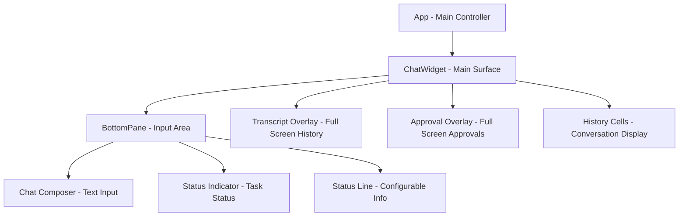
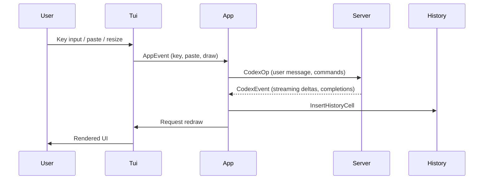
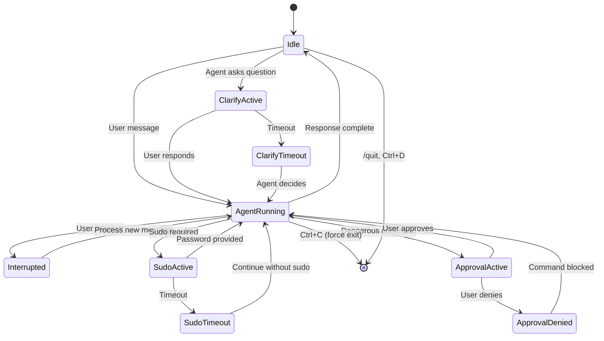
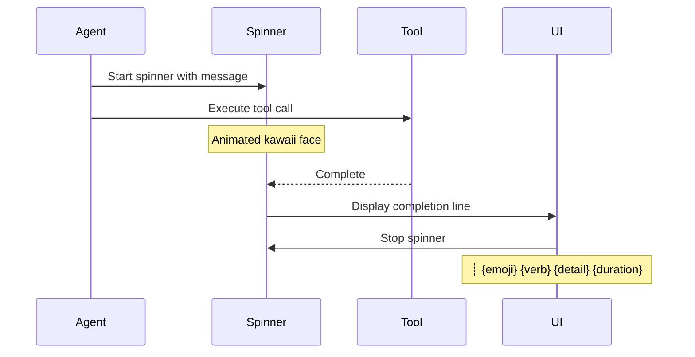
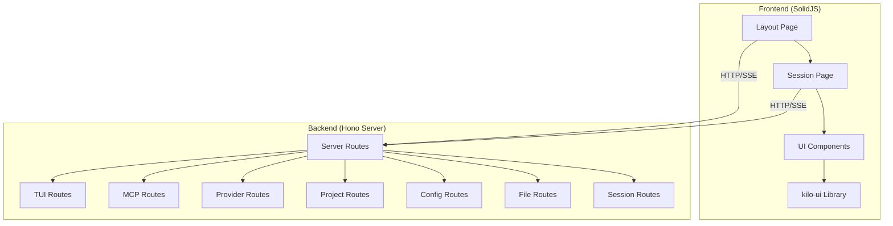
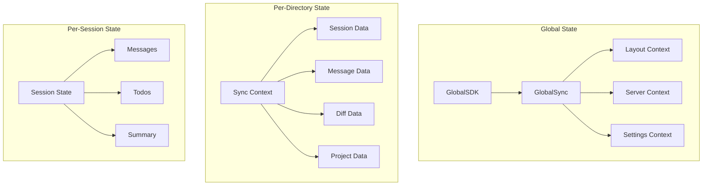
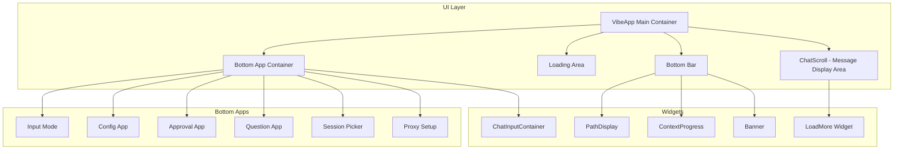
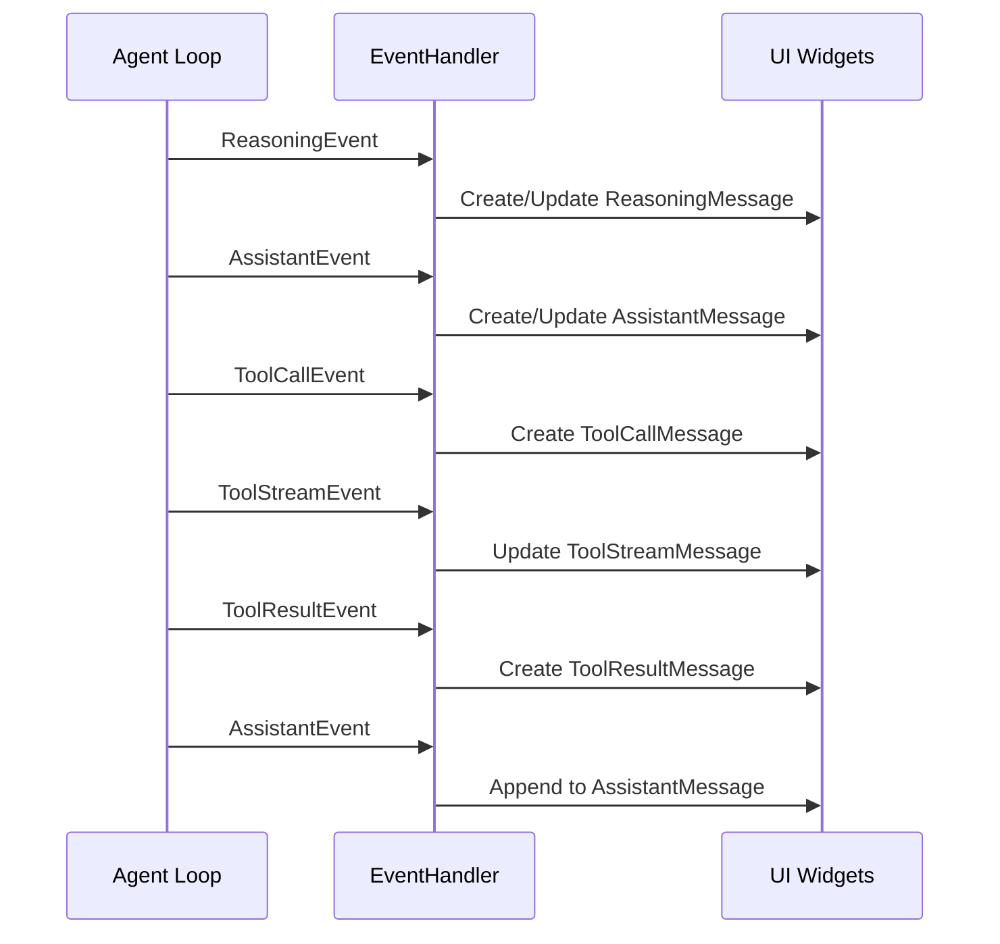

# Codex TUI - Complete UI Feature Reference

## Overview

This document provides a comprehensive reference for all functional features of the Codex Terminal User Interface (TUI). The Codex TUI is a ratatui-based terminal application that enables users to interact with an AI coding assistant through a rich, interactive interface.

**Location**: `codex-rs/tui/src/`

---

## 1. UI Architecture

### 1.1 Core Components



### 1.2 Component Descriptions

| Component | File | Purpose |
|-----------|------|---------|
| [`App`](codex-rs/tui/src/app.rs) | Main application controller, event loop, state management |
| [`ChatWidget`](codex-rs/tui/src/chatwidget.rs) | Main chat surface, manages history and active cell |
| [`BottomPane`](codex-rs/tui/src/bottom_pane/mod.rs) | Input composer, status indicator, status line |
| [`HistoryCell`](codex-rs/tui/src/history_cell.rs) | Abstract interface for all display units |
| [`ApprovalOverlay`](codex-rs/tui/src/bottom_pane/approval_overlay.rs) | Full-screen approval requests |
| [`StatusIndicatorWidget`](codex-rs/tui/src/status_indicator_widget.rs) | Live task status with timer |

### 1.3 Event System

The TUI uses an event-driven architecture with multiple event channels:



**Event Types**:
- [`AppEvent`](codex-rs/tui/src/app_event.rs) - Application-level events (key, paste, redraw)
- [`CodexEvent`](codex-rs/tui/src/app_event.rs) - Protocol events from server (streaming deltas, completions)
- [`TuiEvent`](codex-rs/tui/src/tui.rs) - Terminal events (key, paste, draw)
- [`ThreadEvent`](codex-rs/tui/src/app.rs) - Multi-thread events

---

## 2. Main Chat Surface

### 2.1 Layout Structure

```
┌─────────────────────────────────────────────────────────────────┐
│ Session Header (Model, Reasoning, Fast mode, Directory)         │
├─────────────────────────────────────────────────────────────────┤
│ Conversation History (scrollable)                                │
│  › User messages (cyan, bold prefix)                             │
│  • Agent messages (dim prefix)                                   │
│  • Tool calls (green/red bullet, spinner when active)           │
│  • Exec commands (with $ prefix, exit status)                   │
│  • Web searches (with spinner)                                   │
│  • Plan updates (checkbox style)                                 │
│  • MCP tool calls (server.tool(args))                           │
│  • Reasoning summaries (italic, dim)                             │
│  • Approval decisions (✔/✗ with command snippet)                │
│  • Warnings (⚠ yellow)                                           │
│  • Errors (■ red)                                                │
│  • Info (• dim)                                                  │
├─────────────────────────────────────────────────────────────────┤
│ Status Indicator (when agent running)                            │
│  [spinner] Working (1m 23s • esc to interrupt)                  │
│   └ Details (wrapped, max 3 lines)                              │
├─────────────────────────────────────────────────────────────────┤
│ Status Line (configurable items)                                 │
│  model-with-reasoning · context-remaining · current-dir          │
├─────────────────────────────────────────────────────────────────┤
│ Chat Composer (input area)                                       │
│  [mode indicator] > Your message here...                        │
│  [skills] [context window] [key hints]                          │
└─────────────────────────────────────────────────────────────────┘
```

### 2.2 Session Header

The session header is a bordered card displayed at the top of the conversation:

**Displayed Information**:
- Application title and version: `>_ OpenAI Codex (vX.Y.Z)`
- Model: `model: <model-name>` with reasoning effort (minimal/low/medium/high/xhigh/none)
- Fast mode indicator: `fast` (magenta) when in Fast tier
- Directory: Current working directory (relative to home, truncated if needed)
- Hint: `/model` command to change settings

**File**: [`SessionHeaderHistoryCell`](codex-rs/tui/src/history_cell.rs:1143)

### 2.3 Conversation History

The conversation history uses the [`HistoryCell`](codex-rs/tui/src/history_cell.rs:98) trait as its display unit. Each cell type represents a different kind of content:

#### User Messages
- **Prefix**: `› ` (bold, dimmed cyan)
- **Styling**: Cyan foreground for text elements
- **Supports**: Rich text elements, local images, remote images
- **File**: [`UserHistoryCell`](codex-rs/tui/src/history_cell.rs:200)

#### Agent Messages
- **Prefix**: `• ` (dimmed) for first line, `  ` (indent) for continuations
- **Styling**: Dimmed text
- **Streaming**: Supports incremental display during streaming
- **File**: [`AgentMessageCell`](codex-rs/tui/src/history_cell.rs:434)

#### Tool Calls

**MCP Tool Calls** (`McpToolCallCell`):
- **Active**: Spinner bullet `•` with shimmer effect
- **Completed**: Green bullet `•` for success, red for failure
- **Format**: `server.tool(args)` with arguments in compact JSON
- **Details**: Tool result content displayed below with tree prefix
- **File**: [`McpToolCallCell`](codex-rs/tui/src/history_cell.rs:1321)

**Web Search** (`WebSearchCell`):
- **Active**: "Searching the web" with spinner
- **Completed**: "Searched" with query details
- **File**: [`WebSearchCell`](codex-rs/tui/src/history_cell.rs:1521)

**Exec Commands** (`ExecCell`):
- **Format**: `$ command` with bash syntax highlighting
- **Exit Status**: Shown in transcript overlay
- **Output**: Truncated to `TOOL_CALL_MAX_LINES` (default 50)
- **File**: [`exec_cell.rs`](codex-rs/tui/src/exec_cell.rs)

#### Plan Updates
- **Header**: `• Updated Plan` (bold)
- **Format**: Checkbox-style list with status indicators
  - `✔ ` - Completed (crossed out, dimmed)
  - `□ ` - In progress (cyan, bold)
  - `□ ` - Pending (dimmed)
- **Explanation**: Optional italic note below header
- **File**: [`PlanUpdateCell`](codex-rs/tui/src/history_cell.rs:2106)

#### Reasoning Summary
- **Format**: Italic, dimmed text
- **Header**: Extracted from `**header** content` format
- **Transcript Only**: Can be displayed only in transcript overlay
- **File**: [`ReasoningSummaryCell`](codex-rs/tui/src/history_cell.rs:375)

#### Approval Decisions
- **Approved**: `✔ You approved codex to run <command> this time`
- **Denied**: `✗ You did not approve codex to run <command>`
- **Session**: `✔ You approved codex to run <command> every time this session`
- **Network Policy**: `✔ You persisted Codex network access to <host>`
- **File**: [`new_approval_decision_cell`](codex-rs/tui/src/history_cell.rs:788)

#### Special Messages

**Warnings** (`new_warning_event`):
- **Prefix**: `⚠ ` (yellow)
- **File**: [`history_cell.rs:1662`](codex-rs/tui/src/history_cell.rs:1662)

**Errors** (`new_error_event`):
- **Prefix**: `■ ` (red)
- **File**: [`history_cell.rs:1893`](codex-rs/tui/src/history_cell.rs:1893)

**Info** (`new_info_event`):
- **Prefix**: `• ` (dimmed)
- **Hint**: Optional dark gray hint text
- **File**: [`history_cell.rs:1883`](codex-rs/tui/src/history_cell.rs:1883)

**Deprecation Notice** (`DeprecationNoticeCell`):
- **Prefix**: `⚠ ` (red, bold)
- **Summary**: Red text
- **Details**: Optional dimmed details
- **File**: [`history_cell.rs:1666`](codex-rs/tui/src/history_cell.rs:1666)

**Final Message Separator** (`FinalMessageSeparator`):
- **Format**: `─ Worked for 1m 23s • Local tools: 3 calls (2.5s) ─`
- **Shows**: Elapsed time (>60s), runtime metrics
- **File**: [`history_cell.rs:2263`](codex-rs/tui/src/history_cell.rs:2263)

---

## 3. Bottom Pane

The bottom pane contains the input composer, status indicator, and status line.

### 3.1 Chat Composer

The chat composer is the primary input area for user messages.

**Features**:
- Multi-line text input with textarea widget
- Image attachment support (local and remote URLs)
- Plugin mentions (autocomplete)
- Slash command autocomplete
- Message queue (Tab key)
- Draft persistence
- Backtrack mode (Esc when empty)

**Visual States**:
1. **Idle**: Shows key hints and mode indicator
2. **Typing**: Hints hidden while typing
3. **Queue Active**: Shows queued message count
4. **Plan Mode**: Shows plan-specific hints
5. **Collaboration Modes**: Shows active agent/thread

**File**: [`chat_composer.rs`](codex-rs/tui/src/bottom_pane/chat_composer.rs)

### 3.2 Status Indicator

The status indicator displays live task status when the agent is running.

**Displayed Information**:
- Spinner animation (when active)
- Header text (e.g., "Working", "Starting MCP servers", "Searching the web")
- Elapsed time: `(1m 23s • esc to interrupt)` or `(1m 23s)`
- Inline message: Optional context (e.g., MCP server names)
- Details: Wrapped text below header (max 3 lines by default)

**Timer Features**:
- Pauses when not actively working
- Resumes when work continues
- Compact formatting: `0s`, `59s`, `1m 00s`, `59m 59s`, `1h 00m 00s`

**File**: [`StatusIndicatorWidget`](codex-rs/tui/src/status_indicator_widget.rs)

### 3.3 Status Line

The status line displays configurable runtime information.

**Configurable Items**:
- `model-with-reasoning`: Current model and reasoning effort
- `context-remaining`: Token usage percentage
- `context-tokens-used`: Absolute token count
- `current-dir`: Current working directory
- `git-branch`: Current git branch (async lookup)
- `skills`: Active skills
- `mode`: Current mode indicator

**Default**: `model-with-reasoning · context-remaining · current-dir`

**Configuration**:
- Set via `/status` command
- Customized in config file
- Items can be disabled (empty list hides status line)

**File**: [`status_line_setup.rs`](codex-rs/tui/src/bottom_pane/status_line_setup.rs)

---

## 4. Slash Commands

The TUI supports 57 slash commands for various operations.

### 4.1 Model and Configuration

| Command | Description |
|---------|-------------|
| `/model` | Choose model and reasoning effort |
| `/fast` | Toggle Fast mode |
| `/permissions` | Configure approval policies |
| `/status` | Show session configuration |
| `/compact` | Summarize conversation |
| `/init` | Create AGENTS.md file |

### 4.2 Conversation Management

| Command | Description |
|---------|-------------|
| `/review` | Review current changes |
| `/skills` | List/use skills |
| `/fork` | Branch current chat |
| `/resume` | Resume saved chat |
| `/rename` | Rename current thread |
| `/new` | Start new conversation |
| `/clear` | Clear terminal display |

### 4.3 Tools and Features

| Command | Description |
|---------|-------------|
| `/diff` | Show git diff |
| `/copy` | Copy latest output |
| `/mcp` | List MCP tools |
| `/apps` | Manage apps |
| `/theme` | Change syntax theme |
| `/personality` | Customize communication style |
| `/realtime` | Toggle voice mode |

### 4.4 Advanced Features

| Command | Description |
|---------|-------------|
| `/plan` | Switch to Plan mode |
| `/collab` | Change collaboration mode |
| `/agent` | Switch active agent thread |
| `/multi-agents` | Enable multi-agent mode |
| `/experimental` | Toggle experimental features |
| `/feedback` | Send logs to maintainers |
| `/quit` / `/exit` | Exit application |

### 4.5 Command Implementation

**File**: [`slash_commands.rs`](codex-rs/tui/src/bottom_pane/slash_commands.rs)

**Example - `/model` Command**:
```rust
SlashCommand::Model => {
    // Opens model picker with available models
    // Allows selection of model and reasoning effort
}
```

---

## 5. Keyboard Shortcuts

### 5.1 Core Shortcuts

| Key | Action |
|-----|--------|
| `Ctrl+C` | Interrupt current task or quit (double-press) |
| `Ctrl+T` | Open transcript overlay |
| `Ctrl+V` | Paste image attachment |
| `Esc` | Step back to edit last message (when composer empty) |
| `Tab` | Queue message or autocomplete commands |

### 5.2 Editing Shortcuts

| Key | Action |
|-----|--------|
| `Alt+Up` | Edit most recent queued message |
| `Shift+Left` | Edit most recent queued message |
| `Ctrl+D` | Quit application |

### 5.3 Approval Overlay Shortcuts

| Key | Action |
|-----|--------|
| `Enter` | Confirm selection |
| `Esc` | Cancel / Abort |
| `y` | Yes (approve) |
| `n` | No (deny) |
| `a` | Approve for session |
| `p` | Approve with prefix (exec commands) |
| `d` | Deny / Block (network) |
| `c` | Cancel (elicitation) |
| `o` | Open source thread (cross-thread approval) |
| `Ctrl+A` | Full-screen approval request |

### 5.4 Key Binding System

**File**: [`key_hint.rs`](codex-rs/tui/src/key_hint.rs)

**Helper Functions**:
- `plain(key)` - Standard key binding
- `alt(key)` - Alt-modified key
- `shift(key)` - Shift-modified key
- `ctrl(key)` - Ctrl-modified key

---

## 6. Overlays

### 6.1 Transcript Overlay (`Ctrl+T`)

A full-screen scrollable view of all conversation history.

**Features**:
- Scrollable history with search
- Time-dependent visuals (spinners, shimmer) update in real-time
- Cached transcript tail from active cell
- Animation tick invalidation for dynamic content

**File**: [`transcript_overlay.rs`](codex-rs/tui/src/transcript_overlay.rs)

### 6.2 Approval Overlay

Full-screen overlay for approval requests.

**Request Types**:
1. **Exec Command**: Run shell commands
   - Shows command with syntax highlighting
   - Reason (if provided)
   - Permission rules (if applicable)
   - Network approval context (if blocked)

2. **Apply Patch**: Apply file changes
   - Shows diff summary
   - Lists files to be modified
   - Shows working directory

3. **MCP Elicitation**: Request user input from MCP server
   - Shows server name
   - Displays request message
   - Shows schema (if available)

**File**: [`approval_overlay.rs`](codex-rs/tui/src/bottom_pane/approval_overlay.rs)

### 6.3 Other Overlays

| Overlay | Purpose |
|---------|---------|
| [`PagerOverlay`](codex-rs/tui/src/pager_overlay.rs) | Full-screen pager for long content |
| [`FileSearchPopup`](codex-rs/tui/src/bottom_pane/file_search_popup.rs) | Fuzzy file search |
| [`CommandPopup`](codex-rs/tui/src/bottom_pane/command_popup.rs) | Command selection |
| [`ListSelectionView`](codex-rs/tui/src/bottom_pane/list_selection_view.rs) | Generic list selection |

---

## 7. Incremental UI Refresh

### 7.1 Active Cell Revision System

The TUI uses a revision-based caching system for efficient updates:

```rust
// Active cell revision tracking
active_cell_revision: u64

// Cache key invalidation
fn transcript_animation_tick(&self) -> Option<u64> {
    // Returns Some(tick) for time-dependent visuals
    // Returns None for stable content
}
```

**Mechanism**:
1. Each active cell has a revision counter
2. Mutations bump the revision
3. Transcript overlay cache key includes revision
4. Cache invalidated when revision changes

### 7.2 Animation Tick System

Time-dependent visuals use animation ticks:

```rust
// Example: MCP Tool Call animation
fn transcript_animation_tick(&self) -> Option<u64> {
    if !self.animations_enabled || self.result.is_some() {
        return None;
    }
    Some((self.start_time.elapsed().as_millis() / 50) as u64)
}
```

**Visuals with Animation**:
- Spinners (MCP tool calls, web searches)
- Shimmer effects (status headers)
- Elapsed timers

### 7.3 Commit Animation

Streaming content uses commit animation for smooth display:

```rust
const COMMIT_ANIMATION_TICK: Duration = tui::TARGET_FRAME_INTERVAL;
```

**Behavior**:
- Active cell accumulates streaming deltas
- Commit tick drives perceived typing speed
- Smooth transition to final state

### 7.4 Deferred History Insertion

History insertions are batched to avoid excessive redraws:

```rust
// Deferred history line insertion
pending_history_lines: Vec<Box<dyn HistoryCell>>

// Batched insertion
fn flush_history_lines(&mut self) {
    for cell in self.pending_history_lines.drain(..) {
        self.history.push(cell);
    }
}
```

---

## 8. Diff Rendering

### 8.1 Unified Diff Display

The TUI renders unified diffs with syntax highlighting.

**Features**:
- Line numbers with gutter signs (`+`, `-`, ` `)
- Syntax highlighting for code files
- Theme-aware backgrounds (dark/light terminal detection)
- Color depth adaptation (Truecolor, ANSI-256, ANSI-16)
- Hard-wrapping with style preservation

**File**: [`diff_render.rs`](codex-rs/tui/src/diff_render.rs)

### 8.2 Diff Summary

For patch approval, a summary is shown:

```
Files changed: 3
  M src/app.rs
  A src/new_file.txt
  D src/removed_file.rs
```

**File**: [`create_diff_summary`](codex-rs/tui/src/diff_render.rs)

### 8.3 Syntax Highlighting

**Implementation**:
- Uses `syntect` library
- Hunk-level parsing to preserve parser state
- Large diff optimization (skips highlighting for very large diffs)
- Theme detection from terminal background

---

## 9. Styling Conventions

### 9.1 Color Palette

| Element | Style |
|---------|-------|
| Headers | `bold` |
| Primary text | Default |
| Secondary text | `dim` |
| User input / status | `cyan` |
| Success | `green` |
| Errors | `red` |
| Warnings | `yellow` |
| Codex branding | `magenta` |
| Links | `cyan().underlined()` |

### 9.2 Text Formatting

**File**: [`styles.md`](codex-rs/tui/docs/styles.md)

**Helpers**:
- `"text".into()` - Basic span
- `"text".red()` - Styled span
- `"text".cyan().underlined()` - Chained styles
- `"text".dim()` - Dimmed text
- `"text".bold()` - Bold text

### 9.3 Wrapping

**Algorithm**: `textwrap::wrap` with `FirstFit` algorithm

**Options**:
```rust
RtOptions::new(width)
    .initial_indent("prefix".into())
    .subsequent_indent("    ".into())
    .wrap_algorithm(textwrap::WrapAlgorithm::FirstFit)
```

---

## 10. Multi-Thread Support

### 10.1 Thread Management

The TUI supports multiple concurrent threads (agent sessions).

**Features**:
- Per-thread event channels with buffering
- Thread switching preserves input state
- Pending approvals tracked across threads
- Failover for unexpected thread shutdowns

**File**: [`multi_agents.rs`](codex-rs/tui/src/multi_agents.rs)

### 10.2 Collaboration Modes

**Modes**:
- `Default` - Standard single-agent mode
- `Plan` - Planning-focused mode
- `Multi-Agent` - Multiple concurrent agents

**File**: [`collaboration_modes.rs`](codex-rs/tui/src/collaboration_modes.rs)

---

## 11. Onboarding Flow

### 11.1 Welcome Screen

**File**: [`welcome.rs`](codex-rs/tui/src/onboarding/welcome.rs)

**Content**:
- Application introduction
- Quick start instructions
- Trust directory setup

### 11.2 Trust Directory

**File**: [`trust_directory.rs`](codex-rs/tui/src/onboarding/trust_directory.rs)

**Purpose**: Establishes workspace trust for file operations

### 11.3 Authentication

**File**: [`auth.rs`](codex-rs/tui/src/onboarding/auth.rs)

**Features**:
- ChatGPT login (headless)
- Account setup
- Token management

---

## 12. Realtime (Voice Mode)

**File**: [`realtime/`](codex-rs/tui/src/realtime/)

**Features**:
- Voice input/output toggle
- Realtime session management
- Audio streaming

---

## 13. Request User Input

When the agent needs user input, a dedicated form is shown.

**File**: [`request_user_input/`](codex-rs/tui/src/bottom_pane/request_user_input/)

**Features**:
- Freeform text input
- Option selection
- Multi-question flows
- Secret field masking
- Option notes
- Scrolling for long option lists

---

## 14. File Search

**File**: [`file_search.rs`](codex-rs/tui/src/file_search.rs)

**Features**:
- Fuzzy matching
- Path completion
- Async search
- Result selection

---

## 15. Clipboard Integration

### 15.1 Clipboard Paste

**File**: [`clipboard_paste.rs`](codex-rs/tui/src/clipboard_paste.rs)

**Features**:
- Rich text paste handling
- Burst detection (rapid pastes)
- Image paste support

### 15.2 Clipboard Text

**File**: [`clipboard_text.rs`](codex-rs/tui/src/clipboard_text.rs)

**Purpose**: Simple text clipboard operations

---

## 16. Image Handling

### 16.1 Local Images

- Displayed as placeholders in composer
- Shown as `[Image #1]` in message
- Path validation before sending

### 16.2 Remote Images

- URL-based image references
- Displayed in message history
- Supported in user messages

### 16.3 MCP Image Output

- MCP tools can return image content
- Detected and displayed as separate cell
- Base64 decoding with format detection

**File**: [`history_cell.rs:1610`](codex-rs/tui/src/history_cell.rs:1610)

---

## 17. Plugin Mentions

**File**: [`mention_codec.rs`](codex-rs/tui/src/mention_codec.rs)

**Features**:
- Plugin autocomplete
- Mention popup display
- Plugin selection

---

## 18. Feedback System

**File**: [`feedback_view.rs`](codex-rs/tui/src/bottom_pane/feedback_view.rs)

**Categories**:
- Bug report
- Good experience
- Other

**Features**:
- Log collection
- Connectivity diagnostics
- Consent management
- Rollout attachment (optional)

---

## 19. Skills System

**File**: [`skills_toggle_view.rs`](codex-rs/tui/src/bottom_pane/skills_toggle_view.rs)

**Features**:
- Skill listing
- Skill activation/deactivation
- Skill metadata display

---

## 20. Experimental Features

**File**: [`experimental_features_view.rs`](codex-rs/tui/src/bottom_pane/experimental_features_view.rs)

**Purpose**: Toggle and manage experimental features

---

## 21. Custom Prompts

**File**: [`custom_prompt_view.rs`](codex-rs/tui/src/bottom_pane/custom_prompt_view.rs)

**Features**:
- Prompt listing
- Prompt selection
- Prompt creation

---

## 22. App Link View

**File**: [`app_link_view.rs`](codex-rs/tui/src/bottom_pane/app_link_view.rs)

**Purpose**: Display and manage app links

---

## 23. Pending Input Preview

**File**: [`pending_input_preview.rs`](codex-rs/tui/src/bottom_pane/pending_input_preview.rs)

**Features**:
- Shows pending steers (agent requests)
- Shows queued messages
- Visual distinction between types
- Truncation for long messages

---

## 24. Rate Limit Handling

**File**: [`rate_limit.rs`](codex-rs/tui/src/rate_limit.rs)

**Features**:
- Rate limit snapshot display
- Usage warnings
- Switch prompt (when usage high)
- Credit display

---

## 25. Update Detection

**File**: [`UpdateAvailableHistoryCell`](codex-rs/tui/src/history_cell.rs:486)

**Display**:
```
╭────────────────────────────────────╮
│ ✨ Update available! vX.Y.Z -> vA.B.C │
│ Run `codex update` to update.      │
│                                    │
│ See full release notes:            │
│ https://github.com/openai/codex/releases/latest │
╰────────────────────────────────────╯
```

---

## 26. Git Integration

### 26.1 Git Branch in Status Line

- Async branch lookup
- CWD-based tracking
- Truncation for long paths
- Fallback when not in git repo

### 26.2 Git Diff

**File**: [`get_git_diff.rs`](codex-rs/tui/src/get_git_diff.rs)

**Command**: `/diff`

**Features**:
- Unified diff format
- Syntax highlighting
- File change summary

---

## 27. Session Logging

**File**: [`session_log.rs`](codex-rs/tui/src/session_log.rs)

**Purpose**: Log session events for debugging and feedback

---

## 28. Frame Request System

**File**: [`frames.rs`](codex-rs/tui/src/frames.rs)

**Purpose**: Coordinate frame requests for animations

---

## 29. Line Truncation

**File**: [`line_truncation.rs`](codex-rs/tui/src/line_truncation.rs)

**Features**:
- Ellipsis truncation
- Center-truncate path
- Width-based truncation

---

## 30. ASCII Animation

**File**: [`ascii_animation.rs`](codex-rs/tui/src/ascii_animation.rs)

**Purpose**: ASCII-based animations for loading states

---

## 31. Model Migration

**File**: [`model_migration.rs`](codex-rs/tui/src/model_migration.rs)

**Purpose**: Handle model migration prompts

---

## 32. OSS Selection

**File**: [`oss_selection.rs`](codex-rs/tui/src/oss_selection.rs)

**Purpose**: Open Source Software selection interface

---

## 33. Resume Picker

**File**: [`resume_picker.rs`](codex-rs/tui/src/resume_picker.rs)

**Purpose**: Resume saved conversations

---

## 34. Footer

**File**: [`footer.rs`](codex-rs/tui/src/bottom_pane/footer.rs)

**Features**:
- Mode indicators
- Context display
- Shortcut hints
- Collapsible sections

---

## 35. Textarea Widget

**File**: [`textarea.rs`](codex-rs/tui/src/bottom_pane/textarea.rs)

**Features**:
- Multi-line editing
- Cursor navigation
- Selection handling
- Scroll support

---

## 36. Message Queue

**File**: [`message_queue.rs`](codex-rs/tui/src/bottom_pane/message_queue.rs)

**Purpose**: Queue messages for batch submission

---

## 37. Scroll State

**File**: [`scroll_state.rs`](codex-rs/tui/src/bottom_pane/scroll_state.rs)

**Purpose**: Track scroll position in overlays

---

## 38. Selection List

**File**: [`selection_list.rs`](codex-rs/tui/src/selection_list.rs)

**Purpose**: Simple selection list widget

---

## 39. Additional Directories

### `app/`
- Application-specific utilities

### `bin/`
- Binary executables

### `exec_cell/`
- Exec command cell rendering

### `notifications/`
- Notification system

### `render/`
- Rendering utilities
  - [`highlight.rs`](codex-rs/tui/src/render/highlight.rs) - Syntax highlighting
  - [`renderable.rs`](codex-rs/tui/src/render/renderable.rs) - Render trait

### `streaming/`
- Streaming utilities

### `tui/`
- TUI framework utilities

---

## 40. Key Design Patterns

### 40.1 History Cell Pattern

All display units implement the `HistoryCell` trait:

```rust
pub(crate) trait HistoryCell: std::fmt::Debug + Send + Sync + Any {
    fn display_lines(&self, width: u16) -> Vec<Line<'static>>;
    fn desired_height(&self, width: u16) -> u16;
    fn transcript_lines(&self, width: u16) -> Vec<Line<'static>>;
    fn is_stream_continuation(&self) -> bool;
    fn transcript_animation_tick(&self) -> Option<u64>;
}
```

### 40.2 Renderable Trait

For overlay widgets:

```rust
pub(crate) trait Renderable {
    fn render(&self, area: Rect, buf: &mut Buffer);
    fn desired_height(&self, width: u16) -> u16;
    fn cursor_pos(&self, area: Rect) -> Option<(u16, u16)>;
}
```

### 40.3 Composite History Cell

Combine multiple history cells:

```rust
pub(crate) struct CompositeHistoryCell {
    parts: Vec<Box<dyn HistoryCell>>,
}
```

### 40.4 Streaming Controllers

For smooth streaming display:

```rust
pub(crate) struct StreamController {
    queued_lines: Vec<Line<'static>>,
    commit_tick: CommitTick,
}
```

---

## 41. Configuration

### 41.1 Status Line Configuration

```toml
# In config.toml
tui_status_line = ["model-with-reasoning", "context-remaining", "current-dir"]
```

### 41.2 Feature Flags

Experimental features can be toggled via `/experimental` command.

---

## 42. Testing

The TUI uses snapshot testing for UI components:

```rust
#[test]
fn renders_with_working_header() {
    let mut terminal = Terminal::new(TestBackend::new(80, 2)).expect("terminal");
    terminal.draw(|f| w.render(f.area(), f.buffer_mut())).expect("draw");
    insta::assert_snapshot!(terminal.backend());
}
```

Snapshot files are located in `snapshots/` directories.

---

## 43. Summary

The Codex TUI provides a rich, interactive terminal interface with:

1. **Comprehensive conversation display** - All agent interactions, tool calls, and system messages
2. **Flexible input system** - Multi-line composer with image support and autocomplete
3. **Approval workflows** - Full-screen overlays for exec, patch, and MCP elicitation
4. **Real-time updates** - Incremental refresh with animation tick invalidation
5. **Multi-thread support** - Concurrent agent sessions with state preservation
6. **Extensive command set** - 57 slash commands for all operations
7. **Rich keyboard shortcuts** - Efficient navigation and control
8. **Visual feedback** - Spinners, shimmer, timers, and status indicators

This documentation serves as a complete reference for all functional features of the Codex TUI.

# Hermes Agent CLI - User Interface Analysis

## Overview

The Hermes Agent CLI is a sophisticated command-line interface built on top of `prompt_toolkit` that provides an interactive REPL experience with rich formatting, animated feedback, and multiple interactive prompt modes. This document provides a comprehensive reference for all functional features of the UI.

---

## 1. UI Architecture

### 1.1 Core Components

The UI is built using the following key components:

| Component | File | Purpose |
|-----------|------|---------|
| **HermesCLI** | [`cli.py`](cli.py:1032) | Main CLI controller class |
| **ChatConsole** | [`cli.py`](cli.py:647) | Rich Console adapter for prompt_toolkit |
| **SlashCommandCompleter** | [`cli.py`](cli.py:946) | Autocomplete dropdown for commands |
| **KawaiiSpinner** | [`agent/display.py`](agent/display.py:126) | Animated spinner with kawaii faces |
| **Interactive Prompts** | [`hermes_cli/callbacks.py`](hermes_cli/callbacks.py:15) | Clarify, sudo, approval dialogs |

### 1.2 Layout Structure

The UI uses a `prompt_toolkit.Layout` with the following vertical structure:

```
┌─────────────────────────────────────────────────────────┐
│  (Optional) Sudo Password Panel                          │
├─────────────────────────────────────────────────────────┤
│  (Optional) Approval Panel                               │
├─────────────────────────────────────────────────────────┤
│  (Optional) Clarify Question Panel                       │
├─────────────────────────────────────────────────────────┤
│  Hint Line (countdown, instructions)                     │
├─────────────────────────────────────────────────────────┤
│  ─────────────────────────────────────────────────────── │
│  [📎 Image #1] [📎 Image #2]  (Image attachment badges)  │
├─────────────────────────────────────────────────────────┤
│  ❯ [Input Area - Multiline, History, Autocomplete]      │
├─────────────────────────────────────────────────────────┤
│  ─────────────────────────────────────────────────────── │
│  Completions Menu (Autocomplete dropdown)                │
└─────────────────────────────────────────────────────────┘
```

---

## 2. Welcome Banner

### 2.1 Banner Display

The welcome banner is displayed on startup via [`show_banner()`](cli.py:1312) and shows:

**Left Panel (Caduceus + System Info):**
- ASCII art caduceus symbol (Hermes logo)
- Current model name (shortened if >28 chars)
- Context window size (e.g., "128K context")
- "Nous Research" branding
- Current working directory
- Session ID (if applicable)

**Right Panel (Capabilities):**
- **Available Tools** - Grouped by toolset, color-coded:
  - `#FFF8DC` (light cream) = enabled tools
  - `red` = disabled tools (missing API keys)
- **MCP Servers** - Connected servers with transport type and tool count
- **Available Skills** - Grouped by category, showing first 8 + count
- **Summary Line** - Tool count, skill count, MCP servers, `/help` hint
- **Update Warning** - Yellow warning if behind origin/main

### 2.2 Banner Code Reference

```python
# Banner building function
build_welcome_banner(
    console, model, cwd, tools, enabled_toolsets, 
    session_id, context_length
)
```

See [`hermes_cli/banner.py:186`](hermes_cli/banner.py:186) for implementation.

---

## 3. Input Area

### 3.1 Dynamic Prompt

The prompt changes based on UI state:

| State | Prompt | Color |
|-------|--------|-------|
| Idle | `❯ ` | Cream |
| Agent working | `⚕ ❯ ` | Gray italic |
| Clarify question | `? ❯ ` | Gray italic |
| Clarify freetext | `✎ ❯ ` | Cream |
| Approval dialog | `⚠ ❯ ` | Gray italic |
| Sudo password | `🔐 ❯ ` | Red bold |

### 3.2 Placeholder Text

When empty, the input area shows contextual hints:
- Agent running: `"type a message + Enter to interrupt, Ctrl+C to cancel"`
- Sudo active: `"type password (hidden), Enter to skip"`
- Clarify freetext: (empty, user types answer)

### 3.3 Input Features

| Feature | Description |
|---------|-------------|
| **Multiline** | Alt+Enter or Ctrl+J for new line |
| **History** | Up/Down arrows browse command history |
| **Autocomplete** | Type `/` to see slash commands |
| **Paste Collapsing** | 5+ line pastes saved to `~/.hermes/pastes/` |
| **Image Attach** | Ctrl+V, Alt+V, or `/paste` command |

---

## 4. Slash Commands

### 4.1 Built-in Commands

| Command | Description |
|---------|-------------|
| `/help` | Show all available commands |
| `/tools` | List available tools with descriptions |
| `/toolsets` | List available toolsets |
| `/model [name]` | Show or change current model |
| `/prompt [text]` | View/set custom system prompt |
| `/prompt clear` | Remove custom prompt |
| `/personality [name]` | Set predefined personality |
| `/clear` | Clear screen and reset conversation |
| `/history` | Show conversation history |
| `/new` or `/reset` | Start new conversation |
| `/retry` | Retry last message |
| `/undo` | Remove last exchange |
| `/save` | Save conversation to JSON file |
| `/config` | Show current configuration |
| `/verbose` | Toggle tool progress mode |
| `/compress` | Manually trigger context compression |
| `/usage` | Show token usage statistics |
| `/insights [--days N]` | Show usage analytics |
| `/cron [cmd]` | Manage scheduled tasks |
| `/skills [cmd]` | Search/install/manage skills |
| `/platforms` or `/gateway` | Show messaging platform status |
| `/paste` | Check clipboard for image |
| `/reload-mcp` | Reload MCP servers |
| `/quit`, `/exit`, `/q` | Exit CLI |

### 4.2 Skill Slash Commands

Every installed skill in `~/.hermes/skills/` is automatically registered as a slash command.

**Example:**
- `/axolotl` - MLOps skill for axolotl training
- `/gif-search` - GIF search skill
- `/excalidraw` - Diagramming skill

See [`agent/skill_commands.py`](agent/skill_commands.py) for implementation.

---

## 5. Interactive Prompts

### 5.1 Clarify Dialog

When the agent needs clarification, a selection panel appears:

```
╭─ Hermes needs your input
 ────────────────────────────────────╮
│
│  Should I proceed with the current approach?
│
│    Option A: Use method X
│    Option B: Use method Y
│    Other (type your answer)
│
╰────────────────────────────────────╯
  ↑/↓ to select, Enter to confirm  (120s)
```

**Controls:**
- `↑/↓` - Navigate options
- `Enter` - Confirm selection
- `Esc` - Cancel (agent decides)
- `Other` - Type custom answer

**Timeout:** 120 seconds (configurable via `clarify.timeout` in config)

### 5.2 Sudo Password Dialog

When a command requires sudo:

```
╭─ 🔐 Sudo Password Required
 ────────────────────────────────────╮
│
│  Enter password below (hidden), or press Enter to skip
│
╰────────────────────────────────────╯
  password hidden · Enter to skip  (45s)
```

**Controls:**
- Input field (password hidden)
- `Enter` - Submit password or skip
- `Esc` - Cancel (skip)

**Timeout:** 45 seconds

### 5.3 Dangerous Command Approval

When a potentially destructive command is detected:

```
╭─ ⚠️  Dangerous Command
 ────────────────────────────────────╮
│
│  Recursive file deletion detected
│  rm -rf /tmp/test
│
│    Allow once
│    Allow for this session
│    Add to permanent allowlist
│    Deny
│
╰────────────────────────────────────╯
  ↑/↓ to select, Enter to confirm  (60s)
```

**Controls:**
- `↑/↓` - Navigate options
- `Enter` - Confirm selection
- `Esc` - Deny command

**Timeout:** 60 seconds

---

## 6. Tool Feedback

### 6.1 Kawaii Spinner

During tool execution, a spinner with kawaii faces appears:

```
  🧠 deliberating... (2.3s)
```

**Spinner Types:**
- `dots` - Standard dots
- `bounce` - Bouncing animation
- `grow` - Progress bar style
- `arrows` - Rotating arrows
- `star` - Star rotation
- `moon` - Moon phases
- `pulse` - Pulsing animation
- `brain` - Brain/thinking icons
- `sparkle` - Sparkle animation

**Kawaii Faces by Tool Type:**
- Search: `♪(´ε` )`, `(｡◕‿◕｡)`
- Read: `φ(゜▽゜*)♪`, `( ˘▽˘)っ`
- Terminal: `ヽ(>∀<☆)ノ`, `(ノ°∀°)ノ`
- Browser: `(ノ°∀°)ノ`, `(☞゚ヮ゚)☞`
- Create: `✧*。٩(ˊᗜˋ*)و✧`, `(ﾉ◕ヮ◕)ﾉ*:・ﾟ✧`
- Skill: `ヾ(＠⌒ー⌒＠)ノ`, `(๑˃ᴗ˂)ﻭ`
- Think: `(っ°Д°;)っ`, `(；′⌒`)`

### 6.2 Tool Progress Modes

Controlled via `/verbose` command (cycles: off → new → all → verbose):

| Mode | Description |
|------|-------------|
| **OFF** | Silent mode, only final response |
| **NEW** | Show each new tool (skip repeats) |
| **ALL** | Show every tool call |
| **VERBOSE** | Full args, results, and debug logs |

### 6.3 Tool Completion Line Format

```
┊ {emoji} {verb:9} {detail}  {duration}
```

**Examples:**
```
┊ 💻 $         ls -la  0.5s
┊ 🔍 search    python tutorials  2.3s
┊ 📖 read      /path/to/file.py  0.1s
┊ 🎨 create    generate image of cat  5.2s
┊ 📋 plan      reading tasks  0.0s
```

**Failure Indicators:**
- ` [exit 1]` - Terminal command failed
- ` [error]` - Generic error
- ` [full]` - Memory limit exceeded

---

## 7. Image Attachment

### 7.1 Attachment Methods

| Method | Description |
|--------|-------------|
| **Ctrl+V** | Paste from clipboard (terminal-dependent) |
| **Alt+V** | Reliable image paste (works everywhere) |
| **`/paste`** | Explicitly check clipboard for image |

### 7.2 Visual Indicator

Attached images show as badges above the input:
```
 ───────────────────────────────────────────────────────
 [📎 Image #1] [📎 Image #2] 
 ❯ type your message...
```

### 7.3 Storage

Images are saved to `~/.hermes/images/` with format:
```
clip_YYYYMMDD_HHMMSS_NNN.png
```

---

## 8. Conversation Management

### 8.1 Session Persistence

Conversations are stored in SQLite at `~/.hermes/hermes_state.db`:

**Tables:**
- `sessions` - Session metadata (id, start_time, end_reason)
- `messages` - Conversation messages (session_id, role, content, timestamp)

**Resume Command:**
```bash
hermes --resume 20260225_143052_a1b2c3
```

### 8.2 Conversation History

Viewable via `/history` command:
```
+--------------------------------------------------+
|          (^_^) Conversation History              |
+--------------------------------------------------+

  [You #1]
    Search for Python tutorials

  [Hermes #1]
    I found several resources for learning Python...

  [You #2]
    Can you help me write a script?

  [Hermes #2]
    Sure! What kind of script do you need?
```

### 8.3 Save/Load

**Save:** `/save` - Exports to `hermes_conversation_YYYYMMDD_HHMMSS.json`

**Load:** Paste references are auto-expanded:
```
[Pasted text #1: 10 lines → /home/user/.hermes/pastes/paste_1_143052.txt]
```

---

## 9. Token Usage & Compression

### 9.1 Token Usage Display

Via `/usage` command:
```
  📊 Session Token Usage
  ────────────────────────────────────────────────────
  Prompt tokens (input):        12,450
  Completion tokens (output):     3,280
  Total tokens:                 15,730
  API calls:                      12
  ────────────────────────────────────────────────────
  Current context:  45,230 / 128,000 (35%)
  Messages:         24
  Compressions:     2
```

### 9.2 Context Compression

Auto-compression triggers at 85% of context limit (configurable).

**Manual Trigger:** `/compress`

**Compression Stats:**
```
🗜️  Compressing 24 messages (~15,730 tokens)...
  ✅ Compressed: 24 → 12 messages (~15,730 → ~8,450 tokens)
```

---

## 10. Keyboard Shortcuts

| Key | Action |
|-----|--------|
| **Enter** | Submit input |
| **Alt+Enter / Ctrl+J** | New line (multiline input) |
| **Up/Down** | Browse history (when on first/last line) |
| **Ctrl+C** | Cancel prompt / Interrupt agent / Force exit |
| **Ctrl+D** | Exit CLI |
| **Ctrl+V** | Attach image from clipboard |
| **Alt+V** | Attach image from clipboard (reliable) |
| **Tab** | Autocomplete (slash commands, skills) |

### 10.1 Double Ctrl+C

- **First press:** Interrupt agent (shows "press Ctrl+C again to force exit")
- **Second press (within 2s):** Force exit CLI

---

## 11. Display Modes

### 11.1 Compact Mode

Enabled via `--compact` flag or `display.compact: true` in config.

Shows minimal banner:
```
╔══════════════════════════════════════════════════════════════╗
║  ⚕ NOUS HERMES - AI Agent Framework                       ║
║  Messenger of the Digital Gods    Nous Research            ║
╚══════════════════════════════════════════════════════════════╝
```

### 11.2 Tool Progress Modes

| Mode | Command | Description |
|------|---------|-------------|
| `off` | `/verbose` | Silent mode |
| `new` | `/verbose` | Show new tools only |
| `all` | `/verbose` | Show all tools |
| `verbose` | `/verbose` | Full debug output |

---

## 12. Color Palette

| Color | Hex | Usage |
|-------|-----|-------|
| Gold | `#FFD700` | Headers, highlights, logo |
| Amber | `#FFBF00` | Secondary highlights |
| Bronze | `#CD7F32` | Borders, rules |
| Light | `#FFF8DC` | Main text, enabled tools |
| Dim | `#B8860B` | Muted text, metadata |
| Red | `#FF6B6B` | Sudo prompt, errors |
| Orange | `#FF8C00` | Warning, approval title |
| Blue | `#87CEEB` | Image badges |

---

## 13. State Management

### 13.1 UI State Variables

| Variable | Purpose |
|----------|---------|
| `_agent_running` | Agent is processing |
| `_clarify_state` | Clarify dialog active |
| `_clarify_freetext` | User typing custom answer |
| `_sudo_state` | Sudo password prompt active |
| `_approval_state` | Dangerous command approval active |
| `_attached_images` | List of attached image paths |
| `_pending_input` | Queue for normal input |
| `_interrupt_queue` | Queue for messages during agent run |

### 13.2 State Transitions

```
Idle → Agent Running → Idle
  ↓
Clarify Active → User Response → Agent Running
  ↓
Sudo Active → Password → Agent Running
  ↓
Approval Active → Decision → Agent Running
```

---

## 14. Refresh Mechanisms

### 14.1 Incremental UI Updates

The UI refreshes incrementally via:

1. **`_invalidate()`** - Throttled UI repaint (0.25s minimum interval)
2. **`app.invalidate()`** - Full UI refresh during state changes
3. **Spinner animation** - 12fps update loop
4. **Countdown timers** - Repaint every second during interactive prompts

### 14.2 Refresh Triggers

| Trigger | Method |
|---------|--------|
| State change | `app.invalidate()` |
| Countdown update | `_invalidate()` |
| Spinner tick | `_animate()` thread |
| Clarify selection | `event.app.invalidate()` |
| Image attachment | `event.app.invalidate()` |

---

## 15. Error Handling

### 15.1 Tool Failure Display

Failed tools show red prefix and suffix:
```
┊ 💻 $         rm -rf /tmp/test  [exit 1]  0.5s
┊ 🔍 search    python tutorials  [error]  2.3s
```

### 15.2 API Key Warnings

On startup, if tools are disabled due to missing API keys:
```
⚠️  Some tools disabled (missing API keys):
   • web_tools (FIRECRAWL_API_KEY)
   • image_tools (FAL_KEY)
Run 'hermes setup' to configure
```

---

## 16. Configuration

### 16.1 Configurable Settings

| Setting | Default | Description |
|---------|---------|-------------|
| `display.compact` | `false` | Use compact banner |
| `display.tool_progress` | `"all"` | Tool progress mode |
| `clarify.timeout` | `120` | Clarify dialog timeout (seconds) |

### 16.2 Environment Variables

| Variable | Purpose |
|----------|---------|
| `HERMES_QUIET` | Suppress progress output |
| `HERMES_SPINNER_PAUSE` | Pause spinner animation |

---

## 17. Accessibility Features

### 17.1 Visual Indicators

- **Prompt changes** - Different symbols/colors for different states
- **Countdown timers** - Visual feedback for interactive prompt timeouts
- **Image badges** - Clear indication of attached images
- **Color coding** - Enabled vs disabled tools

### 17.2 Keyboard Navigation

- All interactive prompts navigable via keyboard
- Arrow keys for selection in dialogs
- Enter to confirm, Esc to cancel

---

## 18. Session Management

### 18.1 Session Lifecycle

```
Start → Banner → Input Loop → Agent Processing → Response → Input Loop
                                              ↓
                                          Exit → Summary → Cleanup
```

### 18.2 Exit Summary

On exit, shows:
```
Resume this session with:
  hermes --resume 20260225_143052_a1b2c3

Session:        20260225_143052_a1b2c3
Duration:       5m 32s
Messages:       12 (6 user, 6 tool calls)
```

---

## 19. Integration Points

### 19.1 Terminal Tool Integration

The CLI integrates with the terminal tool for:
- Sudo password prompts
- Dangerous command approval
- Clarify questions

### 19.2 MCP Server Integration

MCP servers are displayed in the banner and can be reloaded via `/reload-mcp`.

### 19.3 Skills Integration

Skills are automatically discovered and registered as slash commands.

---

## 20. Code References

### 20.1 Key Functions

| Function | File | Line |
|----------|------|------|
| `HermesCLI.__init__` | [`cli.py`](cli.py:1040) | 1040 |
| `HermesCLI.run` | [`cli.py`](cli.py:2675) | 2675 |
| `HermesCLI.chat` | [`cli.py`](cli.py:2503) | 2503 |
| `HermesCLI.process_command` | [`cli.py`](cli.py:2005) | 2005 |
| `build_welcome_banner` | [`banner.py`](hermes_cli/banner.py:186) | 186 |
| `clarify_callback` | [`callbacks.py`](hermes_cli/callbacks.py:15) | 15 |
| `KawaiiSpinner` | [`display.py`](agent/display.py:126) | 126 |
| `get_cute_tool_message` | [`display.py`](agent/display.py:323) | 323 |

---

## Appendix A: Mermaid Diagram - UI State Machine



---

## Appendix B: Mermaid Diagram - Layout Structure

```mermaid
graph TB
    subgraph "CLI Layout"
        A[Sudo Panel] --> B[Approval Panel]
        B --> C[Clarify Panel]
        C --> D[Hint Line]
        D --> E[Horizontal Rule]
        E --> F[Image Badges]
        F --> G[Input Area]
        G --> H[Horizontal Rule]
        H --> I[Completions Menu]
    end
    
    style A fill:#FF6B6B
    style B fill:#FF8C00
    style C fill:#FFD700
    style D fill:#B8860B
    style E fill:#CD7F32
    style F fill:#87CEEB
    style G fill:#FFF8DC
    style I fill:#1a1a2e
```



---

## Appendix C: Mermaid Diagram - Tool Feedback Flow



---

## Summary

The Hermes Agent CLI provides a rich, interactive user experience with:

1. **Visual Feedback** - Kawaii spinners, color-coded tools, animated prompts
2. **Interactive Dialogs** - Clarify, sudo, and approval prompts with countdowns
3. **Command System** - Slash commands and skill invocation
4. **Multimodal Input** - Text and image attachments
5. **Session Management** - Persistent conversations with resume capability
6. **Token Management** - Usage tracking and automatic compression
7. **Accessibility** - Keyboard navigation, visual indicators, clear state changes

This document serves as a comprehensive reference for all UI features and their implementation details.

# Kilo CLI UI Architecture Analysis

## Overview

This document provides a comprehensive analysis of the Kilo CLI user interface, covering all UI elements, information presentation, user commands, data organization, and incremental refresh mechanisms.

## Architecture Overview

The Kilo CLI UI is built on a **client-server architecture** using:

- **Frontend**: SolidJS framework (packages/app/)
- **UI Component Library**: @opencode-ai/ui (packages/kilo-ui/)
- **Backend Server**: Hono HTTP server (packages/opencode/src/server/)
- **State Management**: SolidJS stores and signals
- **Communication**: REST API + SSE (Server-Sent Events) for real-time updates



## UI Component Library (kilo-ui)

### Core Components

| Component | File | Purpose |
|-----------|------|---------|
| [`Button`](packages/kilo-ui/src/components/button.tsx) | button.tsx | Primary action buttons |
| [`IconButton`](packages/kilo-ui/src/components/icon-button.tsx) | icon-button.tsx | Icon-only buttons with tooltips |
| [`TextField`](packages/kilo-ui/src/components/text-field.tsx) | text-field.tsx | Text input fields |
| [`Select`](packages/kilo-ui/src/components/select.tsx) | select.tsx | Dropdown selection menus |
| [`Dialog`](packages/kilo-ui/src/components/dialog.tsx) | dialog.tsx | Modal dialogs |
| [`Tooltip`](packages/kilo-ui/src/components/tooltip.tsx) | tooltip.tsx | Hover tooltips with keybinds |
| [`DropdownMenu`](packages/kilo-ui/src/components/dropdown-menu.tsx) | dropdown-menu.tsx | Context menus |
| [`Tabs`](packages/kilo-ui/src/components/tabs.tsx) | tabs.tsx | Tabbed navigation |
| [`Collapsible`](packages/kilo-ui/src/components/collapsible.tsx) | collapsible.tsx | Expandable sections |
| [`Markdown`](packages/kilo-ui/src/components/markdown.tsx) | markdown.tsx | Markdown rendering |
| [`Code`](packages/kilo-ui/src/components/code.tsx) | code.tsx | Code block display |
| [`Diff`](packages/kilo-ui/src/components/diff.tsx) | diff.tsx | File diff visualization |
| [`DiffChanges`](packages/kilo-ui/src/components/diff-changes.tsx) | diff-changes.tsx | Inline diff changes |
| [`Toast`](packages/kilo-ui/src/components/toast.tsx) | toast.tsx | Notification toasts |
| [`Spinner`](packages/kilo-ui/src/components/spinner.tsx) | spinner.tsx | Loading indicators |
| [`Progress`](packages/kilo-ui/src/components/progress.tsx) | progress.tsx | Progress bars |
| [`Switch`](packages/kilo-ui/src/components/switch.tsx) | switch.tsx | Toggle switches |
| [`Checkbox`](packages/kilo-ui/src/components/checkbox.tsx) | checkbox.tsx | Checkbox inputs |
| [`RadioGroup`](packages/kilo-ui/src/components/radio-group.tsx) | radio-group.tsx | Radio button groups |
| [`Popover`](packages/kilo-ui/src/components/popover.tsx) | popover.tsx | Popover overlays |
| [`ContextMenu`](packages/kilo-ui/src/components/context-menu.tsx) | context-menu.tsx | Right-click menus |
| [`Card`](packages/kilo-ui/src/components/card.tsx) | card.tsx | Content containers |
| [`List`](packages/kilo-ui/src/components/list.tsx) | list.tsx | List views |
| [`Accordion`](packages/kilo-ui/src/components/accordion.tsx) | accordion.tsx | Accordion sections |
| [`ResizeHandle`](packages/kilo-ui/src/components/resize-handle.tsx) | resize-handle.tsx | Resizable panels |
| [`Icon`](packages/kilo-ui/src/components/icon.tsx) | icon.tsx | Icon rendering |
| [`Logo`](packages/kilo-ui/src/components/logo.tsx) | logo.tsx | Application logo |
| [`Avatar`](packages/kilo-ui/src/components/avatar.tsx) | avatar.tsx | User avatars |
| [`Tag`](packages/kilo-ui/src/components/tag.tsx) | tag.tsx | Label tags |
| [`Keybind`](packages/kilo-ui/src/components/keybind.tsx) | keybind.tsx | Keyboard shortcut display |
| [`StatusIndicator`](packages/kilo-ui/src/components/status-indicator.tsx) | status-indicator.css | Connection status |
| [`ErrorDetails`](packages/kilo-ui/src/components/error-details.tsx) | error-details.tsx | Error display |
| [`ModelInfoCard`](packages/kilo-ui/src/components/model-info-card.tsx) | model-info-card.css | Model information |
| [`ModelSelector`](packages/kilo-ui/src/components/model-selector.tsx) | model-selector.css | Model selection |
| [`SessionTurn`](packages/kilo-ui/src/components/session-turn.tsx) | session-turn.tsx | Session turn display |
| [`SessionReview`](packages/kilo-ui/src/components/session-review.tsx) | session-review.tsx | Session review panel |
| [`MessageNav`](packages/kilo-ui/src/components/message-nav.tsx) | message-nav.tsx | Message navigation |
| [`MessagePart`](packages/kilo-ui/src/components/message-part.tsx) | message-part.tsx | Message content parts |
| [`MessageRow`](packages/kilo-ui/src/components/message-row.tsx) | message-row.css | Message row layout |
| [`BasicTool`](packages/kilo-ui/src/components/basic-tool.tsx) | basic-tool.tsx | Tool invocation display |
| [`Typewriter`](packages/kilo-ui/src/components/typewriter.tsx) | typewriter.tsx | Typing animation |
| [`InlineInput`](packages/kilo-ui/src/components/inline-input.tsx) | inline-input.tsx | Inline text input |
| [`PromptInput`](packages/kilo-ui/src/components/prompt-input.tsx) | prompt-input.css | Prompt input area |
| [`ChatInput`](packages/kilo-ui/src/components/chat-input.css) | chat-input.css | Chat input styling |
| [`DockPrompt`](packages/kilo-ui/src/components/dock-prompt.tsx) | dock-prompt.tsx | Docked prompt |
| [`DockSurface`](packages/kilo-ui/src/components/dock-surface.tsx) | dock-surface.tsx | Dock surface |
| [`HoverCard`](packages/kilo-ui/src/components/hover-card.tsx) | hover-card.tsx | Hover card overlay |
| [`ContextMenus`](packages/kilo-ui/src/components/context-menu.tsx) | context-menu.tsx | Context menu |
| [`StickyAccordionHeader`](packages/kilo-ui/src/components/sticky-accordion-header.tsx) | sticky-accordion-header.tsx | Sticky accordion header |
| [`LineComment`](packages/kilo-ui/src/components/line-comment.tsx) | line-comment.tsx | Line comments |
| [`FileIcon`](packages/kilo-ui/src/components/file-icon.tsx) | file-icon.tsx | File type icons |
| [`ProviderIcon`](packages/kilo-ui/src/components/provider-icon.tsx) | provider-icon.tsx | Provider icons |
| [`AppIcon`](packages/kilo-ui/src/components/app-icon.tsx) | app-icon.tsx | Application icons |
| [`Favicon`](packages/kilo-ui/src/components/favicon.tsx) | favicon.tsx | Favicon display |
| [`ImagePreview`](packages/kilo-ui/src/components/image-preview.tsx) | image-preview.tsx | Image preview |
| [`ProgressCircle`](packages/kilo-ui/src/components/progress-circle.tsx) | progress-circle.tsx | Circular progress |
| [`Font`](packages/kilo-ui/src/components/font.tsx) | font.tsx | Font configuration |

## Main Pages

### 1. Layout Page ([`layout.tsx`](packages/app/src/pages/layout.tsx))

The layout page is the main container that manages the overall application structure.

#### UI Elements:

**Titlebar** ([`Titlebar`](packages/app/src/components/titlebar.tsx))
- Displays project/workspace information
- Shows connection status
- Contains control buttons (minimize, maximize, close)

**Sidebar Navigation**
- Project list (sortable, draggable)
- Workspace list (collapsible sections)
- Session list within workspaces
- Resize handles for panel sizing

**Main Content Area**
- Session chat interface
- File tree panel (collapsible)
- Review panel (collapsible)
- Terminal panel (collapsible)

**Dialogs**
- [`DialogSettings`](packages/app/src/components/dialog-settings.tsx) - Settings configuration
- [`DialogSelectProvider`](packages/app/src/components/dialog-select-provider.tsx) - Provider selection
- [`DialogSelectServer`](packages/app/src/components/dialog-select-server.tsx) - Server selection
- [`DialogSelectDirectory`](packages/app/src/components/dialog-select-directory.tsx) - Directory selection
- [`DialogEditProject`](packages/app/src/components/dialog-edit-project.tsx) - Project editing

#### State Management:

```typescript
const [store, setStore, , ready] = persisted(
  Persist.global("layout.page", ["layout.page.v1"]),
  createStore({
    lastProjectSession: {} as { [directory: string]: { directory: string; id: string; at: number } },
    activeProject: undefined as string | undefined,
    activeWorkspace: undefined as string | undefined,
    workspaceOrder: {} as Record<string, string[]>,
    workspaceName: {} as Record<string, string>,
    workspaceBranchName: {} as Record<string, Record<string, string>>,
    workspaceExpanded: {} as Record<string, boolean>,
  }),
)

const [state, setState] = createStore({
  autoselect: !initialDirectory,
  busyWorkspaces: {} as Record<string, boolean>,
  hoverSession: undefined as string | undefined,
  hoverProject: undefined as string | undefined,
  scrollSessionKey: undefined as string | undefined,
  nav: undefined as HTMLElement | undefined,
})
```

#### Incremental Refresh Mechanisms:

1. **SDK Event Listening** - Real-time updates via SSE:
```typescript
const unsub = globalSDK.event.listen((e) => {
  if (e.details?.type === "worktree.ready") {
    setBusy(e.name, false)
    WorktreeState.ready(e.name)
    return
  }
  if (e.details?.type === "worktree.failed") {
    setBusy(e.name, false)
    WorktreeState.failed(e.name, e.details.properties?.message)
    return
  }
  // Permission and question events
  if (e.details?.type === "permission.asked" || e.details?.type === "question.asked") {
    // Show notifications
  }
})
```

2. **Signal-based Reactivity** - SolidJS signals automatically update UI:
```typescript
const currentProject = createMemo(() => {
  const directory = currentDir()
  if (!directory) return
  // Project lookup logic
})
```

3. **Effect-based Updates** - Side effects triggered by state changes:
```typescript
createEffect(() => {
  if (!layout.sidebar.opened()) return
  setHoverProject(undefined)
})
```

### 2. Session Page ([`session.tsx`](packages/app/src/pages/session.tsx))

The session page displays the chat interface for AI interactions.

#### UI Elements:

**Session Header** ([`SessionHeader`](packages/app/src/components/session.tsx))
- Session title (editable)
- Agent selector
- Model selector
- Session controls (fork, summarize, share, abort)

**Message Timeline** ([`MessageTimeline`](packages/app/src/pages/session/message-timeline.tsx))
- User messages
- AI responses
- Tool invocations
- File diffs
- Error messages

**Composer Region** ([`SessionComposerRegion`](packages/app/src/pages/session/composer.tsx))
- Input area for new messages
- File attachment
- Comment context
- Quick actions

**Terminal Panel** ([`TerminalPanel`](packages/app/src/pages/session/terminal-panel.tsx))
- PTY terminal output
- Command execution
- Interactive shell

**Review Tab** ([`SessionReviewTab`](packages/app/src/pages/session/review-tab.tsx))
- File changes review
- Diff visualization
- Accept/reject changes

**Side Panel** ([`SessionSidePanel`](packages/app/src/pages/session/session-side-panel.tsx))
- File tree navigation
- Context menu actions
- File preview

#### State Management:

```typescript
const [ui, setUi] = createStore({
  pendingMessage: undefined as string | undefined,
  scrollGesture: 0,
  scroll: {
    overflow: false,
    bottom: true,
  },
})

const [store, setStore] = createStore({
  messageId: undefined as string | undefined,
  turnStart: 0,
  mobileTab: "session" as "session" | "changes",
  changes: "session" as "session" | "turn",
  newSessionWorktree: "main",
})
```

#### Data Structures:

```typescript
const info = createMemo(() => (params.id ? sync.session.get(params.id) : undefined))
const messages = createMemo(() => (params.id ? (sync.data.message[params.id] ?? []) : []))
const diffs = createMemo(() => (params.id ? (sync.data.session_diff[params.id] ?? []) : []))
const userMessages = createMemo(
  () => messages().filter((m) => m.role === "user") as UserMessage[],
)
```

## Server API Routes

### Session Routes ([`session.ts`](packages/opencode/src/server/routes/session.ts))

| Endpoint | Method | Description |
|----------|--------|-------------|
| `/session/` | GET | List all sessions |
| `/session/status` | GET | Get session statuses |
| `/session/:sessionID` | GET | Get specific session |
| `/session/:sessionID/children` | GET | Get child sessions |
| `/session/:sessionID/todo` | GET | Get session todos |
| `/session/` | POST | Create new session |
| `/session/:sessionID` | DELETE | Delete session |
| `/session/:sessionID` | PATCH | Update session |
| `/session/:sessionID/init` | POST | Initialize session |
| `/session/:sessionID/fork` | POST | Fork session |
| `/session/:sessionID/abort` | POST | Abort session |
| `/session/:sessionID/share` | POST | Share session |
| `/session/:sessionID/diff` | GET | Get message diff |
| `/session/:sessionID/share` | DELETE | Unshare session |
| `/session/:sessionID/summarize` | POST | Summarize session |
| `/session/:sessionID/revert` | POST | Revert to message |
| `/session/:sessionID/prompt` | POST | Send prompt |
| `/session/:sessionID/history` | GET | Get session history |

### File Routes ([`file.ts`](packages/opencode/src/server/routes/file.ts))

| Endpoint | Method | Description |
|----------|--------|-------------|
| `/file/` | GET | List files in directory |
| `/file/read` | POST | Read file content |
| `/file/write` | POST | Write file content |
| `/file/create` | POST | Create new file |
| `/file/delete` | POST | Delete file |
| `/file/rename` | POST | Rename file |
| `/file/search` | POST | Search files |

### Config Routes ([`config.ts`](packages/opencode/src/server/routes/config.ts))

| Endpoint | Method | Description |
|----------|--------|-------------|
| `/config/` | GET | Get configuration |
| `/config/` | PUT | Update configuration |
| `/config/global` | GET | Get global config |
| `/config/global` | PUT | Update global config |

### Project Routes ([`project.ts`](packages/opencode/src/server/routes/project.ts))

| Endpoint | Method | Description |
|----------|--------|-------------|
| `/project/` | GET | List projects |
| `/project/` | POST | Create project |
| `/project/:id` | GET | Get project |
| `/project/:id` | PATCH | Update project |
| `/project/:id` | DELETE | Delete project |

### Provider Routes ([`provider.ts`](packages/opencode/src/server/routes/provider.ts))

| Endpoint | Method | Description |
|----------|--------|-------------|
| `/provider/` | GET | List providers |
| `/provider/:id` | GET | Get provider |
| `/auth/:providerID` | PUT | Set auth credentials |
| `/auth/:providerID` | DELETE | Remove auth credentials |

### MCP Routes ([`mcp.ts`](packages/opencode/src/server/routes/mcp.ts))

| Endpoint | Method | Description |
|----------|--------|-------------|
| `/mcp/` | GET | List MCP servers |
| `/mcp/:id` | GET | Get MCP server |
| `/mcp/:id/connect` | POST | Connect to MCP server |
| `/mcp/:id/disconnect` | POST | Disconnect MCP server |
| `/mcp/:id/tools` | GET | Get MCP tools |

### TUI Routes ([`tui.ts`](packages/opencode/src/server/routes/tui.ts))

| Endpoint | Method | Description |
|----------|--------|-------------|
| `/tui/` | GET | Get TUI state |
| `/tui/` | POST | Update TUI state |

## Information Presentation

### Session Information

Sessions display the following information:

1. **Session Metadata**
   - Session ID
   - Title (editable)
   - Created timestamp
   - Last updated timestamp
   - Parent session (if forked)
   - Archive status

2. **Message Content**
   - User messages (text, file selections, comments)
   - AI responses (streaming text)
   - Tool invocations (command execution, file operations)
   - Tool responses (output, errors)
   - File diffs (before/after changes)

3. **Session Summary**
   - Files modified
   - Diff count
   - Task completion status
   - Revert point

### File Information

Files display:
- File path
- File name
- File type (icon)
- Content (read-only or editable)
- Line numbers
- Syntax highlighting
- Diff markers (added/removed lines)

### Project Information

Projects display:
- Project name
- Worktree directory
- VCS branch status
- Associated sessions
- Sandbox relationships

### Provider Information

Providers display:
- Provider name
- Provider icon
- Authentication status
- Available models
- Rate limits

## User Commands

### Session Commands

| Command | UI Element | Description |
|---------|------------|-------------|
| New Session | `+` button | Create new session |
| Fork Session | Fork button | Create child session |
| Summarize | Summarize button | Compress session history |
| Share | Share button | Generate shareable link |
| Unshare | Unshare button | Remove shareable link |
| Delete | Delete button | Remove session |
| Abort | Abort button | Stop active processing |
| Revert | Revert button | Rollback to message |
| Init | Init button | Create AGENTS.md |

### File Commands

| Command | UI Element | Description |
|---------|------------|-------------|
| Read File | File tree click | Open file content |
| Edit File | Edit button | Enable inline editing |
| Save File | Save button | Write changes |
| Create File | New file button | Create new file |
| Delete File | Delete button | Remove file |
| Rename File | Rename option | Change file name |
| Search Files | Search input | Find files |

### Configuration Commands

| Command | UI Element | Description |
|---------|------------|-------------|
| Open Settings | Settings button | Access settings |
| Change Theme | Theme selector | Switch color scheme |
| Change Language | Language selector | Change UI language |
| Select Provider | Provider selector | Choose AI provider |
| Select Model | Model selector | Choose model |
| Configure Auth | Auth button | Set credentials |

### Navigation Commands

| Command | UI Element | Description |
|---------|------------|-------------|
| Open Project | Project list | Switch project |
| Open Workspace | Workspace list | Switch workspace |
| Open Session | Session list | Switch session |
| Toggle Sidebar | Sidebar toggle | Show/hide sidebar |
| Toggle File Tree | File tree toggle | Show/hide file tree |
| Toggle Review | Review toggle | Show/hide review panel |
| Toggle Terminal | Terminal toggle | Show/hide terminal |

## Data Organization

### State Management Hierarchy



### Data Flow

1. **Initialization**
   - Layout page loads
   - GlobalSDK connects to server
   - GlobalSync bootstraps state
   - Projects and workspaces loaded

2. **Real-time Updates**
   - Server pushes events via SSE
   - SDK receives events
   - State stores updated
   - UI components re-render

3. **User Actions**
   - User triggers action
   - SDK sends request to server
   - Server processes request
   - Server pushes update event
   - UI updates

## Incremental Refresh Mechanisms

### 1. Server-Sent Events (SSE)

The server pushes real-time updates to connected clients:

```typescript
// Event types
- worktree.ready: Workspace loaded
- worktree.failed: Workspace load failed
- permission.asked: Permission required
- question.asked: Question from agent
- session.created: New session created
- session.updated: Session updated
- message.created: New message
- message.updated: Message updated
- diff.updated: Diff updated
```

### 2. SolidJS Signals

Reactive signals automatically update UI:

```typescript
// Signal creation
const [messages, setMessages] = createSignal<Message[]>([])

// Signal update
setMessages([...messages(), newMessage])

// Computed signal
const userMessages = createMemo(() => 
  messages().filter(m => m.role === "user")
)
```

### 3. Store Reconciliation

SolidJS stores with reconcile for efficient updates:

```typescript
// Store update
setStore("message", id, { ...message, streaming: false })

// Reconcile for arrays
setStore("messages", reconcile(newMessages))
```

### 4. Scroll Management

Smart scroll handling for new content:

```typescript
const autoScroll = createAutoScroll(scroller, {
  atBottom: () => ui.scroll.bottom,
  onScroll: (overflow) => setUi("scroll", "overflow", overflow),
})

createEffect(() => {
  const lastId = visibleUserMessages().at(-1)?.id
  if (lastId && prevLastId && lastId > prevLastId) {
    setStore("messageId", undefined)
  }
})
```

### 5. Debounced Updates

Prevents excessive updates:

```typescript
const sortNowTimeout = setTimeout(
  () => {
    setSortNow(Date.now())
    sortNowInterval = setInterval(() => setSortNow(Date.now()), 60_000)
  },
  60_000 - (Date.now() % 60_000),
)
```

## Notification System

### Toast Notifications

```typescript
showToast({
  title: "Theme changed",
  description: "Dark",
  icon: "palette",
})
```

### Platform Notifications

```typescript
// Desktop notifications
void platform.notify(title, description, href)

// Sound notifications
playSound(soundSrc(settings.sounds.permissions()))
```

### Cooldown Management

Prevents notification spam:

```typescript
const cooldownMs = 5000
const lastAlerted = alertedAtBySession.get(sessionKey) ?? 0
if (now - lastAlerted < cooldownMs) return
alertedAtBySession.set(sessionKey, now)
```

## Keyboard Shortcuts

| Keybind | Action |
|---------|--------|
| `Ctrl+K` | Open command palette |
| `Escape` | Close dialog/focus input |
| `Arrow Up/Down` | Navigate messages |
| `Ctrl+Enter` | Send message |
| `Tab` | Auto-complete |

## Accessibility Features

- Keyboard navigation support
- Screen reader labels
- Focus management
- ARIA attributes
- High contrast themes
- Reduced motion support

## Mobile Support

- Responsive layout
- Mobile sidebar
- Mobile tabs
- Touch gestures
- Scroll gestures

## Theme System

### Color Schemes

- System (auto-detect)
- Light
- Dark

### Themes

Multiple theme options with:
- Primary colors
- Background colors
- Text colors
- Accent colors

## Internationalization

Supported languages:
- English (en)
- Spanish (es)
- French (fr)
- German (de)
- Italian (it)
- Portuguese (pt)
- Russian (ru)
- Japanese (ja)
- Korean (ko)
- Chinese (zh)
- Chinese Traditional (zht)
- Arabic (ar)
- Danish (da)
- Dutch (nl)
- Norwegian (no)
- Polish (pl)
- Swedish (sv)
- Thai (th)

## Conclusion

The Kilo CLI UI is a comprehensive, real-time web application built on SolidJS with a robust server backend. The architecture supports:

1. **Real-time updates** via SSE and SolidJS reactivity
2. **Incremental rendering** with memoization and signals
3. **Rich user interactions** through dialogs, menus, and panels
4. **Cross-platform support** with responsive design
5. **Extensible architecture** for new features and components

The UI is organized around sessions (conversations) with supporting features for file management, project organization, and configuration.

# Mistral Vibe UI Functional Reference

## Overview

This document provides a comprehensive reference for all functional features of the Mistral Vibe UI. The UI is built using the Textual framework and implements a terminal-based chat interface for interacting with an AI agent.

## Architecture



## UI Layout Structure

### Main Container Areas

| Area | ID | Description |
|------|-----|-------------|
| Chat Scroll | `#chat` | Main message display area with stream layout |
| Messages | `#messages` | Container for all message widgets |
| Loading Area | `#loading-area` | Top area showing loading indicators |
| Bottom App Container | `#bottom-app-container` | Container for bottom panel apps |
| Bottom Bar | `#bottom-bar` | Status bar with path, progress, and banner |

### Bottom Bar Components

| Component | Description |
|-----------|-------------|
| PathDisplay | Shows current working directory |
| Spacer | Flexible space filler |
| ContextProgress | Shows token usage vs auto-compact threshold |
| Banner | Shows model info and branding |

## UI States (Bottom App Modes)

The UI operates in different modes, each represented by a different widget in the bottom app container:

| Mode | Widget Class | Description |
|------|--------------|-------------|
| Input | `ChatInputContainer` | Normal chat input mode |
| Config | `ConfigApp` | Configuration settings editor |
| Approval | `ApprovalApp` | Tool execution approval dialog |
| Question | `QuestionApp` | User question dialog |
| SessionPicker | `SessionPickerApp` | Session resume picker |
| ProxySetup | `ProxySetupApp` | Proxy configuration dialog |

## UI Components

### 1. Chat Input System

#### ChatInputContainer
Located in [`vibe/cli/textual_ui/widgets/chat_input/container.py`](vibe/cli/textual_ui/widgets/chat_input/container.py:1)

**Purpose**: Main user input widget with history navigation and autocomplete support.

**Features**:
- Multi-line text input with auto-expanding height
- Command prefix detection (`!`, `/`, `&`)
- History navigation with arrow keys
- File path autocomplete with `@` prefix
- Slash command autocomplete
- Skill autocomplete

**Input Modes**:
| Prefix | Mode | Description |
|--------|------|-------------|
| `>` | Default | Regular message |
| `!` | Bash | Execute shell command |
| `/` | Slash | Run built-in command |
| `&` | Teleport | Teleport to Vibe Nuage |

#### ChatTextArea
Located in [`vibe/cli/textual_ui/widgets/chat_input/text_area.py`](vibe/cli/textual_ui/widgets/chat_input/text_area.py:1)

**Features**:
- Custom text area with history support
- Cursor position tracking
- History state management
- Prefix-based history filtering

### 2. Message Display Widgets

#### UserMessage
Located in [`vibe/cli/textual_ui/widgets/messages.py`](vibe/cli/textual_ui/widgets/messages.py:37)

**Purpose**: Displays user messages in the chat.

**Visual Elements**:
- Orange border on left
- Bold text styling
- Pending state (70% opacity, italic)

#### AssistantMessage
Located in [`vibe/cli/textual_ui/widgets/messages.py`](vibe/cli/textual_ui/widgets/messages.py:113)

**Purpose**: Displays AI assistant responses with Markdown rendering.

**Features**:
- Full Markdown support
- Streaming content updates
- Code block syntax highlighting
- Horizontal scrolling for long code blocks

#### ReasoningMessage
Located in [`vibe/cli/textual_ui/widgets/messages.py`](vibe/cli/textual_ui/widgets/messages.py:126)

**Purpose**: Displays AI reasoning/thought process.

**Features**:
- Collapsible content (click to expand/collapse)
- Spinner animation while thinking
- "Thought" indicator when complete
- Italic styling for reasoning content

#### UserCommandMessage
Located in [`vibe/cli/textual_ui/widgets/messages.py`](vibe/cli/textual_ui/widgets/messages.py:192)

**Purpose**: Displays output from slash commands.

**Features**:
- Expanding border effect
- Markdown rendering
- Full-width display

#### BashOutputMessage
Located in [`vibe/cli/textual_ui/widgets/messages.py`](vibe/cli/textual_ui/widgets/messages.py:229)

**Purpose**: Displays shell command execution results.

**Visual Elements**:
- Command line with `$` prompt
- Exit code indicator (green/red)
- Output in bordered container
- Working directory context

#### ErrorMessage
Located in [`vibe/cli/textual_ui/widgets/messages.py`](vibe/cli/textual_ui/widgets/messages.py:249)

**Purpose**: Displays error messages.

**Features**:
- Red text styling
- Collapsible support
- Expanding border

#### WarningMessage
Located in [`vibe/cli/textual_ui/widgets/messages.py`](vibe/cli/textual_ui/widgets/messages.py:269)

**Purpose**: Displays warning messages.

**Features**:
- Yellow text styling
- Optional border

#### InterruptMessage
Located in [`vibe/cli/textual_ui/widgets/messages.py`](vibe/cli/textual_ui/widgets/messages.py:215)

**Purpose**: Displays when user interrupts agent.

**Content**: "Interrupted · What should Vibe do instead?"

#### WhatsNewMessage
Located in [`vibe/cli/textual_ui/widgets/messages.py`](vibe/cli/textual_ui/widgets/messages.py:205)

**Purpose**: Displays release notes and update information.

**Features**:
- Orange left border
- Markdown rendering
- Clickable links

### 3. Tool Interaction Widgets

#### ToolCallMessage
Located in [`vibe/cli/textual_ui/widgets/tools.py`](vibe/cli/textual_ui/widgets/tools.py:15)

**Purpose**: Shows tool execution in progress.

**Features**:
- Spinner animation
- Tool name display
- Stream message indicator
- Collapsible support

#### ToolResultMessage
Located in [`vibe/cli/textual_ui/widgets/tools.py`](vibe/cli/textual_ui/widgets/tools.py:89)

**Purpose**: Shows tool execution results.

**Features**:
- Success/error/warning indicators
- Collapsible content
- Diff display for file operations
- Truncated output when collapsed

#### ToolResultWidget Types
Located in [`vibe/cli/textual_ui/widgets/tool_widgets.py`](vibe/cli/textual_ui/widgets/tool_widgets.py:92)

| Widget | Tool | Display |
|--------|------|---------|
| BashResultWidget | bash | Command output with return code |
| WriteFileResultWidget | write_file | File path, bytes written, content diff |
| SearchReplaceResultWidget | search_replace | Unified diff of changes |
| TodoResultWidget | todo | Task list with status icons |
| ReadFileResultWidget | read_file | File content with path |
| GrepResultWidget | grep | Search results |
| AskUserQuestionResultWidget | ask_user_question | User answers |

### 4. Approval System

#### ApprovalApp
Located in [`vibe/cli/textual_ui/widgets/approval_app.py`](vibe/cli/textual_ui/widgets/approval_app.py:18)

**Purpose**: User confirmation dialog for tool execution.

**Options**:
1. **Yes** - Approve this execution
2. **Yes and always allow [tool] for this session** - Approve and remember for session
3. **No and tell the agent what to do instead** - Reject and provide alternative

**Keyboard Shortcuts**:
| Key | Action |
|-----|--------|
| ↑/↓ | Navigate options |
| Enter | Select |
| 1/y | Select Yes |
| 2 | Select Always |
| 3/n | Select No |
| Escape | Reject |

### 5. Question System

#### QuestionApp
Located in [`vibe/cli/textual_ui/widgets/question_app.py`](vibe/cli/textual_ui/widgets/question_app.py:26)

**Purpose**: Presents questions from the agent to the user.

**Features**:
- Tabbed interface for multiple questions
- Option selection (single/multi-select)
- Custom text input for "Other" option
- Submit button for multi-question flows

### 6. Configuration System

#### ConfigApp
Located in [`vibe/cli/textual_ui/widgets/config_app.py`](vibe/cli/textual_ui/widgets/config_app.py:25)

**Purpose**: Edit configuration settings.

**Editable Settings**:
| Setting | Type | Options |
|---------|------|---------|
| Model | Cycle | All configured models |
| Auto-copy | Toggle | On/Off |
| Autocomplete watcher | Toggle | On/Off |

**Keyboard Shortcuts**:
| Key | Action |
|-----|--------|
| ↑/↓ | Navigate settings |
| Space | Toggle setting |
| Enter | Cycle to next option |
| Escape | Exit without saving |

### 7. Session Management

#### SessionPickerApp
Located in [`vibe/cli/textual_ui/widgets/session_picker.py`](vibe/cli/textual_ui/widgets/session_picker.py:60)

**Purpose**: Browse and resume past sessions.

**Display Format**:
```
[time ago]  [session_id]  [latest message]
just now    abc12345    Hello, how can I help?
```

**Features**:
- Relative time formatting
- Session ID truncation (8 chars)
- Latest message preview
- Sorted by recency

### 8. Loading Indicators

#### LoadingWidget
Located in [`vibe/cli/textual_ui/widgets/loading.py`](vibe/cli/textual_ui/widgets/loading.py:30)

**Features**:
- Animated spinner
- Color transition animation
- Elapsed time display
- Easter egg status messages
- Interrupt timer hint

**Easter Eggs**:
- "Eating a chocolatine"
- "Réflexion"
- "Vibing"
- Seasonal messages (Halloween, December)

#### CompactMessage
Located in [`vibe/cli/textual_ui/widgets/compact.py`](vibe/cli/textual_ui/widgets/compact.py:1)

**Purpose**: Shows conversation compaction progress.

**Display**: Token count before and after compaction

### 9. Status Indicators

#### PathDisplay
Located in [`vibe/cli/textual_ui/widgets/path_display.py`](vibe/cli/textual_ui/widgets/path_display.py:1)

**Purpose**: Shows current working directory.

#### ContextProgress
Located in [`vibe/cli/textual_ui/widgets/context_progress.py`](vibe/cli/textual_ui/widgets/context_progress.py:1)

**Purpose**: Shows token usage vs auto-compact threshold.

**Display**: Current tokens / Max tokens

#### Banner
Located in [`vibe/cli/textual_ui/widgets/banner/banner.py`](vibe/cli/textual_ui/widgets/banner/banner.py:1)

**Purpose**: Shows branding and model information.

**Components**:
- Brand logo (Petit Chat)
- Model name
- Token counts
- Command hints

## User Commands

### Built-in Commands

Located in [`vibe/cli/commands.py`](vibe/cli/commands.py:14)

| Command | Aliases | Description |
|---------|---------|-------------|
| `/help` | - | Show help message |
| `/config` | `/model` | Edit config settings |
| `/reload` | - | Reload configuration |
| `/clear` | - | Clear conversation history |
| `/log` | - | Show log directory path |
| `/compact` | - | Compact conversation history |
| `/exit` | - | Exit application |
| `/terminal-setup` | - | Configure Shift+Enter |
| `/status` | - | Display agent statistics |
| `/teleport` | - | Teleport to Vibe Nuage |
| `/proxy-setup` | - | Configure proxy settings |
| `/resume` | `/continue` | Browse past sessions |

### Special Input Prefixes

| Prefix | Action |
|--------|--------|
| `!<command>` | Execute shell command |
| `/skill_name` | Run skill |
| `@path/to/file` | Autocomplete file path |
| `&prompt` | Teleport with prompt |

## Keyboard Shortcuts

### Global Bindings

Located in [`vibe/cli/textual_ui/app.py`](vibe/cli/textual_ui/app.py:199)

| Key | Action |
|-----|--------|
| `Ctrl+C` | Clear input or quit |
| `Ctrl+D` | Force quit |
| `Ctrl+Z` | Suspend application |
| `Escape` | Interrupt agent or close dialogs |
| `Ctrl+O` | Toggle tool output view |
| `Ctrl+Y` / `Ctrl+Shift+C` | Copy selection |
| `Shift+Tab` | Cycle agent mode |
| `Shift+Up` | Scroll chat up |
| `Shift+Down` | Scroll chat down |

### Input Shortcuts

| Key | Action |
|-----|--------|
| `Enter` | Submit message |
| `Ctrl+J` / `Shift+Enter` | Insert newline |
| `Ctrl+C` | Clear input |
| `Ctrl+G` | Edit in external editor |

### History Navigation

| Key | Action |
|-----|--------|
| `↑` | Previous history entry |
| `↓` | Next history entry |
| `Ctrl+P` | Previous history |
| `Ctrl+N` | Next history |

## Incremental Rendering System

### Event Handler Architecture

Located in [`vibe/cli/textual_ui/handlers/event_handler.py`](vibe/cli/textual_ui/handlers/event_handler.py:28)

**Purpose**: Processes streaming events from the agent loop and updates the UI incrementally.

**Event Types Handled**:

| Event | Handler | UI Update |
|-------|---------|-----------|
| `ReasoningEvent` | `_handle_reasoning_message` | Updates reasoning message or creates new |
| `AssistantEvent` | `_handle_assistant_message` | Appends content to assistant message |
| `ToolCallEvent` | `_handle_tool_call` | Creates/updates tool call widget |
| `ToolResultEvent` | `_handle_tool_result` | Creates tool result widget |
| `ToolStreamEvent` | `_handle_tool_stream` | Updates tool stream message |
| `CompactStartEvent` | `_handle_compact_start` | Creates compact message |
| `CompactEndEvent` | `_handle_compact_end` | Completes compact message |
| `UserMessageEvent` | - | Finalizes streaming |

### Streaming Message Flow



### History Windowing

Located in [`vibe/cli/textual_ui/windowing/history_windowing.py`](vibe/cli/textual_ui/windowing/history_windowing.py:1)

**Purpose**: Manages incremental loading of conversation history.

**Features**:
- Load more button for scrolling up
- Batch loading (default batch size configurable)
- Backfill state management
- Widget index tracking for history sync

**Key Functions**:
- `build_history_widgets()` - Creates widgets from history messages
- `sync_backfill_state()` - Syncs UI state with history
- `create_resume_plan()` - Plans history resumption

### Pruning System

Located in [`vibe/cli/textual_ui/app.py`](vibe/cli/textual_ui/app.py:159)

**Purpose**: Prevents virtual height from growing unbounded.

**Thresholds**:
- `PRUNE_LOW_MARK = 1000` - Start pruning when virtual height exceeds
- `PRUNE_HIGH_MARK = 1500` - Aggressive pruning threshold

**Algorithm**:
1. Calculate total virtual height
2. Walk children from bottom to top
3. Keep up to `low_mark` of visible height
4. Remove older children

## Information Presentation

### Visual Styling

Located in [`vibe/cli/textual_ui/app.tcss`](vibe/cli/textual_ui/app.tcss:1)

**Color Scheme**:
- Mistral Orange: `#FF8205`
- ANSI colors for text (red, yellow, green, cyan, blue, magenta)
- Transparent backgrounds

**Text Styles**:
- Bold: User messages, command content
- Italic: Pending messages, reasoning content
- Code blocks: Syntax highlighting

**Borders**:
- Heavy: User messages, whats new
- Solid: Dialog containers
- Expanding: Message containers

### Message Grouping

Messages are grouped by type and role:

```
[User Message]
    > User's input text

[Assistant Message]
    AI response with Markdown

[Reasoning Message] (collapsible)
    ▶ Thinking...
    AI's thought process

[Tool Call]
    ⏳ read_file: path/to/file

[Tool Result]
    ┌─────────────────
    │ Path: /path/to/file
    │ Content: ...
    └─────────────────

[Bash Output]
    $ ls -la
    ┌─────────────────
    │ output...
    └─────────────────
```

### Status Indicators

| Indicator | Color | Meaning |
|-----------|-------|---------|
| Green | Success | Operation completed successfully |
| Yellow | Warning | Non-critical issue |
| Red | Error | Operation failed |
| Cyan | Info | Informational message |
| Orange | Brand | Vibe branding |

## Agent Modes

The UI supports cycling between different agent modes using `Shift+Tab`:

| Mode | Description |
|------|-------------|
| Default | Standard agent behavior |
| Plan | Agent creates plans before acting |
| Auto-approve | Auto-approves tool calls |
| Accept Edits | Accepts suggested edits |

## Notifications

### System Notifications

Located in [`vibe/cli/textual_ui/notifications`](vibe/cli/textual_ui/notifications/)

**Types**:
- `ACTION_REQUIRED` - Tool approval needed
- `COMPLETE` - Operation completed
- `UPDATE_AVAILABLE` - New version available

### Toast Notifications

- Positioned at bottom-left
- Auto-dismiss after 10 seconds
- Severity levels: error, warning, information

## Autocomplete System

### File Path Autocomplete

Located in [`vibe/cli/textual_ui/widgets/chat_input/completion_manager.py`](vibe/cli/textual_ui/widgets/chat_input/completion_manager.py:1)

**Trigger**: `@` prefix

**Features**:
- Fuzzy matching
- Path completion
- File watcher integration

### Slash Command Autocomplete

**Trigger**: `/` prefix

**Available Commands**: All built-in commands and skills

### Skill Autocomplete

**Trigger**: `/` prefix

**Features**:
- Lists available skills
- Shows skill descriptions
- Loads skill content on selection

## External Editor Integration

**Trigger**: `Ctrl+G` in input

**Features**:
- Opens system editor
- Edits multi-line input
- Returns edited content

## Session Logging

**Configuration**: `session_logging` in config

**Features**:
- Automatic session recording
- Session ID tracking
- Resume capability via `/resume`
- Log directory accessible via `/log`

## Update System

### Version Check

Located in [`vibe/cli/update_notifier`](vibe/cli/update_notifier/)

**Features**:
- Periodic version checks
- Auto-update support
- "What's New" display on updates
- Plan offer integration

## Accessibility Features

### Clipboard Integration

- `Ctrl+Y` / `Ctrl+Shift+C` - Copy selection
- `autocopy_to_clipboard` setting - Auto-copy on selection
- Toast notification on copy

### Braille Support

Located in [`vibe/cli/textual_ui/widgets/braille_renderer.py`](vibe/cli/textual_ui/widgets/braille_renderer.py:1)

**Purpose**: Braille output for visually impaired users

## Error Handling

### Message Types

| Type | Widget | Styling |
|------|--------|---------|
| Error | `ErrorMessage` | Red text, expanding border |
| Warning | `WarningMessage` | Yellow text |
| Interrupt | `InterruptMessage` | Yellow text |
| Unknown | `NoMarkupStatic` | Plain text |

### Recovery Actions

- Agent interruption via Escape
- Tool call rejection
- Session resume from history
- Configuration reload via `/reload`

## Configuration Persistence

Settings are persisted via `VibeConfig.save_updates()` and reloaded via `/reload` command. Changes take effect immediately for most settings.

## Summary

The Mistral Vibe UI implements a comprehensive terminal-based chat interface with:

1. **Real-time streaming** - Messages update incrementally as they're generated
2. **Tool approval system** - User confirmation for potentially dangerous operations
3. **History management** - Persistent conversation history with resume capability
4. **Rich text display** - Markdown rendering with syntax highlighting
5. **Flexible input** - Multi-line, history navigation, autocomplete
6. **Status indicators** - Token usage, loading states, progress
7. **Agent mode switching** - Different agent behaviors via mode cycling
8. **Session management** - Browse and resume past conversations
9. **Notification system** - Toasts for updates and actions
10. **Accessibility** - Clipboard integration, braille support
